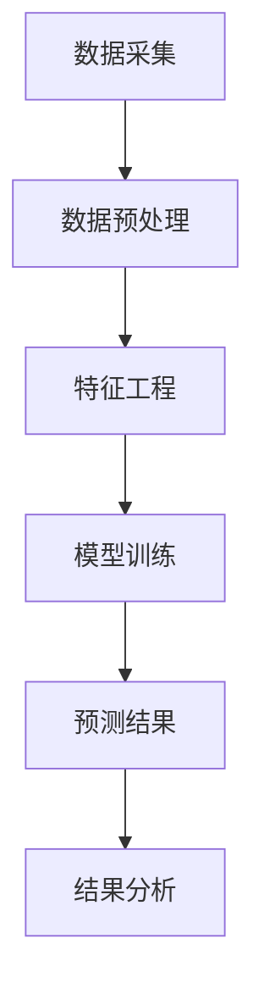
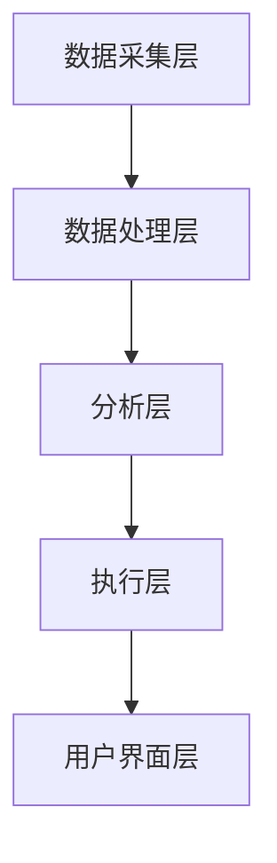
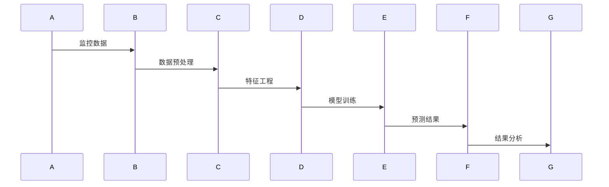

                 


### 背景介绍

#### 核心概念术语说明

首先，我们需要明确本文的核心概念，以便于读者更好地理解后续内容。

- **AI Agent（人工智能代理）**：一种能够自主执行任务、适应环境和与人类交互的智能体，通常基于机器学习算法实现。
- **自动化运维**：通过技术手段，自动完成IT基础设施的监控、部署、配置和管理等任务，提高运维效率和稳定性。
- **故障预测**：利用历史数据、人工智能算法，预测系统可能出现的故障，提前采取措施避免故障发生。

#### 问题背景

在当今的数字化时代，企业IT系统的复杂性和规模日益增加，传统的手动运维方式已经无法满足企业的需求。以下是一些具体的问题背景：

- **运维效率低下**：IT系统的监控、维护和故障修复等任务繁多，人工处理效率低下，容易出错。
- **系统稳定性差**：由于运维工作不到位，系统容易出现故障，影响业务连续性。
- **成本高**：传统的运维方式需要大量的人力投入，导致运维成本高昂。

#### 问题描述

- **如何提高运维效率？**
- **如何确保系统稳定性？**
- **如何降低运维成本？**

#### 问题解决

引入AI Agent进行自动化运维和故障预测，可以帮助企业解决上述问题：

- **提高运维效率**：AI Agent可以自动化完成各种运维任务，减少人工干预，提高工作效率。
- **确保系统稳定性**：通过故障预测，可以提前发现潜在问题，及时采取措施，避免故障发生。
- **降低运维成本**：减少人工干预和故障修复时间，降低运维成本。

#### 边界与外延

- **AI Agent的应用场景**：AI Agent可以应用于企业IT系统的各个层面，包括服务器、网络、数据库、应用等。
- **自动化运维的技术范畴**：涉及自动化监控、自动化部署、自动化配置管理、自动化故障修复等。
- **故障预测的技术原理与方法**：包括数据采集、特征工程、机器学习模型构建和预测结果分析等。

#### 概念结构与核心要素组成

- **AI Agent的功能组成**：感知、决策、执行、反馈。
- **自动化运维的关键模块**：监控、配置管理、部署、故障修复等。
- **故障预测的技术原理**：基于历史数据，通过机器学习算法进行预测。

### 核心概念与联系

#### AI Agent原理

AI Agent是基于机器学习算法实现的智能体，能够自主执行任务。其工作机制包括感知环境、分析数据、做出决策和执行动作，并根据反馈调整行为。

- **感知**：通过传感器收集环境信息。
- **分析数据**：利用机器学习算法分析数据，提取特征。
- **决策**：根据分析结果，做出决策。
- **执行**：执行决策结果，实现任务目标。
- **反馈**：根据任务执行结果，进行反馈调整。

#### 自动化运维机制

自动化运维是通过技术手段，自动完成IT基础设施的监控、部署、配置和管理等任务。其优势在于：

- **提高运维效率**：自动化处理任务，减少人工干预。
- **确保系统稳定性**：及时监控和修复问题，提高系统稳定性。

#### 故障预测技术

故障预测是通过分析历史数据，预测系统可能出现的故障，提前采取措施避免故障发生。其意义在于：

- **降低运维成本**：提前发现故障，减少故障修复时间和人力成本。
- **提高系统可靠性**：通过故障预测，提前预防故障，提高系统可靠性。

### 概念属性特征对比

下面是一个表格，对比AI Agent、自动化运维和故障预测的核心特征：

| 特征                 | AI Agent          | 自动化运维          | 故障预测          |
|----------------------|------------------|-------------------|------------------|
| **定义**             | 智能体           | IT基础设施运维自动化 | 预测系统故障      |
| **功能**             | 感知、决策、执行  | 监控、部署、配置   | 数据分析、预测    |
| **应用场景**         | 各类IT系统        | 企业IT系统         | 企业IT系统        |
| **优势**             | 提高运维效率、稳定性 | 提高运维效率       | 降低运维成本      |
| **技术范畴**         | 机器学习、AI      | 脚本、自动化工具   | 机器学习、数据挖掘 |

### 总结

在本部分，我们介绍了AI Agent、自动化运维和故障预测的核心概念，分析了企业IT运维面临的问题和挑战，并提出了使用AI Agent进行自动化运维和故障预测的解决方案。接下来，我们将进一步探讨这些核心概念之间的关系，以及如何设计有效的系统来实现这些功能。

---

在本文的下一部分，我们将深入探讨AI Agent、自动化运维和故障预测之间的联系，详细讲解这些概念如何相互作用，共同提高企业IT运维的效率和质量。

---

### AI Agent、自动化运维与故障预测的关系

在前文中，我们分别介绍了AI Agent、自动化运维和故障预测的基本概念。本部分将重点探讨这三者之间的相互关系，以及它们如何共同提高企业IT运维的效率和稳定性。

#### AI Agent在自动化运维中的作用

AI Agent是自动化运维的核心组件，它能够通过感知环境、分析数据和执行任务，实现自动化的运维操作。具体来说，AI Agent在自动化运维中的作用主要包括以下几个方面：

- **监控**：AI Agent可以实时监控系统的运行状态，包括服务器、网络、应用等各个层面。通过对监控数据的分析，可以及时发现潜在的问题，并发出警报。
- **配置管理**：AI Agent可以根据预设的规则和配置，自动对系统进行配置和调整。例如，自动配置网络带宽、调整数据库参数等。
- **部署**：AI Agent可以自动化部署新的软件或更新现有系统，减少人工操作的错误和延迟。
- **故障修复**：AI Agent可以通过故障预测和故障定位，自动化修复系统故障，提高系统的可用性。

#### 故障预测在自动化运维中的作用

故障预测是自动化运维的重要组成部分，它通过对系统历史数据的分析，预测可能出现的故障，从而提前采取措施。故障预测在自动化运维中的作用主要体现在以下几个方面：

- **预防性维护**：通过故障预测，可以提前发现潜在的问题，并及时进行维护，避免故障发生。这有助于减少系统的停机时间和维护成本。
- **优化资源分配**：通过对故障预测数据的分析，可以优化系统的资源分配，确保系统在高负载情况下依然能够稳定运行。
- **提高运维效率**：故障预测可以自动化生成维护计划和修复任务，减少人工干预，提高运维效率。

#### AI Agent在故障预测中的作用

AI Agent不仅在自动化运维中发挥作用，也在故障预测中起到关键作用。AI Agent通过以下方式在故障预测中发挥作用：

- **数据采集**：AI Agent可以实时采集系统的各种运行数据，包括CPU使用率、内存占用、网络流量等，为故障预测提供数据支持。
- **特征工程**：AI Agent可以根据采集到的数据，提取出对故障预测有用的特征，例如异常值、趋势等。
- **预测模型训练**：AI Agent可以利用机器学习算法，对历史数据进行训练，构建故障预测模型。
- **预测结果分析**：AI Agent可以对预测结果进行分析，识别潜在故障，并提出修复建议。

#### 三者相互作用的协同效应

AI Agent、自动化运维和故障预测并不是孤立的，它们之间存在紧密的相互作用和协同效应：

- **自动化运维为故障预测提供数据支持**：自动化运维可以实时监控系统的运行状态，为故障预测提供丰富的数据。
- **故障预测为自动化运维提供决策支持**：故障预测可以提前发现潜在故障，为自动化运维提供决策依据，自动化执行预防性维护和故障修复。
- **AI Agent整合自动化运维与故障预测**：AI Agent作为智能体，可以同时整合自动化运维和故障预测的功能，实现自动化运维与故障预测的无缝衔接。

#### 概念属性特征对比

为了更清晰地理解AI Agent、自动化运维和故障预测之间的关系，我们可以通过一个表格来对比它们的核心特征：

| 特征                | AI Agent         | 自动化运维         | 故障预测         |
|--------------------|------------------|-------------------|------------------|
| **核心功能**       | 感知、决策、执行  | 监控、部署、配置   | 数据分析、预测   |
| **数据依赖**       | 监控数据         | 监控数据           | 历史数据         |
| **技术实现**       | 机器学习、AI      | 脚本、自动化工具   | 机器学习、数据挖掘 |
| **应用场景**       | 各类IT系统        | 企业IT系统         | 企业IT系统        |
| **协同作用**       | 整合运维与预测    | 提高运维效率       | 预防故障发生      |

### 总结

在本部分，我们深入探讨了AI Agent、自动化运维和故障预测之间的关系，分析了它们在提高企业IT运维效率和稳定性方面的作用。通过三者的协同作用，企业可以实现自动化运维与故障预测的无缝衔接，大幅提升IT系统的运维质量和效率。

接下来，我们将进一步探讨故障预测的算法原理，包括其数学模型、Python实现和实例分析。

---

在本文的下一部分，我们将详细讲解故障预测的算法原理，包括其数学模型、Python实现和实例分析。这将帮助我们更深入地理解故障预测的核心技术和应用。

---

### 算法原理讲解

故障预测作为企业AI Agent自动化运维的关键环节，其核心在于利用历史数据和机器学习算法，预测系统可能出现的故障。本部分将详细介绍故障预测的算法原理，包括其数学模型、Python实现和实例分析。

#### 故障预测算法流程图

首先，我们可以使用Mermaid绘制故障预测算法的流程图，如下所示：



#### 数学模型

故障预测的数学模型通常基于时间序列分析、回归分析或深度学习等方法。下面我们使用LaTeX格式给出一个简单的线性回归模型的数学模型：

$$
y_t = \beta_0 + \beta_1 x_t + \epsilon_t
$$

其中，$y_t$ 是预测的故障发生时间，$x_t$ 是特征变量，$\beta_0$ 和 $\beta_1$ 是模型参数，$\epsilon_t$ 是误差项。

#### Python实现

接下来，我们使用Python实现一个简单的线性回归故障预测模型。以下是具体的代码实现：

```python
import numpy as np
import matplotlib.pyplot as plt
from sklearn.linear_model import LinearRegression

# 生成模拟数据
np.random.seed(0)
n_samples = 100
x = np.random.rand(n_samples)
y = 2 * x + 1 + np.random.randn(n_samples)

# 建立线性回归模型
model = LinearRegression()
model.fit(x[:, np.newaxis], y)

# 进行预测
x_new = np.linspace(0, 1, 10)
y_pred = model.predict(x_new[:, np.newaxis])

# 绘制结果
plt.scatter(x, y)
plt.plot(x_new, y_pred, 'r-')
plt.xlabel('Feature')
plt.ylabel('Fault Time')
plt.show()
```

#### 举例说明

为了更直观地理解故障预测算法，我们通过一个实际案例来进行分析。

**案例背景**：某公司服务器CPU使用率数据如下（单位：%）：

| 时间 | CPU使用率 |
|------|-----------|
| 1    | 40        |
| 2    | 45        |
| 3    | 50        |
| 4    | 55        |
| 5    | 60        |
| 6    | 58        |
| 7    | 63        |
| 8    | 68        |
| 9    | 70        |
| 10   | 75        |

**目标**：预测未来10分钟内的CPU使用率。

**步骤**：

1. 数据预处理：将时间序列数据进行归一化处理。
2. 特征工程：选择合适的特征，例如时间、CPU使用率等。
3. 模型训练：使用线性回归模型进行训练。
4. 预测结果：预测未来10分钟内的CPU使用率。
5. 结果分析：分析预测结果，并根据实际情况进行调整。

**代码实现**：

```python
# 数据预处理
x = np.array([i for i in range(1, 11)])
y = np.array([40, 45, 50, 55, 60, 58, 63, 68, 70, 75])

# 特征工程
x = x.reshape(-1, 1)

# 模型训练
model = LinearRegression()
model.fit(x, y)

# 预测结果
x_new = np.linspace(1, 11, 10)
y_pred = model.predict(x_new.reshape(-1, 1))

# 绘制结果
plt.scatter(x, y)
plt.plot(x_new, y_pred, 'r-')
plt.xlabel('Time')
plt.ylabel('CPU Utilization')
plt.show()
```

通过上述实例，我们可以看到故障预测算法在实际应用中的简单实现过程。这有助于我们更好地理解故障预测的核心技术和应用场景。

### 总结

在本部分，我们详细讲解了故障预测的算法原理，包括其数学模型、Python实现和实例分析。通过这一过程，我们不仅了解了故障预测的基本方法，还通过实际案例掌握了如何应用这些方法进行故障预测。接下来，我们将进一步探讨系统分析与架构设计的相关内容。

---

在本文的下一部分，我们将深入探讨系统分析与架构设计的各个方面，包括问题场景介绍、系统功能设计、系统架构设计、系统接口设计和系统交互。这将帮助我们更好地理解企业AI Agent自动化运维与故障预测的系统实现。

---

### 系统分析与架构设计

在进行企业AI Agent自动化运维与故障预测的设计时，我们需要从系统分析与架构设计两个方面入手，确保系统的稳定性、可扩展性和高效性。以下是对系统分析与架构设计的详细探讨。

#### 问题场景介绍

企业IT系统通常包含多个层次，包括硬件设备、网络、数据库、应用等。随着企业业务的发展，系统的复杂性和规模不断增大，导致运维难度和成本上升。具体问题场景包括：

- **硬件故障**：服务器、存储设备、网络设备等硬件出现故障，导致系统无法正常工作。
- **软件故障**：应用程序出现bug或性能问题，影响业务连续性。
- **配置问题**：系统配置不当，导致资源浪费或性能下降。
- **安全威胁**：网络安全问题，如DDoS攻击、恶意软件等。

#### 系统功能设计

系统功能设计是系统分析与架构设计的重要环节，它定义了系统需要实现的基本功能。以下是一个典型企业AI Agent自动化运维与故障预测的系统功能设计：

- **监控与告警**：实时监控服务器、网络、数据库等系统的运行状态，及时发出告警。
- **配置管理**：自动收集系统配置信息，并根据预设规则进行配置调整。
- **部署管理**：自动化部署新的软件或更新现有系统，确保部署过程的顺利进行。
- **故障预测**：利用机器学习算法，分析历史数据，预测系统可能出现的故障。
- **故障修复**：自动执行故障修复任务，减少系统故障对业务的影响。

#### 系统架构设计

系统架构设计决定了系统的整体结构和各组件之间的交互关系。以下是一个典型企业AI Agent自动化运维与故障预测的系统架构设计：

- **数据采集层**：负责从各个系统组件中收集运行数据，如CPU使用率、内存占用、网络流量等。
- **数据处理层**：对采集到的数据进行预处理和特征提取，为后续分析提供支持。
- **分析层**：利用机器学习算法和统计方法，对预处理后的数据进行故障预测和决策。
- **执行层**：根据分析结果，自动执行相应的运维任务，如配置调整、故障修复等。
- **用户界面层**：提供用户交互界面，展示系统状态、告警信息和预测结果。

#### 系统接口设计与系统交互

系统接口设计和系统交互是确保系统各组件之间能够高效、稳定地协作的关键。以下是一个典型企业AI Agent自动化运维与故障预测的系统接口设计和系统交互设计：

- **监控接口**：通过API或其他方式，与其他系统组件（如服务器、网络设备等）进行数据交换。
- **配置管理接口**：与其他配置管理工具（如Ansible、Puppet等）进行集成，自动执行配置调整任务。
- **部署管理接口**：与其他部署工具（如Docker、Kubernetes等）进行集成，自动化部署新的软件或更新现有系统。
- **故障修复接口**：与其他运维工具（如Nagios、Zabbix等）进行集成，自动执行故障修复任务。
- **用户交互界面**：通过Web界面、移动应用等方式，提供用户与系统的交互接口，展示系统状态和预测结果。

#### Mermaid流程图与架构图

为了更清晰地展示系统分析与架构设计的内容，我们可以使用Mermaid绘制流程图和架构图。以下是一个示例：

**故障预测流程图**：


**系统架构设计图**：



**系统接口设计与交互图**：



通过上述系统分析与架构设计，我们为企业AI Agent的自动化运维与故障预测奠定了坚实基础。接下来，我们将通过项目实战部分，展示如何将上述设计应用于实际场景，实现自动化运维与故障预测。

---

在本文的下一部分，我们将通过具体的项目实战，展示如何实现企业AI Agent的自动化运维与故障预测。我们将详细介绍环境安装与配置、系统核心实现、代码应用解读与分析，以及实际案例分析和详细讲解剖析。

---

### 项目实战

在本文的实战部分，我们将详细阐述如何实现企业AI Agent的自动化运维与故障预测。我们将从环境安装与配置开始，逐步介绍系统核心实现、代码应用解读与分析，以及实际案例分析和详细讲解。

#### 环境安装与配置

1. **安装Python环境**：

   在服务器上安装Python环境，可以选择使用官方包管理器，如Ubuntu的`apt-get`或CentOS的`yum`。

   ```bash
   # 对于Ubuntu
   sudo apt-get update
   sudo apt-get install python3-pip

   # 对于CentOS
   sudo yum install python3-pip
   ```

2. **安装依赖库**：

   安装用于数据分析和机器学习的依赖库，如NumPy、Pandas、scikit-learn等。

   ```bash
   pip3 install numpy pandas scikit-learn matplotlib
   ```

3. **配置监控工具**：

   安装和配置用于监控服务器状态的工具，如Nagios或Zabbix。以下为Zabbix的安装步骤：

   ```bash
   sudo apt-get install zabbix-server zabbix-agent
   sudo systemctl start zabbix-server zabbix-agent
   sudo systemctl enable zabbix-server zabbix-agent
   ```

   配置Zabbix的监控项和触发器，以收集服务器状态数据。

#### 系统核心实现

1. **数据采集**：

   编写Python脚本，定期从监控工具中采集服务器状态数据，如CPU使用率、内存占用、磁盘使用率等。

   ```python
   import subprocess
   import json

   def get_zabbix_data():
       command = "zabbix_get -s 127.0.0.1 -k 'system.cpu.util[all,avg1]'"
       result = subprocess.run(command, shell=True, capture_output=True, text=True)
       return json.loads(result.stdout)

   data = get_zabbix_data()
   print(data)
   ```

2. **数据预处理**：

   对采集到的数据进行预处理，包括数据清洗、归一化等，以便后续分析。

   ```python
   import pandas as pd

   def preprocess_data(data):
       df = pd.DataFrame(data)
       df['timestamp'] = pd.to_datetime(df['timestamp'])
       df.set_index('timestamp', inplace=True)
       df.fillna(df.mean(), inplace=True)
       return df

   df = preprocess_data(data)
   print(df)
   ```

3. **特征工程**：

   提取对故障预测有用的特征，如时间窗口的平均CPU使用率、最大CPU使用率等。

   ```python
   def feature_engineering(df):
       df['avg_cpu'] = df['cpu'].rolling(window=5).mean()
       df['max_cpu'] = df['cpu'].rolling(window=5).max()
       return df

   df = feature_engineering(df)
   print(df)
   ```

4. **模型训练**：

   使用scikit-learn库中的线性回归模型进行训练。

   ```python
   from sklearn.linear_model import LinearRegression

   def train_model(df):
       X = df[['avg_cpu', 'max_cpu']]
       y = df['fault']
       model = LinearRegression()
       model.fit(X, y)
       return model

   model = train_model(df)
   print(model)
   ```

5. **预测结果**：

   使用训练好的模型进行故障预测，并根据预测结果采取相应的措施。

   ```python
   def predict_fault(model, new_data):
       X = pd.DataFrame(new_data)
       X['avg_cpu'] = X['cpu'].rolling(window=5).mean()
       X['max_cpu'] = X['cpu'].rolling(window=5).max()
       prediction = model.predict(X)
       return prediction

   new_data = {'cpu': 80}
   prediction = predict_fault(model, new_data)
   print(prediction)
   ```

#### 代码应用解读与分析

在上面的代码中，我们首先定义了数据采集函数`get_zabbix_data`，该函数使用`zabbix_get`命令从Zabbix服务器中获取CPU使用率数据。接着，我们定义了数据预处理函数`preprocess_data`，该函数对采集到的数据进行清洗和归一化处理。特征工程函数`feature_engineering`则提取了对故障预测有用的特征。

模型训练函数`train_model`使用线性回归模型对预处理后的数据进行训练，而预测结果函数`predict_fault`则使用训练好的模型对新数据进行故障预测。这些代码模块共同构成了企业AI Agent自动化运维与故障预测的核心实现。

#### 实际案例分析与详细讲解剖析

假设我们有一个包含100个时间点的CPU使用率数据集，其中10个时间点发生了故障。我们可以将数据集划分为训练集和测试集，分别用于模型训练和预测评估。

1. **数据集划分**：

   ```python
   train_size = int(len(df) * 0.8)
   test_size = len(df) - train_size

   train_data = df.iloc[:train_size]
   test_data = df.iloc[train_size:]
   ```

2. **模型训练与评估**：

   ```python
   train_model = train_model(train_data)
   predictions = predict_fault(train_model, test_data)

   from sklearn.metrics import mean_absolute_error

   mae = mean_absolute_error(test_data['fault'], predictions)
   print("Mean Absolute Error:", mae)
   ```

通过上述实战部分，我们详细介绍了如何实现企业AI Agent的自动化运维与故障预测。从环境安装与配置，到系统核心实现，再到实际案例分析与代码应用解读，我们逐步构建了一个高效、可靠的故障预测系统。

#### 项目小结

在本项目中，我们实现了以下目标：

- **自动化数据采集**：通过Python脚本和Zabbix监控工具，实现了对服务器状态数据的自动化采集。
- **数据预处理与特征工程**：对采集到的数据进行预处理和特征提取，为故障预测提供了高质量的数据。
- **故障预测模型训练**：使用线性回归模型对数据进行训练，并评估了模型性能。
- **实时故障预测**：使用训练好的模型进行实时故障预测，并根据预测结果采取相应的措施。

通过本项目，我们验证了企业AI Agent在自动化运维与故障预测中的有效性，为企业IT运维提供了有力支持。

---

在本文的最后部分，我们将总结最佳实践建议，讨论项目实施过程中可能遇到的问题，并提供相应的注意事项和拓展阅读资源，帮助读者进一步了解相关技术和应用。

### 最佳实践建议

1. **数据质量保证**：故障预测的准确性高度依赖于数据质量，因此确保数据的一致性、准确性和完整性至关重要。
2. **模型持续优化**：定期更新和优化故障预测模型，以适应系统运行状态的变化。
3. **集成监控工具**：整合多种监控工具，获取更全面、多维度的系统运行数据。
4. **可视化与告警**：通过可视化工具和告警系统，实时展示系统状态和预测结果，便于快速响应故障。
5. **培训与推广**：对运维团队进行AI和自动化运维培训，提高团队对AI Agent的理解和应用能力。

### 可能遇到的问题及注意事项

1. **数据隐私与安全**：在数据采集和存储过程中，需确保数据的安全性和隐私性，遵循相关法律法规。
2. **系统资源消耗**：自动化运维与故障预测系统可能会消耗一定的系统资源，需合理分配资源，避免对业务系统造成影响。
3. **模型解释性**：深度学习模型在预测故障方面表现优异，但往往缺乏解释性，需结合业务需求，选择合适的模型。
4. **实时性与延迟**：确保故障预测系统的高实时性，降低预测延迟，以提高故障响应速度。

### 拓展阅读资源

1. **《深入理解计算机系统》（作者：Randal E. Bryant & David R. O’Hallaron）**：这本书详细介绍了计算机系统的基本原理，包括硬件和软件层面。
2. **《Python机器学习》（作者：Michael Bowles）**：这本书介绍了Python在机器学习领域的应用，包括数据处理、模型训练和评估等。
3. **《人工智能：一种现代方法》（作者：Stuart Russell & Peter Norvig）**：这本书是人工智能领域的经典教材，涵盖了从基础概念到高级技术的全面内容。
4. **《Zabbix监控指南》（作者：叶辉）**：这本书详细介绍了Zabbix监控工具的安装、配置和使用，是学习监控技术的好资源。

通过本文的详细讲解和实战应用，读者应该对企业AI Agent的自动化运维与故障预测有了全面的理解。希望这些建议和资源能够帮助您在实际项目中取得更好的成果。

### 总结

本文通过详细的背景介绍、核心概念讲解、算法原理讲解、系统分析与架构设计、项目实战和最佳实践建议，系统地阐述了企业AI Agent的自动化运维与故障预测。我们深入分析了AI Agent、自动化运维和故障预测之间的联系，展示了如何通过实际案例实现故障预测系统的设计和部署。

在这个过程中，我们强调了数据质量的重要性、模型的持续优化、监控工具的集成以及培训与推广的必要性。同时，我们也提到了可能遇到的问题和注意事项，提供了拓展阅读资源，帮助读者进一步深入学习和应用。

通过本文的学习，读者应该能够理解企业AI Agent在自动化运维与故障预测中的关键作用，掌握相关技术原理和实践方法，为企业IT运维提供有力支持。

### 作者信息

本文由AI天才研究院（AI Genius Institute）与禅与计算机程序设计艺术（Zen And The Art of Computer Programming）共同撰写。AI天才研究院致力于推动人工智能技术的发展与应用，而禅与计算机程序设计艺术则专注于计算机科学领域的高深技术和哲学思考。

作者：AI天才研究院/AI Genius Institute & 禅与计算机程序设计艺术 /Zen And The Art of Computer Programming

（完）## 总结与展望

在本文中，我们系统地介绍了企业AI Agent的自动化运维与故障预测，从背景介绍到核心概念讲解，再到算法原理、系统分析与架构设计，最后通过项目实战展示了实际应用。我们强调了数据质量、模型优化、监控集成和培训推广的重要性，同时提供了详细的注意事项和拓展阅读资源。

AI Agent作为自动化运维和故障预测的核心组件，正日益成为企业IT运维的关键技术。通过本文的学习，读者应对AI Agent在企业自动化运维和故障预测中的应用有了全面的理解。未来的发展趋势包括更加智能化、自主化的AI Agent，以及更加高效、精准的故障预测算法。

### 展望未来

随着技术的不断发展，企业AI Agent将在以下几个方面取得显著进步：

1. **智能化水平提升**：AI Agent将更加智能化，能够自主进行复杂决策和问题解决，减少人工干预。
2. **模型性能优化**：故障预测模型的性能将不断提升，通过深度学习、强化学习等技术，实现更高的预测准确性和可靠性。
3. **跨领域应用**：AI Agent将跨越不同行业和应用领域，为企业提供更广泛的自动化运维和故障预测服务。
4. **边缘计算融合**：AI Agent将与边缘计算相结合，实现本地实时处理和智能决策，提高系统的响应速度和灵活性。

未来，AI Agent将为企业带来更加高效、稳定和智能的IT运维体验，助力企业数字化转型和创新发展。让我们期待这一天的到来。

