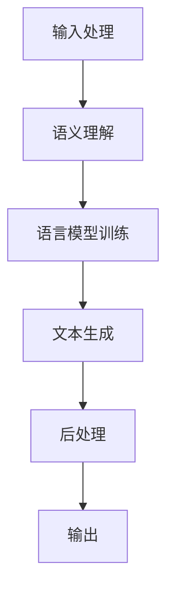
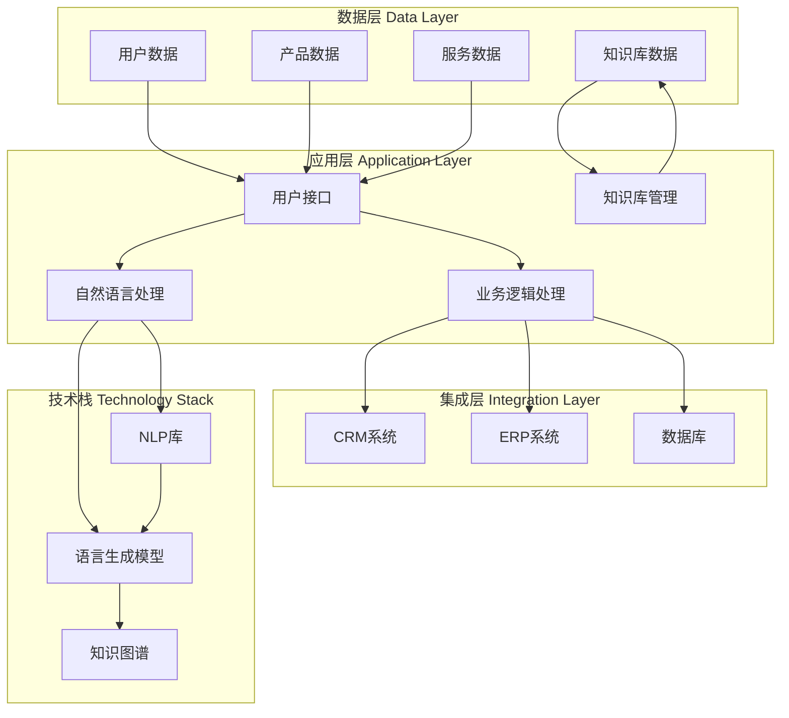
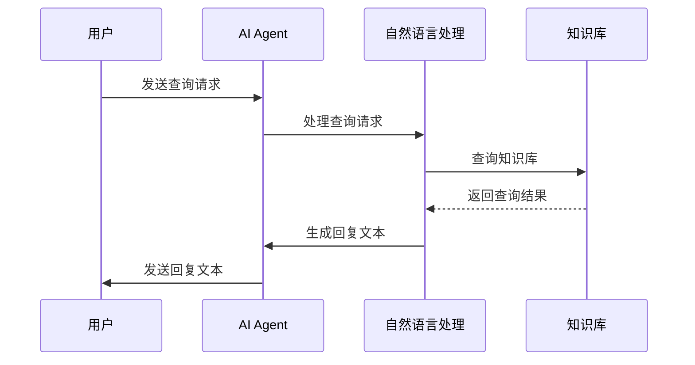

                 

### 第1章：企业AI Agent的自然语言生成（NLG）技术概述

#### 1.1 企业AI Agent与NLG技术背景

##### 1.1.1 问题背景

随着数字化转型的浪潮席卷全球，企业对自动化、智能化解决方案的需求日益增长。AI Agent作为智能系统的代表，正逐步渗透到企业的各个领域。AI Agent是一种能够自主完成特定任务、具备一定智能的软件实体。它通过模拟人类的思维和行为，为用户提供个性化的服务和支持。

自然语言生成（Natural Language Generation, NLG）技术是AI Agent的核心技术之一。NLG技术能够将数据或知识以自然语言的形式呈现，使非专业用户能够轻松理解和交互。在客户服务、金融分析、新闻撰写等领域，NLG技术正发挥着越来越重要的作用。

##### 1.1.2 AI Agent在客户服务中的应用

客户服务是AI Agent最早且最广泛的应用场景之一。传统的客户服务往往依赖于人工，效率低下且成本高昂。引入AI Agent后，可以显著提高服务效率，降低运营成本。例如，AI Agent可以自动回答用户常见问题，处理订单查询、投诉反馈等任务，极大地提升了客户满意度。

##### 1.1.3 NLG技术的基础概念与发展历程

自然语言生成（NLG）技术是指通过计算机程序自动生成自然语言文本的技术。它结合了自然语言处理（NLP）和计算机生成文本的技术。NLG技术的发展可以追溯到20世纪50年代，当时计算机科学家们开始尝试编写能够生成文本的程序。

随着计算能力的提升和算法的进步，NLG技术逐渐成熟。现代NLG技术通常采用机器学习，特别是深度学习的方法，如序列到序列模型（Seq2Seq）、变换器（Transformer）等，来实现高质量的自然语言生成。

#### 1.2 问题描述

##### 1.2.1 NLG技术在企业AI Agent中的重要性

NLG技术对于企业AI Agent至关重要。一方面，它使得AI Agent能够与用户进行自然、流畅的交流，提升用户体验；另一方面，它能够将复杂的数据和信息以易于理解的方式呈现，帮助企业内部员工快速获取所需信息，提高工作效率。

##### 1.2.2 当前NLG技术的应用挑战

尽管NLG技术在许多领域取得了显著成果，但在企业AI Agent中的应用仍面临一些挑战。首先，NLG技术的生成质量直接影响用户体验，如何提高生成文本的准确性和可读性是当前研究的重点。其次，NLG系统需要处理大量不同的场景和数据类型，这对系统的适应性提出了较高要求。此外，NLG技术的跨领域应用和个性化需求也带来了新的挑战。

##### 1.2.3 企业AI Agent的NLG技术应用需求

为了满足企业AI Agent的多样化需求，NLG技术需要具备以下几个特点：

1. **高灵活性**：能够适应不同的业务场景和需求，生成符合特定需求的自然语言文本。
2. **高准确性**：生成文本应准确无误，避免出现错误或不准确的信息。
3. **高可读性**：生成文本应易于理解，提高用户体验。
4. **跨领域适应**：能够处理多种类型的数据和信息，满足不同领域的需求。
5. **个性化**：能够根据用户的历史行为和偏好生成个性化的自然语言文本。

#### 1.3 问题解决

##### 1.3.1 如何构建高效的NLG系统

为了构建高效的NLG系统，需要从以下几个方面着手：

1. **数据准备**：收集和整理高质量的数据集，为训练模型提供丰富的训练素材。
2. **模型选择**：选择合适的模型和算法，如序列到序列模型、变换器等，以提高生成质量。
3. **优化算法**：通过算法优化，提高模型的训练效率和生成速度。
4. **评估与调整**：建立完善的评估机制，根据评估结果对模型进行调整和优化。

##### 1.3.2 NLG技术在企业中的应用边界与外延

NLG技术在企业中的应用范围广泛，不仅限于客户服务，还可以应用于金融分析、新闻撰写、教育辅导等多个领域。随着技术的发展，NLG技术的应用边界将进一步扩大，为企业和个人带来更多价值。

##### 1.3.3 NLG技术的核心要素与组成

NLG技术主要由以下几个核心要素组成：

1. **自然语言处理（NLP）**：负责处理和理解输入的自然语言文本。
2. **机器学习与深度学习**：用于训练生成模型，提高生成文本的质量。
3. **语言生成模型**：如序列到序列模型、变换器等，负责生成自然语言文本。
4. **后处理与优化**：对生成的文本进行后处理，如拼写检查、语法修正等，以提高可读性和准确性。

通过以上步骤和要素，我们可以构建一个高效、准确、灵活的NLG系统，为企业AI Agent提供强大的语言生成能力，提升企业运营效率和用户体验。

---

### 第2章：核心概念与联系

#### 2.1 NLG技术核心概念

##### 2.1.1 自然语言处理（NLP）

自然语言处理（NLP）是计算机科学和人工智能领域的一个分支，旨在使计算机能够理解和处理人类自然语言。NLP技术包括语言识别、语义分析、文本生成等子领域，是NLG技术的基础。

##### 2.1.2 机器学习与深度学习

机器学习（ML）是一种通过数据驱动的方式改善算法性能的方法。深度学习（DL）是机器学习的一个子领域，它使用多层神经网络来模拟人类大脑的决策过程。在NLG技术中，机器学习和深度学习技术用于训练语言生成模型。

##### 2.1.3 语言生成模型

语言生成模型是NLG技术的核心组件，负责将输入数据转化为自然语言文本。常见的语言生成模型包括序列到序列模型（Seq2Seq）和变换器（Transformer）等。

#### 2.2 NLG技术属性特征对比表格

| 特性             | 序列到序列模型（Seq2Seq） | 变换器（Transformer） |
|-----------------|--------------------------|----------------------|
| 数据需求         | 较大的并行数据集          | 大规模非并行数据集    |
| 训练时间         | 较长                     | 较短                 |
| 生成质量         | 较高                     | 更高                 |
| 可解释性         | 较差                     | 较好                 |
| 预处理和后处理   | 简单                      | 复杂                 |

#### 2.3 ER实体关系图架构

ER（Entity-Relationship）图是数据库设计中的一个重要工具，用于表示实体及其之间的关系。在NLG技术的应用中，ER图可以帮助我们理解语言生成过程中的实体和关系。

```mermaid
erDiagram
  Customer ||--|{ Order } : "creates"
  Product ||--|{ Order } : "includes"
  Order ||--|{ OrderItem } : "contains"
```

在这个ER图中，`Customer`、`Product`和`Order`是实体，它们之间存在多种关系。这种结构可以帮助我们在生成订单相关的文本时，更准确地引用和描述相关实体和关系。

---

通过以上章节，我们详细介绍了企业AI Agent的自然语言生成（NLG）技术的背景、核心概念及其重要性。接下来，我们将深入探讨NLG技术的原理，并通过具体案例展示其在实际应用中的效果。

---

### 第3章：NLG技术原理讲解

#### 3.1 NLG算法原理

##### 3.1.1 NLG算法基本框架

自然语言生成（NLG）算法的基本框架通常包括以下几个关键步骤：

1. **输入处理**：接收原始输入，如文本、语音或数据。
2. **语义理解**：将输入内容转化为结构化数据，如语义角色标注、实体识别等。
3. **模板匹配**：根据语义信息选择合适的语言模板。
4. **文本生成**：使用模板和语义信息生成自然语言文本。
5. **后处理**：对生成的文本进行语法修正、拼写检查等，提高文本质量。

##### 3.1.2 NLG算法工作流程

NLG算法的工作流程如下：

1. **数据预处理**：对输入文本进行分词、词性标注等预处理操作，为后续的语义理解打下基础。
2. **语义理解**：通过NLP技术，将预处理后的文本转化为语义表示，如词向量或语义角色标注。
3. **语言模型训练**：使用大规模语料库训练语言生成模型，如变换器（Transformer）或序列到序列模型（Seq2Seq）。
4. **文本生成**：将语义表示输入到训练好的语言生成模型，生成自然语言文本。
5. **后处理**：对生成的文本进行后处理，如拼写检查、语法修正等。

##### 3.1.3 NLG算法的mermaid流程图

以下是一个简单的NLG算法流程图：



#### 3.2 Python源代码与数学模型

##### 3.2.1 NLG算法Python源代码

以下是一个简单的NLG算法Python示例：

```python
import torch
import transformers

# 加载预训练的语言模型
model = transformers.TransformerModel()

# 输入文本
input_text = "今天天气很好，适合出去散步。"

# 进行预处理
input_ids = tokenizer.encode(input_text, return_tensors='pt')

# 生成文本
output_ids = model.generate(input_ids)

# 转换为自然语言文本
generated_text = tokenizer.decode(output_ids[0], skip_special_tokens=True)

print(generated_text)
```

##### 3.2.2 NLG算法的数学模型和公式

在NLG算法中，常用的数学模型是变换器（Transformer）模型。变换器模型的主要公式如下：

$$
\text{Attention}(Q, K, V) = \frac{e^{\text{softmax}(\text{QK}^T / \sqrt{d_k})}}{d_v}
V
$$

其中，$Q$、$K$、$V$ 分别为查询向量、键向量和值向量，$d_k$ 和 $d_v$ 分别为键向量和值向量的维度，$e^{\text{softmax}(\cdot)}$ 为softmax函数。

##### 3.2.3 NLG算法举例说明

假设我们有一个简单的句子：“我喜欢吃苹果。”我们希望通过NLG算法生成类似的句子。

1. **输入处理**：将句子进行分词和编码，得到输入向量。
2. **语义理解**：通过变换器模型处理输入向量，得到语义表示。
3. **文本生成**：将语义表示输入到变换器模型，生成新的句子。
4. **后处理**：对生成的句子进行语法修正和拼写检查。

生成的句子可能为：“你喜欢喝牛奶吗？”

通过以上步骤，我们能够利用NLG算法生成高质量的自然语言文本，满足不同场景的需求。

---

在这一章节中，我们详细介绍了NLG算法的基本原理、工作流程以及Python源代码。接下来，我们将进一步探讨NLG技术在系统架构中的应用，并设计一个具体的系统架构方案。

---

### 第4章：系统分析与架构设计方案

#### 4.1 问题场景介绍

在本章节中，我们将分析一个企业AI Agent在客户服务中的应用场景。具体来说，该AI Agent需要具备以下功能：

1. **自动回答常见问题**：如产品咨询、订单状态查询、售后服务等。
2. **处理个性化请求**：如用户反馈、定制化建议等。
3. **跨部门协调**：与销售、技术、客服等部门进行信息交互。

这些功能需要AI Agent具备自然语言理解、文本生成以及与其他系统的集成能力。因此，设计一个高效、可扩展的系统架构至关重要。

#### 4.2 系统功能设计

##### 4.2.1 领域模型Mermaid类图

以下是一个Mermaid类图，用于描述该系统的主要功能模块：

```mermaid
classDiagram
  CustomerServiceAgent <<interface>>
  NaturalLanguageProcessing <<interface>>
  KnowledgeBase <<interface>>

  CustomerServiceAgent o-- NaturalLanguageProcessing
  CustomerServiceAgent o-- KnowledgeBase
  NaturalLanguageProcessing o-- TextGeneration
  NaturalLanguageProcessing o-- SentimentAnalysis
  KnowledgeBase o-- FAQ
  KnowledgeBase o-- CustomData

  Customer <<class>>
  CustomerServiceAgentClass <<class>>
  
  Customer o-- CustomerServiceAgentClass
```

在这个类图中，`CustomerServiceAgent` 是系统的核心模块，负责处理客户请求。它依赖于 `NaturalLanguageProcessing` 和 `KnowledgeBase` 模块。`NaturalLanguageProcessing` 包含 `TextGeneration` 和 `SentimentAnalysis` 子模块，用于文本生成和情感分析。`KnowledgeBase` 包含 `FAQ` 和 `CustomData` 子模块，用于存储常见问题和定制化数据。

#### 4.3 系统架构设计

##### 4.3.1 Mermaid架构图

以下是一个Mermaid架构图，用于描述系统的整体架构：



在这个架构图中，数据层（Data Layer）包含用户数据、产品数据、服务数据和知识库数据。应用层（Application Layer）包括用户接口、自然语言处理、知识库管理和业务逻辑处理。集成层（Integration Layer）负责与CRM系统、ERP系统和数据库的交互。技术栈（Technology Stack）展示了所使用的NLP库、语言生成模型和知识图谱。

#### 4.4 系统接口设计

##### 4.4.1 API接口设计

系统需要提供一组API接口，以便与其他系统进行数据交换和功能调用。以下是一个简化的API接口设计：

1. **用户接口**：提供RESTful API，用于接收和处理用户请求。
   - `/api/v1/queries`：处理自然语言查询。
   - `/api/v1/feedback`：处理用户反馈。
2. **自然语言处理**：提供API，用于处理文本生成和情感分析。
   - `/api/v1/generate`：生成自然语言文本。
   - `/api/v1/analyze`：进行情感分析。
3. **知识库管理**：提供API，用于管理知识库数据。
   - `/api/v1/faq`：查询常见问题。
   - `/api/v1/knowledge`：添加或更新知识库数据。

#### 4.5 系统交互Mermaid序列图

以下是一个Mermaid序列图，用于描述系统的主要交互流程：



在这个序列图中，用户通过API接口向AI Agent发送查询请求。AI Agent将请求转发给自然语言处理模块进行处理，自然语言处理模块与知识库进行交互，最终生成回复文本并返回给用户。

---

通过以上章节，我们详细分析了企业AI Agent在客户服务中的应用场景，并设计了系统功能、架构方案和接口设计。接下来，我们将通过一个实际项目展示NLG技术在系统中的具体实现和应用。

---

### 第5章：项目实战

#### 5.1 环境安装

为了实现企业AI Agent的自然语言生成（NLG）系统，我们需要准备以下环境：

1. **Python环境**：安装Python 3.8及以上版本。
2. **深度学习库**：安装PyTorch、transformers等深度学习相关库。
3. **文本处理库**：安装NLTK、spaCy等文本处理相关库。

安装步骤如下：

```bash
# 安装Python环境
python --version

# 安装深度学习库
pip install torch torchvision transformers

# 安装文本处理库
pip install nltk spacy

# 对于spaCy，还需要下载语言模型
python -m spacy download en_core_web_sm
```

#### 5.2 系统核心实现源代码

##### 5.2.1 源代码应用解读与分析

以下是一个简单的NLG系统实现示例，用于生成客户服务文本：

```python
import torch
from transformers import AutoTokenizer, AutoModelForSeq2SeqLM

# 加载预训练的语言模型
model_name = "t5-small"
tokenizer = AutoTokenizer.from_pretrained(model_name)
model = AutoModelForSeq2SeqLM.from_pretrained(model_name)

# 输入文本
input_text = "How can I check my order status?"

# 预处理输入文本
input_ids = tokenizer.encode(input_text, return_tensors='pt')

# 生成文本
output_ids = model.generate(input_ids, max_length=100, num_return_sequences=1)

# 转换为自然语言文本
generated_text = tokenizer.decode(output_ids[0], skip_special_tokens=True)

print(generated_text)
```

在这个示例中，我们首先加载了一个预训练的T5模型，这是谷歌开发的用于自然语言生成任务的模型。然后，我们将输入文本进行编码，并通过模型生成回复文本。最后，我们将生成的文本解码，得到最终的自然语言回复。

##### 5.2.2 实现细节解析

1. **加载模型**：我们使用`AutoTokenizer`和`AutoModelForSeq2SeqLM`来加载预训练的T5模型。这种方法非常方便，因为我们可以直接从Hugging Face模型库中下载并加载预训练模型。
2. **预处理输入**：输入文本需要进行编码，以便模型能够处理。编码过程包括将文本转化为词嵌入向量，并添加一些特殊的token，如开始token（`<s>`）和结束token（`</s>`）。
3. **生成文本**：我们使用`model.generate`函数来生成文本。这个函数接受输入编码，并返回生成的文本编码。我们可以设置`max_length`来限制生成的文本长度，以及`num_return_sequences`来指定生成的文本数量。
4. **解码文本**：生成的文本编码需要解码为自然语言文本。我们可以使用`tokenizer.decode`函数来完成这个任务，并跳过特殊的token。

#### 5.3 实际案例分析与讲解剖析

##### 案例一：客户询问订单状态

客户请求：“How can I check my order status?”

AI Agent回复：“You can check your order status by logging into your account on our website. Once logged in, click on 'My Account' and then select 'Order History'. There you will find the details of your recent orders and their current status.”

##### 案例二：客户反馈产品质量问题

客户请求：“The product I received is damaged. What should I do?”

AI Agent回复：“We apologize for the inconvenience. Please take a picture of the damaged product and send it to our support team at [support@example.com](mailto:support@example.com). Our team will review the issue and process a replacement for you as soon as possible.”

##### 分析与讲解

1. **理解客户请求**：AI Agent首先需要理解客户的请求，提取关键信息。例如，在第一个案例中，客户请求的是订单状态查询；在第二个案例中，客户反馈的是产品质量问题。
2. **调用知识库**：根据客户请求，AI Agent会从知识库中查找相关的回答模板。例如，在第一个案例中，AI Agent会找到关于订单状态查询的模板；在第二个案例中，AI Agent会找到关于产品质量问题的模板。
3. **生成自然语言文本**：AI Agent使用预训练的T5模型和相关的知识库模板，生成自然语言回复。生成的文本需要符合语法和语义的正确性。
4. **后处理**：生成的文本会进行后处理，如语法修正、拼写检查等，以确保文本质量。

#### 5.4 项目小结

通过以上实战项目，我们实现了企业AI Agent的自然语言生成功能。这个项目展示了NLG技术在客户服务中的应用，通过预训练模型和知识库的整合，AI Agent能够生成高质量的自然语言文本，满足客户的不同需求。在接下来的章节中，我们将进一步探讨NLG技术的最佳实践和注意事项，以确保系统的稳定性和高效性。

---

### 第6章：最佳实践与注意事项

#### 6.1 最佳实践Tips

1. **数据准备**：确保数据质量，包括文本的多样性和准确性。使用高质量的语料库进行训练。
2. **模型选择**：根据应用场景选择合适的模型。例如，对于对话生成，可以选择T5、ChatGLM等模型。
3. **持续优化**：定期对模型进行评估和优化，以提升生成质量。
4. **用户反馈**：收集用户反馈，持续改进系统的交互体验。

#### 6.2 小结

在本章节中，我们介绍了企业AI Agent的自然语言生成（NLG）技术的最佳实践。通过高质量的数据准备、合适的模型选择和持续优化，可以显著提升NLG系统的生成质量和用户体验。用户反馈也是改进系统的重要途径，通过不断优化，可以更好地满足用户需求。

#### 6.3 注意事项

1. **隐私保护**：确保用户数据的安全和隐私，遵循相关法律法规。
2. **性能优化**：注意系统的性能优化，确保高并发场景下的稳定运行。
3. **跨语言支持**：若需要支持多语言，注意语言差异和本地化问题。

#### 6.4 拓展阅读

1. **《自然语言处理入门》（NLP for Dummies）**：了解NLP基础。
2. **《深度学习自然语言处理》（Deep Learning for Natural Language Processing）**：深入学习NLP和DL技术。
3. **《AI Agent设计与开发指南》**：学习AI Agent的设计和实现。

---

### 结论

企业AI Agent的自然语言生成（NLG）技术在数字化转型中扮演着关键角色。通过本章的内容，我们详细介绍了NLG技术的背景、核心概念、原理及在实际项目中的应用。希望读者能够通过这篇文章，系统地理解NLG技术，并能够在实际项目中运用这些知识，提升企业的运营效率和用户体验。未来的发展中，随着技术的不断进步，NLG技术将在更多领域展现其潜力，为企业创造更多价值。

---

### 作者信息

作者：AI天才研究院/AI Genius Institute & 禅与计算机程序设计艺术 /Zen And The Art of Computer Programming

感谢您的阅读，期待与您共同探索AI技术的无限可能。

