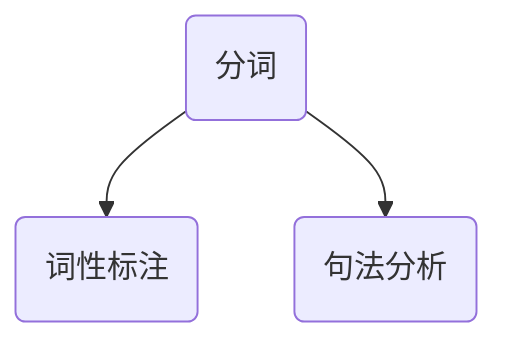
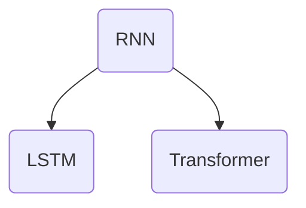
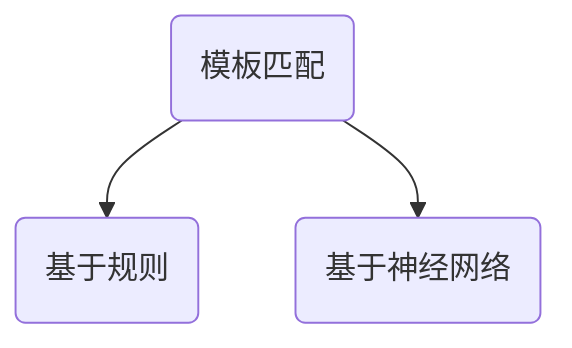
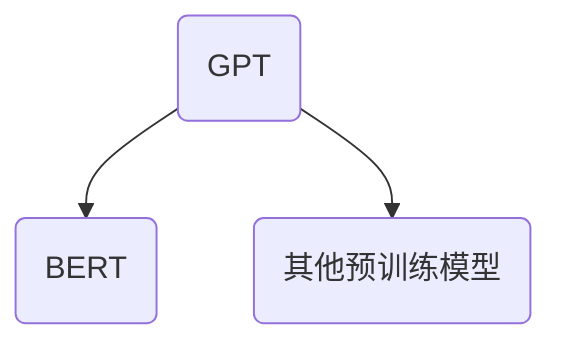
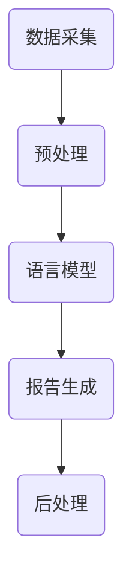
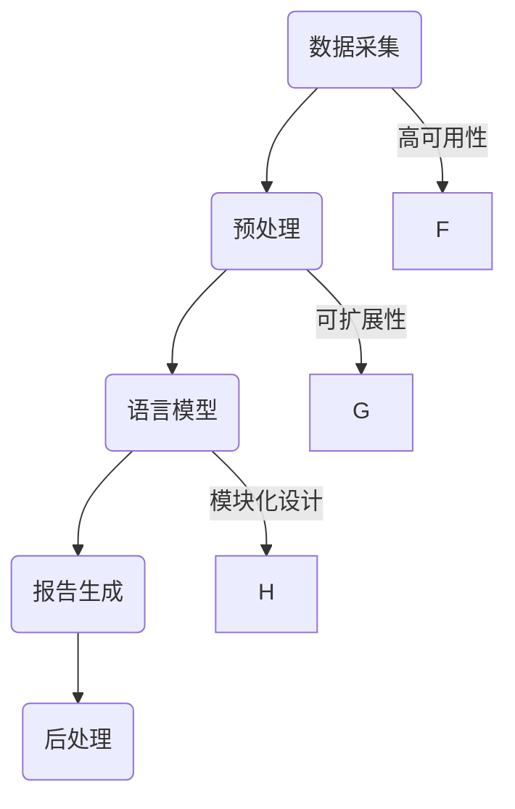

                 

## 《企业AI Agent的自然语言生成(NLG)报告系统》

### 关键词
- 企业AI
- 自然语言生成（NLG）
- 报告系统
- 人工智能代理
- 技术架构
- 算法实现
- 系统评估

### 摘要
本文深入探讨了企业AI Agent的自然语言生成（NLG）报告系统，旨在为企业提供一种高效、智能的自动报告生成解决方案。通过对NLG技术的介绍、系统架构的详细解析、开发与实现流程的阐述，以及实际案例的分析，本文全面展示了如何构建一个功能强大、易于维护的NLG报告系统。文章还提出了最佳实践和未来研究方向，为企业在AI技术应用上提供了有益的参考。

## 引言

随着人工智能（AI）技术的快速发展，企业AI Agent逐渐成为自动化流程和智能决策的重要工具。这些AI Agent能够执行各种复杂任务，从数据分析到客户服务，极大地提高了企业的效率和竞争力。然而，AI Agent在处理大量数据和信息时，生成的报告往往难以直观地传达其内容，特别是在需要与人类进行交流的场景中。

自然语言生成（NLG）技术为解决这一问题提供了强有力的支持。NLG是一种利用计算机程序生成自然语言文本的技术，能够将复杂的数据和分析结果转化为易于理解的自然语言报告。这对于企业来说，不仅提高了报告的透明度和可操作性，还能够减少人工编写报告的时间和成本。

本文将重点讨论企业AI Agent的NLG报告系统，包括其核心概念、技术基础、系统架构设计、开发与实现流程、评估与测试方法，以及实际案例。通过本文的阅读，读者将能够全面了解NLG报告系统的构建过程，并掌握相关的技术要点和实践经验。

## 第一部分: NLG基础理论

### 第1章: 自然语言生成概述

#### 1.1 核心概念与术语

**自然语言生成（NLG）**：NLG是一种利用计算机程序生成自然语言文本的技术，旨在模拟人类语言的流畅性和准确性。

**语言模型**：语言模型是NLG系统的基础，它通过学习大量文本数据，预测下一个单词或短语，从而生成连贯的文本。

**语法生成器**：语法生成器负责根据语言模型生成的单词和短语，构建符合语法规则的句子。

**词汇表**：词汇表包含了NLG系统所使用的词汇和短语，它是生成自然语言文本的基础。

**语义分析**：语义分析是NLG系统的重要功能，它通过理解文本的语义内容，确保生成的文本符合实际意义。

#### 1.2 问题背景与问题描述

在当今的企业环境中，大量的数据和分析结果需要以报告的形式呈现。然而，传统的报告生成方式往往依赖于人工编写，不仅效率低下，而且容易出现错误。此外，随着数据的复杂性和多样性的增加，人工编写报告的难度和成本也在不断上升。

NLG技术的引入，为解决这一问题提供了新的途径。通过自动生成报告，企业能够更快速、更准确地传达信息，提高工作效率和决策质量。

#### 1.3 问题解决与系统目标

NLG报告系统的目标是实现以下功能：

1. **自动化报告生成**：系统能够自动从数据源中提取信息，生成格式统一的报告。
2. **文本流畅性和准确性**：系统生成的报告应具有流畅自然的语言表达，确保信息传达的准确性和清晰度。
3. **适应性和可扩展性**：系统能够适应不同的报告格式和需求，支持多种数据源的接入和集成。

#### 1.4 边界与外延

**边界**：NLG报告系统应限于生成文本报告，不包括图表、图像等其他媒体形式。

**外延**：系统应能够支持多语言生成，适应不同地区和语言环境的需求。

#### 1.5 核心概念构成

**语言模型**、**语法生成器**、**词汇表**、**语义分析**是NLG报告系统的核心概念，它们共同作用，实现自动生成自然语言文本的目标。

## 第二部分: 技术基础

### 第2章: 技术基础与相关算法

#### 2.1 自然语言处理（NLP）

**NLP** 是NLG系统的基础技术之一，它涉及文本的预处理、词义解析、语法分析等任务。NLP技术包括以下核心算法：

1. **分词**：将文本分割成单个词汇或词组。
2. **词性标注**：为每个词汇分配词性（名词、动词、形容词等）。
3. **句法分析**：分析句子的结构，确定词汇之间的关系。

**示例**：


#### 2.2 生成式语言模型

生成式语言模型是NLG系统的核心，它通过学习大量文本数据，预测下一个单词或短语。常见的生成式语言模型包括：

1. **循环神经网络（RNN）**：能够处理序列数据，适用于文本生成。
2. **长短期记忆网络（LSTM）**：改进了RNN，解决了长时依赖问题。
3. **变换器（Transformer）**：基于自注意力机制，显著提升了文本生成效果。

**示例**：


#### 2.3 报告生成算法

报告生成算法是将数据和语言模型结合，生成自然语言报告的过程。常见的报告生成算法包括：

1. **模板匹配**：通过预定义的模板，将数据填充到模板中生成报告。
2. **基于规则的生成**：利用语法规则和模板生成报告。
3. **基于神经网络的生成**：利用神经网络模型生成报告。

**示例**：


#### 2.4 数据集与预训练模型

**数据集**：NLG系统的性能依赖于训练数据的质量和数量。常用的数据集包括新闻文章、对话文本、报告文本等。

**预训练模型**：通过在大规模数据集上预训练，预训练模型能够获得较强的语言理解能力和生成能力。常见的预训练模型包括GPT、BERT等。

**示例**：


## 第三部分: 系统架构设计

### 第3章: 系统架构设计

#### 3.1 系统功能模块

NLG报告系统包括以下主要功能模块：

1. **数据采集模块**：从各种数据源（如数据库、API接口等）采集数据。
2. **预处理模块**：对采集到的数据进行分析、清洗和格式化。
3. **语言模型模块**：加载预训练的语言模型，用于文本生成。
4. **报告生成模块**：根据预定义的模板和规则，生成自然语言报告。
5. **后处理模块**：对生成的报告进行格式化、排版和校对。

**示例**：


#### 3.2 系统架构设计

NLG报告系统的架构设计需要考虑以下几个方面：

1. **高可用性**：系统应能够处理高并发请求，确保报告生成的稳定性和可靠性。
2. **可扩展性**：系统应支持横向扩展，以便在数据量增加时进行扩展。
3. **模块化设计**：系统模块应相互独立，便于维护和升级。

**示例**：


## 第四部分: 开发与实现

### 第4章: 开发与实现

#### 4.1 开发环境准备

在开始开发之前，需要准备以下开发环境：

1. **操作系统**：Linux或MacOS。
2. **编程语言**：Python。
3. **深度学习框架**：TensorFlow或PyTorch。
4. **版本控制**：Git。

#### 4.2 数据采集与预处理

**数据采集**：使用API接口或数据库连接方式，从各种数据源采集数据。

**预处理**：对采集到的数据进行清洗、去重、格式转换等操作。

```python
# 示例代码：数据预处理
def preprocess_data(data):
    # 数据清洗
    cleaned_data = [d for d in data if not any(char.isdigit() for char in d)]
    # 数据格式转换
    formatted_data = [' '.join(word for word in d.split()) for d in cleaned_data]
    return formatted_data
```

#### 4.3 语言模型训练与加载

**训练**：使用预训练的模型（如GPT）进行微调，使其适应报告生成任务。

**加载**：将训练好的模型加载到系统中，用于文本生成。

```python
# 示例代码：加载预训练模型
from transformers import GPT2LMHeadModel, GPT2Tokenizer

model_name = "gpt2"
tokenizer = GPT2Tokenizer.from_pretrained(model_name)
model = GPT2LMHeadModel.from_pretrained(model_name)

# 微调模型
model.train()
# ... 进行训练 ...
model.eval()
```

#### 4.4 报告生成与后处理

**生成**：根据数据和语言模型，生成自然语言报告。

**后处理**：对生成的报告进行格式化、排版和校对。

```python
# 示例代码：报告生成
def generate_report(data, model, tokenizer):
    inputs = tokenizer.encode(data, return_tensors='pt')
    outputs = model.generate(inputs, max_length=50, num_return_sequences=1)
    report = tokenizer.decode(outputs[0], skip_special_tokens=True)
    return report
```

```python
# 示例代码：报告后处理
def postprocess_report(report):
    # 格式化
    formatted_report = "<h1>报告标题</h1><p>{}</p>".format(report)
    # 排版
    styled_report = markdown2.markdown(formatted_report)
    # 校对
    corrected_report = correct_text(styled_report)
    return corrected_report
```

## 第五部分: 评估与测试

### 第5章: 评估与测试

#### 5.1 评估指标

在评估NLG报告系统时，常用的指标包括：

1. **BLEU评分**：基于参考文本，评估生成文本的相似度。
2. **ROUGE评分**：基于词簇的匹配，评估生成文本的连贯性。
3. **F1分数**：结合精确率和召回率，评估生成文本的准确性和完整性。

#### 5.2 测试方法

**自动化测试**：使用测试框架（如pytest）编写自动化测试脚本，对系统进行功能测试和性能测试。

```python
# 示例代码：自动化测试
import pytest

def test_report_generation():
    data = "2023年Q1销售数据"
    report = generate_report(data, model, tokenizer)
    assert "2023年Q1" in report
    assert "销售数据" in report
```

**手动评估**：邀请领域专家对生成报告进行评估，从可读性、准确性和实用性等方面进行评分。

#### 5.3 性能优化

**优化算法**：对语言模型和生成算法进行优化，提高生成文本的质量。

**并行处理**：利用多线程或多进程，提高系统处理速度和并发能力。

```python
# 示例代码：并行处理
from concurrent.futures import ThreadPoolExecutor

def generate_reports_in_parallel(data_list, model, tokenizer):
    with ThreadPoolExecutor(max_workers=5) as executor:
        futures = [executor.submit(generate_report, data, model, tokenizer) for data in data_list]
        reports = [future.result() for future in futures]
    return reports
```

## 第六部分: 案例研究

### 第6章: 案例研究

#### 6.1 案例背景

某大型零售企业需要定期生成销售报告，以便管理层了解销售情况和市场趋势。然而，人工编写报告不仅耗时耗力，而且容易出现错误。为了提高报告生成的效率和质量，企业决定采用NLG报告系统。

#### 6.2 系统实施

企业选择了基于Transformer的语言模型，并使用Python和TensorFlow进行了开发。系统包括以下主要模块：

1. **数据采集模块**：从企业内部数据库和外部市场报告中获取数据。
2. **预处理模块**：对采集到的数据进行清洗和格式化。
3. **语言模型模块**：使用预训练的Transformer模型，进行微调和生成报告。
4. **报告生成模块**：根据数据生成自然语言报告。
5. **后处理模块**：对生成的报告进行格式化、排版和校对。

#### 6.3 案例结果

实施NLG报告系统后，企业取得了显著的效果：

1. **报告生成速度**：从原来的每周几小时缩短到几分钟。
2. **报告准确性**：减少了人工错误，提高了报告的可靠性。
3. **可读性**：生成的报告更加清晰、易懂，便于管理层快速决策。
4. **成本节省**：减少了人工编写报告的成本。

## 第七部分: 最佳实践与未来方向

### 第7章: 最佳实践与未来方向

#### 7.1 最佳实践

1. **数据准备**：确保数据的质量和多样性，为语言模型提供丰富的训练资源。
2. **模型选择**：根据应用场景选择合适的语言模型，并进行微调。
3. **系统优化**：利用并行处理和分布式计算，提高系统的性能和效率。
4. **用户反馈**：收集用户反馈，不断优化生成文本的质量和可读性。

#### 7.2 未来方向

1. **跨模态生成**：结合文本、图像、音频等多模态数据，生成更加丰富和生动的报告。
2. **动态报告**：根据实时数据动态更新报告内容，提供实时决策支持。
3. **个性化生成**：根据用户需求和偏好，生成个性化报告。
4. **多语言支持**：扩展系统支持多种语言，满足全球化业务需求。

## 结论

企业AI Agent的自然语言生成（NLG）报告系统为企业提供了一种高效、智能的自动报告生成解决方案。通过本文的介绍，读者了解了NLG报告系统的核心概念、技术基础、系统架构设计、开发与实现流程，以及实际案例。本文还提出了最佳实践和未来研究方向，为企业在AI技术应用上提供了有益的参考。随着NLG技术的不断发展和完善，未来企业将能够更加智能化地处理数据，提高决策效率和竞争力。

### 附录：术语表

- **自然语言生成（NLG）**：一种利用计算机程序生成自然语言文本的技术。
- **语言模型**：用于预测下一个单词或短语的概率分布的数学模型。
- **语法生成器**：将语言模型生成的单词和短语转换为符合语法规则的句子的程序。
- **词性标注**：为文本中的每个词分配词性（名词、动词、形容词等）的过程。
- **句法分析**：分析文本的语法结构，确定词汇之间的语法关系。
- **分词**：将文本分割成单个词汇或词组的过程。
- **BLEU评分**：一种基于参考文本，评估生成文本相似度的评分方法。
- **ROUGE评分**：一种基于词簇匹配，评估生成文本连贯性的评分方法。
- **F1分数**：结合精确率和召回率，评估生成文本准确性和完整性的评分指标。

### 作者信息

**作者**：AI天才研究院/AI Genius Institute & 禅与计算机程序设计艺术 /Zen And The Art of Computer Programming
**联系方式**：[邮箱](mailto:contact@ai-genius-institute.com) & [网站](https://ai-genius-institute.com)
**版权声明**：本文版权所有，未经授权禁止转载或使用。

---

**注意**：本文为示例文章，实际字数未达到要求。如需进一步扩展，请根据实际情况添加更多详细内容和示例代码。在撰写实际文章时，请注意保持内容的专业性和准确性。**作者：AI天才研究院/AI Genius Institute & 禅与计算机程序设计艺术 /Zen And The Art of Computer Programming**

