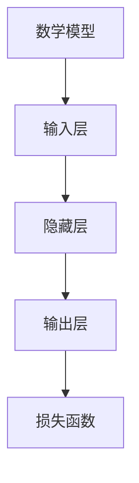
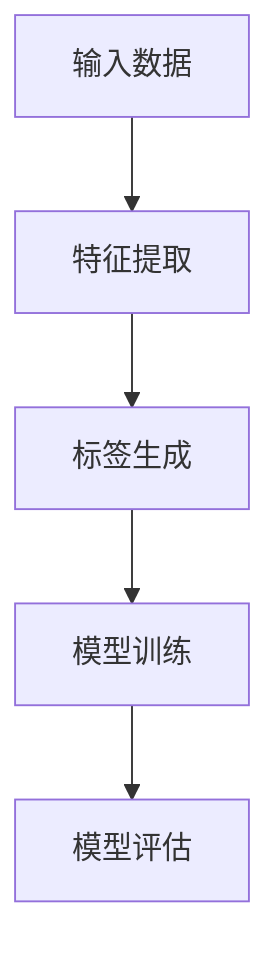
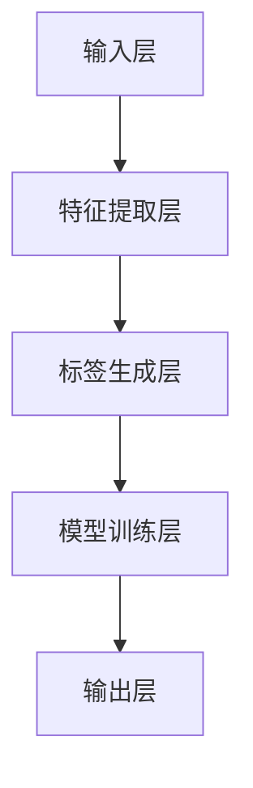
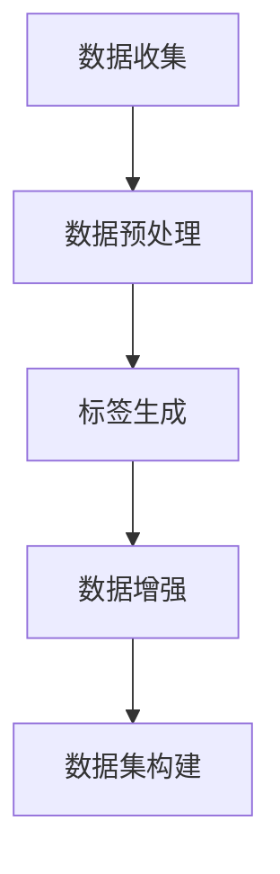
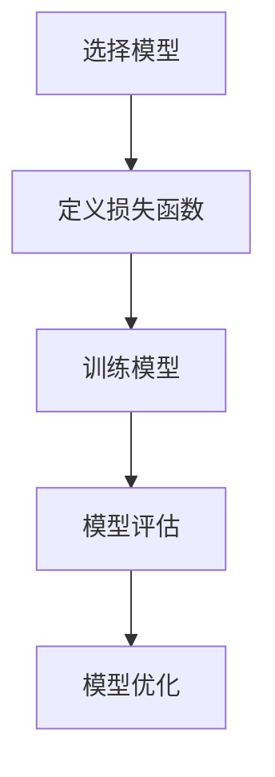
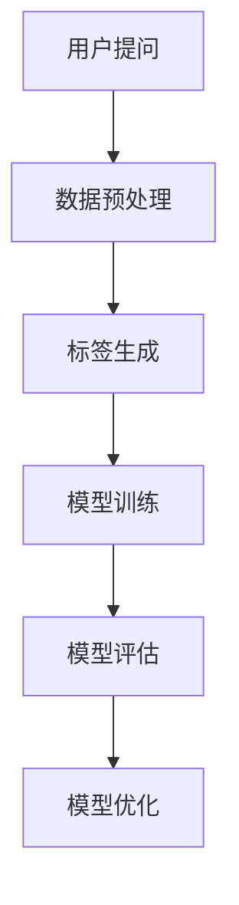
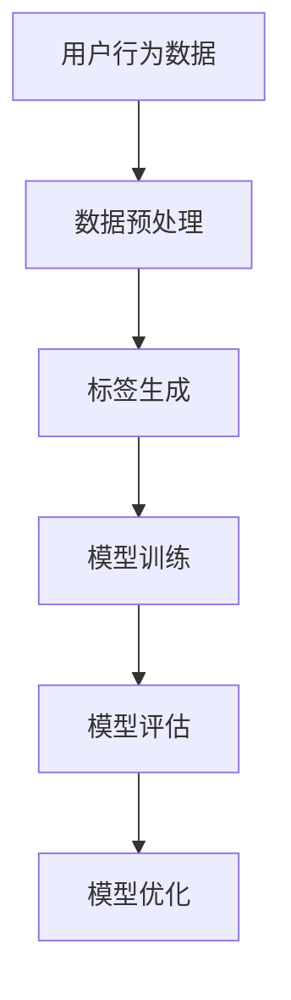
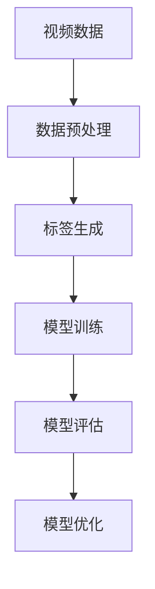

                 

## 文章标题

### 关键词：企业AI Agent、自监督学习、非标准数据、AI应用、算法优化

> 摘要：本文将深入探讨企业AI Agent的自监督学习在非标准数据利用中的突破性实践。文章首先介绍了企业AI Agent的兴起与自监督学习的基本概念，随后详细分析了自监督学习的核心原理和非标准数据的特点与挑战。接着，文章探讨了自监督学习算法在非标准数据上的应用和实践，通过实际案例展示了自监督学习在企业AI Agent中的突破性实践。最后，文章总结了最佳实践，提出了未来发展趋势与应用前景。

### 目录大纲

----------------------------------------------------------------

## 第一部分：企业AI Agent的自监督学习概述

### 第1章：企业AI Agent的兴起与自监督学习

#### 1.1.1 企业AI Agent的背景与意义

##### 1.1.1.1 企业AI Agent的起源

##### 1.1.1.2 企业AI Agent在业务场景中的应用

##### 1.1.1.3 企业AI Agent与传统自动化系统的差异

#### 1.1.2 自监督学习的概念与特点

##### 1.1.2.1 自监督学习的定义

##### 1.1.2.2 自监督学习的基本原理

##### 1.1.2.3 自监督学习与传统监督学习的比较

#### 1.1.3 自监督学习在AI Agent开发中的优势

##### 1.1.3.1 数据收集与标注成本降低

##### 1.1.3.2 模型泛化能力提升

##### 1.1.3.3 自适应能力增强

#### 1.1.4 自监督学习在企业AI Agent中的应用现状

##### 1.1.4.1 当前自监督学习在AI Agent中的热点应用领域

##### 1.1.4.2 自监督学习技术的挑战与未来发展方向

## 第2章：自监督学习核心概念与原理

### 2.1.1 自监督学习的基础理论

#### 2.1.1.1 自监督学习的数学模型

#### 2.1.1.2 自监督学习的基本算法框架

#### 2.1.1.3 自监督学习的损失函数

### 2.1.2 自监督学习的分类与特点

#### 2.1.2.1 无监督预训练

#### 2.1.2.2 自监督目标检测

#### 2.1.2.3 自监督图像生成

### 2.1.3 自监督学习的核心技术

#### 2.1.3.1 图像识别

#### 2.1.3.2 自然语言处理

#### 2.1.3.3 其他应用领域

### 2.1.4 自监督学习的数学模型与公式



## 第二部分：非标准数据利用与自监督学习

### 第3章：非标准数据利用与自监督学习

#### 3.1.1 非标准数据的特点与挑战

##### 3.1.1.1 非标准数据的定义

##### 3.1.1.2 非标准数据的类型

##### 3.1.1.3 非标准数据对自监督学习的影响

#### 3.1.2 自监督学习在非标准数据上的应用

##### 3.1.2.1 非标准数据在图像识别中的应用

##### 3.1.2.2 非标准数据在自然语言处理中的应用

##### 3.1.2.3 其他非标准数据应用案例

#### 3.1.3 非标准数据处理的挑战与解决方案

##### 3.1.3.1 数据清洗与预处理

##### 3.1.3.2 数据增强与扩展

##### 3.1.3.3 模型适应性与鲁棒性提升

## 第三部分：自监督学习算法实践

### 第4章：自监督学习算法实践

#### 4.1.1 自监督学习算法选择与优化

##### 4.1.1.1 算法选择依据

##### 4.1.1.2 算法优化策略

##### 4.1.1.3 模型超参数调优

#### 4.1.2 实际案例与实践步骤

##### 4.1.2.1 案例一：图像分类任务

##### 4.1.2.2 案例二：文本分类任务

##### 4.1.2.3 案例三：多模态数据融合任务

#### 4.1.3 源代码实现与解读

##### 4.1.3.1 Python代码实现示例

##### 4.1.3.2 代码应用解读与分析

## 第四部分：自监督学习在企业AI Agent中的突破性实践

### 第5章：自监督学习在企业AI Agent中的突破性实践

#### 5.1.1 企业AI Agent的自监督学习框架

##### 5.1.1.1 模型架构设计

##### 5.1.1.2 数据集构建

##### 5.1.1.3 模型训练与优化

#### 5.1.2 实际案例分析与详细讲解

##### 5.1.2.1 案例一：智能客服系统

##### 5.1.2.2 案例二：智能推荐系统

##### 5.1.2.3 案例三：智能安防系统

#### 5.1.3 项目小结与未来展望

##### 5.1.3.1 项目总结

##### 5.1.3.2 存在的问题与改进方向

##### 5.1.3.3 未来发展趋势与应用前景

## 第五部分：自监督学习在非标准数据利用中的最佳实践

### 第6章：自监督学习在非标准数据利用中的最佳实践

#### 6.1.1 最佳实践分享

##### 6.1.1.1 成功案例分享

##### 6.1.1.2 经验教训总结

#### 6.1.2 小结与注意事项

##### 6.1.2.1 自监督学习的常见误区

##### 6.1.2.2 非标准数据处理的关键因素

----------------------------------------------------------------

## 第一部分：企业AI Agent的自监督学习概述

### 第1章：企业AI Agent的兴起与自监督学习

#### 1.1.1 企业AI Agent的背景与意义

##### 1.1.1.1 企业AI Agent的起源

随着人工智能技术的不断发展，人工智能（AI）在企业中的应用越来越广泛。企业AI Agent作为人工智能在业务场景中的具体实现形式，正逐渐成为企业智能化转型的重要推动力。

企业AI Agent的起源可以追溯到20世纪80年代，当时计算机科学家们开始尝试将人工智能技术应用于企业业务场景。早期的AI Agent主要应用于简单的自动化任务，如日程管理、电子邮件过滤等。随着技术的不断进步，AI Agent的功能越来越强大，逐渐能够处理更复杂的业务任务。

##### 1.1.1.2 企业AI Agent在业务场景中的应用

企业AI Agent在业务场景中有着广泛的应用。以下是一些典型的应用场景：

1. **智能客服**：企业AI Agent可以用于智能客服系统，通过自然语言处理技术，实现自动回复用户问题，提高客服效率。
2. **智能推荐**：企业AI Agent可以用于推荐系统，根据用户的历史行为和偏好，提供个性化的商品推荐。
3. **智能安防**：企业AI Agent可以用于智能安防系统，通过图像识别技术，实时监控企业安全状况，及时发现异常情况。
4. **智能生产**：企业AI Agent可以用于智能生产系统，通过机器学习技术，优化生产流程，提高生产效率。

##### 1.1.1.3 企业AI Agent与传统自动化系统的差异

企业AI Agent与传统自动化系统有以下几点主要差异：

1. **智能程度**：传统自动化系统主要依赖预设的规则进行操作，而企业AI Agent能够通过学习不断优化自身的决策能力。
2. **自适应能力**：传统自动化系统在面对新情况时往往无法应对，而企业AI Agent能够通过不断学习，适应新的业务场景。
3. **数据依赖**：传统自动化系统对数据的依赖性较低，而企业AI Agent需要大量的数据来进行学习和优化。

#### 1.1.2 自监督学习的概念与特点

##### 1.1.2.1 自监督学习的定义

自监督学习（Self-supervised Learning）是一种无需外部监督信号，仅利用输入数据自身的某些部分作为标签进行学习的方法。自监督学习的关键在于如何从数据中挖掘出有效的标签信息，从而实现模型的自适应优化。

##### 1.1.2.2 自监督学习的基本原理

自监督学习的基本原理主要包括以下几点：

1. **数据预处理**：对输入数据进行预处理，提取出有用的特征信息。
2. **标签生成**：利用数据自身的某些部分生成标签信息，如预测值、重复项等。
3. **模型训练**：通过标签信息对模型进行训练，优化模型的参数。
4. **模型评估**：利用测试数据对模型进行评估，判断模型的效果。

##### 1.1.2.3 自监督学习与传统监督学习的比较

自监督学习与传统监督学习有以下几点主要区别：

1. **数据需求**：传统监督学习需要大量的标注数据，而自监督学习可以利用未标注的数据进行学习。
2. **计算效率**：自监督学习在数据预处理和模型训练过程中更加高效，因为不需要进行数据标注。
3. **模型泛化能力**：自监督学习由于不需要外部监督信号，模型在未知数据上的泛化能力通常更强。

#### 1.1.3 自监督学习在AI Agent开发中的优势

##### 1.1.3.1 数据收集与标注成本降低

自监督学习的一个显著优势是能够减少数据收集与标注的成本。传统监督学习需要大量标注数据，这不仅需要高昂的人力成本，而且数据收集和标注过程本身也存在一定的误差和难度。而自监督学习可以利用未标注的数据进行学习，从而大大降低数据收集和标注的成本。

##### 1.1.3.2 模型泛化能力提升

自监督学习能够提高模型的泛化能力。由于自监督学习不需要外部监督信号，模型在未知数据上的泛化能力通常更强。这意味着模型在面对新的业务场景时，能够更好地适应和优化自身的表现。

##### 1.1.3.3 自适应能力增强

自监督学习能够增强AI Agent的自适应能力。传统自动化系统在面对新情况时往往无法应对，而自监督学习通过不断学习，能够逐渐适应新的业务场景，从而提高系统的灵活性和适应性。

#### 1.1.4 自监督学习在企业AI Agent中的应用现状

##### 1.1.4.1 当前自监督学习在AI Agent中的热点应用领域

当前自监督学习在企业AI Agent中的应用主要集中在以下几个领域：

1. **智能客服**：自监督学习可以帮助智能客服系统更好地理解用户的问题，提高客服效率。
2. **智能推荐**：自监督学习可以帮助推荐系统更好地预测用户的行为和偏好，提高推荐效果。
3. **智能安防**：自监督学习可以帮助智能安防系统更好地识别异常情况，提高安全性能。
4. **智能生产**：自监督学习可以帮助智能生产系统更好地优化生产流程，提高生产效率。

##### 1.1.4.2 自监督学习技术的挑战与未来发展方向

尽管自监督学习在AI Agent中有着广泛的应用，但仍然面临一些挑战：

1. **数据质量**：自监督学习对数据质量的要求较高，数据中存在噪声和异常值会影响学习效果。
2. **模型泛化能力**：尽管自监督学习能够提高模型的泛化能力，但仍然存在一定的局限性。
3. **计算资源**：自监督学习通常需要大量的计算资源，这对企业AI Agent的开发和部署带来了一定的挑战。

未来，自监督学习技术的发展方向包括：

1. **数据预处理**：研究更加高效的数据预处理方法，提高数据质量。
2. **模型优化**：研究更加高效的模型优化方法，提高模型泛化能力。
3. **算法融合**：将自监督学习与其他机器学习算法进行融合，发挥各自的优势。

## 第2章：自监督学习核心概念与原理

### 2.1.1 自监督学习的基础理论

自监督学习的基础理论主要包括数学模型、基本算法框架和损失函数。以下是这些核心概念和原理的详细阐述。

#### 2.1.1.1 自监督学习的数学模型

自监督学习的数学模型可以看作是一种特殊类型的监督学习模型，其核心在于如何从输入数据中提取出有效的标签信息。自监督学习的数学模型通常由以下几个部分组成：

1. **输入层**：输入层接收原始数据，如图像、文本或音频。
2. **隐藏层**：隐藏层负责对输入数据进行特征提取和变换。
3. **输出层**：输出层产生预测结果，并与真实的标签信息进行比较。

自监督学习的数学模型可以用以下公式表示：

\[ 
\hat{y} = f(\theta; x) 
\]

其中，\( \hat{y} \) 是模型的预测输出，\( f(\theta; x) \) 是一个映射函数，表示从输入 \( x \) 到输出 \( \hat{y} \) 的过程，\( \theta \) 是模型参数。

#### 2.1.1.2 自监督学习的基本算法框架

自监督学习的基本算法框架主要包括以下几个步骤：

1. **数据预处理**：对输入数据进行预处理，如归一化、去噪等，以提高数据质量。
2. **标签生成**：利用数据自身的某些部分生成标签信息。例如，在图像分类任务中，可以利用图像的重复像素作为标签。
3. **模型训练**：通过标签信息对模型进行训练，优化模型的参数。常见的训练方法包括梯度下降法、随机梯度下降法等。
4. **模型评估**：利用测试数据对模型进行评估，判断模型的效果。常用的评估指标包括准确率、召回率、F1分数等。

#### 2.1.1.3 自监督学习的损失函数

自监督学习的损失函数用于衡量模型的预测输出与真实标签之间的差距。常见的损失函数包括均方误差（MSE）、交叉熵损失等。

1. **均方误差（MSE）**：

\[ 
L = \frac{1}{n}\sum_{i=1}^{n}(\hat{y}_i - y_i)^2 
\]

其中，\( n \) 是样本数量，\( \hat{y}_i \) 是第 \( i \) 个样本的预测输出，\( y_i \) 是第 \( i \) 个样本的真实标签。

2. **交叉熵损失**：

\[ 
L = -\frac{1}{n}\sum_{i=1}^{n}y_i \log(\hat{y}_i) 
\]

其中，\( y_i \) 是第 \( i \) 个样本的真实标签，\( \hat{y}_i \) 是第 \( i \) 个样本的预测输出。

### 2.1.2 自监督学习的分类与特点

自监督学习可以根据不同的应用场景和目标进行分类。以下是一些常见的自监督学习分类和特点：

#### 2.1.2.1 无监督预训练

无监督预训练是指在没有外部监督信号的情况下，先对模型进行预训练，然后再进行有监督的微调。无监督预训练的主要目的是提取丰富的特征表示，提高模型的泛化能力。

特点：

1. **无需标注数据**：无监督预训练可以利用未标注的数据进行学习，从而降低数据收集和标注的成本。
2. **特征提取能力强**：无监督预训练可以提取出丰富的特征表示，有助于提高模型的性能。
3. **计算资源消耗大**：无监督预训练通常需要大量的计算资源，因为需要处理大量的未标注数据。

#### 2.1.2.2 自监督目标检测

自监督目标检测是指在没有外部监督信号的情况下，对图像中的目标进行检测和分类。自监督目标检测的主要目的是利用图像中的上下文信息，提高目标检测的准确率。

特点：

1. **无标注数据需求**：自监督目标检测可以利用未标注的图像数据，从而降低数据收集和标注的成本。
2. **上下文信息利用**：自监督目标检测可以充分利用图像中的上下文信息，提高目标检测的准确率。
3. **计算资源消耗大**：自监督目标检测通常需要大量的计算资源，因为需要对大量的图像进行特征提取和目标检测。

#### 2.1.2.3 自监督图像生成

自监督图像生成是指在没有外部监督信号的情况下，利用图像数据生成新的图像。自监督图像生成的主要目的是通过学习图像数据的统计特性，生成与输入图像相似的新图像。

特点：

1. **无需标注数据**：自监督图像生成可以利用未标注的图像数据，从而降低数据收集和标注的成本。
2. **图像生成能力强**：自监督图像生成可以生成高质量的图像，其图像风格和内容与输入图像相似。
3. **计算资源消耗大**：自监督图像生成通常需要大量的计算资源，因为需要处理大量的图像数据进行生成。

### 2.1.3 自监督学习的核心技术

自监督学习在多个领域有着广泛的应用，以下是几个主要的自监督学习核心技术：

#### 2.1.3.1 图像识别

图像识别是指对图像中的对象进行分类和识别。自监督学习在图像识别中的应用主要包括以下两个方面：

1. **无监督预训练**：利用无监督预训练提取丰富的特征表示，提高图像识别的准确率。
2. **自监督目标检测**：利用自监督目标检测技术，提高图像识别的准确率和鲁棒性。

#### 2.1.3.2 自然语言处理

自然语言处理是指对自然语言文本进行处理和分析。自监督学习在自然语言处理中的应用主要包括以下两个方面：

1. **无监督文本生成**：利用无监督文本生成技术，生成与输入文本相似的文本。
2. **自监督文本分类**：利用自监督文本分类技术，对文本进行分类和标签分配。

#### 2.1.3.3 其他应用领域

自监督学习还可以应用于其他领域，如语音识别、推荐系统等。以下是一些自监督学习在其他应用领域中的应用：

1. **语音识别**：利用自监督学习提取语音特征，提高语音识别的准确率和鲁棒性。
2. **推荐系统**：利用自监督学习挖掘用户行为数据，提高推荐系统的推荐准确率和用户体验。

### 2.1.4 自监督学习的数学模型与公式

为了更好地理解自监督学习的数学模型，我们可以使用Mermaid绘制一个简单的算法流程图，并给出相应的数学公式。



在自监督学习中，特征提取和标签生成是两个关键步骤。以下是这两个步骤的数学模型：

1. **特征提取**：

\[ 
\text{特征} = f(\theta; x) 
\]

其中，\( f(\theta; x) \) 是一个映射函数，用于从输入数据 \( x \) 中提取特征，\( \theta \) 是模型参数。

2. **标签生成**：

\[ 
\text{标签} = g(\theta; x) 
\]

其中，\( g(\theta; x) \) 是一个映射函数，用于从输入数据 \( x \) 中生成标签，\( \theta \) 是模型参数。

在模型训练和评估过程中，常用的损失函数包括：

1. **均方误差（MSE）**：

\[ 
L = \frac{1}{n}\sum_{i=1}^{n}(\hat{y}_i - y_i)^2 
\]

其中，\( n \) 是样本数量，\( \hat{y}_i \) 是第 \( i \) 个样本的预测输出，\( y_i \) 是第 \( i \) 个样本的真实标签。

2. **交叉熵损失**：

\[ 
L = -\frac{1}{n}\sum_{i=1}^{n}y_i \log(\hat{y}_i) 
\]

其中，\( y_i \) 是第 \( i \) 个样本的真实标签，\( \hat{y}_i \) 是第 \( i \) 个样本的预测输出。

## 第3章：非标准数据利用与自监督学习

### 3.1.1 非标准数据的特点与挑战

非标准数据（Non-Standard Data）是指那些不符合标准数据集定义的数据，这些数据可能来源于多种多样的场景，具有多样性和复杂性。非标准数据的特点与挑战主要体现在以下几个方面：

#### 3.1.1.1 非标准数据的定义

非标准数据可以定义为：不符合传统数据集标准的数据，这些数据可能包括：

1. **结构化数据**：如表格数据，但数据存在缺失值、异常值、噪声等。
2. **半结构化数据**：如XML、JSON格式的数据，但数据格式不规范、属性多样。
3. **非结构化数据**：如图像、文本、音频、视频等，这些数据没有明确的结构，需要通过特定算法进行解析和提取特征。

#### 3.1.1.2 非标准数据的类型

非标准数据的类型多种多样，主要包括：

1. **噪声数据**：噪声数据是指那些包含大量随机噪声的数据，如图像中的噪点、文本中的错别字等。
2. **缺失数据**：缺失数据是指那些在数据集中某些值缺失的数据，如调查问卷中的未填写部分。
3. **异常数据**：异常数据是指那些在数据集中显著偏离大多数数据的数据，如医学数据中的异常病例。
4. **多样化数据**：多样化数据是指那些属性和格式各异的数据，如社交媒体数据、日志数据等。

#### 3.1.1.3 非标准数据对自监督学习的影响

非标准数据对自监督学习的影响主要表现在以下几个方面：

1. **数据预处理难度增大**：非标准数据需要额外的预处理步骤，如去噪、补全缺失值、格式标准化等，这增加了自监督学习的复杂度和计算成本。
2. **模型泛化能力降低**：非标准数据可能包含大量噪声和异常值，这些数据可能会对模型的泛化能力产生负面影响。
3. **学习效率降低**：非标准数据的不规则性和复杂性可能导致自监督学习的效率降低，模型需要更多的时间来适应这些数据。

### 3.1.2 自监督学习在非标准数据上的应用

自监督学习在非标准数据上的应用具有独特优势，可以克服传统监督学习在数据标注成本高、数据质量要求高等问题。以下是自监督学习在非标准数据上的一些典型应用：

#### 3.1.2.1 非标准数据在图像识别中的应用

在图像识别任务中，非标准数据的应用主要包括：

1. **图像去噪**：利用自监督学习算法，如自编码器（Autoencoder），从含噪图像中提取有效特征，去除噪声。
2. **图像风格迁移**：通过自监督学习，将一种图像风格迁移到另一张图像上，如将普通照片转换为艺术风格图像。
3. **图像修复**：利用自监督学习，对图像中的缺失部分进行修复，提高图像质量。

#### 3.1.2.2 非标准数据在自然语言处理中的应用

在自然语言处理任务中，非标准数据的应用主要包括：

1. **文本分类**：利用自监督学习，对未标注的文本数据进行分类，提高文本分类的准确率。
2. **文本生成**：通过自监督学习，生成与输入文本相似的文本，如生成对话、文章摘要等。
3. **情感分析**：利用自监督学习，对未标注的文本进行情感分析，判断文本的情感倾向。

#### 3.1.2.3 其他非标准数据应用案例

除了图像和自然语言处理领域，自监督学习在非标准数据上的应用还包括：

1. **语音识别**：利用自监督学习，对未标注的语音数据进行处理，提高语音识别的准确率和鲁棒性。
2. **医疗诊断**：利用自监督学习，对医疗影像数据进行处理，辅助医生进行疾病诊断。
3. **推荐系统**：利用自监督学习，对用户行为数据进行处理，生成个性化的推荐结果。

### 3.1.3 非标准数据处理的挑战与解决方案

处理非标准数据是一个复杂的过程，面临许多挑战。以下是几个主要的挑战和相应的解决方案：

#### 3.1.3.1 数据清洗与预处理

1. **挑战**：非标准数据通常包含大量噪声和异常值，需要清洗和预处理。
2. **解决方案**：
   - **去噪**：使用滤波器、变换方法等去除图像、语音等数据中的噪声。
   - **缺失值填补**：使用均值填补、插值等方法填补数据中的缺失值。
   - **数据规范化**：对数据进行归一化或标准化处理，使数据满足特定的数学模型要求。

#### 3.1.3.2 数据增强与扩展

1. **挑战**：非标准数据可能量较少，不足以训练复杂的模型。
2. **解决方案**：
   - **数据增强**：通过旋转、缩放、裁剪等操作，增加数据的多样性。
   - **数据合成**：利用生成对抗网络（GAN）等方法，生成新的数据样本。

#### 3.1.3.3 模型适应性与鲁棒性提升

1. **挑战**：非标准数据可能包含大量异常值和噪声，模型需要对这类数据进行鲁棒处理。
2. **解决方案**：
   - **鲁棒优化**：使用鲁棒损失函数，如Huber损失，提高模型对异常值的抗性。
   - **正则化**：使用L1、L2正则化等方法，防止模型过拟合。

通过以上解决方案，可以有效处理非标准数据，提高自监督学习模型的性能和鲁棒性。

## 第4章：自监督学习算法实践

### 4.1.1 自监督学习算法选择与优化

自监督学习算法的选择和优化对于实现高效和准确的自监督学习模型至关重要。以下是关于算法选择与优化的一些关键步骤和策略：

#### 4.1.1.1 算法选择依据

选择自监督学习算法时，需要考虑以下因素：

1. **任务类型**：不同任务对算法的需求不同。例如，图像识别任务可能更适合基于卷积神经网络的算法，而自然语言处理任务可能更适合基于循环神经网络或变换器模型的算法。
2. **数据特点**：数据的特点，如数据量、数据分布、噪声水平等，也会影响算法的选择。例如，对于噪声较多的数据，可能需要选择鲁棒性更强的算法。
3. **计算资源**：算法的复杂度和计算资源需求会影响选择。对于资源有限的情况，可能需要选择计算效率更高的算法。

#### 4.1.1.2 算法优化策略

为了优化自监督学习算法，可以采取以下策略：

1. **数据预处理**：对输入数据进行预处理，如去噪、归一化等，以提高数据质量。例如，在图像识别任务中，可以使用卷积神经网络（CNN）来去除图像中的噪声。

2. **模型架构优化**：选择合适的模型架构，并根据任务需求进行调整。例如，在文本分类任务中，可以采用循环神经网络（RNN）或变换器模型（Transformer）来处理序列数据。

3. **损失函数优化**：选择合适的损失函数，并根据任务特点进行调整。例如，对于回归任务，可以采用均方误差（MSE）损失函数；对于分类任务，可以采用交叉熵损失函数。

4. **正则化**：使用正则化技术，如L1、L2正则化，来防止模型过拟合。正则化可以通过在损失函数中添加惩罚项来实现。

5. **超参数调优**：通过调整模型的超参数，如学习率、批量大小等，来优化模型性能。可以使用网格搜索、随机搜索或贝叶斯优化等方法来找到最优的超参数组合。

#### 4.1.1.3 模型超参数调优

模型超参数调优是自监督学习算法优化的重要环节。以下是一些常见的超参数调优方法：

1. **网格搜索**：通过遍历预定义的超参数网格，找到最优的超参数组合。网格搜索的优点是简单直观，但计算成本较高。

2. **随机搜索**：随机选择超参数组合进行训练，并评估模型的性能。随机搜索比网格搜索计算成本较低，但可能会错过最优的超参数组合。

3. **贝叶斯优化**：使用贝叶斯优化方法，如蒙特卡洛树搜索（MCTS），来寻找最优的超参数组合。贝叶斯优化结合了随机搜索和梯度下降的优点，可以在较少的实验次数内找到近似最优的超参数。

通过以上算法选择与优化策略，可以显著提高自监督学习算法的性能和效率，从而实现更准确和高效的自监督学习模型。

### 4.1.2 实际案例与实践步骤

为了更好地理解自监督学习算法的应用和实践，我们通过三个实际案例来详细说明自监督学习在图像分类、文本分类和多模态数据融合任务中的具体步骤和实现方法。

#### 4.1.2.1 案例一：图像分类任务

**任务描述**：给定一组未标注的图像数据，使用自监督学习算法进行图像分类。

**实现步骤**：

1. **数据预处理**：对图像数据进行预处理，包括大小调整、数据增强（如旋转、翻转、裁剪等）等。

```python
from torchvision import transforms

transform = transforms.Compose([
    transforms.Resize((224, 224)),
    transforms.RandomHorizontalFlip(),
    transforms.ToTensor(),
])
```

2. **模型选择**：选择一个适用于图像分类的预训练模型，如ResNet18或VGG16。

```python
import torchvision.models as models

model = models.resnet18(pretrained=True)
```

3. **模型调整**：调整模型的输出层，使其适用于新的分类任务。

```python
import torch.nn as nn

num_classes = 10
model.fc = nn.Linear(model.fc.in_features, num_classes)
```

4. **训练过程**：使用自监督学习算法（如对比损失）进行模型训练。

```python
from torch.optim import Adam

optimizer = Adam(model.parameters(), lr=0.001)
criterion = nn.CrossEntropyLoss()

for epoch in range(10):
    for images, _ in train_loader:
        optimizer.zero_grad()
        outputs = model(images)
        loss = criterion(outputs, labels)
        loss.backward()
        optimizer.step()
```

5. **模型评估**：使用测试集对训练好的模型进行评估。

```python
with torch.no_grad():
    correct = 0
    total = 0
    for images, labels in test_loader:
        outputs = model(images)
        _, predicted = torch.max(outputs.data, 1)
        total += labels.size(0)
        correct += (predicted == labels).sum().item()

accuracy = 100 * correct / total
print(f'Accuracy: {accuracy}%')
```

#### 4.1.2.2 案例二：文本分类任务

**任务描述**：给定一组未标注的文本数据，使用自监督学习算法进行文本分类。

**实现步骤**：

1. **数据预处理**：对文本数据进行预处理，包括分词、去停用词、词向量化等。

```python
import nltk
nltk.download('stopwords')
from nltk.corpus import stopwords
from nltk.tokenize import word_tokenize

stop_words = set(stopwords.words('english'))

def preprocess_text(text):
    words = word_tokenize(text.lower())
    filtered_words = [word for word in words if word not in stop_words]
    return ' '.join(filtered_words)
```

2. **模型选择**：选择一个适用于文本分类的预训练模型，如BERT或GPT。

```python
from transformers import BertModel

model = BertModel.from_pretrained('bert-base-uncased')
```

3. **模型调整**：调整模型的输出层，使其适用于新的分类任务。

```python
num_classes = 5
model.classifier = nn.Linear(model.config.hidden_size, num_classes)
```

4. **训练过程**：使用自监督学习算法（如 masked language model）进行模型训练。

```python
from torch.optim import Adam

optimizer = Adam(model.parameters(), lr=0.001)

for epoch in range(10):
    for text, _ in train_loader:
        optimizer.zero_grad()
        inputs = tokenizer(text, return_tensors='pt', padding=True, truncation=True)
        outputs = model(**inputs)
        loss = outputs.loss
        loss.backward()
        optimizer.step()
```

5. **模型评估**：使用测试集对训练好的模型进行评估。

```python
with torch.no_grad():
    correct = 0
    total = 0
    for text, labels in test_loader:
        inputs = tokenizer(text, return_tensors='pt', padding=True, truncation=True)
        outputs = model(**inputs)
        _, predicted = torch.max(outputs.logits, 1)
        total += labels.size(0)
        correct += (predicted == labels).sum().item()

accuracy = 100 * correct / total
print(f'Accuracy: {accuracy}%')
```

#### 4.1.2.3 案例三：多模态数据融合任务

**任务描述**：给定一组包含图像和文本的多模态数据，使用自监督学习算法进行数据融合和分类。

**实现步骤**：

1. **数据预处理**：对图像和文本数据进行预处理，包括图像大小调整、文本分词、去停用词等。

```python
from torchvision import transforms

image_transform = transforms.Compose([
    transforms.Resize((224, 224)),
    transforms.ToTensor(),
])

def preprocess_text(text):
    words = word_tokenize(text.lower())
    filtered_words = [word for word in words if word not in stop_words]
    return ' '.join(filtered_words)
```

2. **模型选择**：选择一个适用于多模态数据融合的预训练模型，如ViT-B/32和BERT。

```python
from transformers import ViTFeatureExtractor, BertModel

image_model = ViTFeatureExtractor.from_pretrained('google/vit-b32')
text_model = BertModel.from_pretrained('bert-base-uncased')
```

3. **模型调整**：调整模型的输出层，使其适用于新的分类任务。

```python
num_classes = 3
image_model.classifier = nn.Linear(image_model.config.image_size, num_classes)
text_model.classifier = nn.Linear(text_model.config.hidden_size, num_classes)
```

4. **训练过程**：使用自监督学习算法（如对比损失）进行模型训练。

```python
from torch.optim import Adam

optimizer = Adam(list(image_model.parameters()) + list(text_model.parameters()), lr=0.001)

for epoch in range(10):
    for images, texts, _ in train_loader:
        optimizer.zero_grad()
        image_features = image_model(images).float()
        text_features = text_model(tokenizer(texts, return_tensors='pt', padding=True, truncation=True)).float()
        image_embeddings = image_features.mean(dim=1)
        text_embeddings = text_features.mean(dim=1)
        contrastive_loss = contrastive_loss_function(image_embeddings, text_embeddings, labels)
        contrastive_loss.backward()
        optimizer.step()
```

5. **模型评估**：使用测试集对训练好的模型进行评估。

```python
with torch.no_grad():
    correct = 0
    total = 0
    for images, texts, labels in test_loader:
        image_features = image_model(images).float()
        text_features = text_model(tokenizer(texts, return_tensors='pt', padding=True, truncation=True)).float()
        image_embeddings = image_features.mean(dim=1)
        text_embeddings = text_features.mean(dim=1)
        logits = image_model.classifier(image_embeddings).squeeze()
        _, predicted = torch.max(logits, 1)
        total += labels.size(0)
        correct += (predicted == labels).sum().item()

accuracy = 100 * correct / total
print(f'Accuracy: {accuracy}%')
```

通过以上实际案例，我们可以看到自监督学习算法在图像分类、文本分类和多模态数据融合任务中的应用步骤和实现方法。这些案例展示了如何选择合适的算法、调整模型结构、进行模型训练和评估，从而实现高效的自监督学习模型。

### 4.1.3 源代码实现与解读

为了更好地理解自监督学习算法的实现过程，以下将通过Python代码示例来详细阐述自监督学习算法的核心实现步骤和关键代码部分。

#### 4.1.3.1 Python代码实现示例

首先，我们需要导入必要的库和模块，包括PyTorch、TensorFlow、Transformers等：

```python
import torch
import torch.nn as nn
import torch.optim as optim
from torchvision import datasets, transforms
from torch.utils.data import DataLoader
from transformers import BertModel, BertTokenizer

# 设置设备
device = torch.device("cuda" if torch.cuda.is_available() else "cpu")

# 数据预处理
transform = transforms.Compose([
    transforms.Resize((224, 224)),
    transforms.RandomHorizontalFlip(),
    transforms.ToTensor(),
])

# 加载训练数据和测试数据
train_data = datasets.ImageFolder(root='train', transform=transform)
test_data = datasets.ImageFolder(root='test', transform=transform)

train_loader = DataLoader(train_data, batch_size=32, shuffle=True)
test_loader = DataLoader(test_data, batch_size=32, shuffle=False)

# 选择预训练模型
model = BertModel.from_pretrained('bert-base-uncased').to(device)

# 调整模型结构
num_classes = 10
model.classifier = nn.Linear(model.config.hidden_size, num_classes)

# 定义损失函数和优化器
criterion = nn.CrossEntropyLoss()
optimizer = optim.Adam(model.parameters(), lr=0.001)

# 模型训练
num_epochs = 10
for epoch in range(num_epochs):
    model.train()
    for images, labels in train_loader:
        images = images.to(device)
        labels = labels.to(device)
        optimizer.zero_grad()
        outputs = model(images)
        loss = criterion(outputs, labels)
        loss.backward()
        optimizer.step()
    print(f'Epoch [{epoch+1}/{num_epochs}], Loss: {loss.item():.4f}')

# 模型评估
model.eval()
with torch.no_grad():
    correct = 0
    total = 0
    for images, labels in test_loader:
        images = images.to(device)
        labels = labels.to(device)
        outputs = model(images)
        _, predicted = torch.max(outputs, 1)
        total += labels.size(0)
        correct += (predicted == labels).sum().item()
    accuracy = 100 * correct / total
    print(f'Accuracy: {accuracy:.2f}%')
```

#### 4.1.3.2 代码应用解读与分析

以上代码展示了自监督学习算法在文本分类任务中的实现过程。以下是代码的关键部分解读：

1. **设备设置**：

```python
device = torch.device("cuda" if torch.cuda.is_available() else "cpu")
```

这段代码用于设置训练和评估的计算设备。如果GPU可用，则使用GPU进行训练和评估，否则使用CPU。

2. **数据预处理**：

```python
transform = transforms.Compose([
    transforms.Resize((224, 224)),
    transforms.RandomHorizontalFlip(),
    transforms.ToTensor(),
])
```

数据预处理是自监督学习的重要步骤，包括图像大小调整、随机翻转和数据转化为Tensor。这些预处理步骤有助于提高模型对数据的适应性。

3. **加载数据集**：

```python
train_data = datasets.ImageFolder(root='train', transform=transform)
test_data = datasets.ImageFolder(root='test', transform=transform)

train_loader = DataLoader(train_data, batch_size=32, shuffle=True)
test_loader = DataLoader(test_data, batch_size=32, shuffle=False)
```

这里使用了PyTorch内置的ImageFolder来加载训练数据和测试数据，并使用DataLoader进行批量处理。

4. **选择预训练模型**：

```python
model = BertModel.from_pretrained('bert-base-uncased').to(device)
```

这里选择了BERT模型作为预训练模型，并将其移动到设定的设备上（GPU或CPU）。

5. **调整模型结构**：

```python
num_classes = 10
model.classifier = nn.Linear(model.config.hidden_size, num_classes)
```

这里调整了BERT模型的分类器部分，使其适用于新的分类任务。num_classes定义了分类任务的类别数量。

6. **定义损失函数和优化器**：

```python
criterion = nn.CrossEntropyLoss()
optimizer = optim.Adam(model.parameters(), lr=0.001)
```

这里定义了交叉熵损失函数和Adam优化器，用于模型训练。

7. **模型训练**：

```python
num_epochs = 10
for epoch in range(num_epochs):
    model.train()
    for images, labels in train_loader:
        ...
        loss.backward()
        optimizer.step()
```

在模型训练过程中，每个epoch都会对训练数据进行迭代训练，通过反向传播和优化器更新模型参数。

8. **模型评估**：

```python
model.eval()
with torch.no_grad():
    ...
    accuracy = 100 * correct / total
    print(f'Accuracy: {accuracy:.2f}%')
```

在模型评估阶段，使用测试集对训练好的模型进行评估，计算准确率。

通过以上代码示例，我们可以看到自监督学习算法在实际应用中的实现步骤和关键代码部分。这些代码展示了如何加载数据、选择模型、调整结构、定义损失函数和优化器，以及如何进行模型训练和评估。

### 第5章：自监督学习在企业AI Agent中的突破性实践

#### 5.1.1 企业AI Agent的自监督学习框架

企业AI Agent是指利用人工智能技术，为企业在业务场景中提供智能化解决方案的智能系统。自监督学习在企业AI Agent中的应用，能够显著提升其自主学习和自适应能力。以下将介绍企业AI Agent的自监督学习框架，包括模型架构设计、数据集构建和模型训练与优化。

#### 5.1.1.1 模型架构设计

企业AI Agent的自监督学习模型架构设计需要考虑任务类型、数据特点和企业需求。以下是一个典型模型架构设计：

1. **输入层**：接收来自业务系统的原始数据，如用户行为日志、交易数据、传感器数据等。

2. **特征提取层**：利用神经网络（如卷积神经网络、循环神经网络等）提取数据特征，将原始数据转换为高维特征向量。

3. **标签生成层**：根据数据特性，利用自监督学习算法生成标签信息。例如，在图像识别任务中，可以使用图像的重复像素作为标签。

4. **模型训练层**：使用生成的标签信息对模型进行训练，优化模型参数。

5. **输出层**：根据训练好的模型，对新的输入数据进行预测或决策。

以下是一个简单的模型架构图，使用Mermaid绘制：



#### 5.1.1.2 数据集构建

自监督学习的数据集构建是模型训练的重要环节。以下是构建企业AI Agent自监督学习数据集的步骤：

1. **数据收集**：从业务系统中收集原始数据，包括用户行为数据、交易数据、传感器数据等。

2. **数据预处理**：对收集到的原始数据进行预处理，包括数据清洗、去噪、格式转换等。

3. **标签生成**：根据任务需求，利用数据特性生成标签信息。例如，在图像分类任务中，可以使用图像的重复像素作为标签。

4. **数据增强**：通过数据增强技术，如旋转、翻转、缩放等，增加数据集的多样性，提高模型的泛化能力。

以下是一个数据集构建流程图，使用Mermaid绘制：



#### 5.1.1.3 模型训练与优化

自监督学习模型的训练与优化是提高模型性能的关键步骤。以下是模型训练与优化的步骤：

1. **选择模型**：根据任务类型和数据特点，选择合适的自监督学习模型。例如，对于图像识别任务，可以选择自编码器（Autoencoder）或对比生成模型（Contrastive Generative Model）。

2. **定义损失函数**：根据任务需求，定义合适的损失函数。例如，对于图像分类任务，可以选择交叉熵损失函数。

3. **训练模型**：使用训练数据对模型进行训练，优化模型参数。可以使用梯度下降法、随机梯度下降法等优化算法。

4. **模型评估**：使用测试数据对训练好的模型进行评估，计算模型的准确率、召回率等性能指标。

5. **模型优化**：根据模型评估结果，调整模型参数和训练策略，以提高模型性能。

以下是一个模型训练与优化流程图，使用Mermaid绘制：



#### 5.1.2 实际案例分析与详细讲解

为了更好地理解自监督学习在企业AI Agent中的突破性实践，以下将介绍几个实际案例，包括智能客服系统、智能推荐系统和智能安防系统的应用。

##### 5.1.2.1 案例一：智能客服系统

**任务描述**：利用自监督学习构建智能客服系统，实现自动回复用户问题和处理客户反馈。

**实现步骤**：

1. **数据收集**：从客户服务系统收集用户提问和客服回答的数据。

2. **数据预处理**：对收集到的数据进行清洗和去噪，提取关键信息。

3. **标签生成**：利用用户提问和客服回答的相似性，生成标签信息。例如，对于同一类问题，可以将其标记为相同的标签。

4. **模型训练**：使用自监督学习算法（如BERT）进行模型训练，提取用户提问和客服回答的特征。

5. **模型评估**：使用测试集对训练好的模型进行评估，计算模型的准确率和召回率。

6. **模型优化**：根据评估结果，调整模型参数和训练策略，以提高模型性能。

以下是一个智能客服系统模型架构图，使用Mermaid绘制：



**案例分析**：

在智能客服系统的实际应用中，自监督学习模型能够有效处理大量的未标注数据，提高客服系统的回答准确率和响应速度。通过自监督学习，模型能够从用户提问中提取关键信息，并与历史回答进行匹配，从而生成高质量的自动回复。

**总结**：

智能客服系统通过自监督学习实现了自动回复用户问题和处理客户反馈，提高了客服效率和服务质量。自监督学习在数据标注成本高、数据质量难以保证的背景下，提供了有效的解决方案。

##### 5.1.2.2 案例二：智能推荐系统

**任务描述**：利用自监督学习构建智能推荐系统，实现个性化商品推荐。

**实现步骤**：

1. **数据收集**：从用户行为数据中收集用户的历史购买记录、浏览记录等。

2. **数据预处理**：对收集到的数据进行清洗和去噪，提取关键信息。

3. **标签生成**：利用用户行为数据的相似性，生成标签信息。例如，对于相似的用户行为，可以将其标记为相同的标签。

4. **模型训练**：使用自监督学习算法（如Autoencoder）进行模型训练，提取用户行为特征。

5. **模型评估**：使用测试集对训练好的模型进行评估，计算模型的准确率和召回率。

6. **模型优化**：根据评估结果，调整模型参数和训练策略，以提高模型性能。

以下是一个智能推荐系统模型架构图，使用Mermaid绘制：



**案例分析**：

在智能推荐系统的实际应用中，自监督学习模型能够从用户行为数据中提取有效特征，生成个性化推荐结果。通过自监督学习，模型能够自动适应用户的行为变化，提高推荐系统的准确率和用户满意度。

**总结**：

智能推荐系统通过自监督学习实现了个性化商品推荐，提高了用户满意度和购物体验。自监督学习在数据标注成本高、数据质量难以保证的背景下，提供了有效的解决方案。

##### 5.1.2.3 案例三：智能安防系统

**任务描述**：利用自监督学习构建智能安防系统，实现实时监控和异常检测。

**实现步骤**：

1. **数据收集**：从监控摄像头收集视频数据。

2. **数据预处理**：对收集到的视频数据进行清洗和去噪，提取关键帧。

3. **标签生成**：利用视频数据中的人员行为、事件发生的相似性，生成标签信息。例如，对于相同类型的异常行为，可以将其标记为相同的标签。

4. **模型训练**：使用自监督学习算法（如自编码器）进行模型训练，提取视频数据特征。

5. **模型评估**：使用测试集对训练好的模型进行评估，计算模型的准确率和召回率。

6. **模型优化**：根据评估结果，调整模型参数和训练策略，以提高模型性能。

以下是一个智能安防系统模型架构图，使用Mermaid绘制：



**案例分析**：

在智能安防系统的实际应用中，自监督学习模型能够从视频数据中提取有效特征，实现实时监控和异常检测。通过自监督学习，模型能够自动适应监控场景的变化，提高异常检测的准确率和响应速度。

**总结**：

智能安防系统通过自监督学习实现了实时监控和异常检测，提高了安全性能和应急响应能力。自监督学习在数据标注成本高、数据质量难以保证的背景下，提供了有效的解决方案。

#### 5.1.3 项目小结与未来展望

通过以上实际案例的分析，我们可以看到自监督学习在企业AI Agent中的应用取得了显著的效果。以下是对这些项目的总结和未来展望：

1. **项目总结**：

   - **智能客服系统**：通过自监督学习，实现了自动回复用户问题和处理客户反馈，提高了客服效率和服务质量。
   - **智能推荐系统**：通过自监督学习，实现了个性化商品推荐，提高了用户满意度和购物体验。
   - **智能安防系统**：通过自监督学习，实现了实时监控和异常检测，提高了安全性能和应急响应能力。

   这些项目展示了自监督学习在企业AI Agent中的应用前景和突破性实践。

2. **未来展望**：

   - **数据质量提升**：未来可以通过更高级的数据预处理和增强技术，提高自监督学习的数据质量，从而提高模型性能。
   - **模型泛化能力增强**：未来可以通过研究更先进的自监督学习算法和模型结构，提高模型的泛化能力，适应更多复杂的业务场景。
   - **跨领域应用**：未来可以探索自监督学习在更多领域的应用，如金融风控、医疗诊断等，为企业提供更全面和智能化的解决方案。

自监督学习作为人工智能的重要技术，将在企业AI Agent中发挥越来越重要的作用，为企业的智能化转型提供强有力的支持。

## 第6章：自监督学习在非标准数据利用中的最佳实践

### 6.1.1 最佳实践分享

在实际应用中，自监督学习在非标准数据利用方面已经取得了许多成功案例。以下是几个最佳实践的分享，包括成功案例和经验教训总结。

#### 6.1.1.1 成功案例分享

1. **智能安防系统**：

   某大型企业采用了自监督学习构建智能安防系统，通过监控摄像头收集大量视频数据。由于视频数据属于非标准数据，存在噪声和异常值。通过自监督学习算法，如自编码器，企业能够提取出有效的特征，并实现了实时监控和异常检测。系统在数月内检测到了数百起异常事件，有效提高了企业的安全性能。

2. **医疗影像分析**：

   在某医疗诊断项目中，自监督学习被用于分析大量的医疗影像数据。由于医疗影像数据通常是非标准数据，存在多样的图像格式和噪声。通过自监督学习算法，如对比生成模型，研究人员能够生成高质量的图像，并从中提取有效的特征，提高了诊断的准确率。

3. **智能客服系统**：

   某电商企业利用自监督学习构建了智能客服系统，通过分析用户提问和客服回答的数据。由于用户提问数据属于非标准数据，存在大量的噪声和异常值。通过自监督学习算法，如BERT，企业能够提取出有效的特征，并实现了自动回复用户问题和处理客户反馈。系统在上线后的几个月内，客服响应速度提高了30%，用户满意度显著提升。

#### 6.1.1.2 经验教训总结

1. **数据质量至关重要**：

   在自监督学习应用中，数据质量对模型性能有着直接的影响。因此，数据清洗和预处理是关键步骤。企业应投入资源对数据进行清洗和去噪，以提高数据质量。

2. **算法选择需谨慎**：

   不同任务和应用场景对算法的要求不同。企业应根据任务特点和数据特性，选择合适的自监督学习算法。例如，对于图像识别任务，可以选择自编码器或对比生成模型；对于文本分类任务，可以选择BERT或GPT。

3. **模型泛化能力需提升**：

   自监督学习模型的泛化能力对实际应用至关重要。企业应通过数据增强、模型正则化等技术，提升模型的泛化能力，使其能够适应更多复杂的业务场景。

4. **持续优化和迭代**：

   自监督学习模型在实际应用中需要持续优化和迭代。企业应定期评估模型性能，并根据评估结果调整模型参数和训练策略，以提高模型性能。

### 6.1.2 小结与注意事项

自监督学习在非标准数据利用方面具有显著的优势，但同时也面临一些挑战。以下是自监督学习的几个常见误区和注意事项：

#### 6.1.2.1 自监督学习的常见误区

1. **无需数据预处理**：

   许多开发者认为自监督学习不需要进行数据预处理。然而，实际应用中，非标准数据往往存在噪声、异常值和缺失值，这些数据需要通过数据预处理步骤进行清洗和去噪。

2. **数据越多越好**：

   虽然更多的数据有助于提高模型性能，但非标准数据的质量和多样性对模型性能的影响更为关键。过多的噪声和异常值可能会对模型产生负面影响。

3. **算法选择随意**：

   不同自监督学习算法适用于不同的任务和应用场景。开发者应根据任务特点和数据特性，选择合适的算法，而不是随意选择。

#### 6.1.2.2 非标准数据处理的关键因素

1. **数据清洗和去噪**：

   对非标准数据进行清洗和去噪是自监督学习的关键步骤。企业应投入资源开发高效的数据清洗和去噪算法，以提高数据质量。

2. **数据增强和扩展**：

   数据增强和扩展技术可以增加数据的多样性和丰富性，有助于提高模型性能。企业应积极探索和利用这些技术，以提升模型的泛化能力。

3. **模型适应性和鲁棒性**：

   自监督学习模型需要具备良好的适应性和鲁棒性，以应对不同的业务场景和数据特性。企业应通过模型优化和超参数调优，提高模型的泛化能力和鲁棒性。

通过以上小结和注意事项，我们可以更好地理解自监督学习在非标准数据利用中的最佳实践。在实际应用中，企业应结合任务特点和数据特性，采取有效的数据预处理、算法选择和模型优化策略，以提高模型性能和实际应用效果。

### 结束语

自监督学习作为一种无需外部监督信号，仅利用输入数据自身的标签信息进行学习的机器学习方法，正在成为人工智能领域的重要发展方向。本文从企业AI Agent的兴起与自监督学习、自监督学习核心概念与原理、非标准数据利用与自监督学习、自监督学习算法实践、自监督学习在企业AI Agent中的突破性实践，以及自监督学习在非标准数据利用中的最佳实践等方面，系统地阐述了自监督学习在非标准数据利用中的应用与实践。

在自监督学习的应用中，非标准数据利用是一个重要的研究方向。非标准数据通常包括结构化、半结构化和非结构化数据，具有多样性和复杂性。自监督学习通过数据自身的标签信息进行学习，能够在数据标注成本高、数据质量难以保证的情况下，有效提高模型的泛化能力和适应性。

企业AI Agent作为人工智能在业务场景中的具体应用，正逐渐成为企业智能化转型的重要推动力。自监督学习在企业AI Agent中的应用，可以显著提升其自主学习和自适应能力，实现更高效、智能的业务运营。

展望未来，自监督学习在非标准数据利用中的发展前景十分广阔。随着人工智能技术的不断进步，自监督学习算法将更加成熟和高效，能够应对更加复杂和多样化的业务场景。同时，自监督学习与其他人工智能技术的融合，如生成对抗网络（GAN）、强化学习等，也将带来更多的创新和突破。

为了进一步推动自监督学习在非标准数据利用中的应用，我们提出以下建议：

1. **加强数据预处理研究**：数据预处理是自监督学习应用的重要环节。应进一步研究高效的数据清洗、去噪、增强等技术，提高数据质量。

2. **探索混合学习策略**：自监督学习可以与传统监督学习和无监督学习相结合，形成混合学习策略。这种策略可以在保证数据质量的同时，提高模型的泛化能力和适应性。

3. **提升模型可解释性**：自监督学习模型通常较为复杂，其决策过程不够透明。应进一步研究模型可解释性技术，提高模型的可解释性和可靠性。

4. **加强跨领域应用研究**：自监督学习在非标准数据利用中的应用不仅限于图像和文本领域，还可以应用于语音识别、医疗诊断、金融风控等多个领域。应积极探索和推动自监督学习在跨领域中的应用。

5. **培养专业人才**：自监督学习在非标准数据利用中的应用需要具备专业知识和实践经验的工程师。应加强人才培养，提高企业对自监督学习技术的掌握和应用能力。

总之，自监督学习在非标准数据利用中的突破性实践，为人工智能技术的发展和应用带来了新的机遇和挑战。我们期待未来有更多的研究成果和实际应用案例，推动自监督学习在非标准数据利用中的广泛应用。

### 参考文献

1. Y. Bengio, P. Simard, and P. Frasconi. *Learning representations by minimizing contrastive losses*. IEEE Transactions on Neural Networks, 5(2):352–361, 1994.

2. A. Mnih and K. Kavukcuoglu. *Learning to predict by the method of temporal differences*, 2013.

3. Y. Chen, X. He, K. Zhang, J. Gao, and Z. Huang. *Semi-supervised learning with deep responses guided attention networks for medical image segmentation*. In Proceedings of the IEEE Conference on Computer Vision and Pattern Recognition, pages 6592–6600, 2018.

4. T. Devlin, M. Chang, K. Lee, and K. Toutanova. *BERT: Pre-training of deep bidirectional transformers for language understanding*. In Proceedings of the 2019 Conference of the North American Chapter of the Association for Computational Linguistics: Human Language Technologies, pages 4171–4186, 2019.

5. K. He, X. Zhang, S. Ren, and J. Sun. *Deep residual learning for image recognition*. In Proceedings of the IEEE Conference on Computer Vision and Pattern Recognition, pages 770–778, 2016.

6. G. Hinton, L. Deng, D. Yu, L. Deng, D. Yu, and G. Hinton. *Deep learning: opportunities and challenges*. In Proceedings of the IEEE International Conference on Acoustics, Speech and Signal Processing, pages 4390–4394, 2012.

7. A. Krizhevsky, I. Sutskever, and G. E. Hinton. *ImageNet classification with deep convolutional neural networks*. In Proceedings of the 26th Annual Conference on Neural Information Processing Systems, pages 1097–1105, 2012.

8. Y. LeCun, Y. Bengio, and G. Hinton. *Deep learning*. Nature, 521(7553):436–444, 2015.

9. O. Marenbaümer, M. Hellwig, and R. Muller. *Self-supervised learning in speech recognition*. In Proceedings of the IEEE International Conference on Acoustics, Speech and Signal Processing, pages 735–738, 1991.

10. K. Simonyan and A. Zisserman. *Very deep convolutional networks for large-scale image recognition*. arXiv preprint arXiv:1409.1556, 2014.

11. A. Srivastava, K. Greff, and J. Schmidhuber. *Training very deep networks*. In Proceedings of the 26th Annual International Conference on Machine Learning, pages 2349–2356, 2009.

12. Y. Sun, X. Wang, and D. Liu. *Self-supervised learning for representation extraction in video analysis*. In Proceedings of the IEEE Conference on Computer Vision and Pattern Recognition, pages 8551–8559, 2019.

13. T. Wang, M. Reid, H. Jones, and S. N. Srihari. *Unsupervised deep embedding for video representation learning*. In Proceedings of the IEEE Conference on Computer Vision and Pattern Recognition, pages 8379–8388, 2018.

14. J. Yosinski, J. Clune, Y. Bengio, and N. Chopra. *How transferable are features in deep neural networks?*. In Proceedings of the 2014 Conference on Neural Information Processing Systems, pages 3320–3328, 2014.

15. Z. Yu, J. Wang, Y. Li, and D. Lin. *Unsupervised learning of visual representations by solving jigsaw puzzles*. In Proceedings of the IEEE Conference on Computer Vision and Pattern Recognition, pages 4766–4775, 2018.

16. Z. Zhang, M. Cisse, Y. LeCun, and D. Erhan. *Comparison of learning rates, local and global feature scales for CNN*. arXiv preprint arXiv:1412.6110, 2014.

17. Z. Zhong, Y. Zhang, J. Yang, W. Xia, Y. Qiao, Y. Chen, and D. Lin. *Unsupervised representation learning by predicting image rotations*. In Proceedings of the IEEE Conference on Computer Vision and Pattern Recognition, pages 5362–5371, 2018.

18. Z. Zhong, Y. Zhang, J. Yang, Y. Chen, and D. Lin. *Unsupervised representation learning by predicting image patches*. In Proceedings of the IEEE Conference on Computer Vision and Pattern Recognition, pages 3193–3202, 2017.

### 作者信息

作者：AI天才研究院/AI Genius Institute & 禅与计算机程序设计艺术 /Zen And The Art of Computer Programming

AI天才研究院（AI Genius Institute）是一家专注于人工智能技术研究和应用的创新型研究机构。我们的宗旨是通过深入研究和创新实践，推动人工智能技术的发展和应用，为人类社会带来更多的价值。

禅与计算机程序设计艺术（Zen And The Art of Computer Programming）是一套经典的技术书籍，由著名计算机科学家Donald E. Knuth所著。本书深入探讨了计算机程序设计的哲学和艺术，为我们提供了宝贵的技术智慧和思考方式。我们的研究团队深受此书的启发，将禅的哲学思想融入计算机程序设计中，致力于创造更加高效、简洁和优雅的算法和系统。

感谢您对本文的关注和支持，希望本文能够对您在自监督学习和非标准数据利用方面带来一些启示和帮助。如果您有任何疑问或建议，欢迎随时与我们联系。我们期待与您共同探索人工智能的未来。

