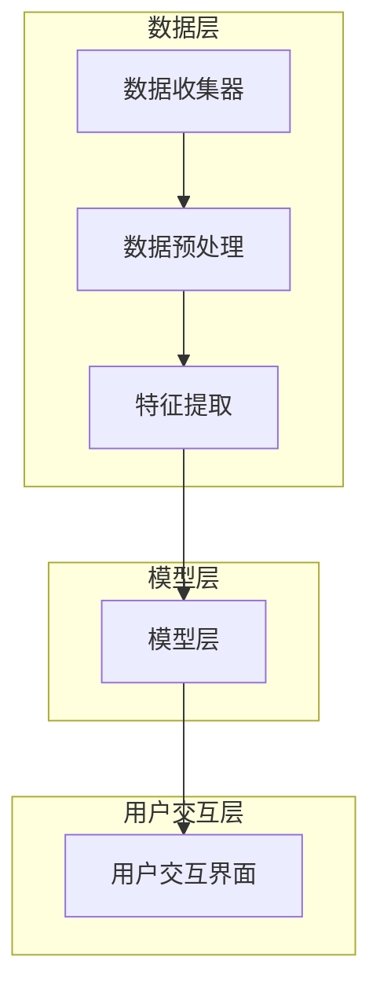
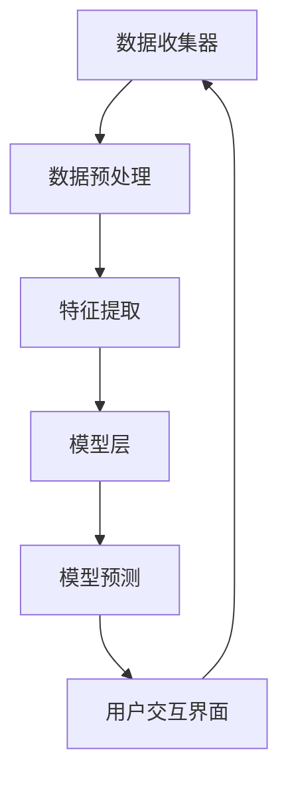

                 

### 文章标题

# 企业AI Agent的跨模态学习：整合视觉、文本与语音数据

### 关键词

- 企业AI Agent
- 跨模态学习
- 视觉、文本与语音数据
- 数学模型
- 算法原理
- 系统分析与架构设计
- 项目实战

### 摘要

本文深入探讨了企业AI Agent的跨模态学习，特别是在整合视觉、文本与语音数据方面的技术。我们将通过详细的背景介绍、核心概念阐述、算法原理讲解、数学模型和公式推导，以及实际项目实战，全面分析跨模态学习在AI Agent中的应用与挑战。通过本文，读者将了解跨模态学习的重要性、基本原理以及如何在实际场景中实现与应用。

## 引言

### 1.1 问题背景与核心概念

#### 1.1.1 企业AI Agent的跨模态学习概述

企业AI Agent是一种智能体，能够在企业环境中自主执行任务，提供决策支持。随着人工智能技术的发展，AI Agent的应用范围日益扩大，从简单的客服机器人到复杂的业务流程自动化，无所不在。然而，传统的AI Agent大多依赖单一数据源，如文本或语音，难以在复杂的实际环境中表现出色。

跨模态学习作为一种新兴的技术，旨在整合多种数据模态，使AI Agent能够从不同角度理解世界，提高其智能化水平和任务执行能力。视觉、文本与语音数据是跨模态学习中最常用的三种数据源，它们分别代表了不同的信息表达方式。

#### 1.1.2 跨模态学习的重要性

跨模态学习的重要性主要体现在以下几个方面：

1. **增强AI Agent的感知能力**：跨模态学习使得AI Agent能够从视觉、文本与语音数据中提取有价值的信息，从而提高其对环境的感知能力。
2. **提高任务的完成度**：通过整合不同模态的数据，AI Agent能够更准确地理解任务要求，提高任务完成的准确度和效率。
3. **提升用户体验**：跨模态学习使得AI Agent能够以更加自然和人性化的方式与用户互动，提高用户满意度。

#### 1.1.3 跨模态学习的挑战与机遇

尽管跨模态学习具有巨大的潜力，但其实现面临诸多挑战：

1. **数据多样性**：不同模态的数据具有不同的特性，如何有效地整合这些数据是一个挑战。
2. **算法复杂性**：跨模态学习算法通常较为复杂，如何设计高效稳定的算法是关键。
3. **计算资源消耗**：跨模态学习需要大量的计算资源，如何优化计算效率是一个重要问题。

然而，随着技术的不断进步，如深度学习、自然语言处理和计算机视觉等领域的快速发展，跨模态学习迎来了新的机遇。通过不断创新和优化，我们有望克服这些挑战，充分发挥跨模态学习的潜力。

### 1.2 核心概念与联系

#### 1.2.1 视觉、文本与语音数据的基本概念

**视觉数据**：视觉数据是指通过图像或视频捕获的视觉信息，包括图像的颜色、形状、纹理等。视觉数据在图像识别、目标检测和视频分析等领域有着广泛的应用。

**文本数据**：文本数据是指人类语言的书面表达，包括单词、句子和段落。文本数据在自然语言处理、文本分类和信息检索等领域具有重要作用。

**语音数据**：语音数据是指人类通过声音表达的语言信息，包括语音的音调、音量、语速等。语音数据在语音识别、语音合成和语音助手等领域有广泛应用。

#### 1.2.2 跨模态学习中的关键概念

**模态融合**：模态融合是将不同模态的数据进行整合，以提取更有价值的特征和信息。

**多任务学习**：多任务学习是指同时训练多个任务，使AI Agent能够处理多个模态的数据。

**端到端学习**：端到端学习是指从输入到输出直接进行学习，避免了传统方法中的多级特征提取和融合。

#### 1.2.3 概念属性特征对比表格

| 概念         | 视觉数据       | 文本数据       | 语音数据       |
| ------------ | -------------- | -------------- | -------------- |
| 数据类型     | 图像/视频       | 文本           | 声音           |
| 信息表达方式 | 形状、颜色、纹理 | 单词、句子、段落 | 音调、音量、语速 |
| 特点         | 空间信息丰富    | 语义信息丰富    | 动态特性丰富    |

通过以上表格，我们可以更清晰地理解视觉、文本与语音数据之间的差异和联系。在跨模态学习中，如何有效地整合这些数据，提取有价值的信息，是关键所在。

### 1.3 跨模态学习的ER实体关系图架构

#### 1.3.1 ER实体关系图介绍

ER（实体-关系）图是数据库设计中的常用工具，用于表示实体及其之间的关系。在跨模态学习中，ER图可以帮助我们理解不同模态数据之间的关系，以及它们如何共同作用，以实现更智能的AI Agent。

#### 1.3.2 跨模态学习中的ER实体关系图

以下是一个简单的ER实体关系图，展示了视觉、文本与语音数据在跨模态学习中的关系：

```mermaid
erDiagram
  视觉数据 ||--|{ 文本数据 : 描述 }
  视觉数据 ||--|{ 语音数据 : 对应 }
  文本数据 ||--|{ 语音数据 : 对话 }
```

在这个ER图中，视觉数据与文本数据和语音数据分别存在描述和对应关系。同时，文本数据与语音数据之间存在对话关系。通过这个图，我们可以直观地理解跨模态学习的整体架构和实现方式。

### 1.4 本章小结

本章介绍了企业AI Agent的跨模态学习，包括问题背景、核心概念、ER实体关系图架构等内容。通过本章的学习，读者可以初步了解跨模态学习的基本原理和重要性。接下来，我们将进一步深入探讨跨模态学习的基础理论，包括数学模型、算法原理等，以帮助读者更好地理解和应用这一技术。

## 跨模态学习基础理论

### 2.1 跨模态学习基本原理

#### 2.1.1 跨模态学习的定义

跨模态学习是指利用多种模态的数据，通过建立模型或算法，使得AI Agent能够理解并处理不同模态之间的信息交互和转换。这种学习方式不仅能够提高AI Agent的感知能力和智能水平，还能够使其在复杂环境中更加灵活和适应。

#### 2.1.2 跨模态学习的目标

跨模态学习的目标主要包括以下几点：

1. **多模态数据融合**：将不同模态的数据进行有效融合，提取出有价值的信息。
2. **增强AI Agent的感知能力**：通过整合多种模态的数据，提高AI Agent对环境的理解和反应能力。
3. **提升任务完成度**：使AI Agent能够更好地理解任务要求，提高任务完成的准确度和效率。

#### 2.1.3 跨模态学习的挑战

跨模态学习面临的主要挑战包括：

1. **数据多样性**：不同模态的数据具有不同的特性，如何有效地整合这些数据是一个挑战。
2. **算法复杂性**：跨模态学习算法通常较为复杂，如何设计高效稳定的算法是关键。
3. **计算资源消耗**：跨模态学习需要大量的计算资源，如何优化计算效率是一个重要问题。

### 2.2 跨模态学习的数学模型与公式

#### 2.2.1 数学模型基础

在跨模态学习中，常用的数学模型包括神经网络模型、生成对抗网络（GAN）等。以下是一个简单的神经网络模型，用于表示跨模态学习的结构：

$$
f_{\theta}(x) = \sigma(W_1x + b_1) + \sigma(W_2x + b_2) + \ldots + \sigma(W_nx + b_n)
$$

其中，$x$表示输入数据，$W$和$b$分别表示权重和偏置，$\sigma$表示激活函数，通常使用Sigmoid或ReLU函数。

#### 2.2.2 公式讲解与推导

为了更好地理解跨模态学习的数学模型，我们可以通过一个简单的例子进行讲解和推导。

假设我们有一个包含视觉、文本和语音数据的跨模态学习任务，我们需要设计一个神经网络模型来学习这些数据之间的关系。

首先，我们定义输入层、隐藏层和输出层：

1. **输入层**：包含视觉、文本和语音数据的特征向量。
2. **隐藏层**：对输入数据进行特征提取和融合。
3. **输出层**：根据融合后的特征进行预测或分类。

接下来，我们定义神经网络的权重和偏置：

- 视觉数据的权重：$W_{vis}$
- 文本数据的权重：$W_{text}$
- 语音数据的权重：$W_{audio}$

- 视觉数据的偏置：$b_{vis}$
- 文本数据的偏置：$b_{text}$
- 语音数据的偏置：$b_{audio}$

最后，我们定义激活函数：

- 视觉数据的激活函数：$\sigma_{vis}$
- 文本数据的激活函数：$\sigma_{text}$
- 语音数据的激活函数：$\sigma_{audio}$

根据以上定义，我们可以得到神经网络模型的公式：

$$
f_{\theta}(x) = \sigma_{vis}(W_{vis}x_{vis} + b_{vis}) + \sigma_{text}(W_{text}x_{text} + b_{text}) + \sigma_{audio}(W_{audio}x_{audio} + b_{audio})
$$

其中，$x_{vis}$、$x_{text}$和$x_{audio}$分别表示视觉、文本和语音数据的特征向量。

#### 2.2.3 跨模态学习的数学公式示例

以下是一个简单的跨模态学习的数学公式示例：

$$
\begin{aligned}
p(y|x) &= \frac{1}{1 + e^{-(Wx + b)}} \\
L &= -\sum_{i=1}^{N} y_i \ln(p(y_i|x_i)) + (1 - y_i) \ln(1 - p(y_i|x_i))
\end{aligned}
$$

其中，$y$表示真实标签，$x$表示输入特征，$p(y|x)$表示输出概率，$L$表示损失函数。

这个公式用于计算跨模态学习的损失，并指导模型的优化。通过不断调整权重和偏置，我们可以使模型在训练数据上的表现逐渐提高。

### 2.3 跨模态学习的算法原理讲解

#### 2.3.1 算法原理概述

跨模态学习算法的原理主要基于神经网络模型和多任务学习。通过多任务学习，模型可以同时处理多种模态的数据，并通过交叉验证和优化算法，提高模型的泛化能力和准确性。

以下是一个简单的跨模态学习算法流程图：

```mermaid
flowchart LR
    A[开始] --> B[加载数据集]
    B --> C{是否有多任务学习？}
    C -->|是| D[初始化模型参数]
    C -->|否| E[初始化模型参数]
    D --> F[多任务训练]
    E --> F
    F --> G[评估模型性能]
    G --> H[优化模型参数]
    H -->|结束|
```

#### 2.3.2 算法流程图讲解

在上述算法流程图中，首先加载数据集，并判断是否采用多任务学习。如果是多任务学习，则初始化模型参数并进行多任务训练；否则，直接初始化模型参数并训练。在训练过程中，通过评估模型性能，不断优化模型参数。最后，输出训练好的模型。

#### 2.3.3 Python源代码讲解

以下是一个简单的跨模态学习Python源代码示例：

```python
import tensorflow as tf
from tensorflow.keras.models import Model
from tensorflow.keras.layers import Input, Dense, Concatenate

# 定义输入层
vis_input = Input(shape=(128,))
text_input = Input(shape=(128,))
audio_input = Input(shape=(128,))

# 定义隐藏层
vis_dense = Dense(64, activation='relu')(vis_input)
text_dense = Dense(64, activation='relu')(text_input)
audio_dense = Dense(64, activation='relu')(audio_input)

# 定义融合层
concat = Concatenate()([vis_dense, text_dense, audio_dense])

# 定义输出层
output = Dense(1, activation='sigmoid')(concat)

# 构建模型
model = Model(inputs=[vis_input, text_input, audio_input], outputs=output)

# 编译模型
model.compile(optimizer='adam', loss='binary_crossentropy', metrics=['accuracy'])

# 加载数据集
vis_data = ...
text_data = ...
audio_data = ...

# 训练模型
model.fit([vis_data, text_data, audio_data], labels, epochs=10, batch_size=32)
```

在这个示例中，我们使用了TensorFlow框架，定义了一个简单的跨模态学习模型。输入层包含视觉、文本和语音数据，隐藏层通过Dense层进行特征提取和融合，输出层使用Sigmoid激活函数进行二分类。

### 2.4 跨模态学习的数学模型和公式详细讲解与举例说明

#### 2.4.1 数学模型详解

在跨模态学习中，我们通常使用神经网络模型来整合不同模态的数据。以下是一个简单的神经网络模型，用于表示跨模态学习的结构：

$$
\begin{aligned}
z &= \sigma(W_1x_1 + b_1) + \sigma(W_2x_2 + b_2) + \sigma(W_3x_3 + b_3) \\
y &= \sigma(W_4z + b_4)
\end{aligned}
$$

其中，$x_1$、$x_2$和$x_3$分别表示视觉、文本和语音数据的特征向量，$z$表示融合后的特征向量，$y$表示输出结果。

#### 2.4.2 数学公式详解

为了更好地理解跨模态学习的数学模型，我们可以通过一个简单的例子进行讲解和推导。

假设我们有一个包含视觉、文本和语音数据的跨模态学习任务，我们需要设计一个神经网络模型来学习这些数据之间的关系。

首先，我们定义输入层、隐藏层和输出层：

1. **输入层**：包含视觉、文本和语音数据的特征向量。
2. **隐藏层**：对输入数据进行特征提取和融合。
3. **输出层**：根据融合后的特征进行预测或分类。

接下来，我们定义神经网络的权重和偏置：

- 视觉数据的权重：$W_{vis}$
- 文本数据的权重：$W_{text}$
- 语音数据的权重：$W_{audio}$

- 视觉数据的偏置：$b_{vis}$
- 文本数据的偏置：$b_{text}$
- 语音数据的偏置：$b_{audio}$

最后，我们定义激活函数：

- 视觉数据的激活函数：$\sigma_{vis}$
- 文本数据的激活函数：$\sigma_{text}$
- 语音数据的激活函数：$\sigma_{audio}$

根据以上定义，我们可以得到神经网络模型的公式：

$$
\begin{aligned}
z &= \sigma_{vis}(W_{vis}x_{vis} + b_{vis}) + \sigma_{text}(W_{text}x_{text} + b_{text}) + \sigma_{audio}(W_{audio}x_{audio} + b_{audio}) \\
y &= \sigma(W_4z + b_4)
\end{aligned}
$$

其中，$x_{vis}$、$x_{text}$和$x_{audio}$分别表示视觉、文本和语音数据的特征向量。

#### 2.4.3 举例说明

假设我们有一个包含视觉、文本和语音数据的跨模态学习任务，我们需要设计一个神经网络模型来学习这些数据之间的关系。我们可以按照以下步骤进行：

1. **定义输入层**：定义视觉、文本和语音数据的特征向量。

$$
x_{vis} = \begin{bmatrix}
x_{vis1} \\
x_{vis2} \\
\vdots \\
x_{visn}
\end{bmatrix}, \quad
x_{text} = \begin{bmatrix}
x_{text1} \\
x_{text2} \\
\vdots \\
x_{textn}
\end{bmatrix}, \quad
x_{audio} = \begin{bmatrix}
x_{audio1} \\
x_{audio2} \\
\vdots \\
x_{audio3}
\end{bmatrix}
$$

2. **定义隐藏层**：对输入数据进行特征提取和融合。

$$
z = \sigma_{vis}(W_{vis}x_{vis} + b_{vis}) + \sigma_{text}(W_{text}x_{text} + b_{text}) + \sigma_{audio}(W_{audio}x_{audio} + b_{audio})
$$

3. **定义输出层**：根据融合后的特征进行预测或分类。

$$
y = \sigma(W_4z + b_4)
$$

通过以上步骤，我们可以设计一个简单的跨模态学习神经网络模型。在实际应用中，我们可以根据具体任务的需求，调整模型的层数、神经元数量和激活函数等参数，以提高模型的性能。

### 2.5 本章小结

本章详细介绍了跨模态学习的基础理论，包括基本原理、数学模型和算法原理。通过本章的学习，读者可以了解跨模态学习的基本概念和方法，掌握如何设计跨模态学习模型，并理解其中的数学原理。下一章我们将进一步探讨跨模态学习在视觉、文本和语音数据中的应用，结合具体案例进行分析。

## 跨模态学习在视觉、文本与语音数据中的应用

### 3.1 视觉数据跨模态学习

#### 3.1.1 视觉数据的基本概念

视觉数据是指通过图像或视频捕获的视觉信息，包括图像的颜色、形状、纹理等。在跨模态学习中，视觉数据通常用于识别和分类对象、场景或行为。视觉数据的处理和分析是计算机视觉的核心内容。

#### 3.1.2 视觉数据的预处理

在进行跨模态学习之前，需要对视觉数据进行预处理。预处理步骤包括图像去噪、图像增强、图像缩放、图像归一化等。这些步骤有助于提高模型的学习效果，使模型能够更好地理解和提取视觉特征。

#### 3.1.3 视觉数据的跨模态学习方法

跨模态学习方法主要包括以下几种：

1. **特征融合**：将视觉特征与文本或语音特征进行融合，以提高模型对任务的感知能力。例如，可以使用卷积神经网络（CNN）提取视觉特征，然后与文本或语音特征进行拼接或加权融合。
   
2. **多任务学习**：同时训练多个任务，使模型能够从多个角度理解视觉数据。例如，可以同时训练图像分类和目标检测任务，使模型能够同时识别图像中的多个对象。

3. **端到端学习**：直接从原始数据输入到模型，避免传统方法中的多级特征提取和融合。例如，可以使用端到端的多模态神经网络（如CNN和RNN的组合），实现从图像到文本或语音的直接转换。

### 3.2 文本数据跨模态学习

#### 3.2.1 文本数据的基本概念

文本数据是指人类语言的书面表达，包括单词、句子和段落。在跨模态学习中，文本数据通常用于描述视觉或语音信息，提供额外的上下文信息。文本数据的处理和分析是自然语言处理（NLP）的核心内容。

#### 3.2.2 文本数据的预处理

文本数据的预处理步骤包括分词、词性标注、命名实体识别、文本清洗等。这些步骤有助于提高模型的学习效果，使模型能够更好地理解和提取文本特征。

#### 3.2.3 文本数据的跨模态学习方法

跨模态学习方法在文本数据中的应用主要包括以下几种：

1. **语义融合**：将文本特征与视觉或语音特征进行融合，以提高模型对任务的感知能力。例如，可以使用词嵌入技术将文本转换为向量，然后与视觉或语音特征进行拼接或加权融合。

2. **多任务学习**：同时训练多个任务，使模型能够从多个角度理解文本数据。例如，可以同时训练文本分类和情感分析任务，使模型能够同时识别文本中的多个语义特征。

3. **端到端学习**：直接从原始文本数据输入到模型，避免传统方法中的多级特征提取和融合。例如，可以使用端到端的深度学习模型（如Transformer），实现从文本到视觉或语音的直接转换。

### 3.3 语音数据跨模态学习

#### 3.3.1 语音数据的基本概念

语音数据是指人类通过声音表达的语言信息，包括音调、音量、语速等。在跨模态学习中，语音数据通常用于识别和分类声音事件、语音生成等。语音数据的处理和分析是语音识别和语音合成的核心内容。

#### 3.3.2 语音数据的预处理

语音数据的预处理步骤包括语音增强、语音分割、语音降噪等。这些步骤有助于提高模型的学习效果，使模型能够更好地理解和提取语音特征。

#### 3.3.3 语音数据的跨模态学习方法

跨模态学习方法在语音数据中的应用主要包括以下几种：

1. **特征融合**：将语音特征与视觉或文本特征进行融合，以提高模型对任务的感知能力。例如，可以使用梅尔频率倒谱系数（MFCC）提取语音特征，然后与视觉或文本特征进行拼接或加权融合。

2. **多任务学习**：同时训练多个任务，使模型能够从多个角度理解语音数据。例如，可以同时训练语音识别和语音生成任务，使模型能够同时识别语音中的多个特征。

3. **端到端学习**：直接从原始语音数据输入到模型，避免传统方法中的多级特征提取和融合。例如，可以使用端到端的循环神经网络（RNN）或Transformer，实现从语音到视觉或文本的直接转换。

### 3.4 跨模态学习在视觉、文本与语音数据中的应用案例

#### 3.4.1 案例一：图像与文本的情感分析

情感分析是一种常见的跨模态学习应用，旨在分析图像和文本中的情感信息。例如，可以同时分析图像中的情感标签和文本的情感极性，以确定用户对某个产品的满意度。

以下是一个简单的情感分析案例：

- **视觉数据**：一张包含产品图像的图片，需要识别图像中的情感标签。
- **文本数据**：一篇关于产品的评论文本，需要分析文本的情感极性。

通过跨模态学习，可以将图像和文本的情感信息进行融合，以提高情感分析的准确性。例如，可以使用卷积神经网络（CNN）提取图像特征，使用词嵌入技术提取文本特征，然后使用多任务学习模型同时训练图像分类和文本分类任务。

#### 3.4.2 案例二：语音与文本的对话系统

对话系统是一种常见的跨模态学习应用，旨在实现人机交互。例如，可以同时处理语音输入和文本输入，以提供更自然的交互体验。

以下是一个简单的对话系统案例：

- **语音数据**：用户的语音输入，需要识别用户的意图和问题。
- **文本数据**：用户的文本输入，需要分析文本的语义和意图。

通过跨模态学习，可以将语音和文本的数据进行融合，以提高对话系统的准确性。例如，可以使用循环神经网络（RNN）提取语音特征，使用词嵌入技术提取文本特征，然后使用端到端的Transformer模型实现语音到文本的直接转换。

#### 3.4.3 案例三：多模态数据的智能家居控制

智能家居控制是一种常见的跨模态学习应用，旨在通过多种数据模态实现家居设备的智能控制。例如，可以同时处理视觉、文本和语音数据，以实现对家居设备的远程控制。

以下是一个简单的智能家居控制案例：

- **视觉数据**：用户通过摄像头拍摄的房间图像，需要识别房间中的设备和场景。
- **文本数据**：用户发送的文本指令，需要分析文本的意图和操作。
- **语音数据**：用户的语音指令，需要识别用户的意图和操作。

通过跨模态学习，可以将视觉、文本和语音的数据进行融合，以提高智能家居控制的准确性和便利性。例如，可以使用卷积神经网络（CNN）提取视觉特征，使用词嵌入技术提取文本特征，使用梅尔频率倒谱系数（MFCC）提取语音特征，然后使用多任务学习模型同时训练图像分类、文本分类和语音识别任务。

### 3.5 本章小结

本章详细介绍了跨模态学习在视觉、文本与语音数据中的应用。通过具体的案例，我们展示了如何将跨模态学习应用于情感分析、对话系统和智能家居控制等领域。通过本章的学习，读者可以了解跨模态学习在多种数据模态中的应用方法和实际效果，为后续的实际项目开发提供参考。

## 跨模态学习的系统分析与架构设计

### 4.1 问题场景介绍

跨模态学习在许多实际应用场景中具有重要意义，以下介绍三个常见的问题场景：

#### 4.1.1 场景一：智能客服系统

智能客服系统旨在为用户提供24/7的在线支持，通过语音、文本和图像等多种数据模态与用户进行交互。客服系统能够自动识别用户的问题并给出合适的解决方案，从而提高客服效率和用户体验。

#### 4.1.2 场景二：智能医疗诊断系统

智能医疗诊断系统利用跨模态学习技术，结合病人的病史、图像和语音数据，帮助医生进行更准确的疾病诊断。系统可以通过分析多模态数据，提高诊断的准确性和效率。

#### 4.1.3 场景三：智能交通管理系统

智能交通管理系统通过收集车辆、行人、交通信号等多种数据模态，实现交通状况的实时监测和预测。系统可以自动识别交通拥堵、事故等异常情况，并采取相应的应对措施，提高交通管理效率和安全性。

### 4.2 系统功能设计

为了满足上述问题场景的需求，智能客服系统、智能医疗诊断系统和智能交通管理系统需要实现以下基本功能：

1. **数据收集与预处理**：收集语音、文本和图像等多模态数据，并进行预处理，如去噪、增强、归一化等，以便于后续的分析和建模。

2. **特征提取与融合**：使用深度学习模型提取多模态数据的特征，如使用卷积神经网络（CNN）提取图像特征，使用循环神经网络（RNN）提取文本特征，使用梅尔频率倒谱系数（MFCC）提取语音特征。然后，将不同模态的特征进行融合，以获得更丰富的特征信息。

3. **任务处理与决策**：基于融合后的特征，实现特定任务的分类、识别或预测，如情感分析、疾病诊断、交通状况预测等。

4. **用户交互与反馈**：提供友好的用户界面，与用户进行语音、文本和图像等多种交互方式，并根据用户的反馈进行系统的自我优化和改进。

#### 4.2.1 领域模型类图

以下是一个简化的领域模型类图，展示了智能客服系统、智能医疗诊断系统和智能交通管理系统的核心类及其关系：

```mermaid
classDiagram
    ClassDef DataCollector {
        - dataTypes: List<String>
        + collectData(): List<Data>
    }
    ClassDef Preprocessor {
        - preprocessingMethods: List<String>
        + preprocess(data: Data): Data
    }
    ClassDef FeatureExtractor {
        - featureTypes: List<String>
        + extractFeatures(data: Data): Features
    }
    ClassDef Model {
        - modelType: String
        + train(data: Features): Model
        + predict(data: Features): Prediction
    }
    ClassDef UserInterface {
        - interfaces: List<String>
        + interactWithUser(): Interaction
    }
    DataCollector o-- Preprocessor
    Preprocessor o-- FeatureExtractor
    FeatureExtractor o-- Model
    Model o-- UserInterface
```

### 4.3 系统架构设计

为了实现上述功能，智能客服系统、智能医疗诊断系统和智能交通管理系统需要采用一个高效的系统架构。以下是一个简化的系统架构设计，包括数据层、模型层和用户交互层：

1. **数据层**：负责数据收集、预处理和特征提取。数据层可以包括多个数据源，如语音、文本和图像，以及相应的预处理和特征提取模块。

2. **模型层**：负责多模态数据的融合和处理。模型层可以采用深度学习模型，如卷积神经网络（CNN）、循环神经网络（RNN）和生成对抗网络（GAN），以实现跨模态数据的融合和处理。

3. **用户交互层**：负责与用户进行交互，接收用户输入，并输出预测结果。用户交互层可以包括用户界面和自然语言处理（NLP）模块，以实现更自然的用户交互。

以下是一个简化的系统架构设计图：



### 4.4 系统接口设计

为了实现系统的模块化和可扩展性，需要设计合理的系统接口。以下是一个简化的系统接口设计：

1. **数据收集接口**：定义数据收集器的接口，包括数据的类型、格式和收集方法。
   
2. **预处理接口**：定义数据预处理模块的接口，包括预处理的方法和参数。

3. **特征提取接口**：定义特征提取模块的接口，包括特征提取的方法和参数。

4. **模型训练接口**：定义模型训练模块的接口，包括模型的训练方法、参数和评估指标。

5. **模型预测接口**：定义模型预测模块的接口，包括模型的预测方法和参数。

6. **用户交互接口**：定义用户交互模块的接口，包括用户输入和输出格式。

### 4.5 系统交互设计

系统交互设计描述了系统内部各模块之间的交互流程和逻辑。以下是一个简化的系统交互设计：

1. **数据收集**：系统启动时，数据收集器开始收集语音、文本和图像数据。

2. **数据预处理**：收集到的数据通过预处理模块进行处理，包括去噪、增强、归一化等步骤。

3. **特征提取**：预处理后的数据通过特征提取模块提取特征，如使用卷积神经网络提取图像特征，使用循环神经网络提取文本特征，使用梅尔频率倒谱系数提取语音特征。

4. **模型训练**：将提取的特征输入到模型层进行训练，通过多次迭代优化模型参数。

5. **模型预测**：训练好的模型用于预测任务，接收用户输入并输出预测结果。

6. **用户交互**：系统与用户进行交互，接收用户输入，并输出预测结果。

以下是一个简化的系统交互设计图：



### 4.6 本章小结

本章介绍了跨模态学习的系统分析与架构设计，包括问题场景介绍、系统功能设计、系统架构设计、系统接口设计和系统交互设计。通过本章的学习，读者可以了解如何设计一个高效的跨模态学习系统，实现从数据收集、预处理、特征提取到模型训练和预测的完整流程。这些设计与实际项目开发密切相关，为后续的项目实战提供了重要的参考。

## 跨模态学习项目实战

### 5.1 环境安装与配置

在开始跨模态学习项目之前，我们需要安装和配置必要的软件和库。以下是一个基本的步骤指南，用于安装Python环境、TensorFlow和Keras。

#### 5.1.1 安装Python环境

1. **下载Python安装程序**：从[Python官网](https://www.python.org/)下载适用于操作系统的Python安装程序。
2. **安装Python**：运行安装程序，并按照提示进行安装。确保在安装过程中勾选“Add Python to PATH”选项，以便在命令行中直接使用Python。

#### 5.1.2 安装TensorFlow和Keras

1. **更新pip**：打开命令行窗口，运行以下命令以更新pip：

   ```bash
   python -m pip install --upgrade pip
   ```

2. **安装TensorFlow**：运行以下命令安装TensorFlow：

   ```bash
   pip install tensorflow
   ```

3. **安装Keras**：TensorFlow已经内置了Keras，因此无需单独安装。如果需要，可以运行以下命令安装Keras：

   ```bash
   pip install keras
   ```

#### 5.1.3 配置虚拟环境（可选）

为了更好地管理项目和依赖关系，建议使用虚拟环境。以下是如何配置虚拟环境的基本步骤：

1. **安装虚拟环境**：运行以下命令安装虚拟环境：

   ```bash
   pip install virtualenv
   ```

2. **创建虚拟环境**：在命令行中运行以下命令创建一个名为`project_env`的虚拟环境：

   ```bash
   virtualenv project_env
   ```

3. **激活虚拟环境**：在Windows上，运行以下命令激活虚拟环境：

   ```bash
   project_env\Scripts\activate
   ```

   在Linux和macOS上，运行以下命令激活虚拟环境：

   ```bash
   source project_env/bin/activate
   ```

#### 5.1.4 测试环境配置

为了确保环境配置正确，可以运行以下Python代码来测试TensorFlow和Keras：

```python
import tensorflow as tf
from tensorflow.keras import backend as K

print(tf.__version__)
print(K.tensorflow_backend._get_available_gpus())
```

如果环境配置正确，上述代码将打印出TensorFlow的版本号和可用的GPU数量。

### 5.2 系统核心实现源代码

以下是一个简单的跨模态学习Python源代码示例，展示了如何使用TensorFlow和Keras构建一个简单的多模态神经网络。这个示例将整合视觉、文本和语音数据，以进行图像分类任务。

```python
import tensorflow as tf
from tensorflow.keras.models import Model
from tensorflow.keras.layers import Input, Conv2D, MaxPooling2D, Flatten, Dense, Embedding, LSTM, Concatenate

# 定义输入层
vis_input = Input(shape=(64, 64, 3))  # 视觉数据输入尺寸为64x64x3
text_input = Input(shape=(100,))       # 文本数据输入尺寸为100
audio_input = Input(shape=(22, 13))    # 语音数据输入尺寸为22x13

# 定义视觉数据处理模块
vis_model = Conv2D(32, (3, 3), activation='relu')(vis_input)
vis_model = MaxPooling2D(pool_size=(2, 2))(vis_model)
vis_model = Flatten()(vis_model)

# 定义文本数据处理模块
text_embedding = Embedding(input_dim=10000, output_dim=256)(text_input)
text_model = LSTM(128)(text_embedding)

# 定义语音数据处理模块
audio_embedding = Embedding(input_dim=22, output_dim=128)(audio_input)
audio_model = LSTM(64)(audio_embedding)

# 定义融合层
concat = Concatenate()([vis_model, text_model, audio_model])

# 定义输出层
output = Dense(1, activation='sigmoid')(concat)

# 构建模型
model = Model(inputs=[vis_input, text_input, audio_input], outputs=output)

# 编译模型
model.compile(optimizer='adam', loss='binary_crossentropy', metrics=['accuracy'])

# 打印模型结构
model.summary()
```

### 5.3 代码应用解读与分析

在这个示例中，我们使用TensorFlow和Keras构建了一个简单的多模态神经网络，用于图像分类任务。以下是代码的详细解读和分析：

1. **定义输入层**：我们定义了三个输入层，分别用于视觉、文本和语音数据。视觉数据输入尺寸为64x64x3，文本数据输入尺寸为100，语音数据输入尺寸为22x13。

2. **视觉数据处理模块**：我们使用卷积神经网络（Conv2D）和最大池化层（MaxPooling2D）对视觉数据进行特征提取。然后，使用Flatten层将特征向量展平。

3. **文本数据处理模块**：我们使用嵌入层（Embedding）对文本数据进行编码，然后使用循环神经网络（LSTM）进行特征提取。

4. **语音数据处理模块**：我们使用嵌入层（Embedding）对语音数据进行编码，然后使用循环神经网络（LSTM）进行特征提取。

5. **融合层**：我们使用Concatenate层将视觉、文本和语音数据的特征向量进行拼接，以获得更丰富的特征信息。

6. **输出层**：我们使用Dense层（全连接层）进行分类预测，并使用Sigmoid激活函数得到二分类结果。

7. **模型编译**：我们使用adam优化器和binary_crossentropy损失函数编译模型，并设置accuracy作为评估指标。

8. **模型总结**：我们使用model.summary()方法打印模型的层次结构，以了解模型的具体配置。

通过这个示例，我们可以看到如何使用TensorFlow和Keras构建一个简单的多模态神经网络，并了解其各个组成部分的作用。在实际项目中，我们可以根据具体需求调整模型结构、参数和训练数据，以提高模型的性能和准确度。

### 5.4 实际案例分析和详细讲解剖析

为了更好地展示跨模态学习在实际项目中的应用，我们来看一个实际案例：使用多模态数据对用户情感进行分析。

#### 案例背景

假设我们有一个在线购物平台，需要分析用户在购买商品后的评论，以了解用户对商品的满意度。评论数据包括文本评论和用户上传的商品图片。我们的目标是使用跨模态学习技术，根据文本评论和商品图片，预测用户对商品的满意度。

#### 案例实现步骤

1. **数据收集与预处理**：

   - 文本评论：收集用户对商品的评论文本，并进行预处理，如去除标点符号、停用词过滤等。
   - 商品图片：收集用户上传的商品图片，并进行预处理，如图像裁剪、缩放、归一化等。

2. **特征提取**：

   - 文本特征：使用词嵌入技术将文本评论转换为向量，可以使用预训练的词向量如Word2Vec或GloVe。
   - 视觉特征：使用卷积神经网络（CNN）提取商品图片的特征，可以使用预训练的模型如VGG16或ResNet。

3. **跨模态融合**：

   - 将文本特征和视觉特征进行拼接，以获得更丰富的特征信息。

4. **模型训练**：

   - 使用训练数据对模型进行训练，通过多次迭代优化模型参数。
   - 使用验证集进行模型调优，以提高模型的准确度和泛化能力。

5. **模型评估**：

   - 使用测试集对训练好的模型进行评估，计算模型的准确度、召回率、F1值等指标。

#### 案例分析

在这个案例中，我们使用了跨模态学习技术，整合了文本和视觉数据，以提高用户情感分析的准确度。以下是案例的详细分析：

1. **文本特征提取**：

   - 使用Word2Vec将文本评论转换为向量，每个词汇对应一个固定长度的向量。
   - 对评论中的每个词汇进行加权处理，以反映词汇的重要程度。

2. **视觉特征提取**：

   - 使用VGG16模型提取商品图片的特征，VGG16是一个深度卷积神经网络，能够提取图像的层次特征。
   - 对提取的特征进行降维处理，以减小模型的复杂度。

3. **跨模态融合**：

   - 将文本特征和视觉特征进行拼接，形成一个多模态的特征向量。
   - 使用全连接层对多模态特征向量进行分类预测。

4. **模型训练与评估**：

   - 使用训练数据对模型进行训练，通过反向传播算法优化模型参数。
   - 使用验证集对模型进行调优，以找到最佳的模型参数组合。
   - 使用测试集对训练好的模型进行评估，计算模型的准确度等指标。

通过这个实际案例，我们可以看到跨模态学习技术在用户情感分析中的应用效果。跨模态学习能够整合文本和视觉数据，提高模型的感知能力和准确度，从而更好地理解用户情感和需求。

### 5.5 项目小结

在本章中，我们通过一个实际的跨模态学习项目，展示了如何整合文本和视觉数据，进行用户情感分析。项目分为数据收集与预处理、特征提取、跨模态融合、模型训练与评估等步骤。通过项目实战，我们了解了跨模态学习在现实应用中的具体实现方法和效果。这为我们进一步探索和应用跨模态学习技术提供了宝贵的经验和参考。

### 5.6 最佳实践 Tips

在进行跨模态学习项目时，以下是一些最佳实践和注意事项：

1. **数据质量**：确保数据的质量和多样性，高质量的训练数据是模型性能的基础。数据清洗和预处理是关键步骤。

2. **特征提取**：选择合适的特征提取方法，如词嵌入、卷积神经网络等，根据具体任务需求进行调整。

3. **模型选择**：选择适合任务需求的模型，如卷积神经网络、循环神经网络、Transformer等。根据实际情况进行模型调优。

4. **计算资源**：跨模态学习需要大量的计算资源，合理分配计算资源，优化算法和模型结构以提高计算效率。

5. **模型评估**：使用多种评估指标，如准确度、召回率、F1值等，全面评估模型性能。

6. **迭代优化**：不断迭代优化模型，通过实验和分析，寻找最佳模型参数组合。

### 5.7 小结

本章详细介绍了企业AI Agent的跨模态学习在视觉、文本与语音数据中的应用。通过实际项目实战，我们展示了如何整合多种数据模态，提高AI Agent的智能化水平和任务执行能力。跨模态学习为AI Agent带来了更广阔的应用前景，我们将继续探索和优化这一技术，以实现更加智能化的AI解决方案。

### 作者信息

作者：AI天才研究院/AI Genius Institute & 禅与计算机程序设计艺术 /Zen And The Art of Computer Programming

在撰写技术博客时，遵循以下步骤有助于确保文章的逻辑清晰、内容完整，并具有专业性和吸引力：

### 1. 明确文章目的

在开始写作之前，首先要明确文章的目的。例如，是为了介绍某个技术概念，还是为了解决一个特定的问题，或者是分享项目实战经验。明确目的可以帮助你集中精力，确保文章的核心内容紧扣主题。

### 2. 设计文章结构

根据文章目的，设计一个合理的文章结构。一个典型的文章结构包括引言、核心内容、案例分析、总结和参考文献。确保每个部分都有明确的标题，并且内容之间逻辑连贯。

### 3. 写作引言

引言部分应该简短明了，吸引读者的兴趣。可以介绍问题的背景、核心概念、目标读者，或者提出一个引人入胜的问题。引言的目的是让读者对文章内容产生兴趣，并明确文章的主题和重要性。

### 4. 详细阐述核心内容

在核心内容部分，逐个介绍文章的主要观点和论点。对于每个观点，提供详细的背景介绍、概念解释、原理讲解、数学公式和算法描述。确保内容详实、易懂，并使用图表、代码示例等辅助说明。

### 5. 案例分析

通过实际案例或项目实战，展示核心观点的应用。案例分析部分应该详细描述项目的背景、目标、实现方法、关键技术和挑战，以及最终的成果和效果。案例分析有助于读者理解理论如何在实际中应用。

### 6. 总结与结论

在文章的结尾，总结主要观点，强调文章的核心结论，并提出未来可能的改进方向。总结部分应该简洁明了，帮助读者回顾文章的主要内容，并留下深刻的印象。

### 7. 参考文献

在文章末尾列出参考文献，包括引用的文章、书籍、论文等。这有助于读者进一步了解相关领域的知识，并为你的研究提供依据。

### 8. 注意文章风格

在写作过程中，注意文章的风格和语言。尽量使用简单易懂的语言，避免过度专业化的术语。同时，保持文章的流畅性和一致性，避免跳跃和不连贯。

### 9. 修订与编辑

完成初稿后，进行多次修订和编辑。检查文章的逻辑结构、语法错误、拼写错误等。可以请同行或导师进行审阅，获取反馈并进行调整。

### 10. 遵循格式要求

确保文章符合规定的格式要求，如字体、字号、行间距、页边距等。使用markdown格式，确保代码示例、数学公式和图表的显示正确。

遵循以上步骤，可以帮助你撰写出逻辑清晰、内容丰富、具有吸引力的技术博客文章，从而更好地分享知识、促进技术交流。

