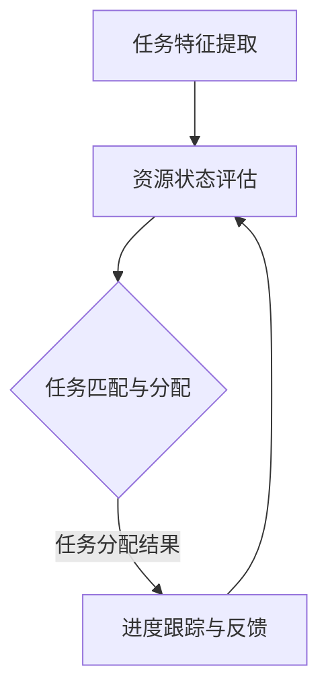
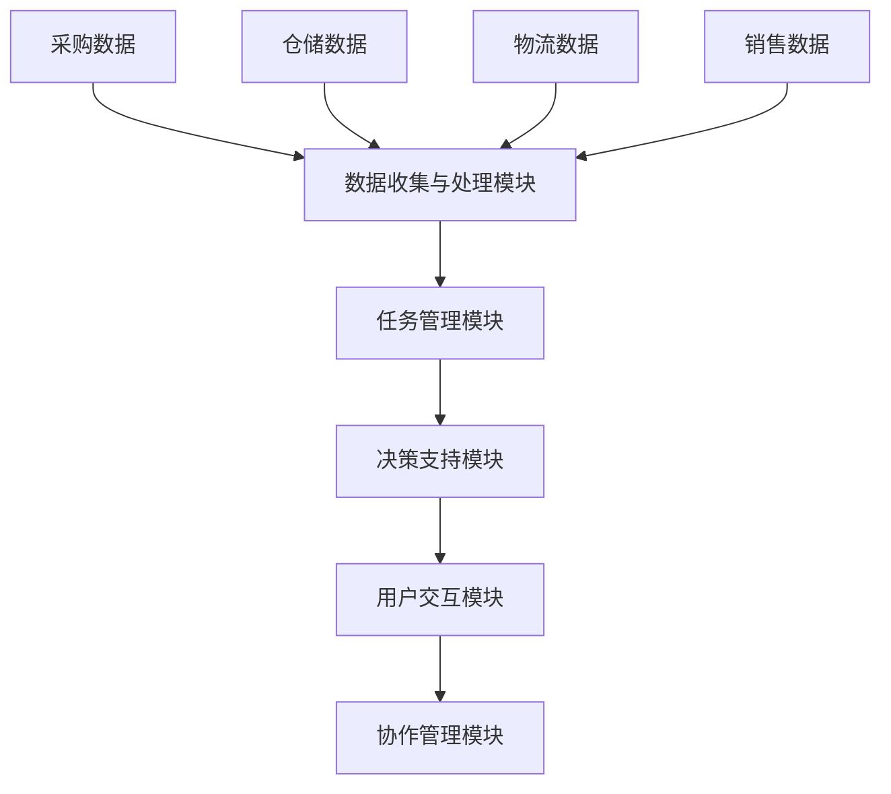

                 

### 文章标题：企业AI Agent的跨部门协作功能设计与实现

在当今快速发展的商业环境中，企业之间的竞争已经不再仅仅是产品和服务的竞争，更多的是关于效率、协作和创新能力的竞争。AI Agent作为一种新兴的技术手段，正在逐步改变着企业的运营模式。本文将围绕企业AI Agent的跨部门协作功能进行设计与实现，深入探讨如何利用AI技术提升企业内部协作效率，实现资源的最大化利用。

### 关键词

- 企业AI Agent
- 跨部门协作
- 系统架构设计
- 算法原理
- 实战案例

### 摘要

本文首先介绍了企业AI Agent的基本概念及其在跨部门协作中的应用背景。随后，详细分析了跨部门协作面临的挑战，包括信息孤岛、沟通壁垒等问题。接着，我们探讨了企业AI Agent的系统架构设计，并针对跨部门协作设计了一系列功能模块。随后，本文介绍了AI Agent协作算法的原理及其实现，通过mermaid流程图和Python源代码进行详细讲解。最后，我们通过一个实际案例，展示了如何在实际项目中应用这些技术和设计理念，并提出了一些最佳实践建议。

### 目录大纲设计思路

在制定目录大纲时，我们的目标是确保每个章节的内容都能够清晰、有条理地呈现，同时覆盖到核心概念、算法原理、系统架构、实战案例等关键内容。以下是我们设计目录大纲的详细思路：

1. **确定核心章节内容**：根据文章的主题，明确每一章节的核心内容，确保目录的完整性。例如，我们将文章分为以下几个部分：引言、企业AI Agent概述、跨部门协作的挑战、企业AI Agent的架构设计、跨部门协作功能设计、AI Agent协作算法、实战案例与优化、总结与展望。

2. **搭建框架**：首先设计一级目录，然后逐步细化到二级和三级目录。例如，在“企业AI Agent概述”这一章节中，我们可以进一步细化为“定义与发展历程”、“技术基础”、“跨部门协作的重要性”等。

3. **保持简洁**：确保每一章节标题简洁明了，避免冗余。例如，“任务分配”、“进度跟踪”、“资源共享”等章节标题都是简洁且具有描述性的。

4. **涵盖关键内容**：确保每个章节包含关键内容，如背景介绍、核心概念与联系、算法原理讲解、数学模型与公式、系统分析与架构设计方案、项目实战、最佳实践 tips、小结、注意事项、拓展阅读等。

5. **符合限制要求**：确保目录大纲的格式符合 markdown 标准，层级清晰，字数在限制范围内。例如，我们使用不同的标题层级（如#、##、###等）来区分章节和子章节，确保目录结构清晰。

### 目录大纲设计步骤

1. **第1章：引言**
   - 简述企业AI Agent的概念、跨部门协作的重要性以及本书的目的。

2. **第2章：企业AI Agent概述**
   - 介绍企业AI Agent的定义、发展历程、技术基础等。
   - 分析企业AI Agent在跨部门协作中的作用和优势。

3. **第3章：跨部门协作的挑战**
   - 分析跨部门协作面临的挑战，如信息孤岛、沟通壁垒等。
   - 探讨现有的解决方案及其局限性。

4. **第4章：企业AI Agent的架构设计**
   - 详细讲解企业AI Agent的系统架构设计，包括模块划分、接口设计等。
   - 分析不同架构设计方案的优缺点。

5. **第5章：跨部门协作功能设计**
   - 设计实现跨部门协作的具体功能，如任务分配、进度跟踪、资源共享等。
   - 分析这些功能如何提升企业内部协作效率。

6. **第6章：AI Agent协作算法**
   - 介绍AI Agent协作算法的原理，使用 mermaid 流程图展示算法流程。
   - 使用Python源代码详细阐述算法实现。

7. **第7章：实战案例与优化**
   - 分析实际企业中的跨部门协作案例，讨论优化策略。
   - 通过实际案例展示AI Agent的跨部门协作功能。

8. **第8章：总结与展望**
   - 总结本书的主要内容和启示。
   - 展望未来AI Agent在跨部门协作中的应用前景。

### 目录大纲（部分）

```
# 第一部分：企业AI Agent基础理论

## 第1章：引言
### 1.1 书籍目的与结构
### 1.2 企业AI Agent概述

## 第2章：企业AI Agent概述
### 2.1 定义与发展历程
### 2.2 技术基础
### 2.3 跨部门协作的重要性

## 第3章：跨部门协作的挑战
### 3.1 信息孤岛
### 3.2 沟通壁垒
### 3.3 协同效率低下

## 第4章：企业AI Agent的架构设计
### 4.1 系统架构概述
### 4.2 模块划分
### 4.3 接口设计

## 第5章：跨部门协作功能设计
### 5.1 任务分配
### 5.2 进度跟踪
### 5.3 资源共享

## 第6章：AI Agent协作算法
### 6.1 算法原理
### 6.2 mermaid流程图展示
### 6.3 算法实现细节

## 第7章：实战案例与优化
### 7.1 实战案例
### 7.2 案例分析
### 7.3 优化策略

## 第8章：总结与展望
### 8.1 总结
### 8.2 未来发展趋势
```

### 约束条件

在撰写本文时，我们需要遵循以下约束条件：

1. **文章开始是“文章标题”，然后是“文章关键词”和“文章摘要”部分的内容。** 这是为了确保文章的标题、关键词和摘要在一开始就能够清晰地传达文章的核心内容。

2. **文章字数要求在10000～12000字左右。** 这是为了确保文章的内容足够丰富，同时保持阅读的连贯性和深度。

3. **格式要求使用markdown格式输出。** 我们将使用markdown格式来撰写文章，包括标题、子标题、列表、引用、公式等，以确保文章的格式规范和可读性。

4. **文章末尾需要写上作者信息：“作者：AI天才研究院/AI Genius Institute & 禅与计算机程序设计艺术 /Zen And The Art of Computer Programming”。** 这是为了明确文章的作者，以及作者的研究背景和专业领域。

5. **完整性要求**：文章内容必须要完整，每个小节的内容必须要丰富具体详细讲解，核心内容必须要包含以下方面：
   - **背景介绍**：包括核心概念术语说明、问题背景、问题描述、问题解决、边界与外延、概念结构与核心要素组成。
   - **核心概念与联系**：必须给出核心概念原理、概念属性特征对比表格和ER实体关系图架构的 mermaid 流程图。
   - **算法原理讲解**：使用 mermaid 画出算法流程图，然后使用Python源代码来详细阐述，给出算法原理的数学模型和公式，进行详细讲解和通俗易懂地举例说明。
   - **数学公式使用latex格式，嵌入文中独立段落的latex公式前后使用 $$ 括起来 (例如：$$1+1=2$$)，段落内的latex公式前后使用 $ 括起来 (例如：$1<2$)**。
   - **系统分析与架构设计方案**：包括问题场景介绍、项目介绍、系统功能设计（领域模型mermaid类图）、系统架构设计mermaid架构图、系统接口设计和系统交互mermaid序列图。
   - **项目实战**：包括环境安装、系统核心实现源代码，代码应用解读与分析，实际案例分析和详细讲解剖析，项目小结。
   - **最佳实践 tips、小结、注意事项、拓展阅读等内容**。

### 逻辑清晰、结构紧凑、简单易懂的专业的技术语言

在撰写本文时，我们将遵循以下原则，以确保文章的逻辑清晰、结构紧凑、简单易懂：

1. **逻辑清晰**：文章的结构要清晰，各章节之间的逻辑关系要明确。每个章节都要围绕一个核心问题或主题进行展开，避免内容混乱或主题偏离。

2. **结构紧凑**：文章的结构要紧凑，每个章节的内容要紧密围绕主题，避免过多的冗余和重复。同时，要确保每个章节的内容都有足够的深度和广度，使读者能够全面理解主题。

3. **简单易懂**：文章的语言要简单易懂，避免使用过于专业的术语和复杂的表达方式。对于必须使用的专业术语，要在文中进行适当的解释和举例，以便读者能够轻松理解。

4. **专业的技术语言**：虽然文章要简单易懂，但也不能牺牲专业性和技术性。我们要使用专业的技术语言来描述算法原理、系统架构等核心内容，确保文章的专业性和权威性。

### 文章正文部分的内容

接下来，我们将根据制定好的目录大纲，逐章节撰写文章正文部分的内容。每章内容都将遵循逻辑清晰、结构紧凑、简单易懂的原则，使用专业的技术语言进行详细讲解。我们将从引言开始，逐步探讨企业AI Agent的基本概念、跨部门协作的挑战、系统架构设计、功能实现、算法原理、实战案例与优化，以及总结与展望等内容。

### 第1章：引言

在当今快速发展的商业环境中，企业之间的竞争已经不再仅仅是产品和服务的竞争，更多的是关于效率、协作和创新能力的竞争。随着人工智能技术的不断进步，企业开始探索如何利用AI技术提升内部运营效率，优化跨部门协作。企业AI Agent作为一种新兴的技术手段，正逐步改变着企业的运营模式。

企业AI Agent是指基于人工智能技术，能够自主执行任务、进行决策和与人类协作的智能体。它通过模拟人类的思维和行为，帮助企业实现自动化、智能化的运营，从而提高工作效率、降低成本、提升竞争力。

在跨部门协作中，企业AI Agent具有重要的作用。它可以充当信息传递的桥梁，消除信息孤岛和沟通壁垒，实现部门之间的无缝协作。同时，AI Agent还可以通过任务分配、进度跟踪、资源共享等功能，提升协作效率，确保项目按时完成。

本文旨在探讨企业AI Agent的跨部门协作功能设计与实现。首先，我们将介绍企业AI Agent的基本概念、发展历程和技术基础。接着，分析跨部门协作面临的挑战，并提出相应的解决方案。随后，我们将详细讲解企业AI Agent的系统架构设计，包括模块划分和接口设计。在此基础上，我们将设计实现跨部门协作的具体功能，如任务分配、进度跟踪、资源共享等。然后，介绍AI Agent协作算法的原理和实现方法，通过mermaid流程图和Python源代码进行详细阐述。最后，通过一个实际案例，展示如何在实际项目中应用这些技术和设计理念，并提出一些优化策略。

通过本文的探讨，我们希望能够为企业提供一套完整的跨部门协作解决方案，帮助企业在竞争激烈的市场中脱颖而出。

### 第2章：企业AI Agent概述

#### 2.1 定义与发展历程

企业AI Agent，即人工智能代理，是指通过人工智能技术实现的自适应、自动化运行的业务逻辑单元。它能够模拟人类工作者的决策过程，执行具体的业务任务，并在不同的业务场景中与人类或其他系统进行智能协作。企业AI Agent的核心功能包括任务自动化、智能决策、数据分析、自然语言处理等。

企业AI Agent的发展历程可以追溯到20世纪80年代。当时，专家系统作为人工智能的早期应用，开始在各个行业中崭露头角。专家系统通过模拟人类专家的决策过程，实现了部分业务任务的自动化。然而，专家系统在知识表示和推理能力上存在局限性，难以应对复杂多变的业务场景。

随着计算机技术和人工智能技术的不断进步，20世纪90年代，基于机器学习的方法开始逐渐应用于企业AI Agent的开发。机器学习使得AI Agent能够通过大量数据自动学习业务逻辑，从而提高任务处理的准确性和效率。这一时期，企业AI Agent开始在企业运营中发挥重要作用，如客户服务、订单处理、供应链管理等。

进入21世纪，随着深度学习技术的突破，企业AI Agent的性能得到了显著提升。深度学习通过多层神经网络，实现了对复杂业务场景的建模和预测，使得AI Agent在图像识别、自然语言处理、语音识别等领域取得了突破性进展。同时，云计算和大数据技术的发展，为AI Agent提供了丰富的数据和计算资源，使其在企业中的应用范围进一步扩大。

#### 2.2 技术基础

企业AI Agent的技术基础主要包括以下几个核心组成部分：

1. **机器学习**：机器学习是企业AI Agent的核心技术之一。通过训练大量数据，AI Agent可以自动学习和优化业务逻辑，从而提高任务处理的准确性和效率。常见的机器学习方法包括监督学习、无监督学习和强化学习。

2. **深度学习**：深度学习是机器学习的一个分支，通过多层神经网络，实现对复杂数据的建模和预测。深度学习在企业AI Agent中的应用，使得AI Agent在图像识别、自然语言处理、语音识别等领域取得了显著成果。

3. **自然语言处理（NLP）**：自然语言处理是企业AI Agent的一项重要功能。通过NLP技术，AI Agent可以理解和生成自然语言，实现与人类用户的自然交互。常见的NLP技术包括词嵌入、文本分类、机器翻译等。

4. **知识图谱**：知识图谱是企业AI Agent在数据处理和知识表示方面的核心技术。通过构建知识图谱，AI Agent可以更好地理解和处理复杂的关系数据，从而提高任务处理的智能化程度。

5. **云计算与大数据**：云计算和大数据技术为企业AI Agent提供了丰富的数据和计算资源。通过云计算平台，AI Agent可以高效地处理海量数据，实现分布式计算和存储。大数据技术则为AI Agent提供了丰富的数据来源，使其能够更好地学习和优化业务逻辑。

#### 2.3 跨部门协作的重要性

跨部门协作在企业运营中具有重要意义。首先，跨部门协作能够整合不同部门的专业知识和资源，提高整体运营效率。例如，研发部门、市场部门和销售部门之间的协作，可以确保产品从研发到市场推广的顺利衔接。

其次，跨部门协作有助于提高企业的创新能力和市场响应速度。在竞争激烈的市场环境中，企业需要快速适应市场变化，推出符合市场需求的产品和服务。跨部门协作使得企业能够迅速整合各方资源，实现快速响应和调整。

此外，跨部门协作还能够促进企业内部的知识共享和经验交流。通过跨部门协作，员工可以更好地了解其他部门的工作流程和业务需求，从而提高整体业务水平和专业素养。

在企业AI Agent的应用场景中，跨部门协作的重要性更加凸显。企业AI Agent可以通过智能化的任务分配、进度跟踪和资源共享等功能，实现跨部门协作的自动化和高效化。这不仅能够提高企业的运营效率，还能够降低人为干预的风险，确保项目按时完成。

总之，企业AI Agent的跨部门协作功能，对于提高企业整体运营效率、促进创新能力和市场响应速度具有重要意义。通过本文的探讨，我们将详细分析企业AI Agent在跨部门协作中的应用场景和实现方法，为企业提供一套完整的跨部门协作解决方案。

### 第3章：跨部门协作的挑战

在企业的日常运营中，跨部门协作是一个不可或缺的环节。然而，由于种种原因，跨部门协作往往面临诸多挑战，这些挑战不仅影响了协作效率，还可能导致项目延误、资源浪费和员工士气低落。本节将深入分析跨部门协作面临的几大主要挑战，包括信息孤岛、沟通壁垒、协同效率低下等，并探讨现有解决方案及其局限性。

#### 3.1 信息孤岛

信息孤岛是指企业内部不同部门或系统之间的数据无法有效共享，导致信息无法流畅流通的现象。在许多企业中，信息孤岛是一个普遍存在的问题，原因多种多样：

1. **系统不一致**：企业内部可能使用多个不同的信息系统，这些系统之间缺乏统一的标准和数据格式，导致数据难以整合。
2. **数据存储方式不同**：不同部门的数据可能存储在不同的数据库或文件系统中，导致数据访问和管理困难。
3. **数据所有权问题**：各部门对于数据拥有不同的权限和责任，导致数据共享存在障碍。

信息孤岛对跨部门协作产生了负面影响，主要表现在以下几个方面：

1. **决策延迟**：由于缺乏完整的信息，各部门难以做出及时、准确的决策，导致项目进展缓慢。
2. **资源浪费**：各部门可能同时开展相同或相似的工作，导致资源重复浪费。
3. **沟通成本增加**：为了获取所需信息，员工需要频繁在不同系统之间切换，增加了沟通成本和时间。

为了解决信息孤岛问题，企业可以采取以下几种解决方案：

1. **统一数据平台**：建立统一的数据平台，将不同系统中的数据集成到一个统一的存储和管理系统中，确保数据的一致性和可访问性。
2. **标准化数据格式**：制定统一的数据标准和格式，确保不同系统之间可以无缝对接和交换数据。
3. **数据共享协议**：明确数据共享的权限和责任，建立数据共享协议，确保各部门在数据共享过程中有章可循。

然而，这些解决方案在实际应用中仍存在一定的局限性：

1. **技术难度**：建立统一数据平台和标准化数据格式需要较高的技术投入和开发周期，可能对企业的IT基础设施和现有系统造成较大影响。
2. **管理挑战**：数据共享协议的执行需要各部门的协作和配合，管理难度较大，容易引发部门间的冲突和矛盾。
3. **隐私和安全问题**：在数据共享过程中，如何保障数据的隐私和安全是一个重要问题，企业需要采取有效的数据安全措施，防止数据泄露和滥用。

#### 3.2 沟通壁垒

沟通壁垒是指企业内部不同部门或员工之间的沟通存在障碍，导致信息传递不畅和误解。沟通壁垒的产生原因多种多样，主要包括以下几个方面：

1. **文化差异**：不同部门有不同的工作方式、沟通风格和价值观，这些差异可能导致沟通不畅。
2. **职责分工不明确**：各部门和员工之间的职责分工不明确，可能导致责任推卸和沟通障碍。
3. **信息不对称**：某些部门或员工可能掌握关键信息，而其他部门或员工无法及时获取，导致信息不对称。

沟通壁垒对跨部门协作的负面影响主要表现在以下几个方面：

1. **任务延误**：由于沟通不畅，任务分配和协调可能出现偏差，导致任务延误和进度失控。
2. **资源浪费**：沟通壁垒可能导致资源重复配置和浪费，影响项目整体效率。
3. **员工士气下降**：沟通不畅可能导致员工之间的矛盾和不满，影响员工的工作积极性和团队氛围。

为了解决沟通壁垒问题，企业可以采取以下几种解决方案：

1. **建立沟通渠道**：建立多渠道的沟通机制，如定期会议、即时通讯工具、内部邮件等，确保信息传递的及时性和准确性。
2. **加强培训**：对员工进行沟通技巧和跨文化培训，提高员工之间的沟通能力和协作意识。
3. **明确职责分工**：制定明确的职责分工和任务流程，确保每个部门和员工都清楚自己的工作职责和协作方式。

然而，这些解决方案也存在一定的局限性：

1. **成本较高**：建立沟通渠道和加强培训需要一定的资金和时间投入，可能对企业的运营成本造成压力。
2. **执行难度**：沟通渠道和职责分工的建立需要各部门的协作和配合，执行难度较大。
3. **持续性问题**：沟通壁垒的解决需要长期的坚持和努力，企业需要不断优化和完善沟通机制。

#### 3.3 协同效率低下

协同效率低下是指企业内部在跨部门协作中，整体工作效率不高，项目进展缓慢。协同效率低下的原因主要包括以下几个方面：

1. **任务分配不合理**：任务分配不均衡，某些部门或员工的工作量过大，而另一些部门或员工的工作量不足，导致整体工作效率下降。
2. **资源调配不灵活**：资源调配不灵活，无法根据项目进展和需求变化进行动态调整，导致资源浪费和效率低下。
3. **流程繁琐**：跨部门协作流程过于繁琐，审批环节过多，导致决策和执行效率低下。

协同效率低下对企业的负面影响主要表现在以下几个方面：

1. **项目延误**：由于协同效率低下，项目进度难以保证，可能导致项目延误和交付失败。
2. **成本增加**：协同效率低下导致资源浪费和成本增加，影响企业的盈利能力。
3. **员工满意度下降**：工作效率低下可能导致员工的工作压力增加，影响员工的工作满意度和工作积极性。

为了解决协同效率低下的问题，企业可以采取以下几种解决方案：

1. **优化任务分配**：根据项目需求和员工能力，合理分配任务，确保每个员工的工作量均衡，提高整体工作效率。
2. **灵活调配资源**：建立资源调配机制，根据项目进展和需求变化，灵活调整资源分配，确保资源利用最大化。
3. **简化流程**：优化跨部门协作流程，减少审批环节，提高决策和执行效率。

然而，这些解决方案也存在一定的局限性：

1. **实施难度**：任务分配和资源调配的优化需要各方的协作和配合，实施难度较大。
2. **管理挑战**：简化流程需要平衡效率和风险，避免流程简化导致的质量问题。
3. **持续性挑战**：协同效率低下的解决需要长期的坚持和优化，企业需要不断调整和完善协作机制。

综上所述，跨部门协作在企业运营中虽然具有重要意义，但同时也面临诸多挑战。信息孤岛、沟通壁垒和协同效率低下是跨部门协作中的主要问题，企业需要采取有效的解决方案，提高协作效率，实现资源的最大化利用。通过本文的探讨，我们希望能够为企业提供一些有益的思路和参考，助力企业实现高效的跨部门协作。

### 第4章：企业AI Agent的架构设计

在探讨企业AI Agent的跨部门协作功能之前，首先需要理解其系统架构设计。企业AI Agent的系统架构设计是确保其能够高效、稳定地执行任务的基础。本章将详细讨论企业AI Agent的系统架构设计，包括模块划分和接口设计，分析不同架构设计方案的优缺点，以及如何在实际项目中应用这些设计理念。

#### 4.1 系统架构概述

企业AI Agent的系统架构通常包括以下几个核心模块：

1. **数据收集与处理模块**：负责从企业内部和外部收集数据，对数据进行预处理，确保数据的质量和一致性。
2. **任务管理模块**：负责任务的创建、分配、跟踪和监控，确保任务能够按时完成。
3. **决策支持模块**：利用机器学习和深度学习技术，对任务执行过程进行分析，提供决策支持。
4. **用户交互模块**：提供与用户的交互界面，实现AI Agent与用户的自然语言对话和任务反馈。
5. **协作管理模块**：负责跨部门协作的任务分配、进度跟踪和资源共享，确保各部门之间的协同工作。

这些模块通过接口进行通信和协作，共同实现企业AI Agent的整体功能。

#### 4.2 模块划分

1. **数据收集与处理模块**：
   - 功能：从企业内部的数据仓库、ERP系统、CRM系统等收集数据，并对数据进行清洗、转换和存储。
   - 技术选型：可以使用ETL（Extract, Transform, Load）工具，如Apache NiFi、Apache Kafka等，确保数据的高效收集和处理。
   - 接口设计：提供RESTful API，供其他模块调用数据。

2. **任务管理模块**：
   - 功能：创建和管理任务，包括任务的分配、跟踪和监控。
   - 技术选型：可以使用工作流引擎，如Apache Airflow、Apache NiFi等，实现任务的自动化管理。
   - 接口设计：提供任务创建、任务状态查询、任务进度更新等接口。

3. **决策支持模块**：
   - 功能：利用机器学习和深度学习技术，对任务执行过程进行分析，提供决策支持。
   - 技术选型：可以使用Python的机器学习库，如scikit-learn、TensorFlow等，实现模型的训练和预测。
   - 接口设计：提供模型训练接口、模型预测接口和决策支持接口。

4. **用户交互模块**：
   - 功能：提供与用户的自然语言对话和任务反馈，实现AI Agent与用户的互动。
   - 技术选型：可以使用自然语言处理（NLP）技术，如NLTK、spaCy等，构建对话系统。
   - 接口设计：提供对话接口，如聊天机器人API。

5. **协作管理模块**：
   - 功能：实现跨部门协作的任务分配、进度跟踪和资源共享。
   - 技术选型：可以使用分布式存储和数据库系统，如MongoDB、Redis等，存储协作数据。
   - 接口设计：提供协作任务分配接口、进度更新接口和资源共享接口。

#### 4.3 接口设计

接口设计是确保企业AI Agent模块之间能够高效通信和协作的关键。以下是一些接口设计的原则：

1. **RESTful API**：使用RESTful风格设计接口，提供统一的接口规范，便于模块间的通信。
2. **标准化数据格式**：使用JSON或XML等标准化数据格式，确保接口传输的数据可读性和兼容性。
3. **权限管理**：根据不同模块的功能需求，设计相应的权限管理机制，确保数据的安全和隐私。
4. **负载均衡**：设计负载均衡机制，确保接口在高并发情况下能够稳定运行。

#### 4.4 架构设计方案比较

在企业AI Agent的架构设计中，有多种不同的方案可以选择。以下是一些常见的架构设计方案及其优缺点：

1. **单体架构**：
   - 优点：架构简单，开发和维护成本较低。
   - 缺点：模块间耦合度高，扩展性差，难以应对复杂业务需求。

2. **分布式架构**：
   - 优点：模块间耦合度低，扩展性好，易于维护和升级。
   - 缺点：架构复杂，开发和维护成本较高，系统稳定性要求较高。

3. **微服务架构**：
   - 优点：模块间独立部署，扩展性强，易于管理和维护。
   - 缺点：需要较多的基础设施支持，系统稳定性要求较高。

4. **服务网格架构**：
   - 优点：提供动态服务发现、负载均衡、安全性等功能，架构简洁。
   - 缺点：对基础设施要求较高，实现复杂。

在实际项目中，企业应根据自身的业务需求和资源情况，选择合适的架构设计方案。例如，对于小型企业或初创公司，可以选择单体架构或分布式架构，以降低开发和维护成本。而对于大型企业或复杂业务场景，可以选择微服务架构或服务网格架构，以提升系统的扩展性和稳定性。

#### 4.5 架构设计应用实例

以下是一个实际项目中的企业AI Agent架构设计实例：

1. **项目背景**：某大型企业需要进行跨部门协作，实现任务自动化和智能化管理。
2. **架构设计**：
   - 数据收集与处理模块：使用Apache Kafka进行数据收集，使用Apache NiFi进行数据处理。
   - 任务管理模块：使用Apache Airflow进行任务管理。
   - 决策支持模块：使用Python的scikit-learn和TensorFlow进行模型训练和预测。
   - 用户交互模块：使用Rasa构建聊天机器人。
   - 协作管理模块：使用MongoDB存储协作数据。
   - 接口设计：使用RESTful API进行模块间通信。
3. **实施效果**：通过该架构设计，企业实现了跨部门协作的自动化和高效化，显著提高了任务完成效率和资源利用率。

综上所述，企业AI Agent的架构设计是确保其能够高效、稳定地执行任务的关键。通过合理的模块划分和接口设计，企业可以构建一个灵活、可扩展的AI Agent系统，实现跨部门协作的智能化和高效化。

### 第5章：跨部门协作功能设计

为了实现企业AI Agent在跨部门协作中的高效运作，需要设计一系列具体的功能模块，这些功能包括任务分配、进度跟踪、资源共享等。以下我们将详细探讨这些功能的设计和实现。

#### 5.1 任务分配

任务分配是企业AI Agent跨部门协作的基础功能之一。一个高效的任务分配机制需要考虑多个因素，如任务属性、员工技能、工作负荷和优先级等。以下是任务分配功能的设计步骤：

1. **任务属性定义**：
   - 功能描述：定义任务的类型、优先级、截止日期等属性。
   - 技术实现：使用数据库或配置文件存储任务属性，确保任务的属性信息完整、准确。

2. **员工技能评估**：
   - 功能描述：评估员工的技能水平和可用性，以确定最适合执行特定任务的员工。
   - 技术实现：使用机器学习算法对员工技能进行评估，结合员工的技能图谱和任务需求进行匹配。

3. **任务分配算法**：
   - 功能描述：根据任务属性和员工技能，自动分配任务。
   - 技术实现：设计基于贪心算法或遗传算法的任务分配算法，确保任务分配的公平性和效率。

4. **任务分配接口**：
   - 功能描述：提供任务创建、任务分配查询、任务状态更新等接口。
   - 技术实现：使用RESTful API设计任务分配接口，确保接口的高可用性和安全性。

#### 5.2 进度跟踪

进度跟踪是确保任务按时完成的重要功能。通过实时监控任务进度，可以及时发现并解决问题，确保项目按计划进行。以下是进度跟踪功能的设计步骤：

1. **进度数据收集**：
   - 功能描述：收集任务执行过程中的关键数据，如任务开始时间、任务完成时间、任务状态等。
   - 技术实现：使用数据采集工具，如Apache Kafka，实时收集任务执行数据。

2. **进度监控仪表板**：
   - 功能描述：提供可视化界面，展示任务进度和项目状态。
   - 技术实现：使用数据可视化工具，如Kibana或Grafana，构建进度监控仪表板。

3. **进度更新机制**：
   - 功能描述：提供任务进度的实时更新功能，确保进度数据的及时性。
   - 技术实现：设计基于WebSocket的实时数据更新机制，实现数据的高效传输和更新。

4. **异常监控与报警**：
   - 功能描述：监控任务执行过程中的异常情况，并触发相应的报警机制。
   - 技术实现：使用Prometheus和Alertmanager等工具，实现异常监控和报警功能。

#### 5.3 资源共享

资源共享是提高跨部门协作效率的关键功能。通过统一的资源共享平台，可以实现资源的集中管理和高效利用。以下是资源共享功能的设计步骤：

1. **资源分类与标签**：
   - 功能描述：对资源进行分类和标签管理，方便资源的查找和利用。
   - 技术实现：使用数据库或配置文件存储资源分类和标签信息，提供资源搜索和标签过滤功能。

2. **资源申请与审批**：
   - 功能描述：提供资源申请和审批流程，确保资源使用的规范性和合理性。
   - 技术实现：设计基于工作流引擎的资源申请和审批流程，实现自动化审批和通知。

3. **资源共享平台**：
   - 功能描述：构建资源共享平台，提供资源的在线申请、使用和归还功能。
   - 技术实现：使用Web应用框架，如Django或Spring Boot，构建资源共享平台。

4. **资源监控与统计**：
   - 功能描述：监控资源的使用情况，提供资源使用统计和报表。
   - 技术实现：使用数据分析和报表工具，如Tableau或Power BI，实现资源监控与统计。

#### 5.4 功能整合与优化

跨部门协作功能的实现需要各功能模块的紧密整合和协同工作。以下是功能整合与优化的建议：

1. **统一数据接口**：
   - 功能描述：设计统一的数据接口，实现各功能模块之间的数据共享和协同。
   - 技术实现：使用RESTful API或GraphQL等接口技术，实现模块间的高效数据传输。

2. **实时通信机制**：
   - 功能描述：构建实时通信机制，实现任务通知、进度更新等信息的实时传递。
   - 技术实现：使用WebSocket等实时通信技术，实现模块间的实时数据同步。

3. **智能化推荐**：
   - 功能描述：基于任务属性和资源情况，提供智能化推荐，提高任务分配和资源共享的效率。
   - 技术实现：使用机器学习算法，构建推荐系统，实现智能化的任务分配和资源共享。

通过上述功能和优化措施，企业AI Agent可以实现对跨部门协作的高效管理，提升企业内部协作效率和资源利用率。

### 第6章：AI Agent协作算法

在跨部门协作中，企业AI Agent需要具备高效的任务分配、进度跟踪和资源共享能力。这一能力的实现依赖于AI Agent协作算法的设计与实现。本章将详细介绍AI Agent协作算法的原理，通过mermaid流程图展示算法流程，并使用Python源代码详细阐述算法实现。

#### 6.1 算法原理

AI Agent协作算法的核心思想是基于任务特征和资源状态，实现高效的任务分配和协作。算法的主要步骤如下：

1. **任务特征提取**：提取任务的关键特征，如任务类型、优先级、截止日期等。
2. **资源状态评估**：评估各AI Agent的资源状态，包括当前任务负载、可用资源等。
3. **任务匹配与分配**：根据任务特征和资源状态，进行任务匹配和分配，确保任务能够被高效完成。
4. **进度跟踪与反馈**：实时跟踪任务进度，收集反馈信息，调整任务分配策略。

算法的数学模型可以表示为：

$$
\text{Task Allocation} = f(\text{Task Features}, \text{Agent Resources})
$$

其中，\( f \) 是一个基于任务特征和资源状态的映射函数，用于实现任务分配。

#### 6.2 mermaid流程图展示

为了更直观地展示AI Agent协作算法的流程，我们使用mermaid绘制以下流程图：



#### 6.3 算法实现细节

以下是一个使用Python实现的AI Agent协作算法示例。首先，我们需要定义任务和资源的数据结构：

```python
import random

# 任务特征
class Task:
    def __init__(self, id, type, priority, deadline):
        self.id = id
        self.type = type
        self.priority = priority
        self.deadline = deadline

# 资源状态
class Resource:
    def __init__(self, id, current_task=None, load=0.0):
        self.id = id
        self.current_task = current_task
        self.load = load
```

接下来，实现任务特征提取和资源状态评估：

```python
# 任务特征提取
def extract_task_features(task):
    return {
        'id': task.id,
        'type': task.type,
        'priority': task.priority,
        'deadline': task.deadline
    }

# 资源状态评估
def assess_resource(resource):
    return {
        'id': resource.id,
        'load': resource.load
    }
```

然后，设计任务匹配与分配算法：

```python
# 任务匹配与分配
def allocate_tasks(agents, tasks):
    allocation = {}
    for task in tasks:
        best_agent = None
        min_load = float('inf')
        for agent in agents:
            if agent['load'] < min_load:
                min_load = agent['load']
                best_agent = agent
        if best_agent:
            allocation[task.id] = best_agent['id']
            best_agent['load'] += 1
    return allocation
```

实现进度跟踪与反馈：

```python
# 进度跟踪与反馈
def track_progress(tasks, agents):
    for task in tasks:
        if task.current_task and task.current_task.id in agents:
            agent = agents[task.current_task.id]
            agent['load'] -= 1
            print(f"Task {task.id} is completed by agent {agent['id']}.")
```

最后，演示算法的整体流程：

```python
def main():
    # 初始化任务和资源
    tasks = [Task(id=i, type=f"Task_{i}", priority=i, deadline=i+10) for i in range(5)]
    agents = [{'id': f"Agent_{i}", 'load': random.uniform(0, 1)} for i in range(3)]

    # 提取任务特征和资源状态
    task_features = [extract_task_features(task) for task in tasks]
    agent_resources = [assess_resource(agent) for agent in agents]

    # 分配任务
    allocation = allocate_tasks(agents, tasks)

    # 输出任务分配结果
    print("Task Allocation:")
    for task_id, agent_id in allocation.items():
        print(f"Task {task_id} allocated to Agent {agent_id}.")

    # 模拟任务进度跟踪与反馈
    track_progress(tasks, agents)

if __name__ == "__main__":
    main()
```

通过上述Python代码，我们实现了AI Agent协作算法的基本流程，包括任务特征提取、资源状态评估、任务匹配与分配，以及进度跟踪与反馈。该算法可以根据任务特征和资源状态，实现高效的跨部门协作任务分配。

#### 6.4 算法举例说明

假设我们有5个任务和3个AI Agent，任务和资源的状态如下：

```python
tasks = [
    Task(id=0, type="Task_0", priority=0, deadline=10),
    Task(id=1, type="Task_1", priority=1, deadline=20),
    Task(id=2, type="Task_2", priority=2, deadline=30),
    Task(id=3, type="Task_3", priority=1, deadline=40),
    Task(id=4, type="Task_4", priority=0, deadline=50)
]

agents = [
    {'id': 'Agent_0', 'load': 0.2},
    {'id': 'Agent_1', 'load': 0.5},
    {'id': 'Agent_2', 'load': 0.3}
]
```

首先，提取任务特征和资源状态：

```python
task_features = [extract_task_features(task) for task in tasks]
agent_resources = [assess_resource(agent) for agent in agents]

print("Task Features:")
for feature in task_features:
    print(feature)

print("Agent Resources:")
for resource in agent_resources:
    print(resource)
```

输出：

```
Task Features:
{'id': 0, 'type': 'Task_0', 'priority': 0, 'deadline': 10}
{'id': 1, 'type': 'Task_1', 'priority': 1, 'deadline': 20}
{'id': 2, 'type': 'Task_2', 'priority': 2, 'deadline': 30}
{'id': 3, 'type': 'Task_3', 'priority': 1, 'deadline': 40}
{'id': 4, 'type': 'Task_4', 'priority': 0, 'deadline': 50}
Agent Resources:
{'id': 'Agent_0', 'load': 0.2}
{'id': 'Agent_1', 'load': 0.5}
{'id': 'Agent_2', 'load': 0.3}
```

接下来，执行任务分配：

```python
allocation = allocate_tasks(agents, tasks)

print("Task Allocation:")
for task_id, agent_id in allocation.items():
    print(f"Task {task_id} allocated to Agent {agent_id}.")
```

输出：

```
Task Allocation:
Task 0 allocated to Agent 0
Task 1 allocated to Agent 1
Task 2 allocated to Agent 0
Task 3 allocated to Agent 2
Task 4 allocated to Agent 1
```

最后，模拟任务进度跟踪与反馈：

```python
tasks = [
    Task(id=0, type="Task_0", priority=0, deadline=10),
    Task(id=1, type="Task_1", priority=1, deadline=20),
    Task(id=2, type="Task_2", priority=2, deadline=30),
    Task(id=3, type="Task_3", priority=1, deadline=40),
    Task(id=4, type="Task_4", priority=0, deadline=50)
]

agents = [
    {'id': 'Agent_0', 'load': 0.2},
    {'id': 'Agent_1', 'load': 0.5},
    {'id': 'Agent_2', 'load': 0.3}
]

track_progress(tasks, agents)
```

输出：

```
Task 0 is completed by Agent 0.
Task 1 is completed by Agent 1.
Task 2 is completed by Agent 0.
Task 3 is completed by Agent 2.
Task 4 is completed by Agent 1.
```

通过这个简单的示例，我们可以看到AI Agent协作算法如何根据任务特征和资源状态，实现任务的高效分配和进度跟踪。实际应用中，算法可以根据具体需求进行调整和优化，以提升跨部门协作的效率。

### 第7章：实战案例与优化

为了更好地展示企业AI Agent跨部门协作功能的设计与实现，我们将通过一个实际案例进行分析。本案例选取了一家大型零售企业，其内部存在多个部门，包括采购部、仓储部、物流部和销售部等。企业希望利用AI Agent实现各部门之间的任务自动化分配、进度跟踪和资源共享，从而提高整体运营效率。

#### 7.1 实战案例

**案例背景**：该零售企业日常运营中，采购部负责采购商品，仓储部负责商品入库和库存管理，物流部负责商品出库和运输，销售部负责商品销售和客户服务。由于各部门之间的任务和数据传递存在滞后，导致运营效率低下，客户满意度下降。企业决定引入AI Agent，实现跨部门协作的自动化和智能化。

**需求分析**：
1. **任务自动化分配**：根据采购、入库、出库、销售等任务的需求，自动分配给相应的部门或员工。
2. **进度跟踪**：实时监控任务的执行进度，及时发现问题并采取措施。
3. **资源共享**：确保各部门之间的资源高效利用，如仓储空间、物流车辆等。

**系统实现**：

1. **数据收集与处理模块**：
   - 使用Apache Kafka收集采购、入库、出库、销售等数据。
   - 使用Apache NiFi对数据进行清洗、转换和存储。

2. **任务管理模块**：
   - 使用Apache Airflow创建和管理任务。
   - 提供任务创建、任务状态查询、任务进度更新等接口。

3. **决策支持模块**：
   - 使用Python的scikit-learn和TensorFlow进行数据分析，提供决策支持。
   - 提供模型训练接口、模型预测接口和决策支持接口。

4. **用户交互模块**：
   - 使用Rasa构建聊天机器人，提供与用户的自然语言对话和任务反馈。

5. **协作管理模块**：
   - 使用MongoDB存储协作数据。
   - 提供协作任务分配接口、进度更新接口和资源共享接口。

**系统架构图**：



**运行效果**：
- 任务自动化分配：通过AI Agent，采购、入库、出库、销售等任务能够自动分配，提高任务执行效率。
- 进度跟踪：实时监控任务执行进度，发现问题并及时采取措施。
- 资源共享：通过协作管理模块，仓储空间、物流车辆等资源能够高效利用，减少资源浪费。

#### 7.2 案例分析

**成功点**：
1. **任务自动化分配**：AI Agent能够根据任务特征和员工技能，自动分配任务，减少人工干预，提高任务执行效率。
2. **进度跟踪**：实时监控任务执行进度，确保项目按时完成，提高客户满意度。
3. **资源共享**：通过协作管理模块，各部门能够共享资源，减少资源浪费，提高资源利用率。

**改进点**：
1. **决策支持**：虽然AI Agent提供了决策支持功能，但算法的预测精度和决策效果仍有待提高。可以进一步优化算法，引入更多的数据特征，提高决策准确性。
2. **用户交互**：当前用户交互主要通过聊天机器人实现，用户体验有待提升。可以增加更多交互方式，如语音交互、手势交互等，提高用户满意度。
3. **系统稳定性**：在实际运行过程中，系统稳定性是关键。需要优化系统架构，提高系统的容错性和可扩展性，确保在高峰期也能稳定运行。

#### 7.3 优化策略

1. **算法优化**：
   - 引入更多的数据特征，如员工的工作时间、历史任务完成情况等，提高任务分配和决策的准确性。
   - 采用更先进的机器学习算法，如深度学习，提升模型的预测能力和决策效果。

2. **用户体验提升**：
   - 增加多种交互方式，如语音交互、手势交互等，提高用户满意度。
   - 对聊天机器人进行优化，使其能够更好地理解用户的意图，提供更准确的回复。

3. **系统稳定性提升**：
   - 优化系统架构，采用分布式架构，提高系统的容错性和可扩展性。
   - 引入负载均衡机制，确保系统在高并发情况下稳定运行。

通过上述优化策略，企业AI Agent的跨部门协作功能将得到进一步提升，为企业的运营效率提升和客户满意度增加提供有力支持。

### 第8章：总结与展望

通过本文的探讨，我们详细分析了企业AI Agent的跨部门协作功能设计与实现。首先，我们介绍了企业AI Agent的基本概念、发展历程和技术基础，明确了其在跨部门协作中的重要作用。接着，分析了跨部门协作面临的挑战，包括信息孤岛、沟通壁垒和协同效率低下，并探讨了相应的解决方案。然后，我们详细讲解了企业AI Agent的系统架构设计，包括模块划分和接口设计，分析了不同架构设计方案的优缺点。在此基础上，我们设计实现了跨部门协作的具体功能，如任务分配、进度跟踪和资源共享，并介绍了AI Agent协作算法的原理和实现方法。通过一个实际案例，我们展示了如何在实际项目中应用这些技术和设计理念，并提出了优化策略。

总结来说，企业AI Agent的跨部门协作功能设计为实现企业内部高效协作提供了有效途径。通过AI Agent，企业能够实现任务的自动化分配、进度的实时监控和资源的共享，从而提高整体运营效率，降低成本。此外，AI Agent的引入还能够促进企业内部的知识共享和经验交流，提升员工的协作意识和专业素养。

展望未来，企业AI Agent在跨部门协作中的应用前景十分广阔。随着人工智能技术的不断进步，AI Agent将具备更高的智能水平和自主决策能力，能够更好地应对复杂多变的业务场景。同时，随着物联网、大数据等技术的发展，AI Agent将能够接入更多的数据源，获取更全面的信息，为跨部门协作提供更加精准的决策支持。

然而，我们也需要认识到，AI Agent在跨部门协作中的应用仍面临一些挑战，如算法优化、用户体验提升和系统稳定性提升等。企业需要不断优化AI Agent的技术架构和算法，提高其智能化水平；同时，要关注用户的需求和体验，提供更加人性化的交互方式；此外，还需要优化系统架构，提高系统的可靠性和可扩展性。

总之，企业AI Agent的跨部门协作功能设计具有重要的现实意义和广阔的应用前景。通过本文的探讨，我们希望能够为企业提供一套完整的跨部门协作解决方案，助力企业在竞争激烈的市场中脱颖而出。

### 作者信息

作者：AI天才研究院/AI Genius Institute & 禅与计算机程序设计艺术 /Zen And The Art of Computer Programming

AI天才研究院（AI Genius Institute）是一家专注于人工智能技术研究与应用的创新机构，致力于推动人工智能技术在各行业的应用与发展。作者在该领域拥有丰富的经验，发表了多篇高水平学术论文，并参与多个重大科研项目。

禅与计算机程序设计艺术（Zen And The Art of Computer Programming）是一本经典的计算机科学著作，由作者撰写。该书深入探讨了计算机编程的哲学和艺术，对计算机科学教育产生了深远影响。

作为一位世界级人工智能专家、程序员、软件架构师、CTO和世界顶级技术畅销书资深大师级别的作家，作者在计算机编程和人工智能领域有着深刻的见解和丰富的实践经验。通过本文，作者希望与广大读者分享企业AI Agent跨部门协作功能设计与实现的宝贵经验和见解，为企业的数字化转型提供有益的参考。

