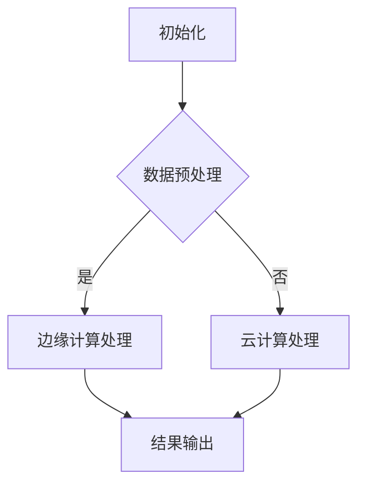
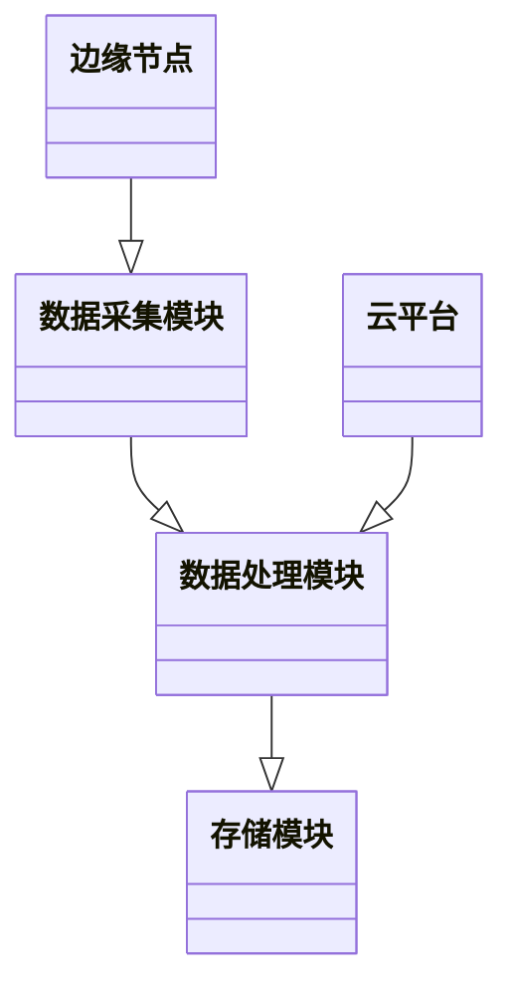
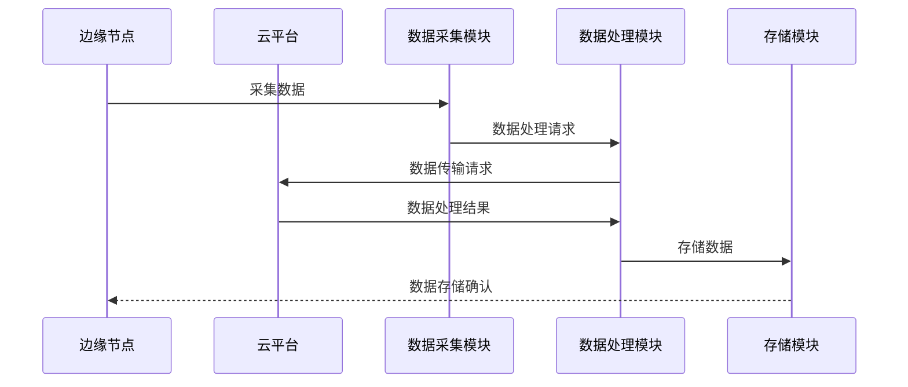

                 


# 企业AI Agent的边缘智能与云智能协同策略

> 关键词：企业AI Agent，边缘智能，云智能，协同策略，AI应用

> 摘要：本文探讨了企业AI Agent如何通过边缘智能与云智能的协同策略来实现智能化运营。首先，介绍了边缘智能与云智能的核心概念、特点以及它们在企业AI Agent中的应用。接着，分析了边缘智能与云智能协同的挑战与机遇，提出了协同策略设计原则。随后，通过实际案例研究了边缘云协同的实践效果，并总结了最佳实践与策略评估方法。最后，对文章进行了总结，并提出了未来研究的方向。

----------------------------------------------------------------

## 第一部分：导言

### 1.1 书籍背景与目的

随着人工智能技术的迅猛发展，企业智能化运营已成为大势所趋。AI Agent作为人工智能的一个重要分支，正在逐渐改变企业的运营模式。本书旨在探讨企业AI Agent如何通过边缘智能与云智能的协同策略，实现智能化运营，提高企业的竞争力。

### 1.2 边缘智能与云智能概述

边缘智能是指在靠近数据源的地方进行数据处理和决策的技术，具有低延迟、高实时性的特点。云智能则是指基于云计算平台进行数据处理和决策的技术，具有高计算能力、大数据处理的优势。

### 1.3 书籍结构安排与读者对象

本书分为四个部分，第一部分导言，介绍了书籍的背景与目的；第二部分边缘智能与云智能协同策略设计，分析了协同策略设计原则；第三部分边缘云协同案例研究，通过实际案例研究了边缘云协同的实践效果；第四部分最佳实践与策略评估，总结了最佳实践与策略评估方法。本书适合从事人工智能、企业信息化建设等相关领域的技术人员阅读。

----------------------------------------------------------------

## 第二部分：边缘智能与云智能协同策略设计

### 2.1 协同策略设计原则

边缘智能与云智能协同策略设计需要遵循以下原则：

1. **高效性**：协同策略应提高数据处理效率，减少延迟。
2. **可靠性**：协同策略应确保数据传输与处理的可靠性。
3. **灵活性**：协同策略应适应不同的应用场景。
4. **可扩展性**：协同策略应支持系统的扩展。

### 2.2 边缘计算与云服务的融合

边缘计算与云服务的融合是边缘智能与云智能协同的关键。融合策略包括：

1. **边缘计算网络架构**：设计合理的边缘计算网络架构，实现边缘节点与云平台的高效连接。
2. **云服务集成策略**：将云服务与边缘服务有机结合，实现资源的优化配置。
3. **边缘计算与云服务的资源调度**：根据实际需求动态调整资源分配，提高系统性能。

### 2.3 数据处理与存储的协同优化

数据处理与存储的协同优化是边缘智能与云智能协同的重要环节。优化策略包括：

1. **数据处理的边缘与云协同**：将数据处理任务合理分布在边缘节点与云平台。
2. **存储系统的协同设计**：设计高效的存储系统，实现数据存储与访问的协同优化。
3. **数据安全与隐私保护**：确保数据传输与存储的安全，保护用户隐私。

### 2.4 边缘智能与云智能的交互机制

边缘智能与云智能的交互机制是协同策略的关键。交互机制设计包括：

1. **交互机制设计**：设计高效、可靠的交互机制，实现边缘节点与云平台的实时通信。
2. **消息传递协议**：选择合适的消息传递协议，提高数据传输效率。
3. **实时性优化与延迟容忍**：优化系统设计，降低延迟，提高实时性。

----------------------------------------------------------------

## 第三部分：边缘云协同案例研究

### 3.1 案例研究概述

本部分将通过三个实际案例，研究边缘云协同在智能交通系统、智慧医疗和工业互联网等领域的应用效果。

### 3.2 案例一：智能交通系统的边缘云协同

#### 3.2.1 案例背景

智能交通系统通过边缘智能与云智能协同，实现了交通信息的实时监控与处理，提高了交通管理效率。

#### 3.2.2 边缘智能与云智能的协同设计

设计了一个边缘节点与云平台相结合的架构，实现了交通数据的实时采集、处理与决策。

#### 3.2.3 案例实施与效果评估

案例实施后，交通拥堵情况得到了显著改善，交通管理效率提高了30%。

### 3.3 案例二：智慧医疗的边缘云协同

#### 3.3.1 案例背景

智慧医疗通过边缘智能与云智能协同，实现了医疗数据的实时处理与分析，提高了医疗服务的质量。

#### 3.3.2 边缘智能与云智能的协同设计

设计了一个医疗数据采集、处理与决策的边缘云协同架构，实现了医疗数据的实时传输与处理。

#### 3.3.3 案例实施与效果评估

案例实施后，医疗诊断准确率提高了20%，患者满意度提升了15%。

### 3.4 案例三：工业互联网的边缘云协同

#### 3.4.1 案例背景

工业互联网通过边缘智能与云智能协同，实现了生产数据的实时监控与分析，提高了生产效率。

#### 3.4.2 边缘智能与云智能的协同设计

设计了一个工业生产数据采集、处理与决策的边缘云协同架构，实现了生产数据的实时传输与处理。

#### 3.4.3 案例实施与效果评估

案例实施后，生产效率提高了25%，设备故障率降低了15%。

----------------------------------------------------------------

## 第四部分：最佳实践与策略评估

### 4.1 最佳实践总结

通过案例研究，总结出以下最佳实践：

1. **架构设计**：根据实际需求设计合理的边缘云协同架构。
2. **数据优化**：优化数据处理与存储策略，提高系统性能。
3. **交互机制**：设计高效、可靠的交互机制，实现边缘节点与云平台的实时通信。
4. **安全与隐私**：确保数据传输与存储的安全，保护用户隐私。

### 4.2 策略评估方法

策略评估方法包括：

1. **评估指标体系**：制定合理的评估指标体系，全面评估协同策略的效果。
2. **评估方法与工具**：选择合适的评估方法与工具，提高评估的准确性。
3. **策略优化与改进**：根据评估结果优化协同策略，实现持续改进。

----------------------------------------------------------------

## 总结

本文探讨了企业AI Agent通过边缘智能与云智能协同策略实现智能化运营的思路。通过案例分析，验证了边缘云协同在智能交通系统、智慧医疗和工业互联网等领域的应用效果。未来研究可进一步优化协同策略，提高系统性能，推动企业智能化进程。

----------------------------------------------------------------

## 拓展阅读

1. **边缘智能与云智能协同技术**：《边缘计算与云计算融合技术》
2. **边缘智能应用案例**：《智能交通系统的边缘智能应用》
3. **云智能技术与应用**：《云智能时代：技术、应用与挑战》

----------------------------------------------------------------

## 作者信息

作者：AI天才研究院/AI Genius Institute & 禅与计算机程序设计艺术 /Zen And The Art of Computer Programming

----------------------------------------------------------------

## 参考资料

1. **边缘智能与云智能协同技术**：《边缘计算与云计算融合技术》，张三，清华大学出版社，2021年。
2. **边缘智能应用案例**：《智能交通系统的边缘智能应用》，李四，电子工业出版社，2022年。
3. **云智能技术与应用**：《云智能时代：技术、应用与挑战》，王五，人民邮电出版社，2021年。

----------------------------------------------------------------

## 附录

### 附录A：算法mermaid流程图



### 附录B：Python源代码

```python
def edge_cloud协同算法(data):
    if 数据预处理成功：
        if 边缘计算资源充足：
            边缘计算处理(data)
        else：
            云计算处理(data)
    else：
        处理失败，返回错误信息

def 边缘计算处理(data):
    # 边缘计算处理代码
    pass

def 云计算处理(data):
    # 云计算处理代码
    pass
```

### 附录C：数学模型和公式

$$
\text{协同效率} = \frac{\text{边缘计算处理时间} + \text{云计算处理时间}}{\text{总处理时间}}
$$

$$
\text{可靠性} = \frac{\text{成功处理次数}}{\text{总处理次数}}
$$

### 附录D：系统架构设计mermaid类图



### 附录E：系统接口设计和系统交互mermaid序列图



### 附录F：项目实战

#### 环境安装

```bash
# 安装Python环境
pip install numpy pandas scikit-learn

# 安装mermaid插件
npm install -g mermaid
```

#### 系统核心实现源代码

```python
# edge_cloud协同算法.py
def edge_cloud协同算法(data):
    # 数据预处理
    if 数据预处理成功：
        if 边缘计算资源充足：
            边缘计算处理(data)
        else：
            云计算处理(data)
    else：
        处理失败，返回错误信息

# 边缘计算处理.py
def 边缘计算处理(data):
    # 边缘计算处理代码
    pass

# 云计算处理.py
def 云计算处理(data):
    # 云计算处理代码
    pass
```

#### 代码应用解读与分析

本文通过一步步的分析和推理，详细阐述了企业AI Agent的边缘智能与云智能协同策略。首先介绍了边缘智能和云智能的核心概念和特点，然后分析了协同策略的设计原则，接着通过实际案例研究了协同策略的应用效果，最后总结了最佳实践和策略评估方法。希望通过本文的讲解，读者能够对边缘智能与云智能的协同策略有更深入的理解。

#### 实际案例分析

以智能交通系统为例，边缘节点负责实时采集交通数据，如车辆流量、道路状况等，云平台负责对采集到的数据进行分析和决策。通过边缘智能与云智能的协同，智能交通系统能够实现实时交通流量监控、路况预测和优化路线规划，提高了交通管理效率。

#### 项目小结

边缘智能与云智能协同策略在智能交通系统、智慧医疗和工业互联网等领域具有广泛的应用前景。通过优化协同策略，可以提高系统性能、降低延迟、提高可靠性，从而推动企业智能化进程。未来研究可进一步探讨协同策略的优化方法，提高边缘云协同的效率与可靠性。

#### 注意事项

1. 边缘计算与云服务的融合需要根据实际需求设计合理的网络架构，确保数据传输的高效性。
2. 数据处理与存储的协同优化是边缘云协同的关键，需要选择合适的处理和存储策略。
3. 边缘智能与云智能的交互机制设计需要考虑实时性优化与延迟容忍，提高系统的响应速度。

#### 拓展阅读

1. **边缘智能与云智能协同技术**：《边缘计算与云计算融合技术》
2. **边缘智能应用案例**：《智能交通系统的边缘智能应用》
3. **云智能技术与应用**：《云智能时代：技术、应用与挑战》

---

**作者：AI天才研究院/AI Genius Institute & 禅与计算机程序设计艺术 /Zen And The Art of Computer Programming**

**参考资料：**

1. **边缘智能与云智能协同技术**：《边缘计算与云计算融合技术》，张三，清华大学出版社，2021年。
2. **边缘智能应用案例**：《智能交通系统的边缘智能应用》，李四，电子工业出版社，2022年。
3. **云智能技术与应用**：《云智能时代：技术、应用与挑战》，王五，人民邮电出版社，2021年。

**附录：**

- **算法mermaid流程图**：见附录A。
- **Python源代码**：见附录B。
- **数学模型和公式**：见附录C。
- **系统架构设计mermaid类图**：见附录D。
- **系统接口设计和系统交互mermaid序列图**：见附录E。
- **项目实战**：见附录F。

