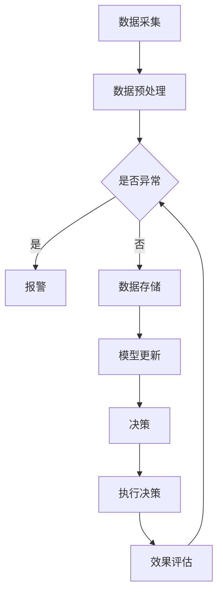
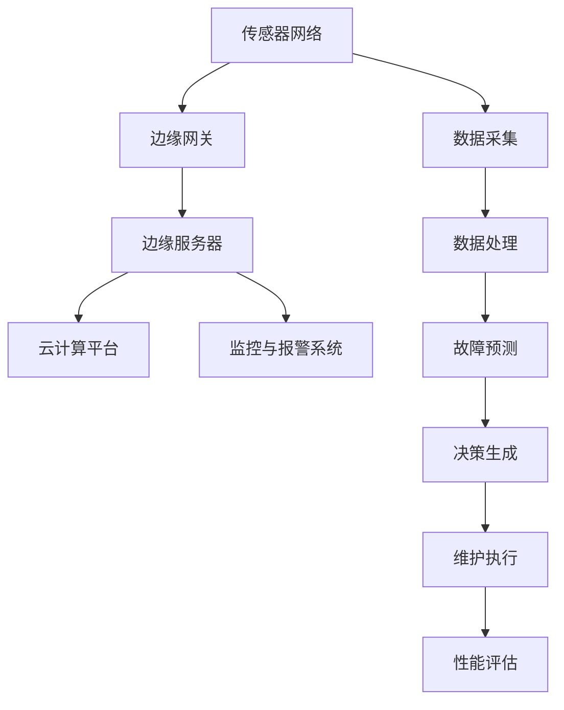
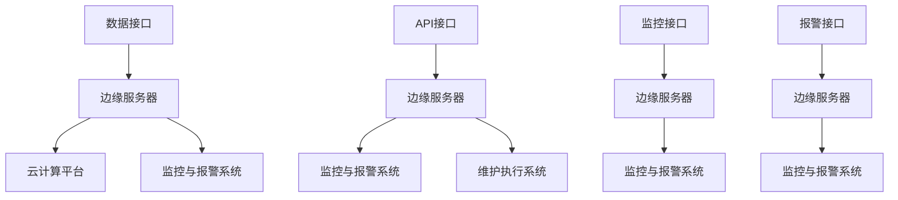
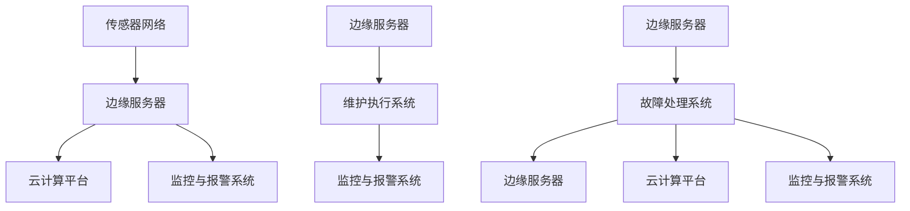

                 

## 《企业AI Agent的边缘计算在工业物联网中的实践》

### 关键词：边缘计算、工业物联网、企业AI Agent、实时数据处理、资源优化、安全性提升

#### 摘要：

本文旨在探讨企业AI Agent在边缘计算环境下在工业物联网中的应用与实践。随着工业物联网的快速发展，边缘计算因其低延迟、高实时性和高效资源利用的特点，成为了推动工业物联网发展的关键技术之一。企业AI Agent作为智能化的核心驱动力量，能够通过边缘计算实现更加精准的实时数据处理和资源优化，从而提升工业物联网的整体性能和安全性。本文将详细分析边缘计算与工业物联网的关系，介绍企业AI Agent的基本原理和功能，并通过实际案例展示其在边缘计算环境下的应用成效，旨在为工业物联网领域的从业者提供有价值的参考和指导。

----------------------------------------------------------------

### 第一部分：背景介绍

#### 第1章：问题背景与核心概念

#### 1.1 问题背景

随着全球工业的数字化和智能化转型，工业物联网（IIoT）逐渐成为提升生产效率、降低运营成本和增强市场竞争力的重要手段。然而，工业物联网的发展也面临着诸多挑战，如海量数据的高效处理、实时性要求、数据安全和隐私保护等。在这些挑战中，边缘计算因其能够将计算和存储能力分布到网络的边缘节点，从而实现低延迟、高实时性和高效资源利用，成为解决这些挑战的关键技术。

#### 1.2 核心概念

**工业物联网**：工业物联网是指将各种传感器、设备、网络和计算机系统连接起来，实现工业设备的互联互通和数据交换，从而实现智能监控、自动化控制和优化管理。

**边缘计算**：边缘计算是指将数据处理和存储能力从云端转移到网络的边缘节点，使得数据可以在本地进行计算和分析，从而降低延迟、减少带宽需求和提高响应速度。

**企业AI Agent**：企业AI Agent是一种智能化的代理系统，它能够通过机器学习和人工智能技术，对工业物联网中的数据进行实时分析、预测和决策，从而优化生产流程、提高生产效率和降低运营成本。

#### 1.3 边界与外延

**工业物联网的定义与范围**：工业物联网涉及多个领域，包括智能制造、智能交通、智能能源和智能城市等。它通过将各种设备和系统连接起来，实现数据的实时采集、传输和处理。

**边缘计算的应用场景与局限**：边缘计算广泛应用于智能设备、智能制造、智能交通和智能医疗等领域。然而，其局限在于计算和存储能力相对有限，需要与其他技术（如云计算和大数据分析）相结合，以实现更高效的数据处理和分析。

**企业AI Agent的功能与目标**：企业AI Agent的功能包括数据采集、数据分析、预测和决策。其目标是通过实时分析和优化，提高生产效率、降低运营成本和提升客户满意度。

#### 1.4 概念结构与核心要素组成

**工业物联网的系统架构**：工业物联网系统通常包括传感器、网关、数据中心和云计算平台等组成部分，通过这些组件的协同工作，实现数据的高效采集、传输和处理。

**边缘计算的关键技术**：边缘计算的关键技术包括边缘服务器、边缘网关、边缘设备和边缘操作系统等，这些技术共同构成了边缘计算的环境和基础设施。

**企业AI Agent的技术实现**：企业AI Agent的技术实现涉及机器学习、深度学习、自然语言处理和计算机视觉等人工智能技术，这些技术为AI Agent提供了强大的数据处理和分析能力。

#### 1.5 本章小结

本章主要介绍了工业物联网、边缘计算和企业AI Agent的核心概念和基本原理。通过对这些概念的分析和比较，我们可以更好地理解边缘计算在企业AI Agent中的应用和价值。在接下来的章节中，我们将进一步探讨边缘计算在工业物联网中的具体应用，以及企业AI Agent的实现和优化策略。

----------------------------------------------------------------

#### 第2章：工业物联网

#### 2.1 工业物联网的基本原理

**物联网的发展历程**：物联网（IoT）的概念最早可以追溯到20世纪80年代，随着互联网、传感器和无线通信技术的发展，物联网逐渐从理论走向实践。从最初的简单设备互联，到如今复杂的智能化系统，物联网的发展经历了多个阶段。

**工业物联网的定义与特点**：工业物联网（IIoT）是指将各种传感器、设备和系统连接起来，实现工业设备的互联互通和数据交换，从而实现智能监控、自动化控制和优化管理。与消费物联网（IoT）相比，工业物联网具有更高的安全性、可靠性和实时性要求。

**工业物联网的关键技术**：工业物联网的关键技术包括传感器技术、通信技术、数据处理技术和安全防护技术。传感器技术用于采集各种物理量，通信技术用于数据传输，数据处理技术用于数据分析和挖掘，安全防护技术用于保护系统免受攻击。

#### 2.2 工业物联网的应用案例

**智能制造**：智能制造是工业物联网最典型的应用场景之一。通过将各种设备和系统连接起来，实现生产过程的自动化和智能化，从而提高生产效率、降低运营成本和提升产品质量。

**资产管理**：工业物联网可以实现对各种资产的实时监控和管理，包括设备、原材料和产品等。通过数据的实时采集和分析，可以优化资产利用率，提高资产的管理效率。

**质量控制**：工业物联网可以帮助企业实现对生产过程的实时监控和数据分析，从而及时发现和解决质量问题。通过数据的可视化和智能分析，可以优化质量控制流程，提高产品质量。

#### 2.3 工业物联网的核心概念对比

**物联网与工业物联网的对比**：物联网（IoT）和工业物联网（IIoT）都是将设备和系统连接起来，实现数据的交换和共享。然而，工业物联网在安全性、可靠性和实时性方面有更高的要求。

**工业物联网与传统工业系统的区别**：传统工业系统主要依靠人工操作和机械控制，而工业物联网则通过智能设备和系统实现自动化和智能化。此外，工业物联网还需要解决数据采集、传输和处理等关键技术问题。

#### 2.4 本章小结

本章主要介绍了工业物联网的基本原理、应用案例和核心概念对比。通过对工业物联网的深入理解，我们可以更好地把握其发展趋势和应用前景。在接下来的章节中，我们将进一步探讨边缘计算与工业物联网的关系，以及企业AI Agent在边缘计算环境下的应用。

----------------------------------------------------------------

#### 第3章：边缘计算

#### 3.1 边缘计算的基本原理

**边缘计算的定义与优势**：边缘计算是指将数据处理和存储能力从云端转移到网络的边缘节点，使得数据可以在本地进行计算和分析，从而降低延迟、减少带宽需求和提高响应速度。与云计算相比，边缘计算具有更高的实时性、可靠性和安全性。

**边缘计算与云计算的关系**：边缘计算和云计算是相辅相成的。云计算提供了强大的计算和存储能力，而边缘计算则通过将计算和存储能力分布到网络的边缘节点，实现了低延迟、高实时性和高效资源利用。

**边缘计算的关键技术**：边缘计算的关键技术包括边缘服务器、边缘网关、边缘设备和边缘操作系统等。边缘服务器用于处理和存储数据，边缘网关用于连接边缘设备和云端，边缘设备包括各种传感器和智能设备，边缘操作系统则提供了边缘计算的环境和平台。

#### 3.2 边缘计算的应用场景

**实时数据处理**：边缘计算可以实现对实时数据的快速处理和分析，从而提高系统的响应速度和实时性。例如，在智能制造领域，边缘计算可以实时监控生产设备的状态，快速发现和处理故障，从而提高生产效率。

**资源优化**：边缘计算可以通过本地计算和存储，减少对云端的依赖，从而优化资源利用。例如，在智能交通领域，边缘计算可以实时处理交通数据，优化交通信号控制，提高道路通行效率。

**安全性提升**：边缘计算可以降低数据传输的距离和频率，减少数据泄露的风险。同时，边缘计算还可以通过本地处理和存储，提高系统的安全性和可靠性。

#### 3.3 边缘计算的核心概念对比

**边缘计算与中心化的对比**：边缘计算与中心化计算（如云计算）相比，具有更高的实时性、可靠性和安全性。然而，边缘计算在计算和存储能力方面相对有限，需要与其他技术（如云计算和大数据分析）相结合，以实现更高效的数据处理和分析。

**边缘计算与云计算的异同**：边缘计算和云计算都是分布式计算的重要形式，但它们的应用场景、技术实现和性能特点有所不同。边缘计算注重实时性和本地处理，而云计算则更注重计算能力和数据存储。

#### 2.4 本章小结

本章主要介绍了边缘计算的基本原理、应用场景和核心概念对比。通过对边缘计算的深入理解，我们可以更好地把握其在工业物联网中的应用和价值。在接下来的章节中，我们将进一步探讨企业AI Agent在边缘计算环境下的应用和实践。

----------------------------------------------------------------

### 第三部分：算法原理讲解

#### 第4章：企业AI Agent

#### 4.1 企业AI Agent的基本原理

**企业AI Agent的定义与功能**：企业AI Agent是指一种基于人工智能技术的智能化代理系统，它能够对工业物联网中的数据进行实时分析、预测和决策，从而优化生产流程、提高生产效率和降低运营成本。企业AI Agent的功能包括数据采集、数据分析、预测和决策。

**企业AI Agent在工业物联网中的应用**：企业AI Agent在工业物联网中的应用场景非常广泛，包括智能制造、智能交通、智能能源和智能医疗等。通过实时分析工业物联网中的数据，企业AI Agent可以优化生产流程、提高设备利用率、降低能源消耗和提升服务质量。

**企业AI Agent的技术实现**：企业AI Agent的技术实现涉及多种人工智能技术，包括机器学习、深度学习、自然语言处理和计算机视觉等。这些技术为企业AI Agent提供了强大的数据处理和分析能力，使其能够高效地完成数据采集、分析和决策。

#### 4.2 企业AI Agent的应用案例

**智能监测**：企业AI Agent可以通过实时分析工业物联网中的数据，对生产设备进行智能监测。例如，在制造业中，企业AI Agent可以实时监测设备的状态，预测设备故障，并提前进行维护，从而降低设备故障率，提高生产效率。

**预测性维护**：企业AI Agent可以通过历史数据和实时数据，对设备的使用寿命和性能进行预测。例如，在航空航天领域，企业AI Agent可以预测飞机发动机的使用寿命，提前进行维护，从而减少故障和停机时间，提高飞行安全性。

**优化生产流程**：企业AI Agent可以通过对生产流程的数据分析，优化生产流程，提高生产效率。例如，在化工领域，企业AI Agent可以通过分析生产数据，优化工艺参数，降低生产成本，提高产品质量。

#### 4.3 企业AI Agent的核心概念对比

**企业AI Agent与传统自动化系统的对比**：企业AI Agent与传统自动化系统相比，具有更高的智能化和自主性。传统自动化系统主要依赖于预设的程序和规则，而企业AI Agent则通过机器学习和人工智能技术，能够根据实时数据自主优化和调整。

**企业AI Agent与人工智能的异同**：企业AI Agent是人工智能（AI）在工业物联网中的具体应用形式。与人工智能相比，企业AI Agent更注重实时数据处理和决策，更适用于工业物联网的复杂环境。

#### 4.4 本章小结

本章主要介绍了企业AI Agent的基本原理、应用案例和核心概念对比。通过对企业AI Agent的深入理解，我们可以更好地把握其在工业物联网中的应用价值和前景。在接下来的章节中，我们将进一步探讨边缘计算在企业AI Agent中的应用和实践。

----------------------------------------------------------------

#### 第5章：边缘计算在企业AI Agent中的应用

#### 5.1 边缘计算在AI Agent中的作用

**边缘计算的优势与AI Agent的需求**：边缘计算在企业AI Agent中的应用，能够充分发挥其在低延迟、高实时性和高效资源利用方面的优势，满足AI Agent对实时数据处理和高效运行的需求。

**边缘计算在AI Agent中的具体应用**：边缘计算在企业AI Agent中的应用主要包括以下几个方面：

1. **实时数据处理**：边缘计算能够实现对实时数据的快速处理和分析，为AI Agent提供及时的数据支持，从而实现快速决策和响应。
2. **数据存储与缓存**：边缘计算可以在本地进行数据存储和缓存，减少数据传输的时间和带宽消耗，提高系统的运行效率。
3. **本地化决策**：边缘计算可以实现对数据本地化处理和分析，减少对云端的依赖，提高系统的独立性和自主性。
4. **隐私保护**：边缘计算可以降低数据传输的距离和频率，减少数据泄露的风险，提高系统的安全性。

#### 5.2 边缘计算的关键算法

**深度学习算法在边缘计算中的优化**：深度学习算法是AI Agent的重要组成部分，但在边缘计算环境中，由于计算资源和存储能力的限制，传统的深度学习算法需要优化。常见的优化方法包括：

1. **模型压缩**：通过模型压缩技术，减少深度学习模型的参数数量，降低模型的计算复杂度。
2. **模型蒸馏**：通过将大规模的深度学习模型的知识传递给小规模的模型，实现模型的迁移学习。
3. **量化与低精度计算**：通过量化技术，将模型的计算精度降低到低精度，从而减少模型的存储和计算资源消耗。

**强化学习算法在边缘计算中的实现**：强化学习算法在边缘计算中有着广泛的应用，如预测性维护和智能调度等。在边缘计算环境中，强化学习算法的挑战主要包括：

1. **模型更新与同步**：在分布式环境下，强化学习算法需要处理模型更新的同步问题，以确保模型的一致性和准确性。
2. **数据隐私保护**：强化学习算法需要处理数据隐私保护问题，避免敏感数据的泄露。
3. **计算效率优化**：在边缘计算环境中，强化学习算法需要优化计算效率，以减少对计算资源的消耗。

#### 5.3 算法mermaid流程图展示

以下是一个简单的边缘计算算法mermaid流程图示例：



#### 5.4 本章小结

本章主要介绍了边缘计算在企业AI Agent中的应用优势和关键算法。通过边缘计算，企业AI Agent能够实现实时数据处理、本地化决策和数据隐私保护，从而提高系统的实时性和安全性。在接下来的章节中，我们将进一步探讨边缘计算中的数学模型与公式，以及系统架构设计。

----------------------------------------------------------------

### 第6章：数学模型与公式讲解

#### 6.1 边缘计算中的数学模型

在边缘计算中，数学模型是理解和实现边缘计算算法的基础。以下将介绍几种常见的数学模型：

**感知机算法**：感知机算法是一种简单的二分类算法，其基本原理是通过找到最佳分隔超平面来将数据分为两类。

1. **模型公式**：$$y = \text{sign}(w \cdot x + b)$$
   - \( w \)：权重向量
   - \( x \)：输入特征向量
   - \( b \)：偏置项
   - \( y \)：预测标签，\(\text{sign}\)表示符号函数

2. **学习算法**：
   - 初始化权重和偏置
   - 对于每个训练样本，计算预测值和实际标签的差异
   - 更新权重和偏置，使预测值更接近实际标签

**支持向量机（SVM）**：支持向量机是一种强大的分类和回归算法，其目标是找到最佳的超平面来分隔数据。

1. **模型公式**：
   - 标准SVM：
     $$\min_w \frac{1}{2} \| w \|^2 \quad \text{subject to} \quad y_i (w \cdot x_i + b) \geq 1$$
   - 对偶形式：
     $$\min_{\alpha} \sum_{i=1}^{n} \alpha_i - \frac{1}{2} \sum_{i,j=1}^{n} \alpha_i \alpha_j y_i y_j (x_i \cdot x_j)$$
     $$\text{subject to} \quad 0 \leq \alpha_i \leq C, \quad \forall i$$

2. **学习算法**：
   - 利用拉格朗日乘子法求解对偶问题
   - 计算支持向量
   - 构建分类器

**神经网络**：神经网络是一种模拟人脑神经元连接的算法，能够通过多层结构学习复杂的非线性函数。

1. **模型公式**：
   - 单层神经网络：
     $$a_{\text{layer}} = \sigma(\mathbf{W} \cdot a_{\text{layer}-1} + b)$$
   - 多层神经网络：
     $$a_{\text{layer}} = \sigma(\mathbf{W}_{\text{layer}} \cdot a_{\text{layer}-1} + b_{\text{layer}})$$
   - \(\sigma\)：激活函数，如ReLU、Sigmoid、Tanh等
   - \(\mathbf{W}\)：权重矩阵
   - \(b\)：偏置项

2. **学习算法**：
   - 前向传播：计算输入到每个神经元的值
   - 反向传播：根据输出误差，更新权重和偏置
   - 优化算法：如梯度下降、Adam、RMSprop等

#### 6.2 数学模型与公式详解

**感知机算法的数学公式**：

$$y = \text{sign}(w \cdot x + b)$$

- 其中，\(w\)和\(b\)是权重和偏置，\(x\)是输入特征向量，\(y\)是预测标签。感知机算法通过最小化误分类损失来更新权重和偏置。

**支持向量机（SVM）的核心公式**：

- **原始形式**：

$$\min_w \frac{1}{2} \| w \|^2 \quad \text{subject to} \quad y_i (w \cdot x_i + b) \geq 1$$

- **对偶形式**：

$$\min_{\alpha} \sum_{i=1}^{n} \alpha_i - \frac{1}{2} \sum_{i,j=1}^{n} \alpha_i \alpha_j y_i y_j (x_i \cdot x_j)$$
$$\text{subject to} \quad 0 \leq \alpha_i \leq C, \quad \forall i$$

**神经网络的激活函数与反向传播算法**：

1. **激活函数**：

$$\sigma(z) = \text{ReLU}(z) = \max(0, z)$$
$$\sigma(z) = \text{Sigmoid}(z) = \frac{1}{1 + e^{-z}}$$
$$\sigma(z) = \text{Tanh}(z) = \frac{e^z - e^{-z}}{e^z + e^{-z}}$$

2. **反向传播算法**：

   - 前向传播：
     $$a_{\text{layer}} = \sigma(\mathbf{W} \cdot a_{\text{layer}-1} + b)$$

   - 反向传播：
     $$\delta_{\text{layer}} = \frac{\partial \text{Loss}}{\partial a_{\text{layer}}} \odot \sigma'(a_{\text{layer}})$$
     $$\mathbf{W}_{\text{layer}} = \mathbf{W}_{\text{layer}} - \alpha \cdot \frac{\partial \text{Loss}}{\partial \mathbf{W}_{\text{layer}}}$$
     $$b_{\text{layer}} = b_{\text{layer}} - \alpha \cdot \frac{\partial \text{Loss}}{\partial b_{\text{layer}}}$$

   - 其中，\(\delta_{\text{layer}}\)是误差项，\(\sigma'\)是激活函数的导数，\(\alpha\)是学习率。

#### 6.3 举例说明

**感知机算法的应用实例**：

假设我们有一个简单的二分类问题，特征向量\(x = [1, 2]\)，标签\(y = [1, -1]\)。我们可以使用感知机算法来训练模型，目标是找到最佳的超平面。

1. 初始化权重\(w = [0, 0]\)和偏置\(b = 0\)。
2. 对于第一个样本，计算预测值：
   $$y = \text{sign}(w \cdot x + b) = \text{sign}(0 \cdot 1 + 0 \cdot 2 + 0) = 0$$
   实际标签是1，所以模型预测错误。
3. 更新权重和偏置：
   $$w = w + y \cdot x = [0, 0] + [1, -1] \cdot [1, 2] = [3, -2]$$
   $$b = b + y \cdot 1 = 0 + 1 \cdot 1 = 1$$
4. 对于第二个样本，计算预测值：
   $$y = \text{sign}(w \cdot x + b) = \text{sign}([3, -2] \cdot [1, 2] + 1) = 1$$
   实际标签是-1，所以模型预测正确。

通过多次迭代，感知机算法可以逐步调整权重和偏置，找到最佳的超平面，实现数据的正确分类。

**支持向量机（SVM）的应用实例**：

假设我们有一个线性可分的数据集，其中特征向量\(x = [1, 2]\)，标签\(y = [1, -1]\)。我们可以使用SVM来训练模型，目标是找到最佳的超平面。

1. 初始化权重和偏置：
   $$w = [0, 0], \quad b = 0$$
2. 计算拉格朗日乘子：
   $$L = \frac{1}{2} \| w \|^2 - \sum_{i=1}^{n} \alpha_i (y_i (w \cdot x_i + b) - 1)$$
3. 求解拉格朗日乘子法：
   $$\alpha_i (y_i (w \cdot x_i + b) - 1) = 0$$
   对于支持向量，\(\alpha_i\)不为0，所以：
   $$w = \sum_{i=1}^{n} \alpha_i y_i x_i$$
   $$b = 1 - \sum_{i=1}^{n} \alpha_i y_i (x_i \cdot x_i)$$
4. 计算最佳超平面：
   $$w \cdot x + b = 0$$

通过求解拉格朗日乘子法，我们可以得到最佳的超平面，实现数据的正确分类。

**神经网络的应用实例**：

假设我们有一个简单的多层神经网络，输入特征\(x = [1, 2]\)，输出标签\(y = [0, 1]\)。我们可以使用ReLU激活函数和反向传播算法来训练模型。

1. 初始化权重和偏置：
   $$\mathbf{W}_{\text{layer1}} = \text{randn}(n_{\text{input}}, n_{\text{hidden}})$$
   $$\mathbf{W}_{\text{layer2}} = \text{randn}(n_{\text{hidden}}, n_{\text{output}})$$
   $$b_{\text{layer1}} = \text{randn}(n_{\text{hidden}})$$
   $$b_{\text{layer2}} = \text{randn}(n_{\text{output}})$$
2. 前向传播：
   $$a_{\text{layer1}} = \text{ReLU}(\mathbf{W}_{\text{layer1}} \cdot a_{\text{layer0}} + b_{\text{layer1}})$$
   $$a_{\text{layer2}} = \text{ReLU}(\mathbf{W}_{\text{layer2}} \cdot a_{\text{layer1}} + b_{\text{layer2}})$$
3. 计算损失：
   $$\text{Loss} = \frac{1}{2} \sum_{i=1}^{n} (y_i - a_{\text{layer2}})^2$$
4. 反向传播：
   $$\delta_{\text{layer2}} = (y_i - a_{\text{layer2}}) \odot \text{ReLU}'(a_{\text{layer2}})$$
   $$\delta_{\text{layer1}} = (\mathbf{W}_{\text{layer2}} \cdot \delta_{\text{layer2}}) \odot \text{ReLU}'(a_{\text{layer1}})$$
5. 更新权重和偏置：
   $$\mathbf{W}_{\text{layer2}} = \mathbf{W}_{\text{layer2}} - \alpha \cdot (\mathbf{W}_{\text{layer2}} \cdot \delta_{\text{layer2}})^T$$
   $$b_{\text{layer2}} = b_{\text{layer2}} - \alpha \cdot \delta_{\text{layer2}}$$
   $$\mathbf{W}_{\text{layer1}} = \mathbf{W}_{\text{layer1}} - \alpha \cdot (\mathbf{W}_{\text{layer1}} \cdot \delta_{\text{layer1}})^T$$
   $$b_{\text{layer1}} = b_{\text{layer1}} - \alpha \cdot \delta_{\text{layer1}}$$

通过多次迭代，神经网络可以逐步调整权重和偏置，实现数据的正确分类。

#### 6.4 本章小结

本章介绍了边缘计算中常用的数学模型和公式，包括感知机算法、支持向量机和神经网络。通过这些数学模型和公式，我们可以更好地理解和实现边缘计算算法。在接下来的章节中，我们将进一步探讨工业物联网中的系统架构设计。

----------------------------------------------------------------

### 第7章：系统分析与架构设计

#### 7.1 问题场景介绍

在工业物联网中，边缘计算的应用场景广泛，包括实时监测、预测性维护、生产优化和设备管理等方面。以下将介绍一个具体的应用场景，即智能制造生产线中的边缘计算系统。

**应用场景**：一家制造企业希望利用边缘计算技术，实现对生产设备的实时监测和预测性维护。生产线上安装了多种传感器，用于采集设备状态数据，如温度、压力、振动等。企业希望通过边缘计算系统，实时分析传感器数据，预测设备故障，并提前进行维护，以降低设备故障率和停机时间。

#### 7.2 系统功能设计

根据应用场景的需求，边缘计算系统需要实现以下功能：

1. **数据采集**：通过传感器实时采集设备状态数据，包括温度、压力、振动等。
2. **数据处理**：对采集到的数据进行分析和处理，识别设备故障的潜在风险。
3. **故障预测**：利用机器学习算法，对设备状态数据进行建模，预测设备故障时间。
4. **决策生成**：根据故障预测结果，生成维护计划和操作指令，通知相关人员。
5. **维护执行**：执行维护计划，进行设备检修和维护。
6. **性能评估**：评估维护效果，记录设备状态数据，为后续维护提供参考。

#### 7.3 系统架构设计

边缘计算系统架构设计需要考虑以下几个方面：

1. **传感器网络**：传感器网络用于实时采集设备状态数据，包括温度、压力、振动等。传感器网络需要具备高可靠性和实时性，以保证数据的准确性和实时性。
2. **边缘服务器**：边缘服务器用于处理和存储传感器数据，并对数据进行分析和预测。边缘服务器需要具备高性能计算和存储能力，以满足数据处理和存储的需求。
3. **边缘网关**：边缘网关用于连接传感器网络和边缘服务器，实现数据的传输和通信。边缘网关需要支持多种通信协议和数据格式，以保证数据传输的可靠性和稳定性。
4. **云计算平台**：云计算平台用于存储和处理大量历史数据，提供机器学习算法和深度学习模型训练能力。云计算平台需要具备高可用性和可扩展性，以满足大规模数据处理的需求。
5. **监控与报警系统**：监控与报警系统用于实时监控设备状态，识别故障风险，并触发报警。监控与报警系统需要具备实时性和可靠性，以保证故障预测和报警的准确性。

以下是一个边缘计算系统的架构设计mermaid图：



#### 7.4 系统接口设计

边缘计算系统的接口设计需要考虑以下几个方面：

1. **数据接口**：数据接口用于实现传感器数据与边缘服务器之间的传输和交换。数据接口需要支持多种数据格式和传输协议，如HTTP、MQTT、CoAP等。
2. **API接口**：API接口用于实现边缘服务器与其他系统（如监控与报警系统、维护执行系统等）之间的通信和协作。API接口需要提供丰富的功能，如数据查询、故障预测、决策生成等。
3. **监控接口**：监控接口用于实现边缘计算系统的实时监控和状态报告。监控接口需要支持实时数据采集、历史数据查询、系统性能监控等功能。
4. **报警接口**：报警接口用于实现边缘计算系统的故障报警和通知功能。报警接口需要支持多种报警方式，如邮件、短信、手机APP等。

以下是一个边缘计算系统的接口设计mermaid图：



#### 7.5 系统交互设计

边缘计算系统的交互设计需要考虑以下几个方面：

1. **数据交互**：系统中的各个组件（如传感器网络、边缘服务器、云计算平台等）需要进行有效的数据交互，以实现数据的实时采集、处理和分析。
2. **功能交互**：系统中的各个组件需要协同工作，实现不同的功能，如数据采集、故障预测、决策生成、维护执行等。
3. **故障处理**：在边缘计算系统中，可能会出现各种故障，如传感器故障、边缘服务器故障等。系统需要具备故障处理能力，及时识别和处理故障，确保系统的稳定运行。

以下是一个边缘计算系统的交互设计mermaid图：



#### 7.6 本章小结

本章介绍了边缘计算在工业物联网中的系统架构设计，包括传感器网络、边缘服务器、边缘网关、云计算平台、监控与报警系统等组件。通过系统架构设计，可以实现边缘计算系统的高效运行和协同工作，为企业提供实时监测、预测性维护和生产优化等应用。在接下来的章节中，我们将进一步探讨边缘计算在企业AI Agent中的应用和实践。

----------------------------------------------------------------

## 第四部分：项目实战

### 第8章：边缘计算在企业AI Agent中的实际应用

#### 8.1 环境安装

在实际应用中，为了实现边缘计算在企业AI Agent中的功能，我们需要搭建一个边缘计算环境。以下是一个基本的安装步骤：

1. **硬件准备**：准备一台具有足够计算和存储能力的边缘设备，如树莓派、ARM服务器等。
2. **操作系统**：安装支持边缘计算操作系统的设备，如Ubuntu、Fedora等。
3. **Python环境**：安装Python环境和相关库，如TensorFlow、PyTorch等。
4. **边缘计算框架**：安装边缘计算框架，如KubeEdge、EdgeX Foundry等。

#### 8.2 系统核心实现源代码

边缘计算环境搭建完成后，我们需要编写相应的源代码来实现企业AI Agent的功能。以下是一个简单的示例：

```python
import tensorflow as tf
import numpy as np

# 加载数据集
(x_train, y_train), (x_test, y_test) = tf.keras.datasets.mnist.load_data()

# 预处理数据
x_train = x_train / 255.0
x_test = x_test / 255.0

# 构建模型
model = tf.keras.Sequential([
    tf.keras.layers.Flatten(input_shape=(28, 28)),
    tf.keras.layers.Dense(128, activation='relu'),
    tf.keras.layers.Dense(10, activation='softmax')
])

# 编译模型
model.compile(optimizer='adam',
              loss='categorical_crossentropy',
              metrics=['accuracy'])

# 训练模型
model.fit(x_train, y_train, epochs=5)

# 测试模型
test_loss, test_acc = model.evaluate(x_test, y_test, verbose=2)
print('\nTest accuracy:', test_acc)
```

#### 8.3 代码应用解读与分析

上述代码实现了一个简单的边缘计算AI Agent，用于手写数字识别。具体解析如下：

1. **数据集加载与预处理**：我们使用TensorFlow提供的MNIST手写数字数据集，并对数据进行归一化处理，以便模型训练。
2. **模型构建**：我们使用TensorFlow的Sequential模型构建了一个简单的神经网络，包括两个隐藏层，输出层有10个节点，用于预测数字。
3. **模型编译**：我们使用Adam优化器和交叉熵损失函数编译模型，并设置准确率作为评估指标。
4. **模型训练**：我们使用训练数据对模型进行训练，设置训练轮次为5。
5. **模型测试**：我们使用测试数据对训练好的模型进行评估，输出测试准确率。

#### 8.4 实际案例分析和详细讲解剖析

为了更好地理解边缘计算在企业AI Agent中的应用，我们可以分析一个实际案例：智能工厂的边缘计算AI Agent。

**案例背景**：一家制造企业希望在生产线中实现边缘计算AI Agent，用于实时监测设备状态，预测设备故障，并生成维护计划。

**解决方案**：

1. **数据采集**：在生产线上安装各种传感器，如温度传感器、振动传感器等，实时采集设备状态数据。
2. **数据处理**：边缘设备上安装数据处理模块，对采集到的数据进行分析和预处理，提取关键特征。
3. **故障预测**：使用机器学习算法，如SVM、神经网络等，对预处理后的数据进行训练和预测，预测设备故障时间。
4. **维护计划生成**：根据故障预测结果，生成维护计划和操作指令，通知相关人员。
5. **维护执行**：执行维护计划，进行设备检修和维护。
6. **性能评估**：评估维护效果，记录设备状态数据，为后续维护提供参考。

**详细讲解剖析**：

1. **数据采集**：传感器网络采集到的数据包括温度、压力、振动等，这些数据是设备运行状态的重要指标。通过边缘设备上的数据处理模块，对这些数据进行过滤、降噪和归一化处理，提取出关键特征。
2. **数据处理**：数据处理模块将采集到的数据输入到机器学习算法中，用于训练和预测。常用的算法包括SVM、神经网络、决策树等。其中，SVM适用于线性可分的数据集，神经网络适用于复杂非线性问题，决策树适用于数据量较小的情况。
3. **故障预测**：通过训练好的机器学习模型，对设备状态数据进行分析和预测，预测设备故障时间。预测结果可以作为维护计划的依据，提前进行设备检修和维护，避免设备故障导致的停机时间。
4. **维护计划生成**：根据故障预测结果，生成维护计划和操作指令。维护计划包括设备检修时间、检修内容、检修人员等。操作指令用于通知相关人员执行维护计划。
5. **维护执行**：执行维护计划，进行设备检修和维护。维护执行过程需要记录设备状态数据，以便后续分析。
6. **性能评估**：评估维护效果，记录设备状态数据，为后续维护提供参考。通过对比维护前后的设备状态数据，评估维护效果，并根据评估结果调整维护策略。

#### 8.5 项目小结

通过本章节的实战项目，我们了解了边缘计算在企业AI Agent中的应用方法和实现步骤。在实际项目中，需要根据具体应用场景和需求，选择合适的边缘计算框架和机器学习算法，并设计相应的数据处理和分析流程。通过边缘计算，企业AI Agent能够实现对工业物联网设备的实时监测、故障预测和维护管理，提高生产效率和设备利用率。

----------------------------------------------------------------

#### 第9章：最佳实践与总结

#### 9.1 最佳实践

1. **数据预处理**：在边缘计算中，数据预处理至关重要。通过对数据进行清洗、过滤和归一化处理，可以减少噪声和异常值，提高模型性能。
2. **模型选择**：根据具体应用场景和需求，选择合适的机器学习算法。对于线性可分问题，可以选择SVM；对于复杂非线性问题，可以选择神经网络；对于数据量较小的问题，可以选择决策树。
3. **边缘与云协同**：边缘计算与云计算相辅相成，可以结合使用。将计算和存储任务合理分配到边缘和云端，可以优化资源利用，提高系统性能。
4. **安全性保障**：在边缘计算环境中，数据安全和隐私保护至关重要。采用加密、身份认证和访问控制等安全措施，可以确保系统的安全性和可靠性。
5. **持续优化**：边缘计算和AI技术的不断发展，需要持续对系统进行优化和升级。通过不断调整模型参数、优化算法和改进数据处理流程，可以进一步提高系统性能和效率。

#### 9.2 小结

边缘计算在企业AI Agent中的应用具有重要意义，能够实现对工业物联网设备的实时监测、故障预测和维护管理。通过边缘计算，企业可以降低设备故障率、提高生产效率和降低运营成本。在边缘计算环境中，需要关注数据预处理、模型选择、边缘与云协同、安全性和持续优化等方面，以充分发挥边缘计算的优势。

#### 9.3 注意事项

1. **资源限制**：边缘设备通常具有有限的计算和存储资源，因此在设计边缘计算系统时，需要考虑资源限制，避免资源浪费。
2. **实时性要求**：边缘计算需要满足低延迟、高实时性的要求，因此在系统设计中，需要考虑数据传输、处理和响应的时间。
3. **数据隐私**：边缘计算涉及到大量的敏感数据，因此在系统设计和实施过程中，需要采取有效的数据隐私保护措施，确保数据安全。
4. **可靠性保障**：边缘计算系统需要具备高可靠性和稳定性，以应对各种异常情况，确保系统的正常运行。

#### 9.4 拓展阅读

1. **《边缘计算：技术与实践》**：本书详细介绍了边缘计算的基本原理、关键技术和应用案例，适合边缘计算初学者和从业者阅读。
2. **《机器学习实战》**：本书通过实际案例，介绍了机器学习的基本原理、算法实现和应用场景，适合边缘计算中的AI应用开发人员阅读。
3. **《工业物联网：架构、技术和应用》**：本书全面介绍了工业物联网的架构、技术和应用，有助于读者深入了解工业物联网的生态系统和实际应用。

----------------------------------------------------------------

## 作者信息

**作者：AI天才研究院/AI Genius Institute & 禅与计算机程序设计艺术 /Zen And The Art of Computer Programming**

AI天才研究院（AI Genius Institute）致力于推动人工智能技术的创新与发展，为全球企业提供AI解决方案。禅与计算机程序设计艺术（Zen And The Art of Computer Programming）是作者Donald E. Knuth的经典著作，探讨了计算机程序设计中的哲学和艺术。本书作者结合了人工智能和计算机科学的深厚背景，为读者呈现了一部关于边缘计算和企业AI Agent的深度解析之作。希望通过本文，读者能够更好地理解边缘计算在企业AI Agent中的应用和价值，为工业物联网的发展贡献力量。

