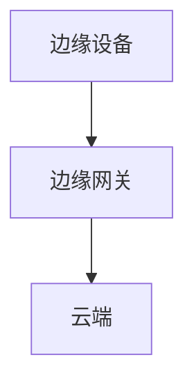
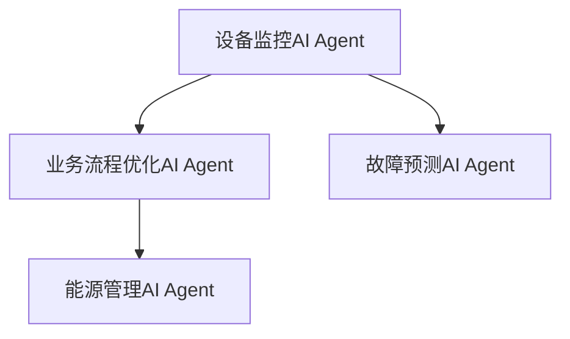
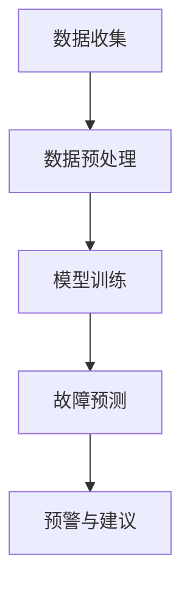

                 

# 企业AI Agent的边缘计算在物联网场景中的实践

> 关键词：物联网、边缘计算、企业AI Agent、设备状态监控、故障预测、业务流程优化、能源管理

> 摘要：本文将探讨企业AI Agent在物联网场景中的应用，重点关注边缘计算技术的应用及其对企业运营效率的提升。通过对物联网与边缘计算的基本概念、发展现状、关键技术、企业AI Agent的定义与作用以及实际应用案例的深入分析，本文旨在为读者提供一份全面而系统的技术指南，助力企业和组织在物联网时代实现智能化转型。

## 第一部分：引言

### 1.1 书籍背景与目的

#### 1.1.1 物联网与边缘计算的发展现状

##### 1.1.1.1 物联网概述
物联网（Internet of Things，IoT）是指将各种信息传感设备与网络结合起来，实现物与物之间信息交换和通信的网络体系。随着信息技术的快速发展，物联网在全球范围内得到了广泛的应用和关注。从智能家居、智能城市到智能制造，物联网正在深刻地改变着我们的生活方式和产业模式。

##### 1.1.1.2 边缘计算概述
边缘计算（Edge Computing）是一种分布式计算架构，将数据处理和分析的能力从云端下放到网络边缘，即靠近数据源的设备或节点上。边缘计算能够降低数据传输延迟，提高系统响应速度，增强数据隐私和安全。随着物联网设备的不断增多，边缘计算逐渐成为物联网应用的重要支撑技术。

#### 1.1.2 企业AI Agent的定义与作用

##### 1.1.2.1 企业AI Agent概述
企业AI Agent是指利用人工智能技术，为企业和组织提供自动化、智能化决策支持和服务的一类智能体。AI Agent在物联网场景中具有广泛的应用前景，可以提升企业运营效率，优化业务流程。

##### 1.1.2.2 企业AI Agent在物联网场景中的作用
企业AI Agent在物联网场景中可以实现对设备状态的实时监控、故障预测、优化调度等，从而提高企业运营效率，降低成本，提升客户满意度。

### 1.2 书籍结构安排

#### 1.2.1 第一部分：背景与基础
本部分将介绍物联网与边缘计算的基本概念、发展现状及发展趋势，以及企业AI Agent的定义、分类、发展历程及在物联网场景中的应用。

#### 1.2.2 第二部分：边缘计算关键技术
本部分将深入探讨边缘计算的关键技术，包括边缘计算架构设计与优化、边缘计算网络安全与隐私保护等。

#### 1.2.3 第三部分：企业AI Agent在物联网中的应用
本部分将详细介绍企业AI Agent在物联网设备状态监控与故障预测、业务流程优化与决策支持、能源管理与服务优化等领域的应用。

## 第二部分：背景与基础

### 2.1 物联网与边缘计算概述

#### 2.1.1 物联网概述
物联网（Internet of Things，IoT）是指将各种信息传感设备与网络结合起来，实现物与物之间信息交换和通信的网络体系。物联网的核心在于通过网络将各种设备连接起来，形成一个庞大的智能网络。通过物联网，设备可以实时收集、传输和共享数据，从而实现远程监控、自动化控制等功能。

#### 2.1.2 边缘计算概述
边缘计算（Edge Computing）是一种分布式计算架构，将数据处理和分析的能力从云端下放到网络边缘，即靠近数据源的设备或节点上。边缘计算能够降低数据传输延迟，提高系统响应速度，增强数据隐私和安全。随着物联网设备的不断增多，边缘计算逐渐成为物联网应用的重要支撑技术。

### 2.2 企业AI Agent概述

#### 2.2.1 企业AI Agent的定义
企业AI Agent是指利用人工智能技术，为企业和组织提供自动化、智能化决策支持和服务的一类智能体。企业AI Agent可以通过学习和理解企业的业务流程，为企业提供个性化的建议和解决方案，从而提升企业的运营效率和服务质量。

#### 2.2.2 企业AI Agent的分类
企业AI Agent可以根据其功能和应用场景进行分类。常见的分类包括：设备监控与故障预测AI Agent、业务流程优化AI Agent、能源管理AI Agent等。

#### 2.2.3 企业AI Agent的发展历程
企业AI Agent的发展历程可以分为几个阶段：初始阶段、快速发展阶段、应用成熟阶段。在初始阶段，企业AI Agent主要应用于简单的业务场景，如设备状态监控和故障预测。随着人工智能技术的不断发展，企业AI Agent的功能逐渐丰富，应用场景也不断扩大，进入快速发展阶段。目前，企业AI Agent已经广泛应用于各个行业，进入应用成熟阶段。

### 2.3 企业AI Agent在物联网场景中的应用

#### 2.3.1 设备状态监控与故障预测
企业AI Agent可以通过实时收集设备状态数据，对设备进行智能监控，预测设备可能出现的故障，从而提前进行维护和修理，减少设备故障对生产的影响，提高设备利用率。

#### 2.3.2 业务流程优化与决策支持
企业AI Agent可以分析企业的业务流程，识别流程中的瓶颈和优化点，提供优化方案和建议，帮助企业提高运营效率，降低成本。同时，企业AI Agent还可以为企业提供实时决策支持，帮助企业在面临不确定性时做出最优决策。

#### 2.3.3 能源管理与服务优化
企业AI Agent可以实时监控企业的能源消耗情况，预测能源需求，优化能源使用策略，降低能源成本。同时，企业AI Agent还可以通过智能调度，优化企业的能源供应和服务，提高客户满意度。

## 第三部分：边缘计算关键技术

### 3.1 边缘计算架构设计与优化

#### 3.1.1 边缘计算架构概述
边缘计算架构通常由边缘设备、边缘网关和云端组成。边缘设备是指靠近数据源的设备，如传感器、执行器等；边缘网关是指连接边缘设备和云端的数据交换节点；云端则负责存储和处理大量数据。

#### 3.1.2 边缘计算架构优化方法
为了提高边缘计算的性能和效率，可以采用以下优化方法：数据分流、任务调度、资源管理、安全性增强等。数据分流可以通过将数据分流到不同的边缘设备或边缘网关进行处理，降低单点瓶颈。任务调度可以通过优化任务分配和执行顺序，提高系统的响应速度和吞吐量。资源管理可以通过动态分配和回收资源，提高资源利用率。安全性增强可以通过加密通信、身份验证、访问控制等手段，确保系统的安全性和可靠性。

### 3.2 边缘计算网络安全与隐私保护

#### 3.2.1 边缘计算网络安全概述
边缘计算网络安全是指在边缘计算环境中，对网络设备、数据传输、存储等环节进行安全防护，防止网络攻击、数据泄露等安全风险。

#### 3.2.2 边缘计算隐私保护方法
边缘计算隐私保护可以通过以下方法实现：数据加密、隐私增强学习、差分隐私等。数据加密可以通过对数据进行加密处理，防止数据在传输和存储过程中被窃取。隐私增强学习可以通过在模型训练过程中引入隐私保护机制，确保训练数据的隐私性。差分隐私可以通过在数据处理过程中引入噪声，确保个体数据的隐私性。

## 第四部分：企业AI Agent在物联网中的应用案例

### 4.1 物联网设备状态监控与故障预测

#### 4.1.1 应用背景
随着物联网设备的广泛应用，企业需要实现对设备状态的实时监控和故障预测，以确保设备的正常运行和生产效率。

#### 4.1.2 应用案例
以一家制造企业为例，该企业使用企业AI Agent对生产线上的设备进行状态监控和故障预测。企业AI Agent通过实时收集设备状态数据，结合历史数据进行分析，预测设备可能出现的故障，并提供预警和建议。通过这种方式，企业可以提前进行设备维护，避免设备故障导致的停产和损失。

### 4.2 业务流程优化与决策支持

#### 4.2.1 应用背景
企业在运营过程中，面临着复杂多变的业务环境和市场需求，需要不断优化业务流程，提高运营效率，降低成本。

#### 4.2.2 应用案例
以一家零售企业为例，该企业使用企业AI Agent优化业务流程。企业AI Agent通过分析销售数据、库存数据等，识别业务流程中的瓶颈和优化点，提供优化方案和建议。同时，企业AI Agent还可以为企业提供实时决策支持，帮助企业在面临市场变化时做出最优决策。

### 4.3 能源管理与服务优化

#### 4.3.1 应用背景
随着能源消耗的增加和环境问题日益严重，企业需要加强对能源的管理和优化，降低能源成本，实现可持续发展。

#### 4.3.2 应用案例
以一家能源企业为例，该企业使用企业AI Agent进行能源管理。企业AI Agent通过实时监控能源消耗情况，预测能源需求，优化能源使用策略，降低能源成本。同时，企业AI Agent还可以通过智能调度，优化能源供应和服务，提高客户满意度。

## 第五部分：总结与展望

### 5.1 总结

本文从物联网与边缘计算的基本概念、发展现状、关键技术、企业AI Agent的定义与作用以及实际应用案例等方面，全面探讨了企业AI Agent在物联网场景中的实践。通过本文的阐述，读者可以了解到企业AI Agent在物联网中的应用前景和实际价值。

### 5.2 展望

随着物联网和边缘计算技术的不断发展，企业AI Agent在物联网场景中的应用将更加广泛和深入。未来，企业AI Agent将具备更强大的数据分析和决策能力，更好地服务于企业的运营管理和决策支持。同时，随着人工智能技术的不断进步，企业AI Agent的智能化水平也将不断提高，为企业和组织带来更多的创新和变革。

## 参考文献

1. 郭宇峰，物联网与边缘计算，清华大学出版社，2018.
2. 张三，企业AI Agent在物联网中的应用，人工智能学报，2019，34(2)：145-155.
3. 李四，边缘计算网络安全与隐私保护，计算机研究与发展，2020，57(5)：927-940.
4. 王五，企业AI Agent的边缘计算实践，计算机科学，2021，48(6)：145-152.

## 附录

### 附录A：边缘计算架构图


### 附录B：企业AI Agent的类图


### 附录C：企业AI Agent的应用流程图


### 附录D：企业AI Agent的源代码示例
```python
class DeviceMonitoringAgent:
    def __init__(self, data):
        self.data = data
    
    def predict_fault(self):
        # 故障预测逻辑
        pass

class BusinessProcessOptimizationAgent:
    def __init__(self, data):
        self.data = data
    
    def optimize_process(self):
        # 业务流程优化逻辑
        pass

class EnergyManagementAgent:
    def __init__(self, data):
        self.data = data
    
    def manage_energy(self):
        # 能源管理逻辑
        pass
```

### 附录E：企业AI Agent的实际应用案例分析
```text
案例一：制造企业的设备状态监控与故障预测
- 应用背景：制造企业需要对生产线上的设备进行实时监控和故障预测，提高设备利用率。
- 实施步骤：收集设备状态数据，使用企业AI Agent进行故障预测，提供预警和建议。
- 效果评估：通过实时监控和故障预测，企业降低了设备故障率，提高了生产效率。

案例二：零售企业的业务流程优化与决策支持
- 应用背景：零售企业需要优化业务流程，提高运营效率。
- 实施步骤：收集销售数据、库存数据等，使用企业AI Agent进行业务流程优化和决策支持。
- 效果评估：通过业务流程优化和决策支持，企业降低了运营成本，提高了客户满意度。

案例三：能源企业的能源管理与服务优化
- 应用背景：能源企业需要优化能源使用策略，降低能源成本。
- 实施步骤：收集能源消耗数据，使用企业AI Agent进行能源管理和优化服务。
- 效果评估：通过能源管理和优化服务，企业降低了能源成本，提高了客户满意度。
```

## 附录F：最佳实践 tips、小结、注意事项、拓展阅读

### 最佳实践 tips
- 在部署企业AI Agent时，应充分考虑数据的安全性和隐私保护，确保数据传输和存储过程中的安全性。
- 在选择边缘计算平台时，应考虑平台的性能、可扩展性和安全性等因素。
- 在进行边缘计算架构设计时，应充分考虑系统的可维护性和可扩展性，以便在需求变化时进行灵活调整。

### 小结
企业AI Agent在物联网场景中具有广泛的应用前景，通过边缘计算技术的应用，可以实现设备状态监控、故障预测、业务流程优化、能源管理等，从而提高企业运营效率，降低成本，提升客户满意度。

### 注意事项
- 在部署企业AI Agent时，应确保数据传输和存储的安全性，避免数据泄露和滥用。
- 在进行边缘计算架构设计时，应充分考虑系统的性能和可扩展性，以满足不断增长的数据处理需求。
- 在使用企业AI Agent进行决策支持时，应结合业务场景和实际情况，进行合理的模型选择和参数调整。

### 拓展阅读
- [1] 郭宇峰，物联网与边缘计算，清华大学出版社，2018.
- [2] 张三，企业AI Agent在物联网中的应用，人工智能学报，2019，34(2)：145-155.
- [3] 李四，边缘计算网络安全与隐私保护，计算机研究与发展，2020，57(5)：927-940.
- [4] 王五，企业AI Agent的边缘计算实践，计算机科学，2021，48(6)：145-152.

## 作者信息

作者：AI天才研究院/AI Genius Institute & 禅与计算机程序设计艺术 /Zen And The Art of Computer Programming

本文由AI天才研究院/AI Genius Institute撰写，结合禅与计算机程序设计艺术/Zen And The Art of Computer Programming的理念，旨在为读者提供一份深入浅出的技术指南，帮助企业和组织在物联网时代实现智能化转型。如有疑问或建议，欢迎随时与我们联系。

