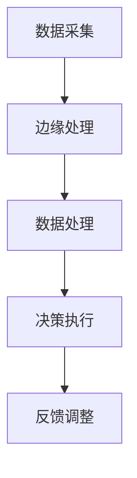
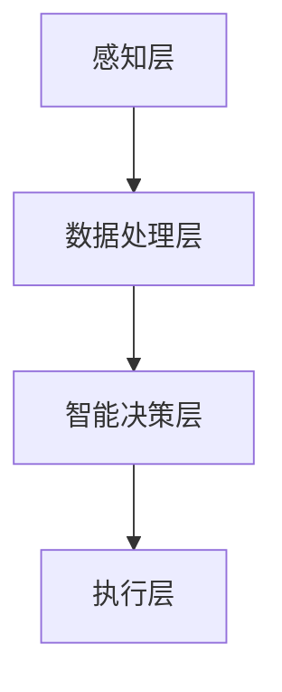
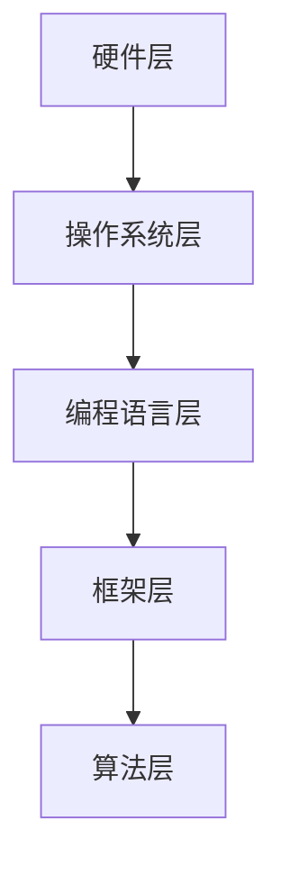
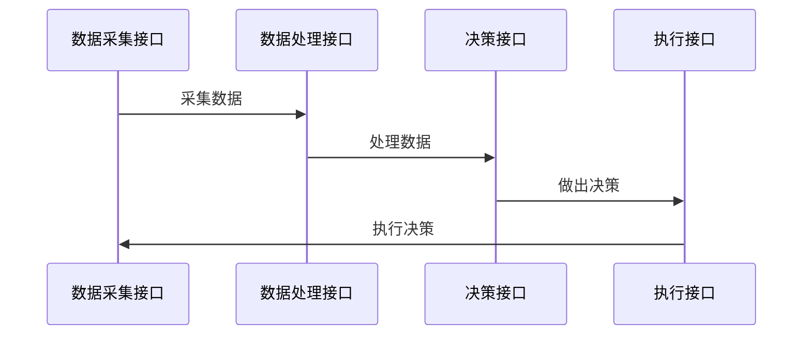
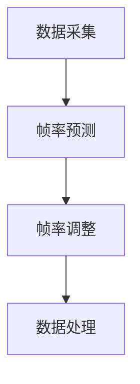
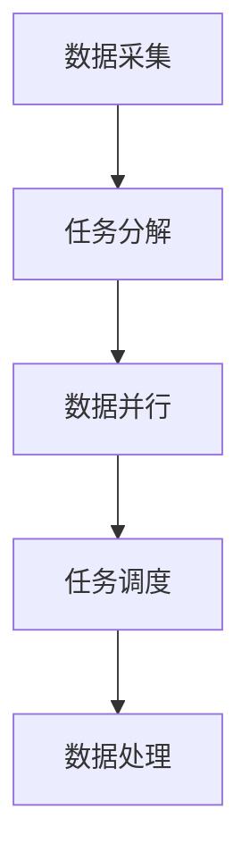
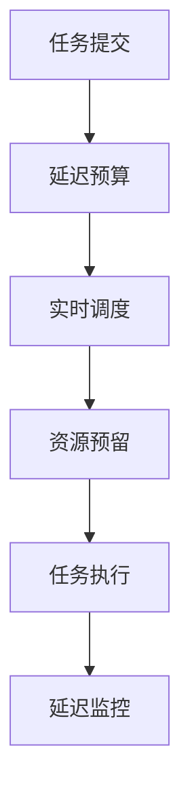
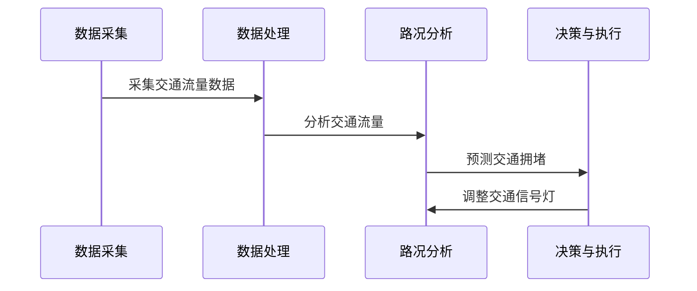
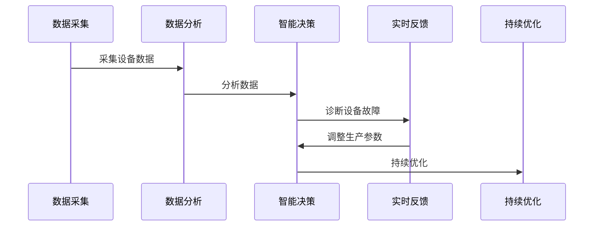

                 

## Step 1: Introduction

### Article Title: 企业AI Agent的边缘计算应用：实时处理与响应

### Keywords: 企业AI Agent、边缘计算、实时处理、响应

### Abstract:
随着物联网、大数据和人工智能技术的飞速发展，边缘计算在数据处理、智能决策等方面的重要性日益凸显。企业AI Agent作为一种新型的智能体，其核心在于通过边缘计算实现实时处理与响应。本文将深入探讨企业AI Agent的边缘计算应用，包括其核心概念、原理、架构设计以及实时处理与响应的策略，并结合实际案例进行分析，为企业在数字化转型中提供有益的参考。

## Step 2: Background Introduction

### Chapter 1: 边缘计算与AI Agent概述

#### 1.1 边缘计算的发展背景

边缘计算（Edge Computing）是一种分布式计算架构，旨在将数据处理、分析和应用推向网络的边缘，以降低延迟、节省带宽和提高效率。随着物联网（IoT）设备的普及，边缘计算逐渐成为大数据和人工智能技术的重要支撑。

边缘计算的发展背景可以从以下几个方面来理解：

- **物联网的崛起**：物联网设备的激增产生了海量数据，这些数据需要快速处理和分析，以实现智能决策和实时响应。
- **带宽和延迟的限制**：传统的云计算模式在处理海量数据时，往往面临带宽和延迟的限制，无法满足实时性的要求。
- **计算资源的分散**：边缘计算将计算任务分散到网络的边缘，降低了中心服务器的负载，提高了整体系统的效率。

#### 1.2 AI Agent的核心概念

AI Agent，即人工智能代理，是一种模拟人类智能行为的人工智能实体。它能够感知环境、理解意图、制定计划并采取行动，以实现特定的目标。

AI Agent的核心概念包括：

- **感知**：通过传感器获取环境信息。
- **理解**：解析环境信息，理解任务和目标。
- **决策**：基于理解的结果，制定行动计划。
- **执行**：实施行动计划，达到目标。

#### 1.3 边缘计算在AI Agent中的应用场景

边缘计算在AI Agent中的应用场景广泛，主要包括以下几个方面：

- **实时数据处理**：通过边缘计算实现实时数据采集和处理，为AI Agent提供实时决策基础。
- **智能决策**：边缘计算可以帮助AI Agent在本地快速做出决策，降低响应时间。
- **边缘协同**：边缘计算与云计算相结合，实现跨边缘节点的协同工作，提升AI Agent的整体效能。

#### 1.4 本书的核心内容与读者对象

本书的核心内容包括：

- **边缘计算与AI Agent的基本概念与原理**
- **企业AI Agent的架构设计与实现**
- **实时处理与响应的技术策略**
- **实际案例分析与最佳实践**

读者对象为：

- **人工智能领域的研发人员**：了解企业AI Agent的边缘计算应用，提升项目实战能力。
- **企业IT管理人员**：掌握边缘计算在人工智能中的应用，为数字化转型提供技术支持。

## Step 3: Core Concepts and Principles

### Chapter 2: 关键概念与原理

#### 2.1 边缘计算的基本原理

边缘计算的基本原理包括以下几个方面：

- **分布式计算**：将计算任务分散到网络的边缘，减轻中心服务器的负载。
- **本地处理**：在数据生成的地方进行数据处理，降低数据传输的延迟和带宽消耗。
- **智能协同**：边缘节点之间进行智能协同，提高整体系统的处理能力。

边缘计算的基本原理可以用以下Mermaid流程图来表示：



#### 2.2 AI Agent的关键特性

AI Agent的关键特性包括：

- **感知**：通过传感器获取环境信息。
- **理解**：解析环境信息，理解任务和目标。
- **决策**：基于理解的结果，制定行动计划。
- **执行**：实施行动计划，达到目标。

AI Agent的关键特性可以用以下Mermaid类图来表示：

```mermaid
classDiagram
    Sensor <<接口>>
    Processor <<接口>>
    Learner <<接口>>
    Executor <<接口>>

    AI-Agent <<类>> {
        sensor
        processor
        learner
        executor
    }
```

#### 2.3 边缘计算与AI Agent的结合点

边缘计算与AI Agent的结合点主要体现在以下几个方面：

- **实时数据处理**：边缘计算为AI Agent提供了实时数据处理的平台，使其能够快速响应环境变化。
- **智能决策**：边缘计算帮助AI Agent在本地快速做出决策，提高决策效率。
- **协同优化**：边缘计算与AI Agent的协同工作，实现分布式智能，提高整体系统的效能。

边缘计算与AI Agent的结合点可以用以下Mermaid实体关系图来表示：

```mermaid
erDiagram
    AI-Agent ||--|{ 数据处理 } Data_Processing
    AI-Agent ||--|{ 智能决策 } Intelligent_Decision
    AI-Agent ||--|{ 协同优化 } Collaborative_Optimization
    Data_Processing ||--|{ 边缘计算 } Edge_Computing
    Intelligent_Decision ||--|{ 边缘计算 } Edge_Computing
    Collaborative_Optimization ||--|{ 边缘计算 } Edge_Computing
```

#### 2.4 边缘计算AI Agent的体系结构

边缘计算AI Agent的体系结构主要包括以下几个层次：

- **感知层**：通过传感器获取环境信息。
- **数据处理层**：对感知层获取的数据进行处理和分析。
- **智能决策层**：基于处理层的结果，制定决策计划。
- **执行层**：执行决策计划，实现目标。

边缘计算AI Agent的体系结构可以用以下Mermaid架构图来表示：



## Step 4: Application Architecture

### Chapter 3: 应用架构设计

#### 3.1 边缘计算AI Agent的技术栈

边缘计算AI Agent的技术栈主要包括以下几个方面：

- **硬件层**：边缘计算节点，如智能路由器、智能网关等。
- **操作系统层**：支持边缘计算的操作系统，如Linux、RTOS等。
- **编程语言层**：Python、Java、C++等编程语言。
- **框架层**：TensorFlow、PyTorch、Keras等深度学习框架。
- **算法层**：机器学习算法、神经网络算法等。

边缘计算AI Agent的技术栈可以用以下Mermaid架构图来表示：



#### 3.2 系统架构设计

边缘计算AI Agent的系统架构设计主要包括以下几个模块：

- **领域模型**：定义边缘计算AI Agent的领域概念和关系。
- **架构设计**：设计边缘计算AI Agent的系统架构。
- **系统接口设计**：设计边缘计算AI Agent的接口和交互方式。

#### 3.2.1 领域模型

边缘计算AI Agent的领域模型主要包括以下几个实体：

- **边缘节点**：边缘计算的基本单元。
- **传感器**：用于数据采集。
- **数据处理单元**：用于数据预处理和分析。
- **智能决策单元**：用于决策和行动规划。
- **执行单元**：用于执行决策和行动。

边缘计算AI Agent的领域模型可以用以下Mermaid类图来表示：

```mermaid
classDiagram
    Edge_Node <<类>>
    Sensor <<类>>
    Data_Processing_Unit <<类>>
    Intelligent_Decision_Unit <<类>>
    Execution_Unit <<类>>

    Edge_Node --> Sensor
    Edge_Node --> Data_Processing_Unit
    Edge_Node --> Intelligent_Decision_Unit
    Edge_Node --> Execution_Unit
```

#### 3.2.2 架构设计

边缘计算AI Agent的架构设计主要包括以下几个层次：

- **感知层**：感知环境，获取数据。
- **数据处理层**：处理和分析数据。
- **智能决策层**：根据处理结果做出决策。
- **执行层**：执行决策和行动。

边缘计算AI Agent的架构设计可以用以下Mermaid架构图来表示：


#### 3.2.3 系统接口设计

边缘计算AI Agent的系统接口设计主要包括以下几个接口：

- **数据采集接口**：用于采集传感器数据。
- **数据处理接口**：用于处理和分析数据。
- **决策接口**：用于决策和行动规划。
- **执行接口**：用于执行决策和行动。

边缘计算AI Agent的系统接口设计可以用以下Mermaid序列图来表示：



## Step 5: Real-time Processing Techniques

### Chapter 4: 实时处理技术

#### 4.1 实时数据处理挑战

实时数据处理在边缘计算AI Agent中具有重要作用，但也面临以下挑战：

- **数据量大**：物联网设备产生海量数据，需要快速处理。
- **实时性要求高**：实时响应环境变化，要求低延迟。
- **异构性**：不同类型的传感器和数据源，需要统一处理。
- **计算资源有限**：边缘节点计算资源有限，需要高效利用。

#### 4.2 关键技术分析

实时处理技术主要包括以下几个方面：

- **帧率优化**：通过优化帧率，提高数据处理的效率。
- **并行处理**：利用多核处理器，实现并行计算。
- **延迟控制**：通过控制延迟，保证实时响应。

##### 4.2.1 帧率优化

帧率优化是实时数据处理的关键技术之一。通过调整帧率，可以在保证数据完整性的同时，提高数据处理效率。帧率优化的方法包括：

- **动态帧率调整**：根据数据量和处理需求，动态调整帧率。
- **帧率预测**：利用历史数据，预测未来帧率需求，提前调整。

帧率优化可以用以下Mermaid流程图来表示：



##### 4.2.2 并行处理

并行处理是提高实时数据处理效率的重要手段。通过多核处理器，可以实现并行计算，加快数据处理速度。并行处理的方法包括：

- **任务分解**：将大数据集分解为多个小任务，并行处理。
- **数据并行**：将数据处理任务分配到不同处理器，并行计算。
- **任务调度**：优化任务调度策略，提高并行处理效率。

并行处理可以用以下Mermaid架构图来表示：



##### 4.2.3 延迟控制

延迟控制是保证实时处理的关键。通过控制延迟，可以确保数据处理在规定时间内完成。延迟控制的方法包括：

- **延迟预算**：根据任务需求和资源情况，制定延迟预算。
- **实时调度**：动态调整任务执行顺序，降低延迟。
- **资源预留**：提前预留资源，确保任务执行。

延迟控制可以用以下Mermaid流程图来表示：



#### 4.3 实时数据处理案例分析

以下是一个实时数据处理案例：

- **场景**：智能交通系统，需要对实时交通流量进行分析和预测。
- **任务**：实时采集交通流量数据，分析路况，预测交通拥堵。

实时数据处理流程如下：

1. **数据采集**：通过传感器实时采集交通流量数据。
2. **数据处理**：对采集到的数据进行分析和清洗，提取有效信息。
3. **路况分析**：利用机器学习算法，分析实时交通流量，预测交通拥堵。
4. **决策与执行**：根据预测结果，调整交通信号灯，优化交通流量。

实时数据处理流程可以用以下Mermaid序列图来表示：



## Step 6: Response Strategies

### Chapter 5: 响应策略

#### 5.1 响应时间优化

响应时间优化是边缘计算AI Agent的关键问题。以下是一些优化响应时间的策略：

- **延迟预算**：根据任务需求和资源情况，制定合理的延迟预算。
- **实时调度**：动态调整任务执行顺序，降低延迟。
- **资源预留**：提前预留资源，确保任务执行。

#### 5.2 智能决策模型

智能决策模型是边缘计算AI Agent的核心。以下是一些智能决策模型：

- **基于规则的决策模型**：通过预设规则，实现决策。
- **基于机器学习的决策模型**：利用历史数据，学习决策策略。
- **混合决策模型**：结合多种决策模型，提高决策准确性。

#### 5.3 实时反馈机制

实时反馈机制是保证边缘计算AI Agent稳定运行的重要手段。以下是一些实时反馈机制：

- **异常检测**：实时监测系统运行状态，检测异常情况。
- **自适应调整**：根据反馈信息，调整系统参数。
- **持续优化**：利用反馈信息，不断优化系统性能。

#### 5.4 案例研究

以下是一个边缘计算AI Agent的响应策略案例：

- **场景**：智能工厂，需要对生产设备进行实时监控和故障诊断。
- **任务**：实时采集生产设备数据，诊断设备故障，调整生产参数。

响应策略如下：

1. **数据采集**：实时采集生产设备数据。
2. **数据分析**：分析数据，识别故障信号。
3. **智能决策**：利用基于机器学习的决策模型，诊断设备故障。
4. **实时反馈**：根据诊断结果，调整生产参数。
5. **持续优化**：利用实时反馈信息，不断优化决策模型。

响应策略可以用以下Mermaid序列图来表示：



## Step 7: Case Studies and Best Practices

### Chapter 6: 案例分析与最佳实践

#### 6.1 企业应用案例分析

以下是一些企业应用边缘计算AI Agent的案例分析：

- **案例1：智能交通系统**：通过边缘计算AI Agent，实时分析交通流量，优化交通信号灯，提高交通效率。
- **案例2：智能工厂**：通过边缘计算AI Agent，实时监控生产设备，诊断故障，提高生产效率。
- **案例3：智能医疗**：通过边缘计算AI Agent，实时分析医疗数据，辅助医生诊断，提高医疗水平。

#### 6.2 最佳实践分享

以下是边缘计算AI Agent的最佳实践分享：

- **实践1：数据预处理**：在边缘节点进行数据预处理，减少数据传输量。
- **实践2：模型压缩**：使用模型压缩技术，降低模型体积，提高边缘计算性能。
- **实践3：协同优化**：结合云计算和边缘计算，实现分布式智能。

#### 6.3 实践挑战与解决策略

以下是边缘计算AI Agent的实践挑战与解决策略：

- **挑战1：数据隐私保护**：解决数据隐私保护问题，确保数据安全。
- **挑战2：资源管理**：优化资源管理，确保边缘节点资源高效利用。
- **挑战3：网络稳定性**：提高网络稳定性，确保边缘计算可靠运行。

## Step 8: Summary and Future Trends

### Chapter 7: 总结与展望

#### 7.1 主要成果回顾

本文系统地介绍了边缘计算AI Agent的基本概念、原理、架构设计、实时处理技术、响应策略以及实际案例分析，总结了边缘计算AI Agent在实时处理与响应方面的优势和应用场景。

#### 7.2 存在的问题与挑战

边缘计算AI Agent在实时处理与响应方面仍面临一些问题与挑战，如数据隐私保护、资源管理、网络稳定性等。这些问题需要进一步研究和解决。

#### 7.3 未来发展趋势与机遇

未来，边缘计算AI Agent将继续发展，并在以下几个方面带来机遇：

- **智能化**：边缘计算AI Agent将更智能化，实现更复杂的任务。
- **规模化**：边缘计算AI Agent将应用于更多场景，实现规模化部署。
- **协同化**：边缘计算AI Agent将实现与云计算的协同，提高整体系统效能。

## Step 9: Conclusion

### Chapter 8: 结论与展望

#### 8.1 主要贡献

本文系统地介绍了边缘计算AI Agent的实时处理与响应，为企业在数字化转型中提供了有益的参考。

#### 8.2 对未来研究者的建议

未来研究者可以从以下几个方面进行深入研究：

- **数据隐私保护**：研究边缘计算AI Agent的数据隐私保护技术。
- **资源管理**：优化边缘计算AI Agent的资源管理策略。
- **网络稳定性**：提高边缘计算AI Agent的网络稳定性。

#### 8.3 致谢

感谢所有参与本文研究和写作的团队成员，以及提供宝贵意见和反馈的读者。

## 作者信息

**作者：AI天才研究院/AI Genius Institute & 禅与计算机程序设计艺术 /Zen And The Art of Computer Programming**

