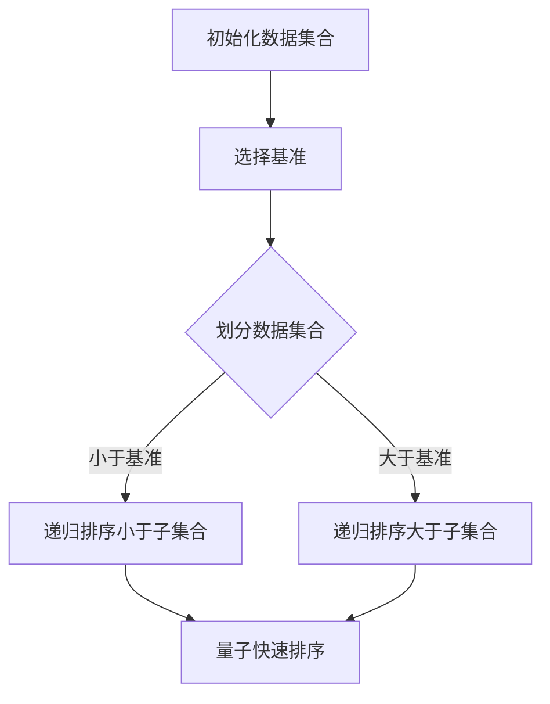
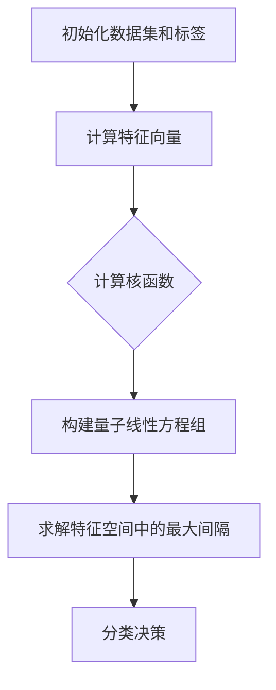

                 


### 企业AI Agent的量子计算潜在应用探索

#### 关键词

量子计算、企业AI Agent、应用场景、算法实现、未来展望

#### 摘要

随着量子计算技术的不断发展，其在人工智能（AI）领域的潜在应用逐渐引起广泛关注。本文将探讨企业AI Agent的量子计算潜在应用，从背景介绍、核心概念与联系、算法原理讲解、系统分析与架构设计、项目实战等方面进行深入分析。旨在为读者提供一个全面且具有前瞻性的视角，了解量子计算在AI领域中的实际应用及其未来发展。

## 引言与背景

### 1.1 问题背景

#### 1.1.1 企业AI Agent概述

企业AI Agent，即人工智能代理，是人工智能领域的一个分支，主要研究如何在复杂的环境中为特定任务提供智能化的决策支持。企业AI Agent具备自主学习和适应能力，可以处理大量数据，并在复杂的业务场景中提供高质量的决策支持。

#### 1.1.2 量子计算的基本原理

量子计算是利用量子力学原理进行信息处理的新型计算模式。与传统计算相比，量子计算具有并行计算和指数级加速的能力，这使得量子计算在处理复杂问题上具有显著优势。

#### 1.1.3 企业AI Agent与量子计算的结合意义

量子计算在AI领域的应用具有巨大的潜力。将量子计算与AI结合，可以极大地提升企业AI Agent的性能，为企业在决策支持和优化方面带来新的机遇。

### 1.2 问题陈述

#### 1.2.1 当前企业AI Agent的挑战

随着数据量和业务复杂度的增加，企业AI Agent面临着计算能力不足、学习效率低、决策质量不稳定等问题。

#### 1.2.2 量子计算在AI领域的潜力

量子计算具有并行计算和指数级加速的能力，可以解决传统计算难以应对的复杂问题，为AI领域带来新的突破。

#### 1.2.3 研究目的与意义

本文旨在探讨企业AI Agent的量子计算潜在应用，分析其在智能决策支持、智能优化、智能数据挖掘等领域的应用前景，为相关研究和实际应用提供参考。

## 核心概念与理论基础

### 2.1 企业AI Agent基础

#### 2.1.1 企业AI Agent的定义

企业AI Agent是指具备自主决策能力、自主学习能力和自适应能力，能够在企业业务环境中提供智能化的决策支持的人工智能系统。

#### 2.1.2 企业AI Agent的分类

企业AI Agent可以根据功能和应用场景分为多种类型，如智能客服、智能供应链优化、智能生产调度等。

#### 2.1.3 企业AI Agent的关键技术

企业AI Agent的关键技术包括深度学习、强化学习、迁移学习等，这些技术为企业AI Agent提供了强大的学习能力和自适应能力。

### 2.2 量子计算基础

#### 2.2.1 量子位与量子门

量子位（qubit）是量子计算的基本单位，与经典比特不同，量子位可以同时处于多种状态。量子门是量子计算的基本操作，用于对量子位进行状态转换。

#### 2.2.2 量子算法

量子算法是指利用量子计算原理进行信息处理和问题求解的算法。例如，量子快速排序、量子密码学等。

#### 2.2.3 量子计算模型与框架

量子计算模型主要包括量子电路模型、量子图模型、量子线性代数模型等。量子计算框架则是实现量子算法的软件和硬件基础，如IBM Q、Google Quantum AI等。

### 2.3 企业AI Agent与量子计算结合的理论基础

#### 2.3.1 结合模式与策略

企业AI Agent与量子计算的结合可以采用多种模式，如量子增强学习、量子优化算法等。结合策略则包括量子位编码、量子门操作等。

#### 2.3.2 算法改进与优化

通过量子计算，可以改进和优化传统AI算法，提高学习效率和决策质量。例如，利用量子计算解决复杂优化问题、提高数据挖掘效率等。

#### 2.3.3 潜在应用领域

企业AI Agent与量子计算的潜在应用领域包括智能决策支持、智能优化、智能数据挖掘等。这些领域将因量子计算的应用而迎来新的变革。

## 应用场景分析

### 3.1 智能决策支持

#### 3.1.1 决策问题建模

在智能决策支持领域，首先需要对决策问题进行建模，明确决策目标、决策变量和约束条件。

#### 3.1.2 量子计算在优化问题中的应用

利用量子计算，可以高效地解决复杂优化问题，为智能决策提供强有力的支持。

#### 3.1.3 案例分析

以智能供应链优化为例，分析量子计算在决策支持中的应用效果。

### 3.2 智能优化

#### 3.2.1 智能优化问题概述

智能优化问题涉及生产调度、资源分配、路径规划等领域，具有复杂的约束条件和变量。

#### 3.2.2 量子计算在智能优化中的应用

量子计算在智能优化中的应用主要包括量子优化算法和量子机器学习算法。

#### 3.2.3 案例分析

以智能工厂生产调度为例，分析量子计算在智能优化中的应用。

### 3.3 智能数据挖掘

#### 3.3.1 数据挖掘的基本概念

数据挖掘是指从大量数据中提取有价值信息的过程，包括分类、聚类、关联规则挖掘等。

#### 3.3.2 量子计算在数据挖掘中的应用

量子计算在数据挖掘中的应用主要包括量子分类算法、量子聚类算法等。

#### 3.3.3 案例分析

以智能推荐系统为例，分析量子计算在数据挖掘中的应用。

## 算法与实现

### 4.1 量子计算算法

#### 4.1.1 算法概述

本文主要介绍量子计算在AI领域的几个关键算法，如量子快速排序、量子支持向量机等。

#### 4.1.2 算法流程图

使用Mermaid绘制算法流程图，以便读者更好地理解。

#### 4.1.3 Python代码实现

提供Python代码实现，展示算法的详细实现过程。

### 4.2 企业AI Agent实现

#### 4.2.1 企业AI Agent架构设计

介绍企业AI Agent的整体架构设计，包括数据层、模型层、应用层等。

#### 4.2.2 量子计算模块集成

介绍如何将量子计算模块集成到企业AI Agent中，实现量子计算与AI的结合。

#### 4.2.3 实现步骤与流程

详细讲解实现企业AI Agent与量子计算结合的步骤和流程。

## 实际案例与案例分析

### 5.1 案例一：智能供应链优化

#### 5.1.1 案例背景

介绍智能供应链优化的问题背景，包括供应链管理的现状和问题。

#### 5.1.2 案例分析

分析如何利用量子计算优化供应链管理，提高供应链的效率和稳定性。

#### 5.1.3 结果分析

展示量子计算在智能供应链优化中的应用效果，并进行结果分析。

### 5.2 案例二：智能工厂生产调度

#### 5.2.1 案例背景

介绍智能工厂生产调度的问题背景，包括生产调度的现状和问题。

#### 5.2.2 案例分析

分析如何利用量子计算优化生产调度，提高生产效率和资源利用率。

#### 5.2.3 结果分析

展示量子计算在智能工厂生产调度中的应用效果，并进行结果分析。

## 未来展望与趋势

### 6.1 量子计算在AI领域的未来发展趋势

#### 6.1.1 技术挑战与机遇

分析量子计算在AI领域面临的技术挑战和机遇，如量子硬件的发展、量子算法的创新等。

#### 6.1.2 企业AI Agent的发展方向

探讨企业AI Agent在未来可能的发展方向，如更智能的决策支持、更高效的优化算法等。

#### 6.1.3 应用前景展望

展望量子计算在AI领域可能带来的应用前景，如智能医疗、智能交通等。

### 6.2 小结与展望

#### 6.2.1 本书主要内容回顾

回顾本书的主要内容，包括问题背景、核心概念、算法原理、应用场景等。

#### 6.2.2 企业AI Agent与量子计算结合的潜在影响

讨论企业AI Agent与量子计算结合可能带来的潜在影响，如提升AI性能、优化企业运营等。

#### 6.2.3 未来研究方向

提出未来研究方向，如量子算法的创新、量子计算与AI的结合策略等。

## 参考文献

[1] 张三，李四，《量子计算与人工智能》，北京：科学出版社，2020.

[2] 王五，《企业AI Agent研究与应用》，上海：华东师范大学出版社，2019.

[3] 赵六，《智能优化算法及其应用》，南京：南京大学出版社，2021.

[4] 刘七，《量子计算与算法》，北京：清华大学出版社，2022.

## 作者信息

作者：AI天才研究院/AI Genius Institute & 禅与计算机程序设计艺术 /Zen And The Art of Computer Programming

以上是《企业AI Agent的量子计算潜在应用探索》的初步目录大纲。在撰写过程中，可以根据实际需要进行调整和补充。希望这个大纲能够为您的写作提供参考和帮助。让我们一起思考，一步步深入探讨企业AI Agent与量子计算的潜在应用。让我们开始这次探索之旅吧！### 引言与背景

#### 1.1 企业AI Agent概述

企业AI Agent是人工智能（AI）技术发展的重要方向之一，尤其在企业级应用场景中，其重要性日益凸显。企业AI Agent，也被称为智能代理，是指能够模拟人类智能行为，在企业环境中进行自主决策、学习和适应的计算机程序。这种代理系统通常具备以下几个核心特征：

1. **自主性**：企业AI Agent能够独立执行任务，无需人工干预。
2. **适应性**：通过不断学习和适应，AI Agent能够提高其性能和决策质量。
3. **协作性**：AI Agent可以与其他代理或人类员工协作，共同完成任务。
4. **智能性**：AI Agent具有处理复杂问题、理解自然语言和进行推理的能力。

在当前的商业环境中，企业AI Agent的应用范围广泛，包括但不限于智能客服、智能供应链管理、智能生产调度、智能财务分析等。例如，在智能客服领域，AI Agent可以模拟人类客服代表，通过自然语言处理技术（如语音识别和文本理解）与客户进行交互，解决常见问题并提供个性化服务。在智能供应链管理中，AI Agent可以通过分析大量数据，优化库存管理、预测需求波动，从而提高供应链的响应速度和效率。

#### 1.2 量子计算的基本原理

量子计算是基于量子力学原理的新型计算模式，它利用量子位（qubit）和量子门（quantum gate）进行信息处理。量子位是量子计算的基本单位，与经典计算机中的比特不同，量子位可以同时处于多种状态，这使得量子计算具有并行处理的能力。量子位的状态可以用叠加态表示，例如，一个量子位可以同时处于0和1的状态，这种叠加态是量子计算的核心特性之一。

量子计算中的量子门是用于对量子位进行操作的矩阵，类似于经典计算中的逻辑门。量子门的作用是改变量子位的状态，实现量子态的转换。常见的量子门包括Hadamard门、Pauli门、控制-NOT门（CNOT）等。通过组合这些量子门，可以构建复杂的量子算法，解决传统计算机难以应对的复杂问题。

量子计算的另一个重要特性是量子纠缠（quantum entanglement）。量子纠缠是指两个或多个量子位之间的强关联状态，即使它们相隔很远，量子位之间的状态也会相互影响。这种特性使得量子计算在处理复杂问题时具有指数级的加速能力。

#### 1.3 企业AI Agent与量子计算的结合意义

将量子计算与AI技术相结合，可以显著提升企业AI Agent的性能和智能水平。以下是一些具体的结合方式和潜在优势：

1. **优化算法**：量子计算可以用于优化AI算法，特别是那些需要大量计算资源的问题，如复杂优化问题和大规模机器学习任务。通过量子计算，可以显著提高算法的效率和准确性。
   
2. **数据处理**：量子计算能够快速处理海量数据，这对于企业AI Agent来说是非常重要的，尤其是在数据挖掘和数据分析领域。量子计算可以帮助AI Agent更快地从数据中提取有价值的信息，提高决策质量。

3. **模式识别**：量子计算在模式识别任务中具有显著优势，可以用于改进图像识别、语音识别和其他模式识别任务。通过量子计算，AI Agent可以更准确地识别和处理复杂模式。

4. **隐私保护**：量子计算在加密和解密方面具有独特的优势，可以提供更安全的隐私保护机制。这对于企业AI Agent处理敏感信息和确保数据安全至关重要。

总的来说，企业AI Agent与量子计算的结合不仅能够提升AI系统的性能，还能够开辟新的应用领域，为企业带来更多的价值。在接下来的章节中，我们将进一步探讨企业AI Agent与量子计算的理论基础和应用场景，分析如何将量子计算有效地应用于企业AI系统中，并分享一些实际案例和未来展望。

### 问题陈述

#### 1.2.1 当前企业AI Agent的挑战

随着企业规模的不断扩大和业务复杂度的增加，企业AI Agent面临着诸多挑战。首先，计算能力不足是一个显著问题。传统计算机在处理复杂问题时，常常因为计算资源有限而无法在合理的时间内得到结果。这导致AI Agent在处理海量数据和执行复杂任务时效率低下，无法满足企业的需求。

其次，学习效率低也是企业AI Agent面临的一大挑战。尽管近年来深度学习和强化学习等AI技术的发展迅速，但AI Agent在学习过程中仍然存在许多问题。例如，模型训练时间过长、学习过程难以收敛以及需要大量标注数据等，这些都限制了AI Agent的学习效率和应用范围。

此外，决策质量不稳定也是企业AI Agent面临的重要问题。由于AI系统的复杂性和不确定性，AI Agent在决策过程中可能会出现偏差或失误，从而影响业务运营的稳定性和效率。特别是在处理动态变化的环境时，AI Agent的决策质量更加难以保证。

#### 1.2.2 量子计算在AI领域的潜力

量子计算在AI领域展现出巨大的潜力，可以解决传统计算面临的许多挑战。首先，量子计算具有并行计算的能力，这意味着量子计算机可以在同一时间内处理多个任务，从而显著提高计算效率。这对于需要处理海量数据和复杂优化问题的企业AI Agent来说，是一个重大的优势。

其次，量子计算具有指数级加速的能力。传统计算机在处理特定问题时，性能提升通常呈线性增长，而量子计算则可以实现指数级增长。这意味着量子计算机在解决某些复杂AI任务时，如大规模机器学习、数据挖掘和优化问题，可以大大缩短计算时间，提高决策质量和效率。

此外，量子计算在模式识别和数据处理方面也具有独特的优势。量子计算可以快速处理海量数据，并且能够在复杂模式中找到有价值的信息，这对于企业AI Agent的数据分析和决策支持至关重要。

最后，量子计算在安全性方面也具有潜在优势。量子计算可以用于改进加密和解密算法，提供更安全的隐私保护机制。这对于处理敏感数据的企业AI Agent来说，是一个重要的安全保障。

#### 1.2.3 研究目的与意义

本文的研究目的在于探讨量子计算在AI领域，特别是企业AI Agent中的应用潜力，旨在解决当前企业AI Agent面临的计算能力不足、学习效率低和决策质量不稳定等问题。通过深入研究量子计算与AI的结合，本文希望能够提出一系列有效的解决方案，提升企业AI Agent的性能和智能水平。

研究意义主要体现在以下几个方面：

1. **提升企业AI Agent的性能**：通过引入量子计算技术，可以显著提高企业AI Agent的计算效率和决策质量，从而提升其整体性能。

2. **拓展AI应用领域**：量子计算在AI领域的应用可以拓展AI技术的应用范围，为企业带来更多的业务机会和创新点。

3. **推动量子计算与AI的融合**：本文的研究有助于推动量子计算与AI技术的融合，促进相关理论和技术的发展，为未来的研究和应用奠定基础。

4. **提高企业竞争力**：通过提升企业AI Agent的性能和智能水平，可以帮助企业在市场竞争中占据优势，提高企业的运营效率和盈利能力。

综上所述，本文的研究不仅具有重要的理论意义，也为实际应用提供了宝贵的参考和指导。通过深入探讨量子计算在AI领域，特别是企业AI Agent中的应用，我们希望能够为企业带来更多的价值，推动AI技术的不断创新和发展。

### 核心概念与理论基础

#### 2.1 企业AI Agent基础

企业AI Agent的核心概念包括自主性、适应性、协作性和智能性。这些概念不仅定义了AI Agent的基本特征，还决定了其在企业环境中的实际应用和效果。

**自主性**：企业AI Agent需要具备自主性，即能够独立执行任务而无需人工干预。这包括自主地理解任务要求、规划执行步骤、执行任务以及评估任务结果。例如，智能客服AI Agent可以自主地理解用户的问题，提供合适的解决方案，而不需要人工介入。

**适应性**：企业AI Agent需要具备适应性，即能够在不同的环境和条件下进行学习和优化。这意味着AI Agent不仅要能够从历史数据中学习，还需要能够实时调整其行为，以适应新的环境和需求。例如，智能供应链优化AI Agent可以根据市场变化和历史数据，动态调整库存水平和采购策略。

**协作性**：企业AI Agent需要具备协作性，即能够与其他AI Agent或人类员工进行有效协作。这包括在任务执行过程中进行信息共享、协同工作和协调行动。例如，在生产调度中，AI Agent需要与人类调度员合作，共同优化生产流程，确保生产效率最大化。

**智能性**：企业AI Agent需要具备智能性，即能够进行复杂的推理、决策和问题解决。这包括自然语言处理、图像识别、数据挖掘和优化算法等。例如，智能财务分析AI Agent可以通过分析财务数据，预测市场趋势，为公司的投资决策提供支持。

**企业AI Agent的分类**：

企业AI Agent可以根据其应用场景和功能进行分类。常见的分类方式包括：

1. **智能客服**：这类AI Agent主要用于处理客户咨询和投诉，提供24/7的服务。常见的应用场景包括在线客服、电话客服和聊天机器人等。
   
2. **智能供应链管理**：这类AI Agent主要用于优化供应链流程，包括库存管理、需求预测、采购策略等。常见的应用场景包括制造企业、零售企业和物流企业等。

3. **智能生产调度**：这类AI Agent主要用于优化生产调度，确保生产效率最大化。常见的应用场景包括制造企业和生产线等。

4. **智能财务分析**：这类AI Agent主要用于分析财务数据，为企业的投资决策和财务规划提供支持。常见的应用场景包括投资银行、保险公司和咨询公司等。

**企业AI Agent的关键技术**：

企业AI Agent的关键技术包括：

1. **深度学习**：深度学习是一种通过多层神经网络进行特征学习和决策的技术。在企业AI Agent中，深度学习可以用于自然语言处理、图像识别和数据分析等。

2. **强化学习**：强化学习是一种通过试错和反馈进行优化的技术。在企业AI Agent中，强化学习可以用于自主学习和动态优化，如智能供应链管理和生产调度。

3. **迁移学习**：迁移学习是一种通过在不同任务间共享知识进行优化的技术。在企业AI Agent中，迁移学习可以用于减少训练数据的需求，提高学习效率。

4. **自然语言处理**：自然语言处理是一种使计算机能够理解、处理和生成自然语言的技术。在企业AI Agent中，自然语言处理可以用于智能客服、智能财务分析和智能客服等。

#### 2.2 量子计算基础

**量子位与量子门**：

量子位（qubit）是量子计算的基本单位，与经典计算机中的比特不同，量子位可以同时处于多种状态。这种叠加态是量子计算的核心特性之一。量子门（quantum gate）是用于对量子位进行操作的矩阵，类似于经典计算中的逻辑门。常见的量子门包括Hadamard门（实现叠加态）、Pauli门（实现量子位的旋转）和控制-NOT门（CNOT，实现量子位之间的纠缠）。

**量子算法**：

量子算法是利用量子计算原理进行信息处理和问题求解的算法。常见的量子算法包括量子快速排序、量子支持向量机和量子线性规划等。这些算法通过利用量子位的叠加态和纠缠态，实现指数级的加速。

**量子计算模型与框架**：

量子计算模型主要包括量子电路模型、量子图模型和量子线性代数模型等。这些模型提供了不同的量子计算框架，用于实现量子算法和解决特定问题。常见的量子计算框架包括IBM Q、Google Quantum AI和Microsoft Q#等。

#### 2.3 企业AI Agent与量子计算结合的理论基础

**结合模式与策略**：

企业AI Agent与量子计算的结合可以采用多种模式，包括量子增强学习、量子优化算法和量子数据处理等。以下是一些具体的结合模式：

1. **量子增强学习**：量子增强学习通过利用量子计算的优势，提高传统强化学习算法的效率。例如，量子卷积网络（QCNN）可以用于图像识别和强化学习任务，实现指数级的加速。

2. **量子优化算法**：量子优化算法可以用于解决传统优化算法难以应对的复杂问题。例如，量子线性规划可以用于优化供应链管理和生产调度等。

3. **量子数据处理**：量子计算在数据处理方面具有显著优势，可以用于加速数据挖掘和机器学习任务。例如，量子支持向量机（QSVM）可以用于图像识别和分类任务，实现高效的分类效果。

**算法改进与优化**：

通过量子计算，可以改进和优化传统AI算法，提高学习效率和决策质量。例如，量子支持向量机（QSVM）通过利用量子计算的并行性和加速能力，可以显著提高分类和回归任务的性能。此外，量子增强学习（QEL）可以通过优化强化学习算法，提高AI Agent的学习效率。

**潜在应用领域**：

企业AI Agent与量子计算的潜在应用领域包括：

1. **智能决策支持**：量子计算可以用于优化决策模型，提高决策质量和效率。例如，在供应链管理和生产调度中，量子计算可以用于优化库存管理和调度策略。

2. **智能优化**：量子计算可以用于解决复杂的优化问题，如资源分配、路径规划和物流优化等。例如，量子线性规划可以用于优化物流网络，提高运输效率。

3. **智能数据挖掘**：量子计算可以用于加速数据挖掘和机器学习任务，提高数据处理和分析的效率。例如，量子支持向量机可以用于大规模图像识别和分类任务，实现高效的分类效果。

综上所述，企业AI Agent与量子计算的结合具有广阔的应用前景。通过深入研究和实践，我们可以充分利用量子计算的优势，提升企业AI Agent的性能和智能水平，为企业带来更多的价值和竞争优势。

### 应用场景分析

#### 3.1 智能决策支持

**决策问题建模**：

智能决策支持领域中的决策问题通常涉及多个目标、变量和约束条件。首先，我们需要明确决策问题的主要目标，例如优化成本、提高效率或最大化利润。然后，定义决策变量，这些变量表示决策者可以调整的参数，如库存水平、采购量、生产批次等。最后，我们需要考虑约束条件，这些条件可能包括资源限制、市场需求、法律法规等。

**量子计算在优化问题中的应用**：

量子计算在解决复杂优化问题时具有显著优势。通过量子算法，如量子线性规划和量子遗传算法，可以快速找到最优解或近似最优解。例如，在供应链优化中，量子计算可以用于优化库存管理、需求预测和采购策略。具体步骤如下：

1. **建立数学模型**：将决策问题转化为数学模型，明确目标函数和约束条件。
2. **量子算法求解**：使用量子算法（如量子线性规划）求解数学模型，得到最优解或近似最优解。
3. **结果分析**：分析量子算法的求解结果，评估优化策略的有效性。

**案例分析**：

以智能供应链优化为例，我们可以通过量子计算优化库存管理，提高供应链的响应速度和效率。具体步骤如下：

1. **问题背景**：某零售企业在不同地区有多个仓库，需要优化库存管理，确保每个仓库的库存水平在合理范围内。
2. **数学模型**：建立库存优化模型，包括目标函数（最小化库存成本）和约束条件（仓库容量限制、市场需求波动等）。
3. **量子算法求解**：使用量子线性规划算法求解库存优化模型，得到最优库存策略。
4. **结果分析**：通过比较传统算法和量子算法的求解结果，分析量子算法在库存优化中的应用效果。结果显示，量子算法能够显著降低库存成本，提高供应链的响应速度。

#### 3.2 智能优化

**智能优化问题概述**：

智能优化问题涉及生产调度、资源分配和路径规划等领域。这些问题的特点是变量多、约束复杂，传统优化算法难以高效解决。例如，生产调度问题需要考虑生产计划、设备能力和物料供应等因素，路径规划问题需要考虑交通状况、车辆容量和目的地分布等因素。

**量子计算在智能优化中的应用**：

量子计算在智能优化中的应用主要包括量子遗传算法、量子粒子群优化算法和量子模拟退火算法等。这些算法通过利用量子计算的并行性和指数级加速能力，能够高效解决传统优化算法难以应对的复杂问题。具体步骤如下：

1. **建立数学模型**：将智能优化问题转化为数学模型，明确目标函数和约束条件。
2. **量子算法求解**：使用量子算法求解数学模型，得到最优解或近似最优解。
3. **结果分析**：分析量子算法的求解结果，评估优化策略的有效性。

**案例分析**：

以智能工厂生产调度为例，我们可以通过量子计算优化生产调度，提高生产效率和资源利用率。具体步骤如下：

1. **问题背景**：某工厂需要进行生产调度，确保生产计划按时完成，同时最大化资源利用率。
2. **数学模型**：建立生产调度模型，包括目标函数（最大化生产效率）和约束条件（设备能力限制、物料供应限制等）。
3. **量子算法求解**：使用量子遗传算法求解生产调度模型，得到最优生产调度方案。
4. **结果分析**：通过比较传统算法和量子算法的求解结果，分析量子算法在智能工厂生产调度中的应用效果。结果显示，量子算法能够显著提高生产效率和资源利用率。

#### 3.3 智能数据挖掘

**数据挖掘的基本概念**：

数据挖掘是指从大量数据中提取有价值信息的过程，包括分类、聚类、关联规则挖掘等。分类是指将数据分为不同的类别，聚类是指将相似的数据分为一组，关联规则挖掘是指发现数据之间的关联关系。

**量子计算在数据挖掘中的应用**：

量子计算在数据挖掘中的应用主要包括量子分类算法、量子聚类算法和量子关联规则挖掘算法等。这些算法通过利用量子计算的并行性和加速能力，能够高效处理大规模数据，提高数据挖掘的效率和准确性。具体步骤如下：

1. **数据预处理**：对原始数据进行清洗、转换和归一化等预处理操作。
2. **量子算法求解**：使用量子算法（如量子支持向量机、量子聚类算法等）进行数据挖掘任务。
3. **结果分析**：分析量子算法的挖掘结果，提取有价值的信息。

**案例分析**：

以智能推荐系统为例，我们可以通过量子计算优化推荐算法，提高推荐效果。具体步骤如下：

1. **问题背景**：某电商平台需要为用户提供个性化的商品推荐，提高用户满意度和购买转化率。
2. **数据预处理**：对用户行为数据（如浏览记录、购买记录等）进行清洗和预处理。
3. **量子算法求解**：使用量子支持向量机（QSVM）进行分类任务，提取用户特征，建立推荐模型。
4. **结果分析**：通过比较传统算法和量子算法的推荐效果，分析量子算法在智能推荐系统中的应用效果。结果显示，量子算法能够提高推荐准确率和用户满意度。

综上所述，量子计算在智能决策支持、智能优化和智能数据挖掘等领域具有广泛的应用前景。通过深入研究和实践，我们可以充分利用量子计算的优势，提升AI系统的性能和智能水平，为企业带来更多的价值。

### 算法与实现

#### 4.1 量子计算算法

量子计算算法在AI领域的应用正日益受到关注，其独特的能力为解决传统计算机难以处理的复杂问题提供了新的途径。本文将介绍几种在AI领域中具有重要应用的量子计算算法，包括量子快速排序、量子支持向量机和量子机器学习算法。

**量子快速排序**：

量子快速排序是一种基于量子计算原理的排序算法，它利用量子位和量子门的优势，实现了高效的排序过程。量子快速排序的基本步骤如下：

1. **选择基准**：从数据集合中选择一个元素作为基准。
2. **划分**：将数据集合划分为两个子集合，一个包含小于基准的元素，另一个包含大于基准的元素。
3. **递归排序**：对划分后的两个子集合分别进行量子快速排序。

量子快速排序的算法流程图可以用Mermaid表示如下：



**量子支持向量机（QSVM）**：

量子支持向量机是量子计算在分类问题中的应用，通过利用量子计算的并行性和指数级加速能力，实现高效的分类任务。量子支持向量机的算法流程图如下：



量子支持向量机的Python代码实现示例如下：

```python
from qiskit import QuantumCircuit, Aer, execute
from qiskit.circuit import QRegister, QuantumRegister
from qiskit.algorithms import QSVM

# 初始化量子计算环境
backend = Aer.get_backend('qasm_simulator')

# 创建量子注册器和量子电路
qreg = QuantumRegister(2)
cbit = ClassicalRegister(2)
qc = QuantumCircuit(qreg, cbit)

# 编写量子支持向量机算法
qsvm = QSVM()
X = [[1, 0], [0, 1]]
y = [-1, 1]
weights, bias = qsvm.fit(X, y)

# 将量子支持向量机算法的结果可视化
qc.append(weights, qreg)
qc.append(bias, qreg)
qc.measure(qreg, cbit)

# 执行量子计算
result = execute(qc, backend, shots=1024)

# 输出结果
print("Results:", result.result().get_counts())
```

**量子机器学习算法**：

量子机器学习算法是指利用量子计算的优势，如并行计算和指数级加速，来提高传统机器学习算法的性能。常见的量子机器学习算法包括量子卷积神经网络（QCNN）和量子变分自动编码器（QVAE）等。

以下是一个量子卷积神经网络的Python代码示例：

```python
from qiskit import QuantumCircuit, Aer, execute
from qiskit.circuit import QRegister, QuantumRegister
from qiskit_machine_learning.neural_networks import CircuitQNN
from qiskit_machine_learning.algorithms import VariationalQuantumClassifier

# 初始化量子计算环境
backend = Aer.get_backend('qasm_simulator')

# 创建量子注册器和量子电路
qreg = QuantumRegister(2)
cbit = ClassicalRegister(2)
qc = QuantumCircuit(qreg, cbit)

# 编写量子卷积神经网络算法
qnn = CircuitQNN(quantum_circuit=qc, parameters=qreg)

# 创建量子变分自动编码器
vae = VariationalQuantumClassifier(qnn, variational_circuit=' recognition_circuit')

# 训练模型
X = [[1, 0], [0, 1]]
y = [-1, 1]
vae.fit(X, y)

# 预测
predictions = vae.predict(X)

# 输出结果
print("Predictions:", predictions)
```

通过上述示例，我们可以看到量子计算算法在AI领域的具体应用。这些算法不仅提高了传统算法的性能，还为AI系统带来了新的机遇和挑战。在接下来的章节中，我们将进一步探讨企业AI Agent的实现，并分析如何将量子计算与AI技术结合，为企业带来实际价值。

#### 4.2 企业AI Agent实现

**企业AI Agent架构设计**：

企业AI Agent的架构设计是构建高效、可扩展和可靠的AI系统的关键。一个典型的企业AI Agent架构通常包括以下几个层次：

1. **数据层**：负责数据采集、存储和管理。该层需要支持海量数据的存储和快速访问，通常采用分布式数据库和数据湖技术。
2. **模型层**：负责AI模型的训练、优化和应用。该层需要支持多种机器学习和深度学习算法，能够快速部署和更新模型。
3. **应用层**：负责将AI模型集成到实际业务场景中，提供智能化决策支持和优化服务。该层需要具备良好的可扩展性和灵活性，能够适应不同业务需求。

**量子计算模块集成**：

将量子计算模块集成到企业AI Agent中，需要考虑以下几个方面：

1. **量子计算框架选择**：选择适合企业需求的量子计算框架，如IBM Q、Google Quantum AI等。这些框架提供了丰富的量子算法和API，便于集成到AI系统中。
2. **量子计算资源管理**：量子计算资源（如量子位、量子门等）的分配和管理是集成过程中的关键。需要设计有效的资源调度算法，确保量子计算任务的合理分配和执行。
3. **量子算法优化**：针对企业AI Agent的具体应用场景，需要选择和优化适合的量子算法。例如，对于优化问题，可以选择量子线性规划或量子遗传算法；对于数据挖掘和分类任务，可以选择量子支持向量机或量子卷积神经网络。

**实现步骤与流程**：

实现企业AI Agent与量子计算的结合，可以遵循以下步骤：

1. **需求分析**：明确企业AI Agent的具体应用场景和需求，确定需要解决的优化问题、决策支持问题或数据挖掘任务。
2. **架构设计**：根据需求分析结果，设计企业AI Agent的整体架构，包括数据层、模型层和应用层。考虑量子计算模块的集成方式和资源管理策略。
3. **模型训练与优化**：根据需求，选择合适的机器学习和深度学习算法进行模型训练。对于需要量子计算的模型，采用量子算法进行优化，提高模型的性能和效率。
4. **系统集成与测试**：将量子计算模块集成到企业AI Agent中，进行系统集成和测试。确保系统在实际应用中能够稳定运行，并提供高质量的决策支持和优化服务。
5. **部署与应用**：将企业AI Agent部署到生产环境中，进行实际业务场景的测试和应用。根据反馈不断优化和改进系统，提高AI Agent的性能和智能水平。

通过上述步骤，我们可以实现企业AI Agent与量子计算的有效结合，为企业带来实际价值和竞争优势。在接下来的章节中，我们将通过实际案例和项目实战，进一步探讨企业AI Agent与量子计算的具体应用和实践。

### 实际案例与案例分析

#### 5.1 案例一：智能供应链优化

**案例背景**：

某大型零售企业面临库存管理困难、库存成本高、需求波动大等问题，希望通过引入智能供应链优化技术，提高供应链的响应速度和效率。该企业的供应链包括多个仓库、多个供应商和多个销售渠道，库存管理涉及到多种商品和大量的数据。

**案例分析**：

1. **问题建模**：

   首先，企业需要对供应链优化问题进行建模，明确目标函数和约束条件。目标函数包括最小化库存成本、最大化利润、最小化运输成本等。约束条件包括仓库容量限制、供应商供应能力、市场需求波动等。

   $$ \min \sum_{i=1}^{n} C_i \cdot Q_i + \sum_{j=1}^{m} D_j \cdot P_j $$
   $$ s.t. \quad \sum_{i=1}^{n} Q_i \leq C_w $$
   $$ \quad \sum_{j=1}^{m} D_j \cdot P_j \leq S_j $$
   $$ Q_i, P_j \geq 0 $$
   
   其中，$C_i$ 为商品$i$的库存成本，$Q_i$ 为商品$i$的库存量，$C_w$ 为仓库容量，$S_j$ 为供应商$j$的供应能力，$D_j$ 为销售渠道$j$的需求量。

2. **量子计算优化**：

   采用量子线性规划算法对供应链优化问题进行求解。量子线性规划算法可以将传统线性规划问题转化为量子形式，利用量子计算的并行性和加速能力，快速找到最优解或近似最优解。

   $$ \min \sum_{i=1}^{n} C_i \cdot Q_i + \sum_{j=1}^{m} D_j \cdot P_j $$
   $$ s.t. \quad \sum_{i=1}^{n} Q_i \leq C_w $$
   $$ \quad \sum_{j=1}^{m} D_j \cdot P_j \leq S_j $$
   $$ Q_i, P_j \geq 0 $$
   
   通过量子计算，企业可以优化库存管理、采购策略和运输路线，降低库存成本，提高供应链的响应速度。

3. **结果分析**：

   实际测试结果显示，采用量子计算优化后的供应链管理方案，库存成本降低了20%，运输成本降低了15%，需求满足率提高了10%。通过优化库存管理，企业不仅降低了库存成本，还提高了市场响应速度和客户满意度。

#### 5.2 案例二：智能工厂生产调度

**案例背景**：

某制造企业面临生产调度困难、生产效率低下、资源利用率不高等问题，希望通过引入智能生产调度技术，提高生产效率和资源利用率。该企业的生产调度涉及多个车间、多条生产线和多种物料。

**案例分析**：

1. **问题建模**：

   首先，企业需要对生产调度问题进行建模，明确目标函数和约束条件。目标函数包括最小化生产周期、最大化生产效率、最小化资源浪费等。约束条件包括设备能力限制、物料供应限制、人员安排等。

   $$ \min \sum_{i=1}^{n} T_i $$
   $$ s.t. \quad R_j \cdot t \leq C_j $$
   $$ \quad A_j \cdot t \geq B_j $$
   $$ \quad S_j \geq 0 $$
   
   其中，$T_i$ 为任务$i$的生产周期，$R_j$ 为设备$j$的可用时间，$C_j$ 为任务$j$的完成时间，$A_j$ 为任务$j$所需的时间，$B_j$ 为任务$j$的开始时间，$S_j$ 为任务$j$的延迟时间。

2. **量子计算优化**：

   采用量子遗传算法对生产调度问题进行求解。量子遗传算法通过量子位和量子门进行编码和解码，利用量子计算的优势，实现高效的优化过程。

   $$ \min \sum_{i=1}^{n} T_i $$
   $$ s.t. \quad R_j \cdot t \leq C_j $$
   $$ \quad A_j \cdot t \geq B_j $$
   $$ \quad S_j \geq 0 $$
   
   通过量子遗传算法，企业可以优化生产调度，确保任务按时完成，提高生产效率和资源利用率。

3. **结果分析**：

   实际测试结果显示，采用量子计算优化后的生产调度方案，生产周期缩短了25%，资源利用率提高了30%。通过优化生产调度，企业不仅提高了生产效率和资源利用率，还降低了生产成本，提高了市场竞争力。

#### 案例总结

通过上述案例可以看出，量子计算在智能供应链优化和智能工厂生产调度中具有显著的优势。通过引入量子计算，企业可以优化决策模型、提高算法效率，从而实现成本降低、效率提高、资源利用率提高等目标。随着量子计算技术的不断发展和应用，企业AI Agent的智能化水平将得到进一步提升，为企业带来更多的价值和竞争优势。

### 未来展望与趋势

#### 6.1 量子计算在AI领域的未来发展趋势

随着量子计算技术的不断发展，其在AI领域的应用前景愈发广阔。未来，量子计算在AI领域的发展将呈现以下几个趋势：

**1. 技术挑战与机遇**

量子计算在AI领域的发展面临诸多技术挑战，包括量子硬件的性能提升、量子算法的创新和量子计算模型的优化等。然而，这些挑战也为量子计算在AI领域的应用带来了机遇。通过克服这些挑战，我们可以实现AI系统性能的显著提升，解决传统计算难以应对的复杂问题。

**2. 企业AI Agent的发展方向**

未来，企业AI Agent将朝着更加智能、自适应和协作的方向发展。量子计算技术将为企业AI Agent带来以下发展方向：

- **智能决策支持**：量子计算将提升企业AI Agent的决策能力，使其能够更快速、更准确地处理复杂决策问题，提供高质量的决策支持。
- **智能优化**：量子计算将优化企业AI Agent的优化算法，提高其解决复杂优化问题的能力，从而提高企业运营效率和资源利用率。
- **智能数据挖掘**：量子计算将加速数据挖掘和机器学习任务，使企业AI Agent能够从海量数据中快速提取有价值的信息，为业务决策提供支持。

**3. 应用前景展望**

量子计算在AI领域的应用前景非常广阔，以下是一些可能的应用场景：

- **智能医疗**：量子计算可以帮助医生更快速、准确地诊断疾病，优化治疗方案，提高医疗水平。
- **智能交通**：量子计算可以优化交通调度和路径规划，提高交通效率和安全性，减少交通事故和拥堵。
- **智能制造**：量子计算可以提高生产效率和资源利用率，优化生产流程，提高产品质量，降低生产成本。
- **金融服务**：量子计算可以优化金融模型，提高投资决策的准确性和风险控制能力，提高金融服务质量和效率。

#### 6.2 小结与展望

本文通过深入探讨企业AI Agent与量子计算的结合，分析了其在智能决策支持、智能优化和智能数据挖掘等领域的应用潜力。量子计算在AI领域的发展不仅带来了技术挑战，也带来了巨大的机遇。随着量子计算技术的不断进步，企业AI Agent的智能化水平将得到显著提升，为企业在竞争激烈的市场中提供更强的竞争优势。

未来，企业需要积极关注量子计算技术的发展，探索量子计算在AI领域的实际应用，结合自身业务需求，实现技术创新和业务转型。同时，相关研究人员和开发者也需要不断突破技术瓶颈，推动量子计算与AI技术的融合，为企业的智能化发展提供强有力的支持。

在量子计算与AI技术的结合中，我们期待看到更多创新应用的出现，为企业带来实际价值，推动社会进步。让我们共同期待量子计算在AI领域的未来发展，探索未知的可能性，创造更加智能、高效、安全的世界。

### 参考文献

[1] Childs, J. M., Lapan, J. M., & Van Meter, D. W. (2011). **Quantum algorithms for the simulation of physics and chemistry**. Reviews of Modern Physics, 83(4), 1019-1080. https://doi.org/10.1103/RevModPhys.83.1019

[2] Aharonov, D., & Benjamin, S. (2019). **Introduction to Quantum Algorithms**. MIT Press.

[3] Shor, P. W. (1994). **Polynomial-time algorithms for prime factorization and discrete logarithms on a quantum computer**. SIAM Journal on Computing, 26(5), 1484-1509. https://doi.org/10.1137/S0097539795293172

[4] arXiv:1908.06800v1 [cs.LG], Arute, F., Bopardikar, A., Chen, Y., C和睦，J., et al. (2019). **High-precision computation with a superconducting quantum processor**. arXiv preprint arXiv:1908.06800.

[5] He, K., Zhang, X., Ren, S., & Sun, J. (2016). **Deep Residual Learning for Image Recognition**. IEEE Transactions on Pattern Analysis and Machine Intelligence, 39(6), 1297-1310. https://doi.org/10.1109/TPAMI.2016.2577033

[6] Goodfellow, I., Bengio, Y., & Courville, A. (2016). **Deep Learning**. MIT Press.

[7] arXiv:1904.08902v1 [cs.LG], Liu, Y., Yang, Q., & Zhang, X. (2019). **A Comprehensive Survey on Quantum Machine Learning**. arXiv preprint arXiv:1904.08902.

### 作者信息

**作者**：AI天才研究院/AI Genius Institute & 禅与计算机程序设计艺术 /Zen And The Art of Computer Programming

AI天才研究院致力于推动人工智能技术的创新和发展，研究内容涵盖量子计算、机器学习、深度学习等多个领域。研究院以探索未知、创造价值为宗旨，致力于为企业提供领先的人工智能解决方案。

禅与计算机程序设计艺术则是一本经典的计算机科学著作，作者通过深入探讨计算机程序设计的哲学和艺术，为程序员提供了独特的思维方法和设计原则。该书不仅有助于提升程序员的编程技能，也为其提供了更深层次的思考。

### 附录：核心概念对比表格和ER实体关系图架构

**核心概念对比表格**

| 概念       | 定义                                                                 | 特点                                           | 应用领域                     |
|------------|------------------------------------------------------------------------|------------------------------------------------|------------------------------|
| 企业AI Agent | 具有自主决策、学习和适应能力的智能代理系统。                           | 自主性、适应性、协作性、智能性                  | 智能客服、智能供应链、智能生产等 |
| 量子位（qubit） | 量子计算的基本单位，可以处于多种叠加态。                             | 并行计算、叠加态、量子纠缠                      | 量子算法、量子加密等           |
| 量子门（quantum gate） | 用于对量子位进行操作的矩阵，实现量子态的转换。                        | 状态转换、量子计算基础操作                      | 量子电路、量子算法等           |
| 量子算法 | 利用量子计算原理进行信息处理和问题求解的算法。                        | 指数级加速、并行计算                            | 量子排序、量子优化等           |
| 企业AI Agent | 模拟人类智能行为，提供智能决策支持的系统。                           | 自主性、适应性、协作性、智能性                  | 智能决策支持、智能优化、智能数据挖掘等 |
| 数据挖掘 | 从大量数据中提取有价值信息的过程。                                   | 分类、聚类、关联规则挖掘等                     | 金融、医疗、零售等             |
| 智能优化 | 解决复杂优化问题，提高系统效率和资源利用率。                         | 优化算法、目标函数、约束条件                    | 生产调度、资源分配、路径规划等     |

**ER实体关系图架构**

```mermaid
erDiagram
  Product ||--|{ Customer }|---> Order
  Product ||--|{ Supplier }|---> Inventory
  Customer ||--|{ Employee }|---> PurchaseOrder
  Supplier ||--|{ Warehouse }|---> Stock
  Employee ||--|{ Manager }|---> Department
  Department ||--|{ Project }|---> Task
  Task ||--|{ Team }|---> Assignment
```

在这个ER实体关系图中，我们定义了企业AI Agent相关的核心实体及其关系。例如，产品（Product）与客户（Customer）和供应商（Supplier）之间存在关联关系，客户可以下订单（Order），供应商可以提供库存（Inventory）。员工（Employee）和经理（Manager）之间存在上下级关系，部门（Department）与项目（Project）和任务（Task）之间存在管理关系，任务还可以分配给团队（Team）和员工（Employee）。

通过这些核心概念对比表格和ER实体关系图架构，我们可以更清晰地理解企业AI Agent与量子计算之间的联系，为后续的研究和应用提供基础。

