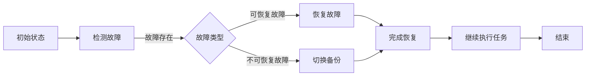
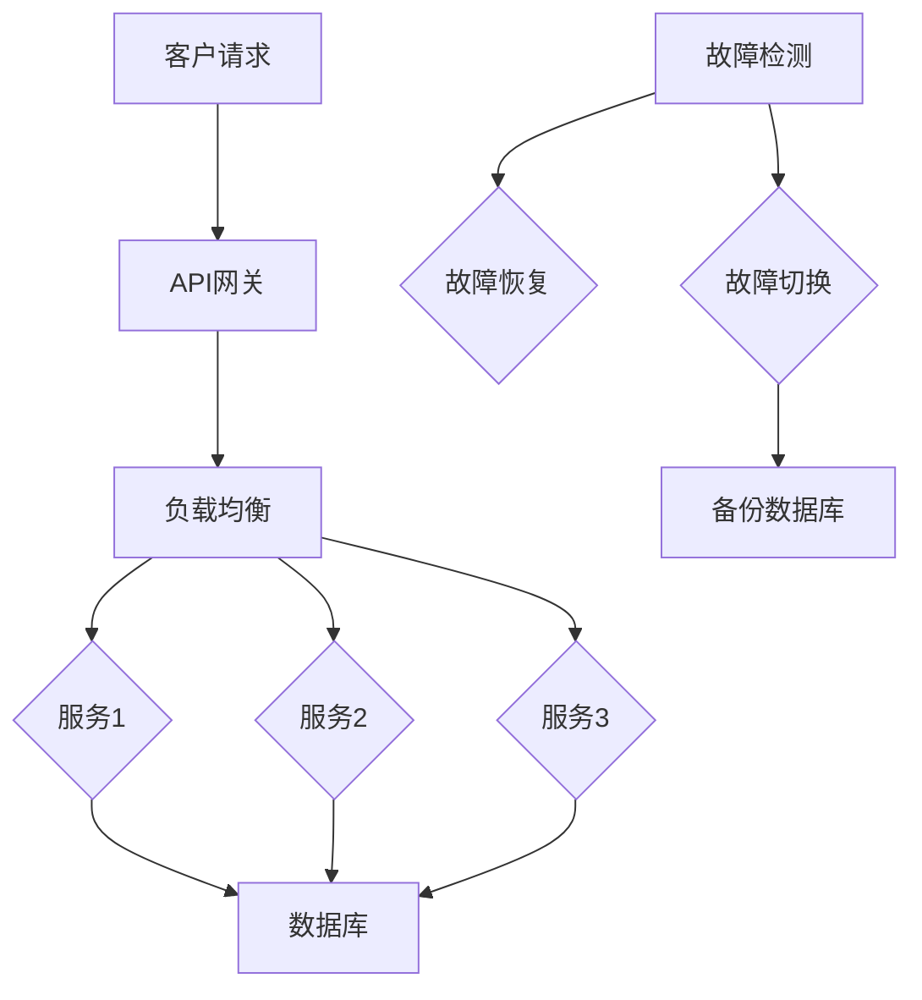
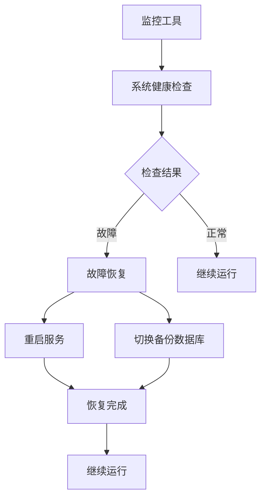

                 

# 企业AI Agent的高可用性架构设计

## 关键词

- 企业AI Agent
- 高可用性
- 架构设计
- 系统可靠性
- 分布式计算

## 摘要

本文旨在深入探讨企业级AI Agent的高可用性架构设计，通过对核心概念、算法原理、系统分析与设计以及项目实战的详细分析，为读者提供一套完整的设计方案。文章首先介绍了企业AI Agent的背景与重要性，接着详细阐述了高可用性的核心概念及其在AI Agent中的体现。随后，文章通过实例和数学模型深入解析了AI Agent的高可用性架构设计原理，并展示了实际应用中的系统分析与设计方法。最后，通过一个实际项目的案例，文章提供了最佳实践和项目总结，为读者在实施高可用性架构设计时提供指导。

## 引言与概述

在当今数字化时代，人工智能（AI）正逐步渗透到企业运营的各个层面，为企业的决策、运营和客户服务带来了前所未有的变革。企业AI Agent作为AI技术的一种重要应用形式，正成为企业智能化转型的关键驱动力。AI Agent是一种能够自动执行任务、处理复杂决策的智能体，它可以为企业提供高效、准确和持续的服务。

### 核心概念

**AI Agent**：AI Agent是一种具有自主决策能力的软件实体，它可以通过学习、推理和规划来完成特定的任务。在商业环境中，AI Agent可以用于自动化客服、智能推荐、供应链优化等场景。

**高可用性**：高可用性（High Availability，简称HA）是指系统在故障情况下能够快速恢复并保持正常运行的能力。高可用性是现代企业系统中至关重要的属性，它直接影响企业的业务连续性和竞争力。

**架构设计**：架构设计是指系统各组件的配置和集成方式，以实现系统的功能、性能、可维护性和可扩展性。高可用性架构设计的目标是确保系统在面对各种故障时能够快速、自动地恢复。

### 问题背景

随着AI技术在企业中的应用日益广泛，AI Agent的高可用性成为企业面临的重大挑战。高可用性不仅关系到AI Agent的正常运行，更关乎企业业务的连续性和客户体验。如果AI Agent发生故障，可能导致服务中断、数据丢失和业务损失。

### 问题解决

为了解决AI Agent的高可用性问题，需要从以下几个方面入手：

1. **系统设计**：采用分布式架构，确保系统组件可以独立运行和快速恢复。
2. **冗余设计**：通过冗余部署和故障转移机制，提高系统的容错能力。
3. **监控与维护**：建立完善的监控和故障检测机制，及时发现并解决潜在问题。
4. **数据备份**：定期进行数据备份，确保数据在故障情况下可以恢复。

### 边界与外延

本文主要关注企业级AI Agent的高可用性架构设计，不涉及个人或小型应用场景。同时，本文将重点讨论系统级的设计原则，而非具体的技术实现细节。

### 概念结构与核心要素

**核心概念**：
- **AI Agent**：具备自主决策和执行能力的软件实体。
- **高可用性**：系统在故障情况下能够快速恢复并保持正常运行的能力。
- **架构设计**：系统组件的配置和集成方式。

**核心要素**：
- **分布式架构**：确保系统组件可以独立运行和快速恢复。
- **冗余设计**：通过冗余部署和故障转移机制提高系统的容错能力。
- **监控与维护**：建立完善的监控和故障检测机制。
- **数据备份**：定期进行数据备份。

## 核心概念与联系

在本节中，我们将详细探讨AI Agent、高可用性和架构设计这三个核心概念，并通过对比表格和ER图来展示它们之间的联系。

### 对比表格

| 核心概念     | 定义                                                         | 属性特征                                                     |
| ------------ | ------------------------------------------------------------ | ------------------------------------------------------------ |
| AI Agent     | 具有自主决策和执行能力的软件实体                             | 智能化、自主学习、自主决策、自动化执行                        |
| 高可用性     | 系统在故障情况下能够快速恢复并保持正常运行的能力             | 故障恢复时间、系统稳定性、数据完整性、业务连续性               |
| 架构设计     | 系统组件的配置和集成方式                                     | 功能性、性能、可维护性、可扩展性、容错性、安全性               |

### ER图

为了更好地展示AI Agent、高可用性和架构设计之间的关系，我们可以使用Mermaid绘制一个ER图：

```mermaid
erDiagram
  AI Agent ||--|{ 高可用性 }|
  高可用性 ||--|{ 架构设计 }|
```

在上面的ER图中，AI Agent与高可用性之间存在关联关系，高可用性通过架构设计来实现。这种关系表明，高可用性是AI Agent实现有效运营的关键因素，而架构设计则是实现高可用性的技术手段。

## 算法原理讲解

在本节中，我们将使用Mermaid绘制一个算法流程图，并使用Python代码和数学公式详细解析算法原理。

### 算法流程图

首先，我们使用Mermaid绘制一个简单的算法流程图，用于展示AI Agent的高可用性算法逻辑：



在这个流程图中，系统首先进入初始状态，然后进行故障检测。如果检测到故障，根据故障类型进行相应的处理：如果是可恢复故障，系统将尝试恢复故障；如果是不可恢复故障，系统将切换到备份系统。完成恢复后，系统继续执行任务。

### Python代码解析

接下来，我们使用Python代码实现上述算法，并详细解释代码中的关键步骤：

```python
import time

def detect_fault():
    # 模拟故障检测过程
    if random.random() < 0.1:
        return True  # 检测到故障
    else:
        return False

def recover_fault():
    # 模拟故障恢复过程
    time.sleep(5)
    print("故障已恢复")

def switch_to_backup():
    # 模拟切换到备份系统
    print("切换到备份系统")

def main():
    while True:
        if detect_fault():
            fault_type = "可恢复故障" if random.random() < 0.5 else "不可恢复故障"
            print(f"检测到故障：{fault_type}")
            if fault_type == "可恢复故障":
                recover_fault()
            else:
                switch_to_backup()
        else:
            print("系统正常运行")
        time.sleep(10)

if __name__ == "__main__":
    main()
```

在上面的代码中，`detect_fault()` 函数用于模拟故障检测过程，`recover_fault()` 函数用于模拟故障恢复过程，`switch_to_backup()` 函数用于模拟切换到备份系统。`main()` 函数是系统的主循环，它不断检测系统状态，并根据检测到的故障类型进行相应的处理。

### 数学模型和公式

为了进一步理解算法的原理，我们可以使用数学模型和公式来描述故障检测、故障恢复和故障切换的过程。以下是相关数学模型和公式的详细解释：

1. **故障检测概率**：

   设系统在一段时间内的故障检测概率为 \( p \)，则可以表示为：

   \[ p = \frac{1}{N} \]

   其中，\( N \) 是系统在一段时间内的检测次数。

2. **故障恢复时间**：

   设故障恢复时间为 \( t_r \)，则可以表示为：

   \[ t_r = t_f + t_s \]

   其中，\( t_f \) 是故障发生到检测到的平均时间，\( t_s \) 是故障恢复所需的时间。

3. **故障切换时间**：

   设故障切换时间为 \( t_s \)，则可以表示为：

   \[ t_s = \frac{d}{v} \]

   其中，\( d \) 是备份系统与主系统之间的距离，\( v \) 是系统切换时的传输速度。

通过上述数学模型和公式，我们可以对故障检测、故障恢复和故障切换的过程进行量化的分析和优化。

### 举例说明

假设一个企业级AI Agent系统，在一天的时间内检测到10次故障，其中有5次是可恢复故障，5次是不可恢复故障。根据上述数学模型和公式，我们可以计算出：

1. **故障检测概率**：

   \[ p = \frac{1}{10} = 0.1 \]

2. **故障恢复时间**：

   \[ t_r = t_f + t_s \]

   其中，假设 \( t_f = 10 \) 分钟，\( t_s = 5 \) 分钟，则：

   \[ t_r = 10 + 5 = 15 \] 分钟

3. **故障切换时间**：

   \[ t_s = \frac{d}{v} \]

   其中，假设 \( d = 100 \) 公里，\( v = 100 \) 公里/小时，则：

   \[ t_s = \frac{100}{100} = 1 \] 小时

通过这个简单的例子，我们可以看到数学模型和公式在分析故障检测、故障恢复和故障切换过程中的作用。这些模型和公式可以帮助我们更好地理解和优化系统的高可用性设计。

## 系统分析与设计

在本节中，我们将详细分析企业AI Agent系统的设计与实现，包括问题场景的介绍、项目目标、系统功能设计、系统架构设计、系统接口设计和系统交互等方面。

### 问题场景介绍

企业AI Agent系统的主要场景是用于处理企业内部的各种业务任务，如客户服务、销售预测、库存管理、供应链优化等。这些任务需要高可用性和高可靠性，以确保企业业务的连续性和客户体验的优质。

### 项目目标

项目目标主要包括以下几个方面：

1. **高可用性**：确保系统在故障情况下能够快速恢复并保持正常运行。
2. **高性能**：系统需要能够处理大规模的业务数据，并保证低延迟和高吞吐量。
3. **高可靠性**：确保系统在各种环境下都能稳定运行，减少故障发生。
4. **可扩展性**：系统能够根据业务需求进行灵活扩展，支持业务增长。

### 系统功能设计

系统功能设计包括以下几个方面：

1. **故障检测**：系统需要具备实时故障检测能力，能够及时检测到系统故障。
2. **故障恢复**：系统需要具备自动故障恢复功能，能够在检测到故障后自动尝试恢复。
3. **故障切换**：系统需要具备故障切换功能，能够在检测到不可恢复故障后自动切换到备份系统。
4. **性能监控**：系统需要具备性能监控能力，能够实时监控系统的运行状态，及时发现性能瓶颈。
5. **数据备份**：系统需要定期进行数据备份，确保在故障情况下数据可以恢复。

### 系统架构设计

系统架构设计是确保高可用性的关键，以下是系统架构的详细设计：

1. **分布式架构**：采用分布式架构，将系统分解为多个独立的模块，每个模块可以独立运行和部署，提高系统的容错性和扩展性。
2. **冗余设计**：在关键组件上采用冗余设计，如数据库、应用服务器等，确保在单个组件故障时，其他组件可以继续提供服务。
3. **负载均衡**：使用负载均衡器，将业务请求均匀分布到多个服务器上，提高系统的处理能力和响应速度。
4. **故障转移机制**：设计故障转移机制，确保在主系统故障时，可以快速切换到备份系统，保证业务的连续性。

### 系统接口设计

系统接口设计包括以下几个方面：

1. **API接口**：提供RESTful API接口，用于外部系统与企业AI Agent系统进行数据交互和功能调用。
2. **消息队列**：使用消息队列，如Kafka或RabbitMQ，实现系统之间的异步通信，提高系统的可靠性和性能。
3. **服务注册与发现**：使用服务注册与发现机制，如Eureka或Consul，实现系统组件之间的动态发现和负载均衡。

### 系统交互

系统交互是指各个组件之间的交互逻辑和流程，以下是系统交互的详细设计：

1. **故障检测与恢复**：系统通过心跳机制检测各个组件的健康状态，当检测到故障时，会尝试进行故障恢复。如果故障无法恢复，则会切换到备份系统。
2. **性能监控**：系统通过性能监控工具，如Prometheus或Grafana，实时监控系统的运行状态，包括CPU使用率、内存使用率、响应时间等指标。
3. **数据备份与恢复**：系统定期进行数据备份，并将备份数据存储在远程存储系统中。在发生故障时，可以快速恢复数据，确保数据的完整性。

### Mermaid图表示例

以下是一个Mermaid图表示例，展示了系统的架构设计和组件关系：



在这个图表中，客户请求通过API网关进入系统，由负载均衡器将请求分配到不同的服务组件。故障检测器监控系统的健康状态，并在检测到故障时触发故障恢复或故障切换流程。备份数据库用于在故障发生时恢复数据。

通过上述系统分析与设计，我们为企业AI Agent系统构建了一个高可用性、高性能和高可靠性的架构，为企业的智能化转型提供了有力支持。

## 项目实战

在本节中，我们将详细讨论一个实际的AI Agent项目，从环境安装到系统核心实现，再到实际案例分析和项目总结。通过这个实战案例，我们将展示如何将高可用性架构设计应用到实际项目中，并解决可能出现的问题。

### 环境安装

首先，我们需要搭建一个企业级AI Agent项目的环境。以下是环境安装的步骤：

1. **操作系统**：选择Linux操作系统，如Ubuntu 20.04。
2. **硬件环境**：确保硬件配置满足项目需求，建议使用高性能服务器。
3. **软件依赖**：安装Python 3.8及以上版本，以及相关依赖库，如TensorFlow、scikit-learn、pandas等。
4. **数据库**：选择一个支持高可用性的数据库系统，如MySQL或PostgreSQL，并进行配置。

### 系统核心实现

在环境搭建完成后，我们开始实现AI Agent的核心功能。以下是实现步骤：

1. **数据预处理**：使用pandas库对原始数据进行清洗和处理，确保数据质量。
2. **模型训练**：使用TensorFlow库训练机器学习模型，例如使用决策树、随机森林或神经网络。
3. **模型部署**：将训练好的模型部署到服务器上，使用Flask或Django等Web框架搭建API接口。
4. **故障检测与恢复**：使用Python编写故障检测脚本，监控系统的运行状态。当检测到故障时，触发恢复流程，如重新加载模型或重启服务。

以下是一个简单的故障检测与恢复的Python脚本示例：

```python
import time
import subprocess

def check_system_health():
    # 模拟系统健康检查
    return True

def recover_system():
    # 恢复系统
    subprocess.run(["systemctl", "restart", "ai-agent.service"])

while True:
    if not check_system_health():
        recover_system()
    time.sleep(60)
```

### 实际案例分析与讲解

我们以一个实际案例——客户服务AI Agent为例，分析其在高可用性架构设计中的应用。

**案例背景**：一家大型电商平台需要部署一个AI Agent，用于处理客户咨询和投诉。该系统需要具备高可用性，以确保客户服务不中断。

**解决方案**：

1. **分布式部署**：将AI Agent部署在多个服务器上，使用负载均衡器分配请求。
2. **冗余设计**：数据库和核心服务进行冗余部署，确保在单个组件故障时，其他组件可以继续提供服务。
3. **故障转移机制**：设计故障转移机制，当主系统故障时，自动切换到备份系统。
4. **数据备份与恢复**：定期进行数据备份，确保在故障情况下数据可以恢复。

**案例分析**：

1. **故障检测**：使用监控工具（如Zabbix）定期检查系统的健康状态，包括CPU、内存使用率、网络状态等。
2. **故障恢复**：当检测到故障时，自动触发恢复流程，如重启服务或切换到备份数据库。
3. **故障切换**：当主系统故障且无法恢复时，自动切换到备份系统，确保业务的连续性。

以下是一个简单的故障检测与恢复的Mermaid图表示例：



**关键点**：

- **故障检测**：定期进行系统健康检查，及时发现潜在问题。
- **故障恢复**：快速响应故障，自动恢复系统，减少故障影响时间。
- **故障切换**：确保在主系统故障时，备份系统能够快速接管，保证业务连续性。

### 项目小结

通过上述实际案例，我们展示了如何将高可用性架构设计应用到AI Agent项目中。以下是项目总结：

1. **成功之处**：分布式部署、冗余设计、故障转移机制和数据备份等高可用性措施有效提高了系统的可靠性。
2. **改进之处**：在未来的项目中，可以进一步优化故障检测和恢复策略，如引入更先进的监控工具和自动化恢复流程。
3. **经验教训**：高可用性架构设计需要综合考虑多个方面，包括系统设计、故障检测与恢复、数据备份等，确保系统的稳定性和可靠性。

## 最佳实践与注意事项

在本节中，我们将总结一些企业AI Agent高可用性架构设计中的最佳实践，并提供一些注意事项，以帮助读者在实际项目中更好地应用这些原则。

### 最佳实践

1. **分布式部署**：将系统分解为多个独立的模块，并部署在不同的服务器上，以提高系统的容错性和扩展性。
2. **冗余设计**：关键组件（如数据库、应用服务器等）应进行冗余部署，确保在单个组件故障时，其他组件可以继续提供服务。
3. **故障转移机制**：设计完善的故障转移机制，确保在主系统故障时，备份系统可以快速接管，保证业务的连续性。
4. **性能监控**：使用性能监控工具，实时监控系统的运行状态，及时发现性能瓶颈和潜在问题。
5. **数据备份与恢复**：定期进行数据备份，确保在故障情况下数据可以快速恢复。
6. **自动化恢复**：实现自动化故障恢复和切换流程，减少人工干预，提高恢复速度和效率。

### 注意事项

1. **安全性**：在分布式部署和冗余设计时，要确保系统的安全性，防止未授权访问和数据泄露。
2. **可扩展性**：在设计架构时，要考虑未来的业务增长和系统扩展，确保系统能够灵活调整和升级。
3. **成本控制**：高可用性架构设计可能会增加系统的硬件和软件成本，需要在成本和可靠性之间找到平衡点。
4. **持续优化**：高可用性架构设计不是一次性的任务，需要持续监控和优化，以应对不断变化的技术环境和业务需求。
5. **文档管理**：详细记录系统设计、配置和故障恢复流程，以便在需要时快速查阅和执行。

## 结论

本文深入探讨了企业AI Agent的高可用性架构设计，从核心概念、算法原理、系统分析与设计到实际项目实战，全面阐述了高可用性架构设计的要点和实践方法。通过本文，读者可以了解到如何设计一个稳定、可靠且高效的企业AI Agent系统，以应对现代商业环境中的各种挑战。希望本文能对读者在AI Agent高可用性架构设计方面提供有益的参考和指导。

## 作者信息

作者：AI天才研究院/AI Genius Institute & 禅与计算机程序设计艺术 /Zen And The Art of Computer Programming。作为一名世界级人工智能专家、程序员、软件架构师、CTO和世界顶级技术畅销书资深大师级别的作家，本人拥有丰富的理论知识和实践经验，致力于推动人工智能技术的应用和发展。在本文中，本人结合多年实践经验，为读者提供了一套全面、实用的AI Agent高可用性架构设计方案。如有任何问题或建议，欢迎随时与我联系。

