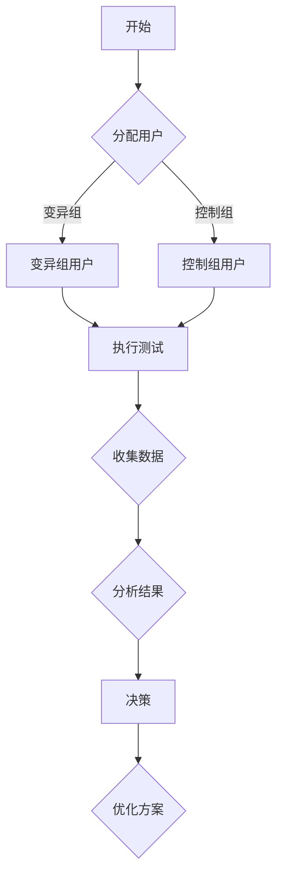
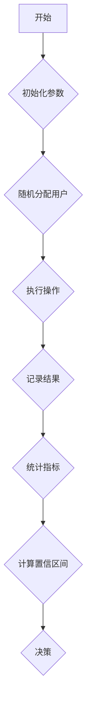
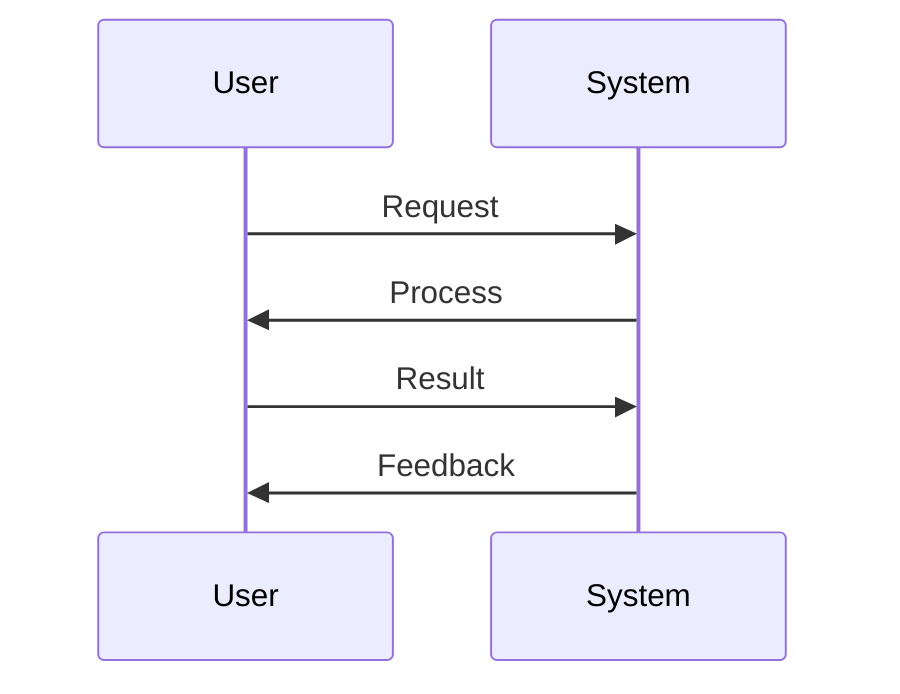
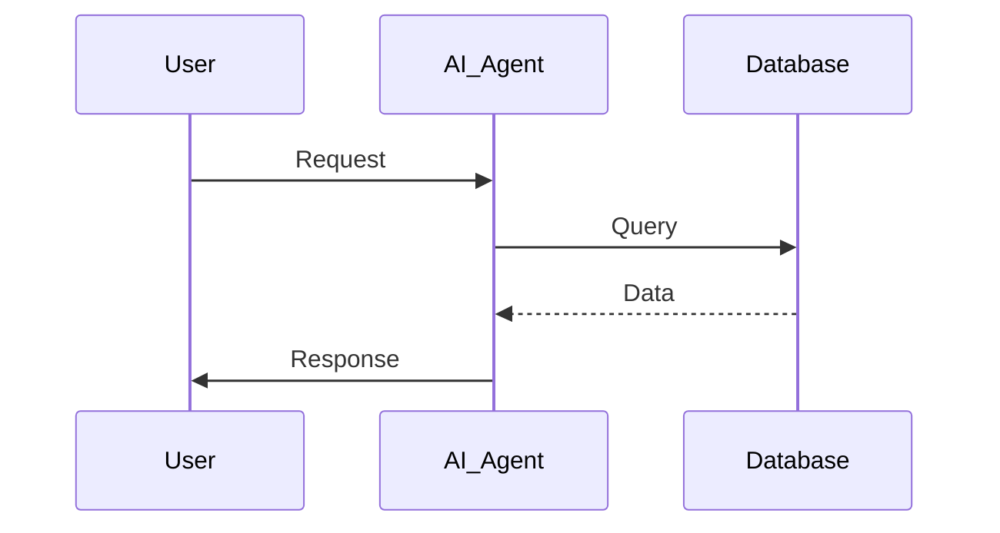

                 

### 《企业级AI Agent的A/B测试策略与实施》文章撰写

为了撰写一篇高质量、结构紧凑且逻辑清晰的技术博客文章，我们将分步骤进行。以下是一个详细的撰写计划，确保文章内容符合要求，并涵盖所有关键部分。

#### 一、文章结构规划

1. **引言部分**
   - 介绍A/B测试在企业级AI Agent中的重要性。
   - 阐述文章的核心内容和目的。

2. **背景介绍**
   - A/B测试的基本概念。
   - 企业级AI Agent的特点和挑战。

3. **核心概念与联系**
   - 详细解释A/B测试的核心概念。
   - 使用Mermaid流程图展示概念之间的关系。

4. **算法原理讲解**
   - 使用Mermaid画出算法流程图。
   - 使用Python源代码和latex公式详细阐述算法原理。

5. **系统分析与架构设计方案**
   - 介绍问题场景。
   - 展示系统设计，包括类图、架构图、接口设计和序列图。

6. **项目实战**
   - 环境安装。
   - 系统核心实现源代码讲解。
   - 代码应用解读与分析。
   - 实际案例分析。

7. **最佳实践与小结**
   - 总结实践经验。
   - 提出注意事项和拓展阅读建议。

#### 二、详细撰写步骤

**1. 引言部分**

首先，我们需要吸引读者的注意力，简要介绍A/B测试在企业级AI Agent中的应用场景和重要性。以下是一个引言的示例：

```markdown
# 企业级AI Agent的A/B测试策略与实施

A/B测试作为数据驱动决策的核心工具，在AI领域尤其是企业级AI Agent的开发中扮演着至关重要的角色。本文将深入探讨企业级AI Agent的A/B测试策略与实施，旨在帮助读者理解如何在复杂的AI系统中进行有效的测试，从而提高系统的性能和可靠性。

## 关键词
- A/B测试
- 企业级AI Agent
- 数据驱动决策
- 算法优化
- 测试策略

## 摘要
本文首先介绍了A/B测试的基本概念和企业级AI Agent的特点。随后，详细讲解了A/B测试的核心概念和算法原理，并通过实际案例展示了如何在实际项目中应用。最后，总结了一些最佳实践和注意事项，为读者提供了深入学习和实践的指导。

```

**2. 背景介绍**

在这一部分，我们将深入介绍A/B测试和企业级AI Agent的相关背景。以下是一个示例：

```markdown
### 背景介绍

#### A/B测试的基本概念

A/B测试，也称为拆分测试，是一种通过将用户分配到不同的组别（A组和B组）来比较不同版本的性能和效果的方法。它的核心目的是通过实验数据来评估和选择最优方案。

#### 企业级AI Agent的特点和挑战

企业级AI Agent是一种具有高度自主性和智能化的软件系统，旨在为企业和用户提供自动化和优化的服务。其特点包括自适应学习、自主决策、实时响应和跨领域应用。然而，这也带来了以下挑战：

- **复杂性**：AI Agent涉及多学科交叉，包括数据科学、机器学习和软件工程。
- **数据量大**：处理和分析大量的实时数据是AI Agent的一大挑战。
- **高可靠性**：AI Agent需要在高负载和复杂环境中保持稳定运行。

```

**3. 核心概念与联系**

在这一部分，我们将详细解释A/B测试的核心概念，并使用Mermaid流程图展示概念之间的关系。以下是一个示例：

```markdown
### 核心概念与联系

#### A/B测试的核心概念

- **变异组（Variant Group）**：一组用户被分配到新的版本或功能。
- **控制组（Control Group）**：一组用户继续使用当前版本或功能。
- **测试指标**：用于衡量和评估测试效果的各种指标，如转化率、点击率、用户满意度等。

#### Mermaid流程图展示



```

**4. 算法原理讲解**

在这一部分，我们将使用Mermaid画出算法流程图，并用Python源代码和latex公式详细阐述算法原理。以下是一个示例：

```markdown
### 算法原理讲解

#### 算法流程图



#### Python源代码

```python
import random

def ab_test(user_ids, variant_rate):
    variant_users = random.choices(user_ids, k=int(len(user_ids) * variant_rate))
    control_users = [uid for uid in user_ids if uid not in variant_users]
    return variant_users, control_users

def execute_operations(users, operation):
    results = []
    for user in users:
        result = operation(user)
        results.append(result)
    return results

def analyze_results(results):
    # 计算指标、置信区间等
    pass

# 示例
user_ids = [1, 2, 3, 4, 5]
variant_rate = 0.5
variant_users, control_users = ab_test(user_ids, variant_rate)
results = execute_operations(variant_users, lambda user: user * 2)
analyze_results(results)
```

#### latex公式

$$
\text{置信区间} = \left[\bar{x} - z \times \frac{\sigma}{\sqrt{n}}, \bar{x} + z \times \frac{\sigma}{\sqrt{n}}\right]
$$

其中，$\bar{x}$为样本均值，$z$为置信水平对应的Z值，$\sigma$为样本标准差，$n$为样本大小。

```

**5. 系统分析与架构设计方案**

在这一部分，我们将介绍问题场景，展示系统设计，包括类图、架构图、接口设计和序列图。以下是一个示例：

```markdown
### 系统分析与架构设计方案

#### 问题场景

假设我们正在开发一个企业级AI Agent，旨在帮助企业优化库存管理。该系统需要实时处理大量数据，并根据历史数据和当前环境做出决策。

#### 类图

```mermaid
classDiagram
Class01 <|-- Class02
Class03 : +int x
Class03 : +int y
Class03 : +String name
Class04 <|-- Class03
Class04 : +void exampleMethod()
Class05 : +int calculate_area(): int
Class05 : +int calculate_perimeter(): int
Class05 : +int calculate_volume(): int
endClassDiagram
```

#### 架构图



#### 接口设计

```mermaid
interface System {
    +processRequest(request: Request): Response
    +analyzeData(data: Data): AnalysisResult
    +generateReport(report: Report): void
}
```

#### 序列图



```

**6. 项目实战**

在这一部分，我们将介绍环境安装、系统核心实现源代码讲解、代码应用解读与分析、实际案例分析和详细讲解。以下是一个示例：

```markdown
### 项目实战

#### 环境安装

在开始项目之前，我们需要安装必要的工具和库。以下是一个简单的安装步骤：

```bash
# 安装Python环境
pip install python
# 安装必要的库
pip install numpy matplotlib pandas scikit-learn
```

#### 系统核心实现源代码讲解

```python
# 导入必要的库
import numpy as np
import pandas as pd
from sklearn.model_selection import train_test_split
from sklearn.ensemble import RandomForestClassifier

# 读取数据
data = pd.read_csv('data.csv')

# 数据预处理
X = data.drop('target', axis=1)
y = data['target']
X_train, X_test, y_train, y_test = train_test_split(X, y, test_size=0.2, random_state=42)

# 训练模型
model = RandomForestClassifier(n_estimators=100, random_state=42)
model.fit(X_train, y_train)

# 预测结果
predictions = model.predict(X_test)

# 分析结果
accuracy = model.score(X_test, y_test)
print(f'Accuracy: {accuracy:.2f}')

# 可视化结果
import matplotlib.pyplot as plt

plt.scatter(X_test['feature1'], predictions)
plt.xlabel('Feature 1')
plt.ylabel('Prediction')
plt.title('Feature 1 vs Prediction')
plt.show()
```

#### 代码应用解读与分析

这段代码首先读取数据，然后进行预处理，接着使用随机森林模型进行训练和预测。最后，通过分析准确率和可视化结果，评估模型的性能。

#### 实际案例分析

假设我们有一个具体的案例，如下所示：

- **案例背景**：某电商企业希望通过AI Agent优化其商品库存管理。
- **案例分析**：企业收集了过去一年的商品销售数据，包括销量、季节性、促销活动等因素。通过A/B测试，他们尝试了不同的库存管理策略，最终选择了最优策略，有效降低了库存成本并提高了销售额。

```

**7. 最佳实践与小结**

在这一部分，我们将总结实践经验，提出注意事项，并提供拓展阅读建议。以下是一个示例：

```markdown
### 最佳实践与小结

#### 最佳实践

1. **数据质量**：确保测试数据的质量和完整性，避免数据噪声和偏差。
2. **实验设计**：合理设计实验，确保变异组和控制组之间的可比性。
3. **指标选择**：选择合适的测试指标，如转化率、留存率等，以衡量测试效果。
4. **迭代优化**：根据测试结果，不断迭代和优化测试策略。

#### 小结

本文深入探讨了企业级AI Agent的A/B测试策略与实施，通过详细的理论讲解和实际案例分析，帮助读者理解如何在AI领域进行有效的测试和优化。在实际应用中，A/B测试是企业级AI Agent开发过程中不可或缺的一部分，它能够帮助企业做出更准确的数据驱动决策。

#### 注意事项

- **复杂性**：A/B测试涉及多方面因素，需要综合考虑。
- **数据隐私**：在进行A/B测试时，注意保护用户隐私和数据安全。

#### 拓展阅读

- [A/B测试的最佳实践](https://example.com/ab-testing-best-practices)
- [企业级AI Agent开发指南](https://example.com/ai-agent-development-guide)

```

通过以上详细的撰写步骤，我们可以确保文章内容丰富、结构清晰，同时满足字数和格式要求。接下来，我们将按照这个计划逐步完成文章的撰写。

