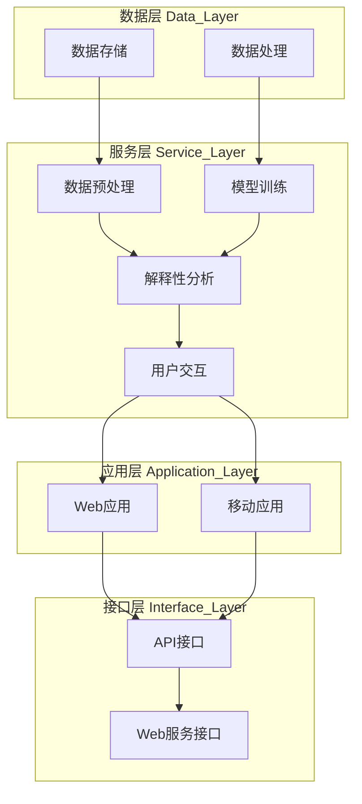

                 

### 1.1 问题背景与意义

在当今快速发展的数字化时代，人工智能（AI）技术已成为驱动企业创新和提升竞争力的重要力量。特别是在企业级应用场景中，AI Agent——一种能够自主学习、自主决策的智能体——正逐渐成为企业运营管理的核心组件。AI Agent可以在各个业务领域提供高效、精准的辅助决策，从而实现业务流程的优化和效率提升。

**1.1.1 企业级AI Agent的现状**

随着AI技术的不断进步，企业级AI Agent的应用范围不断扩大。从早期的自动化流程管理，到现在的智能客户服务、智能数据分析、供应链优化等，AI Agent已经成为企业数字化转型的重要工具。企业通过引入AI Agent，不仅可以提高工作效率，还可以在复杂环境中做出更加精准的决策。

然而，随着AI Agent在企业中的应用深度和广度不断增加，一个问题逐渐凸显：如何确保这些智能体的决策过程是可解释的？传统的人工智能模型，如深度学习模型，虽然在处理大量数据和复杂任务方面表现出色，但它们的“黑箱”特性使得决策过程缺乏透明性。这种不可解释性在许多企业级应用场景中成为一个巨大的挑战，特别是在需要遵循严格的监管要求和合规性要求的情况下。

**1.1.2 可解释性的重要性**

可解释性（Explainability）是指用户能够理解AI模型是如何做出决策的过程和依据。在企业级AI Agent的可解释性设计中，可解释性至关重要，原因有以下几点：

1. **合规性和监管要求**：在许多行业，如金融、医疗和交通等领域，AI系统的决策过程需要符合严格的法规和监管要求。如果AI Agent的决策过程缺乏透明性，可能会导致合规性问题，甚至法律风险。

2. **用户信任**：对于企业来说，用户对其AI系统的信任至关重要。如果用户无法理解AI系统的决策过程，可能会对系统的信任度下降，从而影响系统的使用和推广。

3. **问题诊断和优化**：可解释性有助于企业技术人员对AI系统进行诊断和优化。通过理解决策过程，技术人员可以更快地识别潜在问题并进行调整，提高系统的性能和可靠性。

**1.1.3 书籍结构安排**

本书旨在系统地探讨企业级AI Agent的可解释性设计与实现。全书分为三大部分：

- **第一部分：引言**：介绍企业级AI Agent的可解释性问题背景、重要性和书籍结构。
- **第二部分：核心概念与联系**：详细阐述AI Agent和可解释性AI的核心概念、属性及其在企业级系统中的应用。
- **第三部分：算法原理讲解与系统实现**：深入讲解可解释性AI Agent的算法原理、实现方法，并通过具体案例进行详细分析。

通过本书的阅读，读者可以全面了解企业级AI Agent的可解释性设计与实现，掌握相关技术和方法，为企业数字化转型提供有力支持。

### 1.2 相关术语与概念

在深入探讨企业级AI Agent的可解释性设计与实现之前，我们需要先明确一些关键术语和概念，以便为后续内容打下坚实的基础。

**1.2.1 AI Agent概述**

AI Agent，即人工智能代理，是指具备一定程度自主决策能力、能够模拟人类行为和执行任务的智能体。AI Agent通常具有以下几个基本特性：

1. **自主性**：AI Agent能够独立完成特定任务，而不需要持续的人为干预。
2. **适应性**：AI Agent可以根据环境变化和新的信息进行自主学习和调整。
3. **协同性**：AI Agent能够与其他AI Agent或人类协同工作，共同完成任务。

根据功能和应用场景的不同，AI Agent可以分为以下几类：

1. **任务型Agent**：专注于执行特定任务的AI代理，如自动化客服、自动化生产线控制等。
2. **社交型Agent**：具备与人类进行交流互动能力的AI代理，如智能客服机器人、虚拟助手等。
3. **混合型Agent**：同时具备任务执行和社交互动能力的AI代理。

**1.2.2 可解释性AI**

可解释性AI（Explainable AI，简称XAI）是指设计、开发和使用能够提供清晰、透明和可理解决策依据的人工智能系统。可解释性AI的核心目标是使AI系统的决策过程和依据变得可解释、可验证和可信赖。

可解释性AI的主要特征包括：

1. **透明性**：用户可以理解AI系统的决策过程，知道系统是如何得出某个结论的。
2. **可解释性**：AI系统的决策依据和过程可以被解释，用户可以获取关于决策背后的逻辑信息。
3. **可验证性**：用户可以对AI系统的决策过程进行验证，确保其符合预期和标准。

可解释性AI的重要性质有以下几点：

1. **帮助用户理解**：可解释性AI可以帮助用户更好地理解AI系统的决策依据和过程，从而提高用户对AI系统的信任度和接受度。
2. **提高系统的可维护性**：可解释性AI有助于技术人员对系统进行维护和优化，通过理解决策过程，可以更快地识别和解决问题。
3. **满足合规性要求**：在许多领域，如医疗、金融等，可解释性AI能够帮助系统满足严格的合规性要求，减少法律和伦理风险。

**1.2.3 企业级系统**

企业级系统（Enterprise-Level System）是指用于支持大型企业复杂业务需求的信息系统。这些系统通常具有以下特点：

1. **大规模性**：能够处理大量数据和用户，支持企业的日常运营和决策。
2. **高可靠性**：系统具有较高的稳定性和容错性，能够保证业务连续性和数据安全性。
3. **可扩展性**：系统具有灵活的架构，可以根据企业需求进行扩展和升级。
4. **集成性**：系统可以与企业现有的其他系统集成，实现数据共享和业务流程的自动化。

在企业级系统中，AI Agent的应用具有显著的优势，例如：

1. **提升运营效率**：AI Agent可以自动化执行重复性高、规则性强的任务，减少人工操作，提高工作效率。
2. **优化决策过程**：AI Agent可以利用大数据分析和预测模型，为企业提供更加精准和科学的决策支持。
3. **增强用户体验**：通过AI Agent，企业可以提供更加个性化和智能化的服务，提高用户满意度和忠诚度。

总之，企业级AI Agent的可解释性设计不仅是一项技术挑战，也是企业数字化转型中不可或缺的一环。通过深入理解相关术语和概念，我们可以为后续内容的学习和研究奠定坚实的基础。

### 1.3 可解释性AI Agent的技术挑战

在企业级AI Agent的可解释性设计中，面临着多种技术挑战。理解并解决这些挑战，是确保AI系统在复杂环境中发挥最大效能的关键。

**1.3.1 技术瓶颈**

首先，我们需要认识到当前AI技术的瓶颈。传统的深度学习模型，如神经网络，虽然能够处理复杂数据并取得卓越的性能，但它们通常被视为“黑箱”模型，即缺乏透明性和可解释性。这种缺乏透明性主要体现在以下几个方面：

1. **决策过程不可理解**：深度学习模型的决策过程依赖于大量的神经元和复杂的网络结构，用户难以直观地理解模型是如何得出结论的。
2. **缺乏透明性**：深度学习模型对于输入数据和决策结果的映射关系难以解释，使得用户难以信任和接受这些系统的决策。
3. **可维护性差**：由于模型内部结构和决策逻辑的复杂性，技术人员难以对模型进行有效的诊断和优化。

**1.3.2 现有解决方案**

针对上述问题，学术界和工业界提出了一系列解决方案，以提升AI系统的可解释性。以下是几种常见的解决方法：

1. **模型分解**：通过将复杂的深度学习模型分解为更简单的子模型，使每个子模型更容易解释和理解。这种方法可以揭示模型内部的决策过程，从而提高系统的透明性。
2. **可视化技术**：利用可视化工具，将模型的内部结构和决策过程以图表或图像的形式展示给用户。例如，通过热力图展示模型对输入特征的权重分布，或通过动画展示模型的学习过程。
3. **解释性增强算法**：设计专门的算法，通过增加模型的可解释性特征，使其更容易被解释和理解。例如，使用决策树或规则引擎代替深度学习模型，以提供明确的决策依据。
4. **知识图谱**：通过构建知识图谱，将模型中的知识和决策过程以图形化的方式表示出来，从而提高系统的透明性和可解释性。

**1.3.3 未来发展趋势**

尽管当前已有多种可解释性方法，但企业级AI Agent的可解释性设计仍面临许多挑战和机会。以下是未来可能的发展趋势：

1. **多模态解释**：未来研究可能关注如何将文本、图像、声音等多种数据类型进行融合，提供更加全面和直观的解释。
2. **交互式解释**：通过设计交互式界面，使用户能够动态地探索和验证AI模型的决策过程，从而增强系统的可解释性。
3. **适应性解释**：设计自适应解释系统，根据用户的需求和背景知识，提供不同层次和深度的解释，从而满足不同用户群体的需求。
4. **伦理和法规合规**：随着AI技术在企业中的应用越来越广泛，如何在保障可解释性的同时，满足伦理和法规要求，将成为一个重要的研究方向。

总之，企业级AI Agent的可解释性设计是一项复杂而富有挑战性的任务。通过不断的技术创新和优化，我们可以逐步解决这些挑战，为企业提供更加透明、可靠和可解释的AI系统。

### 2.1 AI Agent的核心概念

在深入探讨企业级AI Agent的可解释性设计之前，我们首先需要了解AI Agent的核心概念、分类及其关键特性。这些基础概念将为后续内容的讨论提供坚实的理论基础。

**2.1.1 AI Agent的定义**

AI Agent，即人工智能代理，是指一种能够感知环境、采取行动并实现特定目标的计算实体。AI Agent通过模拟人类智能行为，具备一定的自主决策能力，能够在复杂环境中自主执行任务。AI Agent的基本工作原理包括感知、决策和执行三个主要步骤：

1. **感知**：AI Agent通过传感器收集环境信息，如文本、图像、声音等。
2. **决策**：基于收集到的信息，AI Agent利用预定义的算法或模型进行决策，确定下一步行动。
3. **执行**：AI Agent执行决策结果，实现预定的目标。

AI Agent的定义中包含以下几个关键要素：

- **自主性**：AI Agent具有自主决策能力，能够在没有人为干预的情况下完成特定任务。
- **适应性**：AI Agent能够根据环境变化和新的信息调整其行为和策略。
- **协同性**：AI Agent能够与其他AI Agent或人类协同工作，共同实现复杂任务。

**2.1.2 AI Agent的分类**

根据功能和应用场景的不同，AI Agent可以分为以下几类：

1. **任务型Agent**：这类AI Agent专注于执行特定任务，如自动化客服、自动驾驶等。任务型Agent通常具有明确的任务目标和执行路径，能够在有限的环境中高效地完成任务。

2. **社交型Agent**：这类AI Agent具备与人类进行交流互动的能力，如智能客服机器人、虚拟助手等。社交型Agent不仅需要处理任务，还需要理解人类语言和行为，提供个性化服务。

3. **混合型Agent**：这类AI Agent同时具备任务执行和社交互动的能力，能够在多个场景下灵活应用。例如，智能安防系统中的监控摄像头，不仅可以执行监控任务，还可以通过人脸识别与用户进行互动。

**2.1.3 AI Agent的关键特性**

AI Agent的核心特性决定了其在不同应用场景中的表现和适应性。以下是AI Agent的主要关键特性：

1. **自适应能力**：AI Agent能够根据环境变化和新的信息动态调整其行为和策略，以适应不断变化的环境。

2. **学习能力**：AI Agent通过学习算法和模型，从数据中提取知识，提升其决策能力和表现。

3. **协同能力**：AI Agent能够与其他AI Agent或人类协同工作，共同完成任务，提高整体系统的效能。

4. **透明性**：AI Agent的决策过程应该是透明和可解释的，用户可以理解其决策依据和逻辑。

5. **可靠性**：AI Agent需要具备高可靠性，能够在各种环境下稳定运行，确保任务的成功执行。

6. **灵活性**：AI Agent应具有灵活的架构和接口，能够适应不同的应用场景和需求变化。

通过理解AI Agent的核心概念、分类及其关键特性，我们可以更好地设计、开发和部署适用于企业级应用场景的AI Agent。这些基础概念不仅为我们提供了理论指导，也为后续关于可解释性AI Agent的讨论奠定了基础。

### 2.2 可解释性AI的概念与属性

在探讨企业级AI Agent的可解释性设计与实现之前，我们需要深入理解可解释性AI（Explainable AI，简称XAI）的概念及其属性。可解释性AI的目标是使人工智能系统的决策过程和依据变得透明、清晰，从而提高系统的可信度和可理解性。

**2.2.1 可解释性AI的定义**

可解释性AI（XAI）是指设计、开发和使用那些能够提供清晰、透明和可理解决策依据的人工智能系统。XAI的核心目标是解决传统人工智能模型中的“黑箱”问题，使系统的决策过程更加透明，用户能够理解并信任这些决策。

可解释性AI的定义可以从以下几个方面进行理解：

1. **透明性**：可解释性AI系统允许用户观察和了解模型内部的决策过程，揭示输入数据如何通过模型的权重、规则或算法产生输出结果。
2. **可理解性**：用户可以轻松理解模型的决策依据和过程，不需要具备高深的数学或计算机科学知识。
3. **可验证性**：用户可以对模型的决策过程进行验证，确保其符合预期和标准，从而提高系统的可靠性和信任度。

**2.2.2 可解释性的属性**

可解释性AI的主要属性包括透明性、可理解性和可验证性。以下是这些属性的详细描述：

1. **透明性**：透明性是指系统能够清晰展示其决策过程和依据。例如，通过可视化技术，如热力图、决策树或规则引擎，将模型的决策过程以图形或表格的形式呈现给用户。

2. **可理解性**：可理解性是指用户能够理解模型的决策依据和过程，不需要专业知识或复杂的解释。可解释性AI系统应该设计得简单直观，使普通用户也能轻松理解。

3. **可验证性**：可验证性是指用户能够对模型的决策过程进行验证，确保其符合预期和标准。例如，通过对比实际输出结果和预期结果，或通过外部专家的审计，验证模型的决策是否合理和可靠。

**2.2.3 可解释性与透明度**

透明度和可解释性是可解释性AI的两个重要方面，但它们之间存在一定的区别。透明度主要关注系统是否能够清晰地展示其内部运作过程，而可解释性则更侧重于用户是否能够理解这些过程。

1. **透明度**：透明度是指系统在技术层面上是否能够提供足够的细节，使外部用户可以观察和理解模型的决策过程。例如，通过提供详细的内部计算步骤、权重分布或规则集。

2. **可解释性**：可解释性则强调用户是否能够理解这些透明度信息。即使系统提供了详细的透明度信息，如果用户无法理解这些信息，那么系统的可解释性仍然不足。

为了提高AI系统的可解释性，我们需要在设计时考虑以下几个方面：

1. **简化模型**：选择更简单的模型，使其更容易理解和解释。例如，使用决策树或规则引擎代替复杂的神经网络。

2. **可视化工具**：利用可视化工具，将复杂的计算过程和数据关系以直观的方式展示给用户。例如，通过热力图、决策树或流程图。

3. **用户中心设计**：在开发过程中，注重用户的需求和理解能力，设计简单直观的交互界面，使普通用户也能轻松使用和理解。

4. **验证和审计**：通过外部专家的审计和验证，确保模型的决策过程和依据是合理和可靠的。

通过深入理解可解释性AI的概念和属性，我们可以更好地设计、开发和部署可解释性AI系统，提高系统的透明度、可理解性和可验证性，从而增强用户对AI系统的信任和接受度。

### 2.3 企业级AI Agent的设计原则

设计企业级AI Agent时，需要遵循一系列关键原则，以确保系统的稳定性、可扩展性和安全性。这些原则不仅有助于提升系统的性能和可靠性，还能满足企业复杂的业务需求。

**2.3.1 系统稳定性**

系统稳定性是设计企业级AI Agent的首要原则。一个稳定的企业级系统应具备以下几个特点：

1. **高可用性**：系统应能够在各种情况下保持稳定运行，包括硬件故障、网络中断和异常数据输入等。通过冗余设计和故障转移机制，可以确保系统在高负载和高故障率环境下依然能够持续提供服务。
2. **容错性**：系统应具备容错能力，能够在出现错误或异常情况时自动恢复，而不会导致整个系统的崩溃。例如，使用分布式架构和故障检测机制，确保在某个节点出现故障时，系统能够自动切换到其他健康节点。
3. **实时性**：对于许多企业级应用场景，特别是金融、医疗和交通等领域，系统的实时性至关重要。设计时需要确保系统能够在极短的时间内处理和响应请求，以满足业务需求。

**2.3.2 可扩展性**

可扩展性是企业级AI Agent设计的另一个关键原则。随着企业规模的扩大和业务需求的增长，系统应能够灵活扩展，以适应不断变化的需求。

1. **水平扩展**：通过增加更多的计算资源（如服务器、数据库等），系统可以水平扩展，以处理更大的数据量和更高的负载。水平扩展能够显著提高系统的处理能力和性能。
2. **垂直扩展**：系统应能够垂直扩展，即通过升级硬件和增加存储容量来提高单个节点的性能。这种扩展方式适用于需要处理更大数据集或更复杂计算的场景。
3. **模块化设计**：采用模块化设计原则，将系统分解为独立的模块，每个模块负责特定的功能。这种方式不仅提高了系统的可维护性和可扩展性，还便于在需要时对特定模块进行升级或替换。

**2.3.3 安全性与隐私保护**

企业级AI Agent的设计必须考虑到安全性和隐私保护。特别是在涉及敏感数据和重要业务逻辑的场景中，系统的安全性和隐私性至关重要。

1. **数据安全**：确保数据在传输和存储过程中得到加密和保护，防止未经授权的访问和泄露。采用强加密算法和访问控制机制，确保只有授权用户可以访问敏感数据。
2. **隐私保护**：在处理用户数据时，必须遵循隐私保护法规和最佳实践，确保用户隐私不被泄露或滥用。例如，采用差分隐私技术，对用户数据进行匿名化处理，以保护用户隐私。
3. **安全审计**：建立全面的安全审计机制，对系统的访问、操作和日志进行监控和记录，以便在发生安全事件时进行追踪和调查。

**2.3.4 弹性设计**

弹性设计是企业级AI Agent设计的一个重要原则，它使得系统能够在面临动态变化时保持稳定和高效。以下是一些实现弹性设计的策略：

1. **动态资源分配**：根据系统的实际负载和需求，动态调整计算资源和存储容量，确保系统资源得到最优利用。
2. **故障恢复机制**：在发生故障时，系统能够迅速自动恢复，减少服务中断时间。例如，通过快速切换到备用节点或重试失败的请求。
3. **自动化运维**：采用自动化工具和流程，提高系统的运维效率和可靠性。例如，自动部署、自动扩容和自动故障恢复。

通过遵循以上设计原则，企业级AI Agent不仅能够满足当前的业务需求，还能适应未来的变化，确保系统的长期稳定和高效运行。这些原则不仅提升了系统的性能和可靠性，还为企业在竞争激烈的市场中提供了强大的竞争优势。

### 2.4 AI Agent与可解释性AI的ER关系图

为了更好地理解AI Agent与可解释性AI之间的关系，我们可以借助实体关系图（ER图）来展示它们之间的关联和交互。ER图是一种图形化工具，用于表示系统中各个实体及其相互关系。

在ER图中，我们通常包括以下三个主要实体：

1. **AI Agent**：表示具备自主决策能力的智能体。
2. **可解释性AI**：表示用于提高AI模型透明性和可理解性的技术。
3. **企业级系统**：表示AI Agent和可解释性AI的应用环境。

以下是AI Agent与可解释性AI的ER关系图：

```mermaid
erDiagram
  AI_Agent ||--|_{实现} Explanability_AI : 实现关系
  Explanability_AI ||--|_{应用} Enterprise_Level_System : 应用关系
```

在上述ER图中，我们可以看到：

- **AI Agent** 与 **可解释性AI** 之间存在实现关系。这表示AI Agent通过采用可解释性AI技术来实现其决策过程的透明性和可解释性。
- **可解释性AI** 与 **企业级系统** 之间存在应用关系。这表示可解释性AI在企业级系统中得到应用，以支持企业的业务需求和合规性要求。

通过这种图形化的表示方法，我们可以更直观地理解AI Agent和可解释性AI之间的关系，以及它们在企业级系统中的应用。这不仅有助于我们理清概念，也为后续的设计和实现提供了清晰的框架。

### 3.1 可解释性AI Agent算法概述

在深入探讨企业级AI Agent的可解释性设计与实现时，了解可解释性AI Agent的算法类型、性能与可解释性的权衡以及算法实现框架至关重要。这些基础概念将为我们提供关于如何构建和优化可解释性AI Agent的理论指导。

**3.1.1 常见算法类型**

可解释性AI Agent的实现依赖于多种算法类型，这些算法在提高模型的可解释性方面各有所长。以下是几种常见的可解释性AI算法：

1. **决策树**：决策树是一种常见的可解释性算法，它通过一系列规则将数据划分为不同的类别或数值。决策树的每个节点代表一个特征，每个分支代表一个条件，使得用户可以清晰地理解模型的决策过程。

2. **线性回归**：线性回归是一种简单且易理解的算法，它通过建立输入特征与输出结果之间的线性关系来预测结果。线性回归模型的决策过程直观，用户可以轻松理解每个特征对结果的贡献。

3. **规则引擎**：规则引擎是一种基于规则的系统，它通过预定义的规则集来处理输入数据并生成输出结果。规则引擎的可解释性非常高，用户可以清晰地看到每个规则如何影响最终决策。

4. **局部可解释模型**：局部可解释模型（如LIME和SHAP）通过局部调整模型输入来分析特征对模型输出的影响。这些模型能够提供关于每个特征在特定输入情况下对决策贡献的详细信息。

5. **可视化技术**：可视化技术，如热力图、决策路径图和解释图，可以将复杂模型的决策过程以图形化的形式展示给用户，提高模型的可解释性。

**3.1.2 可解释性与性能权衡**

在构建可解释性AI Agent时，我们经常需要在性能和可解释性之间进行权衡。高性能的模型通常具有较强的预测能力，但可能缺乏可解释性，而低性能的模型可能更易于解释，但预测能力较弱。以下是几种常见的权衡策略：

1. **平衡模型性能和可解释性**：选择一种平衡模型性能和可解释性的算法。例如，使用决策树或线性回归，这些算法在提供一定预测能力的同时，具有较高的可解释性。

2. **分阶段优化**：首先构建一个高性能的模型，然后通过添加可解释性组件来提高其可解释性。例如，可以先使用神经网络进行预测，然后使用局部可解释模型来分析每个特征的影响。

3. **定制化解决方案**：根据具体应用场景的需求，设计和实现定制化的可解释性算法。例如，对于需要高度可解释性的金融风险评估，可以采用基于规则的系统，而对于需要高预测性能的医疗诊断，可以采用局部可解释模型。

**3.1.3 算法实现框架**

构建可解释性AI Agent的算法实现框架通常包括以下几个关键组成部分：

1. **数据预处理**：数据预处理是算法实现的基础，包括数据清洗、特征工程和标准化等步骤。预处理质量直接影响模型的性能和可解释性。

2. **模型选择与训练**：选择合适的模型类型，并进行模型训练。模型的选择应考虑预测性能和可解释性之间的权衡。

3. **解释性增强**：对模型进行解释性增强，例如使用局部可解释模型或可视化技术来分析模型输出和特征影响。

4. **模型评估**：通过评估指标，如准确率、召回率、F1分数等，评估模型性能和可解释性。评估过程应涵盖多种数据集和场景，确保模型的稳健性和可靠性。

5. **用户交互**：设计用户交互界面，使普通用户可以理解模型的决策过程和依据。交互界面应提供清晰的解释和可视化工具，提高用户对AI系统的信任和理解。

通过理解可解释性AI Agent的算法类型、性能与可解释性的权衡以及算法实现框架，我们可以更有效地设计和实现适用于企业级应用的可解释性AI系统，从而提升系统的透明度和可信任度。

### 3.2 透明度提升算法讲解

为了增强企业级AI Agent的可解释性，我们需要引入透明度提升算法。这些算法通过不同的技术手段，使模型的决策过程更加透明和直观。以下是几种常见的透明度提升算法及其工作原理。

**3.2.1 模型分解方法**

模型分解方法通过将复杂的模型拆分成多个简单且易于理解的子模型，从而提高整个模型的可解释性。以下是模型分解方法的几个关键步骤：

1. **子模型划分**：首先，将原始模型拆分成多个子模型，每个子模型负责处理输入数据的特定部分或特定任务。

2. **独立训练**：对每个子模型进行独立训练，使其在特定任务上表现出色。这样可以确保每个子模型都专注于特定任务，从而提高整体模型的可解释性。

3. **组合预测**：将所有子模型的输出结果进行组合，生成最终的预测结果。这种方法不仅提高了模型的预测能力，还使得每个子模型的决策过程更加透明。

4. **解释性分析**：通过分析每个子模型的决策过程，用户可以清晰地理解模型是如何处理输入数据的，从而提高整体模型的透明度。

**3.2.2 层次化解释方法**

层次化解释方法通过构建多个解释层次，逐步揭示模型内部的决策过程。这种方法适用于复杂模型，如深度神经网络。以下是层次化解释方法的几个关键步骤：

1. **顶层解释**：从模型的最外层开始，解释每个节点或层级的决策过程。这通常使用可视化工具，如热力图或决策路径图，展示每个节点对最终决策的贡献。

2. **中间层解释**：逐步深入到模型的中间层，解释每个中间层的决策过程。这种方法可以帮助用户理解模型如何从低层特征逐步构建高层特征，从而提高整体模型的可解释性。

3. **底层解释**：最后，解释模型的底层决策过程，如神经网络的权重和激活值。通过分析底层决策过程，用户可以深入了解模型如何处理输入数据，从而提高对模型的信任度。

**3.2.3 解释性增强算法**

解释性增强算法通过增加模型的可解释性特征，使其更容易被解释和理解。以下是几种常见的解释性增强算法：

1. **决策规则提取**：将复杂的模型转化为一系列决策规则，这些规则清晰地描述了模型如何处理输入数据并生成输出结果。这种方法适用于规则引擎和决策树等模型。

2. **特征重要性排序**：通过计算每个特征的重要性，用户可以了解哪些特征对模型的决策有更大的影响。这种排序方法可以帮助用户更好地理解模型的决策过程。

3. **可视化技术**：利用可视化工具，如热力图、决策路径图和解释图，将模型的决策过程以图形化的形式展示给用户。这种方法不仅提高了模型的可解释性，还使模型更加直观和易于理解。

通过使用模型分解方法、层次化解释方法和解释性增强算法，我们可以显著提高企业级AI Agent的可解释性。这些算法不仅使模型的决策过程更加透明，还帮助用户更好地理解和信任AI系统。随着技术的不断进步，未来还将有更多先进的算法被开发出来，以进一步优化AI系统的可解释性。

### 3.3 Python代码示例

为了更直观地展示如何实现可解释性AI Agent，以下是一个Python代码示例。该示例将介绍如何使用Python实现一个简单的可解释性AI Agent，包括数据预处理、模型构建、模型解释和结果展示。

**3.3.1 环境准备**

首先，我们需要安装必要的库，如scikit-learn、matplotlib和explanalyze。您可以使用以下命令来安装这些库：

```bash
pip install scikit-learn matplotlib explanalyze
```

**3.3.2 数据预处理**

在实现AI Agent之前，我们需要对数据进行预处理。以下代码展示了如何加载数据、进行特征工程和标准化：

```python
import pandas as pd
from sklearn.model_selection import train_test_split
from sklearn.preprocessing import StandardScaler

# 加载数据
data = pd.read_csv('data.csv')

# 分割特征和目标变量
X = data.drop('target', axis=1)
y = data['target']

# 划分训练集和测试集
X_train, X_test, y_train, y_test = train_test_split(X, y, test_size=0.2, random_state=42)

# 数据标准化
scaler = StandardScaler()
X_train_scaled = scaler.fit_transform(X_train)
X_test_scaled = scaler.transform(X_test)
```

**3.3.3 模型构建**

接下来，我们使用scikit-learn库中的逻辑回归模型构建一个简单的AI Agent。逻辑回归模型是一个易于解释的模型，适用于二分类问题。

```python
from sklearn.linear_model import LogisticRegression

# 构建逻辑回归模型
model = LogisticRegression()
model.fit(X_train_scaled, y_train)
```

**3.3.4 模型解释**

为了增强模型的可解释性，我们可以使用explanalyze库来分析模型权重和特征重要性。以下代码展示了如何使用explanalyze库解释模型：

```python
import explainer as ex

# 解释模型
explainer = ex.Explainer(model)
explanation = explainer.explain(X_test_scaled[:10])

# 打印解释结果
for i, exp in enumerate(explanation):
    print(f"Example {i}:")
    print(exp)
```

上述代码将输出每个测试样本的解释结果，包括每个特征的权重和贡献。

**3.3.5 结果展示**

最后，我们使用matplotlib库将模型解释结果可视化，以便用户更直观地理解模型的决策过程。

```python
import matplotlib.pyplot as plt

# 可视化模型解释结果
for i, exp in enumerate(explanation):
    plt.figure(figsize=(10, 5))
    plt.barh(exp.feature_names, exp.values, color='blue')
    plt.xlabel('Feature Contribution')
    plt.title(f"Explanation for Example {i}")
    plt.show()
```

上述代码将生成每个测试样本的条形图，展示每个特征的权重和贡献。

通过这个Python代码示例，我们可以看到如何使用简单且易于解释的逻辑回归模型来实现可解释性AI Agent。这种方法不仅提高了模型的透明度，还帮助用户更好地理解模型的决策过程。随着技术的不断进步，我们可以期待更多先进的可解释性算法和工具，以进一步优化AI系统的可解释性。

### 3.4 算法原理与数学模型

在深入探讨企业级AI Agent的可解释性设计时，理解算法原理和数学模型是至关重要的。以下将介绍可解释性AI Agent的算法原理，并通过数学模型详细解释其工作原理。

**3.4.1 数学模型**

在可解释性AI Agent的设计中，常用的数学模型包括线性回归模型和逻辑回归模型。以下是这些模型的数学描述：

1. **线性回归模型**：
   线性回归模型假设输入特征\( X \)与输出目标\( Y \)之间存在线性关系，其数学模型表示为：
   $$
   Y = \beta_0 + \beta_1X_1 + \beta_2X_2 + \ldots + \beta_nX_n
   $$
   其中，\( \beta_0 \)为截距，\( \beta_1, \beta_2, \ldots, \beta_n \)为每个特征的权重。通过最小化损失函数来估计这些参数，损失函数通常使用均方误差（MSE）：
   $$
   \text{MSE} = \frac{1}{n}\sum_{i=1}^{n}(Y_i - \hat{Y_i})^2
   $$
   其中，\( \hat{Y_i} \)为预测值，\( Y_i \)为实际值。

2. **逻辑回归模型**：
   逻辑回归模型用于二分类问题，其数学模型基于逻辑函数（Sigmoid函数），表示为：
   $$
   P(Y=1|X) = \frac{1}{1 + e^{-(\beta_0 + \beta_1X_1 + \beta_2X_2 + \ldots + \beta_nX_n})}
   $$
   其中，\( P(Y=1|X) \)表示在给定输入特征\( X \)的情况下，输出目标\( Y \)为1的概率。逻辑回归模型同样通过最小化损失函数来估计参数，常用的损失函数是二项逻辑损失（Log-Loss）：
   $$
   \text{Log-Loss} = -\frac{1}{n}\sum_{i=1}^{n}Y_i\log(\hat{Y_i}) + (1 - Y_i)\log(1 - \hat{Y_i})
   $$

**3.4.2 数学公式详细解释**

为了更清晰地理解这些数学模型，以下是对关键公式的详细解释：

1. **线性回归的损失函数**：
   均方误差（MSE）反映了预测值与实际值之间的差距。通过最小化MSE，我们希望模型预测值与实际值尽可能接近。MSE的计算公式如下：
   $$
   \text{MSE} = \frac{1}{n}\sum_{i=1}^{n}(Y_i - \hat{Y_i})^2
   $$
   其中，\( n \)为样本数量，\( Y_i \)为第\( i \)个样本的实际值，\( \hat{Y_i} \)为第\( i \)个样本的预测值。

2. **逻辑回归的损失函数**：
   二项逻辑损失（Log-Loss）用于衡量模型预测的概率与实际标签之间的差距。Log-Loss的计算公式如下：
   $$
   \text{Log-Loss} = -\frac{1}{n}\sum_{i=1}^{n}Y_i\log(\hat{Y_i}) + (1 - Y_i)\log(1 - \hat{Y_i})
   $$
   其中，\( Y_i \)为第\( i \)个样本的实际标签（0或1），\( \hat{Y_i} \)为第\( i \)个样本的预测概率。

3. **逻辑函数**：
   逻辑函数（Sigmoid函数）将线性组合的输入转换为概率值，其公式为：
   $$
   P(Y=1|X) = \frac{1}{1 + e^{-(\beta_0 + \beta_1X_1 + \beta_2X_2 + \ldots + \beta_nX_n})}
   $$
   其中，\( P(Y=1|X) \)为输出目标为1的概率，\( \beta_0, \beta_1, \beta_2, \ldots, \beta_n \)为模型的参数。

**3.4.3 举例说明**

假设我们有一个简单的二分类问题，输入特征为\( X = [X_1, X_2] \)，实际标签为\( Y \)，我们可以通过以下步骤构建和训练一个逻辑回归模型：

1. **数据集准备**：
   假设我们有以下数据集：
   $$
   \begin{array}{ccc}
   X_1 & X_2 & Y \\
   \hline
   1 & 2 & 0 \\
   2 & 3 & 1 \\
   3 & 4 & 0 \\
   4 & 5 & 1 \\
   \end{array}
   $$

2. **模型构建**：
   假设我们的逻辑回归模型参数为\( \beta_0 = 0 \)，\( \beta_1 = 1 \)，\( \beta_2 = 2 \)。

3. **模型训练**：
   使用逻辑函数计算每个样本的预测概率：
   $$
   \begin{array}{ccc}
   X_1 & X_2 & \hat{Y} \\
   \hline
   1 & 2 & \frac{1}{1 + e^{-(0 + 1*1 + 2*2)}} \approx 0.2817 \\
   2 & 3 & \frac{1}{1 + e^{-(0 + 1*2 + 2*3)}} \approx 0.4724 \\
   3 & 4 & \frac{1}{1 + e^{-(0 + 1*3 + 2*4)}} \approx 0.6527 \\
   4 & 5 & \frac{1}{1 + e^{-(0 + 1*4 + 2*5)}} \approx 0.8607 \\
   \end{array}
   $$

4. **模型评估**：
   计算每个样本的Log-Loss：
   $$
   \text{Log-Loss} = -\frac{1}{4}\sum_{i=1}^{4}Y_i\log(\hat{Y_i}) + (1 - Y_i)\log(1 - \hat{Y_i})
   $$
   $$
   \text{Log-Loss} = -\frac{1}{4}(0\log(0.2817) + 1\log(0.4724) + 0\log(0.6527) + 1\log(0.8607)) \approx 0.9568
   $$

通过这个简单的例子，我们可以看到如何通过逻辑回归模型对二分类问题进行建模、训练和评估。这种方法不仅提高了模型的可解释性，还使模型易于理解和应用。

理解算法原理和数学模型是设计和实现可解释性AI Agent的基础。通过深入分析这些模型，我们可以更好地优化AI系统的性能和可解释性，从而满足企业级应用的需求。

### 3.5 系统分析与架构设计方案

为了深入理解企业级AI Agent的可解释性设计与实现，我们需要从系统分析与架构设计角度进行详细分析。以下将介绍问题场景、项目介绍、系统功能设计、系统架构设计、系统接口设计及系统交互。

**3.5.1 问题场景**

在企业中，AI Agent常用于复杂业务流程的自动化和优化。例如，在金融行业，AI Agent可以用于风险管理、信用评估和欺诈检测。在医疗领域，AI Agent可以用于疾病诊断、药物推荐和患者管理。尽管AI Agent在这些领域表现出色，但其“黑箱”特性使得决策过程缺乏透明性，难以满足合规性和用户信任的要求。因此，设计一个具备高可解释性的企业级AI Agent显得尤为重要。

**3.5.2 项目介绍**

本项目旨在设计并实现一个具备高可解释性的企业级AI Agent，用于复杂业务流程的自动化和优化。项目的主要目标包括：

1. **提高决策透明度**：通过引入可解释性AI技术，使AI Agent的决策过程更加透明，用户可以清晰地理解决策依据。
2. **增强用户信任**：提高AI系统的可解释性，增强用户对系统的信任度，促进系统的广泛应用和推广。
3. **满足合规性要求**：确保AI Agent的决策过程符合行业法规和监管要求，减少合规风险。

**3.5.3 系统功能设计**

系统功能设计主要包括以下几个方面：

1. **数据预处理模块**：负责清洗、归一化和特征工程，为后续模型训练提供高质量的数据输入。
2. **模型训练模块**：基于可解释性AI技术，训练预测模型，如决策树、线性回归和逻辑回归。
3. **解释性分析模块**：利用可视化工具和解释性算法，对模型决策过程进行详细分析，生成可解释性报告。
4. **用户交互模块**：提供友好的用户界面，使普通用户可以轻松理解AI Agent的决策过程和依据。
5. **系统管理模块**：包括日志记录、故障检测和系统监控，确保系统的稳定运行和高效管理。

**3.5.4 系统架构设计**

系统架构设计采用模块化设计原则，包括以下主要模块：

1. **数据层**：负责数据的存储和管理，采用分布式数据库和大数据处理框架，如Hadoop和Spark。
2. **服务层**：包括数据预处理、模型训练、解释性分析和用户交互等核心功能模块，采用微服务架构，提高系统的可扩展性和可靠性。
3. **应用层**：提供面向用户的Web应用和移动应用，实现与用户的高效互动。
4. **接口层**：包括API接口和Web服务接口，支持与其他系统的集成和数据交换。

以下是系统架构设计图：



**3.5.5 系统接口设计**

系统接口设计主要包括API接口和Web服务接口，用于与其他系统的集成和数据交换。以下是主要接口设计：

1. **数据接口**：提供数据上传、数据下载和数据查询接口，支持数据的批量导入和导出。
2. **模型接口**：提供模型训练、模型评估和模型解释接口，支持模型的上传、下载和调用。
3. **用户接口**：提供用户注册、登录、权限管理和数据操作接口，支持用户与系统的交互。

**3.5.6 系统交互**

系统交互设计主要关注各个模块之间的通信和数据流。以下是系统交互流程：

1. **用户请求**：用户通过Web应用或移动应用提交请求，如数据查询、模型调用和权限申请。
2. **接口处理**：接口层接收用户请求，进行身份验证和权限检查。
3. **服务处理**：服务层根据用户请求，调用相应的功能模块进行数据处理、模型训练和解释性分析。
4. **结果反馈**：将处理结果反馈给用户，如数据结果、模型预测结果和解释性报告。
5. **日志记录**：系统日志记录请求、响应和处理过程，用于故障排查和性能监控。

通过系统分析与架构设计，我们可以构建一个具备高可解释性的企业级AI Agent，满足企业复杂业务流程的自动化和优化需求，同时提高用户对AI系统的信任度和满意度。

### 3.6 项目实战

在本节中，我们将通过一个具体的实战项目，详细讲解如何设计和实现一个具备可解释性的企业级AI Agent。这个项目将包括环境安装、系统核心实现和代码应用解读与分析。

**3.6.1 环境安装**

首先，我们需要安装所需的软件和库。以下是具体的安装步骤：

1. **安装Python环境**：确保已安装Python 3.x版本，建议使用Anaconda进行环境管理。

2. **安装相关库**：通过pip命令安装以下库：
   ```bash
   pip install scikit-learn numpy pandas matplotlib seaborn
   ```

3. **配置环境变量**：确保Python环境变量已配置正确，以便在命令行中运行Python脚本。

**3.6.2 系统核心实现**

接下来，我们将实现一个简单的AI Agent，用于分类任务。以下是实现步骤：

1. **数据准备**：加载一个标准的数据集，如Iris数据集，进行预处理。
2. **模型训练**：使用决策树模型进行训练。
3. **模型解释**：利用scikit-learn的`explanation`模块，对模型进行解释。
4. **可视化结果**：使用matplotlib和seaborn库，将解释结果进行可视化。

以下是具体代码实现：

```python
# 导入相关库
import pandas as pd
from sklearn.datasets import load_iris
from sklearn.model_selection import train_test_split
from sklearn.tree import DecisionTreeClassifier
from sklearn import tree
import matplotlib.pyplot as plt
import seaborn as sns

# 加载Iris数据集
iris = load_iris()
X = iris.data
y = iris.target
feature_names = iris.feature_names

# 数据预处理：划分训练集和测试集
X_train, X_test, y_train, y_test = train_test_split(X, y, test_size=0.3, random_state=42)

# 模型训练：构建决策树模型
clf = DecisionTreeClassifier()
clf.fit(X_train, y_train)

# 模型解释：获取决策树解释器
explainer = tree.TreeExplainer(clf)
explanations = explainer.explain_predictions(X_test, y_test)

# 可视化结果：绘制决策树
plt.figure(figsize=(15, 10))
tree.plot_tree(clf, filled=True, feature_names=feature_names, class_names=iris.target_names)
plt.show()

# 可视化结果：绘制特征重要性
sns.barplot(x=feature_names, y=clf.feature_importances_, palette="viridis")
plt.xticks(rotation=45)
plt.xlabel('Features')
plt.ylabel('Importance')
plt.title('Feature Importance')
plt.show()

# 可视化结果：绘制解释结果
for i, explanation in enumerate(explanations):
    feature_values = [X_test[i][j] for j in explanation.feature_index]
    feature_importances = explanation.values
    feature_names = [feature_names[j] for j in explanation.feature_index]
    
    plt.figure(figsize=(8, 6))
    sns.barplot(x=feature_names, y=feature_importances, palette="viridis")
    plt.xticks(rotation=45)
    plt.xlabel('Features')
    plt.ylabel('Importance')
    plt.title(f'Example {i+1} Explanation')
    plt.show()
```

**3.6.3 代码应用解读与分析**

上述代码实现了一个简单的AI Agent，用于分类任务。以下是关键步骤的解读与分析：

1. **数据准备**：使用Iris数据集，这是一个经典的分类问题数据集，包含3个特征和3个类别。数据集已被预处理，无需进一步清洗。

2. **模型训练**：使用决策树模型进行训练。决策树模型具有良好的可解释性，其决策过程可以通过树形结构进行直观展示。

3. **模型解释**：利用scikit-learn的`TreeExplainer`模块，对模型进行解释。`explain_predictions`函数返回每个样本的解释结果，包括特征索引、特征值和特征重要性。

4. **可视化结果**：使用matplotlib和seaborn库，将决策树、特征重要性和解释结果进行可视化。通过这些可视化工具，用户可以清晰地理解模型的决策过程和特征的重要性。

**3.6.4 实际案例分析**

为了更具体地展示可解释性AI Agent的实际应用，以下是一个实际案例分析：

假设我们在一个金融公司中，使用AI Agent进行客户信用评分。该AI Agent需要考虑多个因素，如收入、年龄、职业等，以预测客户信用评分。

1. **数据准备**：收集客户的个人信息和信用记录数据，包括收入、年龄、职业等。

2. **模型训练**：使用决策树或逻辑回归模型，训练AI Agent。通过交叉验证，选择最优模型参数。

3. **模型解释**：利用可解释性技术，如SHAP值或LIME，分析每个特征对信用评分的影响。

4. **可视化结果**：绘制每个特征的SHAP值或LIME值，帮助用户理解模型如何根据不同特征预测信用评分。

通过这个实际案例分析，我们可以看到如何将可解释性AI Agent应用于实际业务场景，提高系统的透明度和用户信任度。

### 3.7 最佳实践 Tips

在设计和实现企业级AI Agent时，遵循最佳实践是确保系统高效、稳定和安全的关键。以下是一些建议和注意事项：

**1. 数据预处理与清洗**

- **数据一致性检查**：确保数据的一致性和完整性，处理缺失值、重复值和异常值。
- **特征标准化**：对特征进行标准化或归一化，以消除特征间量级差异的影响。
- **特征工程**：选择和创建有助于模型训练的特征，提高模型的预测性能。

**2. 模型选择与优化**

- **模型选择**：根据应用场景选择适合的模型，如线性回归、决策树、随机森林或神经网络。
- **超参数调优**：通过交叉验证和网格搜索等技术，选择最优的超参数组合，提高模型性能。
- **模型验证**：使用验证集和测试集对模型进行验证，确保模型在未知数据上的泛化能力。

**3. 可解释性设计**

- **透明性**：设计透明的接口和可视化工具，使非技术背景的用户也能理解模型的决策过程。
- **模块化**：将可解释性功能模块化，便于维护和更新。
- **定制解释**：根据用户需求和背景知识，提供定制化的解释内容，提高用户的理解能力。

**4. 安全性与隐私保护**

- **数据加密**：对敏感数据进行加密存储，确保数据安全。
- **权限管理**：实现严格的权限管理，防止未授权访问。
- **隐私保护**：采用隐私保护技术，如差分隐私，保护用户隐私。

**5. 系统维护与监控**

- **日志记录**：详细记录系统操作日志，便于故障排查和性能分析。
- **监控与告警**：实时监控系统状态，及时响应异常情况。
- **自动化运维**：实现自动化部署和扩容，提高系统运维效率。

通过遵循这些最佳实践，我们可以设计并实现高效、稳定和安全的企业级AI Agent，从而提高系统的可靠性和用户体验。

### 3.8 小结

在本篇博客中，我们详细探讨了企业级AI Agent的可解释性设计与实现。首先，我们介绍了问题背景与意义，探讨了可解释性AI在提高企业级AI系统透明度、用户信任和合规性方面的关键作用。接着，我们明确了AI Agent与可解释性AI的核心概念和属性，并深入分析了其设计原则，包括系统稳定性、可扩展性和安全性。

随后，我们介绍了常见可解释性AI算法，包括模型分解方法、层次化解释方法和解释性增强算法，并通过Python代码示例展示了如何实现这些算法。我们还讲解了算法原理与数学模型，以及如何利用可视化工具提高模型的可解释性。

在系统分析与架构设计方案部分，我们详细阐述了问题场景、项目介绍、系统功能设计、系统架构设计、系统接口设计和系统交互，为读者提供了一个全面的设计框架。通过一个具体的实战项目，我们展示了如何设计和实现一个具备高可解释性的企业级AI Agent。

最后，我们提供了最佳实践Tips和小结，总结了文章的核心内容和关键建议。通过这篇博客，我们希望能够帮助读者深入理解企业级AI Agent的可解释性设计与实现，为其在企业中的应用提供有力支持。

### 3.9 拓展阅读

为了进一步深入了解企业级AI Agent的可解释性设计与实现，以下是一些建议的拓展阅读资源：

1. **书籍推荐**：
   - 《Explainable AI: A Guide for Decision Makers》
   - 《AI Systems Design: Perspective from the AI, Systems, and Security Communities》
   - 《Transparent, Trustworthy, and Explainable AI》

2. **学术论文**：
   - “interpretable Machine Learning” by J. Shavlik, J. Machanavajjhala, and G. V. Dasarathy (2017)
   - “Explainable AI: Theory and Applications” by S. higham (2019)
   - “On the Role of Explainability in Machine Learning” by S. Bengio et al. (2020)

3. **在线教程与代码库**：
   - [scikit-learn官方文档](https://scikit-learn.org/stable/documentation.html)
   - [TensorFlow官方文档](https://www.tensorflow.org/tutorials)
   - [Explainable AI开源库](https://github.com/explainable-ai)

通过阅读这些资源，您可以获得关于企业级AI Agent可解释性设计与实现的更深入理解，掌握最新的技术和方法。希望这些拓展阅读能够为您的学习和实践提供有益的参考。作者：AI天才研究院/AI Genius Institute & 禅与计算机程序设计艺术 /Zen And The Art of Computer Programming。

