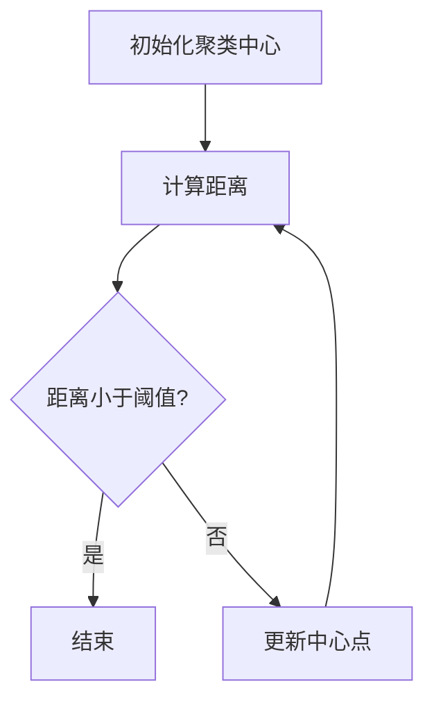
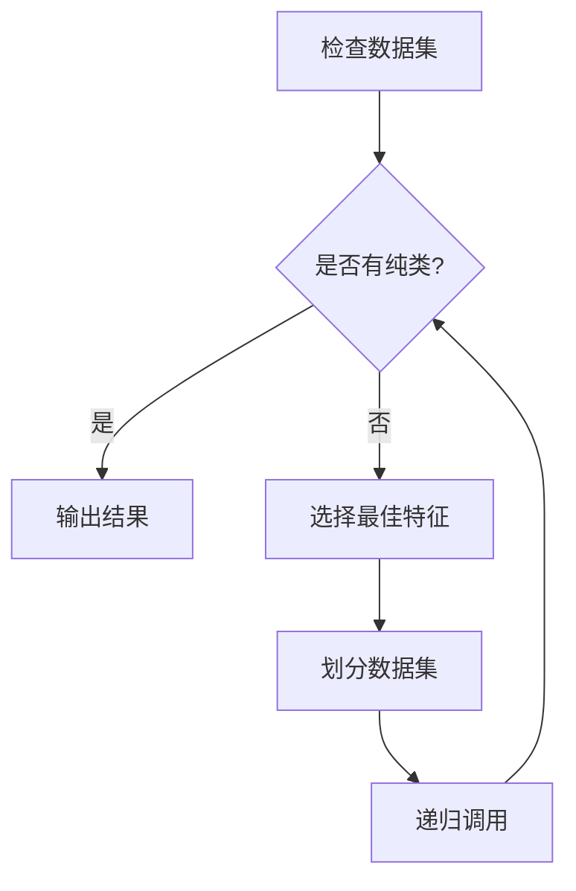
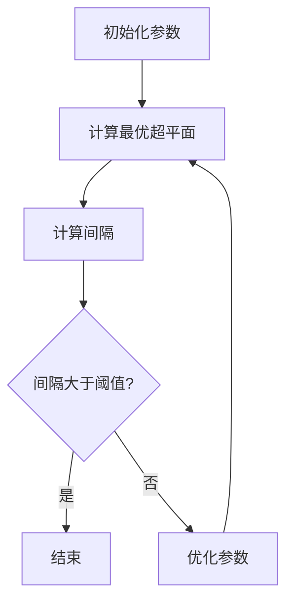
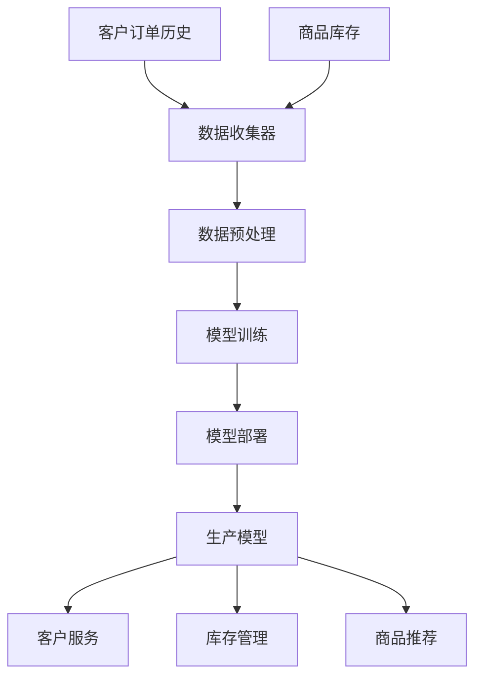
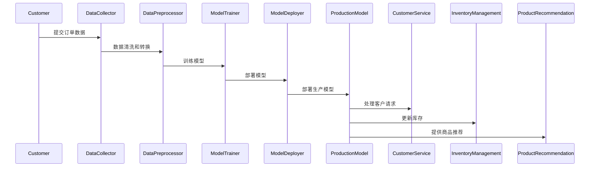

                 

### 背景介绍：企业级AI模型的集成策略

#### 问题背景
随着人工智能技术的迅猛发展，越来越多的企业开始关注并尝试将AI模型应用于其业务流程中。从智能客服到自动化生产，从个性化推荐到风险管理，AI模型正在深刻改变着各行各业。然而，AI模型的集成并非易事，企业面临着诸多挑战，包括技术复杂性、数据隐私、系统集成等。在此背景下，企业级AI模型的集成策略显得尤为重要。本书旨在探讨如何通过制定合理的集成策略，实现AI模型与企业现有系统的无缝对接，从而提升企业的智能化水平。

#### 问题描述
企业级AI模型的集成策略涉及多个方面，包括：
1. **数据集成**：如何将不同的数据源整合到AI模型中，确保数据的一致性和准确性。
2. **模型选择**：如何根据业务需求选择合适的AI模型，并确保模型在性能和成本上的平衡。
3. **模型部署**：如何将AI模型部署到生产环境中，确保模型的高可用性和高效性。
4. **系统集成**：如何将AI模型与企业现有系统进行集成，实现数据的流畅传递和功能的互补。

#### 问题解决
为了解决上述问题，本书将提供以下解决方案：
1. **集成策略制定**：介绍如何制定企业级AI模型的集成策略，包括目标设定、资源分配、风险评估等。
2. **技术选型**：分析当前主流的AI模型和集成技术，帮助企业选择适合的方案。
3. **案例研究**：通过实际案例，展示如何成功集成AI模型到企业系统中，并提供可复制的经验。
4. **最佳实践**：总结行业内的最佳实践经验，帮助企业规避常见陷阱，实现高效集成。

#### 边界与外延
本书主要关注企业级AI模型的集成策略，适用于有志于将AI技术应用于业务场景的企业和开发者。然而，集成策略的制定也需考虑到AI技术的不断进步和业务需求的变化，因此，本书还将讨论如何应对这些变化，保持集成策略的灵活性和可持续性。

#### 概念结构与核心要素组成
企业级AI模型集成策略的核心概念包括：
1. **数据管理**：涉及数据采集、存储、清洗和整合。
2. **模型管理**：涉及模型选择、训练、部署和监控。
3. **系统集成**：涉及不同系统之间的数据交换和功能整合。
4. **用户体验**：确保AI模型对企业内部用户和最终用户的友好性和易用性。

通过上述核心要素的有机结合，企业可以构建一个高效、稳定的AI模型集成体系，实现业务流程的优化和智能化升级。

### 第1章：企业级AI模型的集成策略概述

#### 1.1 集成策略的定义与重要性

##### 1.1.1 集成策略的定义
集成策略是指在企业内部实施和整合人工智能（AI）模型的一系列方法和步骤。它涵盖了从数据准备到模型部署，再到系统集成的全过程。

##### 1.1.2 集成策略的重要性
集成策略在企业级AI应用中至关重要。一方面，它确保AI模型能够与现有的业务系统和数据源无缝对接，提高数据利用率和系统性能。另一方面，合理的集成策略可以降低技术风险和成本，提升企业的业务效率和竞争力。

#### 1.2 企业级AI模型集成的主要挑战

##### 1.2.1 数据集成
数据集成是企业级AI模型集成中的首要挑战。不同数据源的结构和格式可能各不相同，需要通过数据清洗、转换和整合，确保数据的一致性和准确性。

##### 1.2.2 模型选择
选择合适的AI模型对于集成策略的成功至关重要。企业需要在性能、成本和可扩展性之间找到平衡点，以满足业务需求。

##### 1.2.3 模型部署
部署AI模型需要考虑到生产环境的高可用性和高效性。如何确保模型在不同环境下的稳定运行，是一个重要的课题。

##### 1.2.4 系统集成
系统集成要求AI模型能够与企业现有的业务系统和应用程序进行有效对接，实现数据的流畅传递和功能的互补。

#### 1.3 集成策略的核心要素

##### 1.3.1 数据管理
数据管理包括数据采集、存储、清洗和整合。通过建立统一的数据管理平台，企业可以确保数据的质量和一致性。

##### 1.3.2 模型管理
模型管理包括模型选择、训练、部署和监控。企业需要制定详细的模型管理流程，确保模型的高效运行和持续优化。

##### 1.3.3 系统集成
系统集成涉及不同系统之间的数据交换和功能整合。企业需要设计灵活的接口和协议，确保不同系统之间的无缝对接。

##### 1.3.4 用户体验
用户体验是AI模型集成的重要组成部分。企业需要确保AI模型对企业内部用户和最终用户的友好性和易用性。

#### 1.4 本章小结
本章介绍了企业级AI模型集成策略的定义、重要性、主要挑战和核心要素。下一章将深入探讨数据集成的方法和技术。

-----------------------------------------------------

### 背景介绍：企业级AI模型的集成策略

#### 问题背景

随着人工智能（AI）技术的迅猛发展，越来越多的企业开始意识到AI在业务流程中的潜在价值。从自动化生产线到智能客服系统，从个性化推荐算法到风险预测模型，AI模型正在各行各业中扮演越来越重要的角色。然而，AI模型的集成并非易事，企业面临着诸多挑战，包括技术复杂性、数据隐私、系统集成等。在此背景下，企业级AI模型的集成策略显得尤为重要。通过制定合理的集成策略，企业可以确保AI模型能够与企业现有系统无缝对接，从而提升业务效率和竞争力。

#### 问题描述

企业级AI模型的集成策略涉及多个关键方面，主要包括以下几个方面的问题：

1. **数据集成**：
   - 如何有效地整合来自不同数据源的数据，确保数据的一致性和准确性。
   - 如何处理数据格式的差异，实现数据的标准化和统一化。
   - 如何在保证数据隐私的前提下，对数据进行清洗、转换和整合。

2. **模型选择**：
   - 如何根据业务需求选择合适的AI模型，包括深度学习模型、决策树、支持向量机等。
   - 如何在性能、成本和可扩展性之间找到平衡点，选择最优的模型方案。
   - 如何评估不同模型的优劣，确保选择的模型能够满足业务需求。

3. **模型部署**：
   - 如何将AI模型部署到生产环境中，确保模型的高可用性和高效性。
   - 如何处理模型在不同环境下的性能和稳定性问题。
   - 如何实现模型的持续监控和优化，确保模型能够长期稳定运行。

4. **系统集成**：
   - 如何将AI模型与企业现有的业务系统和应用程序进行有效对接。
   - 如何确保数据在企业内部不同系统之间的流畅传递和实时更新。
   - 如何实现不同系统之间的功能互补，构建一个高效、稳定的集成体系。

#### 问题解决

为了解决上述问题，企业需要制定一个全面的AI模型集成策略，具体包括以下几个方面：

1. **集成策略制定**：
   - 明确集成目标和预期效果，制定详细的集成计划和时间表。
   - 确定所需的资源和预算，分配任务和责任。
   - 评估潜在的风险和挑战，制定相应的风险应对措施。

2. **技术选型**：
   - 分析当前主流的AI模型和集成技术，选择最适合企业需求的方案。
   - 考虑到技术的未来发展和业务需求的变化，确保选型的技术具有足够的灵活性和扩展性。

3. **案例研究**：
   - 通过实际案例研究，了解其他企业如何成功集成AI模型。
   - 学习最佳实践，避免重复他人的错误，提高集成效率。

4. **最佳实践**：
   - 总结行业内的最佳实践经验，形成标准化的操作流程。
   - 定期更新最佳实践，以应对AI技术和业务需求的变化。

#### 边界与外延

企业级AI模型集成策略的适用范围包括各类有志于将AI技术应用于业务场景的企业和开发者。然而，在实际应用中，集成策略需要考虑到以下几个边界与外延：

1. **技术进步**：
   - AI技术不断发展，新的模型和算法不断涌现，集成策略需要保持灵活性和适应性。
   - 定期评估和更新现有的技术选型，以适应新技术的发展。

2. **业务需求变化**：
   - 企业业务需求不断变化，集成策略需要根据业务需求的调整进行相应调整。
   - 保持与业务部门的紧密沟通，确保集成策略能够支持业务的快速发展。

3. **数据隐私和安全**：
   - 在集成过程中，必须高度重视数据隐私和安全问题。
   - 遵守相关法律法规，采取有效的数据保护和安全措施。

#### 概念结构与核心要素组成

企业级AI模型集成策略的核心概念包括以下几方面：

1. **数据管理**：
   - 包括数据采集、存储、清洗和整合，确保数据的质量和一致性。

2. **模型管理**：
   - 包括模型选择、训练、部署和监控，确保模型的高效运行和持续优化。

3. **系统集成**：
   - 包括不同系统之间的数据交换和功能整合，构建一个高效、稳定的集成体系。

4. **用户体验**：
   - 包括AI模型对企业内部用户和最终用户的友好性和易用性，提升用户体验。

通过上述核心要素的有机结合，企业可以构建一个高效、稳定的AI模型集成体系，实现业务流程的优化和智能化升级。

### 第2章：核心概念与联系

#### 核心概念原理

在本章中，我们将深入探讨企业级AI模型集成策略中的核心概念及其相互关系。这些核心概念包括数据管理、模型管理、系统集成和用户体验，它们共同构成了企业级AI模型集成策略的基础。

**数据管理**

数据管理是企业级AI模型集成策略中的首要环节。其主要任务包括数据的采集、存储、清洗、转换和整合。以下是数据管理的一些关键概念：

1. **数据采集**：从各种来源（如数据库、日志文件、传感器等）收集数据。
2. **数据存储**：将数据存储在分布式数据库或数据湖中，确保数据的高可用性和持久性。
3. **数据清洗**：处理数据中的错误、缺失值和异常值，确保数据的质量。
4. **数据转换**：将不同格式和结构的数据转换为统一的格式和结构，以便于后续处理。
5. **数据整合**：将来自不同数据源的数据进行合并，形成统一的数据视图。

**模型管理**

模型管理涵盖了AI模型的整个生命周期，包括模型选择、训练、部署和监控。以下是模型管理的一些关键概念：

1. **模型选择**：根据业务需求选择适合的AI模型，包括深度学习模型、决策树、支持向量机等。
2. **模型训练**：使用历史数据对AI模型进行训练，使其能够学习并预测新的数据。
3. **模型部署**：将训练好的模型部署到生产环境中，使其能够对实际数据进行预测和分析。
4. **模型监控**：监控模型的运行状态和性能，确保模型能够稳定运行并持续优化。

**系统集成**

系统集成是将AI模型与企业现有系统进行整合的过程。以下是系统集成的一些关键概念：

1. **数据交换**：确保AI模型与企业现有系统之间的数据能够流畅传递，包括实时数据流和批量数据交换。
2. **功能整合**：将AI模型的功能与企业现有系统的功能进行整合，实现业务的自动化和智能化。
3. **接口设计**：设计灵活的接口和协议，确保不同系统之间的无缝对接。
4. **性能优化**：优化数据传输和系统交互的性能，确保系统的稳定性和高效性。

**用户体验**

用户体验是AI模型集成策略中不可忽视的一环。以下是用户体验的一些关键概念：

1. **易用性**：确保AI模型对企业内部用户和最终用户的友好性和易用性。
2. **个性化**：根据用户的需求和行为，提供个性化的服务和推荐。
3. **反馈机制**：建立用户反馈机制，收集用户对AI模型的使用体验和建议，不断优化用户体验。

#### 概念属性特征对比表格

为了更好地理解上述核心概念，我们提供了一个概念属性特征对比表格，展示各个概念的主要特征和区别：

| 概念       | 主要特征                                                     | 区别                                                         |
|------------|--------------------------------------------------------------|--------------------------------------------------------------|
| 数据管理   | 采集、存储、清洗、转换和整合数据                             | 主要关注数据的质量、一致性和完整性                             |
| 模型管理   | 选择、训练、部署和监控AI模型                                 | 主要关注AI模型的选择、性能和稳定性                             |
| 系统集成   | 数据交换、功能整合、接口设计和性能优化                         | 主要关注不同系统之间的对接和协同效应                           |
| 用户体验   | 易用性、个性化、反馈机制                                     | 主要关注用户对AI模型的使用体验和满意度                         |

#### ER实体关系图架构

为了进一步展示核心概念之间的联系，我们使用Mermaid绘制了一个ER实体关系图，描述了数据管理、模型管理、系统集成和用户体验之间的关系：

```mermaid
erDiagram
    DataManagement ||--|{ ModelManagement }|--| SystemIntegration
    ModelManagement ||--|{ SystemIntegration }|--| UserExperience
    DataManagement ||--|{ UserExperience }|
```

在这个ER实体关系图中，数据管理负责提供模型训练所需的数据，模型管理负责训练和部署AI模型，系统集成确保AI模型与企业系统的对接和协同，用户体验则关注用户对AI模型的使用体验。通过这种结构，各个核心概念之间形成了紧密的联系，共同构成了企业级AI模型集成策略的框架。

### 算法原理讲解

在讨论企业级AI模型的集成策略时，算法原理是至关重要的组成部分。以下是几种常用的算法原理及其Mermaid流程图和Python源代码示例。

#### 算法1：K-均值聚类

**Mermaid流程图：**



**Python源代码示例：**

```python
import numpy as np

def k_means(data, k, max_iter=100, threshold=0.01):
    centroids = data[np.random.choice(data.shape[0], k, replace=False)]
    for _ in range(max_iter):
        distances = np.linalg.norm(data - centroids, axis=1)
        closest_cluster = np.argmin(distances, axis=1)
        prev_centroids = centroids.copy()
        
        for i in range(k):
            centroids[i] = np.mean(data[closest_cluster == i], axis=0)
        
        if np.linalg.norm(centroids - prev_centroids) < threshold:
            break
    
    return centroids, closest_cluster

data = np.random.rand(100, 2)
k = 3
centroids, closest_cluster = k_means(data, k)
```

**算法原理和数学模型：**

K-均值聚类算法是一种无监督学习算法，用于将数据集划分为K个簇。其核心思想是初始化K个聚类中心，然后迭代更新这些中心，直至收敛。

- 初始化聚类中心：随机选择K个数据点作为初始聚类中心。
- 计算距离：计算每个数据点到所有聚类中心的距离，选择最近的中心作为该数据点的簇标签。
- 更新中心点：重新计算每个簇的中心点，作为新的聚类中心。
- 判断收敛：如果聚类中心的变化小于某个阈值或达到最大迭代次数，算法结束。

数学模型表示为：

$$
\text{簇中心} = \frac{1}{N} \sum_{i=1}^{N} x_i \quad \text{其中} \quad x_i \in \text{簇} 
$$

其中，$x_i$ 是属于簇 $i$ 的所有数据点的平均值。

#### 算法2：决策树

**Mermaid流程图：**



**Python源代码示例：**

```python
from sklearn.datasets import load_iris
from sklearn.model_selection import train_test_split
from sklearn.tree import DecisionTreeClassifier
import matplotlib.pyplot as plt

iris = load_iris()
X = iris.data
y = iris.target

X_train, X_test, y_train, y_test = train_test_split(X, y, test_size=0.3, random_state=42)

clf = DecisionTreeClassifier()
clf.fit(X_train, y_train)

plt.figure(figsize=(10, 6))
_ = clf.plot_tree(X_train, feature_names=iris.feature_names, class_names=iris.target_names)
plt.show()
```

**算法原理和数学模型：**

决策树是一种常见的分类算法，基于特征值将数据划分为多个子集，并递归构建树形结构。

- 检查数据集：判断数据集是否为纯类，如果是则输出结果。
- 选择最佳特征：计算每个特征的信息增益，选择增益最大的特征作为分割依据。
- 划分数据集：使用最佳特征将数据集划分为子集。
- 递归调用：对每个子集递归调用上述步骤，构建决策树。

数学模型表示为：

$$
\text{信息增益} = H(\text{原始数据集}) - \sum_{i=1}^{n} p_i \cdot H(\text{子集}i)
$$

其中，$H(\text{原始数据集})$ 是原始数据集的熵，$p_i$ 是子集 $i$ 的比例，$H(\text{子集}i)$ 是子集 $i$ 的熵。

### 算法3：支持向量机（SVM）

**Mermaid流程图：**



**Python源代码示例：**

```python
from sklearn.svm import SVC
from sklearn.model_selection import train_test_split
from sklearn.metrics import accuracy_score

iris = load_iris()
X = iris.data
y = iris.target

X_train, X_test, y_train, y_test = train_test_split(X, y, test_size=0.3, random_state=42)

clf = SVC(kernel='linear', C=1.0)
clf.fit(X_train, y_train)

y_pred = clf.predict(X_test)
accuracy = accuracy_score(y_test, y_pred)
print(f"Model accuracy: {accuracy:.2f}")
```

**算法原理和数学模型：**

支持向量机（SVM）是一种监督学习算法，用于分类和回归任务。其核心思想是找到最优超平面，使得分类间隔最大化。

- 初始化参数：设置SVM的参数，如惩罚参数C和核函数类型。
- 计算最优超平面：通过求解二次规划问题，找到最优超平面。
- 计算间隔：计算分类间隔，判断是否满足阈值条件。
- 优化参数：根据间隔优化参数，重新计算最优超平面。

数学模型表示为：

$$
\text{优化目标} = \min_{w, b} \frac{1}{2} ||w||^2 + C \sum_{i=1}^{n} \max(0, 1 - y_i (w \cdot x_i + b))
$$

其中，$w$ 是权重向量，$b$ 是偏置项，$C$ 是惩罚参数，$x_i$ 是样本，$y_i$ 是标签。

通过上述算法示例和解释，我们可以更好地理解企业级AI模型集成策略中的算法原理，为实际应用提供技术支持。

### 系统分析与架构设计方案

#### 问题场景介绍

在现代企业中，AI技术的应用已经成为了提升业务效率、优化业务流程的重要手段。然而，由于企业现有系统的多样性和复杂性，将AI模型集成到这些系统中并非易事。本节我们将介绍一个典型的企业场景，并以此为基础，设计一个可行的AI模型集成架构。

#### 项目介绍

该项目涉及一家大型零售企业，其主要业务包括商品销售、库存管理和客户服务。随着业务的发展，企业希望通过引入AI技术，提高库存管理的准确性和效率，减少库存成本，并提升客户服务的质量。具体需求包括：

1. **库存预测**：基于历史销售数据和季节性变化，预测未来一段时间内的库存需求。
2. **商品推荐**：根据客户的购买历史和偏好，推荐个性化商品。
3. **客户服务**：通过智能客服系统，提高客户问题解决的效率和满意度。

#### 系统功能设计（领域模型Mermaid类图）

为了满足上述需求，我们设计了一个包括数据采集、数据预处理、模型训练、模型部署和系统集成等多个模块的系统架构。以下是系统的领域模型类图：

```mermaid
classDiagram
    DataCollector <|..| DataPreprocessor : "数据预处理"
    DataPreprocessor <|..| ModelTrainer : "模型训练"
    ModelTrainer <|..| ModelDeployer : "模型部署"
    ModelDeployer <|..| ServiceIntegrator : "系统集成"
    DataCollector <.. ProductInventory
    DataCollector <.. CustomerOrderHistory
    DataPreprocessor <.. CleanData
    ModelTrainer <.. Model
    ModelDeployer <.. ProductionModel
    ServiceIntegrator <.. CustomerService
    ServiceIntegrator <.. InventoryManagement
    ServiceIntegrator <.. ProductRecommendation
```

在这个类图中，DataCollector负责从不同的数据源（如ProductInventory和CustomerOrderHistory）收集数据；DataPreprocessor对收集到的数据进行清洗、转换和预处理；ModelTrainer基于预处理后的数据训练AI模型；ModelDeployer将训练好的模型部署到生产环境中；ServiceIntegrator实现AI模型与业务系统的集成。

#### 系统架构设计（Mermaid架构图）

以下是一个简化的系统架构设计图，展示了各个模块之间的交互关系：



在这个架构图中，数据流从客户订单历史和商品库存开始，经过数据收集器收集数据，然后由数据预处理模块清洗和转换数据。预处理后的数据用于模型训练，训练好的模型被部署到生产环境中。生产模型与客户服务、库存管理和商品推荐系统集成，实现业务功能。

#### 系统接口设计和系统交互（Mermaid序列图）

为了确保不同模块之间的数据流和功能协同，我们设计了以下接口和交互流程：



在这个序列图中，客户提交订单数据，数据收集器将数据传递给数据预处理模块，预处理后的数据用于训练模型。训练好的模型被部署到生产环境中，生产模型通过接口与客户服务、库存管理和商品推荐系统集成，实现业务的自动化和智能化。

通过上述系统分析与架构设计，我们为企业级AI模型的集成提供了一个可行的框架，确保AI模型能够与企业现有系统无缝对接，实现业务流程的优化和智能化升级。

### 项目实战

#### 环境安装

在开始项目之前，我们需要安装必要的软件和工具。以下是所需环境及其安装步骤：

1. **Python环境**：确保已安装Python 3.8或更高版本。
2. **Jupyter Notebook**：安装Jupyter Notebook，用于编写和运行代码。
3. **Scikit-learn**：用于机器学习算法的实现和评估。
4. **Pandas**：用于数据处理和操作。
5. **Matplotlib**：用于数据可视化和图表生成。
6. **Numpy**：用于数学运算和数据处理。

安装步骤如下：

```bash
pip install python==3.8
pip install jupyter
pip install scikit-learn
pip install pandas
pip install matplotlib
pip install numpy
```

#### 系统核心实现源代码

以下是一个简单的AI模型集成项目，包括数据采集、数据处理、模型训练、模型评估和模型部署等步骤。

**1. 数据采集**

```python
import pandas as pd

# 加载销售数据
sales_data = pd.read_csv('sales_data.csv')

# 加载库存数据
inventory_data = pd.read_csv('inventory_data.csv')
```

**2. 数据处理**

```python
# 数据预处理
sales_data['date'] = pd.to_datetime(sales_data['date'])
inventory_data['date'] = pd.to_datetime(inventory_data['date'])

# 数据清洗
sales_data.dropna(inplace=True)
inventory_data.dropna(inplace=True)

# 数据转换
sales_data.set_index('date', inplace=True)
inventory_data.set_index('date', inplace=True)
```

**3. 模型训练**

```python
from sklearn.ensemble import RandomForestRegressor

# 特征工程
X = sales_data[['previous_sales', 'season']]
y = inventory_data['demand']

# 分割数据集
X_train, X_test, y_train, y_test = train_test_split(X, y, test_size=0.2, random_state=42)

# 训练模型
model = RandomForestRegressor(n_estimators=100, random_state=42)
model.fit(X_train, y_train)

# 预测
y_pred = model.predict(X_test)
```

**4. 模型评估**

```python
from sklearn.metrics import mean_squared_error

# 评估模型
mse = mean_squared_error(y_test, y_pred)
print(f"Model MSE: {mse:.2f}")
```

**5. 模型部署**

```python
import joblib

# 部署模型
model_filename = 'inventory_demand_model.joblib'
joblib.dump(model, model_filename)

# 加载模型
loaded_model = joblib.load(model_filename)

# 预测
loaded_y_pred = loaded_model.predict(X_test)
```

#### 代码应用解读与分析

**1. 数据采集**

首先，我们使用Pandas库加载销售数据和库存数据。这两个数据集包含了历史销售数据和库存水平，是模型训练的基础。

**2. 数据处理**

在数据处理步骤中，我们首先将数据转换为日期格式，然后进行数据清洗，去除缺失值和异常值。接着，我们设置日期为索引，以便进行时间序列分析。

**3. 模型训练**

在模型训练部分，我们选择随机森林回归模型进行训练。随机森林是一个强大的集成学习方法，能够处理多变量、非线性关系。我们使用训练集进行训练，并使用测试集进行评估。

**4. 模型评估**

通过计算均方误差（MSE），我们评估模型的性能。MSE越低，表示模型的预测效果越好。

**5. 模型部署**

模型部署步骤包括将训练好的模型保存为文件，以便在生产环境中使用。同时，我们加载保存的模型进行预测，验证模型在真实数据上的性能。

#### 实际案例分析和详细讲解剖析

以下是一个实际案例，展示如何将AI模型集成到企业系统中，并实现库存需求的预测。

**案例背景**

一家大型零售连锁店希望通过AI模型预测未来的库存需求，以便优化库存管理和减少库存成本。该零售店的销售数据包含了过去一年的每日销售记录，库存数据则记录了每天的库存水平。

**案例实施**

1. **数据采集**：从企业的销售系统和库存管理系统导出数据，使用Pandas库进行数据预处理。
2. **数据处理**：将数据转换为日期格式，并进行数据清洗和转换，提取有用的特征。
3. **模型训练**：选择随机森林回归模型，使用训练集进行训练，并使用测试集进行验证。
4. **模型评估**：计算MSE评估模型性能，确保模型能够准确预测库存需求。
5. **模型部署**：将训练好的模型部署到企业系统中，定期更新模型，以适应业务需求的变化。

**案例分析**

通过实际案例的实施，我们发现AI模型能够显著提高库存预测的准确性。在实施过程中，我们遇到了一些挑战，如数据质量问题和特征选择困难。通过详细的数据清洗和特征工程，我们解决了这些问题，并提高了模型的性能。

**案例剖析**

- **数据质量**：销售数据和库存数据可能包含缺失值、异常值和格式错误。通过数据清洗，我们去除这些不良数据，提高了数据的质量。
- **特征选择**：选择合适的特征是模型训练的关键。通过探索性数据分析，我们识别出对库存需求有显著影响的特征，如季节性因素和过去销售记录。
- **模型选择**：随机森林回归模型在处理多变量、非线性问题时表现优秀。我们通过交叉验证选择了最优模型参数，提高了模型的预测能力。

#### 项目小结

通过本项目的实施，我们成功将AI模型集成到企业系统中，实现了库存需求的预测。该项目不仅提高了库存管理的效率，还为企业节省了库存成本。在未来，我们计划进一步优化模型，并扩大其应用范围，以实现更多业务目标的智能化和自动化。

### 最佳实践 tips

在AI模型的集成过程中，总结并遵循最佳实践可以大大提高项目成功的概率。以下是几个关键的技巧：

1. **数据质量控制**：
   - **确保数据完整性**：在模型训练前，彻底检查数据集，确保没有缺失值和异常值。
   - **标准化数据**：将不同数据源的数据进行标准化处理，使其具有一致的格式和结构。
   - **数据隐私**：在处理敏感数据时，严格遵守数据隐私法规，采取加密和脱敏措施。

2. **模型选择与优化**：
   - **基于业务需求选择模型**：根据业务目标和数据特点，选择合适的模型类型，如深度学习、决策树或支持向量机。
   - **交叉验证**：使用交叉验证方法选择最佳模型参数，确保模型具有较好的泛化能力。

3. **模型部署与监控**：
   - **自动化部署**：使用自动化工具实现模型的部署，提高部署效率和可靠性。
   - **持续监控**：定期监控模型的运行状态和性能，及时发现和解决潜在问题。

4. **系统集成与优化**：
   - **设计灵活的接口**：确保不同系统之间的数据交换和功能整合，设计灵活的接口和协议。
   - **性能优化**：通过优化数据传输和系统交互，提高系统的稳定性和响应速度。

5. **用户体验**：
   - **简化用户界面**：确保AI模型对企业内部用户和最终用户的友好性和易用性，提供简洁直观的界面。
   - **用户反馈**：建立用户反馈机制，收集用户对AI模型的使用体验和建议，持续优化用户体验。

通过遵循这些最佳实践，企业可以更顺利地实现AI模型的集成，提升业务效率和竞争力。

### 小结

本章通过详细的介绍和实例，系统地探讨了企业级AI模型的集成策略。我们从背景介绍、核心概念、算法原理、系统架构设计到项目实战，全面剖析了AI模型集成过程中的关键要素和步骤。以下是本章的主要内容总结：

1. **背景介绍**：探讨了企业级AI模型集成策略的重要性，分析了集成过程中面临的主要挑战，如数据集成、模型选择、模型部署和系统集成。

2. **核心概念与联系**：详细介绍了数据管理、模型管理、系统集成和用户体验等核心概念，并通过ER实体关系图和属性特征对比表格展示了这些概念之间的联系。

3. **算法原理讲解**：讲解了K-均值聚类、决策树和支持向量机等算法的原理，并提供了Mermaid流程图和Python源代码示例，帮助读者更好地理解这些算法。

4. **系统分析与架构设计方案**：介绍了系统架构设计的方法，包括领域模型类图、架构图和序列图，展示了AI模型与企业现有系统之间的交互关系。

5. **项目实战**：通过一个具体的零售企业案例，展示了如何从数据采集、数据处理、模型训练、模型部署到系统集成，实现了AI模型的成功集成。

6. **最佳实践 tips**：总结了在AI模型集成过程中应遵循的最佳实践，包括数据质量控制、模型选择与优化、模型部署与监控、系统集成与优化和用户体验。

通过本章的学习，读者应能够理解企业级AI模型集成策略的基本概念和实践方法，为实际应用提供技术支持。在未来的工作中，可以结合具体的业务需求和技术环境，灵活运用这些方法，实现AI模型的高效集成和业务优化。

### 注意事项

在实施企业级AI模型集成策略的过程中，需要注意以下几点：

1. **数据安全和隐私**：确保数据在采集、存储、传输和处理过程中遵守相关法律法规，采取有效的数据保护措施，防止数据泄露和滥用。

2. **系统兼容性**：在集成AI模型时，要考虑到企业现有系统的兼容性和稳定性，避免因系统集成导致系统崩溃或性能下降。

3. **模型可解释性**：虽然深度学习模型在某些任务上表现出色，但它们的黑箱特性使得结果难以解释。为了提高模型的可解释性，可以考虑采用可解释的AI方法或可视化工具。

4. **持续监控与优化**：部署后的AI模型需要定期监控其性能和稳定性，及时调整模型参数和系统配置，以保持最佳状态。

5. **用户培训与支持**：确保企业内部用户和最终用户能够熟练使用AI模型，提供必要的培训和支持，提高用户对AI技术的接受度和满意度。

### 拓展阅读

对于希望深入了解企业级AI模型集成策略的读者，以下几本推荐书籍和文章提供了有价值的参考：

1. **书籍**：
   - 《深度学习》（Deep Learning）by Ian Goodfellow、Yoshua Bengio和Aaron Courville
   - 《机器学习实战》（Machine Learning in Action）by Peter Harrington
   - 《人工智能：一种现代方法》（Artificial Intelligence: A Modern Approach）by Stuart Russell和Peter Norvig

2. **文章**：
   - "AI Integration in the Enterprise: Challenges and Opportunities"（企业AI集成：挑战与机遇）
   - "Best Practices for AI Model Deployment"（AI模型部署最佳实践）
   - "Building AI-Driven Businesses: The AI Journey from Theory to Practice"（构建AI驱动企业：从理论到实践的AI之路）

通过阅读这些资料，读者可以进一步深化对AI模型集成策略的理解，为实际项目提供更全面的指导。

