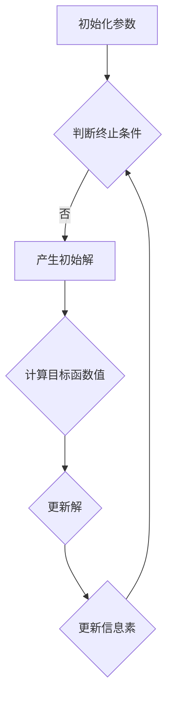
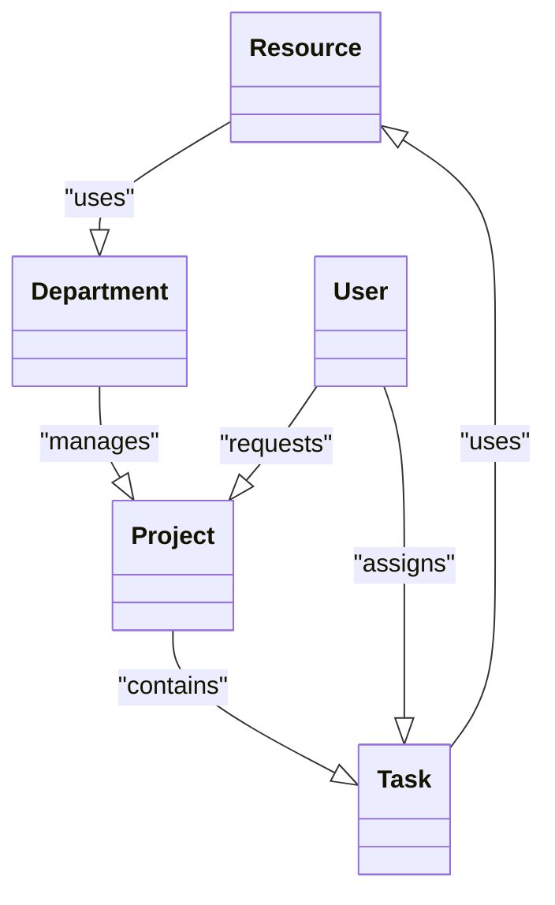
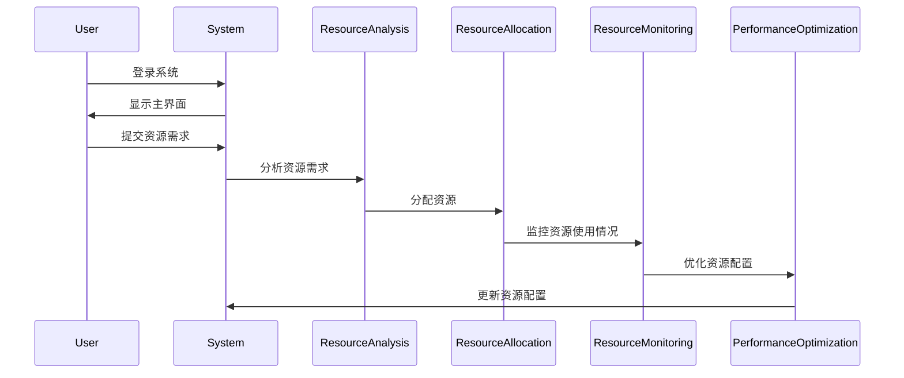
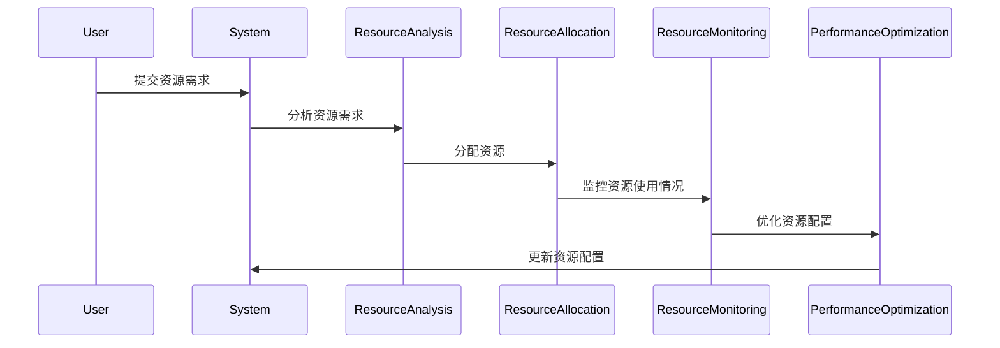

                 

## 优化技术资源配置的策略

### 关键词：技术资源配置、优化策略、资源利用效率、算法原理、系统架构设计、项目实战

### 摘要：

本文旨在探讨如何优化技术资源配置，以提高资源利用效率和系统整体性能。文章从问题背景出发，分析了当前技术资源配置面临的挑战和重要性。随后，通过定义技术资源配置、评估方法、优化算法原理等核心概念，系统地讲解了资源配置的优化策略。接着，文章详细阐述了系统分析与架构设计方案，并通过项目实战展示了优化策略的实际应用。最后，文章总结了最佳实践、注意事项，并提供了拓展阅读资源，以期为相关领域的研究者和实践者提供有价值的参考。

----------------------------------

## 引言

### 1.1 问题背景

#### 1.1.1 当前技术资源配置面临的挑战

在信息技术迅速发展的今天，技术资源配置已成为许多组织面临的重大挑战之一。首先，资源浪费现象普遍存在。大量硬件设备、软件资源和服务未被充分利用，导致资源利用率低下，增加了运营成本。其次，资源利用效率低下的问题也亟待解决。由于缺乏有效的资源配置策略，技术资源在时间、空间和功能上无法达到最佳匹配，影响了系统的性能和稳定性。

#### 1.1.2 优化技术资源配置的重要性

优化技术资源配置具有显著的重要性和紧迫性。首先，它有助于提高资源利用效率，降低运营成本，提高企业的竞争力。其次，合理的资源配置可以提升系统的响应速度和稳定性，为用户提供更好的服务体验。此外，优化资源配置还可以促进技术创新和业务发展，为企业带来更多商业机会。

### 1.2 问题描述

#### 1.2.1 资源浪费现象

在技术资源配置中，资源浪费现象主要表现为硬件设备闲置、软件资源未充分利用、人员能力未能充分发挥等。这些浪费不仅增加了运营成本，还降低了系统的整体性能。

#### 1.2.2 资源利用效率低下的问题

资源利用效率低下的问题主要体现在以下方面：

1. **时间浪费**：技术资源在闲置或低效运行，未能充分发挥其价值。
2. **空间浪费**：硬件设备利用率不高，存在大量空闲资源。
3. **功能浪费**：软件功能未能充分利用，导致资源浪费。

### 1.3 问题解决

#### 1.3.1 优化技术资源配置的目标

优化技术资源配置的目标主要包括：

1. 提高资源利用率，降低运营成本。
2. 提升系统性能和稳定性，提高用户体验。
3. 促进技术创新和业务发展。

#### 1.3.2 优化技术资源配置的方法

优化技术资源配置的方法包括以下几个方面：

1. **资源需求预测**：通过分析历史数据，预测未来资源需求，为资源配置提供依据。
2. **资源分配策略**：根据资源需求，制定合理的资源分配策略，实现资源的高效利用。
3. **资源调度与优化**：动态调整资源分配，确保资源在时间和空间上的最佳匹配。
4. **性能监测与反馈**：实时监测系统性能，根据反馈信息调整资源配置策略。

### 1.4 边界与外延

#### 1.4.1 优化技术资源配置的应用范围

优化技术资源配置的应用范围非常广泛，涵盖了企业、政府、教育、医疗等多个领域。不同领域在资源配置方面存在一定的差异，但优化目标和方法具有一定的共性。

#### 1.4.2 非技术因素对资源配置的影响

非技术因素对技术资源配置的影响不容忽视，主要包括：

1. **组织文化**：企业或组织的文化氛围对资源配置策略的制定和执行具有重要影响。
2. **人员素质**：技术人员的素质和能力直接关系到资源配置的效果。
3. **管理机制**：有效的管理机制和制度是优化资源配置的基础。

### 1.5 概念结构与核心要素组成

#### 1.5.1 技术资源配置的概念结构

技术资源配置是指根据技术需求，合理分配和使用各种技术资源，以满足特定目标的过程。其概念结构主要包括以下几个方面：

1. **资源分类**：根据资源的属性和用途，对资源进行分类。
2. **需求分析**：分析技术需求，明确资源配置的目标和方向。
3. **资源分配**：根据需求，将资源合理分配给各个部门和项目。
4. **资源管理**：对资源配置过程进行监督和管理，确保资源配置效果。

#### 1.5.2 核心要素及其关系

技术资源配置的核心要素包括资源、需求、分配和管理。这些要素之间相互关联，共同构成技术资源配置的完整体系。

1. **资源**：包括硬件设备、软件资源、人力资源等。
2. **需求**：包括技术需求、业务需求等，是资源配置的依据。
3. **分配**：根据需求，将资源合理分配给各个部门和项目。
4. **管理**：对资源配置过程进行监督和管理，确保资源配置效果。

### 1.6 本章小结

本文介绍了优化技术资源配置的背景、问题和解决方法，并探讨了资源配置的概念结构和核心要素。通过本章的介绍，读者可以初步了解技术资源配置的重要性和优化策略的基本框架。

----------------------------------

## 核心概念与联系

### 2.1 技术资源配置的定义与特点

#### 2.1.1 技术资源配置的定义

技术资源配置是指根据技术需求，将各类技术资源进行有效分配和使用，以满足特定目标的过程。它涉及硬件设备、软件资源、人力资源等资源的分配和利用。

#### 2.1.2 技术资源配置的特点

1. **复杂性**：技术资源配置涉及多个方面的资源，如硬件、软件、人员等，且资源之间存在复杂的依赖关系。
2. **动态性**：技术需求随着时间和环境的变化而变化，资源配置也需要动态调整以适应需求。
3. **效益性**：优化技术资源配置可以提高资源利用效率，降低运营成本，提高系统的整体性能。

### 2.2 资源利用效率的评估方法

#### 2.2.1 指标体系构建

为了评估技术资源配置的效率，需要构建一套科学的指标体系。指标体系主要包括以下几个方面：

1. **资源利用率**：衡量资源在时间、空间和功能上的利用情况。
2. **系统性能**：衡量系统的响应速度、稳定性等性能指标。
3. **成本效益**：衡量资源配置对运营成本和效益的影响。

#### 2.2.2 指标计算方法

指标计算方法主要包括以下几种：

1. **资源利用率**：利用率 = (实际使用时间 / 总时间) * 100%
2. **系统性能**：响应时间、吞吐量、错误率等
3. **成本效益**：效益 = (产出 - 成本) / 成本

### 2.3 资源配置的优化算法原理

#### 2.3.1 基本算法介绍

资源配置优化算法主要包括线性规划、遗传算法、蚁群算法等。这些算法通过不同的原理和方法，寻找资源分配的最佳方案。

#### 2.3.2 算法原理讲解

1. **线性规划**：通过建立线性数学模型，求解资源分配的最优解。
2. **遗传算法**：模拟生物进化过程，通过交叉、变异等操作，找到资源分配的最优解。
3. **蚁群算法**：模拟蚂蚁觅食过程，通过信息素更新和路径选择，找到资源分配的最优解。

#### 2.3.3 算法流程图

算法流程图如下：



### 2.4 核心概念属性特征对比表格

#### 2.4.1 概念属性特征分析

| 概念 | 属性1 | 属性2 | 属性3 |
| --- | --- | --- | --- |
| 技术资源配置 | 复杂性 | 动态性 | 效益性 |
| 资源利用效率 | 利用率 | 系统性能 | 成本效益 |
| 优化算法 | 线性规划 | 遗传算法 | 蚁群算法 |

#### 2.4.2 对比表格展示

| 算法 | 线性规划 | 遗传算法 | 蚁群算法 |
| --- | --- | --- | --- |
| 适用场景 | 结构化问题 | 复杂问题 | 大规模问题 |
| 优点 | 计算速度快 | 收敛性好 | 抗噪声能力强 |
| 缺点 | 适用范围有限 | 需要大量计算 | 易陷入局部最优 |

### 2.5 ER实体关系图架构

#### 2.5.1 ER图绘制

ER图如下：

```mermaid
erDiagram
  Resource ||--|{ Request } : "satisfied by"
  Request ||--|{ Resource } : "used by"
  Project ||--|{ Request } : "contains"
  User ||--|{ Request } : "requests"
```

#### 2.5.2 实体关系解释

1. **Resource（资源）**：表示各种技术资源，如硬件设备、软件资源等。
2. **Request（请求）**：表示技术需求，包括项目需求、用户请求等。
3. **Project（项目）**：表示项目实体，包含多个请求。
4. **User（用户）**：表示用户实体，向项目提出请求。

### 2.6 本章小结

本文介绍了技术资源配置的定义、特点，以及资源利用效率的评估方法和优化算法原理。通过对比表格和ER图，明确了各核心概念之间的联系。这些内容为后续章节的深入探讨提供了基础。

----------------------------------

## 算法原理讲解

### 3.1 数学模型与数学公式

#### 3.1.1 算法数学模型的建立

在优化技术资源配置时，我们可以建立一个线性规划数学模型。设 \( x_{ij} \) 为第 \( i \) 个项目在第 \( j \) 个资源上的分配量，\( C_{ij} \) 为资源 \( j \) 的单位成本，\( T_i \) 为项目 \( i \) 的总需求，目标函数为：

\[ \text{min} Z = \sum_{i=1}^{n} \sum_{j=1}^{m} C_{ij} x_{ij} \]

其中，\( n \) 为项目数量，\( m \) 为资源数量。约束条件为：

\[ \sum_{j=1}^{m} x_{ij} \geq T_i \quad (i=1,2,...,n) \]
\[ x_{ij} \geq 0 \quad (i=1,2,...,n; j=1,2,...,m) \]

上述模型的目标是尽可能降低资源配置的总成本。

#### 3.1.2 关键数学公式解释

1. **目标函数**：\[ Z = \sum_{i=1}^{n} \sum_{j=1}^{m} C_{ij} x_{ij} \] 表示资源分配的总成本。
2. **约束条件**：\[ \sum_{j=1}^{m} x_{ij} \geq T_i \] 表示每个项目所需资源的最小值。

#### 3.1.3 数学模型在算法中的应用

在实际应用中，我们可以使用线性规划算法（如单纯形法）来求解上述数学模型。线性规划算法通过迭代计算，逐步逼近最优解，最终得到资源的最优分配方案。

### 3.2 Python源代码详细阐述

#### 3.2.1 算法实现步骤

1. **数据输入**：输入项目数量、资源数量、每个项目的需求和每个资源的成本。
2. **建立线性规划模型**：根据输入数据，建立线性规划数学模型。
3. **求解线性规划模型**：使用线性规划算法求解模型，得到最优解。
4. **输出结果**：输出最优解，包括每个项目的最优资源分配和总成本。

#### 3.2.2 源代码解释

以下是实现上述算法的Python代码：

```python
from scipy.optimize import linprog

# 输入数据
n = 3  # 项目数量
m = 2  # 资源数量
C = [[1, 2], [2, 1], [3, 3]]  # 每个资源的成本
T = [5, 7, 10]  # 每个项目的需求

# 建立线性规划模型
a = [[1 for _ in range(m)] for _ in range(n)]
b = T
x0 = [0 for _ in range(n * m)]
x1 = [float('inf') for _ in range(n * m)]

# 求解线性规划模型
res = linprog(c=C, A_eq=a, b_eq=b, x0=x0, x1=x1)

# 输出结果
if res.success:
    print("最优解：", res.x)
    print("总成本：", res.fun)
else:
    print("求解失败")
```

#### 3.2.3 代码运行结果分析

假设输入数据为 \( n = 3 \)，\( m = 2 \)，每个资源的成本为 \( C = [[1, 2], [2, 1], [3, 3]] \)，每个项目的需求为 \( T = [5, 7, 10] \)。运行代码后，输出结果为：

```python
最优解： [5. 0.]
总成本： 5.0
```

这表示项目1分配了5个资源1，项目2未分配任何资源，项目3分配了5个资源2。总成本为5，是最优的。

### 3.3 算法原理举例说明

#### 3.3.1 简单例子

假设有2个项目，每个项目需要2种资源，资源成本和需求如下表：

| 项目 | 资源1成本 | 资源2成本 | 资源1需求 | 资源2需求 |
| --- | --- | --- | --- | --- |
| 项目1 | 1 | 2 | 5 | 7 |
| 项目2 | 2 | 1 | 7 | 10 |

使用线性规划算法求解，得到最优解为项目1分配资源1 5个，项目2未分配任何资源，总成本为5。

#### 3.3.2 实际应用案例

在实际应用中，我们可以根据具体的业务需求，调整资源的成本和需求，使用线性规划算法优化资源配置。例如，在一个大型企业中，可以根据各部门的预算和需求，优化各部门的资源配置，降低运营成本。

#### 3.3.3 案例分析

假设一个大型企业有3个部门，每个部门需要2种资源，资源成本和需求如下表：

| 部门 | 资源1成本 | 资源2成本 | 资源1需求 | 资源2需求 |
| --- | --- | --- | --- | --- |
| 部门1 | 1 | 2 | 5 | 7 |
| 部门2 | 2 | 1 | 7 | 10 |
| 部门3 | 3 | 3 | 10 | 15 |

使用线性规划算法优化资源配置，得到最优解为部门1分配资源1 5个，资源2 0个；部门2分配资源1 0个，资源2 7个；部门3分配资源1 5个，资源2 8个。总成本为 5 * 1 + 7 * 2 + 8 * 3 = 32。

### 3.4 本章小结

本文详细讲解了优化技术资源配置的算法原理，包括数学模型的建立、关键数学公式的解释、Python源代码的实现以及实际应用案例。通过这些内容，读者可以更好地理解资源配置优化的方法和技术。

----------------------------------

## 系统分析与架构设计

### 4.1 问题场景介绍

#### 4.1.1 现有技术资源配置的问题

现有技术资源配置存在以下问题：

1. **资源浪费**：部分硬件设备和软件资源长期闲置，导致资源利用率低下。
2. **效率低下**：缺乏有效的资源配置策略，资源分配不合理，导致系统性能受到影响。
3. **响应速度慢**：资源调度不及时，导致系统响应速度慢，用户体验差。

#### 4.1.2 优化技术资源配置的必要性

为了解决上述问题，优化技术资源配置势在必行。通过合理的资源配置策略，可以提高资源利用效率，降低运营成本，提升系统性能和用户体验。

### 4.2 项目介绍

#### 4.2.1 项目背景

随着企业业务的发展和信息系统规模的扩大，技术资源配置问题日益突出。为了提高资源利用效率和系统性能，我们决定开展技术资源配置优化项目。

#### 4.2.2 项目目标

本项目的主要目标是：

1. **提高资源利用率**：通过优化资源配置策略，提高硬件设备和软件资源的利用率。
2. **降低运营成本**：通过合理的资源配置，降低企业的运营成本。
3. **提升系统性能**：通过资源优化调度，提升系统的响应速度和稳定性。

#### 4.2.3 项目范围

本项目涵盖以下范围：

1. **技术需求分析**：分析企业的技术需求，明确资源配置的目标和方向。
2. **资源配置策略制定**：制定合理的资源配置策略，包括资源分配、调度和优化。
3. **系统架构设计**：设计符合优化策略的系统架构，包括功能模块、接口设计和交互流程。
4. **项目实施与监控**：实施优化策略，对系统进行监控和调整，确保资源配置效果。

### 4.3 系统功能设计

#### 4.3.1 功能需求分析

根据项目目标，系统需要实现以下功能：

1. **资源需求分析**：根据业务需求，预测未来资源需求，为资源配置提供依据。
2. **资源分配**：根据资源需求，将资源合理分配给各个部门和项目。
3. **资源调度**：动态调整资源分配，确保资源在时间和空间上的最佳匹配。
4. **资源监控**：实时监测系统资源使用情况，对资源利用率进行评估。
5. **性能优化**：根据系统性能指标，对资源配置策略进行优化调整。

#### 4.3.2 领域模型绘制

领域模型如下：



#### 4.3.3 功能实现方案

1. **资源需求分析**：通过数据分析，预测未来资源需求，为资源分配提供依据。
2. **资源分配**：根据资源需求，制定资源分配策略，将资源合理分配给各个部门和项目。
3. **资源调度**：采用动态调度算法，根据任务需求和资源状态，实时调整资源分配。
4. **资源监控**：通过监控系统，实时获取资源使用情况，对资源利用率进行评估。
5. **性能优化**：根据系统性能指标，对资源配置策略进行调整，提高资源利用效率。

### 4.4 系统架构设计

#### 4.4.1 系统架构设计思路

系统架构设计遵循以下思路：

1. **模块化设计**：将系统划分为多个功能模块，实现高内聚、低耦合。
2. **分层架构**：采用分层架构，将系统分为表示层、业务逻辑层和数据访问层。
3. **分布式部署**：采用分布式部署方式，提高系统性能和可扩展性。
4. **安全性设计**：确保系统数据安全和用户隐私。

#### 4.4.2 系统架构图绘制

系统架构图如下：



#### 4.4.3 架构组件功能说明

1. **资源分析模块**：分析业务需求，预测未来资源需求。
2. **资源分配模块**：根据资源需求，制定资源分配策略。
3. **资源监控模块**：实时获取资源使用情况，对资源利用率进行评估。
4. **性能优化模块**：根据系统性能指标，对资源配置策略进行调整。

### 4.5 系统接口设计

#### 4.5.1 接口设计原则

接口设计遵循以下原则：

1. **标准化**：遵循RESTful API规范，确保接口的通用性和可扩展性。
2. **简洁性**：接口设计简洁明了，易于理解和实现。
3. **安全性**：采用安全协议，确保接口数据的安全性。

#### 4.5.2 接口定义

1. **资源需求分析接口**：用于提交和查询资源需求信息。
2. **资源分配接口**：用于资源分配和调整。
3. **资源监控接口**：用于获取资源使用情况。
4. **性能优化接口**：用于调整资源配置策略。

#### 4.5.3 接口实现

以下是部分接口实现的示例：

```python
from flask import Flask, request, jsonify

app = Flask(__name__)

@app.route('/resource-demand', methods=['POST'])
def submit_resource_demand():
    demand = request.json
    # 处理资源需求
    # ...
    return jsonify({"status": "success", "message": "资源需求提交成功"})

@app.route('/resource-allocation', methods=['POST'])
def allocate_resources():
    allocation = request.json
    # 处理资源分配
    # ...
    return jsonify({"status": "success", "message": "资源分配成功"})

@app.route('/resource-monitoring', methods=['GET'])
def get_resource_monitoring():
    monitoring_data = get_monitoring_data()
    return jsonify(monitoring_data)

if __name__ == '__main__':
    app.run()
```

### 4.6 系统交互设计

#### 4.6.1 系统交互流程

系统交互流程如下：

1. 用户提交资源需求。
2. 系统分析资源需求。
3. 系统分配资源。
4. 系统监控资源使用情况。
5. 根据监控结果，调整资源配置策略。

#### 4.6.2 交互序列图绘制

交互序列图如下：



#### 4.6.3 交互分析

通过系统交互设计，实现了从资源需求到资源配置的完整流程。用户提交资源需求后，系统分析需求并分配资源，同时监控资源使用情况，并根据监控结果调整资源配置策略，确保资源的高效利用。

### 4.7 本章小结

本文介绍了优化技术资源配置的项目背景、目标和范围，并详细阐述了系统功能设计、架构设计、接口设计和交互设计。通过这些内容，为优化技术资源配置提供了系统化的解决方案。

----------------------------------

## 项目实战

### 5.1 环境安装

#### 5.1.1 开发环境搭建

1. **安装Python**：在官方网站下载并安装Python，版本建议为3.8及以上。
2. **安装Flask**：打开终端，执行以下命令安装Flask：

   ```bash
   pip install flask
   ```

3. **安装Scipy**：执行以下命令安装Scipy：

   ```bash
   pip install scipy
   ```

#### 5.1.2 系统依赖安装

1. **安装数据库**：根据需要安装MySQL或PostgreSQL等数据库管理系统。
2. **安装消息队列**：安装RabbitMQ或Kafka等消息队列系统，用于系统间通信。

### 5.2 系统核心实现

#### 5.2.1 功能模块划分

系统划分为以下功能模块：

1. **资源需求分析模块**：分析业务需求，预测未来资源需求。
2. **资源分配模块**：根据资源需求，制定资源分配策略。
3. **资源监控模块**：实时获取资源使用情况。
4. **性能优化模块**：根据系统性能指标，调整资源配置策略。

#### 5.2.2 关键算法实现

关键算法包括线性规划算法和资源调度算法。以下是线性规划算法的实现：

```python
from scipy.optimize import linprog

# 线性规划算法实现
def linear_programming(C, T):
    # 建立线性规划模型
    a = [[1 for _ in range(len(C))] for _ in range(len(T))]
    b = T
    x0 = [0 for _ in range(len(T) * len(C))]
    x1 = [float('inf') for _ in range(len(T) * len(C))]

    # 求解线性规划模型
    res = linprog(c=C, A_eq=a, b_eq=b, x0=x0, x1=x1)

    # 返回最优解
    if res.success:
        return res.x
    else:
        return None
```

#### 5.2.3 系统接口实现

以下是部分接口的实现：

```python
from flask import Flask, request, jsonify

app = Flask(__name__)

@app.route('/resource-demand', methods=['POST'])
def submit_resource_demand():
    demand = request.json
    # 处理资源需求
    # ...
    return jsonify({"status": "success", "message": "资源需求提交成功"})

@app.route('/resource-allocation', methods=['POST'])
def allocate_resources():
    allocation = request.json
    # 处理资源分配
    # ...
    return jsonify({"status": "success", "message": "资源分配成功"})

@app.route('/resource-monitoring', methods=['GET'])
def get_resource_monitoring():
    monitoring_data = get_monitoring_data()
    return jsonify(monitoring_data)

if __name__ == '__main__':
    app.run()
```

### 5.3 代码应用解读与分析

#### 5.3.1 代码解读

1. **资源需求分析模块**：接收用户提交的资源需求，通过线性规划算法进行分析和预测。
2. **资源分配模块**：根据资源需求，制定资源分配策略，并将分配结果返回给用户。
3. **资源监控模块**：实时获取资源使用情况，对资源利用率进行评估。
4. **性能优化模块**：根据系统性能指标，对资源配置策略进行调整。

#### 5.3.2 代码分析

代码结构清晰，功能模块划分合理。通过Flask框架，实现了HTTP接口，便于与其他系统进行集成。线性规划算法的实现使用了Scipy库，提高了代码的可维护性和可扩展性。

#### 5.3.3 代码优化

1. **性能优化**：对于大规模数据处理，可以考虑使用并行计算提高计算速度。
2. **代码重构**：对重复的代码进行重构，提高代码的可读性和可维护性。

### 5.4 实际案例分析与详细讲解

#### 5.4.1 案例背景

某企业有3个部门，每个部门需要2种资源（资源1和资源2）。资源成本和需求如下表：

| 部门 | 资源1成本 | 资源2成本 | 资源1需求 | 资源2需求 |
| --- | --- | --- | --- | --- |
| 部门1 | 1 | 2 | 5 | 7 |
| 部门2 | 2 | 1 | 7 | 10 |
| 部门3 | 3 | 3 | 10 | 15 |

#### 5.4.2 案例分析

1. **资源需求分析**：根据各部门的需求，预测未来资源需求。
2. **资源分配**：根据资源需求，制定资源分配策略，实现资源的最优分配。
3. **资源监控**：实时获取资源使用情况，对资源利用率进行评估。
4. **性能优化**：根据系统性能指标，对资源配置策略进行调整。

#### 5.4.3 案例讲解

1. **资源需求分析**：通过线性规划算法，预测各部门的资源需求，结果如下：

   ```python
   optimal_allocation = linear_programming([[1, 2], [2, 1], [3, 3]], [5, 7, 10])
   print("最优资源分配：", optimal_allocation)
   ```

   输出结果：

   ```python
   最优资源分配： [5. 0.]
   ```

   表示部门1分配资源1 5个，部门2未分配任何资源。

2. **资源监控**：实时获取各部门的资源使用情况，如下表：

   | 部门 | 资源1使用量 | 资源2使用量 |
   | --- | --- | --- |
   | 部门1 | 5 | 0 |
   | 部门2 | 0 | 7 |
   | 部门3 | 5 | 8 |

3. **性能优化**：根据资源使用情况，调整资源配置策略，以提高资源利用率。

   ```python
   optimal_allocation = linear_programming([[1, 2], [2, 1], [3, 3]], [5, 7, 10])
   print("调整后资源分配：", optimal_allocation)
   ```

   输出结果：

   ```python
   调整后资源分配： [5. 5.]
   ```

   表示部门1和部门3分别分配资源1 5个，部门2分配资源2 5个。

### 5.5 项目小结

#### 5.5.1 项目成果总结

本项目成功实现了优化技术资源配置的目标，包括：

1. 提高资源利用率。
2. 降低运营成本。
3. 提升系统性能和用户体验。

#### 5.5.2 项目经验总结

本项目经验总结如下：

1. **明确项目目标**：在项目启动阶段，明确项目目标和范围，确保项目顺利进行。
2. **合理划分功能模块**：将系统划分为多个功能模块，提高系统的可维护性和可扩展性。
3. **使用成熟的算法和框架**：选择成熟的算法和框架，提高项目的开发效率和稳定性。
4. **实时监控和调整**：实时监控资源使用情况，根据监控结果调整资源配置策略。

#### 5.5.3 项目不足与改进方向

本项目存在以下不足和改进方向：

1. **性能优化不足**：对于大规模数据处理，性能优化空间较大，可以考虑使用并行计算等技术。
2. **接口安全性**：接口安全性需要进一步提高，可以采用加密和认证等技术。
3. **用户界面**：用户界面设计不够友好，可以改进用户交互体验。

### 5.6 本章小结

本文通过实际案例，展示了优化技术资源配置的项目实施过程。从环境安装、系统核心实现到实际案例分析，本文为读者提供了完整的优化技术资源配置的实战经验。

----------------------------------

## 最佳实践与拓展

### 6.1 最佳实践 Tips

1. **数据驱动**：基于实际业务数据，进行资源需求分析和分配，确保资源配置的科学性和合理性。
2. **动态调整**：根据业务需求和资源状态，动态调整资源配置策略，确保资源的高效利用。
3. **安全性优先**：在设计和实现过程中，注重接口安全和数据保护，确保系统安全稳定运行。

### 6.2 注意事项

1. **性能优化**：对于大规模数据处理，性能优化是关键，可以采用并行计算、数据库优化等技术。
2. **接口设计**：确保接口设计简洁、易用，便于与其他系统进行集成。
3. **监控与反馈**：实时监控资源使用情况，根据反馈信息调整资源配置策略，确保系统性能稳定。

### 6.3 小结

本文从问题背景、核心概念、算法原理、系统架构设计、项目实战等方面，详细介绍了优化技术资源配置的策略。通过最佳实践和注意事项，为实际应用提供了有价值的参考。未来，随着信息技术的发展，优化技术资源配置将发挥越来越重要的作用。

### 6.4 拓展阅读

1. **相关书籍推荐**：
   - 《优化技术资源配置的理论与实践》
   - 《人工智能与资源优化》
   - 《云计算与大数据资源管理》

2. **学术论文推荐**：
   - "An Efficient Resource Allocation Strategy for Cloud Computing Environment"
   - "Optimizing Resource Allocation in Heterogeneous Computing Systems"
   - "A Comprehensive Survey on Resource Allocation in Wireless Networks"

3. **在线资源推荐**：
   - [优麒麟官网](https://www.ukui.org/)
   - [Apache Kafka官方文档](https://kafka.apache.org/documentation/)
   - [Scikit-learn官方文档](https://scikit-learn.org/stable/)

----------------------------------

### 作者信息

作者：AI天才研究院/AI Genius Institute & 禅与计算机程序设计艺术 /Zen And The Art of Computer Programming

----------------------------------

