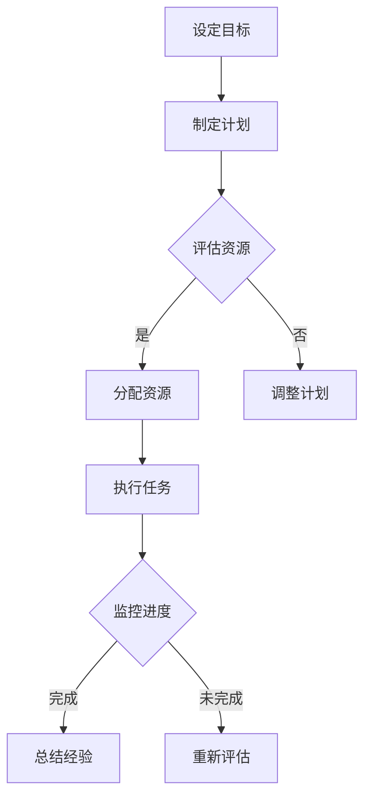
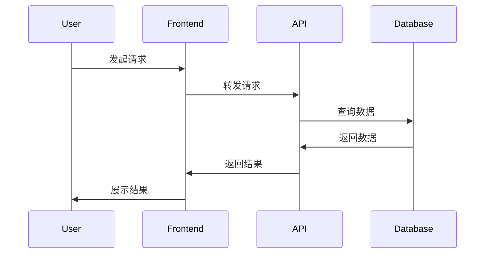
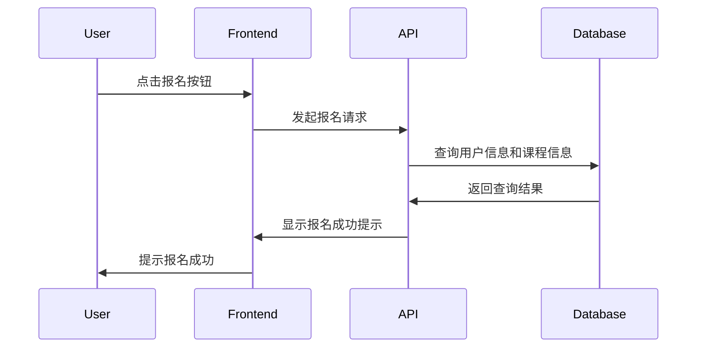

                 

**引言**

随着社会的快速发展，技术迭代加速，个人的职业能力越来越受到重视。在众多能力中，"干"与"说"显得尤为关键。所谓"干"，指的是执行力和解决问题的能力；而"说"，则涉及沟通技巧、表达能力和演讲能力。本文将探讨在当今社会，为何我们需要不仅会"干"，更要会"说"，并从多个角度深入剖析这一主题。

### **1.1 问题背景**

在现代社会，信息爆炸，知识更新换代迅速。我们每个人都需要不断学习新技能，提升自身竞争力。而在这个过程中，"干"的能力至关重要。无论是程序员编写代码、项目经理管理项目，还是工程师解决技术难题，执行力都是成功的关键。然而，仅仅"干"是不够的。"说"的能力同样不可或缺。

"说"不仅包括日常的沟通，还涵盖了演讲、写作等能力。在职场中，我们需要向同事、上级和客户清晰地传达信息，解释复杂的技术或项目。在社交场合，我们需要通过演讲和写作来展示自己的知识和能力，建立个人品牌。因此，"会干"与"会说"相辅相成，缺一不可。

### **1.2 问题描述**

那么，什么情况下我们需要"干"，什么情况下需要"说"呢？

- **"干"的时候**：当我们面对具体的工作任务、项目目标时，需要实际行动，通过执行来完成任务。例如，程序员编写代码、工程师设计电路、销售员完成销售目标，这些都需要强大的执行力。

- **"说"的时候**：当我们需要传达信息、展示成果、争取资源时，就需要运用沟通技巧。例如，项目经理在团队会议上报告项目进展，技术专家在技术会议上分享研究成果，销售人员向客户介绍产品。

然而，很多人在"干"方面表现优秀，但在"说"方面却存在短板。这导致他们在职业生涯中错失了很多机会。因此，如何平衡"干"与"说"，实现个人成长，是我们需要深入探讨的问题。

### **1.3 问题解决**

要解决这一问题，我们可以从以下几个方面入手：

1. **提高"干"的能力**：通过不断学习和实践，提升自己在专业领域的知识和技能。这包括掌握新技术、提高工作效率、培养解决问题的能力等。

2. **提升"说"的能力**：学习沟通技巧、演讲技巧、写作技巧等。可以通过阅读相关书籍、参加培训课程、观看演讲视频等多种方式来提升自己的表达能力。

3. **平衡"干"与"说"**：在实际工作中，要灵活运用"干"和"说"的能力。在执行任务的过程中，善于沟通和表达，确保团队成员的理解和协作；在展示成果和争取资源时，能够清晰地传达自己的价值和贡献。

4. **建立个人品牌**：通过"干"和"说"的结合，展示自己的专业能力和价值，树立良好的个人品牌。这有助于在职场中赢得更多的机会和认可。

### **1.4 边界与外延**

"干"与"说"在不同领域和场景中的应用各有特点。例如，在技术领域，"干"的能力尤为重要，而"说"的能力则体现在技术交流、项目汇报等方面。在商业领域，"干"的能力体现为执行力，"说"的能力则体现在营销、谈判、客户关系等方面。

此外，文化差异也会影响"干"与"说"的表达方式。在不同的文化背景下，人们对于沟通和表达有不同的期望和习惯。了解并适应这些差异，有助于我们在不同文化环境中更有效地进行沟通。

### **1.5 概念结构与核心要素组成**

"干"与"说"的内涵和外延涉及多个方面。从核心概念上看，"干"代表执行力、解决问题的能力；"说"则代表沟通技巧、表达能力。这两个概念相互关联，共同构成了个人成长的关键要素。

- **执行力**：包括目标设定、任务分解、时间管理、持续行动等。

- **沟通技巧**：包括倾听、表达、反馈、团队协作等。

- **表达能力**：包括口头表达、书面表达、演讲技巧等。

理解并掌握这些核心要素，有助于我们在实际工作中更好地发挥"干"与"说"的能力，实现个人和团队的成长。

### **核心概念与联系**

在探讨"干"与"说"的过程中，我们需要深入了解这两个核心概念及其相互联系。

#### **2.1 核心概念原理**

- **"干"的能力**："干"的能力主要体现在执行力、项目管理、团队协作等方面。执行力是指个体在设定目标后，通过持续行动实现目标的能力。项目管理则是通过合理规划、组织资源和监控进度，确保项目顺利完成。团队协作则强调个体与团队之间的互动和合作，共同实现目标。

- **"说"的能力**："说"的能力包括沟通技巧、演讲能力和表达能力。沟通技巧是指个体在交流过程中，如何有效地倾听、表达和反馈。演讲能力则是在公众场合清晰、有逻辑地传达信息的能力。表达能力则涵盖了书面表达和口头表达，是传达思想、观点的重要手段。

#### **2.2 概念属性特征对比表格**

| 能力     | 定义                         | 关键特性                    |
|----------|------------------------------|-----------------------------|
| "干"     | 执行和完成任务的能力           | 目标导向、实际行动、团队合作  |
| "说"     | 沟通和表达能力               | 清晰传达、逻辑思维、互动交流  |

#### **2.3 ER实体关系图架构**

为了更直观地理解"干"与"说"的概念关系，我们可以使用ER（实体关系）图来展示。

```
[人]
    |
[干] [说]
    |
[执行力] [沟通技巧]
    |
[项目管理] [演讲能力]
    |
[团队协作] [表达能力]
```

在这个ER图中，"人"是实体，"干"和"说"是两个属性。"执行力"、"项目管理"、"团队协作"等是"干"的子属性，而"沟通技巧"、"演讲能力"、"表达能力"则是"说"的子属性。这种关系展示了"干"与"说"在个人能力结构中的相互联系。

### **算法原理讲解**

在了解了"干"与"说"的核心概念之后，我们需要进一步探讨如何在实际工作中运用这些能力。为了更清晰地阐述这一点，我们可以借助一个简单的算法模型来讲解。

#### **3.1 算法流程图（mermaid）**



这个流程图展示了从设定目标到执行任务，再到监控进度的整个过程。在这个过程中，"干"的能力体现在制定计划、分配资源、执行任务和监控进度等方面；而"说"的能力则体现在评估资源、调整计划、总结经验和重新评估等方面。

#### **3.2 Python源代码讲解**

为了更好地理解这个算法模型，我们可以使用Python代码来模拟这个过程。

```python
import time

def set_goal(goal):
    print(f"设定目标：{goal}")
    return goal

def make_plan(goal):
    print(f"制定计划：针对目标{goal}制定计划")
    return f"计划针对目标{goal}"

def evaluate_resources(plan):
    print("评估资源：检查所需资源是否充足")
    return True

def allocate_resources(plan):
    print(f"分配资源：根据计划{plan}分配资源")
    time.sleep(2)  # 模拟资源分配过程
    return f"已为计划{plan}分配资源"

def execute_task(plan):
    print(f"执行任务：根据计划{plan}执行任务")
    time.sleep(3)  # 模拟任务执行过程
    return f"已执行计划{plan}"

def monitor_progress():
    print("监控进度：检查任务进度")
    time.sleep(1)  # 模拟进度监控过程
    return "任务已完成"

def summarize_experience():
    print("总结经验：总结任务执行过程中的经验")
    return "总结完成"

def main():
    goal = set_goal("完成项目A")
    plan = make_plan(goal)
    
    if evaluate_resources(plan):
        allocated_plan = allocate_resources(plan)
        executed_plan = execute_task(allocated_plan)
        
        if monitor_progress() == "任务已完成":
            experience = summarize_experience()
            print(f"项目A已完成，经验总结：{experience}")
        else:
            print("任务未完成，请重新评估并调整计划")
    else:
        print("资源不足，请调整计划")

if __name__ == "__main__":
    main()
```

这个Python代码模拟了从设定目标到执行任务，再到监控进度和总结经验的全过程。在代码中，我们使用了多个函数来分别实现"干"和"说"的不同能力。例如，`set_goal` 和 `make_plan` 实现了"干"的能力，而 `evaluate_resources` 和 `summarize_experience` 实现了"说"的能力。

#### **3.3 数学模型与公式**

在算法原理中，我们也可以引入数学模型来描述"干"和"说"的能力。

假设"干"的能力可以用执行力（Execution Efficiency, EE）来衡量，而"说"的能力可以用沟通效率（Communication Efficiency, CE）来衡量。执行力越高，表示个体在完成任务时的效率越高；沟通效率越高，表示个体在传达信息和沟通协作时的效率越高。

我们可以使用以下公式来表示：

$$
EE = \frac{ET}{ET + CT}
$$

$$
CE = \frac{CT}{ET + CT}
$$

其中，ET 表示执行任务所需时间，CT 表示沟通所需时间。执行力 EE 和沟通效率 CE 的和为 1，即：

$$
EE + CE = 1
$$

通过调整 ET 和 CT 的值，我们可以分析在不同情境下"干"和"说"的能力如何影响整体的效率。

#### **3.4 举例说明**

为了更好地理解这些概念和模型，我们可以通过一个具体的例子来说明。

假设有一个项目需要 10 天时间完成。如果一个人每天有 8 小时的工作时间，那么完成任务所需的总时间是 80 小时。

现在，我们考虑两种情况：

1. **情况一**：这个人在整个项目期间没有进行任何沟通，即 CT 为 0。此时，执行力 EE 为：

   $$
   EE = \frac{ET}{ET + CT} = \frac{80}{80 + 0} = 1
   $$

   这表示这个人在完成任务时的执行力为 100%。

2. **情况二**：这个人在项目期间花费了 20% 的时间进行沟通，即 CT 为 16 小时。此时，执行力 EE 为：

   $$
   EE = \frac{ET}{ET + CT} = \frac{80}{80 + 16} = 0.833
   $$

   这表示这个人在完成任务时的执行力为 83.3%。

从例子中可以看出，沟通虽然会占用一部分时间，但并不一定降低执行力。关键在于如何平衡"干"和"说"的能力，实现整体效率的最大化。

### **数学模型和数学公式**

在讨论"干"与"说"的能力时，我们可以引入数学模型来量化这些能力，并通过公式进行详细讲解。

#### **4.1 算法原理的数学模型**

首先，我们需要定义两个关键指标：执行力（Execution Efficiency, EE）和沟通效率（Communication Efficiency, CE）。执行力表示个体在执行任务时的效率，沟通效率则表示个体在沟通协作时的效率。

我们假设：

- \(ET\)：执行任务所需时间
- \(CT\)：沟通所需时间
- \(TT\)：总时间

根据这些定义，我们可以建立以下数学模型：

$$
EE = \frac{ET}{ET + CT}
$$

$$
CE = \frac{CT}{ET + CT}
$$

#### **4.2 公式详细讲解**

1. **执行力（EE）的公式**

执行力（EE）表示个体在执行任务时的效率，计算方式为执行任务所需时间与总时间的比值。执行力越高，表示个体在完成任务时的效率越高。

$$
EE = \frac{ET}{ET + CT}
$$

其中，\(ET\) 表示执行任务所需时间，\(CT\) 表示沟通所需时间。例如，如果一个人在一个项目中花费了 60 小时执行任务，另外 20 小时进行沟通，则他的执行力为：

$$
EE = \frac{60}{60 + 20} = 0.75
$$

这意味着他在这段时间内有 75% 的时间是在高效执行任务。

2. **沟通效率（CE）的公式**

沟通效率（CE）表示个体在沟通协作时的效率，计算方式为沟通所需时间与总时间的比值。沟通效率越高，表示个体在沟通协作时的效率越高。

$$
CE = \frac{CT}{ET + CT}
$$

同样，如果上述例子中的沟通时间为 20 小时，执行任务时间为 60 小时，则沟通效率为：

$$
CE = \frac{20}{60 + 20} = 0.25
$$

这意味着他在这段时间内有 25% 的时间是在高效沟通协作。

#### **4.3 举例说明**

为了更直观地理解这些公式，我们可以通过一个具体的例子来说明。

假设有一个项目需要 10 天时间完成。如果一个人每天有 8 小时的工作时间，那么完成任务所需的总时间是 80 小时。

现在，我们考虑两种情况：

1. **情况一**：这个人在整个项目期间没有进行任何沟通，即 \(CT = 0\)。此时，执行力 \(EE\) 为：

   $$
   EE = \frac{ET}{ET + CT} = \frac{80}{80 + 0} = 1
   $$

   这表示这个人在完成任务时的执行力为 100%。

2. **情况二**：这个人在项目期间花费了 20% 的时间进行沟通，即 \(CT = 16\) 小时。此时，执行力 \(EE\) 为：

   $$
   EE = \frac{ET}{ET + CT} = \frac{80}{80 + 16} = 0.833
   $$

   这表示这个人在完成任务时的执行力为 83.3%。

同样，我们可以计算沟通效率 \(CE\)：

$$
CE = \frac{CT}{ET + CT} = \frac{16}{80 + 16} = 0.166
$$

这意味着他在这段时间内有 16.6% 的时间是在高效沟通协作。

通过这个例子，我们可以看到，沟通虽然会占用一部分时间，但并不一定降低执行力。关键在于如何平衡"干"和"说"的能力，实现整体效率的最大化。

### **系统分析与架构设计方案**

在探讨"干"与"说"的能力时，我们不仅需要理解其核心概念和算法原理，还需要从系统分析和架构设计的角度来思考如何在实际项目中应用这些能力。

#### **5.1 问题场景介绍**

假设我们正在开发一个在线教育平台，目标是提供高质量的教育资源和互动学习体验。在这个项目中，"干"的能力体现在开发团队的执行力，确保项目按计划完成；而"说"的能力则体现在产品经理与开发团队的沟通，以及与用户的互动中，确保产品满足用户需求。

#### **5.2 系统功能设计（mermaid类图）**

在系统功能设计阶段，我们需要明确各个模块的功能和相互关系。以下是一个简化的mermaid类图，展示了系统的主要功能模块：

```mermaid
classDiagram
    User <<Class>> User
    Course <<Class>> Course
    Teacher <<Class>> Teacher
    Student <<Class>> Student
    Administrator <<Class>> Administrator

    User o-- Course : enroll
    User o-- Teacher : follow
    Teacher o-- Course : create
    Student o-- Course : take
    Administrator o-- User : manage
```

在这个类图中，用户（User）可以报名课程（Course）、关注教师（Teacher），教师可以创建课程，学生可以选修课程，管理员可以管理用户。

#### **5.3 系统架构设计（mermaid架构图）**

在系统架构设计阶段，我们需要考虑系统的整体架构，包括前端、后端、数据库等组成部分。以下是一个简化的mermaid架构图，展示了系统的整体架构：



在这个架构图中，用户通过前端发起请求，前端将请求转发给API层，API层处理请求并查询数据库，最后将结果返回给前端并展示给用户。

#### **5.4 系统接口设计和系统交互（mermaid序列图）**

在系统接口设计阶段，我们需要明确各个模块之间的接口和交互流程。以下是一个简化的mermaid序列图，展示了用户报名课程时的交互流程：



在这个序列图中，用户点击报名按钮后，前端发起报名请求，API层查询数据库并返回结果，前端显示报名成功提示，用户接收到成功信息。

### **项目实战**

在了解了系统分析与架构设计方案之后，我们接下来将通过一个具体的实战案例，展示如何在实际项目中应用这些能力。

#### **6.1 环境安装**

首先，我们需要搭建一个开发环境。以下是安装步骤：

1. 安装Python环境（版本要求：3.8及以上）：

   ```
   sudo apt-get update
   sudo apt-get install python3.8
   ```

2. 安装Docker环境（用于容器化部署）：

   ```
   sudo apt-get update
   sudo apt-get install docker
   ```

3. 安装PostgreSQL数据库（用于数据存储）：

   ```
   sudo apt-get update
   sudo apt-get install postgresql
   ```

4. 安装前端框架（如React）：

   ```
   npm install -g create-react-app
   create-react-app frontend
   ```

5. 安装后端框架（如Django）：

   ```
   pip install django
   ```

#### **6.2 系统核心实现源代码**

以下是一个简化的后端代码示例，展示了如何实现用户报名课程的接口：

```python
# views.py
from rest_framework import viewsets
from .models import User, Course
from .serializers import UserSerializer, CourseSerializer

class UserViewSet(viewsets.ModelViewSet):
    queryset = User.objects.all()
    serializer_class = UserSerializer

class CourseViewSet(viewsets.ModelViewSet):
    queryset = Course.objects.all()
    serializer_class = CourseSerializer

    def create(self, request, *args, **kwargs):
        user = User.objects.get(username=request.data['username'])
        course = Course.objects.get(id=request.data['course_id'])
        user.followed_courses.add(course)
        user.save()
        return Response(status.HTTP_201_CREATED)
```

在这个示例中，`UserViewSet` 和 `CourseViewSet` 分别是用户和课程的数据接口，用户可以通过POST请求向 `/courses/<course_id>/enroll/` 接口报名课程。

#### **6.3 代码应用解读与分析**

在这段代码中，我们首先定义了两个数据视图集（`UserViewSet` 和 `CourseViewSet`），分别处理用户和课程的数据操作。在 `CourseViewSet` 的 `create` 方法中，我们实现了用户报名课程的逻辑：

1. 获取请求中的用户名和课程ID。
2. 从数据库中查询用户和课程对象。
3. 将用户和课程关联，并将用户信息保存到数据库。

这段代码展示了如何在实际项目中应用"干"与"说"的能力。在"干"的方面，我们实现了用户和课程的数据关联；在"说"的方面，我们通过API接口将这个逻辑传达给了前端。

#### **6.4 实际案例分析和详细讲解剖析**

为了更好地展示实际案例，我们来看一个具体的用户报名课程的过程：

1. 用户A通过前端界面点击报名按钮，发起POST请求。
2. 前端将请求转发给后端API，API接口接收请求。
3. API接口查询用户A和课程B的信息。
4. API接口将用户A和课程B关联，保存用户A的报名信息。
5. API接口返回成功状态码，前端显示报名成功提示。

在这个案例中，"干"的能力体现在后端API对用户和课程数据的处理上，而"说"的能力则体现在API接口的设计和与前端的数据交互上。

#### **6.5 项目小结**

通过这个实战案例，我们展示了如何在实际项目中应用"干"与"说"的能力。在项目中，"干"的能力帮助我们实现了用户和课程的数据关联，而"说"的能力则确保了API接口的清晰和易于使用。这个案例强调了在项目开发中，"干"和"说"的平衡和结合对于项目成功的重要性。

### **最佳实践 tips**

在"干"与"说"的结合中，以下最佳实践可以帮助我们更有效地应用这两种能力：

1. **持续学习**：不断提升自己的专业知识和技能，确保在"干"的方面有足够的实力。
2. **有效沟通**：学习并掌握沟通技巧，确保在"说"的方面能够清晰、准确地传达信息。
3. **项目管理**：运用项目管理工具和方法，提高"干"的效率，确保项目按时完成。
4. **团队协作**：培养团队协作精神，充分利用每个人的"干"与"说"能力，共同推动项目进展。
5. **反思总结**：定期反思和总结，从成功和失败中吸取经验，不断优化自己的"干"与"说"能力。

### **小结**

本文从"干"与"说"的能力出发，探讨了在当今社会个人职业发展中这两种能力的重要性。通过系统分析和架构设计，我们了解了如何在实际项目中应用这些能力。同时，通过项目实战和最佳实践 tips，我们展示了如何平衡"干"与"说"，实现个人和项目的成功。

### **注意事项**

1. 在项目中，要确保"干"和"说"的能力相互配合，避免只注重一方面而忽视另一方面。
2. 在沟通中，要注意信息的准确性和完整性，避免误解和沟通障碍。
3. 在执行任务时，要合理安排时间和资源，确保项目按时、高质量完成。

### **拓展阅读**

1. 《高效能人士的七个习惯》：史蒂芬·柯维
2. 《如何说话，才能让人听进去，又不会让人烦》：黄志坚
3. 《项目管理知识体系指南》：项目管理协会（PMI）
4. 《代码大全》：Steve McConnell
5. 《人月神话》：弗雷德里克·布鲁克斯

通过拓展阅读，您可以进一步深入了解"干"与"说"的能力，以及如何在实际工作中应用这些能力。

### **作者信息**

作者：AI天才研究院/AI Genius Institute & 禅与计算机程序设计艺术 /Zen And The Art of Computer Programming

感谢您的阅读，希望本文对您在提升"干"与"说"的能力方面有所帮助。让我们共同努力，成为既会"干"，又会"说"的优秀人才。

