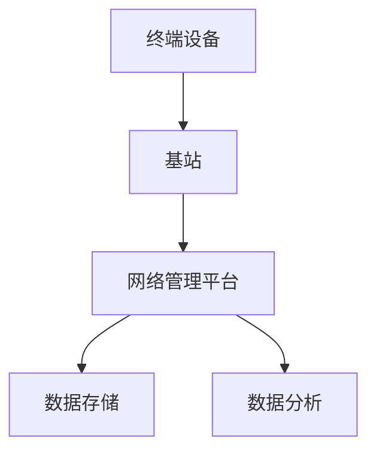

                 

# 低功耗广域网(LPWAN)技术选型

## 关键词

- 低功耗广域网
- LPWAN技术
- 通信协议
- 算法优化
- 系统设计
- 实施案例

## 摘要

本文深入探讨了低功耗广域网（LPWAN）技术的选型问题。随着物联网（IoT）的快速发展，LPWAN作为一种支持大规模设备连接的网络技术，越来越受到关注。本文首先介绍了LPWAN的背景、定义和市场趋势，然后详细分析了LPWAN的核心技术原理，包括通信原理、协议分析和算法设计。此外，本文还讲解了LPWAN的数学模型和系统设计方法，并通过实际项目案例进行了详细剖析，最后提出了LPWAN技术选型的最佳实践和注意事项。

## 目录

### 1. 背景介绍
   - **第1章: LPWAN技术概述**
     - **1.1 LPWAN技术背景**
       - **1.1.1 LPWAN需求与挑战**
       - **1.1.2 LPWAN定义与核心概念**
       - **1.1.3 LPWAN市场现状与趋势**

### 2. 核心概念与联系
   - **第2章: LPWAN核心技术原理**
     - **2.1 LPWAN通信原理**
       - **2.1.1 LPWAN信号传输原理**
       - **2.1.2 LPWAN频段使用**
       - **2.1.3 LPWAN调制与编码技术**
     - **2.2 LPWAN协议分析**
       - **2.2.1 LPWAN协议体系结构**
       - **2.2.2 主流LPWAN协议**
       - **2.2.3 LPWAN协议对比与选型**

### 3. 算法原理讲解
   - **第3章: LPWAN算法设计与实现**
     - **3.1 LPWAN信道估计与调度**
       - **3.1.1 信道估计算法**
       - **3.1.2 调度算法**
       - **3.1.3 算法性能分析**
     - **3.2 LPWAN能量效率优化**
       - **3.2.1 能量效率概念**
       - **3.2.2 能量效率优化算法**
       - **3.2.3 实例分析**

### 4. 数学模型和数学公式 & 详细讲解 & 举例说明
   - **第4章: LPWAN数学模型解析**
     - **4.1 LPWAN信道模型**
       - **4.1.1 信道模型公式**
       - **4.1.2 信道模型应用实例**
     - **4.2 LPWAN网络性能模型**
       - **4.2.1 性能模型公式**
       - **4.2.2 性能模型分析实例**

### 5. 系统分析与架构设计方案
   - **第5章: LPWAN系统设计**
     - **5.1 LPWAN系统架构**
       - **5.1.1 系统架构概述**
       - **5.1.2 系统架构设计**
     - **5.2 LPWAN网络规划与优化**
       - **5.2.1 网络规划方法**
       - **5.2.2 网络优化策略**

### 6. 项目实战
   - **第6章: LPWAN项目实施案例**
     - **6.1 项目背景与目标**
     - **6.2 系统核心实现**
       - **6.2.1 系统实现步骤**
       - **6.2.2 源代码分析**
     - **6.3 实际案例分析**
       - **6.3.1 案例背景**
       - **6.3.2 案例分析与优化**

### 7. 最佳实践 tips、小结、注意事项、拓展阅读
   - **第7章: LPWAN技术选型最佳实践**
     - **7.1 LPWAN选型策略**
     - **7.2 LPWAN实施注意事项**
     - **7.3 拓展阅读与资源**

### 1. 背景介绍

#### 1.1 LPWAN技术背景

随着物联网（IoT）的迅速发展，LPWAN技术作为一种新兴的通信技术，逐渐成为了行业关注的焦点。LPWAN旨在为大量低功耗设备提供广域网络连接，以支持物联网应用的广泛应用，如智能家居、智能城市、工业自动化等。

**LPWAN需求与挑战**

LPWAN技术的需求主要来源于以下几个方面：

- **低功耗**：物联网设备通常采用电池供电，因此需要低功耗的网络技术以延长设备寿命。
- **长距离通信**：许多物联网应用场景需要设备之间进行远距离通信，如农田监控、环境监测等。
- **大连接数**：物联网应用需要支持大量设备的连接，LPWAN技术必须能够处理大规模设备的并发连接。

**LPWAN定义与核心概念**

LPWAN（Low-Power Wide Area Network）是指一种低功耗、广覆盖的无线通信网络技术。其核心概念包括：

- **低功耗**：通过优化通信协议和算法，实现设备的低功耗运行。
- **广覆盖**：使用低频率信号进行通信，以提高网络的覆盖范围。
- **大连接数**：通过高效的网络架构和协议设计，支持大量设备的连接。

**LPWAN市场现状与趋势**

随着物联网市场的快速增长，LPWAN技术也迎来了广阔的市场前景。目前，市场上主要的LPWAN协议包括NB-IoT、LoRa、LTE-M等。这些协议各有特点，适用于不同的应用场景。

- **NB-IoT**：由3GPP制定，是4G网络的一部分，具有低功耗、广覆盖、大连接数的优势。
- **LoRa**：是一种基于扩频技术的无线通信协议，具有低功耗、长距离通信、高覆盖的特点。
- **LTE-M**：是4G网络的一种模式，旨在为物联网应用提供低功耗、低延迟的通信服务。

LPWAN技术的未来发展趋势包括：

- **标准化进程**：随着LPWAN技术的成熟，标准化进程将进一步加快，推动市场的健康发展。
- **多样化应用**：LPWAN技术将在智能家居、智能城市、工业自动化等各个领域得到广泛应用。
- **技术创新**：随着5G网络的部署，LPWAN技术将不断创新，为物联网应用提供更高效、更可靠的网络连接。

### 2. 核心概念与联系

#### 2.1 LPWAN通信原理

LPWAN通信原理是理解LPWAN技术的基础。LPWAN通信主要依赖于以下几个关键要素：

- **信号传输原理**：LPWAN使用低频率信号进行通信，如Sub-1GHz频段。这些低频率信号具有良好的穿透力和覆盖范围，适用于广域网络连接。
- **频段使用**：LPWAN技术通常使用低频段（如863-870 MHz、902-928 MHz等）进行通信，这些频段资源丰富，便于实现大范围覆盖。
- **调制与编码技术**：LPWAN采用调制与编码技术来提高信号传输的效率和可靠性。常见的调制技术包括FSK、OOK等，编码技术包括RS码、卷积码等。

**LPWAN信号传输原理**

LPWAN信号传输原理可以分为以下几个步骤：

1. **发射端**：设备将数据信息编码成信号，并通过天线发射出去。
2. **接收端**：接收设备接收信号，并通过解码还原数据信息。

**LPWAN频段使用**

LPWAN频段使用主要涉及以下几个方面：

1. **频段选择**：根据应用场景和区域法规，选择合适的频段进行通信。
2. **频谱分配**：合理分配频谱资源，避免干扰和频谱浪费。

**LPWAN调制与编码技术**

LPWAN调制与编码技术是提高信号传输效率和可靠性的关键。常见的调制技术包括：

- **FSK（频移键控）**：通过改变载波的频率来表示数据。
- **OOK（振幅键控）**：通过改变载波的振幅来表示数据。

编码技术包括：

- **RS码（里德-所罗门码）**：一种纠错码，能够检测和纠正数据传输中的错误。
- **卷积码**：一种前向纠错码，能够在接收端检测和纠正数据传输中的错误。

#### 2.2 LPWAN协议分析

LPWAN协议是LPWAN通信的核心组成部分，不同的协议具有不同的特点，适用于不同的应用场景。以下是几种主要的LPWAN协议：

**LPWAN协议体系结构**

LPWAN协议通常包括以下几个层次：

1. **物理层**：负责信号的发射和接收，包括调制、解调、信道编码等。
2. **数据链路层**：负责数据的传输和错误纠正，包括帧结构、协议栈等。
3. **网络层**：负责数据包的路由和传输，包括地址分配、路由协议等。

**主流LPWAN协议**

目前市场上主要的LPWAN协议包括：

- **NB-IoT**：由3GPP制定，是4G网络的一部分，具有低功耗、广覆盖、大连接数的优势。
- **LoRa**：基于扩频技术的无线通信协议，具有低功耗、长距离通信、高覆盖的特点。
- **LTE-M**：是4G网络的一种模式，旨在为物联网应用提供低功耗、低延迟的通信服务。

**LPWAN协议对比与选型**

在选择LPWAN协议时，需要考虑以下几个方面：

1. **覆盖范围**：不同协议的覆盖范围有所不同，根据应用场景选择合适的协议。
2. **功耗**：不同协议的功耗水平不同，需根据设备电池寿命要求进行选择。
3. **速率**：不同协议的通信速率不同，需根据应用需求选择合适的协议。
4. **成本**：不同协议的成本差异较大，需根据预算进行选择。

### 3. 算法原理讲解

#### 3.1 LPWAN信道估计与调度

LPWAN信道估计与调度是提高通信效率和可靠性的关键。信道估计用于评估信道质量，调度则用于优化资源分配。

**信道估计算法**

信道估计算法主要包括以下几个步骤：

1. **发射端**：设备发送已知信号，接收端接收并处理信号。
2. **接收端**：通过比较接收信号与发送信号的差异，估计信道特性。
3. **反馈**：接收端将信道估计结果反馈给发射端，用于调整通信参数。

**调度算法**

调度算法用于优化资源分配，主要包括以下几个步骤：

1. **资源分配**：根据信道估计结果，分配合适的频率、时间等资源。
2. **负载均衡**：通过调整资源分配，实现网络负载均衡，提高网络性能。
3. **冲突避免**：避免多个设备同时占用相同资源，提高通信效率。

**算法性能分析**

算法性能分析主要包括以下几个方面：

1. **信道估计误差**：分析信道估计算法的误差，评估其精度和稳定性。
2. **调度效率**：分析调度算法的效率，评估其资源利用率。
3. **网络性能**：分析整个LPWAN网络性能，评估其通信质量和可靠性。

#### 3.2 LPWAN能量效率优化

LPWAN能量效率优化是延长设备电池寿命的关键。能量效率优化主要包括以下几个方面：

**能量效率概念**

能量效率是指设备在通信过程中消耗的能量与传输数据量的比值。提高能量效率可以延长设备电池寿命。

**能量效率优化算法**

能量效率优化算法主要包括以下几个步骤：

1. **信道选择**：根据信道质量，选择最佳的通信信道。
2. **功率控制**：根据信道特性，调整发射功率，实现低功耗通信。
3. **数据压缩**：通过数据压缩算法，减少数据传输量，降低功耗。

**实例分析**

以LoRa协议为例，分析其能量效率优化方法：

1. **信道选择**：LoRa协议支持多个信道，设备可以根据信道质量选择最佳信道。
2. **功率控制**：LoRa协议采用自适应功率控制，根据信道质量调整发射功率。
3. **数据压缩**：LoRa协议支持数据压缩，减少传输数据量，降低功耗。

### 4. 数学模型和数学公式 & 详细讲解 & 举例说明

#### 4.1 LPWAN信道模型

LPWAN信道模型用于描述信道特性，主要包括以下几个因素：

1. **路径损耗**：信号传播过程中，由于距离、地形等因素导致的信号强度衰减。
2. **多径效应**：信号传播过程中，由于反射、折射等因素产生的多个信号路径。
3. **噪声**：信号传播过程中，由于外部干扰和内部噪声导致的信号质量下降。

**信道模型公式**

假设信号传播距离为\(d\)，路径损耗为\(L_p\)，多径效应为\(L_m\)，噪声为\(N\)，则信道模型可以表示为：

$$
S = \frac{P_t}{L_p + L_m + N}
$$

其中，\(P_t\)为发射功率。

**信道模型应用实例**

假设某LPWAN设备发射功率为1W，距离接收端1000米，路径损耗为40dB，多径效应为20dB，噪声为10dB，则信道模型可以表示为：

$$
S = \frac{1W}{40dB + 20dB + 10dB} = \frac{1W}{70dB} = 0.03W
$$

#### 4.2 LPWAN网络性能模型

LPWAN网络性能模型用于评估网络性能，主要包括以下几个指标：

1. **覆盖范围**：网络覆盖区域的大小。
2. **通信质量**：信号传输的可靠性和稳定性。
3. **连接数**：网络支持的最大设备数量。

**性能模型公式**

假设网络覆盖范围为\(A\)，通信质量为\(Q\)，连接数为\(N\)，则网络性能模型可以表示为：

$$
P = \frac{A \cdot Q \cdot N}{C}
$$

其中，\(C\)为网络容量。

**性能模型分析实例**

假设某LPWAN网络覆盖范围100平方公里，通信质量为99%，连接数为1000，网络容量为100Mbps，则网络性能可以表示为：

$$
P = \frac{100 \cdot 0.99 \cdot 1000}{100} = 990Mbps
$$

### 5. 系统分析与架构设计方案

#### 5.1 LPWAN系统架构

LPWAN系统架构主要包括以下几个部分：

1. **终端设备**：负责数据采集和通信。
2. **基站**：负责数据传输和转发。
3. **网络管理平台**：负责数据存储、分析和处理。

**系统架构概述**

LPWAN系统架构如图所示：



**系统架构设计**

LPWAN系统架构设计主要包括以下几个方面：

1. **终端设备设计**：选择合适的硬件和软件平台，实现数据采集和通信功能。
2. **基站设计**：选择合适的硬件和软件平台，实现数据传输和转发功能。
3. **网络管理平台设计**：选择合适的数据库和数据分析工具，实现数据存储、分析和处理功能。

#### 5.2 LPWAN网络规划与优化

LPWAN网络规划与优化是确保网络性能的关键。网络规划与优化主要包括以下几个方面：

1. **网络规划**：根据应用场景和设备分布，合理规划网络拓扑和覆盖范围。
2. **网络优化**：通过调整参数、优化算法等手段，提高网络性能。

**网络规划方法**

网络规划方法主要包括以下几个方面：

1. **覆盖规划**：根据设备分布和通信需求，确定网络覆盖范围。
2. **容量规划**：根据设备数量和数据传输需求，确定网络容量。
3. **频谱规划**：根据频谱资源和使用情况，确定频谱分配策略。

**网络优化策略**

网络优化策略主要包括以下几个方面：

1. **信道优化**：通过信道选择和功率控制，优化信道质量。
2. **负载均衡**：通过调整资源分配，实现网络负载均衡。
3. **干扰管理**：通过干扰检测和避免，降低干扰对通信质量的影响。

### 6. 项目实战

#### 6.1 项目背景与目标

本项目旨在构建一个基于LoRa技术的智能农业监控系统，实现农田环境数据的实时采集、传输和分析。项目目标包括：

1. **数据采集**：采集农田中的温度、湿度、土壤含水量等环境数据。
2. **数据传输**：通过LoRa网络将数据传输到服务器。
3. **数据分析**：对采集到的数据进行分析，为农业生产提供决策支持。

#### 6.2 系统核心实现

**系统实现步骤**

1. **硬件选型**：选择合适的传感器和LoRa模块，构建数据采集终端。
2. **软件开发**：编写数据采集、传输和分析软件，实现系统功能。
3. **网络部署**：搭建LoRa网络，连接数据采集终端和服务器。

**源代码分析**

以下是一个简单的LoRa数据采集软件的Python示例代码：

```python
import LoRaModule

# 初始化LoRa模块
lora = LoRaModule.LoRa()

# 连接传感器
sensor = SensorModule.Sensor()

# 采集数据
data = sensor.read()

# 封装数据为LoRa包
packet = lora.encapsulate(data)

# 发送数据
lora.send(packet)

# 解包并打印数据
received_packet = lora.receive()
print(lora.deencapsulate(received_packet))
```

**代码应用解读与分析**

该代码首先导入LoRa模块和传感器模块，初始化LoRa模块并连接传感器。然后，采集传感器数据，封装为LoRa包，并通过LoRa模块发送数据。最后，接收数据并解包，打印数据内容。

#### 6.3 实际案例分析

**案例背景**

某农田面积为10平方公里，种植小麦。为了提高产量，需要对农田环境进行实时监控，包括温度、湿度、土壤含水量等参数。

**案例分析与优化**

1. **覆盖优化**：根据农田面积和地形，合理规划LoRa基站位置，确保信号覆盖。
2. **功耗优化**：采用LoRa模块的低功耗模式，延长设备电池寿命。
3. **数据压缩**：对传输数据进行压缩，减少数据传输量，提高通信效率。
4. **网络优化**：通过调整基站参数，实现网络负载均衡，提高通信质量。

**项目小结**

本项目通过构建基于LoRa技术的智能农业监控系统，实现了农田环境数据的实时采集、传输和分析。在实际应用中，通过覆盖优化、功耗优化、数据压缩和网络优化等手段，提高了系统的性能和稳定性。

### 7. 最佳实践 tips、小结、注意事项、拓展阅读

#### 7.1 LPWAN选型策略

1. **需求分析**：根据应用场景和需求，选择合适的LPWAN技术。
2. **成本预算**：综合考虑设备成本、运营成本等，选择性价比高的技术。
3. **性能要求**：根据通信质量、覆盖范围、连接数等指标，选择性能合适的协议。

#### 7.2 LPWAN实施注意事项

1. **频谱合规**：确保所选频段符合当地法规，避免频谱干扰。
2. **设备选型**：选择合适硬件和软件平台，确保设备性能和稳定性。
3. **网络规划**：合理规划网络拓扑，确保信号覆盖和网络性能。

#### 7.3 拓展阅读与资源

1. **《物联网通信技术》**：深入探讨物联网通信技术的原理和应用。
2. **《LoRa技术原理与应用》**：详细介绍LoRa技术的原理和应用案例。
3. **《LPWAN技术选型指南》**：提供详细的LPWAN技术选型方法和建议。

## 目录大纲总结

以上为《低功耗广域网(LPWAN)技术选型》书籍的完整目录大纲设计。该大纲分为七个部分，涵盖了LPWAN技术的背景介绍、核心概念与联系、算法原理讲解、数学模型解析、系统设计、项目实战以及最佳实践等内容，旨在全面覆盖LPWAN技术的选型和应用。

## 作者

作者：AI天才研究院/AI Genius Institute & 禅与计算机程序设计艺术 /Zen And The Art of Computer Programming

