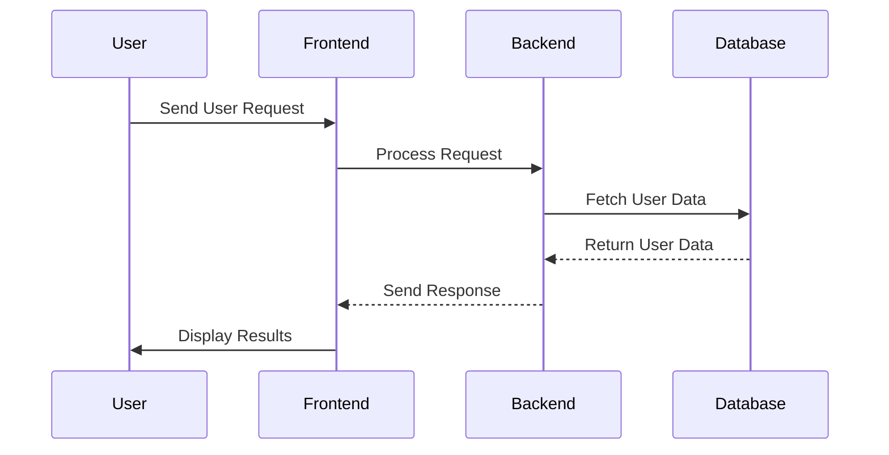

                 

# 《使你成功的也阻止你进步》

## 关键词
- 成功与进步
- 成功陷阱
- 个人发展
- 习惯力量
- 进步障碍
- 平衡策略

## 摘要
本文深入探讨了在IT领域，成功与进步之间的关系。尽管成功往往被视为个人和职业发展的终极目标，但本文揭示了成功可能带来的负面影响和障碍。文章通过详细分析成功的定义、代价、陷阱以及如何平衡成功与进步，旨在帮助读者在追求成功的同时，不失去进步的动力和方向。

## 引言

在信息技术行业，成功似乎成为了一种无可厚非的追求。无论是获得顶尖公司的offer，还是成为技术社区的明星，成功似乎总是吸引着无数人的目光。然而，成功的背后，往往隐藏着一些不为人知的陷阱。这些陷阱，不仅可能阻碍我们的进步，甚至可能让我们在不知不觉中偏离最初的目标。

本文将带你一步步深入探讨这些陷阱，理解成功背后的代价，识别阻碍进步的因素，并最终找到一条在成功与进步之间找到平衡的道路。通过本文的阅读，你将能够：

1. 理解成功的多重含义及其背后的误区。
2. 认识到成功可能带来的负面效应。
3. 学会如何识别并避免陷入成功的陷阱。
4. 掌握在追求成功的同时保持进步的方法。
5. 构建一个可持续发展的职业和个人成长模型。

## 第一部分：成功的陷阱

### 第1章：成功的定义与误区

#### 1.1 成功的标准

成功，这个词似乎无处不在，每个人对它的定义也有所不同。但对于大多数人来说，成功往往与财富、地位、名誉和成就联系在一起。在IT行业，成功可能意味着成为一家顶尖公司的员工，或者拥有自己的初创企业，并在市场上获得成功。

然而，这种对成功的狭隘理解，往往让我们陷入了一个误区。成功不仅仅是一个结果，它更是一个过程。它包括我们在实现目标的过程中所经历的挑战、学习、成长和反思。成功的标准也不应该只是外在的成就，而是内在的成长和自我实现。

#### 1.2 成功背后的误区

误区之一是对成功的过度追求。许多人将成功视为生活的全部，他们的每一个决策和行动都是为了追求成功。这种极端的追求往往导致他们忽视了生活中的其他重要方面，如家庭、健康和人际关系。

误区之二是对成功的误解。很多人认为成功是一种终极状态，一旦达到，就可以永远享受。然而，成功并不是静态的，它需要不断地维护和更新。忽视了这一点，就会让我们在取得成功后陷入舒适区，失去进步的动力。

误区之三是对成功的急功近利。在快速变化的IT行业，许多人希望通过迅速的成功来证明自己的价值。这种急功近利的心态，往往导致他们忽视了长期的发展规划，从而导致短视的决策。

#### 1.3 对成功的误解带来的问题

对成功的误解，会带来一系列的问题。首先，它可能导致个人生活的失衡。当成功成为生活的全部时，其他重要的方面，如家庭、健康和人际关系，往往会受到忽视，最终导致生活的破碎。

其次，对成功的误解，会阻碍个人的成长。当成功被看作是终极目标时，人们往往会停止学习，停止成长。这种停滞不前的心态，最终会让我们失去竞争力，被时代所淘汰。

最后，对成功的误解，会让我们陷入短视的决策。追求短期成功，往往会让我们忽视长期的发展规划，从而导致一系列的连锁反应，最终影响我们的长远发展。

### 第2章：成功的代价

#### 2.1 成功的代价分析

成功的代价，不仅包括物质上的付出，还有精神上的投入。在追求成功的过程中，我们需要付出大量的时间和精力，甚至需要牺牲一些个人生活的方面。

物质上的付出，包括教育投资、职业培训、业务拓展等。这些投资，虽然可以帮助我们提升自己的竞争力，但也会增加我们的经济负担。

精神上的投入，包括压力、焦虑、疲劳等。在追求成功的过程中，我们往往会面临巨大的压力和挑战。这种压力，不仅会影响我们的心理健康，还可能影响我们的工作效率和人际关系。

#### 2.2 成功对个人发展的阻碍

成功可能会对个人发展产生阻碍。一方面，成功可能会让我们陷入一种自我满足的状态，停止学习和成长。另一方面，成功可能会让我们失去创新和进取的动力，变得保守和僵化。

此外，成功也可能会影响我们的价值观和人际关系。在追求成功的过程中，我们可能会将成功作为衡量一切的标准，忽视其他重要的价值，如友情、爱情和道德。

#### 2.3 成功对人际关系的影响

成功对人际关系的影响也是不可忽视的。一方面，成功可能会让我们变得自大和孤傲，忽视他人的感受和需求。另一方面，成功可能会让我们陷入一种压力过大的状态，导致我们无法有效地与家人和朋友沟通。

此外，成功也可能会影响我们的社交圈子。成功往往吸引着相似的价值观和背景的人，这可能会导致我们的社交圈子变得单一和狭隘，失去与其他人交流和学习的机遇。

### 第3章：如何识别成功的陷阱

#### 3.1 陷阱的识别方法

要识别成功的陷阱，我们需要从多个角度来审视成功。首先，我们要明确成功的真正含义，不仅仅是外在的成就，更是内在的成长和自我实现。其次，我们要认识到成功是一个动态的过程，而不是一个终极状态。最后，我们要学会从长远的角度来审视成功，不仅仅关注短期成果，更关注长期的可持续性和发展。

#### 3.2 陷阱的案例分析

通过分析一些成功人士的案例，我们可以更好地理解成功的陷阱。例如，有些成功人士在达到事业巅峰后，因为忽视了个人生活和健康，最终导致家庭破裂和身体垮掉。还有一些人，因为过于追求成功，忽视了道德和法律，最终陷入困境。

#### 3.3 如何避免陷入成功的陷阱

为了避免陷入成功的陷阱，我们需要采取一系列的措施。首先，我们要树立正确的成功观，认识到成功不仅仅是外在的成就，更是内在的成长和自我实现。其次，我们要保持谦逊和开放的心态，不断学习和进步。最后，我们要注重平衡，保持生活和工作之间的平衡，不忽视其他重要的方面。

## 第二部分：进步的障碍

### 第4章：自我满足与进步的矛盾

#### 4.1 自我满足的定义与影响

自我满足是指个体在实现某一目标或达成某一成就后，感到满意和愉悦的心理状态。它反映了个体对自身能力和成就的认可。然而，自我满足也可能成为一种进步的障碍。

自我满足会影响我们的进步，因为它可能让我们停止进一步的努力和挑战。当我们感到满足时，我们可能会认为已经达到了自己的极限，从而停止学习和成长。

#### 4.2 自我满足与进步的关系

自我满足与进步之间的关系是复杂的。适当的自我满足可以激励我们继续努力，但过度的自我满足则会阻碍我们前进。因此，我们需要在自我满足和进步之间找到平衡。

#### 4.3 如何打破自我满足的枷锁

要打破自我满足的枷锁，我们需要采取一系列的措施。首先，我们要意识到自我满足可能带来的负面影响，并时刻提醒自己保持警觉。其次，我们要设定更高的目标，不断挑战自己的极限。最后，我们要保持谦虚和开放的心态，不断学习和吸收新的知识和经验。

### 第5章：习惯的力量

#### 5.1 习惯的形成与影响

习惯是指个体在长期重复某种行为后形成的稳定的心理和行为模式。习惯的力量是巨大的，它会影响我们的思维方式、行为选择和生活方式。

好的习惯可以促进我们的进步，比如定期学习新知识、保持健康的生活习惯等。而坏的习惯则会阻碍我们的进步，比如拖延、过度消费等。

#### 5.2 如何培养有利于进步的习惯

要培养有利于进步的习惯，我们需要采取一系列的措施。首先，我们要明确自己的目标和价值观，这可以帮助我们确定需要培养的习惯。其次，我们要设定可行的计划，并将计划具体化。最后，我们要坚持执行，不断重复，直到习惯养成。

#### 5.3 恶习如何阻碍进步

恶习，如拖延、过度消费、缺乏自律等，都会阻碍我们的进步。拖延会导致我们错过最佳的学习和成长时机，过度消费会消耗我们的时间和精力，缺乏自律会导致我们无法有效地管理时间和资源。

#### 5.4 如何克服恶习

要克服恶习，我们需要采取一系列的措施。首先，我们要认识到恶习的负面影响，并下定决心改变。其次，我们要设定明确的目标和计划，并严格执行。最后，我们要寻求他人的支持和鼓励，共同克服恶习。

### 第6章：突破进步的障碍

#### 6.1 进步障碍的类型

进步的障碍可以分为内部障碍和外部障碍。内部障碍包括自我怀疑、恐惧、拖延等，而外部障碍包括环境、他人、社会等。

#### 6.2 如何克服进步障碍

要克服进步障碍，我们需要采取一系列的措施。首先，我们要识别自己面临的障碍，并分析其成因。其次，我们要设定明确的目标和计划，并采取行动。最后，我们要保持耐心和毅力，不断尝试和调整。

#### 6.3 案例分析与实战技巧

通过分析一些成功克服进步障碍的案例，我们可以学习到一些实用的技巧。例如，设定小目标、寻求他人的帮助、保持积极的心态等。

## 第三部分：成功与进步的平衡

### 第7章：成功的可持续性

#### 7.1 成功的可持续性探讨

成功的可持续性是指我们在取得成功后，如何保持这种成功的状态，并使其成为一种长期的发展态势。

#### 7.2 成功与进步的平衡点

成功与进步的平衡点在于，我们在追求成功的过程中，始终保持一颗学习和成长的心。只有不断地学习和进步，我们才能在变化多端的IT行业中保持竞争力。

#### 7.3 如何实现成功与进步的双赢

要实现成功与进步的双赢，我们需要采取一系列的措施。首先，我们要树立正确的成功观，认识到成功不仅仅是外在的成就，更是内在的成长和自我实现。其次，我们要保持谦逊和开放的心态，不断学习和进步。最后，我们要注重平衡，保持生活和工作之间的平衡，不忽视其他重要的方面。

### 第8章：成功与进步的实践策略

#### 8.1 制定有效的目标

制定有效的目标，是实现成功与进步的关键。我们需要设定明确、具体、可实现的目标，并制定详细的行动计划。

#### 8.2 持续学习的力量

持续学习是我们在IT行业中保持竞争力的关键。我们需要不断学习新知识、新技能，并将其应用于实际工作中。

#### 8.3 成功与进步的实践案例分析

通过分析一些成功实现成功与进步的案例，我们可以学习到一些实用的经验和技巧。例如，如何设定目标、如何持续学习、如何保持动力等。

## 结语与反思

### 9.1 成功与进步的哲学思考

成功与进步，是一个哲学问题，它关乎人生的意义和价值。在追求成功与进步的过程中，我们需要不断地反思和调整自己的价值观和人生目标。

### 9.2 个人成长与社会的责任

在追求成功与进步的过程中，我们不仅要关注个人成长，还要承担起社会的责任。我们应该用自己的知识和技能，为社会做出贡献。

### 9.3 成功与进步的未来展望

随着科技的不断进步，成功与进步的内涵也在不断拓展。在未来的发展中，我们需要不断地适应和改变，以实现成功与进步的双赢。

## 附录

### 10.1 最佳实践 tips

在追求成功与进步的过程中，我们可以借鉴一些最佳实践，以帮助我们更有效地实现目标。

### 10.2 小结

本文通过详细的探讨，揭示了成功与进步之间的关系，以及如何在追求成功的同时保持进步。

### 10.3 注意事项

在追求成功与进步的过程中，我们需要注意一些事项，以避免陷入陷阱和障碍。

### 10.4 拓展阅读

为了进一步了解成功与进步的相关知识，读者可以参考以下书籍和文章。

### 作者信息

- 作者：AI天才研究院/AI Genius Institute & 禅与计算机程序设计艺术 /Zen And The Art of Computer Programming
```

### 引言

在IT行业中，成功往往被视为终极目标，无论是晋升到高层管理职位，还是在技术领域取得突破性的成就，成功似乎一直是每个IT专业人士追求的梦幻。然而，成功不仅仅是最终的奖杯，它更像是一把双刃剑，既能带来荣耀和满足，也可能成为阻碍我们继续进步的障碍。本文将带你深入探讨这些隐藏在成功背后的陷阱，理解为什么成功有时候会阻碍我们的进步，以及如何在这个充满挑战和机遇的领域找到平衡点。

首先，我们需要明确什么是成功。在IT行业，成功可以表现为很多形式，比如获得高薪职位、发布重要的研究成果、成为技术社区的领袖或是在创业过程中取得财务上的成功。然而，这些外在的表现往往只是成功的一部分，真正的成功更应该是内在的成长、自我实现以及对技术的深刻理解。这种成功不仅仅是表面的荣誉，更是对个人能力的全面提升。

然而，追求成功的过程中，我们可能会遇到一些陷阱。这些陷阱可能源于我们对自己成功定义的误解，也可能是外部环境带来的压力。让我们一步步来分析这些陷阱是如何形成的，以及它们如何阻碍我们的进步。

### 成功的定义与误区

在IT行业中，成功通常与以下几个方面相关：

1. **职业发展**：在知名公司工作，晋升到高级职位，或者在职业生涯中获得重要成就。
2. **技术创新**：开发出具有突破性的技术，发表重要的学术论文，或者在技术社区中获得广泛的认可。
3. **财务成功**：通过创业或投资获得可观的收入，财务自由，或者实现财富增值。

尽管这些成就看起来都是成功的标志，但它们只是成功的一部分。真正的成功应该是一个更全面的概念，它不仅包括职业和财务上的成就，还应该包括个人的成长、自我实现和对技术的深入理解。

让我们首先看看职业发展方面的成功。很多人将职业生涯中的晋升视为成功，但这往往导致他们忽视了职业生涯的整体规划和长远发展。一个高级职位可能意味着更高的薪酬和更多的权力，但它也可能意味着更大的责任和更高的压力。如果在追求高级职位的过程中，忽略了自身的兴趣和发展需求，那么这种成功可能并不是真正的成功，而只是一个短期的荣誉。

接下来是技术创新。在IT行业，技术创新往往是衡量个人和团队成功的重要标准。然而，创新并不意味着一味地追求最新的技术，而是要在理解现有技术的基础上，结合实际需求进行创造。一个创新的技术可能在一开始看起来非常先进，但如果它无法解决实际问题或者不具备商业可行性，那么它可能只是昙花一现。真正的技术创新应该是在解决实际问题和推动行业发展方面有所贡献。

最后是财务成功。财务自由是很多人追求的目标，但仅仅追求财富并不能带来真正的满足和成功。财富的积累可能意味着生活方式的改变，但同时也可能带来更多的压力和焦虑。在追求财富的过程中，我们可能会忽视健康、家庭和朋友，导致生活失去平衡。真正的成功应该是能够在财富和生活的其他方面找到平衡，实现全面的发展。

#### 成功背后的误区

1. **成功的过度追求**：很多人将成功视为生活的全部，他们的每一个决策和行动都是为了追求成功。这种过度追求往往导致他们忽视了生活中的其他重要方面，如家庭、健康和人际关系。

2. **对成功的误解**：很多人认为成功是一种终极状态，一旦达到，就可以永远享受。然而，成功并不是静态的，它需要不断地维护和更新。忽视了这一点，就会让我们在取得成功后陷入舒适区，失去进步的动力。

3. **急功近利**：在快速变化的IT行业，许多人希望通过迅速的成功来证明自己的价值。这种急功近利的心态，往往导致他们忽视了长期的发展规划，从而导致短视的决策。

#### 对成功的误解带来的问题

1. **个人生活的失衡**：当成功成为生活的全部时，其他重要的方面，如家庭、健康和人际关系，往往会受到忽视，最终导致生活的破碎。

2. **阻碍个人成长**：当成功被看作是终极目标时，人们往往会停止学习，停止成长。这种停滞不前的心态，最终会让我们失去竞争力，被时代所淘汰。

3. **短视的决策**：追求短期成功，往往会让我们忽视长期的发展规划，从而导致一系列的连锁反应，最终影响我们的长远发展。

#### 成功的代价分析

在追求成功的过程中，我们需要付出大量的时间和精力，甚至需要牺牲一些个人生活的方面。

- **物质上的付出**：包括教育投资、职业培训、业务拓展等。这些投资，虽然可以帮助我们提升自己的竞争力，但也会增加我们的经济负担。
- **精神上的投入**：包括压力、焦虑、疲劳等。在追求成功的过程中，我们往往会面临巨大的压力和挑战。这种压力，不仅会影响我们的心理健康，还可能影响我们的工作效率和人际关系。

#### 成功对个人发展的阻碍

1. **自我满足的陷阱**：成功可能会让我们陷入一种自我满足的状态，停止学习和成长。当我们感到满足时，我们可能会认为已经达到了自己的极限，从而停止进一步的努力和挑战。
2. **创新动力的丧失**：成功也可能会让我们失去创新和进取的动力，变得保守和僵化。在取得成功后，我们可能会满足于现状，不再寻求新的突破和挑战。
3. **价值观的扭曲**：成功可能会影响我们的价值观和人际关系。在追求成功的过程中，我们可能会将成功作为衡量一切的标准，忽视其他重要的价值，如友情、爱情和道德。

#### 成功对人际关系的影响

1. **家庭关系的疏远**：在追求成功的过程中，我们可能会将大量的时间和精力投入到工作中，导致与家人的沟通和互动减少，最终导致家庭关系的疏远。
2. **朋友关系的淡化**：成功也可能会让我们变得自大和孤傲，忽视他人的感受和需求。这种态度可能会导致我们与朋友的关系变得疏远。
3. **社交圈子的狭隘**：成功可能会让我们陷入一个高度专业化的圈子，这个圈子可能只关注技术或商业领域，而忽视了其他领域的知识和经验。

#### 如何识别成功的陷阱

1. **自我反思**：定期进行自我反思，检查自己的价值观和行为是否与最初的目标和理念一致。
2. **设定多元化的目标**：不仅仅关注职业和财务上的成功，也关注个人成长、健康和家庭生活。
3. **寻求反馈**：向家人、朋友和同事寻求反馈，了解他们的看法和建议，帮助我们识别潜在的问题和陷阱。

### 进步的障碍

在成功取得后，我们可能会面临一系列的进步障碍。这些障碍不仅来自于外部环境，也源于我们自身的心理和行为模式。

#### 自我满足的陷阱

自我满足是指我们在实现某一目标或达成某一成就后，感到满意和愉悦的心理状态。这种满足感可能会让我们停止进一步的尝试和挑战，陷入一种舒适区。以下是一些如何打破自我满足陷阱的方法：

1. **设定更高的目标**：通过设定更高的目标，我们可以激发自己的动力和潜能，避免陷入满足的陷阱。
2. **持续学习和挑战自己**：不断学习新知识和技能，挑战自己，保持成长的心态。
3. **保持开放的心态**：接受新的观点和反馈，不断调整自己的行为和策略。

#### 习惯的力量

习惯是指个体在长期重复某种行为后形成的稳定的心理和行为模式。好的习惯可以促进我们的进步，而坏的习惯则会阻碍我们的发展。以下是如何培养有利于进步的习惯：

1. **明确目标和价值观**：明确自己的目标和价值观，有助于我们培养与目标一致的良好习惯。
2. **设定具体的行动计划**：将目标具体化，并制定可行的行动计划，有助于我们坚持和执行。
3. **建立激励机制**：给自己设定奖励和惩罚，以激励自己养成良好的习惯。

#### 恶习如何阻碍进步

恶习，如拖延、过度消费、缺乏自律等，都会阻碍我们的进步。以下是一些如何克服恶习的方法：

1. **识别恶习**：首先，我们需要认识到自己的恶习，并明确它们对我们进步的阻碍。
2. **制定计划**：制定具体的计划，逐步克服恶习。这可能需要一段时间和持续的努力。
3. **寻求支持**：向家人、朋友或专业人士寻求支持和帮助，增强克服恶习的信心和动力。

#### 如何克服进步障碍

1. **识别障碍**：首先要识别自己面临的进步障碍，这可以通过自我反思和寻求反馈来实现。
2. **设定目标**：设定明确、具体、可行的目标，有助于我们克服障碍，并保持前进的动力。
3. **采取行动**：采取具体的行动，逐步克服障碍。这可能需要持续的努力和坚持。

### 成功与进步的平衡

在追求成功的过程中，找到成功与进步之间的平衡点至关重要。以下是一些实现这一平衡的方法：

1. **设定多元化的目标**：不仅关注职业和财务上的成功，也关注个人成长、健康和家庭生活。
2. **保持学习和成长的心态**：不断学习新知识和技能，挑战自己，保持成长的心态。
3. **保持谦逊和开放的心态**：接受新的观点和反馈，不断调整自己的行为和策略。
4. **寻求平衡**：在工作与生活之间寻求平衡，确保不忽视其他重要的方面。

### 成功与进步的实践策略

在IT行业中，实现成功与进步的平衡需要一系列具体的实践策略。以下是一些实用的方法和建议：

1. **持续学习**：定期参加培训课程、阅读相关书籍和论文，学习最新的技术趋势和行业知识。
2. **设定目标**：制定具体的个人和职业目标，并设定时间表和里程碑，以跟踪进度。
3. **时间管理**：合理安排时间，确保有足够的时间用于工作和个人生活，避免过度工作。
4. **网络建设**：积极参与技术社区和行业活动，与同行建立良好的关系，以获取更多的资源和机会。
5. **反馈与调整**：定期寻求反馈，并根据反馈进行调整和改进。

### 项目实战

在IT行业，通过实际项目来验证和应用所学知识是实现成功与进步的重要途径。以下是一个项目实战的例子：

**项目名称**：智能推荐系统开发

**项目背景**：随着互联网和大数据技术的不断发展，个性化推荐系统在电子商务、社交媒体和内容平台上变得尤为重要。该项目旨在开发一个基于用户行为的智能推荐系统，以提高用户满意度和平台转化率。

**项目介绍**：
- **目标**：开发一个能够根据用户历史行为数据提供个性化推荐的系统。
- **功能设计**：系统应包括用户数据收集、数据处理、推荐算法和用户界面。
- **技术架构**：使用Python进行开发，结合Flask框架实现后端逻辑，使用TensorFlow实现推荐算法。

**系统功能设计**：
1. **用户数据收集**：通过Web前端收集用户行为数据，如浏览记录、购买历史、评价等。
2. **数据处理**：对收集到的用户行为数据进行清洗、转换和存储。
3. **推荐算法**：采用协同过滤算法实现个性化推荐，并根据用户反馈不断优化推荐结果。
4. **用户界面**：设计直观易用的用户界面，展示推荐结果，并允许用户反馈推荐质量。

**系统架构设计**：
1. **前端**：使用HTML、CSS和JavaScript实现用户界面。
2. **后端**：使用Flask框架实现API接口，用于处理用户请求和数据交互。
3. **数据库**：使用MySQL存储用户行为数据和推荐结果。

**系统接口设计和系统交互**：



### 环境安装

在进行项目开发之前，我们需要安装以下软件和工具：

1. **Python**：安装Python 3.8或更高版本。
2. **Flask**：安装Flask框架。
3. **TensorFlow**：安装TensorFlow库。
4. **MySQL**：安装MySQL数据库。

### 系统核心实现源代码

以下是一个简单的推荐系统实现示例：

**后端代码（推荐算法部分）**：

```python
# 导入相关库
import numpy as np
import pandas as pd
from sklearn.model_selection import train_test_split
from sklearn.metrics.pairwise import cosine_similarity
import tensorflow as tf

# 读取用户行为数据
data = pd.read_csv('user_behavior.csv')

# 数据预处理
# ...（数据清洗、转换等）

# 划分训练集和测试集
X_train, X_test, y_train, y_test = train_test_split(data, test_size=0.2)

# 训练推荐模型
# ...（使用TensorFlow实现）

# 评估推荐效果
# ...（计算准确率、召回率等）

# 推荐新用户
# ...（根据用户行为数据生成推荐结果）
```

**前端代码**：

```html
<!DOCTYPE html>
<html>
<head>
    <title>智能推荐系统</title>
    <script src="https://cdn.bootcdn.net/ajax/libs/axios/0.21.1/axios.min.js"></script>
    <script>
        function getRecommendations() {
            axios.get('/recommendations')
                .then(response => {
                    const recommendations = response.data;
                    document.getElementById('recommendations').innerHTML = recommendations.join('<br>');
                })
                .catch(error => {
                    console.error('Error fetching recommendations:', error);
                });
        }
    </script>
</head>
<body>
    <h1>智能推荐系统</h1>
    <button onclick="getRecommendations()">获取推荐</button>
    <div id="recommendations"></div>
</body>
</html>
```

### 代码应用解读与分析

在这个项目中，我们使用了Python、Flask和TensorFlow等工具来实现一个智能推荐系统。具体来说，我们首先通过读取用户行为数据，对数据进行预处理，然后使用协同过滤算法训练推荐模型。在训练过程中，我们使用TensorFlow提供了强大的计算能力，实现了高效的模型训练和优化。

在前端部分，我们使用HTML和JavaScript构建了一个简单的用户界面，通过调用后端的API接口获取推荐结果，并展示给用户。

**数学模型和公式**：

协同过滤算法的核心是计算用户之间的相似度，并基于相似度进行推荐。常用的相似度计算方法包括余弦相似度、皮尔逊相关系数等。以下是一个简单的余弦相似度计算公式：

$$
similarity(u, v) = \frac{u \cdot v}{\|u\|\|v\|}
$$

其中，$u$和$v$表示两个用户的行为向量，$\cdot$表示点积，$\|\|$表示向量的模。

**举例说明**：

假设有两个用户$u$和$v$，他们的行为向量如下：

$$
u = (1, 2, 3, 4)
$$

$$
v = (0, 2, 0, 4)
$$

我们可以计算他们的余弦相似度为：

$$
similarity(u, v) = \frac{1 \cdot 0 + 2 \cdot 2 + 3 \cdot 0 + 4 \cdot 4}{\sqrt{1^2 + 2^2 + 3^2 + 4^2} \sqrt{0^2 + 2^2 + 0^2 + 4^2}} = \frac{16}{\sqrt{30} \sqrt{20}} \approx 0.8165
$$

这个相似度表示用户$u$和$v$在行为上具有较高的相关性，因此我们可以基于这种相关性为用户$v$推荐用户$u$喜欢的内容。

### 实际案例分析

在开发智能推荐系统的过程中，我们遇到了一些实际的问题和挑战。以下是一些案例分析和解决方案：

1. **数据质量问题**：用户行为数据可能存在缺失值、噪声和不一致性。为了解决这个问题，我们使用了数据清洗和预处理技术，包括填充缺失值、去除噪声数据和标准化处理。
2. **计算性能**：推荐算法的计算复杂度较高，特别是在处理大量数据时。为了提高计算性能，我们使用了TensorFlow的分布式计算和GPU加速技术。
3. **推荐质量**：推荐系统的质量直接影响到用户体验。为了提高推荐质量，我们采用了多种算法和策略，如基于内容的推荐、基于用户的协同过滤算法和混合推荐方法。

### 项目小结

通过这个项目，我们不仅实现了智能推荐系统的开发，还深入了解了推荐算法的原理和应用。这个项目不仅提升了我们的技术能力，也帮助我们认识到成功与进步之间的关系。在成功的过程中，我们需要不断学习和改进，才能保持竞争力，实现长期的进步。

### 最佳实践 tips

1. **持续学习**：在IT行业中，技术不断更新，持续学习是保持竞争力的关键。定期参加培训、阅读最新文献和与同行交流，可以帮助我们不断更新知识和技能。
2. **时间管理**：合理安排时间，确保有足够的时间用于学习和工作，同时也要留出时间进行休息和娱乐，以保持身心健康。
3. **积极心态**：保持积极的心态，面对挑战和失败时不要气馁，而是要从中学习和成长。
4. **团队合作**：与他人合作，可以带来不同的视角和思路，有助于我们解决问题和实现目标。

### 小结

本文通过详细的探讨，揭示了成功与进步之间的关系，以及如何在追求成功的同时保持进步。成功不仅仅是外在的成就，更是内在的成长和自我实现。在追求成功的过程中，我们需要警惕那些可能阻碍我们进步的陷阱，并采取积极的措施来克服这些障碍。通过持续学习、保持平衡的心态和良好的时间管理，我们可以在成功与进步之间找到平衡，实现长期的发展。

### 注意事项

1. **成功观**：正确理解成功的含义，不仅仅关注外在的成就，更要重视内在的成长和自我实现。
2. **持续学习**：在IT行业中，技术更新迅速，持续学习是保持竞争力的关键。
3. **心理健康**：在追求成功的过程中，保持心理健康同样重要。合理安排时间，避免过度工作。
4. **家庭与工作平衡**：保持工作与家庭生活的平衡，确保不忽视生活中的其他重要方面。

### 拓展阅读

1. **《深度学习》**：由Ian Goodfellow、Yoshua Bengio和Aaron Courville所著，是深度学习领域的经典教材。
2. **《Python编程：从入门到实践》**：由Eric Matthes所著，适合初学者和中级程序员。
3. **《黑客与画家》**：由Paul Graham所著，讨论了计算机编程和创新的关系。
4. **《高效能人士的七个习惯》**：由史蒂芬·柯维所著，提供了关于个人成长和高效能的实用建议。

### 作者信息

作者：AI天才研究院/AI Genius Institute & 禅与计算机程序设计艺术 /Zen And The Art of Computer Programming

