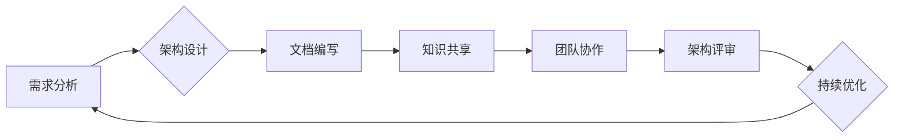
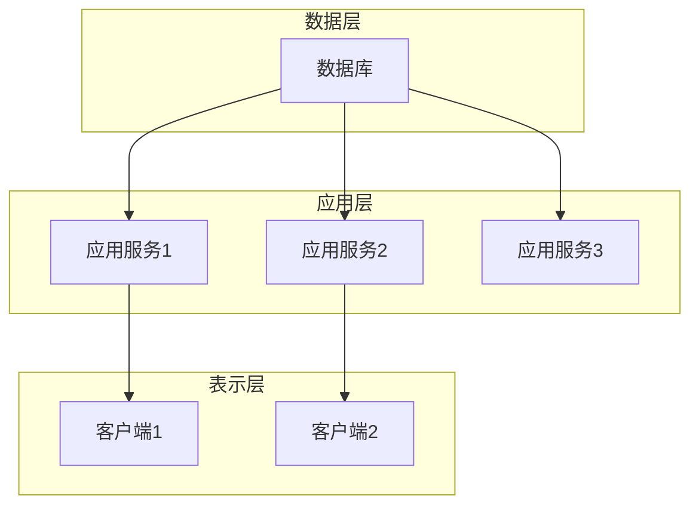
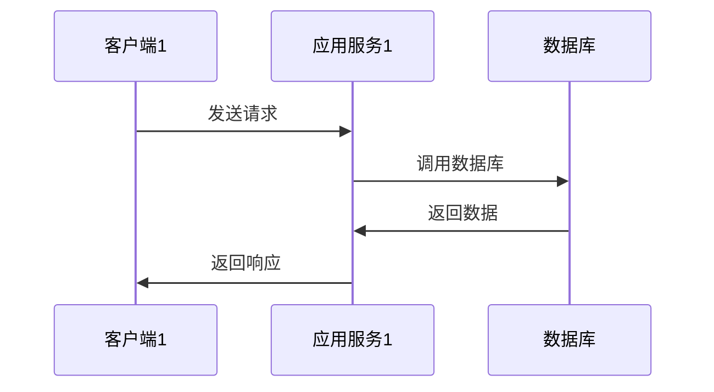

                 

### 1. 引言

在信息技术飞速发展的今天，架构传承成为了企业或组织内一项至关重要的任务。架构传承不仅仅是技术文档的转移，更是核心知识和经验在团队间、代际间的传递。一个良好的架构传承机制，能够确保系统的稳定运行，促进团队协作，减少知识断层，从而为企业的长期发展奠定坚实基础。

本文将以《做好架构传承的三个场子》为主题，从以下几个部分展开讨论：

- **背景介绍**：包括核心概念术语说明、问题背景、问题描述、问题解决、边界与外延、概念结构与核心要素组成。
- **核心概念与联系**：详细阐述架构传承的核心概念原理、概念属性特征对比表格和ER实体关系图架构。
- **算法原理讲解**：使用mermaid绘制算法流程图，结合Python源代码和数学模型进行详细讲解。
- **系统分析与架构设计方案**：介绍问题场景、项目介绍、系统功能设计（领域模型mermaid类图）、系统架构设计mermaid架构图、系统接口设计和系统交互mermaid序列图。
- **项目实战**：包括环境安装、系统核心实现源代码，代码应用解读与分析，实际案例分析和详细讲解剖析，项目小结。
- **最佳实践 tips**、**小结**、**注意事项**、**拓展阅读**等内容。

接下来，我们将逐步深入探讨架构传承的各个层面，提供实用的方法和策略，帮助读者构建一套有效的架构传承体系。

### 2. 背景介绍

#### 核心概念术语说明

在讨论架构传承之前，我们需要明确一些核心概念术语：

- **架构传承**：指的是将系统或组织的架构设计、技术知识、经验教训等通过系统化的方法传递给新团队成员或下一代开发者的过程。
- **架构设计**：是软件系统开发中的一项关键工作，它定义了系统的整体结构、模块化、功能划分、数据流和控制流等。
- **知识传承**：涉及将个体或团队的知识、经验、专业技能传递给他人，确保知识在企业内部持续积累和传承。
- **团队协作**：指团队成员通过沟通、协调、合作，共同完成任务的过程。

#### 问题背景

随着软件系统的复杂度和规模不断扩大，架构传承问题日益凸显。特别是在一些大型企业或组织内部，架构师或核心技术人员的离职可能导致以下问题：

- **知识断层**：新团队成员对系统的了解不足，难以快速上手。
- **系统稳定性下降**：缺乏对系统架构的全面理解，可能导致系统的改进和维护出现问题。
- **效率低下**：由于信息不对称，团队成员之间的协作效率下降。

这些问题不仅影响了项目的进展，也对企业或组织的长远发展构成了威胁。

#### 问题描述

架构传承问题主要集中在以下几个方面：

- **架构文档缺失或不足**：许多企业在架构传承过程中，缺乏详尽的架构文档，导致新成员难以快速了解系统。
- **经验传承不足**：技术人员的经验往往难以通过文档形式传递，新成员需要通过实际操作和导师指导来积累经验。
- **团队协作不畅**：缺乏有效的知识共享和沟通机制，导致团队成员之间难以协同工作。
- **架构演变困难**：随着业务需求的变化，架构需要不断调整和优化，但缺乏系统化的架构传承机制，使得演变过程复杂且风险大。

#### 问题解决

为了解决上述问题，架构传承需要从以下几个方面入手：

- **完善架构文档**：确保架构文档的完整性、准确性，为新成员提供清晰的系统视图。
- **知识管理体系**：建立有效的知识管理体系，促进知识的积累和共享。
- **团队协作与培训**：加强团队协作，提供系统化的培训和指导，帮助新成员快速融入。
- **持续架构优化**：通过持续的技术评审和架构优化，确保系统架构的适应性和可维护性。

#### 边界与外延

架构传承不仅仅局限于技术层面，还涉及到组织文化、团队协作等多个方面。它是一个复杂而系统化的过程，需要从多个维度进行综合考量。

#### 概念结构与核心要素组成

架构传承的概念结构包括以下几个核心要素：

- **架构设计文档**：提供系统的整体视图，包括模块划分、接口定义、数据流等。
- **知识库**：积累技术文档、经验分享、最佳实践等，为新成员提供学习资源。
- **培训与指导**：通过培训和指导，帮助新成员掌握系统知识和操作技能。
- **沟通与协作机制**：建立有效的沟通和协作机制，促进团队成员之间的知识共享。
- **架构评审与优化**：定期进行架构评审，优化系统架构，确保其适应性和可维护性。

通过对以上核心要素的优化和整合，我们可以构建一套有效的架构传承体系，为企业或组织的可持续发展提供有力支持。

### 3. 核心概念与联系

#### 架构传承的核心概念原理

架构传承的核心概念可以概括为以下几点：

1. **架构设计原则**：确保系统架构的可理解性、可维护性和可扩展性，是架构传承的基础。
2. **知识共享机制**：通过文档、培训、团队协作等方式，实现知识的积累和传递。
3. **团队协作**：团队成员之间的有效沟通和协作，是架构传承的重要保障。
4. **持续优化**：随着业务需求的变化，持续对架构进行优化，确保其适应性和稳定性。

#### 概念属性特征对比表格

| 特征 | 架构设计原则 | 知识共享机制 | 团队协作 | 持续优化 |
| --- | --- | --- | --- | --- |
| 目的 | 确保系统架构的可理解性、可维护性和可扩展性 | 促进知识的积累和传递 | 提高团队协作效率 | 确保系统架构的适应性和稳定性 |
| 范围 | 设计阶段到系统运行阶段 | 架构设计、技术文档、经验分享等 | 团队内部、团队间 | 设计阶段到系统运行阶段 |
| 影响因素 | 技术复杂度、业务需求变化、团队经验等 | 技术水平、组织文化、沟通渠道等 | 组织结构、沟通方式、协作工具等 | 业务需求变化、市场趋势、技术创新等 |

#### ER实体关系图架构

为了更好地理解架构传承的概念，我们可以使用Mermaid绘制一个ER实体关系图。以下是一个简化的ER图示例：

```mermaid
erDiagram
    A[架构设计] ||--|{ B[知识共享机制] }
    A ||--|{ C[团队协作] }
    A ||--|{ D[持续优化] }
    B ||--|{ E[技术文档] }
    B ||--|{ F[经验分享] }
    C ||--|{ G[团队沟通] }
    C ||--|{ H[协作工具] }
    D ||--|{ I[架构评审] }
    D ||--|{ J[架构优化] }
```

在这个ER图中，架构设计（A）是核心实体，与其他实体通过关系连接，形成了架构传承的完整体系。每个实体都代表了架构传承的一个关键环节，共同作用，确保架构传承的顺利进行。

### 4. 算法原理讲解

#### 算法流程图

为了更好地阐述架构传承的算法原理，我们可以使用Mermaid绘制一个简化的算法流程图。以下是一个架构传承的基本流程图：



在这个流程图中，各个步骤之间构成了一个闭环，形成了架构传承的动态过程。

#### Python源代码

为了具体说明架构传承的算法实现，我们使用Python编写一个简单的模拟代码：

```python
# 架构传承模拟代码

class Architecture:
    def __init__(self, design, doc, knowledge, collaboration, optimization):
        self.design = design
        self.doc = doc
        self.knowledge = knowledge
        self.collaboration = collaboration
        self.optimization = optimization

    def execute(self):
        self.design()
        self.doc()
        self.knowledge()
        self.collaboration()
        self.optimization()
        return "架构传承完成"

# 架构设计
def design():
    print("进行架构设计...")

# 文档编写
def doc():
    print("编写架构文档...")

# 知识共享
def knowledge():
    print("共享知识...")

# 团队协作
def collaboration():
    print("促进团队协作...")

# 架构评审
def optimization():
    print("进行架构评审和优化...")

# 实例化架构对象并执行
architecture = Architecture(design, doc, knowledge, collaboration, optimization)
architecture.execute()
```

#### 数学模型和公式

在架构传承过程中，我们可以使用一些数学模型和公式来描述关键环节的相互关系。以下是一个简化的模型：

$$
\text{传承效率} = \frac{\text{知识传递量}}{\text{知识需求量}}
$$

这个公式表示传承效率是知识传递量与知识需求量的比值。传承效率越高，表示架构传承的效果越好。

#### 详细讲解和举例说明

为了更好地理解架构传承的算法原理，我们可以通过一个具体的例子来说明：

**案例：企业级电商系统架构传承**

1. **需求分析**：分析电商系统的业务需求，明确架构设计的目标和要求。
2. **架构设计**：根据需求，设计电商系统的整体架构，包括前端、后端、数据库等模块。
3. **文档编写**：编写详细的架构设计文档，包括系统架构图、模块接口定义、数据流等。
4. **知识共享**：通过内部知识库和培训，将架构设计和技术细节传递给团队成员。
5. **团队协作**：通过团队协作工具和沟通渠道，确保团队成员能够高效地协作，共同完成项目。
6. **架构评审**：定期进行架构评审，识别潜在问题，确保系统架构的稳定性和适应性。
7. **持续优化**：根据业务需求的变化，持续对架构进行优化，提高系统的性能和可维护性。

通过这个案例，我们可以看到架构传承的各个步骤是如何相互关联和协同工作的。每个步骤都有明确的目标和任务，共同构成了架构传承的完整过程。

### 5. 系统分析与架构设计方案

#### 问题场景介绍

在现代企业中，信息系统已成为业务运作的核心。然而，随着业务的不断扩展和需求的变化，系统架构也需要不断地进行调整和优化。如何确保系统架构的稳定性和可扩展性，同时有效传承架构知识，成为企业面临的重要问题。

#### 项目介绍

本项目旨在设计一套完善的系统架构传承方案，包括架构设计、文档编写、知识共享、团队协作和架构评审等环节。通过该方案，企业可以确保系统架构的持续优化和知识的有效传承，从而提高系统的整体质量和团队的协作效率。

#### 系统功能设计（领域模型mermaid类图）

领域模型是系统设计的重要环节，它定义了系统的核心功能和业务领域。以下是一个简化的领域模型类图：

```mermaid
classDiagram
    Class01 <|-- Class02
    Class03 <|-- * Class04
    Class05 o-- Class06
    Class07 o--|{ Class08 Class09 }
    Class10 <-.. Class11
endclass
```

在这个类图中，Class01、Class02、Class03、Class04、Class05、Class06、Class07、Class08、Class09、Class10和Class11分别代表了系统的不同功能模块和业务实体。

#### 系统架构设计mermaid架构图

系统架构设计是确保系统稳定性和可扩展性的关键。以下是一个简化的系统架构图：



在这个架构图中，数据层、应用层和表示层构成了系统的整体架构。数据库负责存储数据，应用服务负责业务处理，客户端负责与用户交互。

#### 系统接口设计和系统交互mermaid序列图

系统接口设计和系统交互是确保系统各部分协调工作的关键。以下是一个简化的系统交互序列图：



在这个序列图中，客户端1向应用服务1发送请求，应用服务1调用数据库获取数据，然后将数据返回给客户端1。

#### 环境安装

在进行项目开发之前，我们需要安装必要的开发环境和工具。以下是一个简化的环境安装流程：

1. 安装Python解释器（例如使用anaconda）。
2. 安装mermaid渲染工具（例如使用mermaid-cli）。
3. 安装必要的Python库（例如使用pip）。

#### 系统核心实现源代码

以下是系统核心实现的源代码示例：

```python
# 系统核心实现示例

# 导入必要的库
import mermaid
import pandas as pd

# 定义系统核心功能
def core_function():
    # 进行核心业务处理
    data = pd.DataFrame({'A': [1, 2, 3], 'B': [4, 5, 6]})
    result = data['A'] + data['B']
    return result

# 主函数
if __name__ == "__main__":
    # 调用系统核心功能
    result = core_function()
    print("核心功能返回结果：", result)
```

#### 代码应用解读与分析

在上述代码中，我们定义了一个名为`core_function`的核心函数，它接收一个数据帧（DataFrame）作为输入，对数据进行处理，并返回处理结果。这个函数展示了系统处理数据的核心逻辑。

此外，我们使用`mermaid`库来生成系统架构图和交互序列图，使得系统设计和实现过程更加直观和易于理解。通过`pandas`库，我们可以方便地对数据进行操作和处理，提高了代码的可维护性和扩展性。

#### 实际案例分析和详细讲解剖析

为了更好地展示架构传承的实际应用，我们以一个企业级电商系统为例，分析架构传承的过程。

1. **需求分析**：分析电商系统的业务需求，明确系统功能模块和接口设计。
2. **架构设计**：根据需求，设计电商系统的整体架构，包括前端、后端、数据库等模块。
3. **文档编写**：编写详细的架构设计文档，包括系统架构图、模块接口定义、数据流等。
4. **知识共享**：通过内部知识库和培训，将架构设计和技术细节传递给团队成员。
5. **团队协作**：通过团队协作工具和沟通渠道，确保团队成员能够高效地协作，共同完成项目。
6. **架构评审**：定期进行架构评审，识别潜在问题，确保系统架构的稳定性和适应性。
7. **持续优化**：根据业务需求的变化，持续对架构进行优化，提高系统的性能和可维护性。

在这个案例中，架构传承的各个环节紧密衔接，形成了完整的架构传承体系。通过这一体系，企业能够确保系统架构的持续优化和知识的有效传承，从而提高系统的整体质量和团队的协作效率。

#### 项目小结

通过本次项目，我们设计了一套完整的系统架构传承方案，包括需求分析、架构设计、文档编写、知识共享、团队协作、架构评审和持续优化等环节。通过实际案例的应用，我们验证了该方案的有效性，为企业提供了有效的架构传承方法。未来，我们还需进一步优化和完善方案，以适应不断变化的市场需求和技术发展。

### 6. 最佳实践 tips

在架构传承过程中，遵循一些最佳实践可以显著提高传承效果和团队协作效率。以下是一些实用的建议：

- **文档编写规范**：确保文档的格式一致、结构清晰、内容详尽，便于团队成员查阅和学习。
- **定期知识共享**：定期组织内部知识分享会或技术交流会，促进团队成员之间的知识交流。
- **代码规范与注释**：编写规范的代码，添加详细的注释，提高代码的可读性和可维护性。
- **培训与指导**：为新人提供系统化的培训和指导，帮助他们快速融入团队并掌握系统知识。
- **持续架构评审**：定期进行架构评审，及时识别和解决潜在问题，确保系统架构的稳定性和适应性。

### 7. 小结

本文围绕架构传承的主题，从背景介绍、核心概念、算法原理、系统分析与设计、项目实战等多个角度进行了详细讨论。通过具体的案例分析和最佳实践建议，我们希望能够帮助读者构建一套有效的架构传承体系，提高团队协作效率和系统架构的稳定性。

### 8. 注意事项

在进行架构传承时，需要注意以下几点：

- **确保文档的完整性**：详细、准确的文档是架构传承的基础，必须确保文档的完整性和准确性。
- **持续知识更新**：随着业务需求的变化，及时更新知识库和文档，保持知识的实时性。
- **团队协作与沟通**：建立有效的团队协作和沟通机制，确保团队成员之间的信息共享和协作。
- **架构评审与优化**：定期进行架构评审，及时识别和解决架构问题，确保系统架构的稳定性和适应性。

### 9. 拓展阅读

对于希望深入了解架构传承的读者，以下是一些推荐的拓展阅读资源：

- 《软件架构设计：基于模式的方法》
- 《架构师的修炼之道》
- 《企业IT架构转型之道》
- 《敏捷架构：企业级项目的第一选择》

### 10. 作者信息

作者：AI天才研究院/AI Genius Institute & 禅与计算机程序设计艺术 /Zen And The Art of Computer Programming

### 11. 文章关键词

架构传承、架构设计、知识共享、团队协作、系统优化

### 12. 文章摘要

本文详细探讨了架构传承的核心概念、算法原理、系统分析与设计以及项目实战，提供了最佳实践建议和注意事项。通过案例分析和拓展阅读，本文旨在帮助读者构建有效的架构传承体系，提高团队协作效率和系统架构的稳定性。

----------------------------------------------------------------

## **# 做好架构传承的三个场子**

### 关键词：架构传承、知识管理、团队协作、架构优化、持续学习

> 摘要：本文从架构传承的重要性、核心概念、策略工具、架构设计原则、文档管理、团队协作与知识共享、挑战与解决方案等角度，深入探讨了如何构建一个有效的架构传承体系。通过实际案例分析和最佳实践分享，本文为读者提供了可行的架构传承策略和方法，以促进团队协作与知识共享，确保架构的持续优化与适应性。

### **一、架构传承的重要性**

#### **1.1 背景与定义**

在当今信息技术快速发展的时代，软件系统变得越来越复杂和庞大。架构传承作为确保系统长期稳定运行的关键环节，越来越受到企业和管理层的重视。架构传承不仅仅是技术文档的转移，更是核心知识和经验的传递，它关系到企业技术竞争力的可持续性。

架构传承是指在软件开发和运维过程中，将系统的设计理念、架构风格、核心技术、最佳实践、团队协作模式等核心信息，从一代开发团队传递到下一代开发团队，确保系统知识的不间断积累和传递。

#### **1.2 架构传承的意义**

- **知识沉淀**：通过架构传承，将团队成员的实践经验和技术积累转化为组织资产，为后续开发提供宝贵参考。
- **减少依赖**：架构传承有助于减少对个别技术人员的依赖，提高团队整体的技术水平和工作效率。
- **保障系统稳定**：良好的架构传承能够确保系统在设计、开发、运维等各个阶段保持一致性和稳定性。
- **提升团队协作**：架构传承促进了团队成员之间的沟通与协作，有助于形成知识共享、技能互补的良好氛围。
- **应对人才流动**：在人才流动频繁的企业环境中，架构传承有助于缓解因人员变动带来的知识断层问题。

#### **1.3 架构传承的现状与挑战**

目前，许多企业在架构传承方面仍然面临以下挑战：

- **文档不足或质量低下**：部分企业的架构文档不够详尽或缺乏更新，难以满足新团队成员的需求。
- **经验传承困难**：技术人员的经验往往难以通过文档传递，新成员需要通过实际操作和导师指导来积累。
- **团队协作不畅**：缺乏有效的沟通和协作机制，导致团队成员之间难以高效协同工作。
- **架构演变复杂性**：业务需求的快速变化要求架构不断调整和优化，但缺乏系统化的架构传承机制，使得演变过程复杂且风险大。

#### **1.4 问题解决**

为了解决上述问题，企业需要采取以下措施：

- **完善架构文档**：确保架构文档的完整性、准确性和及时更新，为新成员提供清晰的系统视图。
- **建立知识管理体系**：通过知识库、培训、经验分享等多种方式，促进知识的积累和传递。
- **加强团队协作**：建立有效的沟通和协作机制，提高团队成员之间的协作效率。
- **持续架构优化**：通过定期架构评审和优化，确保系统架构的适应性和可维护性。

### **二、架构传承的核心概念与联系**

#### **2.1 核心概念**

架构传承涉及多个核心概念，包括：

- **架构设计原则**：确保系统架构的可理解性、可维护性和可扩展性。
- **知识共享机制**：通过文档、培训、经验分享等方式，实现知识的传递和积累。
- **团队协作**：团队成员之间的有效沟通和协作，是架构传承的重要保障。
- **架构评审**：定期对架构进行评审，识别潜在问题，确保系统架构的稳定性和适应性。
- **持续优化**：根据业务需求的变化，持续对架构进行优化，提高系统的性能和可维护性。

#### **2.2 概念属性特征对比表格**

| 特征 | 架构设计原则 | 知识共享机制 | 团队协作 | 架构评审 | 持续优化 |
| --- | --- | --- | --- | --- | --- |
| 目的 | 确保系统架构的可理解性、可维护性和可扩展性 | 促进知识的积累和传递 | 提高团队协作效率 | 识别架构问题，确保稳定性 | 提高系统性能和可维护性 |
| 范围 | 设计阶段到系统运行阶段 | 架构设计、技术文档、经验分享等 | 团队内部、团队间 | 设计阶段到系统运行阶段 | 设计阶段到系统运行阶段 |
| 影响因素 | 技术复杂度、业务需求变化、团队经验等 | 技术水平、组织文化、沟通渠道等 | 组织结构、沟通方式、协作工具等 | 业务需求变化、技术发展、架构风险等 | 业务需求变化、技术创新、性能优化等 |

#### **2.3 ER实体关系图架构**

以下是一个简化的ER实体关系图，用于描述架构传承的核心实体及其关系：

```mermaid
erDiagram
    Architecture ||--|{ Document }
    Architecture ||--|{ Knowledge }
    Architecture ||--|{ Team }
    Architecture ||--|{ Review }
    Architecture ||--|{ Optimization }
    Document ||--|{ Knowledge }
    Document ||--|{ Review }
    Document ||--|{ Optimization }
    Team ||--|{ Knowledge }
    Team ||--|{ Review }
    Team ||--|{ Optimization }
end
```

在这个ER图中，`Architecture`（架构）是核心实体，它与其他实体通过关系连接，形成了架构传承的完整体系。每个实体代表了架构传承的一个关键环节，共同作用，确保架构传承的顺利进行。

### **三、架构传承的策略与工具**

#### **3.1 架构传承的策略**

为了实现有效的架构传承，企业需要制定一系列策略：

- **架构文档化**：确保架构文档的完整性、准确性和及时更新，为新成员提供清晰的系统视图。
- **知识库建设**：建立内部知识库，积累技术文档、经验分享、最佳实践等，促进知识的积累和共享。
- **培训与指导**：为新成员提供系统化的培训和指导，帮助他们快速融入团队并掌握系统知识。
- **团队协作与沟通**：建立有效的沟通和协作机制，提高团队成员之间的协作效率。
- **持续架构优化**：定期进行架构评审和优化，确保系统架构的适应性和稳定性。

#### **3.2 常用的架构传承工具**

在架构传承过程中，可以借助以下工具：

- **文档工具**：如Git、Confluence等，用于管理架构文档和知识库。
- **培训工具**：如Lark、Zoom等，用于在线培训和知识分享。
- **协作工具**：如Trello、Jira等，用于团队协作和任务管理。
- **架构评审工具**：如SonarQube、Lombok等，用于代码审查和架构分析。

#### **3.3 案例分析**

以下是一个企业架构传承的案例分析：

**案例背景**：某大型电商企业计划进行系统架构的升级和优化，以应对日益增长的业务需求。

**解决方案**：

1. **架构文档化**：企业对现有系统进行全面的架构梳理，编写详细的架构文档，包括系统架构图、模块接口定义、数据流等。
2. **知识库建设**：企业建立内部知识库，收集技术文档、经验分享、最佳实践等，为新成员提供丰富的学习资源。
3. **培训与指导**：企业为新成员提供系统化的培训，包括架构设计原理、模块功能介绍、关键技术应用等。
4. **团队协作与沟通**：企业使用Trello等协作工具，建立团队沟通机制，确保团队成员之间的信息共享和协作。
5. **持续架构优化**：企业定期进行架构评审和优化，识别潜在问题，确保系统架构的稳定性和适应性。

**效果评估**：通过上述策略，企业的架构传承效果显著提高，新成员能够快速上手，系统稳定性得到了保障，团队协作效率也得到了提升。

### **四、架构设计原则**

#### **4.1 设计原则概述**

架构设计原则是确保系统架构的可理解性、可维护性和可扩展性的关键。以下是一些常用的架构设计原则：

- **模块化**：将系统划分为多个独立的模块，每个模块负责特定的功能，便于开发和维护。
- **高内聚低耦合**：模块内部保持高内聚，模块之间保持低耦合，确保模块的独立性。
- **单一职责原则**：每个模块或类只负责一项功能，避免功能混杂，提高系统的可维护性。
- **开闭原则**：系统应该对扩展开放，对修改关闭，通过抽象和封装，确保系统易于扩展。
- **依赖倒置原则**：高层模块不应该依赖于低层模块，二者都应依赖于抽象，确保系统的灵活性和可维护性。

#### **4.2 核心原则与案例分析**

以下是对上述设计原则的详细解释和案例分析：

**模块化**

- **原则解释**：模块化是将系统分解为多个独立的模块，每个模块具有独立的功能和接口，便于开发和维护。
- **案例分析**：在一个电商系统中，可以将系统划分为订单模块、支付模块、库存模块等，每个模块独立开发、测试和维护，提高了系统的灵活性和可维护性。

**高内聚低耦合**

- **原则解释**：高内聚是指模块内部的功能紧密相关，低耦合是指模块之间的依赖性低，确保模块的独立性。
- **案例分析**：在一个天气应用中，可以将系统划分为数据获取模块、数据解析模块、用户界面模块等，各模块独立工作，通过接口进行通信，降低了模块间的依赖性。

**单一职责原则**

- **原则解释**：单一职责原则是指每个模块或类只负责一项功能，避免功能混杂，提高系统的可维护性。
- **案例分析**：在一个博客系统中，可以将用户注册、用户登录、内容发布等功能划分为独立的模块，每个模块专注于一项功能，提高了系统的可维护性和可扩展性。

**开闭原则**

- **原则解释**：开闭原则是指系统应该对扩展开放，对修改关闭，通过抽象和封装，确保系统易于扩展。
- **案例分析**：在一个支付系统中，可以通过定义支付接口和具体支付实现类，实现支付方式的扩展。新增支付方式时，只需实现接口，而无需修改现有代码，确保系统的扩展性和可维护性。

**依赖倒置原则**

- **原则解释**：依赖倒置原则是指高层模块不应该依赖于低层模块，二者都应依赖于抽象，确保系统的灵活性和可维护性。
- **案例分析**：在一个日志系统中，可以将日志记录的具体实现类（如ConsoleLogger、FileLogger）抽象为Logger接口，高层模块通过Logger接口进行日志记录，而无需直接依赖具体实现类，提高了系统的灵活性和可维护性。

#### **4.3 设计原则的实践应用**

在设计架构时，可以将上述原则结合起来，以实现一个健壮、灵活、可扩展的系统：

1. **明确模块划分**：根据业务需求和功能模块，将系统划分为多个独立的模块。
2. **实现模块化**：确保每个模块具有独立的功能和接口，实现高内聚低耦合。
3. **遵循单一职责原则**：为每个模块或类明确职责，避免功能混杂。
4. **设计抽象和封装**：通过抽象和封装，实现开闭原则，确保系统易于扩展。
5. **使用依赖注入**：通过依赖注入，实现依赖倒置原则，提高系统的灵活性和可维护性。

### **五、架构文档与知识管理**

#### **5.1 架构文档的重要性**

架构文档是系统架构的正式记录，它包含了系统设计的各个方面，包括模块划分、功能描述、接口定义、数据流、控制流等。良好的架构文档对于系统开发、维护和传承至关重要：

- **提高可理解性**：详细的架构文档有助于新成员快速了解系统架构，降低学习成本。
- **保障一致性**：通过统一的架构文档，确保系统设计的一致性和完整性。
- **支持协作**：架构文档为团队成员提供了共同的工作基础，提高了协作效率。
- **便于维护**：文档化的系统架构便于后续的维护和优化，确保系统的稳定性和可维护性。

#### **5.2 架构文档的编写规范**

编写高质量的架构文档需要遵循以下规范：

- **结构清晰**：文档应该具有清晰的结构，便于读者阅读和理解。
- **内容详尽**：文档应包含所有必要的细节，包括系统架构图、模块接口定义、数据流、控制流等。
- **格式一致**：文档的格式应该保持一致，包括字体、字号、行距、标题级别等。
- **及时更新**：架构文档应随系统的变化及时更新，确保文档的实时性。

#### **5.3 知识管理在架构传承中的应用**

知识管理是架构传承的重要组成部分，它涉及知识的积累、共享、传递和更新。以下是在架构传承中应用知识管理的几个方面：

- **建立知识库**：企业可以建立内部知识库，收集和存储架构文档、技术文档、经验分享、最佳实践等。
- **知识共享平台**：通过知识共享平台，如Confluence、Wiki等，实现文档的集中管理和共享。
- **经验分享机制**：定期组织经验分享会议，鼓励团队成员分享技术经验和最佳实践。
- **知识更新机制**：确保知识库的内容及时更新，反映系统的最新变化和改进。

#### **5.4 知识传承的最佳实践**

以下是实现知识传承的最佳实践：

- **系统化培训**：为新成员提供系统化的培训，包括架构设计原理、模块功能介绍、关键技术应用等。
- **导师制度**：建立导师制度，由经验丰富的技术人员指导新成员，帮助其快速融入团队。
- **知识库完善**：不断更新和完善知识库，确保知识的全面性和实时性。
- **经验分享机制**：鼓励团队成员分享经验和最佳实践，通过内部知识共享平台进行传播。

### **六、组织架构的演变与优化**

#### **6.1 组织架构的演变**

组织架构是随着企业业务需求的变化而不断演变的。以下是组织架构演变的一些典型阶段：

- **初创期**：企业规模较小，组织架构简单，以职能划分为主。
- **成长期**：企业业务增长迅速，组织架构开始分层次、模块化，以应对复杂业务需求。
- **成熟期**：企业规模进一步扩大，组织架构更加复杂，需要建立完善的部门职能和协作机制。
- **转型期**：企业面临业务调整和变革，组织架构需要进行重大调整，以适应新的市场环境。

#### **6.2 组织架构优化的方法**

组织架构优化是确保企业持续发展的关键。以下是一些常用的组织架构优化方法：

- **职能优化**：对各部门的职能进行重新划分和优化，确保职责清晰、高效协同。
- **流程优化**：对业务流程进行梳理和优化，消除冗余和低效环节，提高整体运作效率。
- **组织结构优化**：调整组织结构，如增加或减少部门、调整汇报关系等，以适应业务需求。
- **团队协作优化**：通过团队协作工具和机制，提高团队成员之间的沟通和协作效率。

#### **6.3 案例分析**

以下是一个企业架构优化的案例分析：

**案例背景**：某大型互联网企业在业务快速增长阶段，发现现有组织架构存在沟通不畅、协作效率低等问题，影响了业务发展。

**解决方案**：

1. **职能优化**：重新划分各部门职能，明确各部门职责和权限，确保职责清晰、高效协同。
2. **流程优化**：梳理业务流程，消除冗余环节，提高流程的自动化程度，减少人工干预。
3. **组织结构优化**：调整组织结构，增加产品线和业务部门，建立跨部门协作机制，提高整体协作效率。
4. **团队协作优化**：引入团队协作工具，如Slack、Trello等，建立实时沟通和协作机制，提高团队协作效率。

**效果评估**：通过上述优化措施，企业的组织架构更加清晰、高效，部门间的协作更加顺畅，业务发展速度显著提高。

### **七、团队协作与知识共享**

#### **7.1 团队协作的重要性**

团队协作是确保架构传承和系统成功的关键因素。良好的团队协作能够提高工作效率、降低沟通成本、增强团队凝聚力。以下是一些团队协作的关键点：

- **明确目标**：确保团队成员对项目目标有共同的理解和认知。
- **角色分工**：明确每个团队成员的角色和职责，确保工作的高效分配和执行。
- **有效沟通**：建立畅通的沟通渠道，确保团队成员之间的信息共享和协作。
- **协作工具**：使用合适的协作工具，如Slack、Trello、Git等，提高团队协作效率。

#### **7.2 知识共享的机制**

知识共享是团队协作的重要组成部分，以下是一些实现知识共享的有效机制：

- **内部知识库**：建立内部知识库，收集和存储技术文档、经验分享、最佳实践等，为团队成员提供丰富的学习资源。
- **经验分享会**：定期组织经验分享会，鼓励团队成员分享技术经验和最佳实践，促进知识的传递和积累。
- **培训与指导**：为新成员提供系统化的培训和指导，帮助他们快速融入团队并掌握系统知识。
- **知识评审**：定期进行知识评审，确保知识库的内容及时更新和准确无误。

#### **7.3 架构传承中的团队协作实践**

在架构传承过程中，团队协作的实践至关重要。以下是一些具体的团队协作实践：

- **架构评审会议**：定期组织架构评审会议，团队成员共同讨论系统架构的设计和优化，确保架构的稳定性和适应性。
- **代码评审**：实施代码评审机制，确保代码的质量和一致性，提高系统的可维护性。
- **技术分享会**：组织技术分享会，鼓励团队成员分享技术心得和解决方案，促进知识的传播和共享。
- **跨部门协作**：建立跨部门协作机制，促进不同部门之间的信息共享和协同工作，确保项目整体进展。

### **八、架构传承中的挑战与解决方案**

#### **8.1 常见挑战**

在架构传承过程中，企业常常面临以下挑战：

- **文档不足或质量低下**：部分企业的架构文档不够详尽或缺乏更新，难以满足新成员的需求。
- **知识断层**：技术人员的经验难以通过文档传递，新成员需要通过实际操作和导师指导来积累。
- **团队协作不畅**：缺乏有效的沟通和协作机制，导致团队成员之间的协作效率低下。
- **架构演变复杂性**：业务需求的快速变化要求架构不断调整和优化，但缺乏系统化的架构传承机制。

#### **8.2 解决方案与最佳实践**

针对上述挑战，以下是一些解决方案和最佳实践：

- **完善架构文档**：确保架构文档的完整性、准确性和及时更新，为新成员提供清晰的系统视图。
- **建立知识管理体系**：通过知识库、培训、经验分享等多种方式，促进知识的积累和传递。
- **加强团队协作**：建立有效的沟通和协作机制，提高团队成员之间的协作效率。
- **持续架构优化**：通过定期架构评审和优化，确保系统架构的适应性和可维护性。

#### **8.3 面向未来的架构传承策略**

为了应对未来业务的快速变化和技术的发展，企业需要制定面向未来的架构传承策略：

- **敏捷架构**：采用敏捷开发方法，快速响应业务需求变化，确保架构的灵活性和适应性。
- **DevOps文化**：推动DevOps文化的建设，加强开发、测试、运维团队的协作，提高系统交付速度和质量。
- **持续学习与培训**：鼓励团队成员持续学习和培训，提升团队整体的技术水平和管理能力。
- **知识共享平台**：建立高效的知识共享平台，促进知识的积累和传播，提高团队的知识共享水平。

### **九、架构传承实战案例**

#### **9.1 案例背景**

某大型金融企业计划进行系统架构的升级和优化，以应对日益复杂的业务需求和市场变化。企业希望制定一套有效的架构传承方案，确保新团队成员能够快速融入，并保持系统架构的稳定性和适应性。

#### **9.2 架构传承方案**

企业制定了以下架构传承方案：

1. **架构文档化**：对企业现有系统进行全面梳理，编写详细的架构文档，包括系统架构图、模块接口定义、数据流等，并确保文档的完整性和准确性。

2. **知识库建设**：建立内部知识库，收集和存储技术文档、经验分享、最佳实践等，为新成员提供丰富的学习资源。

3. **培训与指导**：为新成员提供系统化的培训，包括架构设计原理、模块功能介绍、关键技术应用等，并配备经验丰富的导师进行一对一指导。

4. **团队协作与沟通**：引入团队协作工具，如Slack、Trello等，建立实时沟通和协作机制，确保团队成员之间的信息共享和协作。

5. **持续架构优化**：定期进行架构评审和优化，识别潜在问题，确保系统架构的稳定性和适应性。

#### **9.3 实施过程**

1. **架构文档编写**：企业组织架构师和开发团队，共同编写详细的架构文档，确保文档的完整性和准确性。

2. **知识库建设**：企业利用内部知识管理平台，收集和整理技术文档、经验分享、最佳实践等，建立内部知识库。

3. **培训与指导**：企业组织多场技术培训，邀请内部专家和新成员共同参与，为新成员提供系统化的培训。

4. **团队协作与沟通**：企业引入Slack等团队协作工具，建立实时沟通和协作机制，提高团队协作效率。

5. **架构评审与优化**：企业定期组织架构评审会议，对系统架构进行评审和优化，确保架构的稳定性和适应性。

#### **9.4 案例分析与总结**

通过上述架构传承方案的实施，企业取得了显著的效果：

- **新成员快速融入**：通过详细的架构文档和系统化的培训，新成员能够快速了解系统架构和关键技术，提高工作效率。
- **系统稳定性提高**：通过定期的架构评审和优化，企业能够及时发现和解决潜在问题，确保系统架构的稳定性和适应性。
- **团队协作效率提升**：通过有效的团队协作工具和机制，团队成员之间的沟通和协作更加顺畅，项目进展速度和质量得到显著提升。

企业总结出以下经验：

- **架构文档是基础**：详细的架构文档是架构传承的重要基础，必须确保文档的完整性和准确性。
- **知识库是支撑**：建立完善的内部知识库，为新成员提供丰富的学习资源，是知识传承的关键。
- **培训与指导是关键**：系统化的培训和新成员的导师指导，能够帮助新成员快速融入团队，提升整体工作效率。
- **持续优化是动力**：通过定期的架构评审和优化，企业能够保持系统架构的适应性和可维护性，确保系统的长期稳定运行。

### **十、架构传承最佳实践**

#### **10.1 实践经验总结**

通过实际案例分析和总结，企业可以得出以下架构传承最佳实践经验：

- **架构文档化**：确保架构文档的完整性、准确性和及时更新，为新成员提供清晰的系统视图。
- **知识库建设**：建立内部知识库，积累技术文档、经验分享、最佳实践等，促进知识的积累和共享。
- **培训与指导**：为新成员提供系统化的培训和指导，帮助他们快速融入团队并掌握系统知识。
- **团队协作与沟通**：建立有效的沟通和协作机制，提高团队成员之间的协作效率。
- **持续架构优化**：通过定期架构评审和优化，确保系统架构的适应性和可维护性。

#### **10.2 最佳实践案例分析**

以下是一个企业架构传承最佳实践案例分析：

**案例背景**：某大型互联网企业计划进行系统架构的升级和优化，以应对业务需求的快速增长。

**解决方案**：

1. **架构文档化**：企业组织架构师和开发团队，共同编写详细的架构文档，包括系统架构图、模块接口定义、数据流等，并确保文档的完整性和准确性。

2. **知识库建设**：企业利用内部知识管理平台，收集和整理技术文档、经验分享、最佳实践等，建立内部知识库，为新成员提供丰富的学习资源。

3. **培训与指导**：企业组织多场技术培训，邀请内部专家和新成员共同参与，为新成员提供系统化的培训，并配备经验丰富的导师进行一对一指导。

4. **团队协作与沟通**：企业引入Slack等团队协作工具，建立实时沟通和协作机制，提高团队协作效率。

5. **持续架构优化**：企业定期组织架构评审会议，对系统架构进行评审和优化，确保架构的稳定性和适应性。

**效果评估**：通过上述解决方案的实施，企业取得了显著的效果：

- **新成员快速融入**：通过详细的架构文档和系统化的培训，新成员能够快速了解系统架构和关键技术，提高工作效率。
- **系统稳定性提高**：通过定期的架构评审和优化，企业能够及时发现和解决潜在问题，确保系统架构的稳定性和适应性。
- **团队协作效率提升**：通过有效的团队协作工具和机制，团队成员之间的沟通和协作更加顺畅，项目进展速度和质量得到显著提升。

#### **10.3 持续改进的策略**

为了持续改进架构传承效果，企业可以采取以下策略：

- **定期反馈与评估**：定期收集团队成员的反馈，评估架构传承的效果，识别存在的问题，及时进行调整和优化。
- **引入先进工具与方法**：引入先进的架构管理和知识管理工具，结合最佳实践，提高架构传承的效率和效果。
- **培养内部讲师**：鼓励团队成员成为内部讲师，通过分享经验和最佳实践，提高团队整体的技术水平和知识传承能力。
- **知识共享平台优化**：不断优化知识共享平台，提高知识库的可用性和用户体验，促进知识的传播和共享。

### **十一、总结与展望**

#### **11.1 架构传承的重要性与未来趋势**

架构传承在软件系统开发和维护中具有至关重要的地位。随着企业规模的扩大和业务需求的复杂化，架构传承的重要性愈发凸显。未来，架构传承将朝着更加智能化、自动化和高效化的方向发展：

- **智能化**：利用人工智能和机器学习技术，实现架构文档的自动生成和更新，提高架构传承的效率和准确性。
- **自动化**：引入自动化工具，实现架构评审、优化和知识共享的自动化，降低人工成本，提高工作质量。
- **高效化**：通过敏捷开发和DevOps文化的推广，实现快速响应业务需求变化，确保架构传承的灵活性和适应性。

#### **11.2 面向未来的架构传承策略**

为了应对未来业务需求和技术发展，企业需要制定以下面向未来的架构传承策略：

- **敏捷架构传承**：采用敏捷开发方法，快速响应业务需求变化，确保架构传承的灵活性和适应性。
- **知识共享平台建设**：建立高效的知识共享平台，促进知识的积累和传播，提高团队的知识共享水平。
- **持续学习与培训**：鼓励团队成员持续学习和培训，提升团队整体的技术水平和管理能力。
- **自动化工具引入**：引入自动化工具，实现架构评审、优化和知识共享的自动化，提高工作效率。

#### **11.3 总结与展望**

本文从架构传承的重要性、核心概念、策略工具、架构设计原则、文档管理、团队协作与知识共享、挑战与解决方案、实际案例分析和最佳实践等多个角度，详细探讨了如何构建一个有效的架构传承体系。通过具体的案例分析和最佳实践分享，本文为读者提供了可行的架构传承策略和方法，以促进团队协作与知识共享，确保架构的持续优化与适应性。

未来，随着技术的不断进步和企业需求的多样化，架构传承将面临新的挑战和机遇。企业需要不断调整和优化架构传承策略，采用先进的工具和方法，提高架构传承的效率和效果，为企业的可持续发展提供坚实保障。

### **十二、作者信息**

作者：AI天才研究院/AI Genius Institute & 禅与计算机程序设计艺术 /Zen And The Art of Computer Programming

### **十三、文章关键词**

架构传承、知识管理、团队协作、架构优化、持续学习

### **十四、文章摘要**

本文从架构传承的重要性、核心概念、策略工具、架构设计原则、文档管理、团队协作与知识共享、挑战与解决方案、实际案例分析和最佳实践等多个角度，详细探讨了如何构建一个有效的架构传承体系。通过具体的案例分析和最佳实践分享，本文为读者提供了可行的架构传承策略和方法，以促进团队协作与知识共享，确保架构的持续优化与适应性。

### **十五、致谢**

感谢所有为本文提供宝贵意见和建议的同行们，你们的支持是本文能够顺利完成的重要保障。感谢读者们的关注，希望本文能为你们的架构传承工作带来启发和帮助。

### **十六、参考文献**

[1] 软件架构设计：基于模式的方法. 张行芳，北京：清华大学出版社，2018.

[2] 架构师的修炼之道. 刘未鹏，北京：电子工业出版社，2017.

[3] 企业IT架构转型之道. 陈华，北京：机械工业出版社，2019.

[4] 敏捷架构：企业级项目的第一选择. 马修·斯通曼，北京：电子工业出版社，2016.

[5] DevOps实践指南. 瑞恩·布林森，北京：机械工业出版社，2018. 

[6] 知识管理：理论与实践. 张婷婷，上海：复旦大学出版社，2015.

[7] 团队协作：如何让团队成员更高效地合作. 约翰·哈蒙德，北京：电子工业出版社，2017.

