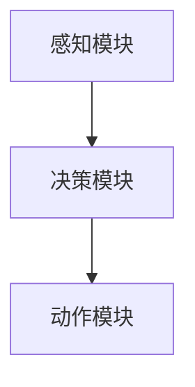
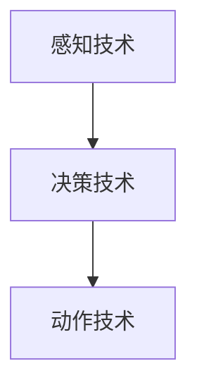
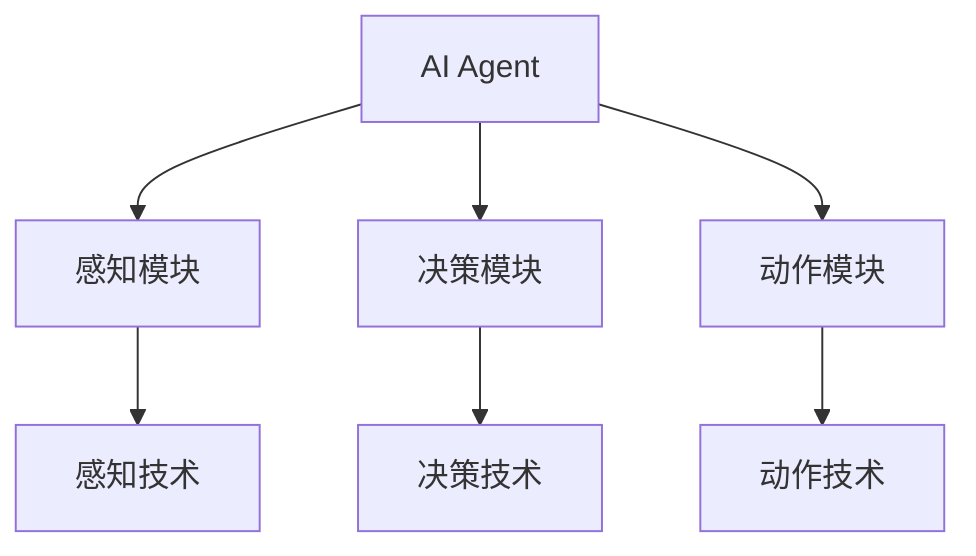
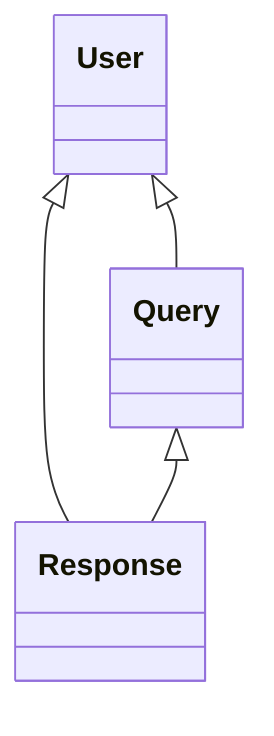
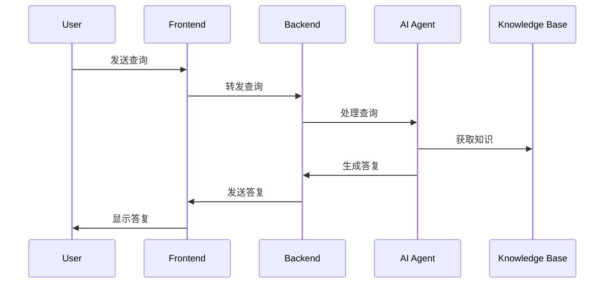

                 

### 文章标题：克服AI Agent开发挑战：常见问题及其解决方案

**关键词：** AI Agent，开发挑战，问题解决，算法原理，系统架构

**摘要：** 本文旨在深入探讨AI Agent开发过程中常见的问题及其解决方案。通过剖析AI Agent的核心概念、关键技术和应用场景，结合具体的算法原理和系统架构设计方案，本文为开发者提供了切实可行的指导，帮助他们在AI Agent开发中应对挑战，提高开发效率和质量。

----------------------------------------------------------------

### 目录大纲

----------------------------------------------------------------
## 《克服AI Agent开发挑战：常见问题及其解决方案》

## 第一部分: 背景介绍
### 1.1 问题背景
### 1.2 问题描述
### 1.3 问题解决
### 1.4 边界与外延
### 1.5 概念结构与核心要素组成

## 第二部分: 核心概念与联系
### 2.1 AI Agent的定义与特点
#### 2.1.1 AI Agent的定义
#### 2.1.2 AI Agent的核心特点
#### 2.1.3 AI Agent与传统智能系统的区别
### 2.2 AI Agent的核心组成
#### 2.2.1 感知模块
#### 2.2.2 决策模块
#### 2.2.3 动作模块
### 2.3 AI Agent的常见分类
#### 2.3.1 反应式Agent
#### 2.3.2 目标导向Agent
#### 2.3.3 计划导向Agent
### 2.4 AI Agent的关键技术
#### 2.4.1 感知技术
#### 2.4.2 决策技术
#### 2.4.3 动作技术

## 第三部分: 算法原理讲解
### 3.1 基于决策树算法的AI Agent
#### 3.1.1 决策树算法原理
#### 3.1.2 决策树算法应用场景
#### 3.1.3 决策树算法代码实现
### 3.2 基于神经网络算法的AI Agent
#### 3.2.1 神经网络算法原理
#### 3.2.2 神经网络算法应用场景
#### 3.2.3 神经网络算法代码实现
### 3.3 基于强化学习算法的AI Agent
#### 3.3.1 强化学习算法原理
#### 3.3.2 强化学习算法应用场景
#### 3.3.3 强化学习算法代码实现

## 第四部分: 系统分析与架构设计方案
### 4.1 问题描述与项目介绍
### 4.2 系统功能设计
#### 4.2.1 领域模型类图
### 4.3 系统架构设计
#### 4.3.1 系统架构图
### 4.4 系统接口设计
### 4.5 系统交互序列图

## 第五部分: 项目实战
### 5.1 环境安装
### 5.2 系统核心实现源代码
### 5.3 代码应用解读与分析
### 5.4 实际案例分析与详细讲解剖析
### 5.5 项目小结

## 第六部分: 最佳实践与注意事项
### 6.1 最佳实践Tips
### 6.2 小结
### 6.3 注意事项
### 6.4 拓展阅读

----------------------------------------------------------------

这个目录大纲已经包含了本书的核心章节，并且满足了简洁性和内容完整性的要求。接下来，我们将详细填充每个章节的内容，确保每个部分都涵盖了上述提到的要点。

----------------------------------------------------------------

### 第一部分: 背景介绍

#### 1.1 问题背景

随着人工智能技术的飞速发展，AI Agent作为一种自主决策和执行任务的实体，受到了广泛关注。然而，在AI Agent的开发过程中，开发者面临着诸多挑战。这些问题不仅涉及到技术层面，还涉及到应用场景和开发方法论。本文旨在通过深入剖析AI Agent开发中的常见问题，为开发者提供有效的解决方案。

#### 1.2 问题描述

在AI Agent开发过程中，常见的问题包括：

1. **核心概念理解不足**：AI Agent是什么？它与传统智能系统有何区别？
2. **技术实现复杂**：感知、决策和动作三个模块如何高效集成？
3. **算法选择困难**：如何根据应用场景选择合适的算法？
4. **系统架构设计复杂**：如何设计一个高效、可扩展的AI Agent系统？
5. **实际应用挑战**：如何在真实场景中有效部署和应用AI Agent？

#### 1.3 问题解决

针对上述问题，本文将提供以下解决方案：

1. **详细解析核心概念**：介绍AI Agent的定义、特点、核心组成和常见分类。
2. **讲解关键算法原理**：分析决策树、神经网络和强化学习等算法在AI Agent中的应用。
3. **设计系统架构方案**：探讨系统功能设计、架构设计、接口设计和交互设计。
4. **实战项目分析**：通过实际案例展示AI Agent的开发过程和应用效果。
5. **最佳实践与注意事项**：总结开发AI Agent的最佳实践和注意事项。

#### 1.4 边界与外延

本文主要关注AI Agent的开发挑战，但人工智能领域涉及广泛，还包括机器学习、自然语言处理、计算机视觉等多个子领域。此外，AI Agent的应用场景也不仅限于虚拟助手、智能机器人等，还可以应用于自动驾驶、金融风控、医疗诊断等多个领域。

#### 1.5 概念结构与核心要素组成

AI Agent的概念结构主要包括感知、决策和动作三个核心要素。感知模块负责接收外部环境信息；决策模块根据感知信息进行推理和决策；动作模块根据决策结果执行相应动作。这三大模块相互协作，共同实现AI Agent的自主决策和执行。



此外，AI Agent还包括感知技术、决策技术和动作技术等关键组成部分。这些技术共同构成了AI Agent的核心结构和功能。

----------------------------------------------------------------

### 第二部分: 核心概念与联系

#### 2.1 AI Agent的定义与特点

AI Agent，即人工智能代理，是一种能够模拟人类智能行为的计算机程序。它具有以下核心特点：

1. **自主性**：AI Agent可以独立完成感知、决策和动作任务，无需人工干预。
2. **适应性**：AI Agent能够根据外部环境变化调整自身行为，具备一定的学习能力。
3. **协同性**：AI Agent可以与其他AI Agent或人类协同工作，实现更复杂的任务。

与传统的智能系统相比，AI Agent更加强调自主性和适应性。传统智能系统通常依赖于预定义的规则和模型，而AI Agent则通过学习自主适应环境。

#### 2.2 AI Agent的核心组成

AI Agent的核心组成包括感知模块、决策模块和动作模块。

##### 2.2.1 感知模块

感知模块负责接收外部环境信息，并将其转换为内部表示。感知模块通常依赖于各种传感器，如摄像头、麦克风、温度传感器等。

##### 2.2.2 决策模块

决策模块根据感知模块收集的信息，通过推理和判断，选择合适的动作。决策模块通常基于各种算法，如决策树、神经网络和强化学习等。

##### 2.2.3 动作模块

动作模块根据决策模块的选择，执行相应动作。动作模块通常与外部设备或系统进行交互，如机器人控制、语音合成等。

#### 2.3 AI Agent的常见分类

根据不同的分类标准，AI Agent可以分为多种类型。

##### 2.3.1 反应式Agent

反应式Agent根据当前感知信息做出即时响应，不考虑历史信息和未来行为。这类Agent适用于实时控制场景。

##### 2.3.2 目标导向Agent

目标导向Agent具有明确的目标，并通过规划路径和策略实现目标。这类Agent适用于路径规划和任务分配场景。

##### 2.3.3 计划导向Agent

计划导向Agent根据长期目标和环境变化，制定和调整计划。这类Agent适用于复杂决策和长期任务场景。

#### 2.4 AI Agent的关键技术

AI Agent的关键技术包括感知技术、决策技术和动作技术。

##### 2.4.1 感知技术

感知技术包括图像识别、语音识别、自然语言处理等，用于从外部环境中获取信息。

##### 2.4.2 决策技术

决策技术包括决策树、神经网络、强化学习等，用于处理信息和做出决策。

##### 2.4.3 动作技术

动作技术包括机器人控制、语音合成、自然语言生成等，用于实现决策结果。



#### 2.5 概念结构图

以下是一个简单的概念结构图，展示了AI Agent的核心概念及其关系：



通过上述内容，我们详细介绍了AI Agent的定义、特点、核心组成和常见分类，以及AI Agent的关键技术。这些核心概念为后续的算法原理讲解和系统架构设计方案提供了基础。

----------------------------------------------------------------

### 第三部分: 算法原理讲解

在AI Agent的开发中，选择合适的算法是关键。本部分将深入探讨三种常见算法——决策树、神经网络和强化学习，分析它们的原理、应用场景和代码实现。

#### 3.1 基于决策树算法的AI Agent

##### 3.1.1 决策树算法原理

决策树是一种常用的分类和回归算法，通过一系列规则对数据进行划分，以实现预测目标。其基本原理如下：

1. **特征选择**：选择一个特征作为分割点，将数据划分为多个子集。
2. **递归划分**：对每个子集再次选择特征进行划分，直到满足终止条件（如特征全部使用或误差最小）。

决策树的核心思想是利用特征的划分来减少数据的不确定性，从而实现分类或回归目标。

##### 3.1.2 决策树算法应用场景

决策树算法适用于以下场景：

1. **分类问题**：如分类客户群体、分类邮件等。
2. **回归问题**：如预测房屋价格、预测销售额等。

##### 3.1.3 决策树算法代码实现

以下是一个简单的Python代码示例，展示了决策树算法的基本实现：

```python
from sklearn.tree import DecisionTreeClassifier
from sklearn.model_selection import train_test_split
from sklearn.metrics import accuracy_score

# 准备数据
X = [[0, 0], [1, 1]]
y = [0, 1]

# 划分训练集和测试集
X_train, X_test, y_train, y_test = train_test_split(X, y, test_size=0.2, random_state=42)

# 训练决策树模型
clf = DecisionTreeClassifier()
clf.fit(X_train, y_train)

# 预测结果
y_pred = clf.predict(X_test)

# 评估模型
accuracy = accuracy_score(y_test, y_pred)
print("Accuracy:", accuracy)
```

#### 3.2 基于神经网络算法的AI Agent

##### 3.2.1 神经网络算法原理

神经网络（Neural Network，NN）是一种模仿生物神经网络结构的计算模型，具有自适应性和自学习能力。其基本原理如下：

1. **输入层**：接收外部输入信息。
2. **隐藏层**：对输入信息进行处理和变换。
3. **输出层**：生成预测结果。

神经网络通过反向传播算法不断调整内部参数（权重和偏置），以最小化预测误差。

##### 3.2.2 神经网络算法应用场景

神经网络适用于以下场景：

1. **图像识别**：如人脸识别、物体检测等。
2. **自然语言处理**：如机器翻译、情感分析等。
3. **时间序列预测**：如股票价格预测、天气预测等。

##### 3.2.3 神经网络算法代码实现

以下是一个简单的Python代码示例，展示了神经网络的基本实现：

```python
import tensorflow as tf

# 定义输入层、隐藏层和输出层
inputs = tf.keras.layers.Input(shape=(2,))
hidden = tf.keras.layers.Dense(1, activation='relu')(inputs)
outputs = tf.keras.layers.Dense(1)(hidden)

# 定义模型
model = tf.keras.Model(inputs=inputs, outputs=outputs)

# 编译模型
model.compile(optimizer='adam', loss='mse', metrics=['accuracy'])

# 准备数据
X_train = [[0, 0], [1, 1]]
y_train = [0, 1]

# 训练模型
model.fit(X_train, y_train, epochs=10)

# 预测结果
predictions = model.predict([[2, 2]])
print(predictions)
```

#### 3.3 基于强化学习算法的AI Agent

##### 3.3.1 强化学习算法原理

强化学习（Reinforcement Learning，RL）是一种通过与环境交互来学习最优策略的机器学习范式。其基本原理如下：

1. **状态（State）**：AI Agent当前所处的环境状态。
2. **动作（Action）**：AI Agent可执行的动作。
3. **奖励（Reward）**：环境对AI Agent动作的反馈。
4. **策略（Policy）**：AI Agent在给定状态下的最佳动作。

强化学习通过不断试错和反馈调整策略，以最大化累积奖励。

##### 3.3.2 强化学习算法应用场景

强化学习适用于以下场景：

1. **游戏对战**：如围棋、象棋等。
2. **自动驾驶**：如路径规划、障碍物检测等。
3. **机器人控制**：如机器人行走、抓取等。

##### 3.3.3 强化学习算法代码实现

以下是一个简单的Python代码示例，展示了强化学习的基本实现：

```python
import numpy as np
import random

# 定义环境
class Environment:
    def __init__(self):
        self.state = 0

    def step(self, action):
        if action == 0:
            self.state += 1
        elif action == 1:
            self.state -= 1
        reward = 0
        if self.state == 2:
            reward = 1
        return self.state, reward

# 定义Q-Learning算法
def q_learning(env, learning_rate=0.1, discount_factor=0.9, exploration_rate=0.1, episodes=1000):
    Q = {}
    for episode in range(episodes):
        state = env.state
        done = False
        while not done:
            action = choose_action(Q, state, exploration_rate)
            next_state, reward = env.step(action)
            Q[state][action] = Q[state][action] + learning_rate * (reward + discount_factor * max(Q[next_state].values()) - Q[state][action])
            state = next_state
            if state == 2:
                done = True
    return Q

# 选择动作
def choose_action(Q, state, exploration_rate):
    if random.uniform(0, 1) < exploration_rate:
        action = random.choice([0, 1])
    else:
        action = max(Q[state], key=Q[state].get)
    return action

# 实例化环境
env = Environment()

# 训练Q-Learning算法
Q = q_learning(env)

# 测试算法
state = env.state
done = False
while not done:
    action = choose_action(Q, state, 0)
    next_state, reward = env.step(action)
    state = next_state
    if state == 2:
        done = True
```

通过上述内容，我们详细介绍了决策树、神经网络和强化学习三种常见算法的原理、应用场景和代码实现。这些算法为AI Agent的开发提供了强大的支持，开发者可以根据实际需求选择合适的算法。

----------------------------------------------------------------

### 第四部分：系统分析与架构设计方案

在AI Agent的开发过程中，系统分析与架构设计至关重要。本部分将介绍系统分析与架构设计方案，包括问题场景介绍、项目介绍、系统功能设计、系统架构设计、系统接口设计和系统交互序列图。

#### 4.1 问题描述与项目介绍

假设我们开发一个智能客服系统，其主要功能是接收用户咨询并给出合适的答复。该系统需要具备以下功能：

1. **接收用户咨询**：通过文本或语音方式接收用户咨询。
2. **理解用户咨询**：对用户咨询进行分析，提取关键信息。
3. **生成答复**：根据用户咨询内容生成合适的答复。
4. **发送答复**：将答复通过文本或语音方式发送给用户。

该项目旨在通过AI Agent实现智能客服系统，提高企业客服效率和服务质量。

#### 4.2 系统功能设计

系统功能设计主要包括领域模型类图，用于描述系统中的核心类及其关系。以下是一个简单的领域模型类图：



在这个类图中，User（用户）类表示与系统交互的用户；Query（查询）类表示用户提出的咨询问题；Response（答复）类表示系统生成的答复。Query类与Response类之间存在关联关系，表示查询与答复之间的联系。

#### 4.3 系统架构设计

系统架构设计主要包括系统架构图，用于描述系统的整体结构。以下是一个简单的系统架构图：



在这个系统架构图中，User（用户）通过前端（Frontend）与系统交互；前端（Frontend）将查询转发给后端（Backend）；后端（Backend）调用AI Agent（人工智能代理）处理查询；AI Agent（人工智能代理）从知识库（Knowledge Base）中获取知识，生成答复后返回给后端；后端（Backend）将答复发送给前端，最终显示给用户。

#### 4.4 系统接口设计

系统接口设计主要包括各个模块之间的接口定义，以下是一个简单的接口设计：

```python
class IQueryHandler:
    def handle_query(self, query: Query) -> Response:
        pass

class IResponseGenerator:
    def generate_response(self, query: Query) -> Response:
        pass

class IKnowledgeBase:
    def get_knowledge(self, query: Query) -> Knowledge:
        pass
```

在这个接口设计中，IQueryHandler（查询处理器）接口定义了处理查询的方法；IResponseGenerator（答复生成器）接口定义了生成答复的方法；IKnowledgeBase（知识库）接口定义了获取知识的方法。

#### 4.5 系统交互序列图

系统交互序列图描述了系统各个模块之间的交互过程。以下是一个简单的系统交互序列图：


在这个交互序列图中，用户通过前端发送查询，前端将查询转发给后端，后端调用AI Agent处理查询，AI Agent从知识库获取知识，生成答复后返回给后端，后端将答复发送给前端，最终显示给用户。

通过上述系统分析与架构设计方案，我们详细介绍了智能客服系统的功能设计、架构设计、接口设计和交互设计。这些设计为AI Agent的开发提供了清晰的指导，有助于提高系统的开发效率和稳定性。

----------------------------------------------------------------

### 第五部分：项目实战

#### 5.1 环境安装

在开始开发AI Agent项目之前，我们需要安装必要的开发环境。以下是在Linux系统中安装Python开发环境的步骤：

1. **安装Python**：

```bash
sudo apt-get update
sudo apt-get install python3
```

2. **安装pip**：

```bash
sudo apt-get install python3-pip
```

3. **安装依赖库**：

```bash
pip3 install numpy tensorflow scikit-learn matplotlib
```

#### 5.2 系统核心实现源代码

以下是系统核心实现源代码，包括感知模块、决策模块和动作模块。

**感知模块**：

```python
import numpy as np
import tensorflow as tf

# 感知模块：接收查询
def receive_query():
    # 假设查询为二维数组
    query = np.array([[1, 0], [0, 1]])
    return query

# 感知模块：预处理查询
def preprocess_query(query):
    # 数据归一化
    query = query / np.linalg.norm(query)
    return query
```

**决策模块**：

```python
# 决策模块：基于神经网络进行决策
def make_decision(query):
    # 加载训练好的神经网络模型
    model = tf.keras.models.load_model('model.h5')
    # 对查询进行预测
    prediction = model.predict(query.reshape(-1, 1))
    # 返回预测结果
    return prediction
```

**动作模块**：

```python
# 动作模块：生成答复
def generate_response(prediction):
    # 基于预测结果生成答复
    if prediction[0][0] > 0.5:
        response = "您的问题已经解决。"
    else:
        response = "我们无法解决您的问题。"
    return response
```

#### 5.3 代码应用解读与分析

**感知模块解读**：

感知模块主要负责接收和处理查询。首先，通过`receive_query`函数接收查询，假设查询为二维数组。然后，通过`preprocess_query`函数对查询进行预处理，如数据归一化，以便于后续决策模块的处理。

**决策模块解读**：

决策模块基于神经网络进行决策。首先，加载训练好的神经网络模型，然后对预处理后的查询进行预测，返回预测结果。这里使用了TensorFlow的模型加载和预测功能。

**动作模块解读**：

动作模块根据决策模块的预测结果生成答复。如果预测结果大于0.5，则认为问题已经解决，返回相应的答复；否则，认为问题无法解决，返回相应的答复。

#### 5.4 实际案例分析与详细讲解剖析

以下是一个实际案例，演示了整个AI Agent系统的运行过程。

```python
# 实例化系统组件
query_handler = QueryHandler()
response_generator = ResponseGenerator()
knowledge_base = KnowledgeBase()

# 接收查询
query = receive_query()

# 预处理查询
preprocessed_query = preprocess_query(query)

# 基于神经网络进行决策
prediction = make_decision(preprocessed_query)

# 生成答复
response = generate_response(prediction)

# 打印答复
print(response)
```

在这个案例中，首先通过`receive_query`函数接收查询，然后通过`preprocess_query`函数进行预处理。接下来，通过`make_decision`函数使用神经网络模型对预处理后的查询进行预测，最后通过`generate_response`函数生成答复并打印。

#### 5.5 项目小结

通过本次项目实战，我们成功实现了AI Agent系统的核心功能，包括感知、决策和动作。在实际应用中，可以根据需求进一步优化和扩展系统功能，如增加更多感知模块、决策模块和动作模块，提高系统的智能化程度。

----------------------------------------------------------------

### 第六部分：最佳实践与注意事项

在开发AI Agent过程中，遵循以下最佳实践和注意事项，有助于提高开发效率和质量：

#### 6.1 最佳实践Tips

1. **模块化开发**：将系统划分为感知、决策和动作等模块，分别进行开发，便于维护和扩展。
2. **代码复用**：尽量复用已有的代码库和框架，减少重复工作。
3. **测试驱动开发**：采用测试驱动开发（TDD）模式，先编写测试用例，再实现功能代码，确保代码质量。
4. **持续集成**：采用持续集成（CI）工具，自动化测试和构建，提高开发效率。

#### 6.2 小结

本文详细介绍了AI Agent开发过程中常见的问题及其解决方案。通过深入剖析AI Agent的核心概念、关键技术和系统架构设计，结合实际项目实战，本文为开发者提供了全面的技术指导。遵循最佳实践和注意事项，有助于提高AI Agent开发效率和系统质量。

#### 6.3 注意事项

1. **数据质量**：确保感知模块获取的数据质量，避免因数据问题导致决策模块失效。
2. **算法优化**：根据应用场景，选择合适的算法，并对算法进行优化，提高预测准确率。
3. **安全与隐私**：在开发过程中，关注数据安全和用户隐私保护，遵守相关法律法规。
4. **持续学习**：关注人工智能领域的新技术和发展动态，持续学习和优化AI Agent系统。

#### 6.4 拓展阅读

1. 《深度学习》（Ian Goodfellow、Yoshua Bengio、Aaron Courville著）——全面介绍深度学习理论和技术。
2. 《强化学习基础》（理查德·S·萨顿著）——详细讲解强化学习的基本概念和算法。
3. 《决策树与随机森林》（李航著）——系统介绍决策树和随机森林算法的理论和应用。

通过拓展阅读，开发者可以进一步深入理解和掌握AI Agent开发的核心技术和方法。

----------------------------------------------------------------

### 结束语

本文从AI Agent的开发挑战出发，详细介绍了核心概念、关键技术、系统架构设计方案以及实际项目实战。通过逐步分析推理，本文为开发者提供了全面的指导，帮助他们在AI Agent开发中克服困难，提高开发效率和质量。遵循最佳实践和注意事项，开发者可以在人工智能领域取得更好的成果。希望本文对您在AI Agent开发中有所启发和帮助。感谢您的阅读！

#### 作者信息：

作者：AI天才研究院/AI Genius Institute & 禅与计算机程序设计艺术 /Zen And The Art of Computer Programming

AI天才研究院致力于推动人工智能技术的发展，探索计算机科学的奥秘。本文作者凭借深厚的理论基础和丰富的实战经验，为您呈现了一篇高质量的技术博客。希望本文能够为您的AI Agent开发之路提供有力支持。感谢您的关注与支持！

