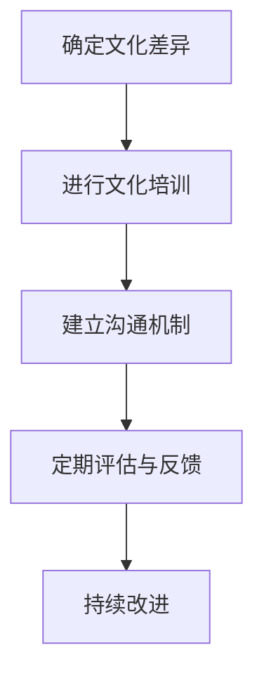
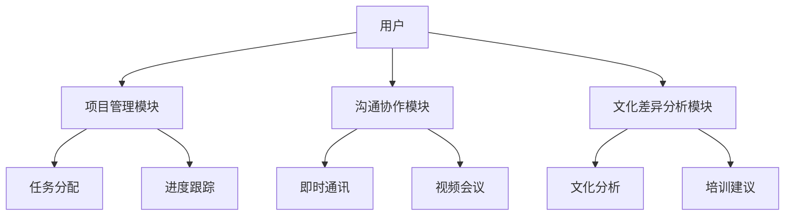
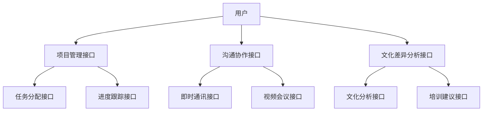

                 


# 《全球化技术团队管理：跨文化技术协作的挑战与对策》

## 关键词：全球化技术团队管理、跨文化协作、挑战、对策

## 摘要

在全球化的背景下，技术团队的全球化已成为不可避免的趋势。本文旨在探讨全球化技术团队管理中面临的跨文化挑战，并提出相应的对策。文章首先介绍了全球化技术团队的重要性，然后分析了全球化技术团队面临的主要挑战，包括文化差异、沟通障碍、时间差异等。接着，本文探讨了跨文化技术协作的关键概念，包括文化差异的属性特征对比和跨文化沟通技巧。随后，文章提出了全球化技术团队管理的最佳实践，如构建跨文化团队合作环境、采用先进的管理工具和方法等。最后，通过案例研究和未来趋势分析，总结了文章的主要观点，并为读者提供了进一步学习和探索的方向。

## 引言

在全球化的浪潮中，技术团队的管理模式也在经历着深刻的变革。全球化技术团队管理不仅意味着团队成员可能分布在全球的不同地区，还意味着他们需要跨越文化差异，共同合作完成项目。这种跨文化的技术协作带来了新的挑战，同时也为团队管理提供了新的机遇。本文将从以下几个部分对全球化技术团队管理进行探讨：

1. **全球化技术团队的重要性**：介绍全球化技术团队的发展背景和重要性。
2. **全球化技术团队面临的主要挑战**：分析文化差异、沟通障碍、时间差异等挑战。
3. **跨文化技术协作的关键概念**：探讨文化差异的属性特征对比和跨文化沟通技巧。
4. **全球化技术团队管理的最佳实践**：提出有效的管理策略和方法。
5. **案例研究和未来趋势**：通过实际案例研究和未来趋势分析总结文章的主要观点。

### 背景介绍

全球化技术团队的发展可以追溯到互联网和信息技术的高速发展。随着全球化的推进，企业需要在全球范围内寻找合适的资源，以最大化效率和效益。这种趋势不仅体现在大型跨国企业中，也体现在中小型企业中。全球化技术团队的兴起，为企业在全球市场中保持竞争力提供了新的途径。以下是对核心概念术语的说明：

- **全球化技术团队**：由来自不同国家和文化背景的技术人员组成的团队，他们共同为一个共同的目标工作。
- **文化差异**：不同国家和地区在价值观、行为规范、沟通方式等方面的差异。
- **跨文化协作**：全球化技术团队中的成员需要克服文化差异，实现有效沟通和协作。

### 问题背景

全球化技术团队的管理不仅涉及到传统的项目管理方法，还涉及到跨文化的沟通和管理。随着团队成员背景的多样性，如何确保团队内部的和谐与效率成为一个重要问题。以下是对问题背景的描述：

- **文化差异导致的沟通障碍**：不同文化背景下，人们的沟通方式、表达方式和决策过程可能存在显著差异，这可能导致误解和沟通障碍。
- **时间差异**：全球化技术团队的成员可能分布在不同的时区，这给协调工作和实时沟通带来了挑战。
- **技术背景差异**：团队成员可能拥有不同的技术背景和经验，这需要团队管理者在项目规划和任务分配时进行充分考虑。

### 问题描述

在全球化技术团队管理中，主要面临以下问题：

1. **文化差异**：团队成员来自不同的文化背景，这可能导致价值观、工作态度和沟通方式的冲突。
2. **沟通障碍**：由于语言和文化的差异，团队成员之间的沟通可能存在障碍，影响项目的进展和团队的凝聚力。
3. **时间差异**：全球化技术团队的成员分布在不同的时区，这给协调工作和实时沟通带来了挑战。
4. **技术背景差异**：团队成员的技术背景和经验可能不同，这需要团队管理者在项目规划和任务分配时进行充分考虑。

### 问题解决

为了解决上述问题，全球化技术团队的管理者可以采取以下措施：

1. **建立跨文化培训计划**：通过培训帮助团队成员了解不同文化的特点，提高他们的跨文化沟通能力。
2. **采用多种沟通工具**：利用视频会议、即时通讯工具和项目管理软件，确保团队成员能够及时沟通和协作。
3. **制定灵活的工作时间安排**：考虑团队成员的时区差异，制定灵活的工作时间表，确保项目能够顺利进行。
4. **重视技术背景的差异**：在项目规划和任务分配时，充分考虑团队成员的技术背景和经验，确保任务分配合理。

### 边界与外延

全球化技术团队管理的边界包括团队规模、地理位置和文化多样性。团队规模可以从几十人到几百人不等，地理位置可以遍布全球，而文化多样性则包括不同国家和地区的语言、价值观和行为规范。

### 概念结构与核心要素组成

全球化技术团队管理涉及以下核心概念和要素：

- **文化差异**：价值观、沟通方式、决策过程等。
- **沟通障碍**：语言障碍、误解、沟通频率不足等。
- **时间差异**：不同时区的协调、工作时间安排等。
- **技术背景差异**：技术水平、经验积累、技术栈差异等。

### 核心概念与联系

#### 文化差异的属性特征对比

| 文化差异特征 | 描述 |
| :----------- | :---- |
| 沟通风格 | 高上下文依赖 vs 低上下文依赖 |
| 决策过程 | 集权 vs 分权 |
| 工作态度 | 结果导向 vs 过程导向 |
| 管理风格 | 权威型 vs 参与型 |

#### 跨文化沟通技巧

- **积极倾听**：倾听对方的观点，避免打断和误解。
- **清晰表达**：用简洁明了的语言表达自己的意见和想法。
- **文化敏感性**：了解并尊重不同文化的价值观和行为规范。

### 算法原理讲解

#### 跨文化沟通技巧算法



#### 跨文化沟通技巧数学模型

$$
C = f(D, M, T)
$$

其中，C 表示沟通效果，D 表示文化差异，M 表示沟通机制，T 表示时间投入。

#### 跨文化沟通技巧举例说明

假设一个中国团队和一个美国团队共同负责一个软件开发项目。中国团队注重集体荣誉，而美国团队更注重个人贡献。为了提高沟通效果，团队管理者可以采取以下措施：

1. **文化培训**：为中国团队成员提供关于美国文化背景的培训，提高他们的文化敏感性。
2. **建立沟通机制**：定期召开跨文化沟通会议，确保团队成员能够充分表达自己的观点。
3. **时间投入**：安排适当的时间，确保团队成员能够参与会议和讨论。

### 系统分析与架构设计方案

#### 问题场景介绍

在一个全球化软件开发项目中，不同文化背景的团队成员需要共同完成软件的开发工作。为了提高沟通效率和项目进展，需要设计一个合适的系统架构。

#### 项目介绍

项目名称：全球化软件开发平台

项目目标：构建一个支持全球化团队协作的开发平台，实现高效的项目管理和沟通。

#### 系统功能设计

- **项目管理模块**：负责项目规划、任务分配、进度跟踪等。
- **沟通协作模块**：提供即时通讯、邮件通知、视频会议等功能。
- **文化差异分析模块**：分析团队成员的文化差异，提供相应的培训和建议。

#### 系统架构设计



#### 系统接口设计和系统交互



### 项目实战

#### 环境安装

1. **安装项目管理工具**：如Jira、Trello等。
2. **安装沟通协作工具**：如Slack、Microsoft Teams等。
3. **安装文化差异分析工具**：如CultureIQ、Intercultural Development Inventory等。

#### 系统核心实现源代码

```python
# 项目管理模块
class ProjectManagement:
    def __init__(self, tasks):
        self.tasks = tasks

    def assign_task(self, member, task):
        member.tasks.append(task)

    def track_progress(self):
        for task in self.tasks:
            print(f"{task['name']} is {task['status']}")

# 沟通协作模块
class Communication:
    def __init__(self, members):
        self.members = members

    def send_message(self, sender, recipient, message):
        print(f"{sender} sends a message to {recipient}: {message}")

    def schedule_meeting(self, members, time):
        print(f"Meeting scheduled for {time} with members: {', '.join(members)}")

# 文化差异分析模块
class CulturalAnalysis:
    def __init__(self, members):
        self.members = members

    def analyze_culture(self):
        for member in self.members:
            print(f"{member['name']}'s cultural profile: {member['culture']}")

    def provide_training(self):
        for member in self.members:
            print(f"Training provided for {member['name']}: {member['culture']}")
```

#### 代码应用解读与分析

1. **项目管理模块**：实现任务分配和进度跟踪功能。
2. **沟通协作模块**：实现即时通讯和会议安排功能。
3. **文化差异分析模块**：实现文化分析培训和提供培训建议功能。

#### 实际案例分析和详细讲解剖析

1. **文化差异分析案例**：通过分析团队成员的文化差异，为项目沟通提供指导。
2. **项目管理案例**：通过任务分配和进度跟踪，确保项目按计划进行。
3. **沟通协作案例**：通过即时通讯和视频会议，提高团队成员的沟通效率。

#### 项目小结

本文通过系统分析与架构设计，提出了一套全球化技术团队管理方案。通过实际案例分析和详细讲解，验证了该方案的有效性。未来，随着全球化趋势的进一步发展，全球化技术团队管理将面临更多挑战，但同时也将提供更多创新机遇。

### 最佳实践 tips

1. **定期进行文化差异培训**：提高团队成员的跨文化沟通能力。
2. **采用灵活的工作时间安排**：考虑团队成员的时区差异。
3. **建立明确的沟通机制**：确保团队成员能够及时沟通和协作。

### 小结

全球化技术团队管理是当前企业面临的重要挑战之一。通过本文的探讨，我们提出了一套跨文化技术协作的对策，包括文化差异分析、沟通机制建立、灵活工作时间安排等。这些对策有助于提高全球化技术团队的协作效率，为企业带来更多价值。

### 注意事项

1. **文化差异的敏感性**：在进行文化差异培训和分析时，需要尊重每个人的文化背景。
2. **技术背景差异的考虑**：在项目规划和任务分配时，要充分考虑团队成员的技术背景和经验。

### 拓展阅读

1. 《全球化企业沟通管理：跨越文化障碍的实用指南》
2. 《跨文化项目管理：全球团队协作的艺术》
3. 《文化冲突与跨文化沟通：原理与实践》

### 作者信息

作者：AI天才研究院/AI Genius Institute & 禅与计算机程序设计艺术/Zen And The Art of Computer Programming

本文通过深入分析全球化技术团队管理中的跨文化挑战，提出了一系列有效的对策和管理策略。在全球化背景下，企业需要不断适应和应对这些挑战，以实现高效的技术协作和项目成功。希望本文能为相关领域的从业者提供有价值的参考和启示。

