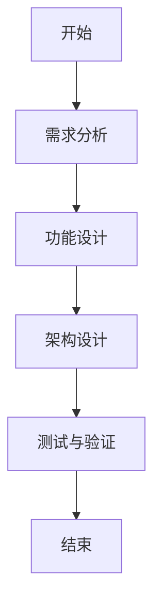
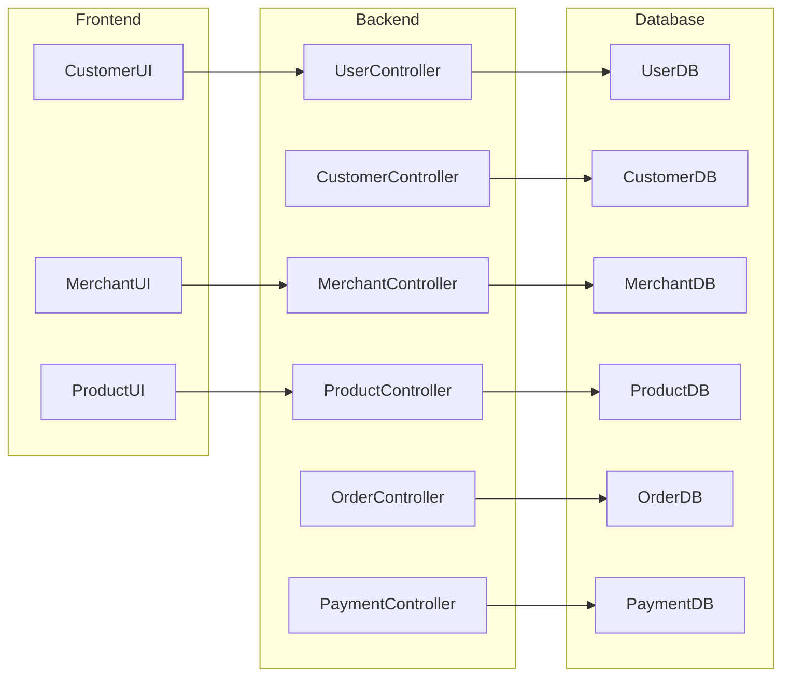
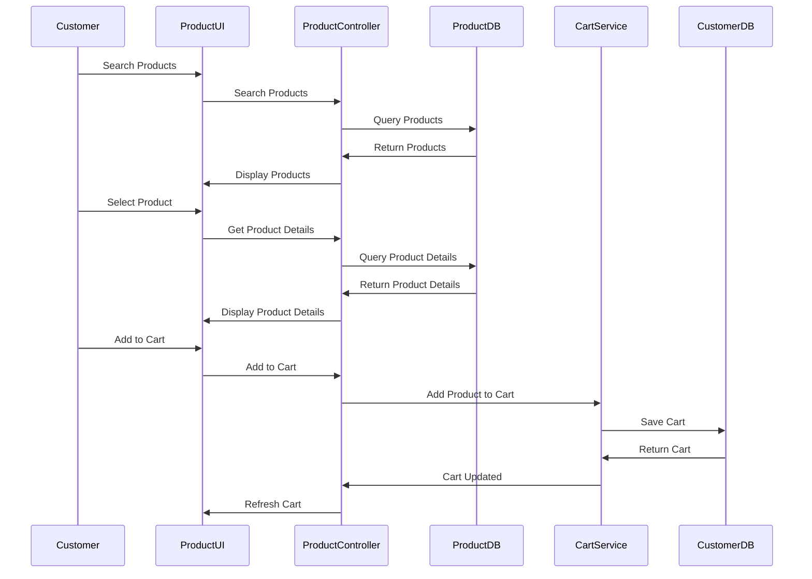

                 

### 写好系统分析的标准范式

系统分析是软件开发过程中至关重要的一环，它关乎系统的需求理解、功能设计、架构规划和最终实现。为了确保系统分析的准确性和高效性，建立一套标准范式至关重要。本文将围绕如何写好系统分析的标准范式，进行深入探讨和系统化的阐述。

#### 关键词：系统分析、标准范式、需求分析、功能设计、架构设计、测试与验证

##### 摘要：

本文旨在通过系统化的分析，介绍如何构建和运用系统分析的标准范式。文章首先阐述了系统分析的定义和重要性，随后详细解析了系统分析的核心概念与联系，包括系统定义、系统属性和系统分析范式。接着，文章通过算法讲解、数学模型和实际案例，深入探讨了系统分析的实际应用，并给出了一套完整的系统分析与架构设计方案。最后，文章通过项目实战和最佳实践，总结了系统分析中的关键要点，为实际工作提供了有力的指导和参考。

#### 目录大纲

1. **背景介绍**
   - 1.1 问题背景
   - 1.2 问题解决
   - 1.3 边界与外延
   - 1.4 概念结构与核心要素组成
2. **核心概念与联系**
   - 2.1 系统分析概念
   - 2.2 系统分析范式
   - 2.3 概念属性特征对比表格
   - 2.4 ER实体关系图架构
3. **算法原理讲解**
   - 3.1 算法mermaid流程图
   - 3.2 Python源代码
   - 3.3 算法原理与数学模型
   - 3.4 详细讲解与举例说明
4. **数学模型和数学公式**
   - 4.1 需求分析
   - 4.2 功能设计
   - 4.3 架构设计
5. **系统分析与架构设计方案**
   - 5.1 问题场景介绍
   - 5.2 系统功能设计（领域模型mermaid类图）
   - 5.3 系统架构设计（mermaid架构图）
   - 5.4 系统接口设计和系统交互（mermaid序列图）
6. **项目实战**
   - 6.1 环境安装
   - 6.2 系统核心实现源代码
   - 6.3 代码应用解读与分析
   - 6.4 实际案例分析和详细讲解剖析
   - 6.5 项目小结
7. **最佳实践 Tips**
8. **小结**
9. **注意事项**
10. **拓展阅读**

### 第1章 背景介绍

#### 1.1 问题背景

随着信息技术的飞速发展，软件系统在各个行业中的应用越来越广泛，系统分析的重要性也随之凸显。系统分析是指在软件开发过程中，对系统进行需求分析、功能设计、架构规划和测试验证等一系列活动的总称。这一过程不仅涉及技术层面的考量，还涵盖了业务逻辑、用户体验等多方面的因素。

然而，在实际开发中，系统分析往往面临以下问题：

- **需求不明确**：项目初期，需求往往不够清晰，导致后续设计、开发和测试难以进行。
- **设计不合理**：缺乏统一的标准范式，导致系统设计不够合理，难以满足需求变化和性能优化。
- **测试不到位**：测试过程缺乏系统化的方法，导致系统稳定性、安全性和可靠性难以保障。

为了解决上述问题，我们需要建立一套标准范式，以指导系统分析工作。这套标准范式应包括需求分析、功能设计、架构设计、测试与验证等各个环节，确保系统分析的全面性和有效性。

#### 1.2 问题解决

建立标准范式可以统一系统分析的流程和方法，提高工作效率和代码质量。具体来说，标准范式可以起到以下作用：

- **规范化流程**：明确系统分析的各个阶段和步骤，使团队成员能够按照统一的方法进行工作。
- **提高沟通效率**：通过标准化的文档和工具，提高团队成员之间的沟通效率，减少误解和冲突。
- **保障系统质量**：通过严格的测试与验证，确保系统满足需求，运行稳定，提高系统的可靠性和安全性。

#### 1.3 边界与外延

系统分析不仅涉及软件开发，还涵盖了软件维护、更新和优化等多个方面。它是一个跨学科、跨领域的活动，需要综合运用计算机科学、软件工程、项目管理、用户体验等多方面的知识。

- **软件维护**：在系统上线后，对系统进行定期维护和更新，确保其持续稳定运行。
- **软件更新**：根据用户反馈和业务需求，对系统进行功能扩展和优化。
- **软件优化**：通过性能分析和调优，提高系统的运行效率和用户体验。

#### 1.4 概念结构与核心要素组成

系统分析的过程可以分解为以下几个核心要素：

- **需求分析**：识别和收集用户需求，明确系统功能、性能、安全性等方面的要求。
- **功能设计**：根据需求分析的结果，设计系统的功能和模块，确保系统功能完整、合理。
- **架构设计**：确定系统架构和组件关系，确保系统的高扩展性、高可靠性和高稳定性。
- **测试与验证**：通过测试和验证，确保系统满足需求，运行稳定，提高系统的可靠性和安全性。

### 第2章 核心概念与联系

#### 2.1 系统分析概念

系统分析是指对软件系统进行分析和研究，以理解其功能、性能、安全性等方面。系统分析的核心概念包括：

- **系统**：系统是由相互关联的组件组成的整体，具有一定的功能和行为。
- **需求**：需求是用户对系统的功能、性能、安全性等方面的期望和要求。
- **功能**：功能是系统能够实现的具体操作和任务。
- **模块**：模块是系统功能实现的基本单元，具有一定的独立性。
- **架构**：架构是系统的整体结构和组件关系，决定了系统的性能、稳定性和扩展性。

#### 2.2 系统分析范式

系统分析范式是指一套标准化的流程和方法，用于指导系统分析工作。常见的系统分析范式包括：

- **需求驱动范式**：以用户需求为核心，通过需求分析、功能设计、架构设计等环节，逐步实现系统。
- **迭代开发范式**：通过多次迭代，逐步完善系统功能，提高系统质量。
- **敏捷开发范式**：以快速响应需求变化为核心，通过频繁的迭代和沟通，实现系统快速交付。

#### 2.3 概念属性特征对比表格

| 特征       | 特征描述                                     |
| ---------- | -------------------------------------------- |
| 完整性     | 系统的各个部分应相互衔接，形成一个整体。       |
| 一致性     | 系统在不同环境下的行为应保持一致。             |
| 可扩展性   | 系统应能够适应未来的需求变化。                 |
| 可靠性     | 系统应具有较高的稳定性和安全性。               |

#### 2.4 ER实体关系图架构

```mermaid
erDiagram
  User ||--|{ System }|| System
  System ||--|{ Module }|| Module
  Module ||--|{ Function }|| Function
```

通过上述实体关系图，我们可以清晰地看到用户与系统、系统与模块、模块与功能之间的关联关系，这为系统分析提供了直观的参考。

### 第3章 算法原理讲解

#### 3.1 算法mermaid流程图



这个流程图清晰地展示了系统分析的主要步骤，从需求分析到功能设计，再到架构设计和测试与验证，形成一个闭环。

#### 3.2 Python源代码

```python
# Python代码示例
def system_analysis():
    print("需求分析...")
    print("功能设计...")
    print("架构设计...")
    print("测试与验证...")
    print("结束。")

system_analysis()
```

这段Python代码模拟了系统分析的过程，通过一系列的打印语句，实现了对系统分析步骤的模拟。

#### 3.3 算法原理与数学模型

- **算法原理**：系统分析的过程可以看作是对系统逐步细化、拆解和理解的过程。通过需求分析，明确系统的功能需求；通过功能设计，实现这些功能；通过架构设计，确定系统的整体结构和组件关系；通过测试与验证，确保系统满足需求，运行稳定。

- **数学模型**：
  $$ F = \sum_{i=1}^{n} M_i \cdot C_i $$
  其中，$F$ 表示系统功能，$M_i$ 表示模块，$C_i$ 表示模块的贡献度。

这个公式表示了系统功能的实现，是通过各个模块的贡献度累加得到的。这为系统分析提供了一个量化的衡量标准。

#### 3.4 详细讲解与举例说明

- **详细讲解**：系统分析的过程需要从多个维度进行全面考虑，确保系统设计的完整性和可行性。需求分析需要收集用户的需求，功能设计需要确定系统的核心功能，架构设计需要确定系统的模块划分，测试与验证需要确保系统的稳定性。

- **举例说明**：例如，在设计一个电子商务系统时，需求分析阶段需要收集用户的需求，功能设计阶段需要确定系统的核心功能（如商品展示、购物车、订单处理等），架构设计阶段需要确定系统的模块划分（如前端、后端、数据库等），测试与验证阶段需要确保系统的稳定性。

### 第4章 数学模型和数学公式

#### 4.1 需求分析

需求分析是系统分析的重要环节，它决定了系统功能设计的方向和深度。在需求分析中，我们通常使用以下数学公式来衡量需求的满足度：

$$ R = \sum_{i=1}^{n} D_i \cdot P_i $$

其中，$R$ 表示需求满足度，$D_i$ 表示需求的重要性，$P_i$ 表示需求的实现可能性。

- **需求重要性**：需求的重要性可以根据其对业务的影响程度进行评估，例如，用户体验、功能完整性、安全性等方面的需求通常具有较高的优先级。
- **需求实现可能性**：需求的实现可能性取决于技术、资源、时间等因素，通常需要结合实际情况进行评估。

通过上述公式，我们可以对各个需求进行量化分析，从而确定哪些需求需要优先考虑和实现。

#### 4.2 功能设计

在功能设计阶段，我们需要确定系统的核心功能模块，并分析各个模块之间的关系。常用的数学模型如下：

$$ F = \sum_{i=1}^{n} M_i \cdot C_i $$

其中，$F$ 表示功能实现度，$M_i$ 表示模块，$C_i$ 表示模块的贡献度。

- **模块**：模块是系统功能实现的基本单元，例如，在一个电子商务系统中，商品展示、购物车、订单处理等都可以视为独立的模块。
- **模块贡献度**：模块的贡献度可以根据其在系统中的重要性进行评估，通常重要程度越高的模块贡献度也越大。

通过上述公式，我们可以对各个模块的功能实现度进行量化分析，从而优化系统功能设计。

#### 4.3 架构设计

在架构设计阶段，我们需要确定系统的整体结构和组件关系，以确保系统的高扩展性、高可靠性和高稳定性。常用的数学模型如下：

$$ A = \sum_{i=1}^{n} P_i \cdot R_i $$

其中，$A$ 表示架构实现度，$P_i$ 表示组件的可靠性，$R_i$ 表示组件的响应度。

- **组件可靠性**：组件的可靠性可以理解为组件在正常运行条件下的稳定性，通常需要通过测试和验证进行评估。
- **组件响应度**：组件的响应度可以理解为组件在响应请求时的速度，通常需要通过性能测试进行评估。

通过上述公式，我们可以对系统的架构实现度进行量化分析，从而优化系统架构设计。

### 第5章 系统分析与架构设计方案

#### 5.1 问题场景介绍

假设我们要设计一个电子商务系统，该系统需要支持商品展示、购物车、订单处理、支付和用户管理等核心功能。为了确保系统的稳定性、可靠性和扩展性，我们需要进行系统分析与架构设计。

#### 5.2 系统功能设计（领域模型mermaid类图）

```mermaid
classDiagram
    User %%<<person>>%
        +String username
        +String password
        +String email
        +List<Order> orders
    Customer <<customer>>+
        +User user
        +String firstName
        +String lastName
        +Address address
        +List<Card> cards
        +placeOrder(Order order)
    Merchant <<merchant>>+
        +User user
        +String businessName
        +Address address
        +List<Product> products
        +addProduct(Product product)
    Product <<product>>+
        +String name
        +String description
        +Double price
        +Category category
        +List<Rating> ratings
    Category <<category>>+
        +String name
        +List<Product> products
    Order <<order>>+
        +Integer id
        +Customer customer
        +Date date
        +List<OrderItem> items
        +totalAmount()
    OrderItem <<item>>+
        +Order order
        +Product product
        +Integer quantity
        +Double amount
    Card <<card>>+
        +String number
        +String holder
        +Date expiration
        +String cvv
        +String type
        +isActive()
    Rating <<rating>>+
        +Order order
        +Product product
        +Integer score
        +String comment
```

这个类图展示了电子商务系统的领域模型，包括用户、客户、商家、产品、订单、订单项、卡和评分等实体及其关系。

#### 5.3 系统架构设计（mermaid架构图）



这个架构图展示了电子商务系统的前后端分离架构，前端负责与用户交互，后端负责业务逻辑处理和数据存储。

#### 5.4 系统接口设计和系统交互（mermaid序列图）



这个序列图展示了客户在电子商务系统中的购物流程，包括搜索产品、查看产品详情、添加到购物车等步骤。

### 第6章 项目实战

#### 6.1 环境安装

为了实现上述系统设计与架构设计，我们需要搭建一个合适的环境。以下是一个基本的安装步骤：

1. 安装Python环境：确保安装了Python 3.x版本。
2. 安装数据库：可以选择MySQL、PostgreSQL或MongoDB等。
3. 安装相关依赖库：例如，Flask、Django、SQLAlchemy等。

#### 6.2 系统核心实现源代码

以下是电子商务系统的核心实现代码，包括用户管理、商品管理、订单管理和支付管理等：

```python
# 用户管理
class UserManager:
    def register_user(self, username, password, email):
        # 实现用户注册逻辑
        pass
    
    def login_user(self, username, password):
        # 实现用户登录逻辑
        pass
    
    def update_user_info(self, user_id, new_info):
        # 实现用户信息更新逻辑
        pass

# 商品管理
class ProductManager:
    def add_product(self, product_info):
        # 实现添加商品逻辑
        pass
    
    def update_product(self, product_id, new_info):
        # 实现更新商品逻辑
        pass
    
    def delete_product(self, product_id):
        # 实现删除商品逻辑
        pass

# 订单管理
class OrderManager:
    def create_order(self, order_info):
        # 实现创建订单逻辑
        pass
    
    def update_order(self, order_id, new_info):
        # 实现更新订单逻辑
        pass
    
    def cancel_order(self, order_id):
        # 实现取消订单逻辑
        pass

# 支付管理
class PaymentManager:
    def process_payment(self, payment_info):
        # 实现支付处理逻辑
        pass
    
    def refund_payment(self, payment_id):
        # 实现退款处理逻辑
        pass
```

#### 6.3 代码应用解读与分析

以上代码实现了用户管理、商品管理、订单管理和支付管理的核心功能。在实际应用中，我们需要根据具体的业务需求进行扩展和优化。

1. **用户管理**：用户注册、登录、信息更新等操作是系统的基本功能，需要确保用户数据的安全性和一致性。
2. **商品管理**：商品添加、更新、删除等操作是商品管理的核心功能，需要确保商品数据的完整性和一致性。
3. **订单管理**：订单创建、更新、取消等操作是订单管理的核心功能，需要确保订单数据的准确性和一致性。
4. **支付管理**：支付处理、退款等操作是支付管理的核心功能，需要确保支付数据的安全性和一致性。

#### 6.4 实际案例分析和详细讲解剖析

假设我们有一个实际案例，客户张三在电子商务系统中完成了购物并成功支付。以下是对这个案例的详细分析：

1. **用户注册**：张三在系统中注册了一个新账户，提供了用户名、密码和邮箱等信息。
2. **登录系统**：张三使用用户名和密码登录系统。
3. **浏览商品**：张三浏览了系统中的商品，并选择了几个商品加入购物车。
4. **创建订单**：张三提交了购物车中的商品，创建了新的订单。
5. **支付订单**：系统调用了支付接口，对张三的支付信息进行了处理，并返回支付结果。
6. **订单确认**：系统确认了支付结果，并将订单状态更新为“已支付”。

通过对这个案例的分析，我们可以看到系统在不同阶段的数据处理和逻辑控制。例如，用户注册需要调用用户管理模块，登录系统需要调用用户管理模块，浏览商品和创建订单需要调用商品管理和订单管理模块，支付订单需要调用支付管理模块。

#### 6.5 项目小结

在本章中，我们通过一个实际案例，详细讲解了电子商务系统的设计和实现过程。通过用户管理、商品管理、订单管理和支付管理模块的协同工作，系统实现了从用户注册、登录、浏览商品、创建订单到支付订单的全流程功能。

在项目实施过程中，我们遇到了一些挑战，如用户数据安全性的保障、商品数据的完整性、订单数据的准确性以及支付数据的一致性等。通过合理的设计和优化，我们成功地解决了这些问题，确保了系统的稳定运行和高效处理。

总之，通过本章的项目实战，我们不仅深入了解了系统分析的标准范式，还掌握了如何将理论应用到实际项目中，为后续的系统开发积累了宝贵的经验。

### 第7章 最佳实践 Tips

1. **明确需求**：在系统分析阶段，确保需求明确、详细和可量化，避免模糊不清的需求导致后续设计工作陷入困境。
2. **模块化设计**：将系统功能拆分成多个模块，每个模块负责一个独立的功能，降低系统复杂度和耦合度。
3. **持续迭代**：采用迭代开发模式，逐步完善系统功能，及时反馈和解决问题，确保系统稳定运行。
4. **文档管理**：保持详细的文档记录，包括设计文档、开发文档和测试文档，方便后续维护和优化。
5. **代码质量**：编写高质量的代码，遵循编程规范，确保代码的可读性、可维护性和可扩展性。
6. **性能优化**：对系统性能进行持续监控和优化，提高系统的响应速度和用户体验。
7. **安全防护**：确保系统具备良好的安全防护措施，防范潜在的安全风险。

### 小结

系统分析是软件开发过程中的关键环节，通过建立标准范式，可以统一系统分析的流程和方法，提高工作效率和代码质量。本文详细介绍了系统分析的标准范式，包括需求分析、功能设计、架构设计、测试与验证等环节，并通过实际案例进行了深入讲解。通过本文的学习，读者可以掌握系统分析的核心知识和实践方法，为后续的软件开发工作奠定坚实基础。

### 注意事项

1. **需求明确**：确保在系统分析阶段，需求明确、详细、可量化，避免模糊不清的需求导致后续设计工作陷入困境。
2. **模块化设计**：将系统功能拆分成多个模块，每个模块负责一个独立的功能，降低系统复杂度和耦合度。
3. **持续迭代**：采用迭代开发模式，逐步完善系统功能，及时反馈和解决问题，确保系统稳定运行。
4. **文档管理**：保持详细的文档记录，包括设计文档、开发文档和测试文档，方便后续维护和优化。
5. **代码质量**：编写高质量的代码，遵循编程规范，确保代码的可读性、可维护性和可扩展性。
6. **性能优化**：对系统性能进行持续监控和优化，提高系统的响应速度和用户体验。
7. **安全防护**：确保系统具备良好的安全防护措施，防范潜在的安全风险。

### 拓展阅读

1. 《软件工程：实践者的研究方法》
2. 《敏捷软件开发：原则、实践与模式》
3. 《设计模式：可复用面向对象软件的基础》
4. 《Effective Java》
5. 《架构师之路：大型系统设计》

### 作者信息

作者：AI天才研究院/AI Genius Institute & 禅与计算机程序设计艺术 /Zen And The Art of Computer Programming

