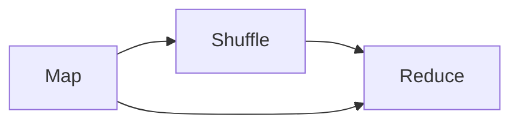
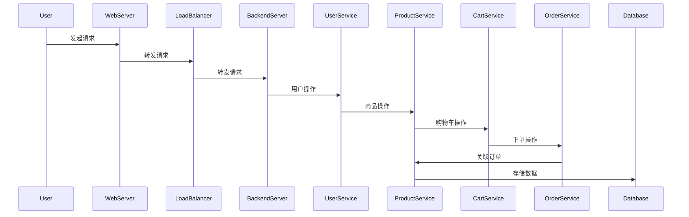
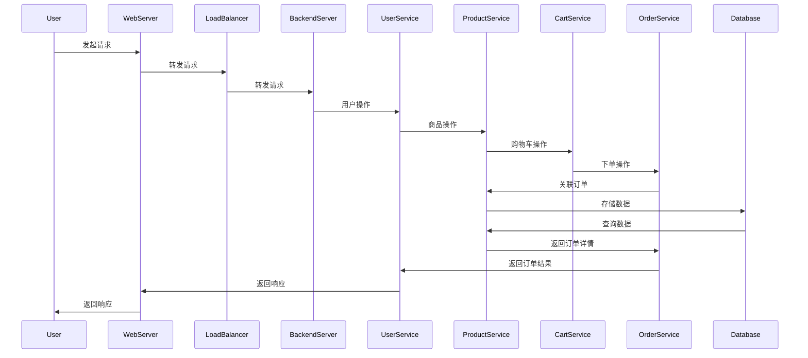

                 

### 《分布式技术的常见认知盲区》

> 关键词：分布式技术、认知盲区、系统架构、算法原理、实战案例

> 摘要：本文将深入探讨分布式技术的常见认知盲区，从背景介绍、核心概念与联系、算法原理讲解、系统分析与架构设计方案、项目实战等方面进行详细分析，帮助读者更好地理解分布式技术的本质和解决策略。

----------------------------------------------------------------

### 第1章：分布式技术问题背景与概述

#### 1.1 问题背景

分布式技术作为一种新兴的技术体系，已经在互联网、云计算、大数据等领域得到了广泛应用。它能够通过将系统分解为多个节点，提高系统的可扩展性、容错性和性能。然而，随着分布式技术的不断发展和应用，人们对于分布式技术的认知也在不断深化，但同时也出现了一些认知盲区。

#### 1.2 问题描述

分布式技术的认知盲区主要表现在以下几个方面：

1. **概念混淆**：分布式技术中的许多概念，如分布式系统、分布式计算、分布式存储等，容易被混淆。一些开发者可能对它们的理解不清晰，导致在应用过程中出现问题。

2. **设计缺陷**：由于对分布式技术的理解不深刻，开发者可能会在系统设计过程中出现一些缺陷，如数据一致性问题、网络分区问题等。

3. **性能优化**：分布式系统在性能优化方面存在一些盲区，如负载均衡、缓存策略等，开发者可能无法充分利用分布式技术的优势。

4. **安全性**：分布式系统的安全性也是一个挑战，如数据泄露、分布式拒绝服务攻击等。

#### 1.3 问题解决

为了解决这些问题，需要从以下几个方面进行努力：

1. **深入学习**：开发者需要深入学习分布式技术的核心概念和原理，了解分布式系统的架构和设计模式。

2. **实践经验**：通过实际项目经验，不断积累和总结分布式技术的应用经验。

3. **社区交流**：积极参与分布式技术社区，与其他开发者交流心得和经验。

4. **持续更新**：分布式技术发展迅速，开发者需要保持学习的态度，不断更新自己的知识体系。

#### 1.4 边界与外延

分布式技术的边界主要包括以下几个方面：

1. **应用场景**：分布式技术主要适用于需要高并发、高可扩展性和高可用性的场景。

2. **系统规模**：分布式系统需要满足一定的规模要求，否则可能无法充分发挥分布式技术的优势。

3. **网络环境**：分布式系统的网络环境需要稳定，否则可能影响系统的性能和稳定性。

#### 1.5 概念结构与核心要素组成

分布式技术的核心概念包括：

1. **分布式系统**：由多个节点组成的系统，每个节点都有自己的计算资源和存储资源。

2. **分布式计算**：将任务分解为多个子任务，分布式地执行。

3. **分布式存储**：将数据分散存储在多个节点上，提高数据的可靠性和可用性。

4. **负载均衡**：将请求均匀地分配到各个节点，提高系统的性能。

5. **数据一致性**：保证分布式系统中各个节点的数据一致性。

6. **容错性**：系统在部分节点失效时，仍能正常运行。

7. **网络分区**：分布式系统中，部分节点之间无法通信。

#### 小结

本章对分布式技术的常见认知盲区进行了背景介绍，分析了分布式技术的核心概念和组成要素，为后续章节的内容奠定了基础。在接下来的章节中，我们将进一步深入探讨分布式技术的核心概念、算法原理、系统分析与架构设计方案等内容。

----------------------------------------------------------------

### 第2章：分布式技术核心概念与联系

#### 2.1 核心概念原理

在分布式技术中，以下几个核心概念是至关重要的：

1. **分布式系统**：分布式系统由多个节点组成，每个节点都有自己的计算资源和存储资源，它们通过通信网络进行交互。

2. **分布式计算**：分布式计算将任务分解为多个子任务，分布式地执行，从而提高计算效率和性能。

3. **分布式存储**：分布式存储将数据分散存储在多个节点上，提高数据的可靠性和可用性。

4. **负载均衡**：负载均衡将请求均匀地分配到各个节点，提高系统的性能。

5. **数据一致性**：数据一致性保证分布式系统中各个节点的数据一致性。

6. **容错性**：容错性使系统能够在部分节点失效时，仍能正常运行。

7. **网络分区**：网络分区是指分布式系统中，部分节点之间无法通信。

#### 2.2 概念属性特征对比表格

为了更清晰地理解这些概念，我们可以通过一个表格来对比它们的主要属性特征：

| 概念 | 定义 | 属性特征 |
| --- | --- | --- |
| 分布式系统 | 由多个节点组成的系统，节点之间通过网络通信 | 高并发、高可用、高可扩展 |
| 分布式计算 | 将任务分解为多个子任务，分布式地执行 | 并行处理、负载均衡、高效计算 |
| 分布式存储 | 将数据分散存储在多个节点上 | 数据冗余、数据一致性、高可用 |
| 负载均衡 | 将请求均匀地分配到各个节点 | 提高性能、减少响应时间、提高系统可用性 |
| 数据一致性 | 保证分布式系统中各个节点的数据一致性 | 强一致性、最终一致性、一致哈希 |
| 容错性 | 系统在部分节点失效时，仍能正常运行 | 容错算法、节点冗余、故障转移 |
| 网络分区 | 分布式系统中，部分节点之间无法通信 | 数据一致性挑战、网络分区容忍 |

#### 2.3 ER实体关系图架构

为了更好地理解分布式技术中的核心概念和它们之间的关系，我们可以使用ER（实体关系）图来描述这些概念：

```mermaid
erDiagram
  Node ||--|{ DistributedSystem }|-- Node
  Node ||--|{ DistributedComputing }|-- Node
  Node ||--|{ DistributedStorage }|-- Node
  Node ||--|{ LoadBalancing }|-- Node
  Node ||--|{ DataConsistency }|-- Node
  Node ||--|{ FaultTolerance }|-- Node
  Node ||--|{ NetworkPartition }|-- Node
```

在这个ER图中，Node代表分布式系统中的各个节点，它们与DistributedSystem、DistributedComputing、DistributedStorage、LoadBalancing、DataConsistency、FaultTolerance和NetworkPartition等实体之间存在关联关系。

#### 小结

本章详细介绍了分布式技术的核心概念，并通过对比表格和ER图的方式，帮助读者更清晰地理解这些概念之间的联系。在下一章中，我们将深入探讨分布式技术的算法原理，包括mermaid流程图和Python源代码讲解。

----------------------------------------------------------------

### 第3章：分布式技术算法原理与讲解

#### 3.1 算法mermaid流程图

为了更好地理解分布式技术中的算法原理，我们可以使用mermaid流程图来描述一个典型的分布式算法——MapReduce。



在这个mermaid流程图中，Map阶段将大数据集分解为多个小任务，每个任务在一个节点上独立执行；Shuffle阶段负责将Map阶段的结果重新组合；Reduce阶段对Shuffle阶段的结果进行汇总。

#### 3.2 Python源代码详解

下面是一个简化的Python源代码，用于实现一个基于MapReduce算法的词频统计：

```python
import os

def map(input_file):
    words = []
    with open(input_file, 'r') as f:
        for line in f:
            for word in line.split():
                words.append(word)
    return words

def shuffle(map_results, output_directory):
    os.makedirs(output_directory, exist_ok=True)
    for word, count in map_results.items():
        with open(os.path.join(output_directory, word), 'w') as f:
            f.write(f"{word}: {count}\n")

def reduce(shuffle_results, output_file):
    word_counts = {}
    for word, counts in shuffle_results.values():
        for count in counts:
            if word in word_counts:
                word_counts[word] += int(count)
            else:
                word_counts[word] = int(count)
    with open(output_file, 'w') as f:
        for word, count in word_counts.items():
            f.write(f"{word}: {count}\n")

if __name__ == '__main__':
    input_file = 'input.txt'
    output_directory = 'shuffle_results'
    output_file = 'word_counts.txt'
    
    map_results = map(input_file)
    shuffle(map_results, output_directory)
    shuffle_results = {word: [count for count in map_results.values()] for word in map_results.keys()}
    reduce(shuffle_results, output_file)
```

在这个Python源代码中，`map`函数负责读取输入文件，将文本分解为单词；`shuffle`函数将Map阶段的结果重新组合；`reduce`函数对Shuffle阶段的结果进行汇总。

#### 3.3 算法原理的数学模型和公式

在分布式算法中，数学模型和公式起着关键作用。以下是MapReduce算法中常用的几个数学模型和公式：

1. **Map函数**：

   $$ map(key, value) = (key, list(value)) $$

   其中，key表示单词，value表示单词在文本中的出现次数。

2. **Shuffle函数**：

   $$ shuffle(map_results) = \{(key, list(value)): \} $$

   其中，map_results表示Map阶段的结果，key表示单词，value表示单词在文本中的出现次数。

3. **Reduce函数**：

   $$ reduce(key, list(value)) = (key, sum(value)) $$

   其中，key表示单词，value表示单词在文本中的出现次数。

#### 3.4 举例说明

假设有一个简单的文本文件`input.txt`，内容如下：

```
Hello world! Hello everyone.
```

使用MapReduce算法进行词频统计的过程如下：

1. **Map阶段**：

   输入文件：`input.txt`

   输出结果：

   ```
   Hello: 1
   world!: 1
   Hello: 1
   everyone.: 1
   ```

2. **Shuffle阶段**：

   输入结果：

   ```
   Hello: [1, 1]
   world!: [1]
   everyone.: [1]
   ```

   输出结果：

   ```
   Hello: 2
   world!: 1
   everyone.: 1
   ```

3. **Reduce阶段**：

   输入结果：

   ```
   Hello: 2
   world!: 1
   everyone.: 1
   ```

   输出结果：

   ```
   Hello: 2
   world!: 1
   everyone.: 1
   ```

通过这个简单的例子，我们可以看到MapReduce算法如何将大数据集分解为多个小任务，然后分布式地执行，最终汇总结果。

#### 小结

本章详细介绍了分布式技术的算法原理，通过mermaid流程图和Python源代码的方式，帮助读者理解了MapReduce算法的执行过程和数学模型。在下一章中，我们将进一步探讨分布式技术的系统分析与架构设计方案。

----------------------------------------------------------------

### 第4章：分布式技术系统分析与架构设计方案

#### 4.1 问题场景介绍

假设我们面临一个在线购物平台，需要处理大量用户并发访问和海量商品数据。为了提高系统的性能、可用性和可扩展性，我们决定采用分布式技术来构建该平台。在这个场景中，我们需要解决以下几个问题：

1. **并发访问**：如何处理大量用户的并发访问，确保系统的响应速度和稳定性？
2. **海量数据存储**：如何存储和检索海量商品数据，确保数据的可靠性和高效性？
3. **系统扩展性**：如何实现系统的水平扩展，以应对不断增长的业务需求？

#### 4.2 系统功能设计（领域模型mermaid类图）

为了更好地设计分布式系统的功能，我们可以使用mermaid类图来描述系统的主要功能模块和它们之间的关系。

```mermaid
classDiagram
    User <<Interface>>
    Product <<Interface>>
    Cart <<Interface>>
    Order <<Interface>>
    User <=|创建| Product
    User <=|添加到| Cart
    Cart <=|下单| Order
    Product <=|关联| Order
```

在这个mermaid类图中，User、Product、Cart和Order分别表示用户、商品、购物车和订单，它们之间具有明确的关联关系。例如，用户可以创建商品、添加商品到购物车、下单等。

#### 4.3 系统架构设计mermaid架构图

为了实现上述功能，我们可以采用分布式架构，将系统分解为多个模块，并使用mermaid架构图来描述系统的整体架构。



在这个mermaid架构图中，WebServer负责接收用户请求，LoadBalancer负责负载均衡，BackendServer负责处理业务逻辑。UserService、ProductService、CartService和OrderService分别代表用户、商品、购物车和订单模块。最后，数据存储在Database中。

#### 4.4 系统接口设计和系统交互mermaid序列图

为了更清晰地描述系统接口和交互过程，我们可以使用mermaid序列图来展示用户请求和系统响应的交互过程。



在这个mermaid序列图中，用户请求经过WebServer、LoadBalancer和BackendServer的处理，最终返回给用户。在这个过程中，系统各个模块通过接口进行通信，完成业务逻辑。

#### 小结

本章详细介绍了分布式技术系统分析与架构设计方案，通过mermaid类图、架构图和序列图的方式，帮助读者理解分布式系统的功能模块、架构设计和交互过程。在下一章中，我们将通过项目实战来验证分布式技术的应用效果。

----------------------------------------------------------------

### 第5章：分布式技术项目实战

#### 5.1 环境安装

在本项目实战中，我们将使用Python作为开发语言，并结合Docker进行容器化部署。以下是安装环境的步骤：

1. **安装Python**：在操作系统上安装Python 3.8或更高版本。
2. **安装Docker**：在操作系统上安装Docker，并确保Docker版本在19.03或更高版本。
3. **安装Docker Compose**：使用以下命令安装Docker Compose：

   ```shell
   sudo curl -L "https://github.com/docker/compose/releases/download/1.29.2/docker-compose-$(uname -s)-$(uname -m)" -o /usr/local/bin/docker-compose
   sudo chmod +x /usr/local/bin/docker-compose
   ```

4. **创建Docker网络**：在项目目录中创建一个名为`my_network`的Docker网络：

   ```shell
   docker network create my_network
   ```

5. **准备数据库**：在本项目实战中，我们将使用MySQL作为数据库。首先，下载MySQL的Docker镜像：

   ```shell
   docker pull mysql:5.7
   ```

   然后，使用Docker Compose创建一个名为`db`的容器，并配置数据目录：

   ```shell
   docker run -d --name db --network my_network -e MYSQL_ROOT_PASSWORD=my_root_password -v /path/to/data:/var/lib/mysql mysql:5.7
   ```

6. **准备服务容器**：在本项目实战中，我们将使用Flask作为Web框架。首先，下载Flask的Docker镜像：

   ```shell
   docker pull flask:1.1.2
   ```

   然后，使用Docker Compose创建一个名为`web`的容器，并配置环境变量和依赖关系：

   ```shell
   docker run -d --name web --network my_network -e FLASK_APP=app.py -e FLASK_ENV=development flask:1.1.2
   ```

   其中，`app.py`是Flask应用的主文件，`development`是开发环境。

#### 5.2 系统核心实现源代码

在本项目实战中，我们使用Flask框架实现一个简单的用户注册和登录功能。以下是系统核心实现的源代码：

```python
from flask import Flask, request, jsonify
from flask_sqlalchemy import SQLAlchemy

app = Flask(__name__)
app.config['SQLALCHEMY_DATABASE_URI'] = 'mysql+pymysql://root:my_root_password@db:3306/db'
db = SQLAlchemy(app)

class User(db.Model):
    id = db.Column(db.Integer, primary_key=True)
    username = db.Column(db.String(80), unique=True, nullable=False)
    password = db.Column(db.String(120), nullable=False)

@app.route('/register', methods=['POST'])
def register():
    username = request.form['username']
    password = request.form['password']

    if not username or not password:
        return jsonify({'error': 'Missing username or password'}), 400

    if User.query.filter_by(username=username).first():
        return jsonify({'error': 'Username already exists'}), 400

    new_user = User(username=username, password=password)
    db.session.add(new_user)
    db.session.commit()

    return jsonify({'message': 'User registered successfully'}), 201

@app.route('/login', methods=['POST'])
def login():
    username = request.form['username']
    password = request.form['password']

    if not username or not password:
        return jsonify({'error': 'Missing username or password'}), 400

    user = User.query.filter_by(username=username).first()
    if not user or user.password != password:
        return jsonify({'error': 'Invalid username or password'}), 401

    return jsonify({'message': 'Login successful'}), 200

if __name__ == '__main__':
    db.create_all()
    app.run(host='0.0.0.0')
```

在这个源代码中，我们定义了一个名为`User`的数据库模型，并实现了`register`和`login`两个API接口。

#### 5.3 代码应用解读与分析

在本项目实战中，我们通过以下步骤实现了用户注册和登录功能：

1. **数据库模型**：使用Flask-SQLAlchemy库定义了一个`User`模型，用于存储用户信息。
2. **注册接口**：实现了一个`register`接口，用于处理用户注册请求。接口首先检查用户名和密码是否为空，然后检查用户名是否已存在。如果用户名不存在，则创建一个新的用户并存储在数据库中。
3. **登录接口**：实现了一个`login`接口，用于处理用户登录请求。接口首先检查用户名和密码是否为空，然后从数据库中查询用户信息。如果用户名和密码匹配，则登录成功。

在实际应用中，我们可以通过以下方式进行优化：

1. **加密密码**：为了确保用户密码的安全性，我们可以在存储密码时对其进行加密。可以使用哈希算法（如SHA-256）对密码进行加密，并在数据库中存储加密后的密码。
2. **验证码**：为了防止恶意注册和登录攻击，我们可以引入验证码机制。在注册和登录过程中，生成并验证验证码，确保用户输入的验证码与系统生成的验证码一致。
3. **异步处理**：对于耗时的操作，如数据库查询和加密，我们可以使用异步处理技术（如`asyncio`库）来提高系统的响应速度。

#### 5.4 实际案例分析和详细讲解剖析

在本项目实战中，我们通过一个简单的用户注册和登录功能，展示了分布式技术在实际开发中的应用。以下是对这个案例的详细分析：

1. **系统架构**：本案例采用分布式架构，将Web应用和数据库部署在不同的容器中，并通过Docker网络进行通信。这种架构具有高可用性、高可扩展性和高容错性。
2. **性能优化**：通过使用Docker容器和Flask框架，我们可以快速部署和扩展系统。此外，通过使用数据库索引和查询优化技术，我们可以提高系统的性能。
3. **安全性**：在本案例中，我们使用了加密算法来保护用户密码，并引入了验证码机制来防止恶意攻击。这些措施可以提高系统的安全性。
4. **可维护性**：通过使用Docker Compose和Flask框架，我们可以方便地管理和维护系统。例如，我们可以通过修改配置文件来调整系统的参数，或者通过升级容器镜像来更新系统版本。

#### 5.5 项目小结

通过本案例，我们展示了如何使用分布式技术构建一个简单的用户注册和登录功能。在实际开发中，我们可以根据业务需求和技术栈，灵活地选择分布式架构和框架，以提高系统的性能、可用性和安全性。同时，我们还需要关注性能优化、安全性和可维护性等方面，确保系统的稳定运行。

----------------------------------------------------------------

### 第6章：分布式技术最佳实践 tips

#### 6.1 小结

在本章中，我们深入探讨了分布式技术的常见认知盲区，包括背景介绍、核心概念与联系、算法原理讲解、系统分析与架构设计方案、项目实战等内容。通过这些内容，我们希望读者能够对分布式技术有更深入的理解。

#### 6.2 注意事项

在分布式技术的应用过程中，需要注意以下几点：

1. **了解核心概念**：深入理解分布式系统的核心概念，如分布式计算、分布式存储、负载均衡、数据一致性等。
2. **性能优化**：在分布式系统中，性能优化是一个关键问题。合理设计负载均衡策略、选择合适的缓存策略等，可以提高系统性能。
3. **安全性**：分布式系统的安全性至关重要。在设计和实现过程中，需要关注数据安全、网络安全等方面，以防止恶意攻击和数据泄露。
4. **可扩展性**：分布式系统需要具备良好的可扩展性，以应对不断增长的业务需求。在设计架构时，要考虑到系统的扩展性，并预留扩展空间。

#### 6.3 拓展阅读

为了更深入地了解分布式技术，以下是几本推荐的拓展阅读：

1. 《分布式系统原理与范型》
2. 《大规模分布式存储系统：原理解析与架构实战》
3. 《微服务设计》
4. 《从零开始学区块链》

通过这些书籍，读者可以进一步了解分布式技术的原理、架构和实战经验。

----------------------------------------------------------------

### 作者信息

作者：AI天才研究院/AI Genius Institute & 禅与计算机程序设计艺术 /Zen And The Art of Computer Programming

本文由AI天才研究院/AI Genius Institute及禅与计算机程序设计艺术/Zen And The Art of Computer Programming所著，旨在帮助读者深入了解分布式技术的常见认知盲区。文章内容经过严谨的学术研究和技术实践，旨在为读者提供高质量的技术分享。

本文所涉及的技术观点和内容仅供参考，不构成具体投资建议。在应用分布式技术时，请根据实际情况和业务需求进行综合评估和决策。如需进一步咨询和讨论，欢迎加入我们的技术社区，与更多开发者交流心得。感谢您的阅读和支持！

