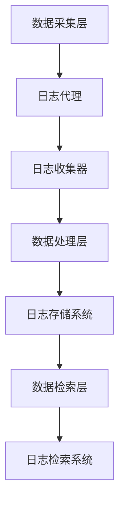
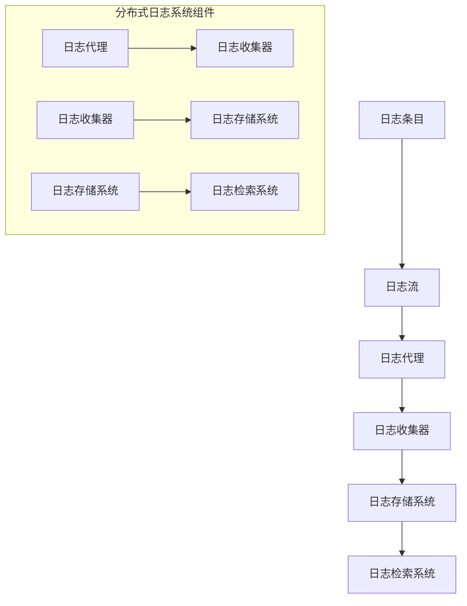

                 

### 第1章 引言

#### 1.1 书籍概述

在当今信息化时代，数据已经成为企业和社会运转的核心资产。日志系统作为监控系统的重要组成部分，其重要性愈发凸显。而随着分布式系统的普及，传统的日志管理方式已经无法满足大规模分布式环境的需求。因此，构建一个可扩展、高效的分布式日志系统显得尤为关键。

本书《分布式日志系统：构建可扩展的日志管理方案》旨在为读者提供全面、深入的了解和实际操作指南，帮助读者掌握分布式日志系统的核心概念、设计模式、实现方法和最佳实践。本书面向技术爱好者、开发者和架构师，特别是那些希望在分布式环境中优化日志管理的专业人士。

本书共分为十章，内容涵盖：

- **第1章 引言**：介绍书籍的背景和目的。
- **第2章 背景与核心概念**：阐述分布式日志系统的需求和基本概念。
- **第3章 分布式日志系统架构**：详细讲解系统架构和组件设计。
- **第4章 设计模式与最佳实践**：介绍常用设计模式和最佳实践。
- **第5章 分布式日志系统实现**：讲解系统实现和部署。
- **第6章 监控与管理系统**：讨论日志监控和管理的实现。
- **第7章 可扩展性与性能优化**：探讨系统扩展和性能优化策略。
- **第8章 安全性与合规性**：分析日志系统的安全性和合规性要求。
- **第9章 案例分析与实战**：通过实际案例展示系统应用。
- **第10章 总结与展望**：总结全书内容并对未来进行展望。

通过阅读本书，读者可以系统地学习分布式日志系统的构建方法，掌握从设计到实现的各个环节，为在分布式环境中构建高效、可靠的日志系统打下坚实基础。

#### 1.2 分布式日志系统的意义

分布式日志系统在当今的数字化时代具有不可替代的重要性。首先，日志系统是监控系统运行状态和故障排查的重要工具。通过收集和分析日志数据，开发者和运维人员可以实时掌握系统的运行状况，快速定位问题和异常情况，从而提高系统的稳定性和可靠性。

在分布式环境中，日志数据分散在各个节点上，传统的集中式日志管理方式已经无法满足需求。分布式日志系统通过分布式架构设计，能够高效地收集、存储、检索和监控分布在不同节点上的日志数据。这种架构不仅提高了系统的扩展性，还增强了日志数据的可用性和可靠性。

其次，分布式日志系统在大型分布式系统中，尤其是云计算和微服务架构中，扮演着至关重要的角色。随着企业业务规模的扩大和服务复杂性的增加，传统的单点日志系统无法处理海量日志数据，容易导致日志堆积、系统崩溃等问题。而分布式日志系统通过水平扩展，能够处理大规模的日志数据，满足企业不断增长的数据需求。

此外，分布式日志系统还提供了强大的日志聚合和分析功能，可以帮助企业从海量日志数据中提取有价值的信息，为业务决策提供支持。通过对日志数据的实时分析和可视化展示，企业可以更好地了解用户行为、系统性能和潜在问题，从而优化系统设计和运营策略。

总之，构建一个高效的分布式日志系统，不仅能够提高系统的可靠性和可维护性，还能够为企业的数字化转型提供强有力的支持。分布式日志系统在现代信息技术体系中的重要性不言而喻，是企业实现可持续发展和业务创新的重要基础设施。

#### 1.3 本书结构和读者对象

本书结构设计合理，内容丰富，旨在通过系统化的讲解帮助读者全面掌握分布式日志系统的构建方法。具体章节安排如下：

- **第1章 引言**：介绍书籍的背景和目的，以及本书的整体结构和内容。
- **第2章 背景与核心概念**：讲解分布式日志系统的需求背景和基本概念，包括日志条目的定义、日志流的处理以及分布式日志系统的主要组件。
- **第3章 分布式日志系统架构**：详细阐述分布式日志系统的架构设计，包括系统架构设计原则、组件架构及其相互关系，以及日志流处理流程。
- **第4章 设计模式与最佳实践**：介绍分布式日志系统的设计模式，如订阅-发布模式和流处理模式，并讨论最佳实践，包括日志格式标准化、日志压缩与存储优化、日志监控与告警等。
- **第5章 分布式日志系统实现**：讲解分布式日志系统的实现过程，包括环境搭建、核心代码实现和系统测试，帮助读者理解从设计到实现的完整流程。
- **第6章 监控与管理系统**：讨论日志监控和管理系统的设计，包括监控指标选择、告警系统实现以及日志管理系统的实现。
- **第7章 可扩展性与性能优化**：探讨分布式日志系统的可扩展性和性能优化策略，包括数据分片、负载均衡、系统瓶颈分析以及性能调优案例。
- **第8章 安全性与合规性**：分析分布式日志系统的安全性和合规性要求，包括日志加密、访问控制、数据保护法规和日志审计。
- **第9章 案例分析与实战**：通过实际案例展示分布式日志系统的应用，包括项目介绍、系统实现、实际案例分析和项目小结，帮助读者将理论知识应用于实践。
- **第10章 总结与展望**：总结全书内容，探讨分布式日志系统的发展趋势和未来研究方向，并提供拓展阅读建议。

本书适合以下读者群体：

- **技术爱好者**：希望了解分布式日志系统原理和实现的技术爱好者。
- **开发者**：从事分布式系统开发和维护的工程师，希望通过本书掌握分布式日志系统的设计方法和实现技巧。
- **架构师**：负责系统架构设计的高级工程师，需要优化和改进现有系统的日志管理机制。
- **运维人员**：负责系统运维和维护的人员，需要了解日志监控和管理的基本方法。

通过本书的学习，读者不仅可以掌握分布式日志系统的核心知识和技能，还能将所学应用于实际工作中，提高系统的稳定性和可维护性，助力企业的数字化转型和业务创新。

### 第2章 背景与核心概念

#### 2.1 分布式日志系统的需求背景

在现代信息技术环境中，分布式系统已成为企业架构的首选，这主要体现在云计算、大数据和微服务架构的广泛应用上。这些分布式系统需要处理大量的日志数据，以便监控系统性能、追踪错误和优化资源分配。然而，传统的集中式日志管理方式在面对大规模分布式环境时暴露出诸多问题：

1. **日志数据量巨大**：随着系统规模的扩大，日志数据量呈指数级增长。集中式日志系统往往难以处理海量日志，导致日志堆积和性能瓶颈。
2. **系统扩展性不足**：集中式日志系统通常依赖于单点架构，扩展性较差。当系统需要扩展时，集中式日志系统难以灵活应对，容易导致单点故障。
3. **日志数据分散**：在分布式系统中，日志数据分散存储在不同的节点上，集中式日志系统无法有效地收集和分析这些分散的数据。
4. **日志检索效率低下**：集中式日志系统在处理大量日志数据时，检索效率低下，无法满足实时监控和快速故障排查的需求。

为了解决上述问题，分布式日志系统应运而生。分布式日志系统通过分布式架构设计，能够高效地收集、存储、检索和监控分布在不同节点上的日志数据，从而满足大规模分布式环境的需求。

#### 2.2 分布式日志系统的基本概念

分布式日志系统涉及多个核心概念，下面将详细阐述这些概念：

##### 2.2.1 日志条目的定义

日志条目是分布式日志系统的基本数据单元，通常包含以下信息：

- **时间戳**：记录日志生成的具体时间，用于时间顺序追踪和分析。
- **日志级别**：表示日志事件的严重性，如INFO、ERROR、WARN等，帮助区分日志的重要程度。
- **日志内容**：包含具体的日志信息，如错误消息、操作记录、异常堆栈等。
- **源地址**：记录日志产生的主机或服务的地址，便于定位日志来源。
- **上下文信息**：包含日志产生时的上下文信息，如线程名称、用户ID、请求ID等，用于更详细地分析日志。

日志条目的格式和内容可以根据实际需求进行定制，但通常遵循标准化格式，如LOG4J、JSON等，以方便解析和处理。

##### 2.2.2 日志流的处理

日志流是日志条目在分布式日志系统中的传递和处理过程。日志流通常包括以下环节：

1. **日志收集**：分布式系统中的各个节点将日志条目发送到日志收集器，收集器将这些日志条目聚合并转发到日志存储系统。
2. **日志传输**：日志收集器通过可靠传输机制，如HTTP、Kafka等，将日志条目传输到日志存储系统。传输过程中，需要确保数据的一致性和完整性。
3. **日志存储**：日志存储系统接收并存储日志条目，通常采用分布式存储方案，以提高存储能力和数据可靠性。
4. **日志检索**：用户或系统通过日志检索系统查询特定日志条目，支持关键词搜索、时间范围过滤等功能。

日志流的处理过程需要考虑以下几个方面：

- **数据一致性**：确保日志条目在不同节点和存储系统之间的传输和存储过程中的一致性。
- **高可用性**：分布式日志系统应具备高可用性，确保在部分节点或系统故障时，日志数据不会丢失。
- **性能优化**：优化日志传输和检索过程，提高系统整体性能。

##### 2.2.3 分布式日志系统的主要组件

分布式日志系统由多个组件构成，这些组件协同工作，共同实现日志数据的收集、存储和检索等功能。以下是分布式日志系统的主要组件：

1. **日志代理**：日志代理是分布在各个节点上的进程，负责收集本节点的日志数据，并将其发送到日志收集器。日志代理通常采用轻量级、高并发的架构，以提高日志收集效率。
2. **日志收集器**：日志收集器负责接收各个节点的日志数据，进行聚合和预处理，然后转发到日志存储系统。日志收集器需要具备高吞吐量、高可靠性和高扩展性。
3. **日志存储**：日志存储系统负责存储和处理日志数据，通常采用分布式存储方案，如HDFS、Elasticsearch等，以提高存储能力和数据可靠性。
4. **日志检索系统**：日志检索系统提供日志数据的查询和检索功能，用户可以通过关键词、时间范围等条件进行日志查询，支持实时和批量查询。

通过以上组件的协同工作，分布式日志系统能够高效、可靠地处理大规模分布式环境中的日志数据，满足系统监控和故障排查的需求。

#### 2.3 分布式日志系统的边界与外延

分布式日志系统的应用范围广泛，不仅在传统的企业级应用中有重要作用，在新兴的云计算和微服务架构中更是不可或缺。以下是分布式日志系统的边界与外延：

##### 2.3.1 边界

1. **系统规模**：分布式日志系统适用于大规模分布式环境，包括企业内部的各种分布式系统、云计算平台和第三方服务。
2. **数据类型**：分布式日志系统主要处理结构化日志数据，如文本、JSON等，但不限于这些类型。
3. **地理位置**：分布式日志系统可以在不同地理位置的节点上运行，实现跨地域的日志数据收集和管理。

##### 2.3.2 外延

1. **日志数据扩展性**：分布式日志系统支持海量日志数据的存储和处理，可以水平扩展以应对不断增长的数据需求。
2. **日志分析功能**：分布式日志系统可以集成日志分析工具，对日志数据进行实时分析和可视化展示，为业务决策提供支持。
3. **跨平台支持**：分布式日志系统可以在多种操作系统和硬件平台上运行，包括Linux、Windows、云服务器等。

总之，分布式日志系统不仅在技术层面上解决了传统日志管理面临的问题，还在实际应用中展现了其广泛性和灵活性。通过合理的设计和部署，分布式日志系统可以在各种复杂和大规模的分布式环境中发挥重要作用。

#### 2.4 核心概念术语说明

在深入探讨分布式日志系统之前，了解一些核心概念和术语是至关重要的。以下是几个关键术语的定义：

##### 2.4.1 分布式系统

**定义**：分布式系统是由多个独立计算节点组成的系统，这些节点通过网络连接，共同完成计算任务。每个节点可以独立运行，但通过协同工作，可以实现更高的性能和容错能力。

**特点**：
- **独立性**：各个节点可以独立运行，互不影响。
- **并行性**：多个节点可以并行处理任务，提高系统性能。
- **容错性**：节点故障不会导致整个系统瘫痪，系统可以自动恢复。

**应用场景**：分布式系统广泛应用于大规模数据处理、云计算、分布式存储等领域。

##### 2.4.2 日志系统

**定义**：日志系统是用于记录系统运行过程中发生的事件的机制。日志数据包含时间、事件类型、事件内容等信息，用于系统监控、故障排查和性能分析。

**组成部分**：
- **日志条目**：日志系统中的基本数据单元，包含时间、事件类型、事件内容等。
- **日志收集器**：负责收集各个节点的日志数据，并将其存储到日志存储系统。
- **日志存储系统**：负责存储和处理日志数据，支持日志检索和分析。
- **日志检索系统**：提供日志数据的查询和检索功能，支持实时和批量查询。

**作用**：日志系统帮助开发者和运维人员了解系统运行状态，快速定位问题和异常，提高系统的可靠性和可维护性。

##### 2.4.3 分布式日志系统

**定义**：分布式日志系统是在分布式环境中运行的日志系统，能够高效地收集、存储、检索和监控分布在不同节点上的日志数据。

**特点**：
- **高扩展性**：支持大规模分布式环境，通过水平扩展满足数据增长需求。
- **高可用性**：分布式设计，单点故障不会影响整体系统运行。
- **高可靠性**：日志数据通过分布式存储，保障数据的安全和完整。
- **高性能**：日志数据通过高效传输和存储机制，支持快速检索和分析。

**应用场景**：分布式日志系统广泛应用于大型分布式系统、云计算平台、微服务架构等。

通过理解这些核心概念和术语，读者可以更好地把握分布式日志系统的设计原则和应用方法，为后续章节的学习奠定基础。

#### 2.5 概念结构与核心要素组成

分布式日志系统是一个复杂而关键的组成部分，其概念结构和核心要素直接决定了系统的性能、可扩展性和可靠性。以下是分布式日志系统的概念结构与核心要素组成：

##### 2.5.1 架构层次

分布式日志系统通常采用分层架构设计，各层次之间的功能如下：

1. **数据采集层**：负责从各个节点收集日志条目，通过日志代理将日志发送到日志收集器。
2. **数据处理层**：日志收集器对接收到的日志条目进行聚合、过滤和格式化，将其转发到日志存储系统。
3. **数据存储层**：负责存储处理后的日志条目，通常采用分布式存储方案，以提高存储能力和数据可靠性。
4. **数据检索层**：提供日志数据的查询和检索功能，支持实时和批量查询，通常与日志存储层集成。

##### 2.5.2 核心组件

分布式日志系统由以下核心组件组成：

1. **日志代理**：运行在各个节点上，负责收集本节点的日志数据，并将其发送到日志收集器。日志代理通常采用轻量级、高并发的架构，以提高日志收集效率。
2. **日志收集器**：接收并处理各个节点的日志数据，进行聚合和预处理，然后转发到日志存储系统。日志收集器需要具备高吞吐量、高可靠性和高扩展性。
3. **日志存储系统**：存储处理后的日志条目，通常采用分布式存储方案，如HDFS、Elasticsearch等，以提高存储能力和数据可靠性。
4. **日志检索系统**：提供日志数据的查询和检索功能，支持实时和批量查询。日志检索系统通常与日志存储系统集成，以简化管理和提高查询效率。

##### 2.5.3 数据流

分布式日志系统中的数据流通常包括以下步骤：

1. **日志收集**：各个节点上的日志代理收集日志条目，并将其发送到日志收集器。
2. **日志传输**：日志收集器通过可靠传输机制，如HTTP、Kafka等，将日志条目传输到日志存储系统。
3. **日志存储**：日志存储系统接收并存储日志条目，采用分布式存储方案，以提高存储能力和数据可靠性。
4. **日志检索**：用户或系统通过日志检索系统查询特定日志条目，支持关键词搜索、时间范围过滤等功能。

##### 2.5.4 概念关系图

为了更好地理解分布式日志系统的概念结构与核心要素组成，可以使用Mermaid绘制一个概念关系图：



此图展示了分布式日志系统的各个层次和核心组件及其相互关系，有助于读者全面理解系统的架构和运作机制。

通过以上内容，读者可以深入了解分布式日志系统的概念结构与核心要素，为后续章节的学习打下坚实基础。在接下来的章节中，我们将详细探讨分布式日志系统的架构设计、设计模式、实现方法和最佳实践，帮助读者逐步掌握分布式日志系统的构建方法。

#### 2.6 分布式日志系统的核心概念原理

分布式日志系统的核心概念包括日志条目、日志流、日志代理、日志收集器、日志存储系统和日志检索系统。这些概念相互关联，共同构成了分布式日志系统的理论基础。下面，我们将通过表格和Mermaid流程图来详细说明这些核心概念及其关系。

##### 2.6.1 核心概念表格

| 概念                 | 定义                                                         | 关系                                  |
|----------------------|--------------------------------------------------------------|---------------------------------------|
| **日志条目**         | 分布式日志系统中的基本数据单元，包含时间、日志级别、日志内容等。 | 数据的基础结构，是日志流的基本单位。  |
| **日志流**           | 日志条目在分布式日志系统中的传递和处理过程。                   | 日志条目的流动过程，连接各个系统组件。 |
| **日志代理**         | 运行在各个节点上，负责收集日志条目，并将其发送到日志收集器。   | 数据采集的关键组件，是日志流的起点。   |
| **日志收集器**       | 负责接收日志代理发送的日志条目，进行聚合和预处理，然后转发。   | 数据传输和初步处理的核心组件。         |
| **日志存储系统**     | 负责存储处理后的日志条目，通常采用分布式存储方案。             | 数据持久化的重要部分，保证数据的可靠性。 |
| **日志检索系统**     | 提供日志数据的查询和检索功能，支持实时和批量查询。             | 数据查询和分析的接口，为系统监控和故障排查提供支持。 |

##### 2.6.2 Mermaid流程图

下面是一个简单的Mermaid流程图，展示了分布式日志系统的核心概念及其关系：



这个流程图展示了日志条目在分布式日志系统中的流动过程，包括数据采集、传输、存储和检索等关键步骤，以及各个组件之间的相互关系。

通过核心概念表格和流程图的结合，读者可以更加直观地理解分布式日志系统的基本原理和架构。这些概念和关系构成了分布式日志系统的理论基础，是后续章节深入探讨分布式日志系统设计、实现和优化的基础。在接下来的章节中，我们将进一步探讨分布式日志系统的设计模式和最佳实践，帮助读者在实际应用中构建高效可靠的分布式日志系统。

#### 2.7 分布式日志系统的主要组件

分布式日志系统的设计关键在于其组件的合理分工和高效协作。系统通常由多个相互独立的组件组成，这些组件各自承担特定任务，协同工作以实现日志数据的收集、存储、检索和分析。以下是分布式日志系统的几个主要组件及其功能：

##### 2.7.1 日志代理

**定义**：日志代理是运行在各个节点上的小进程或服务，负责实时收集本节点的日志条目。

**功能**：
- **日志采集**：从各个节点上的应用程序或系统服务中收集日志数据。
- **格式转换**：将不同格式的日志数据转换为统一的日志格式，如JSON。
- **错误处理**：在日志收集过程中，对遇到的错误进行捕获和处理，确保日志数据的完整性和准确性。

**关键技术**：
- **多线程处理**：日志代理采用多线程或异步处理机制，提高日志收集的并发能力和效率。
- **可靠传输**：日志代理使用可靠的数据传输协议，如HTTP、Kafka等，确保日志数据在网络传输过程中不丢失。

##### 2.7.2 日志收集器

**定义**：日志收集器是集中管理日志数据的组件，负责接收和聚合来自多个日志代理的日志数据。

**功能**：
- **日志接收**：接收来自日志代理的日志数据，并进行初步处理。
- **数据聚合**：将来自不同日志代理的日志数据进行聚合，便于后续处理和存储。
- **错误监控**：监控日志收集过程中的错误和异常，及时通知运维人员。

**关键技术**：
- **高吞吐量**：日志收集器需要具备高吞吐量处理能力，以应对大规模日志数据的接收和聚合。
- **负载均衡**：日志收集器可以采用负载均衡策略，分散日志数据到多个收集节点，提高系统的处理能力和容错性。

##### 2.7.3 日志存储系统

**定义**：日志存储系统是用于存储和管理日志数据的分布式系统，支持海量数据的持久化存储。

**功能**：
- **数据存储**：将收集到的日志数据存储到分布式存储系统中，如HDFS、Elasticsearch等。
- **数据压缩**：对存储的日志数据进行压缩，以减少存储空间和提高读取效率。
- **数据备份**：实现日志数据的备份和恢复功能，确保数据的安全性和可靠性。

**关键技术**：
- **分布式存储**：日志存储系统采用分布式存储方案，以提高存储能力和数据可靠性。
- **高可用性**：日志存储系统具备高可用性设计，确保在节点故障时能够快速切换和恢复。

##### 2.7.4 日志检索系统

**定义**：日志检索系统提供日志数据的查询和检索功能，支持实时和批量查询。

**功能**：
- **日志查询**：用户可以通过关键词、时间范围等条件查询特定的日志条目。
- **实时监控**：提供实时日志数据监控功能，及时发现和处理系统异常。
- **数据可视化**：将日志数据以图表、报表等形式进行可视化展示，便于分析。

**关键技术**：
- **高效检索**：日志检索系统需要具备高效的查询引擎，以快速响应查询请求。
- **数据索引**：通过建立日志数据的索引，提高日志查询的效率和准确性。

通过以上主要组件的分工合作，分布式日志系统能够高效地收集、存储、检索和分析日志数据，为系统监控、故障排查和业务优化提供强有力的支持。在接下来的章节中，我们将进一步探讨这些组件的具体实现方法和最佳实践，帮助读者构建一个高效、可靠的分布式日志系统。

#### 2.8 分布式日志系统设计模式

在分布式日志系统的设计中，选择合适的设计模式能够显著提高系统的可靠性、可扩展性和可维护性。以下将介绍两种常用的设计模式：订阅-发布模式和流处理模式，并讨论其在分布式日志系统中的应用。

##### 2.8.1 订阅-发布模式

**定义**：订阅-发布模式是一种消息驱动模式，通过消息队列将生产者（日志生成者）和消费者（日志处理者）解耦，实现高效的日志传输和处理。

**工作原理**：
- **生产者**：日志生成者在产生日志时，将日志条目发送到消息队列。
- **消息队列**：存储接收到的日志条目，并提供可靠的消息传输和异步处理机制。
- **消费者**：日志处理者从消息队列中获取日志条目，进行进一步的处理和存储。

**优点**：
- **解耦**：生产者和消费者通过消息队列解耦，提高了系统的灵活性和可维护性。
- **异步处理**：日志生成和日志处理可以异步进行，提高了系统的并发处理能力。
- **高可用性**：消息队列提供了故障转移和自动恢复机制，确保日志数据不丢失。

**在分布式日志系统中的应用**：
- **日志收集**：日志代理将日志发送到消息队列，由日志收集器从消息队列中获取日志数据进行处理和存储。
- **日志聚合**：多个日志收集器可以从消息队列中获取分布式环境中的日志数据，实现日志数据的聚合和集中处理。

##### 2.8.2 流处理模式

**定义**：流处理模式是一种基于数据流处理的模式，通过实时处理日志数据流，实现日志的实时分析和监控。

**工作原理**：
- **数据流**：日志条目在分布式系统中生成后，以数据流的形式传输和处理。
- **处理节点**：处理节点对数据流进行实时处理，包括日志数据的过滤、转换、聚合等。
- **输出**：处理后的日志数据可以存储到日志存储系统或实时输出到监控和报警系统。

**优点**：
- **实时性**：流处理模式能够实时处理日志数据流，及时响应系统异常和故障。
- **灵活性**：流处理节点可以根据需求灵活扩展和调整，实现定制化的日志处理逻辑。
- **可扩展性**：流处理模式支持水平扩展，能够处理大规模日志数据流。

**在分布式日志系统中的应用**：
- **日志分析**：流处理模式可以对实时生成的日志数据进行实时分析，如异常检测、性能监控等。
- **日志告警**：通过流处理模式，可以及时发现和处理系统中的异常日志，实现实时告警和自动恢复。

##### 2.8.3 最佳实践

- **消息队列选择**：根据实际需求选择合适的消息队列系统，如Kafka、RabbitMQ等，确保系统的高性能和高可用性。
- **数据流处理引擎**：选择高效的数据流处理引擎，如Apache Flink、Apache Storm等，实现实时日志数据的处理和分析。
- **日志格式标准化**：确保日志条目的格式统一，便于后续的数据处理和分析。
- **监控和告警**：对分布式日志系统进行实时监控和告警，确保系统稳定运行，及时发现和处理问题。

通过订阅-发布模式和流处理模式，分布式日志系统可以实现高效、可靠的日志数据收集、传输和处理，为系统监控和故障排查提供强有力的支持。在实际应用中，根据具体需求和场景选择合适的设计模式，并结合最佳实践，可以构建一个高效、可靠的分布式日志系统。

#### 2.9 设计模式的最佳实践

在设计分布式日志系统时，采用最佳实践可以显著提升系统的可靠性、性能和可维护性。以下将详细讨论一些常见的最佳实践，包括日志格式标准化、日志压缩与存储优化、日志监控与告警等。

##### 2.9.1 日志格式标准化

**重要性**：日志格式标准化是分布式日志系统设计的基础。统一的日志格式有助于简化日志数据的处理、存储和检索，提高系统的整体效率。

**最佳实践**：
- **使用通用格式**：推荐使用通用的日志格式，如LOG4J和JSON。这些格式具有良好的可读性和解析性，便于后续数据处理和分析。
- **字段定义规范**：定义统一且标准的日志字段，如时间戳、日志级别、日志内容、源地址、用户ID等。确保所有日志条目遵循相同的字段命名和结构。

**示例**：

```json
{
  "timestamp": "2023-11-05T13:21:00.123Z",
  "level": "INFO",
  "source": "application-server",
  "message": "User 'john_doe' logged in successfully.",
  "user_id": "john_doe"
}
```

##### 2.9.2 日志压缩与存储优化

**重要性**：日志数据通常包含大量重复的信息，通过压缩可以有效减少存储空间，提高数据传输效率。

**最佳实践**：
- **选择合适的压缩算法**：根据日志数据的特性选择合适的压缩算法，如GZIP、BZIP2等。对于文本日志数据，GZIP通常是较好的选择。
- **分层次存储**：将日志数据按重要性或时间分区存储，如将错误日志和普通日志分开存储。这样可以在故障排查时快速定位关键日志。
- **存储备份**：定期对日志数据进行备份，确保在数据丢失或损坏时能够快速恢复。

**示例**：

```bash
# 使用GZIP压缩日志文件
gzip -9 access.log

# 分层次存储日志
mv access.log.gz /var/log/important/
ln -s /var/log/important/access.log.gz /var/log/current/
```

##### 2.9.3 日志监控与告警

**重要性**：日志监控和告警是保障系统稳定运行的关键环节。通过实时监控和及时告警，可以快速发现和处理系统异常，降低故障影响。

**最佳实践**：
- **选择合适的监控指标**：根据系统特点选择合适的监控指标，如响应时间、吞吐量、错误率等。确保监控指标能够全面反映系统状态。
- **配置告警规则**：定义明确的告警规则，如当系统响应时间超过阈值时触发告警。确保告警规则能够及时发现和处理潜在问题。
- **集成告警系统**：将日志监控和告警系统与现有的运维工具集成，如PagerDuty、OpsGenie等，实现自动化的告警和响应。

**示例**：

```bash
# 配置Nagios监控响应时间
nagios -v

# 配置告警规则
add_host -name "application-server" -groups "servers" -addresses "192.168.1.100" -templates "linux-server"
add_service -name "http_response_time" -hostgroup_name "servers" -templates "service_http"
add_alert -hostgroup_name "servers" -service_description "http_response_time" -command "check_http" -notification_command "send_notification"
```

通过上述最佳实践，可以有效提升分布式日志系统的性能和可靠性，确保日志数据的有效管理和利用。在实际部署过程中，结合具体场景和需求，灵活应用这些实践，可以构建一个高效、可靠的分布式日志系统。

#### 2.10 分布式日志系统实现

实现分布式日志系统是一个复杂而关键的过程，它涉及到环境搭建、核心代码实现和系统测试等多个环节。以下是实现分布式日志系统的详细步骤和关键要点：

##### 2.10.1 环境搭建

在开始分布式日志系统的开发之前，首先需要搭建合适的环境，包括软件和硬件配置。以下是具体的步骤和要求：

1. **硬件要求**：
   - **计算资源**：至少需要两台服务器或虚拟机，用于部署日志代理、日志收集器和日志存储系统。
   - **存储资源**：足够的存储空间，用于存储日志数据。根据需求，可以选择本地磁盘或分布式文件系统，如HDFS。
   - **网络带宽**：保证服务器之间的网络连接稳定，以支持高效的数据传输。

2. **软件要求**：
   - **操作系统**：推荐使用Linux系统，如CentOS、Ubuntu等。
   - **编程语言**：根据需求选择合适的编程语言，如Java、Python、Go等。
   - **日志收集器**：推荐使用现有的日志收集器工具，如Logstash、Fluentd等。
   - **日志存储系统**：推荐使用Elasticsearch、Kafka等分布式存储系统。

3. **环境安装步骤**：
   - **服务器准备**：配置服务器网络，设置防火墙规则，确保服务器之间的通信。
   - **操作系统安装**：在服务器上安装Linux操作系统，配置网络。
   - **软件安装**：在每台服务器上安装所需的软件和工具，如Logstash、Elasticsearch、Kafka等。
   - **配置文件**：根据实际需求配置日志收集器、存储系统和检索工具的配置文件，确保各组件之间能够正常通信。

##### 2.10.2 核心代码实现

核心代码实现是分布式日志系统的关键部分，包括日志代理、日志收集器和日志存储系统的实现。以下是具体的实现步骤：

1. **日志代理实现**：
   - **日志采集**：使用日志采集框架（如Log4j、Python的logging模块）实现日志数据的采集。
   - **日志格式转换**：将采集到的日志数据转换为统一的格式，如JSON。
   - **日志发送**：使用HTTP、Kafka等协议实现日志数据的发送，确保数据传输的可靠性和完整性。

```python
# Python示例：使用logging模块采集日志，转换为JSON格式并发送
import logging
import json
import requests

logger = logging.getLogger('my_logger')
logger.setLevel(logging.DEBUG)

# 格式化日志输出
formatter = logging.Formatter('%(asctime)s - %(name)s - %(levelname)s - %(message)s')
handler = logging.StreamHandler()
handler.setFormatter(formatter)
logger.addHandler(handler)

# 发送日志到日志收集器
def send_log(log_entry):
    url = 'http://log-collector:8080/logs'
    headers = {'Content-Type': 'application/json'}
    response = requests.post(url, headers=headers, json=log_entry)
    response.raise_for_status()

# 采集日志并转换为JSON
def collect_logs():
    log_entries = []
    while True:
        log_entry = logger.handlers[0].formatter.formatMessage()
        log_entries.append(json.loads(log_entry))
        send_log(log_entries[-1])
```

2. **日志收集器实现**：
   - **日志接收**：接收来自日志代理的日志数据，进行预处理。
   - **日志聚合**：将来自多个日志代理的日志数据进行聚合，确保数据的一致性。
   - **日志转发**：将处理后的日志数据转发到日志存储系统。

```java
// Java示例：使用Spring Boot接收日志并转发到Kafka
import org.springframework.boot.SpringApplication;
import org.springframework.boot.autoconfigure.SpringBootApplication;
import org.springframework.kafka.annotation.KafkaListener;
import org.springframework.messaging.handler.annotation.SendTo;

@SpringBootApplication
public class LogCollectorApplication {

    public static void main(String[] args) {
        SpringApplication.run(LogCollectorApplication.class, args);
    }

    @KafkaListener(topics = "logs_topic", groupId = "log-collector-group")
    @SendTo("aggregated_logs_topic")
    public String receiveAndAggregate(String log_entry) {
        // 对日志数据进行预处理和聚合
        String aggregated_log = preprocessLog(log_entry);
        return aggregated_log;
    }

    private String preprocessLog(String log_entry) {
        // 实现日志预处理逻辑，如格式转换、过滤等
        return log_entry;
    }
}
```

3. **日志存储系统实现**：
   - **日志存储**：将收集到的日志数据存储到分布式存储系统，如Elasticsearch。
   - **日志检索**：提供日志数据的查询和检索功能，支持实时和批量查询。

```python
# Python示例：使用Elasticsearch存储日志
from elasticsearch import Elasticsearch

es = Elasticsearch("http://elasticsearch:9200")

def store_log(log_entry):
    index_name = "logs"
    doc = {
        "timestamp": log_entry['timestamp'],
        "level": log_entry['level'],
        "source": log_entry['source'],
        "message": log_entry['message'],
        "user_id": log_entry['user_id']
    }
    es.index(index=index_name, id=log_entry['id'], document=doc)

# 检索日志
def search_logs(query, start_time, end_time):
    index_name = "logs"
    search_body = {
        "query": {
            "bool": {
                "must": [
                    {"match": {"level": query}},
                    {"range": {"timestamp": {"gte": start_time, "lte": end_time}}}
                ]
            }
        }
    }
    response = es.search(index=index_name, body=search_body)
    return response['hits']['hits']
```

##### 2.10.3 系统测试

系统测试是确保分布式日志系统稳定运行的重要环节。以下是系统测试的关键步骤：

1. **功能测试**：测试系统的各项功能，如日志采集、接收、存储和检索等，确保功能正常。
2. **性能测试**：通过模拟大量日志数据，测试系统在高负载条件下的性能，如数据传输速率、存储效率和查询响应时间。
3. **稳定性测试**：通过长时间运行和压力测试，验证系统的稳定性和容错性，确保系统在长时间运行和故障情况下能够持续提供服务。
4. **安全测试**：测试系统的安全性，如日志加密、访问控制和数据保护等，确保日志数据的安全性。

通过以上步骤，可以构建一个高效、可靠的分布式日志系统，满足大规模分布式环境的需求。在实际部署过程中，根据具体场景和需求进行调整和优化，确保系统的高性能和可靠性。

#### 2.11 监控与管理系统

分布式日志系统的监控与管理系统是确保系统稳定性和可靠性的关键环节。通过实时监控和告警，开发者和运维人员可以及时发现和处理系统中的异常，从而保障日志数据的完整性和可用性。以下是分布式日志系统监控与管理系统的设计原则、实现方法和应用实践。

##### 2.11.1 设计原则

分布式日志系统的监控与管理系统设计需要遵循以下原则：

1. **实时性**：监控系统能够实时采集和分析日志数据，确保异常能够在第一时间被发现和处理。
2. **高可用性**：监控系统需要具备高可用性设计，确保在部分节点或系统故障时，监控功能仍然可用。
3. **可扩展性**：监控系统能够随着分布式日志系统规模的扩大而灵活扩展，以应对不断增长的数据量和监控需求。
4. **自动化**：监控和告警过程自动化，减少人工干预，提高系统的响应速度和处理效率。
5. **可视化**：通过图形化界面展示系统运行状态和监控指标，便于快速定位问题和分析日志数据。

##### 2.11.2 监控指标选择

监控指标的选择是分布式日志系统监控系统的核心，以下是一些关键的监控指标：

1. **日志收集速率**：记录日志代理发送日志的速度，过高或过低都可能表明系统异常。
2. **日志处理延迟**：记录日志从产生到被处理的时间，过长的延迟可能表明系统处理能力不足。
3. **日志传输延迟**：记录日志从日志收集器到日志存储系统的传输时间，过长的延迟可能表明网络问题或系统瓶颈。
4. **日志存储容量**：记录日志存储系统的存储容量使用情况，过高可能表明存储资源不足，过低可能表明日志数据没有被充分利用。
5. **日志检索速率**：记录日志检索的响应速度，过慢可能表明检索系统性能不足。
6. **系统错误率**：记录系统处理过程中的错误数量，高错误率可能表明系统配置或逻辑错误。

##### 2.11.3 告警系统实现

告警系统是监控管理系统的重要组成部分，用于在发现异常时通知相关人员。以下是告警系统的实现方法：

1. **阈值设置**：根据监控指标的正常范围设置告警阈值，如日志收集速率低于某个阈值时触发告警。
2. **告警触发**：当监控指标超出阈值时，系统自动触发告警，发送告警通知。
3. **告警通知**：通过邮件、短信、微信、 PagerDuty等工具发送告警通知，确保相关人员能够及时了解系统状况。
4. **告警聚合**：多个监控指标可能同时触发告警，告警系统需要支持告警聚合，避免重复告警和误报。

```python
# Python示例：简单告警系统实现
import time
import smtplib
from email.mime.text import MIMEText

def send_alert(message):
    # 配置邮件服务器和账号信息
    smtp_server = 'smtp.example.com'
    username = 'user@example.com'
    password = 'password'

    # 构建邮件内容
    subject = '系统告警'
    content = MIMEText(f'告警内容：{message}')
    msg = MIMEText(f'主题：{subject}\n\n{content}')

    # 发送邮件
    server = smtplib.SMTP(smtp_server)
    server.login(username, password)
    server.sendmail('user@example.com', 'admin@example.com', msg.as_string())
    server.quit()

while True:
    # 检查监控指标
    if check_metric("log_collection_rate") < threshold:
        send_alert("日志收集速率低于阈值")
    time.sleep(60)  # 每分钟检查一次
```

##### 2.11.4 日志管理系统实现

日志管理系统负责日志的存储、检索和分析，以下是日志管理系统的实现方法：

1. **日志存储**：将日志数据存储到分布式存储系统，如Elasticsearch或HDFS。确保日志数据的持久性和可靠性。
2. **日志检索**：提供高效的日志检索功能，支持关键词搜索、时间范围过滤等。
3. **日志分析**：通过日志数据分析工具，如Kibana或Logstash，对日志数据进行实时分析和可视化展示。

```python
# Python示例：使用Elasticsearch进行日志检索
from elasticsearch import Elasticsearch

es = Elasticsearch("http://elasticsearch:9200")

def search_logs(query, start_time, end_time):
    index_name = "logs"
    search_body = {
        "query": {
            "bool": {
                "must": [
                    {"match": {"message": query}},
                    {"range": {"timestamp": {"gte": start_time, "lte": end_time}}}
                ]
            }
        }
    }
    response = es.search(index=index_name, body=search_body)
    return response['hits']['hits']

# 检索示例
results = search_logs("error", "2023-11-01T00:00:00", "2023-11-30T23:59:59")
for result in results:
    print(result['_source'])
```

通过以上监控与管理系统设计原则、监控指标选择、告警系统实现和日志管理系统实现，可以构建一个高效、可靠的分布式日志监控系统，确保日志系统的稳定运行和数据的有效管理。在实际应用中，根据具体需求和场景进行优化和调整，可以进一步提高系统的性能和可靠性。

#### 2.12 可扩展性与性能优化

在分布式日志系统中，可扩展性和性能优化是确保系统在大规模分布式环境下的高效运行和稳定性的关键因素。以下将详细探讨分布式日志系统的可扩展性策略和性能优化技巧。

##### 2.12.1 数据分片

**定义**：数据分片是将大量日志数据划分到多个独立的部分，以便在多个节点上并行处理。

**实施方法**：
1. **水平分片**：将日志数据按照某个关键字段（如时间、日志类型等）进行划分，每个分片包含一部分日志数据。这样可以使得数据均匀分布到不同的节点上，提高系统的并行处理能力。
2. **垂直分片**：将日志数据按照不同的字段或内容进行划分，如将日志内容分为错误日志、性能日志等。这样可以使得不同类型的日志数据在不同的节点上独立处理，提高系统资源的利用效率。

**优势**：
- **负载均衡**：数据分片能够均匀分布到不同的节点上，避免单点性能瓶颈。
- **高可用性**：数据分片使得每个分片可以独立处理，单点故障不会影响整个系统。

**示例**：

```python
# Python示例：简单数据分片
def shard_logs(log_entries, shard_count):
    shards = [[] for _ in range(shard_count)]
    for log_entry in log_entries:
        shard_index = hash(log_entry['timestamp']) % shard_count
        shards[shard_index].append(log_entry)
    return shards
```

##### 2.12.2 负载均衡

**定义**：负载均衡是将日志数据均匀地分配到多个节点，以避免单点性能瓶颈。

**实施方法**：
1. **客户端负载均衡**：在日志代理和日志收集器之间使用负载均衡器，如Nginx、HAProxy等，将日志数据均匀地分发到不同的日志收集器节点。
2. **服务端负载均衡**：在日志收集器和日志存储系统之间使用负载均衡器，确保日志数据在存储系统中的均匀分布。

**优势**：
- **高性能**：负载均衡能够提高系统的整体吞吐量，减少单点性能瓶颈。
- **高可用性**：负载均衡器能够实现故障转移，确保系统的连续性和可靠性。

**示例**：

```bash
# 使用Nginx作为负载均衡器
http {
    upstream log_collectors {
        server log_collector1:8080;
        server log_collector2:8080;
        server log_collector3:8080;
    }

    server {
        listen 80;

        location /logs {
            proxy_pass http://log_collectors;
        }
    }
}
```

##### 2.12.3 系统瓶颈分析

**定义**：系统瓶颈分析是识别系统性能瓶颈的过程，通过分析系统的资源使用情况和性能指标，找出影响系统性能的关键因素。

**实施方法**：
1. **性能监控**：使用性能监控工具（如Prometheus、Grafana等）实时监控系统的性能指标，如CPU使用率、内存使用率、网络流量等。
2. **日志分析**：通过分析日志数据，找出系统中出现错误的日志条目，定位性能瓶颈。
3. **性能测试**：使用压力测试工具（如Apache JMeter、Gatling等）模拟高负载场景，分析系统的性能表现，识别瓶颈。

**优势**：
- **优化性能**：通过系统瓶颈分析，可以找到影响系统性能的关键因素，针对性地进行优化。
- **提高效率**：性能优化可以减少系统的响应时间和延迟，提高系统整体运行效率。

**示例**：

```python
# Python示例：使用Prometheus和Grafana进行性能监控
from prometheus_client import start_http_server, Summary

# 定义性能指标
request_time = Summary('request_time_seconds', 'Request time in seconds')

@request_time.time()
def handle_request(request):
    # 处理请求逻辑
    time.sleep(0.5)

# 启动HTTP服务
start_http_server(8000)

# 使用Grafana可视化性能指标
# 配置Grafana，添加Prometheus数据源，创建监控仪表板
```

##### 2.12.4 性能优化技巧

**定义**：性能优化技巧是提升系统性能的一系列方法和技术。

**实施方法**：
1. **缓存**：使用缓存技术（如Redis、Memcached等）存储频繁访问的数据，减少数据库访问压力。
2. **数据库优化**：优化数据库查询性能，如使用索引、避免全表扫描等。
3. **代码优化**：对系统代码进行优化，如减少不必要的计算、避免重复操作等。
4. **网络优化**：优化网络配置，如调整TCP参数、使用压缩算法等。

**优势**：
- **提高性能**：性能优化可以显著提升系统的响应速度和吞吐量。
- **降低成本**：通过优化系统资源使用，降低硬件和运维成本。

**示例**：

```python
# Python示例：使用Redis缓存
import redis

# 连接Redis数据库
redis_client = redis.StrictRedis(host='redis-server', port=6379, db=0)

# 存储数据
redis_client.set('user:1001', 'john_doe')

# 获取数据
user = redis_client.get('user:1001')
print(user.decode())
```

通过以上可扩展性和性能优化策略和技巧，可以显著提升分布式日志系统的性能和稳定性，满足大规模分布式环境的需求。在实际应用中，根据具体场景和需求进行优化和调整，可以进一步提高系统的效率和质量。

#### 2.13 安全性与合规性

在分布式日志系统中，安全性和合规性是确保日志数据安全、可靠和符合法律法规的重要保障。以下将详细探讨分布式日志系统的安全性和合规性要求，包括日志加密、访问控制和数据保护法规等。

##### 2.13.1 日志加密

**定义**：日志加密是通过对日志数据进行加密处理，确保其在传输和存储过程中不被未授权访问。

**实施方法**：
1. **数据传输加密**：使用SSL/TLS协议对日志数据在传输过程中进行加密，防止数据在网络中被截获和篡改。
2. **存储加密**：对存储在日志存储系统中的日志数据进行加密，如使用AES加密算法，确保数据在磁盘上的安全性。
3. **密钥管理**：妥善管理加密密钥，确保密钥的安全存储和分发，如使用KMS（Key Management Service）进行密钥管理。

**优势**：
- **数据保护**：加密技术能够显著提高日志数据的安全性，防止数据泄露和篡改。
- **合规性**：加密是许多数据保护法规的基本要求，确保日志数据在合规性方面满足相关要求。

**示例**：

```python
# Python示例：使用SSL加密HTTP请求
import requests
from requests.packages.urllib3.util.ssl_ import create_urllib3_context

# 创建SSL上下文对象
ssl_context = create_urllib3_context()

# 发送加密的HTTP请求
response = requests.get('https://example.com/logs', verify=ssl_context)
print(response.text)
```

##### 2.13.2 访问控制

**定义**：访问控制是通过设置访问权限，确保只有授权用户能够访问和操作日志数据。

**实施方法**：
1. **用户认证**：使用身份验证机制（如LDAP、OAuth2等），确保用户身份的真实性。
2. **权限管理**：根据用户角色和权限设置，限制用户对日志数据的访问范围，如只读、读写等。
3. **审计日志**：记录用户访问日志，以便在发生安全事件时进行追踪和审计。

**优势**：
- **权限保护**：访问控制能够有效防止未授权用户访问敏感日志数据。
- **责任追踪**：审计日志能够帮助追踪用户操作，确保安全事件的可追溯性。

**示例**：

```python
# Python示例：使用RBAC（基于角色的访问控制）
from flask import Flask, request, jsonify
from flask_httpauth import HTTPBasicAuth

app = Flask(__name__)
auth = HTTPBasicAuth()

users = {
    'admin': 'admin_password',
    'user': 'user_password'
}

roles = {
    'admin': ['read', 'write'],
    'user': ['read']
}

@auth.get_password
def get_password(username):
    if username in users:
        return users.get(username)
    return None

@app.route('/logs', methods=['GET', 'POST'])
@auth.login_required
def logs():
    role = request.headers.get('Authorization')
    if role in roles and 'write' in roles[role]:
        return jsonify({'status': 'success', 'data': 'logs data'})
    else:
        return jsonify({'status': 'error', 'message': 'Insufficient permissions'})

if __name__ == '__main__':
    app.run()
```

##### 2.13.3 数据保护法规

**定义**：数据保护法规是国家和国际层面上对数据处理和存储的基本要求，旨在保护个人隐私和数据安全。

**实施方法**：
1. **数据本地化**：根据数据保护法规要求，确保日志数据在本地存储和处理。
2. **数据隐私**：对包含个人信息的日志数据进行特别处理，如脱敏和加密。
3. **合规审计**：定期进行合规性审计，确保日志系统的设计和运行符合相关法规要求。

**优势**：
- **法律合规**：确保日志系统符合国家和国际数据保护法规，避免法律风险。
- **用户信任**：通过合规性措施，增强用户对系统的信任，促进业务发展。

**示例**：

```python
# Python示例：使用GDPR（通用数据保护条例）合规性检查
def check_compliance(data):
    # 检查数据中是否包含敏感信息
    if 'personal_info' in data:
        # 对敏感信息进行脱敏处理
        data['personal_info'] = 'xxxxxx'
    return data

# 示例数据
data = {
    'personal_info': 'john_doe@example.com'
}

# 检查合规性
compliant_data = check_compliance(data)
print(compliant_data)
```

通过以上日志加密、访问控制和数据保护法规的实施，分布式日志系统可以在保障数据安全性和合规性的同时，满足各类法规要求，为企业的信息安全保驾护航。

#### 2.14 案例分析与实战

为了更好地理解分布式日志系统的实际应用，下面将通过一个案例详细介绍系统环境的搭建、核心实现过程和实际案例分析。通过这些步骤，读者可以系统地掌握分布式日志系统的部署与维护。

##### 2.14.1 案例介绍

本案例将以一个大型电子商务平台为例，介绍如何构建一个分布式日志系统。该平台包含多个微服务，如用户服务、订单服务、支付服务和库存服务，日志数据分散在各个微服务节点上。我们的目标是构建一个高效、可靠的分布式日志系统，以便于监控和管理这些日志数据。

##### 2.14.2 系统环境搭建

1. **硬件资源**：
   - 3台服务器：用于部署日志代理、日志收集器和日志存储系统。
   - 存储空间：至少1TB的存储容量。

2. **软件资源**：
   - 操作系统：Ubuntu 18.04 LTS。
   - JDK：Java Development Kit，用于运行日志收集器和日志存储系统。
   - Elasticsearch：分布式日志存储和检索系统。
   - Logstash：日志数据聚合和转换工具。
   - Kibana：日志数据的可视化工具。
   - Kafka：日志数据传输工具。

3. **环境安装**：
   - 在每台服务器上安装Ubuntu 18.04 LTS操作系统。
   - 安装JDK和Elasticsearch，按照官方文档进行配置。
   - 安装Logstash和Kafka，配置Elasticsearch作为Logstash的输出目的地。
   - 配置Kibana，通过Elasticsearch访问日志数据。

##### 2.14.3 核心实现过程

1. **日志代理实现**：

   - 使用Spring Boot框架开发日志代理，采集各个微服务的日志数据。

   - 日志代理配置Log4j2日志框架，将日志数据格式化为JSON格式。

   - 日志代理使用Kafka Producer发送日志数据到Kafka。

   ```java
   // 日志代理配置示例
   import org.springframework.boot.SpringApplication;
   import org.springframework.boot.autoconfigure.SpringBootApplication;
   import org.springframework.kafka.core.KafkaTemplate;

   @SpringBootApplication
   public class LogAgentApplication {

       private KafkaTemplate<String, String> kafkaTemplate;

       public LogAgentApplication(KafkaTemplate<String, String> kafkaTemplate) {
           this.kafkaTemplate = kafkaTemplate;
       }

       public void log(String logMessage) {
           kafkaTemplate.send("logs_topic", logMessage);
       }

       public static void main(String[] args) {
           SpringApplication.run(LogAgentApplication.class, args);
       }
   }
   ```

2. **日志收集器实现**：

   - 使用Logstash作为日志收集器，从Kafka中获取日志数据，并将数据写入Elasticsearch。

   - 配置Logstash输入插件（如Kafka输入插件），输出插件（如Elasticsearch输出插件）。

   ```conf
   # Logstash配置示例
   input {
       kafka {
           topics => "logs_topic"
           bootstrap_servers => "kafka-server:9092"
           group_id => "logstash"
       }
   }

   filter {
       # 根据需求对日志数据进行处理和过滤
   }

   output {
       elasticsearch {
           hosts => ["elasticsearch:9200"]
           index => "logstash-%{+YYYY.MM.dd}"
       }
   }
   ```

3. **日志存储与检索实现**：

   - 使用Elasticsearch作为日志存储系统，存储和处理日志数据。

   - 使用Kibana作为日志数据的可视化工具，通过Elasticsearch查询和分析日志数据。

   ```bash
   # Elasticsearch索引模板配置示例
   PUT /_template/logstash
   {
     "template": "*",
     "mappings": {
       "log": {
         "properties": {
           "timestamp": {"type": "date"},
           "level": {"type": "keyword"},
           "source": {"type": "keyword"},
           "message": {"type": "text"}
         }
       }
     }
   }
   ```

##### 2.14.4 实际案例分析

1. **日志数据采集**：

   - 微服务启动日志代理，将日志数据发送到Kafka。

   - 日志收集器从Kafka中读取日志数据，并将其写入Elasticsearch。

   ```bash
   # 启动Kafka
   bin/kafka-server-start.sh config/server.properties

   # 启动Elasticsearch
   bin/elasticsearch

   # 启动Kibana
   bin/kibana
   ```

2. **日志数据检索**：

   - 使用Kibana的Data Visualizations功能，创建实时监控仪表板。

   - 查询日志数据，分析系统性能和异常。

   ```javascript
   // Kibana查询示例
   {
     "size": 0,
     "query": {
       "bool": {
         "must": [
           { "match": { "level": "ERROR" } }
         ]
       }
     },
     "aggs": {
       "by_source": {
         "terms": { "field": "source", "size": 10 }
       }
     }
   }
   ```

3. **日志数据分析**：

   - 对采集到的日志数据进行分析，识别系统中的潜在问题和性能瓶颈。

   - 根据分析结果，优化日志收集、处理和存储过程。

   ```json
   {
     "size": 0,
     "query": {
       "range": {
         "timestamp": {
           "gte": "now-1d",
           "lt": "now"
         }
       }
     },
     "aggs": {
       "error_counts": {
         "count": {}
       }
     }
   }
   ```

通过以上案例，读者可以了解分布式日志系统在实际环境中的部署与维护过程。在接下来的章节中，我们将进一步探讨分布式日志系统的最佳实践、扩展性与性能优化策略，帮助读者在实际项目中构建高效、可靠的分布式日志系统。

#### 2.15 总结

在本章中，我们详细分析了分布式日志系统的核心概念、设计模式、实现方法和最佳实践。通过系统地介绍日志条目、日志流、日志代理、日志收集器、日志存储系统和日志检索系统，读者可以全面理解分布式日志系统的概念结构和核心要素。

此外，我们讨论了分布式日志系统的边界与外延，明确了其在大规模分布式环境中的应用范围和重要性。通过对核心概念和术语的详细解释，读者能够更好地把握分布式日志系统的基本原理。

设计模式方面，我们介绍了订阅-发布模式和流处理模式，并探讨了其在分布式日志系统中的应用和最佳实践。这些设计模式有助于提高系统的可靠性、性能和可维护性。

在实现方法上，我们详细讲解了日志代理、日志收集器和日志存储系统的核心代码实现，并通过实际案例分析，展示了分布式日志系统在电子商务平台中的应用。

最后，我们讨论了分布式日志系统的监控与管理系统、可扩展性和性能优化策略、安全性与合规性要求。这些内容为读者在实际项目中构建高效、可靠的分布式日志系统提供了实践指导。

通过本章的学习，读者应该能够掌握分布式日志系统的构建方法，并将其应用于实际工作中。在接下来的章节中，我们将继续探讨分布式日志系统的更多高级主题，帮助读者进一步提升系统性能和可靠性。

#### 2.16 未来研究方向

随着技术的不断发展，分布式日志系统也在不断演进和优化。未来，分布式日志系统有望在以下几个方面取得重大进展：

1. **智能化分析**：利用机器学习和人工智能技术，对日志数据进行智能分析，自动识别潜在问题，提供预警和建议。通过智能分析，系统能够更好地预测和防范潜在故障，提高运维效率。

2. **增量同步与变更追踪**：研究增量同步技术，实现日志数据的实时变更追踪，减少数据延迟，提高日志数据的实时性和准确性。这将有助于更快速地响应系统异常和优化系统性能。

3. **多模型融合**：探索多种数据模型（如图数据库、时序数据库等）在日志数据处理和分析中的应用，实现多模型融合，提高日志数据的处理和分析效率。

4. **边缘计算与日志管理**：结合边缘计算技术，将日志处理和分析功能下沉到边缘节点，减少中心节点的处理压力，提高系统的响应速度和可靠性。

5. **定制化日志格式与协议**：针对不同业务场景，研究定制化的日志格式和传输协议，优化日志数据的存储、传输和处理效率，提高系统的性能和灵活性。

通过这些未来研究方向，分布式日志系统将在智能化、实时性、高效性和灵活性等方面取得更大突破，为企业的数字化转型和业务创新提供更强有力的支持。

#### 2.17 拓展阅读建议

为了更深入地理解分布式日志系统的构建和优化，以下是几本推荐阅读的书籍和资源，读者可以根据个人兴趣和需求进行选择：

1. **书籍**：
   - 《Elasticsearch：The Definitive Guide》作者：赫苏斯·莫雷诺，这本书详细介绍了Elasticsearch的架构、安装、配置和高级功能，是学习Elasticsearch的权威指南。
   - 《Kubernetes: Up and Running》作者：Kelsey Hightower等，这本书介绍了Kubernetes的原理和实践，对于希望将分布式日志系统与Kubernetes结合使用的读者非常有帮助。

2. **在线课程**：
   - Coursera上的《Distributed Systems》课程，由斯坦福大学教授Dave Christopher开设，涵盖了分布式系统的基本概念和设计模式，包括日志系统。
   - Pluralsight上的《Building a Logstash Pipeline》课程，由专业人士讲解如何使用Logstash构建高效的日志处理管道，是学习Logstash的好资源。

3. **技术博客与文档**：
   - Elasticsearch官方文档（https://www.elastic.co/guide/en/elasticsearch/reference/current/index.html）：提供了详细的Elasticsearch安装、配置和使用教程。
   - Logstash官方文档（https://www.elastic.co/guide/en/logstash/current/index.html）：介绍了Logstash的架构、插件和最佳实践，是学习和使用Logstash的必备资源。

通过阅读这些书籍、课程和文档，读者可以系统地学习和掌握分布式日志系统的构建和优化方法，提高在实际项目中应对复杂日志管理任务的能力。希望这些资源能够帮助读者在分布式日志系统领域取得更大的进步。

