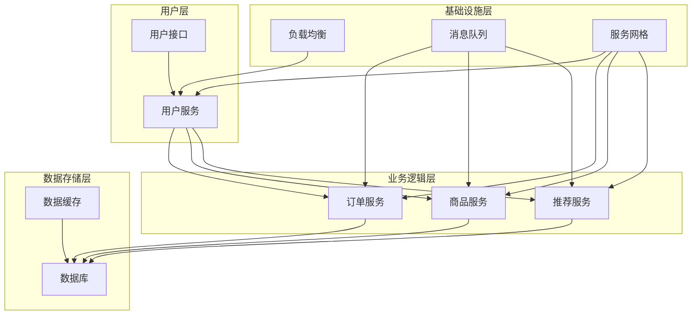

                 

### 分布式系统概述

#### 问题背景

分布式系统是计算机科学中的一个重要研究领域，起源于20世纪60年代。当时，随着计算机硬件技术的进步和计算机网络的发展，人们开始意识到单机系统在处理大规模数据和复杂任务方面的局限性。为了解决这些问题，科学家们开始探索如何将多个计算机节点通过网络连接起来，共同完成计算任务，从而形成了分布式系统的概念。

随着时间的推移，分布式系统在互联网、云计算、大数据等领域得到了广泛应用。例如，Google搜索引擎、Facebook社交媒体、阿里巴巴电子商务平台等，都是基于分布式系统构建的。分布式系统的核心优势在于其能够提供高可用性、高扩展性和高性能，这使得它们能够处理海量数据并支持大规模用户访问。

#### 问题描述

分布式系统的核心挑战在于如何在多个计算机节点之间实现数据的一致性、可靠性和高效通信。具体来说，分布式系统面临以下几个问题：

1. **数据一致性**：在分布式系统中，数据可能分布在多个节点上，当多个节点对同一份数据进行读写操作时，如何保证数据的一致性是一个关键问题。

2. **可靠性**：分布式系统中的节点可能会出现故障，如何确保系统能够在节点故障时保持正常运行，是一个重要的挑战。

3. **通信效率**：分布式系统中的节点需要通过网络进行通信，网络延迟和带宽限制可能会影响系统的性能。如何优化通信机制，提高系统效率，是一个需要解决的问题。

4. **负载均衡**：如何在多个节点之间均衡地分配任务，避免某些节点过载，是一个需要考虑的问题。

5. **容错性**：系统在节点故障时如何自动恢复，保持系统的高可用性，是一个关键问题。

#### 问题解决

为了解决上述问题，分布式系统采用了一系列技术和设计理念。以下是一些核心的解决思路：

1. **数据一致性协议**：例如Paxos和Raft算法，用于在多个节点之间达成数据一致。

2. **分布式存储**：使用分布式文件系统（如HDFS）和分布式数据库（如HBase），确保数据的高可用性和高性能。

3. **负载均衡**：通过调度器（如YARN和Mesos）实现任务的动态分配和负载均衡。

4. **容错机制**：例如通过副本机制和数据冗余，实现系统的容错能力。

5. **网络优化**：通过改进网络协议和通信机制，提高系统的通信效率。

#### 边界与外延

分布式系统与并行计算和集中式存储有密切的联系。并行计算是指利用多个处理单元同时执行任务，而分布式系统则强调网络连接下的多节点协同工作。集中式存储则是将所有数据存储在一个中心节点上，而分布式存储则将数据分布在多个节点上。

此外，分布式系统设计还需要考虑以下几个方面：

1. **系统架构**：如何设计一个高扩展性、高可用性的系统架构。

2. **安全性**：如何保护系统免受恶意攻击和数据泄露。

3. **监控与运维**：如何监控系统的运行状态并进行运维管理。

#### 概念结构与核心要素组成

分布式系统的基本组成部分包括：

1. **节点**：分布式系统中的计算和存储单元。

2. **网络**：连接节点的通信基础设施。

3. **分布式存储**：用于存储和管理数据的系统。

4. **分布式计算**：用于处理数据任务的系统。

5. **一致性协议**：确保数据一致性的算法和协议。

6. **负载均衡器**：用于分配任务的组件。

7. **监控与运维系统**：用于监控和运维分布式系统的工具。

这些组件相互协作，共同构成一个高效的分布式系统。

#### 总结

分布式系统是现代计算机科学的重要研究领域，它通过多个节点协同工作，提供高可用性、高扩展性和高性能。在分布式系统设计中，我们需要关注数据一致性、可靠性、通信效率、负载均衡和容错性等问题。通过采用一系列核心技术和设计理念，我们可以构建一个高效、可靠的分布式系统。本章节为后续章节奠定了基础，将逐步深入探讨分布式系统的各个核心概念和技术细节。

### 分布式系统架构

#### 系统架构介绍

分布式系统架构的设计直接决定了系统的性能、可扩展性和可靠性。在现代应用中，常见的系统架构包括单层架构和多层架构。

**单层架构**

单层架构也称为简单架构，其特点是将所有的功能都集中在一个节点上。这种架构的优点是设计简单，易于实现和维护。然而，单层架构在处理高并发和大规模数据时存在明显的瓶颈，一旦该节点出现故障，整个系统将无法运行。

**多层架构**

多层架构是将系统功能划分为多个层次，每个层次负责不同的任务。常见的多层架构包括：

1. **客户端-服务器（Client-Server）架构**：客户端通过网络请求服务，服务器端处理请求并返回结果。这种架构的优点是模块化高，易于扩展和升级。

2. **分布式多层架构**：在客户端-服务器架构的基础上，进一步将服务分为多个层次，如表示层、业务逻辑层和数据访问层。这种架构提高了系统的可扩展性和灵活性，但同时也增加了系统的复杂度。

#### 分布式系统设计模式

分布式系统设计模式是一系列设计原则和策略，用于指导分布式系统的开发。以下介绍几种常见的分布式系统设计模式：

**客户-服务器模型**

客户-服务器模型（Client-Server Model）是分布式系统中最基本的设计模式。在这种模式中，客户端负责发送请求，服务器端负责处理请求并返回结果。这种模式的关键在于如何高效地进行通信和负载均衡。

**发布-订阅模型**

发布-订阅模型（Publish-Subscribe Model）是一种消息驱动的设计模式。在该模式中，发布者发布消息，订阅者订阅消息。系统通过消息队列实现消息的传递，从而实现分布式系统的解耦。这种模式适用于需要高可扩展性和高可靠性的系统。

**微服务架构**

微服务架构（Microservices Architecture）是一种将系统划分为多个小型、自治服务的架构模式。每个微服务负责实现一个特定的功能，并通过API进行通信。这种架构的优点是提高了系统的可扩展性和可维护性，但同时也增加了系统的复杂性和分布式一致性挑战。

#### 架构设计与优化

分布式系统架构设计不仅要考虑系统的性能和可靠性，还要考虑系统的可维护性和可扩展性。以下是一些架构优化策略：

**性能优化策略**

1. **负载均衡**：通过负载均衡器将请求分配到不同的服务器，避免单点瓶颈。

2. **缓存策略**：使用缓存减少对后端系统的访问压力，提高系统响应速度。

3. **异步处理**：通过异步处理减少系统的响应时间，提高系统吞吐量。

**可用性优化策略**

1. **副本机制**：通过在多个节点上保存数据副本，实现数据的冗余和备份。

2. **故障转移**：在节点出现故障时，自动将负载转移到其他健康节点，确保系统持续运行。

3. **分布式一致性**：通过一致性算法（如Paxos和Raft）实现数据的一致性。

**案例分析**

在实际应用中，分布式系统架构的选择取决于具体的应用场景和需求。例如，Google的分布式文件系统GFS和分布式数据库Bigtable都是基于单层架构设计的，而Facebook的分布式存储系统Haystack和分布式数据库HBase则是基于多层架构设计的。这些系统都通过不同的架构设计和优化策略，实现了高性能和高可靠性的目标。

#### 总结

分布式系统架构设计是构建高效、可靠的分布式系统的关键。通过选择合适的架构模式和优化策略，我们可以设计出能够满足应用需求的分布式系统。本章节介绍了分布式系统架构的基本概念、设计模式和优化策略，为后续章节的深入讨论奠定了基础。

### 分布式一致性

分布式一致性是分布式系统设计中的一个关键问题，涉及到如何在多个节点之间保持数据的一致性。数据一致性问题不仅影响系统的可靠性，还影响系统的可用性和性能。本章节将详细介绍分布式一致性模型、一致性算法和分布式事务。

#### 一致性模型

一致性模型用于描述分布式系统中的数据一致性。根据一致性要求的不同，可以将一致性模型分为以下几种：

**强一致性（Strong Consistency）**

强一致性要求系统在任何情况下都能保证数据的一致性，即一旦某个操作成功执行，所有其他节点上的数据都能立即反映出这个操作的结果。强一致性通常通过锁机制、单点控制和一致性协议来实现。

**最终一致性（Eventual Consistency）**

最终一致性是一种弱一致性模型，它允许系统在一段时间内存在不一致状态，但最终会达到一致状态。最终一致性通过事件驱动的更新机制实现，如发布-订阅模型中的消息队列。最终一致性具有更高的可用性和扩展性，但可能在短时间内出现不一致状态。

**一致性弱化（Consistency Weakening）**

一致性弱化是指在保证系统性能和可用性的同时，降低一致性要求。例如，通过牺牲一致性来提高系统的响应速度和吞吐量，或者通过容错机制来容忍部分节点的失效。

#### 一致性算法

为了在分布式系统中实现数据一致性，需要使用一致性算法。以下介绍两种常见的一致性算法：

**Paxos算法**

Paxos算法是一种用于分布式系统中实现一致性协议的算法，由Leslie Lamport提出。Paxos算法的核心思想是通过选举机制，在多个节点之间达成一致意见。Paxos算法主要包括以下几个步骤：

1. **提议者（Proposer）**：提出一个值。
2. **接受者（Acceptor）**：接受提议者的提议。
3. **学习者（Learner）**：学习并记录已达成一致的结果。

**Raft算法**

Raft算法是由Diego Ongaro和John Ousterhout提出的一种一致性算法，相较于Paxos算法，Raft算法更加易于理解和实现。Raft算法的核心思想是通过领导者（Leader）和跟随者（Follower）的角色分工，实现一致性。Raft算法主要包括以下几个步骤：

1. **领导者选举**：通过心跳机制，选出一个领导者。
2. **日志复制**：领导者将日志条目复制给跟随者。
3. **提交日志**：领导者将已复制到大多数节点的日志条目提交。

#### 分布式事务

分布式事务是指在分布式系统中，如何保证多个操作要么全部成功执行，要么全部回滚。分布式事务通常需要解决以下几个问题：

1. **全局事务**：如何在一个分布式系统中执行全局事务，确保数据的一致性。
2. **局部事务**：如何在一个分布式系统中执行局部事务，提高系统的性能和可用性。
3. **分布式锁**：如何实现分布式锁，避免并发冲突。

分布式事务的常见解决方案包括：

**两阶段提交（Two-Phase Commit，2PC）**

两阶段提交是一种分布式事务管理协议，分为两个阶段：

1. **投票阶段**：协调者向参与者发送投票请求，参与者返回投票结果。
2. **提交阶段**：根据投票结果，协调者决定是否提交事务。

**三阶段提交（Three-Phase Commit，3PC）**

三阶段提交是对两阶段提交的改进，分为三个阶段：

1. **预备阶段**：协调者向参与者发送预备请求，参与者返回预备响应。
2. **提交阶段**：根据预备响应，协调者决定是否提交事务。
3. **最终阶段**：协调者向参与者发送最终消息，参与者根据最终消息执行提交或回滚。

**本地事务与全局事务**

本地事务是指在单个数据库节点上执行的事务，而全局事务则涉及多个数据库节点的数据操作。为了实现全局事务，分布式数据库通常采用分布式事务管理器，如Google的Spanner和Amazon的DynamoDB。

#### 总结

分布式一致性是分布式系统设计中的关键问题，涉及到如何在多个节点之间保持数据的一致性。一致性模型包括强一致性、最终一致性和一致性弱化；一致性算法如Paxos和Raft算法，用于实现分布式系统的一致性；分布式事务涉及全局事务、局部事务和分布式锁。通过了解这些核心概念和算法，我们可以设计出高效、可靠的分布式系统。

### 分布式存储

分布式存储是分布式系统中的核心组成部分，它通过将数据分散存储在多个节点上，提供高可用性、高性能和海量存储能力。本章节将详细介绍分布式文件系统、分布式数据库以及分布式存储系统的设计原则和实现策略。

#### 分布式文件系统

分布式文件系统是一种将数据分散存储在多个节点上的文件系统，它允许用户以集中式的方式访问这些分散存储的数据。以下介绍两种常见的分布式文件系统：

**Google File System (GFS)**

GFS是Google开发的一种分布式文件系统，它将数据分成固定大小的数据块（Block），每个数据块都会复制多个副本存储在不同的节点上。GFS的主要特点包括：

1. **高可用性**：通过数据复制和副本机制，确保数据在节点故障时不会丢失。
2. **高吞吐量**：通过并行读写多个数据块，提高数据访问速度。
3. **可扩展性**：通过动态添加节点，支持海量数据的存储。

**Hadoop Distributed File System (HDFS)**

HDFS是Hadoop框架中的分布式文件系统，它同样采用数据块存储和副本机制。HDFS的主要特点包括：

1. **高可靠性**：通过数据冗余和副本机制，确保数据在节点故障时不会丢失。
2. **高吞吐量**：通过数据块并行读写，提高数据访问速度。
3. **可扩展性**：支持海量数据的存储，通过动态添加节点扩展存储容量。

#### 分布式数据库

分布式数据库是将数据分布在多个节点上的数据库系统，它通过分布式存储和计算提供高可用性、高性能和海量数据处理能力。以下介绍两种常见的分布式数据库：

**CAP定理**

CAP定理是指分布式系统的Consistency（一致性）、Availability（可用性）和Partition tolerance（分区容错性）三者之间只能同时满足两个。根据CAP定理，分布式系统在设计时需要在一致性、可用性和分区容错性之间做出权衡。

**Base模型**

Base模型是一种弱一致性模型，它通过以下三个机制实现最终一致性：

1. **基本可用（Basic Availability）**：确保系统能够继续提供服务，即使部分节点出现故障。
2. **软状态（Soft State）**：系统允许状态在一段时间内不一致，最终会达到一致状态。
3. **最终一致性（Eventual Consistency）**：系统会在一定时间后达到一致性状态，但可能在短时间内出现不一致。

#### 分布式存储系统设计

分布式存储系统设计需要考虑以下几个关键因素：

**数据分区策略**

数据分区策略是将数据分布在多个节点上的方法。常见的分区策略包括哈希分区、范围分区和列表分区等。

1. **哈希分区**：通过哈希函数将数据分配到不同的分区，实现数据的均匀分布。
2. **范围分区**：根据数据范围将数据分配到不同的分区，适用于有序数据的存储。
3. **列表分区**：根据分区列表将数据分配到不同的分区，适用于特定数据的存储。

**数据复制策略**

数据复制策略是将数据复制到多个节点上的方法，以确保数据的冗余和可用性。常见的复制策略包括主从复制、多主复制和去同步复制等。

1. **主从复制**：一个主节点负责写入数据，从节点负责读取数据，确保数据的强一致性。
2. **多主复制**：多个节点都可以写入数据，通过一致性算法确保数据的一致性。
3. **去同步复制**：不同节点之间不要求强一致性，通过日志记录和延迟同步实现数据的最终一致性。

**数据一致性和容错性**

数据一致性和容错性是分布式存储系统的关键问题。通过一致性算法和数据冗余策略，确保数据的一致性和可靠性。

1. **一致性算法**：如Paxos、Raft算法，通过分布式一致性算法实现数据的一致性。
2. **数据冗余**：通过数据复制和副本机制，确保数据在节点故障时不会丢失。

#### 总结

分布式存储是分布式系统的核心组成部分，通过分布式文件系统和分布式数据库提供高可用性、高性能和海量存储能力。分布式文件系统如GFS和HDFS采用数据块存储和副本机制，实现数据的冗余和高吞吐量；分布式数据库如HBase和Cassandra采用CAP定理和Base模型，实现最终一致性和高可用性。在分布式存储系统设计中，需要考虑数据分区策略、数据复制策略和数据一致性与容错性等问题，确保系统的可靠性和高性能。

### 分布式计算

分布式计算是分布式系统中的另一个核心组成部分，它通过将计算任务分布在多个节点上，实现大规模数据的处理和高性能计算。本章节将详细介绍分布式计算框架、分布式调度机制以及具体的分布式计算案例。

#### 分布式计算框架

分布式计算框架是将计算任务分布在多个节点上执行的一种机制，它提供了一种标准化的接口，方便开发者进行分布式计算。以下介绍两种常见的分布式计算框架：

**MapReduce**

MapReduce是Google提出的一种分布式计算模型，用于处理大规模数据集。MapReduce框架主要包括两个阶段：Map阶段和Reduce阶段。

1. **Map阶段**：将输入数据分成多个小块，每个小块由一个Map任务处理，产生中间键值对。
2. **Reduce阶段**：将中间键值对合并，生成最终的结果。

MapReduce框架的优点是简单易用，适合处理批量数据；缺点是处理实时数据的能力较弱。

**Spark**

Spark是Apache开源的分布式计算框架，它提供了丰富的API，支持多种计算模型，包括批处理、流处理和交互式查询。Spark的主要特点包括：

1. **弹性分布式数据集（RDD）**：Spark的核心抽象是RDD，它是一种不可变、可并行操作的数据集合。
2. **内存计算**：Spark利用内存存储中间结果，减少了数据读写磁盘的次数，提高了计算性能。
3. **丰富的API**：Spark提供了多种编程接口，包括Scala、Java、Python和R，方便开发者进行分布式编程。

#### 分布式调度

分布式调度是分布式计算中的关键环节，它负责将计算任务分配到不同的节点上执行。以下介绍两种常见的分布式调度机制：

**基于资源管理的调度**

基于资源管理的调度机制通过资源管理器（如Hadoop的YARN和Mesos）实现任务的分配和调度。资源管理器的主要功能包括：

1. **资源分配**：根据节点的资源状况（如CPU、内存、存储等），动态分配任务到节点。
2. **任务调度**：根据任务的优先级和资源需求，选择合适的节点执行任务。
3. **负载均衡**：通过监控节点的负载状况，调整任务的执行位置，实现负载均衡。

**基于任务的调度**

基于任务的调度机制通过任务调度器（如Spark的DAGScheduler和TaskScheduler）实现任务的分配和调度。任务调度器的主要功能包括：

1. **任务拆分**：将大规模任务拆分成多个小任务，便于并行执行。
2. **任务分配**：根据节点的资源状况和任务需求，将任务分配到不同的节点。
3. **任务执行**：监控任务的执行进度，处理任务失败和重试等异常情况。

#### 分布式计算案例

以下介绍两个分布式计算案例，展示如何使用分布式计算框架和调度机制处理大规模数据。

**案例一：大数据处理**

假设需要处理一个包含数百万条记录的大型数据集，任务包括数据清洗、数据转换和数据分析。可以使用Spark框架进行分布式处理，具体步骤如下：

1. **数据清洗**：使用Spark的DataFrame API清洗数据，处理缺失值、异常值等问题。
2. **数据转换**：使用Spark的Transformation操作，如过滤、聚合和连接等，对数据进行转换。
3. **数据分析**：使用Spark的Action操作，如计算统计指标、生成报告等，对数据进行分析。

**案例二：实时数据处理**

假设需要处理实时数据流，任务包括数据采集、数据存储和实时分析。可以使用Apache Flink框架进行分布式实时处理，具体步骤如下：

1. **数据采集**：使用Kafka等消息队列系统，实时采集数据流。
2. **数据存储**：使用分布式存储系统（如HDFS或Kafka），将数据流存储到分布式存储中。
3. **实时分析**：使用Flink的Stream API，对数据流进行实时处理，生成实时报告或触发实时告警。

#### 总结

分布式计算通过将计算任务分布在多个节点上执行，提供高性能和大吞吐量数据处理能力。常见的分布式计算框架包括MapReduce和Spark，分别适用于批处理和实时处理场景。分布式调度机制通过资源管理和任务调度，实现任务的合理分配和执行。通过了解这些分布式计算框架和调度机制，开发者可以设计出高效、可靠的分布式计算系统。

### 分布式系统设计实践

分布式系统设计实践是理论联系实际的桥梁，通过具体的系统需求分析、架构设计、一致性实现和存储实现，我们可以更好地理解分布式系统的构建和优化。本章节将通过一个实际案例，详细讲解分布式系统设计的过程。

#### 系统需求分析

在开始设计分布式系统之前，我们需要明确系统的需求，这包括功能需求、性能需求和可用性需求。

**功能需求**

假设我们设计一个电商平台的分布式系统，主要功能包括：

1. **商品信息管理**：支持商品的增删改查。
2. **订单处理**：处理订单的创建、支付、发货等操作。
3. **用户管理**：管理用户注册、登录、个人信息等。
4. **推荐系统**：根据用户行为和偏好推荐商品。

**性能需求**

1. **高并发处理**：支持数万同时在线用户。
2. **低延迟**：响应时间在100毫秒以内。
3. **海量数据处理**：每日处理数百万条订单和商品信息。

**可用性需求**

1. **高可用性**：系统99.9%的时间处于可用状态。
2. **容错性**：节点故障时，系统能够自动恢复。

#### 系统架构设计

系统架构设计是分布式系统设计的核心，我们需要选择合适的架构模式和组件，确保系统能够满足需求。

**系统架构图**

以下是一个简化的电商平台系统架构图：

**系统模块划分**

1. **用户层**：包括用户接口和用户服务，处理用户请求。
2. **业务逻辑层**：包括订单服务、商品服务和推荐服务，实现业务逻辑。
3. **数据存储层**：包括数据库和数据缓存，存储和管理数据。
4. **基础设施层**：包括负载均衡、消息队列和服务网格，提供系统的基础设施支持。

#### 分布式一致性实现

在分布式系统中，一致性是实现系统可靠性的关键。我们选择Raft算法作为一致性算法，以确保数据的一致性。

**Raft算法应用**

1. **选举机制**：通过心跳机制选举出领导者。
2. **日志复制**：领导者将日志条目复制给跟随者。
3. **状态机**：每个节点维护一个状态机，确保日志条目的执行顺序。

#### 分布式存储实现

为了保证系统的高可用性和高性能，我们采用分布式存储方案，包括分布式文件系统和分布式数据库。

**分布式文件系统应用**

使用HDFS作为分布式文件系统，存储系统日志和临时文件。

**分布式数据库应用**

使用Apache Cassandra作为分布式数据库，存储用户数据、商品数据和订单数据。

**数据分区策略**

使用哈希分区，根据用户ID或订单ID将数据分配到不同的分区。

**数据复制策略**

使用主从复制，确保数据的高可用性。

#### 总结

通过系统需求分析、架构设计、一致性实现和存储实现，我们设计了一个满足电商系统需求的分布式系统。这个系统具有高可用性、高性能和强一致性，能够满足大规模电商平台的运行需求。在实际部署过程中，需要根据实际情况进行调整和优化，确保系统稳定运行。

### 分布式计算实践

分布式计算是现代大数据处理的重要技术，通过将计算任务分布在多个节点上执行，可以显著提高数据处理能力和性能。本章节将详细介绍如何搭建分布式计算框架，实现分布式任务调度，并分析一个实际案例。

#### 分布式计算框架搭建

为了搭建一个分布式计算框架，我们通常选择成熟的分布式计算引擎，如Apache Hadoop和Apache Spark。以下分别介绍如何搭建这两个框架。

**Hadoop集群搭建**

1. **准备环境**：确保所有节点安装了相同的操作系统（如Ubuntu 18.04）和必要的软件（如Java、SSH等）。
2. **配置SSH无密码登录**：在所有节点之间配置SSH，实现无密码登录，方便后续操作。
3. **安装Hadoop**：在每个节点上安装Hadoop，配置Hadoop的环境变量，并配置Hadoop配置文件（如hadoop-env.sh、core-site.xml、hdfs-site.xml、yarn-site.xml等）。
4. **启动Hadoop服务**：启动Hadoop守护进程，包括NameNode、DataNode、Secondary NameNode、ResourceManager和NodeManager。
5. **测试集群**：通过运行WordCount程序测试Hadoop集群是否正常运行。

**Spark集群搭建**

1. **准备环境**：与Hadoop类似，确保所有节点安装了相同的操作系统和必要的软件。
2. **安装Spark**：在每个节点上安装Spark，配置Spark的环境变量，并配置Spark配置文件（如spark-env.sh、spark-warehouse、spark-defaults.conf等）。
3. **启动Spark服务**：启动Spark的Master和Worker进程。
4. **测试集群**：通过运行Spark shell测试Spark集群是否正常运行。

#### 分布式任务调度

分布式任务调度是分布式计算中的关键环节，负责将计算任务分配到不同的节点上执行。以下分别介绍YARN和Mesos两种常见的分布式调度框架。

**YARN调度**

YARN（Yet Another Resource Negotiator）是Hadoop中的资源调度框架，负责分配集群资源并调度任务。

1. **配置YARN**：配置YARN的相关配置文件，如yarn-site.xml，包括资源分配策略、调度算法等。
2. **提交任务**：使用Hadoop命令行或编程接口（如Java、Python等）提交计算任务，YARN会根据资源情况调度任务。
3. **监控任务**：使用YARN Web UI监控任务的执行状态，包括任务的运行时间、资源使用情况等。

**Mesos调度**

Mesos是Apache开源的分布式资源调度框架，支持多种计算框架（如Spark、Hadoop、TensorFlow等）。

1. **配置Mesos**：配置Mesos的配置文件，如mesos-master.properties、mesos-slave.properties等，包括资源限制、调度策略等。
2. **启动Mesos服务**：启动Mesos的Master和Slave进程。
3. **提交任务**：使用Mesos UI或编程接口（如Python、Java等）提交计算任务，Mesos会根据资源情况调度任务。
4. **监控任务**：使用Mesos UI监控任务的执行状态，包括任务的运行时间、资源使用情况等。

#### 分布式计算案例

**案例一：使用Spark处理日志**

假设我们需要对电商平台的用户访问日志进行处理，任务包括统计用户的访问量、浏览量和购买量。

1. **数据准备**：将用户访问日志存储在HDFS上，并设置合适的文件权限。
2. **编写Spark程序**：使用Spark的Scala或Python API编写数据处理程序，包括数据读取、清洗、转换和聚合等步骤。
3. **提交任务**：通过Spark UI监控任务的执行情况，包括任务的运行时间、数据处理进度等。

**案例二：使用Flink处理实时数据流**

假设我们需要对电商平台上的用户行为进行实时分析，任务包括实时统计用户的访问量、浏览量和购买量。

1. **数据采集**：使用Kafka采集用户行为数据，并将数据存储在Kafka Topic中。
2. **编写Flink程序**：使用Flink的Java或Scala API编写数据处理程序，包括数据读取、清洗、转换和聚合等步骤。
3. **提交任务**：通过Flink UI监控任务的执行情况，包括任务的运行时间、数据流处理进度等。

#### 总结

通过搭建分布式计算框架和实现分布式任务调度，我们可以高效地处理大规模数据。Hadoop和Spark是两种常用的分布式计算框架，分别适用于批处理和实时处理场景。YARN和Mesos是两种常用的分布式调度框架，提供灵活的资源分配和任务调度能力。通过实际案例，我们可以看到分布式计算在数据处理中的应用效果。

### 总结与展望

分布式系统设计是现代计算机科学中的一个重要研究方向，其核心目标是通过多个节点的协同工作，实现高性能、高可用性和高扩展性的系统。本文从分布式系统的引论、架构设计、核心概念、存储技术、计算技术以及设计实践等方面进行了全面探讨。

首先，我们介绍了分布式系统的起源和发展，分析了分布式系统面临的主要挑战，如数据一致性、可靠性、通信效率和负载均衡。接着，我们详细介绍了分布式系统架构的设计模式，包括单层架构、多层架构以及客户-服务器模型和发布-订阅模型等。在核心概念部分，我们探讨了分布式一致性模型、一致性算法和分布式事务，重点介绍了Paxos和Raft算法以及两阶段提交和三阶段提交协议。在存储技术部分，我们介绍了分布式文件系统和分布式数据库的设计原则和实现策略，包括数据分区、复制和一致性保障。在计算技术部分，我们介绍了分布式计算框架和调度机制，包括MapReduce、Spark、YARN和Mesos等。

通过具体的案例和实践，我们展示了如何从需求分析、架构设计到一致性实现和存储实现的各个环节，构建一个高效的分布式系统。分布式系统设计不仅需要掌握核心技术和算法，还需要具备系统思维和工程实践能力。

展望未来，分布式系统设计将继续朝着更高效、更可靠和更智能的方向发展。以下是几个可能的趋势：

1. **智能调度与优化**：随着机器学习和人工智能技术的发展，分布式系统的调度和优化将变得更加智能和自动化，能够根据实时数据动态调整资源分配和任务调度。

2. **边缘计算与云计算的结合**：分布式系统将更多地结合边缘计算和云计算，实现更加灵活和高效的数据处理和计算能力，满足不同场景下的需求。

3. **分布式一致性新算法**：随着对分布式一致性需求的增长，新的分布式一致性算法将不断涌现，如基于区块链的一致性算法等，进一步解决分布式一致性难题。

4. **自动化运维与管理**：分布式系统的运维和管理将更加自动化，通过智能监控、故障预测和自动化修复，降低运维成本，提高系统稳定性。

总之，分布式系统设计是一个充满挑战和机遇的领域，需要不断探索和创新。通过不断学习和实践，我们能够设计出更加高效、可靠的分布式系统，支持现代互联网和大数据时代的各种应用场景。

### 最佳实践 Tips

1. **性能监控与优化**：定期对系统进行性能监控和调优，关注系统的响应时间、吞吐量和资源利用率，及时发现并解决性能瓶颈。

2. **数据一致性与容错性**：在分布式系统设计中，要充分考虑数据一致性和容错性，选择合适的一致性算法和容错机制，确保系统在故障情况下能够快速恢复。

3. **安全性与合规性**：确保系统的数据安全和隐私保护，遵守相关的法律法规和行业标准，定期进行安全审计和风险评估。

4. **模块化与组件化**：设计时采用模块化、组件化的思想，将系统功能划分为多个模块和组件，便于维护和升级。

5. **持续集成与部署**：采用持续集成和部署（CI/CD）流程，自动化测试和部署，提高开发效率和质量。

### 小结

本文从分布式系统的引论、架构设计、核心概念、存储技术、计算技术以及设计实践等方面，全面探讨了分布式系统设计的理论与实践。通过本文的学习，读者能够对分布式系统设计有更深入的理解，掌握核心技术和方法。

### 注意事项

1. **系统设计时要充分考虑系统的扩展性和可靠性**。
2. **在分布式系统中，一致性、可用性和分区容错性之间的权衡是关键**。
3. **实时监控和日志分析是确保系统稳定运行的重要手段**。

### 拓展阅读

- 《分布式系统原理与范型》
- 《大规模分布式存储系统》
- 《分布式计算框架实践》
- 《分布式系统设计与实践》

作者：AI天才研究院/AI Genius Institute & 禅与计算机程序设计艺术 /Zen And The Art of Computer Programming

