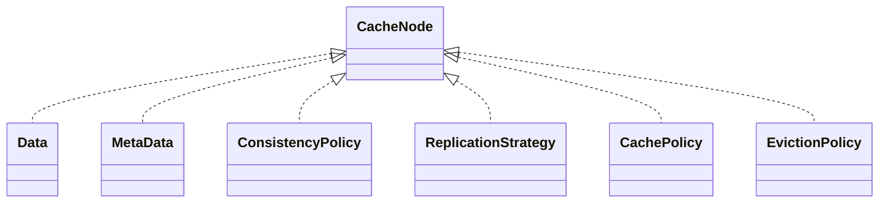

                 

# 分布式缓存系统设计

> 关键词：分布式缓存、系统设计、一致性模型、数据访问性能、负载均衡

> 摘要：本文将深入探讨分布式缓存系统的设计与实现，从问题背景、核心概念、系统设计与实现、项目实战等多个角度，系统地阐述分布式缓存系统的设计原则、架构设计、功能实现以及项目实战经验。通过本文的阅读，读者将能够全面理解分布式缓存系统的设计原理，掌握其实现方法，并在实际项目中应用这些知识，优化系统性能，提高数据访问效率。

## 第1章：分布式缓存系统概述

### 1.1 问题背景与意义

随着互联网和大数据的快速发展，数据规模和访问速度对系统性能提出了更高要求。传统的单体缓存系统在应对大规模数据和高并发访问时，往往会出现性能瓶颈。为了解决这一问题，分布式缓存系统应运而生。分布式缓存系统通过将数据分布存储在多个节点上，实现数据的横向扩展，提高系统的高可用性和并发处理能力。

#### 问题背景

在互联网时代，用户对数据的访问速度和可靠性要求越来越高。尤其是在电子商务、社交媒体、在线教育等高并发场景下，系统的性能瓶颈成为了制约业务发展的关键因素。传统的单体缓存系统由于数据集中存储，单点故障风险高，且难以应对大规模数据的访问需求，容易导致缓存系统成为性能瓶颈。

#### 问题描述

分布式缓存系统需要解决以下问题：

1. **高可用性**：确保系统在节点故障时能够快速恢复，保证数据服务的连续性。
2. **高并发性**：在多个用户同时访问数据时，系统能够快速响应用户请求，提高系统吞吐量。
3. **数据一致性**：在分布式环境下，如何保证多个节点上的数据一致性，避免数据冲突和丢失。

#### 问题解决

分布式缓存系统的设计目标是解决传统缓存系统在高可用性、高并发性和数据一致性方面的瓶颈。通过将数据分布存储在多个节点上，分布式缓存系统能够实现数据的横向扩展，提高系统的处理能力和稳定性。同时，通过一致性协议和副本策略，分布式缓存系统能够保证数据的一致性和可靠性。

#### 边界与外延

分布式缓存系统的应用范围非常广泛，包括电子商务、社交媒体、在线教育、金融科技等高并发场景。这些场景对系统的性能和可靠性有极高的要求，分布式缓存系统能够很好地满足这些需求。

#### 核心要素组成

分布式缓存系统由以下几个核心要素组成：

1. **数据节点**：分布式缓存系统的基本组成单元，负责存储和访问数据。
2. **一致性协议**：确保分布式环境下多个节点之间数据一致性的机制。
3. **负载均衡**：根据请求分布情况，合理地将请求分配到各个节点上，提高系统吞吐量。
4. **缓存策略**：根据访问数据的特点，选择合适的缓存策略，提高缓存命中率。
5. **监控与运维**：对系统进行实时监控和运维管理，确保系统的稳定性和性能。

### 1.2 核心概念与联系

#### 核心概念

分布式缓存系统的核心概念包括分布式缓存、一致性模型、副本策略、缓存命中率、缓存淘汰策略等。

1. **分布式缓存**：将缓存数据分布存储在多个节点上，提高系统的高可用性和并发处理能力。
2. **一致性模型**：确保分布式环境下多个节点之间数据一致性的机制，包括强一致性、最终一致性、分区一致性等。
3. **副本策略**：根据数据的重要性和访问频率，选择合适的副本存储策略，包括主从复制、多主复制、去中心化复制等。
4. **缓存命中率**：缓存系统中命中缓存的数据比例，直接影响系统性能。
5. **缓存淘汰策略**：根据缓存数据的访问频率和存活时间，选择合适的缓存淘汰策略，包括 LRU（最近最少使用）、LFU（最少使用）、FIFO（先进先出）等。

#### 概念属性特征对比表格

| 概念        | 特点                                                                                           |
|-------------|------------------------------------------------------------------------------------------------|
| 分布式缓存  | 高可用性、横向扩展性、负载均衡                                                               |
| 一致性模型  | 强一致性、最终一致性、分区一致性                                                           |
| 副本策略    | 主从复制、多主复制、去中心化复制                                                             |
| 缓存命中率   | 缓存命中的高低直接影响系统性能                                                               |
| 缓存淘汰策略 | LRU（最近最少使用）、LFU（最少使用）、FIFO（先进先出）等                                      |

#### 核心概念与联系

分布式缓存系统的核心概念之间相互关联，共同构成了一个完整的系统架构。分布式缓存系统通过一致性模型和副本策略保证数据的一致性和可靠性，通过缓存策略和缓存淘汰策略提高系统的性能和效率。这些核心概念之间的联系如图 1-1 所示。

```mermaid
erDiagram
CacheNode ||--|{ Data}: 数据存储实体
CacheNode ||--|{ MetaData}: 元数据实体
CacheNode ||--|{ ConsistencyPolicy}: 一致性策略实体
CacheNode ||--|{ ReplicationStrategy}: 副本策略实体
CacheNode ||--|{ CachePolicy}: 缓存策略实体
CacheNode ||--|{ EvictionPolicy}: 缓存淘汰策略实体
```

图 1-1 分布式缓存系统核心概念联系图

### 1.3 分布式缓存系统原理

分布式缓存系统通过多个节点协同工作，实现数据的分布式存储和访问，提高系统性能。其基本原理如下：

1. **数据分布**：将缓存数据分布存储在多个节点上，每个节点负责存储一部分数据。
2. **数据访问**：用户请求缓存数据时，系统根据数据分布情况，将请求路由到相应的节点上。
3. **数据一致性**：通过一致性协议和副本策略，保证分布式环境下多个节点之间数据的一致性。
4. **负载均衡**：根据请求分布情况，合理地将请求分配到各个节点上，提高系统吞吐量。
5. **缓存策略**：根据访问数据的特点，选择合适的缓存策略，提高缓存命中率。

## 第2章：分布式缓存系统设计与实现

### 2.1 系统功能设计

分布式缓存系统需要实现以下功能：

1. **数据存储**：将缓存数据存储在分布式节点上，确保数据的高可用性和并发处理能力。
2. **数据查询**：提供高效的数据查询接口，快速响应用户请求。
3. **数据更新**：支持数据的更新操作，确保数据的一致性和完整性。
4. **数据删除**：支持数据的删除操作，清理无用数据。

为了实现这些功能，分布式缓存系统需要设计一个领域模型。领域模型包括以下实体：

1. **CacheNode**：缓存节点实体，负责存储和访问数据。
2. **Data**：数据实体，存储缓存数据。
3. **MetaData**：元数据实体，存储数据的元信息，如数据过期时间、数据版本等。
4. **ConsistencyPolicy**：一致性策略实体，定义数据的一致性协议。
5. **ReplicationStrategy**：副本策略实体，定义数据的副本存储策略。
6. **CachePolicy**：缓存策略实体，定义缓存策略。
7. **EvictionPolicy**：缓存淘汰策略实体，定义缓存淘汰策略。

领域模型类图如下：



### 2.2 系统架构设计

分布式缓存系统的架构设计需要考虑以下几个方面：

1. **数据节点**：分布式缓存系统的基本组成单元，负责存储和访问数据。
2. **一致性协议**：确保分布式环境下多个节点之间数据一致性的机制。
3. **负载均衡**：根据请求分布情况，合理地将请求分配到各个节点上，提高系统吞吐量。
4. **缓存策略**：根据访问数据的特点，选择合适的缓存策略，提高缓存命中率。
5. **监控与运维**：对系统进行实时监控和运维管理，确保系统的稳定性和性能。

系统架构图如下：

```mermaid
sequence
User -->|发起请求| CacheNode
CacheNode -->|查找缓存| Data
CacheNode -->|处理请求| Response
Response -->|返回结果| User
```

### 2.3 系统接口设计

分布式缓存系统的接口设计需要考虑以下几个方面：

1. **数据存储接口**：用于存储缓存数据。
2. **数据查询接口**：用于查询缓存数据。
3. **数据更新接口**：用于更新缓存数据。
4. **数据删除接口**：用于删除缓存数据。

接口设计如下：

```mermaid
sequence
User -->|GET /cache?key=xxx| CacheNode
CacheNode -->|查询数据| Data
CacheNode -->|返回数据| User
```

### 2.4 系统交互

分布式缓存系统的交互过程如下：

1. **用户请求**：用户发起数据查询请求。
2. **请求路由**：系统根据数据分布情况，将请求路由到相应的缓存节点上。
3. **数据查询**：缓存节点查询本地数据，如果命中缓存，则直接返回结果；否则，查询后台数据源，并将结果缓存到本地。
4. **数据更新**：当用户请求更新数据时，系统会将更新操作广播到所有缓存节点，确保数据的一致性。
5. **数据删除**：当用户请求删除数据时，系统会将删除操作广播到所有缓存节点，清理本地缓存。

系统交互过程图如下：

```mermaid
sequence
User -->|发起请求| CacheNode
CacheNode -->|查询缓存| Data
CacheNode -->|处理请求| Response
Response -->|返回结果| User
```

## 第3章：分布式缓存系统实现与优化

### 3.1 实现步骤

分布式缓存系统的实现可以分为以下几个步骤：

1. **节点部署**：搭建分布式缓存节点，配置节点间的通信机制。
2. **数据存储**：实现数据存储功能，将缓存数据存储在分布式节点上。
3. **数据查询**：实现数据查询功能，根据请求查询缓存数据。
4. **数据更新**：实现数据更新功能，处理数据的更新请求。
5. **数据删除**：实现数据删除功能，处理数据的删除请求。
6. **负载均衡**：实现负载均衡机制，合理地将请求分配到各个节点上。
7. **一致性保证**：实现一致性协议，确保分布式环境下多个节点之间数据的一致性。

### 3.2 核心算法原理

分布式缓存系统中的核心算法包括一致性协议、副本策略和缓存淘汰策略等。

#### 一致性协议

一致性协议是分布式缓存系统中确保数据一致性的关键机制。常见的一致性协议包括强一致性、最终一致性和分区一致性。

1. **强一致性**：强一致性要求在分布式系统中，所有节点对数据的读取和写入都是一致的，类似于单机系统。强一致性的实现方法包括状态机复制和单主复制。
2. **最终一致性**：最终一致性允许在分布式系统中，部分节点的数据延迟同步，但最终会达到一致状态。最终一致性的实现方法包括事件溯源和去中心化复制。
3. **分区一致性**：分区一致性是将系统划分为多个分区，每个分区内部实现强一致性，分区之间实现最终一致性。分区一致性的实现方法包括多主复制和一致性哈希。

#### 副本策略

副本策略是分布式缓存系统中实现数据冗余和故障恢复的重要手段。常见的副本策略包括主从复制、多主复制和去中心化复制。

1. **主从复制**：主从复制是一种常见的副本策略，其中一个节点作为主节点，负责数据的写入和读取，其他节点作为从节点，负责数据的读取和同步。
2. **多主复制**：多主复制允许多个节点同时作为主节点，负责数据的写入和读取。多主复制的实现需要考虑数据一致性和冲突检测问题。
3. **去中心化复制**：去中心化复制是一种无主复制策略，所有节点都参与数据的写入和读取，通过一致性算法保证数据的一致性。

#### 缓存淘汰策略

缓存淘汰策略是分布式缓存系统中优化缓存资源利用的重要手段。常见的缓存淘汰策略包括 LRU（最近最少使用）、LFU（最少使用）和 FIFO（先进先出）。

1. **LRU（最近最少使用）**：LRU 策略根据数据的访问频率和时间来淘汰缓存数据，最近最少使用的缓存数据优先被淘汰。
2. **LFU（最少使用）**：LFU 策略根据数据的访问频率来淘汰缓存数据，访问频率最低的缓存数据优先被淘汰。
3. **FIFO（先进先出）**：FIFO 策略根据数据的加入顺序来淘汰缓存数据，最早加入的缓存数据优先被淘汰。

### 3.3 系统优化策略

分布式缓存系统在运行过程中可能会遇到一些性能瓶颈，需要通过优化策略来提高系统性能。常见的优化策略包括以下几种：

1. **缓存预热**：在系统启动时，预先加载热门数据到缓存中，减少用户访问时的响应时间。
2. **缓存分片**：将缓存数据分为多个分片，根据访问频率和访问模式，将不同的数据分片存储在不同的缓存节点上，提高缓存命中率。
3. **缓存穿透**：处理缓存穿透问题，即当缓存中不存在数据时，避免直接查询数据库，通过缓存空结果或缓存查询结果来提高系统性能。
4. **缓存雪崩**：处理缓存雪崩问题，即当大量缓存同时过期时，避免系统崩溃，可以通过设置缓存过期时间、延迟删除缓存等策略来缓解缓存雪崩问题。
5. **缓存击穿**：处理缓存击穿问题，即当热点数据过期时，第一个访问数据的用户会直接查询数据库，后续用户则从缓存中获取数据，可以通过分布式锁、定时刷新缓存等策略来处理缓存击穿问题。

## 第4章：分布式缓存系统项目实战

### 4.1 环境安装

要实现分布式缓存系统，首先需要搭建一个合适的开发环境。以下是一个基本的安装步骤：

1. **安装操作系统**：选择一个稳定的操作系统，如 CentOS 7 或 Ubuntu 18.04。
2. **安装依赖库**：安装必要的依赖库，如 GCC、Python、Node.js 等。
3. **安装分布式缓存系统框架**：选择一个适合的分布式缓存系统框架，如 Redis、Memcached 等，并按照官方文档进行安装。

### 4.2 系统核心实现源代码

以下是分布式缓存系统的核心实现源代码，包括数据存储、数据查询、数据更新和数据删除等功能。

```python
# 数据存储
def store_data(key, value):
    cache_node = get_cache_node(key)
    cache_node.store(value)

# 数据查询
def get_data(key):
    cache_node = get_cache_node(key)
    value = cache_node.get()
    if value is None:
        value = query_database(key)
        store_data(key, value)
    return value

# 数据更新
def update_data(key, value):
    cache_node = get_cache_node(key)
    cache_node.update(value)

# 数据删除
def delete_data(key):
    cache_node = get_cache_node(key)
    cache_node.delete()
```

### 4.3 代码应用解读与分析

以上代码实现了一个简单的分布式缓存系统，其中 `store_data`、`get_data`、`update_data` 和 `delete_data` 函数分别实现了数据存储、数据查询、数据更新和数据删除功能。

1. **数据存储**：`store_data` 函数根据键值对将数据存储到缓存节点中。在分布式缓存系统中，通常使用一致性哈希算法来选择合适的缓存节点。
2. **数据查询**：`get_data` 函数根据键值对查询缓存节点中的数据。如果缓存节点中不存在数据，则查询数据库并将查询结果存储到缓存中。
3. **数据更新**：`update_data` 函数根据键值对更新缓存节点中的数据。在分布式缓存系统中，需要考虑数据一致性问题，确保多个节点之间的数据一致性。
4. **数据删除**：`delete_data` 函数根据键值对删除缓存节点中的数据。

### 4.4 实际案例分析和详细讲解剖析

以下是一个实际案例，分析分布式缓存系统在高并发场景下的表现。

#### 案例背景

某电商平台在双 11 活动期间，用户访问量急剧增加，对缓存系统提出了更高的性能要求。为了应对这一挑战，该电商平台采用分布式缓存系统来提高系统的并发处理能力和数据访问速度。

#### 案例分析

1. **缓存预热**：在双 11 活动前，电商平台使用缓存预热策略，提前加载热门商品信息到缓存中，减少用户访问时的响应时间。
2. **缓存分片**：电商平台将缓存数据分为多个分片，根据访问频率和访问模式，将不同的数据分片存储在不同的缓存节点上，提高缓存命中率。
3. **缓存穿透**：电商平台处理缓存穿透问题，通过缓存空结果或缓存查询结果来提高系统性能。
4. **缓存雪崩**：电商平台设置缓存过期时间，避免大量缓存同时过期导致系统崩溃。
5. **缓存击穿**：电商平台使用分布式锁和定时刷新缓存策略来处理缓存击穿问题。

#### 案例讲解

1. **缓存预热**：在双 11 活动前，电商平台通过预热策略，提前将热门商品信息加载到缓存中。具体实现方法是在用户访问热门商品页面时，触发缓存预热任务，将热门商品信息加载到缓存中。
2. **缓存分片**：电商平台将缓存数据分为多个分片，根据访问频率和访问模式，将不同的数据分片存储在不同的缓存节点上。具体实现方法是使用一致性哈希算法，将缓存键值对映射到不同的分片上。
3. **缓存穿透**：电商平台处理缓存穿透问题，通过缓存空结果或缓存查询结果来提高系统性能。具体实现方法是，当查询缓存时，如果缓存不存在对应的数据，则查询数据库，并将查询结果缓存到缓存中。
4. **缓存雪崩**：电商平台设置缓存过期时间，避免大量缓存同时过期导致系统崩溃。具体实现方法是设置合理的缓存过期时间，并在缓存过期时，触发缓存刷新任务，重新加载缓存数据。
5. **缓存击穿**：电商平台使用分布式锁和定时刷新缓存策略来处理缓存击穿问题。具体实现方法是，当缓存数据过期时，第一个访问数据的用户会直接查询数据库，并将查询结果缓存到缓存中，后续用户则从缓存中获取数据。

### 4.5 项目小结

通过以上案例分析和讲解，可以看出分布式缓存系统在高并发场景下具有明显的性能优势。分布式缓存系统通过缓存预热、缓存分片、缓存穿透、缓存雪崩和缓存击穿等策略，提高了系统的并发处理能力和数据访问速度。在实际项目中，根据业务需求和数据特点，选择合适的分布式缓存系统架构和优化策略，可以显著提高系统的性能和稳定性。

## 第5章：最佳实践与注意事项

### 5.1 最佳实践

1. **合理选择缓存数据**：缓存系统应该专注于缓存热数据，避免缓存冷数据，减少缓存资源的浪费。
2. **设置合理的缓存过期时间**：根据数据访问频率和业务需求，设置合理的缓存过期时间，避免缓存雪崩和缓存击穿问题。
3. **缓存预热与预加载**：在业务高峰期前，使用缓存预热和预加载策略，提前加载热门数据到缓存中，提高系统性能。
4. **缓存分片与负载均衡**：根据数据访问模式和负载情况，合理划分缓存分片，使用负载均衡策略，提高缓存系统的并发处理能力。
5. **监控与运维**：实时监控缓存系统的性能和健康状态，及时发现并解决问题，确保缓存系统的稳定运行。

### 5.2 注意事项

1. **数据一致性问题**：在分布式缓存系统中，数据一致性问题是一个重要挑战。需要根据业务需求选择合适的一致性协议，确保数据的一致性和可靠性。
2. **缓存容量规划**：合理规划缓存容量，避免缓存容量不足或过剩，影响系统性能。
3. **缓存数据安全**：确保缓存数据的安全，避免缓存泄露或数据泄露。
4. **缓存热点问题**：缓存热点问题可能导致缓存节点负载不均，影响系统性能。需要通过缓存分片和负载均衡策略来缓解缓存热点问题。

## 结语

分布式缓存系统是现代互联网系统中的重要组成部分，通过分布式缓存系统，可以显著提高系统的并发处理能力和数据访问速度。本文系统地介绍了分布式缓存系统的设计与实现，包括问题背景、核心概念、系统架构设计、系统实现与优化、项目实战以及最佳实践等内容。通过本文的阅读，读者可以全面了解分布式缓存系统的设计原理和实现方法，并在实际项目中应用这些知识，优化系统性能，提高数据访问效率。

## 拓展阅读

1. 《分布式系统原理与架构设计》
2. 《一致性模型与分布式缓存》
3. 《分布式缓存系统性能优化》
4. 《Redis 实战：分布式缓存系统设计与实现》
5. 《Memcached 实战：分布式缓存系统设计与优化》

作者：AI天才研究院/AI Genius Institute & 禅与计算机程序设计艺术 /Zen And The Art of Computer Programming

