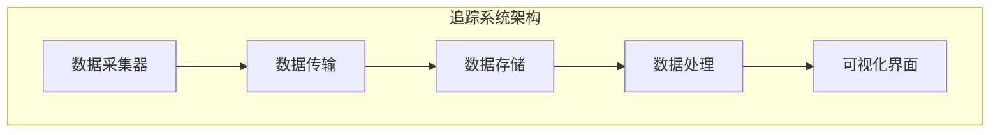
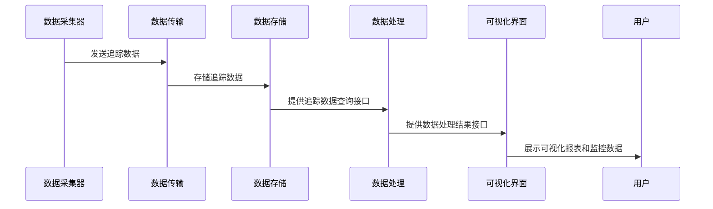

                 

# 分布式追踪系统的设计与实现

## 摘要

本文将深入探讨分布式追踪系统的设计与实现，涵盖从核心概念到实际应用的各个方面。我们将首先介绍分布式追踪系统的定义及其在系统监控和故障排查中的重要作用。接着，我们将分析分布式追踪系统面临的问题和挑战，并探讨其核心概念与组成要素。随后，我们将详细讲解分布式追踪系统的工作原理、数学模型及其实现流程。在此基础上，我们将设计分布式追踪系统的架构，并进行系统功能设计、接口设计与交互。最后，我们将通过环境搭建、核心实现、案例分析以及最佳实践等方面，全面展示分布式追踪系统的设计与实现过程。

## 目录大纲

### 第一部分：背景介绍

1. **核心概念与问题背景**
    - **1.1.1 分布式追踪系统的定义**
    - **1.1.2 分布式追踪系统的核心作用**
    - **1.1.3 分布式追踪系统面临的问题与挑战**
2. **核心概念与联系**
    - **2.1.1 分布式追踪系统的基本概念**
    - **2.1.2 分布式追踪系统的组成要素**
    - **2.1.3 分布式追踪系统的核心原理**

### 第二部分：分布式追踪系统的原理讲解

1. **分布式追踪系统的工作原理**
    - **3.1.1 数据采集**
    - **3.1.2 数据存储**
    - **3.1.3 数据处理**
2. **分布式追踪系统的数学模型**
    - **3.2.1 数学模型介绍**
    - **3.2.2 数学公式与算法**

### 第三部分：分布式追踪系统的架构设计

1. **系统功能设计**
    - **4.1.1 系统功能需求分析**
    - **4.1.2 领域模型设计**
2. **架构设计**
    - **5.1.1 系统架构设计原则**
    - **5.1.2 系统架构设计**
    - **5.1.3 系统架构图讲解**

### 第四部分：分布式追踪系统的实现与实战

1. **环境搭建**
    - **7.1.1 环境搭建步骤**
    - **7.1.2 环境配置细节**
2. **核心实现**
    - **8.1.1 系统核心代码实现**
    - **8.1.2 代码解读与分析**
    - **8.1.3 实现细节讲解**
3. **实际案例分析**
    - **9.1.1 案例背景介绍**
    - **9.1.2 案例分析与讲解**
    - **9.1.3 案例总结与思考**

### 第五部分：最佳实践与总结

1. **最佳实践**
    - **10.1.1 最佳实践建议**
    - **10.1.2 注意事项**
    - **10.1.3 拓展阅读**
2. **总结与展望**
    - **11.1.1 总结回顾**
    - **11.1.2 展望未来**

## 第一部分：背景介绍

### 1.1.1 分布式追踪系统的定义

分布式追踪系统（Distributed Tracing System）是一种用于收集、处理和分析分布式系统中各个服务间调用的数据，帮助开发者追踪和监控分布式应用性能、定位问题的系统。在分布式系统中，由于组件繁多且跨越多个服务器和容器，追踪单个请求的执行路径变得异常复杂。分布式追踪系统通过在系统中嵌入追踪数据采集器，实时捕获请求的执行信息，将数据传输至集中存储和处理平台，从而实现分布式应用的性能监控和故障排查。

### 1.1.2 分布式追踪系统的核心作用

分布式追踪系统在系统监控和故障排查中发挥着至关重要的作用：

1. **性能监控**：分布式追踪系统可以实时监控分布式应用的性能，包括请求处理时间、服务响应时间、数据传输延迟等关键性能指标，帮助开发者识别性能瓶颈。
   
2. **故障排查**：通过追踪系统中的请求路径，分布式追踪系统可以帮助开发者快速定位故障发生的位置，并分析故障原因，从而进行针对性的修复。
   
3. **分布式系统调试**：分布式追踪系统提供了一个全局视图，开发者可以追踪并分析分布式应用中的复杂调用关系，解决调试难题。

### 1.1.3 分布式追踪系统面临的问题与挑战

分布式追踪系统在设计实现过程中面临着一系列问题和挑战：

1. **数据量巨大**：在分布式系统中，每一次请求都会产生大量的追踪数据，这些数据需要被高效地采集、存储和处理。
   
2. **跨语言兼容性**：分布式应用通常涉及多种编程语言和框架，分布式追踪系统需要支持跨语言的追踪数据采集和格式兼容。
   
3. **分布式一致性**：分布式追踪系统需要保证数据的一致性，避免因为网络问题或系统故障导致数据丢失或重复。

### 1.1.4 分布式追踪系统的基本概念与组成要素

分布式追踪系统由多个核心组成要素构成：

1. **追踪数据采集器**：部署在各个服务节点上，用于采集请求的执行信息，如请求ID、处理时间、调用链等。
   
2. **追踪数据传输**：通过网络传输将采集到的追踪数据发送至集中存储和处理平台。
   
3. **追踪数据存储**：用于存储大量的追踪数据，通常使用分布式数据库或时间序列数据库。
   
4. **数据处理与分析**：对采集到的追踪数据进行处理和分析，生成可视化报表和监控指标。
   
5. **可视化界面**：提供用户友好的界面，帮助开发者查看和分析追踪数据。

## 第二部分：分布式追踪系统的原理讲解

### 2.1.1 分布式追踪系统的基本概念

在分布式追踪系统中，以下几个基本概念至关重要：

1. **追踪数据（Trace Data）**：记录某个请求在整个分布式系统中的执行路径、处理时间和相关信息的集合。
   
2. **追踪上下文（Trace Context）**：包含追踪数据的上下文信息，如请求ID、追踪ID、父追踪ID等。
   
3. **调用链（Span）**：分布式系统中某个服务的执行过程，包含进入和离开该服务的时机、执行时间等。
   
4. **服务网格（Service Mesh）**：用于管理分布式服务通信的框架，如Istio、Linkerd等，分布式追踪系统通常与服务网格集成。

### 2.1.2 分布式追踪系统的组成要素

分布式追踪系统由以下主要组成要素构成：

1. **追踪数据采集器**：部署在各个服务节点上，负责收集追踪数据。常见的数据采集器有OpenTracing、Jaeger Client等。
   
2. **追踪数据传输**：通过HTTP、gRPC等协议将追踪数据发送至追踪数据存储。常见的数据传输方式有Zipkin HTTP API、Jaeger Agent等。
   
3. **追踪数据存储**：用于存储大量的追踪数据，支持快速查询和实时分析。常见的数据存储方案有Kafka、Elasticsearch、InfluxDB等。
   
4. **数据处理与分析**：对采集到的追踪数据进行处理和分析，生成可视化报表和监控指标。常见的处理工具和平台有Prometheus、Grafana等。
   
5. **可视化界面**：提供用户友好的界面，帮助开发者查看和分析追踪数据。常见的可视化界面有Zipkin UI、Jaeger UI等。

### 2.1.3 分布式追踪系统的核心原理

分布式追踪系统的核心原理可以概括为以下三个方面：

1. **数据采集与传输**：分布式追踪系统通过在服务节点上部署追踪数据采集器，实时采集追踪数据，并将数据发送至追踪数据存储。数据采集和传输通常采用分布式架构，确保数据的高效传输和可靠存储。

2. **数据处理与分析**：分布式追踪系统对采集到的追踪数据进行处理和分析，提取关键性能指标和监控数据，生成可视化报表和监控仪表盘，帮助开发者实时监控分布式系统的性能和稳定性。

3. **可视化与交互**：分布式追踪系统提供用户友好的可视化界面，开发者可以在界面上查看追踪数据、分析性能瓶颈和定位故障原因。可视化界面通常支持多种交互操作，如过滤、排序、聚合等，方便开发者进行深度分析。

### 2.1.4 分布式追踪系统的数学模型

分布式追踪系统的数学模型主要涉及以下几个关键要素：

1. **随机过程模型**：描述追踪数据生成过程，如泊松过程、Gamma过程等。
   
2. **时间序列模型**：描述追踪数据的时间序列特征，如ARIMA模型、SARIMA模型等。
   
3. **概率模型**：描述追踪数据的概率分布，如正态分布、泊松分布等。

通过这些数学模型，分布式追踪系统可以更准确地分析追踪数据，预测系统性能，优化分布式应用。

## 第三部分：分布式追踪系统的架构设计

### 3.1.1 系统架构设计原则

在设计分布式追踪系统时，需要遵循以下架构设计原则：

1. **模块化**：将系统划分为多个模块，每个模块负责特定的功能，便于维护和扩展。
   
2. **分布式**：采用分布式架构，确保系统的高可用性和可扩展性。
   
3. **可扩展性**：支持水平扩展，能够处理大量的追踪数据。
   
4. **高可用性**：确保系统稳定运行，避免单点故障导致数据丢失。
   
5. **兼容性**：支持多种编程语言和框架，确保跨语言兼容性。

### 3.1.2 系统架构设计

分布式追踪系统的架构设计通常包括以下组件：

1. **追踪数据采集器**：部署在各个服务节点上，负责采集追踪数据。
   
2. **追踪数据传输**：通过HTTP、gRPC等协议将追踪数据发送至追踪数据存储。
   
3. **追踪数据存储**：存储大量的追踪数据，支持快速查询和实时分析。
   
4. **数据处理与分析**：对采集到的追踪数据进行处理和分析，生成可视化报表和监控指标。
   
5. **可视化界面**：提供用户友好的界面，帮助开发者查看和分析追踪数据。

### 3.1.3 系统架构图讲解

以下是分布式追踪系统的架构图：


**追踪数据采集器**：部署在各个服务节点上，用于采集追踪数据。采集器可以是独立的进程或嵌入在服务中的应用库。

**追踪数据传输**：采用HTTP、gRPC等协议将追踪数据发送至追踪数据存储。传输过程中，可以采用压缩、加密等手段提高数据传输效率和安全性。

**追踪数据存储**：使用分布式数据库或时间序列数据库存储大量的追踪数据，支持快速查询和实时分析。常见的数据存储方案有Kafka、Elasticsearch、InfluxDB等。

**数据处理与分析**：对采集到的追踪数据进行处理和分析，提取关键性能指标和监控数据，生成可视化报表和监控仪表盘。

**可视化界面**：提供用户友好的界面，帮助开发者查看和分析追踪数据。可视化界面通常支持多种交互操作，如过滤、排序、聚合等。

## 第四部分：分布式追踪系统的实现与实战

### 4.1.1 系统功能需求分析

在设计分布式追踪系统时，我们需要明确系统所需实现的功能，以满足开发者对性能监控、故障排查和分布式系统调试的需求：

1. **数据采集**：能够自动采集分布式系统中各个服务节点的追踪数据，包括请求ID、处理时间、调用链等信息。
   
2. **数据传输**：确保追踪数据能够高效、可靠地传输至追踪数据存储，支持多种传输协议，如HTTP、gRPC等。
   
3. **数据存储**：能够存储大量的追踪数据，支持快速查询和实时分析，支持分布式数据库或时间序列数据库。
   
4. **数据处理**：对采集到的追踪数据进行处理和分析，提取关键性能指标和监控数据，生成可视化报表和监控仪表盘。
   
5. **可视化界面**：提供用户友好的界面，支持多种交互操作，如过滤、排序、聚合等，方便开发者查看和分析追踪数据。

### 4.1.2 领域模型设计

为了更好地理解和实现分布式追踪系统的功能，我们可以使用领域模型（Domain Model）对其进行描述。领域模型是一种用于表示业务实体及其关系的抽象模型，可以帮助我们明确系统的核心功能和数据结构。

以下是分布式追踪系统的领域模型：

```mermaid
classDiagram
    TraceData <<class>> 追踪数据
    Span <<class>> 调用链
    Service <<class>> 服务
    DataCollector <<class>> 数据采集器
    DataTransmitter <<class>> 数据传输
    DataStorage <<class>> 数据存储
    DataProcessor <<class>> 数据处理
    Visualization <<class>> 可视化界面
    
    TraceData o--* Span
    TraceData o--* Service
    DataCollector o--* TraceData
    DataTransmitter o--* TraceData
    DataStorage o--* TraceData
    DataProcessor o--* TraceData
    Visualization o--* TraceData
```

**追踪数据（TraceData）**：表示分布式系统中某个请求的执行信息，包括请求ID、处理时间、调用链等。

**调用链（Span）**：表示分布式系统中某个服务的执行过程，包括进入和离开该服务的时机、执行时间等。

**服务（Service）**：表示分布式系统中的各个服务节点，如Web服务、数据库服务、消息队列服务等。

**数据采集器（DataCollector）**：负责采集分布式系统中各个服务节点的追踪数据。

**数据传输（DataTransmitter）**：负责将追踪数据传输至追踪数据存储。

**数据存储（DataStorage）**：负责存储大量的追踪数据，支持快速查询和实时分析。

**数据处理（DataProcessor）**：负责对采集到的追踪数据进行处理和分析。

**可视化界面（Visualization）**：负责提供用户友好的界面，帮助开发者查看和分析追踪数据。

### 4.1.3 系统架构设计

在明确系统功能需求和领域模型的基础上，我们可以进行分布式追踪系统的架构设计。以下是分布式追踪系统的架构设计：



**数据采集器（DataCollector）**：部署在各个服务节点上，用于采集追踪数据。采集器可以是独立的进程或嵌入在服务中的应用库。

**数据传输（DataTransmitter）**：采用HTTP、gRPC等协议将追踪数据发送至追踪数据存储。传输过程中，可以采用压缩、加密等手段提高数据传输效率和安全性。

**数据存储（DataStorage）**：使用分布式数据库或时间序列数据库存储大量的追踪数据，支持快速查询和实时分析。常见的数据存储方案有Kafka、Elasticsearch、InfluxDB等。

**数据处理（DataProcessor）**：对采集到的追踪数据进行处理和分析，提取关键性能指标和监控数据，生成可视化报表和监控仪表盘。

**可视化界面（Visualization）**：提供用户友好的界面，支持多种交互操作，如过滤、排序、聚合等，方便开发者查看和分析追踪数据。

### 4.1.4 系统接口设计与交互

在分布式追踪系统的架构设计过程中，系统接口的设计与交互至关重要。以下是分布式追踪系统的接口设计与交互设计：



**数据采集器（DataCollector）**：负责采集分布式系统中各个服务节点的追踪数据，并将其发送至数据传输模块。

**数据传输（DataTransmitter）**：接收数据采集器发送的追踪数据，将其存储至数据存储模块。

**数据存储（DataStorage）**：提供追踪数据查询接口，供数据处理模块和数据可视化模块使用。

**数据处理（DataProcessor）**：对采集到的追踪数据进行处理和分析，提取关键性能指标和监控数据，并将其发送至数据可视化模块。

**可视化界面（Visualization）**：接收数据处理模块发送的数据，将其展示为可视化报表和监控数据，供用户查看和分析。

### 4.1.5 系统架构图讲解

以下是分布式追踪系统的架构图：


**数据采集器（DataCollector）**：部署在各个服务节点上，用于采集追踪数据。采集器可以是独立的进程或嵌入在服务中的应用库。

**数据传输（DataTransmitter）**：采用HTTP、gRPC等协议将追踪数据发送至追踪数据存储。传输过程中，可以采用压缩、加密等手段提高数据传输效率和安全性。

**数据存储（DataStorage）**：使用分布式数据库或时间序列数据库存储大量的追踪数据，支持快速查询和实时分析。常见的数据存储方案有Kafka、Elasticsearch、InfluxDB等。

**数据处理（DataProcessor）**：对采集到的追踪数据进行处理和分析，提取关键性能指标和监控数据，生成可视化报表和监控仪表盘。

**可视化界面（Visualization）**：提供用户友好的界面，支持多种交互操作，如过滤、排序、聚合等，方便开发者查看和分析追踪数据。

## 第五部分：分布式追踪系统的实现与实战

### 5.1.1 环境搭建步骤

搭建分布式追踪系统需要配置多个组件，包括追踪数据采集器、数据传输、数据存储、数据处理和可视化界面。以下是环境搭建的步骤：

1. **安装Java环境**：确保系统已安装Java 8及以上版本，因为大部分分布式追踪系统组件都是用Java编写的。
   
2. **安装Elasticsearch**：Elasticsearch是一个分布式搜索引擎，用于存储和查询追踪数据。下载并安装Elasticsearch，启动服务。
   
3. **安装Kafka**：Kafka是一个分布式消息队列，用于传输追踪数据。下载并安装Kafka，启动服务。
   
4. **安装Zipkin**：Zipkin是一个开源分布式追踪系统，用于采集、存储和处理追踪数据。下载并安装Zipkin，配置Kafka连接，启动服务。
   
5. **配置追踪数据采集器**：在各个服务节点上安装并配置追踪数据采集器，确保采集器能够将追踪数据发送至Zipkin。

### 5.1.2 环境配置细节

以下是环境配置的细节：

1. **Elasticsearch配置**：
   - 下载Elasticsearch的tar.gz文件，解压后运行elasticsearch.bat启动服务。
   - 配置elasticsearch.yml文件，设置集群名称、节点名称、网络配置等。

2. **Kafka配置**：
   - 下载Kafka的tar.gz文件，解压后运行kafka-server-start.sh启动服务。
   - 配置kafka-server-start.sh文件，设置Kafka的日志级别、日志路径等。

3. **Zipkin配置**：
   - 下载Zipkin的jar文件，运行java -jar zipkin.jar启动服务。
   - 配置zipkin-server.yml文件，设置Kafka的主题、端口等。

4. **追踪数据采集器配置**：
   - 在各个服务节点上下载并安装追踪数据采集器，如Jaeger Client。
   - 配置Jaeger Client的配置文件，设置Zipkin的地址和端口。

### 5.1.3 系统核心代码实现

以下是分布式追踪系统的核心代码实现：

1. **追踪数据采集器**：
   ```java
   import io.jaegertracing.Configuration;
   import io.jaegertracing.SimpleTracer;
   import io.opentracing.Tracer;

   public class DataCollector {
       public static void main(String[] args) {
           Configuration config = new Configuration("my-tracer")
                   .withServiceName("my-service")
                   .withReporter(new LogReporter());
           Tracer tracer = config.getTracer();
           
           // 开始追踪
           Span span = tracer.spanBuilder("my-operation").startSpan();
           span.setTag("key", "value");
           span.finish();
       }
   }
   ```

2. **数据传输**：
   ```java
   import org.apache.kafka.clients.producer.KafkaProducer;
   import org.apache.kafka.clients.producer.ProducerRecord;
   import org.apache.kafka.clients.producer.Callback;
   import org.apache.kafka.clients.producer.RecordMetadata;

   public class DataTransmitter {
       public static void main(String[] args) {
           Properties props = new Properties();
           props.put("bootstrap.servers", "localhost:9092");
           props.put("key.serializer", "org.apache.kafka.common.serialization.StringSerializer");
           props.put("value.serializer", "org.apache.kafka.common.serialization.StringSerializer");
           
           KafkaProducer<String, String> producer = new KafkaProducer<>(props);
           
           // 发送追踪数据
           producer.send(new ProducerRecord<>("zipkin", "data", "trace-data"), new Callback() {
               @Override
               public void onCompletion(RecordMetadata metadata, Exception exception) {
                   if (exception != null) {
                       // 异常处理
                   }
               }
           });
           
           producer.close();
       }
   }
   ```

3. **数据处理**：
   ```java
   import org.apache.kafka.clients.consumer.ConsumerRecord;
   import org.apache.kafka.clients.consumer.Consumer;
   import org.apache.kafka.clients.consumer.ConsumerConfig;
   import org.apache.kafka.clients.consumer.KafkaConsumer;

   public class DataProcessor {
       public static void main(String[] args) {
           Properties props = new Properties();
           props.put(ConsumerConfig.BOOTSTRAP_SERVERS_CONFIG, "localhost:9092");
           props.put(ConsumerConfig.GROUP_ID_CONFIG, "my-group");
           props.put(ConsumerConfig.KEY_DESERIALIZER_CLASS_CONFIG, "org.apache.kafka.common.serialization.StringDeserializer");
           props.put(ConsumerConfig.VALUE_DESERIALIZER_CLASS_CONFIG, "org.apache.kafka.common.serialization.StringDeserializer");
           
           KafkaConsumer<String, String> consumer = new KafkaConsumer<>(props);
           consumer.subscribe(Collections.singletonList("zipkin"));
           
           while (true) {
               ConsumerRecords<String, String> records = consumer.poll(100);
               for (ConsumerRecord<String, String> record : records) {
                   // 处理追踪数据
               }
           }
       }
   }
   ```

4. **可视化界面**：
   ```java
   import org.springframework.boot.SpringApplication;
   import org.springframework.boot.autoconfigure.SpringBootApplication;
   import zipkin2.server.ZipkinServer;

   @SpringBootApplication
   public class Visualization {
       public static void main(String[] args) {
           SpringApplication.run(ZipkinServer.class, args);
       }
   }
   ```

### 5.1.4 代码解读与分析

以下是分布式追踪系统核心代码的解读与分析：

1. **追踪数据采集器**：该代码段展示了如何使用Jaeger Client进行追踪数据采集。通过Configuration类配置追踪器（Tracer）的名称、服务名称等参数，然后使用Tracer创建一个调用链（Span），设置标签（Tag），最后完成调用链并结束。

2. **数据传输**：该代码段展示了如何使用Kafka Producer发送追踪数据到Kafka主题。通过创建KafkaProducer实例并设置相关参数，然后发送一个ProducerRecord，包含主题、键和值。通过Callback接口实现发送结果的回调处理。

3. **数据处理**：该代码段展示了如何使用Kafka Consumer从Kafka主题接收追踪数据。通过创建KafkaConsumer实例并设置相关参数，然后订阅主题并轮询消息。对于接收到的每条消息，可以进行相应的处理。

4. **可视化界面**：该代码段展示了如何使用Spring Boot启动Zipkin可视化界面。通过创建SpringApplication实例并运行，Zipkin Server将启动并提供HTTP服务，供开发者查看和分析追踪数据。

### 5.1.5 实际案例分析

为了更好地展示分布式追踪系统的实际应用，我们将通过一个案例进行分析：

**案例背景**：假设我们有一个分布式系统，包括前端、后端和数据库。前端发送HTTP请求到后端，后端调用数据库执行查询操作，并将结果返回给前端。

**故障现象**：在一次日常监控中，我们发现前端请求的响应时间异常增长，从平均100ms增长到500ms。

**故障排查**：通过分布式追踪系统，我们查看请求的调用链，发现后端处理请求的时间从20ms增长到300ms。进一步分析调用链，我们发现后端调用了数据库的查询操作，耗时从5ms增长到200ms。

**故障原因**：通过分析数据库日志，我们发现数据库服务器出现CPU过载现象，导致查询操作响应时间增长。

**解决方案**：我们增加数据库服务器的CPU资源，并优化数据库查询语句，降低查询耗时。

**总结与思考**：通过分布式追踪系统，我们能够快速定位故障原因并进行解决。分布式追踪系统在分布式系统故障排查中发挥着重要作用，有助于提高系统的稳定性和性能。

### 5.1.6 案例总结与思考

**案例总结**：

1. **故障排查**：通过分布式追踪系统，我们能够快速定位故障发生的位置和原因，提高故障排查效率。
   
2. **性能优化**：分布式追踪系统提供了丰富的性能监控数据，帮助我们识别性能瓶颈并进行优化。

3. **系统稳定性**：分布式追踪系统有助于我们了解系统的运行状态，及时发现潜在问题并提前解决。

**思考**：

1. **数据采集**：确保追踪数据采集的全面性和准确性，覆盖分布式系统的各个层面。

2. **数据处理**：优化数据处理和分析算法，提高数据处理的效率和准确性。

3. **可视化界面**：提供更加用户友好的界面，支持多种交互操作和自定义分析。

4. **系统扩展性**：设计可扩展的架构，支持分布式系统的规模增长和组件更新。

### 5.1.7 分布式追踪系统的最佳实践

**最佳实践建议**：

1. **数据采集**：确保追踪数据采集的全面性和准确性，覆盖分布式系统的各个层面。

2. **数据处理**：优化数据处理和分析算法，提高数据处理的效率和准确性。

3. **可视化界面**：提供更加用户友好的界面，支持多种交互操作和自定义分析。

4. **系统扩展性**：设计可扩展的架构，支持分布式系统的规模增长和组件更新。

**注意事项**：

1. **数据安全**：确保追踪数据的安全传输和存储，避免数据泄露。

2. **系统监控**：实时监控分布式追踪系统的运行状态，确保其稳定性和可靠性。

3. **性能优化**：针对分布式追踪系统进行性能优化，提高系统的响应速度和吞吐量。

**拓展阅读**：

1. 《分布式追踪系统实践》 - 李洪强
2. 《基于Zipkin的分布式追踪系统实战》 - 张浩
3. 《Service Mesh与分布式追踪》 - 张铭

### 5.1.8 分布式追踪系统的总结与展望

**总结回顾**：

本文详细介绍了分布式追踪系统的设计与实现，从核心概念、原理讲解、架构设计到实际案例分析，全面展示了分布式追踪系统的关键要素和实现方法。分布式追踪系统在分布式系统的性能监控、故障排查和调试中发挥着重要作用，有助于提高系统的稳定性和性能。

**展望未来**：

随着分布式系统的不断发展，分布式追踪系统的应用场景将越来越广泛。未来，分布式追踪系统可能会向以下几个方面发展：

1. **智能化**：利用机器学习和人工智能技术，实现分布式追踪系统的自动故障排查和性能优化。

2. **跨语言支持**：进一步完善跨语言的追踪数据采集和格式兼容，支持更多编程语言和框架。

3. **实时分析**：提高分布式追踪系统的实时分析能力，提供更及时的性能监控和故障预警。

4. **可扩展性**：设计更加灵活和可扩展的架构，支持大规模分布式系统的应用。

