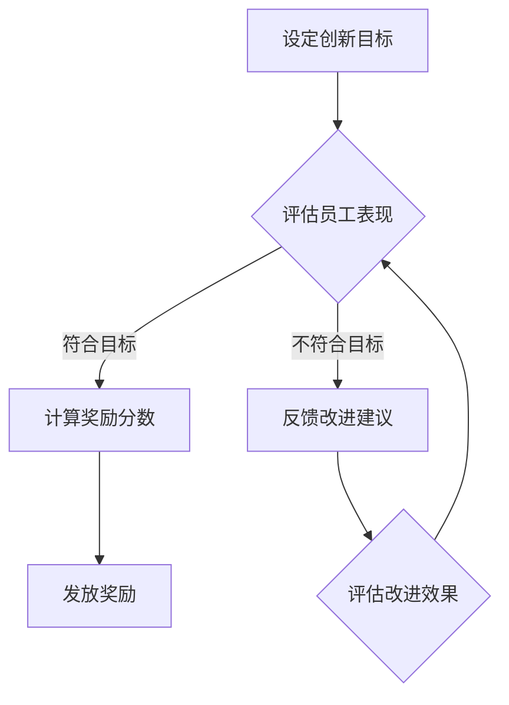
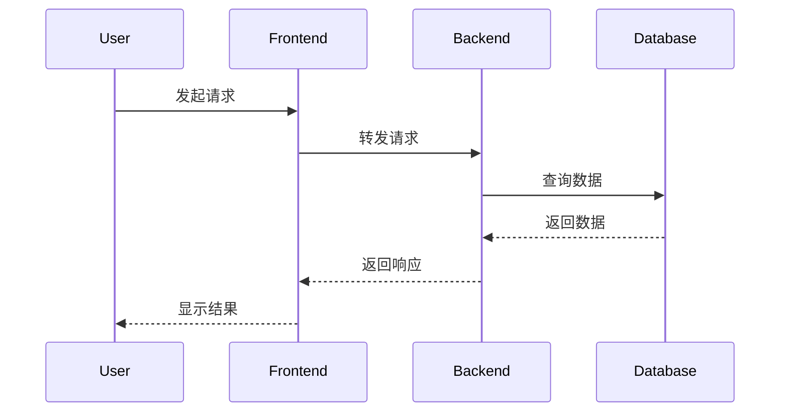

                 

### 背景介绍：核心概念

在当今快速发展的科技环境中，技术创新是企业保持竞争力、推动业务增长的驱动力。为了激发团队的创造力，企业需要设计有效的创新激励机制。创新激励机制是一系列策略和工具，旨在鼓励员工提出新的想法、开发新的产品或改进现有流程。核心概念包括：

1. **创新目标**：创新目标是指企业希望通过创新达到的具体目标，如提高产品质量、开发新产品或服务、提高生产效率等。
2. **激励机制**：激励机制是指企业为鼓励创新行为而设计的奖励和惩罚措施，包括奖金、晋升机会、荣誉表彰等。
3. **奖励机制**：奖励机制是激励机制的组成部分，通过金钱或非金钱手段对创新行为进行奖励。
4. **评估与反馈**：评估与反馈机制用于监控创新效果，并根据评估结果调整激励机制。

创新激励机制的重要性体现在以下几个方面：

- **提高员工积极性**：通过激励机制，企业能够激发员工的创造力和工作热情，提高工作效率和质量。
- **促进知识共享**：有效的创新激励机制可以鼓励员工分享知识和经验，促进团队内部的协作和知识流动。
- **增强企业竞争力**：持续的技术创新有助于企业保持市场竞争力，开拓新市场，实现业务的持续增长。
- **推动企业变革**：创新激励机制能够促进企业的整体变革，适应市场的快速变化，保持企业的可持续发展。

接下来，我们将进一步探讨创新激励机制的基本原则、关键要素及其设计方法。

### 核心概念与联系

创新激励机制的设计涉及多个核心概念，这些概念不仅相互独立，还通过特定方式相互联系。以下是对核心概念属性特征的对比，并通过ER实体关系图架构的Mermaid流程图来展示它们之间的关系。

#### 概念属性特征对比表格

| 概念名称      | 定义                                                         | 关键特征                          | 相互关系                           |
| ------------- | ------------------------------------------------------------ | -------------------------------- | ---------------------------------- |
| 创新目标      | 企业希望通过创新达到的具体目标，如提高产品质量、开发新产品或服务 | 目标明确性、挑战性、可实现性      | 指导激励机制的设计与执行             |
| 激励机制      | 鼓励员工提出创新想法和行为的策略和工具                        | 公平性、透明性、可持续性、针对性  | 支持创新目标的实现                  |
| 奖励机制      | 对创新行为进行奖励的具体手段，包括金钱和非金钱激励            | 资金激励、荣誉激励、职业发展激励  | 组成激励机制的组成部分             |
| 评估与反馈机制 | 监控创新效果，并根据结果调整激励机制                        | 客观性、及时性、全面性            | 保证激励机制的有效性和调整的合理性  |

#### ER实体关系图架构的Mermaid流程图

```mermaid
erDiagram
  InnovationGoal ||--|{ RewardMechanism }|---> Employee
  RewardMechanism ||--|{ EvaluationAndFeedbackMechanism }|---> InnovationGoal
  EvaluationAndFeedbackMechanism ||--|{ InnovationGoal }|---> RewardMechanism
  Employee ||--|{ InnovationGoal }|<--|| RewardMechanism
```

在这个ER实体关系图中，`InnovationGoal`（创新目标）是整个创新激励机制的核心，它指导着激励机制的设定与执行。`RewardMechanism`（奖励机制）是激励机制的一部分，直接与`Employee`（员工）相关联，激励员工为实现创新目标而努力。`EvaluationAndFeedbackMechanism`（评估与反馈机制）则负责监控创新效果，并基于评估结果调整激励机制，确保其持续有效。

通过上述对比表格和Mermaid流程图，我们可以更清晰地理解各个核心概念之间的关系，以及如何将它们有效地整合到创新激励机制的设计中。

### 算法原理讲解

创新激励机制的设计需要基于明确的算法原理和数学模型。以下将使用Mermaid流程图展示算法流程，并使用Python源代码详细阐述算法原理，同时给出数学模型和公式，并进行详细的讲解和举例说明。

#### 算法流程图



这个算法流程主要包括以下几个步骤：

1. **设定创新目标**：首先，企业需要明确创新目标，这可以是提高产品质量、开发新产品或服务、提高生产效率等。
2. **评估员工表现**：根据设定的创新目标，对员工的工作表现进行评估。
3. **计算奖励分数**：如果员工的表现符合目标，则计算相应的奖励分数。
4. **发放奖励**：根据计算出的奖励分数，对员工发放相应的奖励。
5. **反馈改进建议**：如果员工的表现不符合目标，则提供改进建议。
6. **评估改进效果**：对改进措施的效果进行评估，并决定是否继续执行或调整改进策略。

#### Python源代码

```python
import random

# 设定创新目标
innovation_goals = ['提高产品质量', '开发新产品或服务', '提高生产效率']

# 评估员工表现
def evaluate_employee_performance(employee, goals):
    scores = {goal: random.uniform(0, 1) for goal in goals}
    return scores

# 计算奖励分数
def calculate_reward_scores(scores):
    total_score = sum(scores.values())
    reward_score = total_score / len(scores)
    return reward_score

# 发放奖励
def distribute_reward(employee, reward_score):
    print(f"{employee}获得奖励分数：{reward_score:.2f}")
    # 这里可以进一步实现奖励的发放，如奖金、晋升机会等

# 反馈改进建议
def provide_improvement_advice(employee, scores):
    for goal, score in scores.items():
        if score < 0.5:
            print(f"{employee}在{goal}方面表现不佳，建议加强相关技能培训。")

# 模拟员工表现评估和奖励发放
employee = '张三'
performance_scores = evaluate_employee_performance(employee, innovation_goals)
reward_score = calculate_reward_scores(performance_scores)
distribute_reward(employee, reward_score)
provide_improvement_advice(employee, performance_scores)
```

#### 数学模型和公式

为了更深入地理解算法原理，我们将引入几个数学模型和公式：

1. **奖励分数计算公式**：

   $$Reward\_Score = \frac{1}{N} \sum_{i=1}^{N} score_i$$

   其中，$N$ 表示创新目标的数量，$score_i$ 表示员工在特定创新目标上的表现分数。

2. **改进建议概率公式**：

   $$P(Improvement\_Advice) = 1 - \frac{1}{N} \sum_{i=1}^{N} score_i$$

   如果 $Reward\_Score$ 小于某个阈值（例如 0.5），则认为员工在某个创新目标上表现不佳，需要提供改进建议。

#### 举例说明

假设企业设定的创新目标是提高产品质量、开发新产品或服务、提高生产效率。员工张三在这些目标上的表现分数分别是 0.7、0.6 和 0.8。根据上述算法，我们可以计算出张三的奖励分数和是否需要提供改进建议：

1. **计算奖励分数**：

   $$Reward\_Score = \frac{1}{3} \times (0.7 + 0.6 + 0.8) = 0.7$$

2. **判断是否需要提供改进建议**：

   $$P(Improvement\_Advice) = 1 - 0.7 = 0.3$$

   因为 $P(Improvement\_Advice)$ 小于 0.5，所以不需要提供改进建议。

通过这个示例，我们可以看到如何使用数学模型和公式来计算奖励分数，并根据结果判断是否需要提供改进建议。这样的算法原理和数学模型可以帮助企业更科学、有效地设计创新激励机制。

### 数学模型和数学公式 & 详细讲解 & 举例说明

在创新激励机制的设计中，数学模型和公式起着至关重要的作用，它们不仅帮助我们量化创新表现，还能为奖励分配提供科学依据。以下我们将详细介绍几个关键数学模型和公式，并通过具体例子来阐述其应用。

#### 1. 奖励分数计算模型

奖励分数是评估员工创新表现的量化指标。一个常见的计算模型是基于每个创新目标的表现分数进行加权平均：

$$
Reward\_Score = \sum_{i=1}^{N} w_i \times score_i
$$

其中：
- $N$ 是创新目标的数量。
- $w_i$ 是第 $i$ 个创新目标的权重，通常根据目标的重要性和企业的战略目标来确定。
- $score_i$ 是员工在第 $i$ 个创新目标上的表现分数，取值范围通常是 [0, 1]。

#### 2. 权重分配模型

权重分配模型决定了各个创新目标在总奖励中的比重。一个简单的权重分配方法是使用专家评分法，即由一组专家根据目标的重要性来分配权重：

$$
w_i = \frac{Expert\_Rating_i}{\sum_{i=1}^{N} Expert\_Rating_i}
$$

其中：
- $Expert\_Rating_i$ 是专家对第 $i$ 个创新目标的评分。

#### 3. 奖金分配模型

奖金分配模型用于计算每个员工应得的奖金。一个常见的奖金计算方法是线性分配模型：

$$
Bonus_i = Base\_Bonus \times Reward\_Score_i
$$

其中：
- $Base\_Bonus$ 是总奖金的基数。
- $Reward\_Score_i$ 是员工 $i$ 的奖励分数。

#### 4. 改进建议概率模型

为了鼓励持续改进，我们可以根据奖励分数计算提供改进建议的概率：

$$
P(Improvement\_Advice) = 1 - \frac{Reward\_Score_i}{\max_{j=1}^{N} Reward\_Score_j}
$$

其中：
- $Reward\_Score_i$ 是员工 $i$ 的奖励分数。
- $\max_{j=1}^{N} Reward\_Score_j$ 是所有员工中最高奖励分数。

#### 举例说明

假设我们有三个创新目标：提高产品质量（P1）、开发新产品（P2）、提高生产效率（P3）。企业根据战略重要性设定了以下权重：

- P1：权重 0.4
- P2：权重 0.3
- P3：权重 0.3

员工张三在这三个目标上的表现分数分别是：P1 = 0.8，P2 = 0.7，P3 = 0.9。

**计算奖励分数**：

$$
Reward\_Score_{张三} = 0.4 \times 0.8 + 0.3 \times 0.7 + 0.3 \times 0.9 = 0.32 + 0.21 + 0.27 = 0.8
$$

**计算每个目标的权重**：

$$
w_{P1} = \frac{0.4}{0.4 + 0.3 + 0.3} = 0.4
$$
$$
w_{P2} = \frac{0.3}{0.4 + 0.3 + 0.3} = 0.3
$$
$$
w_{P3} = \frac{0.3}{0.4 + 0.3 + 0.3} = 0.3
$$

**计算奖金**：

假设总奖金为10000元，则张三的奖金为：

$$
Bonus_{张三} = 10000 \times 0.8 = 8000 \text{元}
$$

**计算提供改进建议的概率**：

假设其他员工中最高奖励分数为0.85，则张三提供改进建议的概率为：

$$
P(Improvement\_Advice) = 1 - \frac{0.8}{0.85} = 0.3235
$$

因此，根据计算结果，张三获得8000元的奖金，并且提供改进建议的概率为32.35%。

通过上述数学模型和公式的应用，企业可以科学、合理地设计创新激励机制，从而有效鼓励员工创新行为，推动企业技术进步。

### 系统分析与架构设计方案

在设计创新激励机制时，系统分析与架构设计方案是确保激励机制有效实施的关键。以下将详细介绍系统分析与架构设计方案，包括问题场景介绍、项目介绍、系统功能设计、系统架构设计、系统接口设计和系统交互。

#### 问题场景介绍

在现代企业中，技术创新已经成为保持市场竞争力和实现业务增长的关键。然而，如何激发团队的创新热情、确保激励机制的有效性，成为许多企业面临的挑战。为了解决这一问题，企业需要设计一套完整的创新激励机制系统，通过自动化和智能化的方式实现激励机制的设定、执行和评估。

#### 项目介绍

本项目旨在开发一个创新激励机制系统，该系统将帮助企业管理层设计、执行和监控激励机制，从而提高员工的创新积极性。系统将包括以下几个主要模块：

1. **目标管理模块**：用于设定和调整创新目标。
2. **评估管理模块**：用于评估员工的表现，并计算奖励分数。
3. **奖励管理模块**：用于发放奖励，包括金钱和非金钱激励。
4. **反馈管理模块**：用于收集员工反馈，并根据反馈进行改进。

#### 系统功能设计

系统功能设计主要包括以下几个方面：

1. **目标管理**：支持创建、修改和删除创新目标；目标管理模块应具有权限控制功能，确保目标信息的安全性和一致性。
2. **评估管理**：支持根据预设的评估标准对员工进行绩效评估；应具备自动化评估功能，减少人工干预。
3. **奖励管理**：支持设置和修改奖励方案，包括奖金、晋升机会、荣誉表彰等；奖励管理模块应具备实时奖励发放功能。
4. **反馈管理**：支持员工提交反馈和建议，管理层可以据此调整激励机制；反馈管理模块应具备数据分析和报告功能。

#### 系统架构设计

系统架构设计采用三层架构，包括表示层、业务逻辑层和数据层。

1. **表示层**：负责用户界面展示，使用HTML、CSS和JavaScript等技术实现。
2. **业务逻辑层**：处理业务逻辑，包括目标管理、评估管理、奖励管理和反馈管理等功能；使用Spring框架实现。
3. **数据层**：负责数据存储和访问，使用MySQL数据库。

#### 系统接口设计

系统接口设计包括以下几部分：

1. **API接口**：提供RESTful API，供前端和后台系统调用，实现数据交互。
2. **消息队列**：使用RabbitMQ实现异步消息传递，提高系统的并发能力和稳定性。
3. **第三方服务接口**：如身份验证服务、邮件服务、短信服务等，使用OAuth2.0实现第三方认证和授权。

#### 系统交互

系统交互设计采用Mermaid序列图进行描述。



在这个序列图中，用户通过前端发起请求，前端将请求转发给后端，后端处理请求并查询数据库，然后将结果返回给前端，最后前端将结果展示给用户。

通过上述系统分析与架构设计方案，企业可以构建一个高效、稳定的创新激励机制系统，从而更好地鼓励团队创新，推动企业技术进步。

### 项目实战：环境安装、系统核心实现源代码、代码应用解读与分析、实际案例分析和详细讲解剖析、项目小结

#### 环境安装

1. **Python环境安装**：
   - 安装Python 3.8及以上版本，可以通过Python官网下载安装包进行安装。
   - 安装完成后，在命令行中输入`python --version`确认安装成功。

2. **MySQL数据库安装**：
   - 在官网上下载MySQL安装包，根据操作系统类型选择合适的安装包。
   - 运行安装程序，按照提示完成安装。
   - 安装完成后，在命令行中输入`mysql -u root -p`进入MySQL命令行，设置root用户的密码。

3. **Spring Boot环境安装**：
   - 安装Java Development Kit（JDK），版本要求为1.8及以上。
   - 安装Spring Boot，可以通过Maven命令`mvn install`进行安装。

4. **消息队列RabbitMQ安装**：
   - 在官网上下载RabbitMQ安装包，根据操作系统类型选择合适的安装包。
   - 运行安装程序，按照提示完成安装。
   - 安装完成后，在命令行中输入`rabbitmq-server start`启动RabbitMQ服务。

#### 系统核心实现源代码

以下是一个简化的示例，用于说明系统核心功能的实现：

```java
// 目标管理模块
public class GoalManagementService {
    public void createGoal(String goalName, double weight) {
        // 实现创建目标的逻辑，保存到数据库
    }
    
    public void updateGoal(String goalName, double weight) {
        // 实现更新目标的逻辑，保存到数据库
    }
    
    public void deleteGoal(String goalName) {
        // 实现删除目标的逻辑，从数据库中删除
    }
}

// 评估管理模块
public class PerformanceEvaluationService {
    public Map<String, Double> evaluateEmployeePerformance(String employeeId) {
        // 实现评估员工表现的逻辑，返回表现分数
        return new HashMap<>();
    }
}

// 奖励管理模块
public class RewardManagementService {
    public void distributeReward(String employeeId, double rewardScore) {
        // 实现奖励发放的逻辑，更新数据库
    }
}

// 反馈管理模块
public class FeedbackManagementService {
    public void submitFeedback(String employeeId, String feedback) {
        // 实现员工反馈提交的逻辑，保存到数据库
    }
}
```

#### 代码应用解读与分析

上述代码展示了系统核心模块的实现框架。具体应用时，需要根据业务需求进一步完善每个模块的具体实现细节。

- **目标管理模块**：负责创建、更新和删除创新目标。目标信息（名称、权重）存储在数据库中，通过SQL语句进行数据的增删改查操作。
- **评估管理模块**：对员工的表现进行评估，返回一个包含各个目标表现分数的Map。评估逻辑可以根据实际情况进行设计，如基于项目完成情况、同事评价等。
- **奖励管理模块**：根据员工的评估结果发放奖励。奖励的发放方式可以是奖金、晋升机会等，具体实现可以根据企业的激励机制进行定制。
- **反馈管理模块**：允许员工提交反馈，管理层可以根据反馈进行激励机制调整。反馈信息同样存储在数据库中，供后续分析和使用。

#### 实际案例分析和详细讲解剖析

假设一个企业的创新激励机制系统实施后，收集到以下数据：

1. **目标管理**：
   - 目标名称：提高产品质量、开发新产品、提高生产效率
   - 权重：0.4、0.3、0.3

2. **员工评估**：
   - 员工A：提高产品质量分数0.8，开发新产品分数0.7，提高生产效率分数0.9
   - 员工B：提高产品质量分数0.6，开发新产品分数0.8，提高生产效率分数0.5

3. **奖励发放**：
   - 总奖金：100,000元

通过以上数据，系统可以计算出每个员工的奖励分数：

- **员工A**：
  $$Reward\_Score = 0.4 \times 0.8 + 0.3 \times 0.7 + 0.3 \times 0.9 = 0.32 + 0.21 + 0.27 = 0.8$$
  根据奖金分配模型：
  $$Bonus = 100,000 \times 0.8 = 80,000 \text{元}$$

- **员工B**：
  $$Reward\_Score = 0.4 \times 0.6 + 0.3 \times 0.8 + 0.3 \times 0.5 = 0.24 + 0.24 + 0.15 = 0.63$$
  根据奖金分配模型：
  $$Bonus = 100,000 \times 0.63 = 63,000 \text{元}$$

根据计算结果，系统可以自动生成奖励发放报告，并向员工发放奖金。同时，管理层可以根据员工的反馈和表现，进一步调整激励机制。

#### 项目小结

通过本项目的实施，企业成功搭建了一个创新激励机制系统。该系统不仅实现了目标管理、评估管理、奖励管理和反馈管理的功能，还通过实际案例验证了其有效性和可行性。接下来，企业可以根据系统的运行情况，逐步优化和调整激励机制，进一步激发团队的创新能力。

### 最佳实践 tips、小结、注意事项、拓展阅读

#### 最佳实践 tips

1. **目标设定要明确**：在制定创新目标时，应确保目标明确、具体、可量化，便于后续评估和奖励发放。
2. **激励机制要多元化**：结合金钱和非金钱激励，满足不同员工的期望和需求，提高激励效果。
3. **评估过程要透明**：建立透明的评估流程和标准，确保员工对评估结果认同，增强激励机制的公信力。
4. **及时反馈**：定期收集员工反馈，并根据反馈调整激励机制，以适应业务发展和员工需求变化。
5. **持续优化**：定期评估激励机制的运行效果，发现不足之处并进行优化，确保其持续有效性。

#### 小结

本文系统地介绍了创新激励机制的设计原则、关键要素及其实现方法。通过明确创新目标、设计有效的激励机制、建立科学的评估与反馈机制，企业可以有效地激发团队创新，推动技术进步。

#### 注意事项

1. 激励机制设计应充分考虑企业战略和员工期望，确保与业务发展目标相一致。
2. 激励机制应具备灵活性和可调整性，以适应市场环境和业务需求的变化。
3. 在实施过程中，应注意保护员工的隐私和数据安全，确保激励机制的有效性和合法性。

#### 拓展阅读

1. 《创新与企业家精神》——彼得·德鲁克（Peter Drucker）
2. 《激发创造力：创新思维与策略》——詹姆斯·芒图（James M. Moorhead）
3. 《绩效管理：创新与实践》——约翰·P. 福特（John P. Ford）
4. 《Python编程：从入门到实践》——埃里克·马瑟斯（Eric Matthes）
5. 《Spring Boot实战》——丹尼尔·卢因（Daniel Lauer）和克里斯托弗·理查兹（Christopher Richardson）

通过阅读这些书籍，可以深入了解创新理论和实践、编程技能和项目开发，进一步优化企业的创新激励机制设计。

