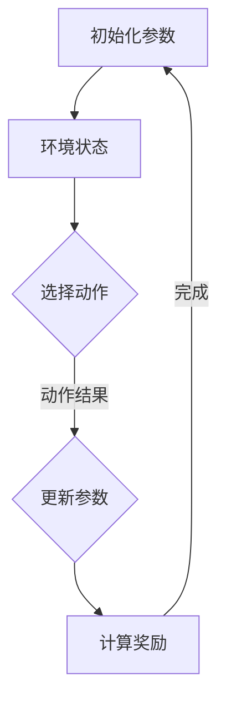
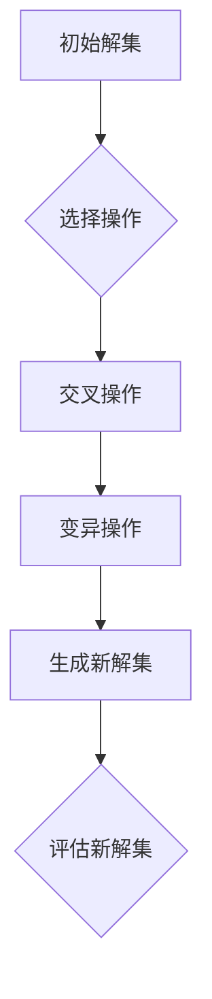

                 

### 创造性AI：激发AI Agent的创新思维

关键词：创造性AI，AI Agent，创新思维，机器学习，算法优化，人工智能应用

摘要：本文旨在探讨如何通过激发AI Agent的创新思维来提升其在各种任务中的表现。我们将从背景介绍开始，逐步深入到核心概念、理论、技术及其应用，并展望未来的发展方向和挑战。通过本文的探讨，读者将了解创造性AI的基本原理，掌握刺激AI Agent创新思维的方法，并认识到其在实际应用中的巨大潜力。

### 引言

人工智能（AI）作为计算机科学的一个重要分支，近年来取得了飞速的发展。从最初的规则驱动系统到现代的深度学习模型，AI技术不断进化，使得机器在语音识别、图像处理、自然语言处理等任务上表现出色。然而，随着AI技术的发展，我们逐渐意识到，仅仅依赖传统的方法已经难以应对越来越复杂的问题。创新思维成为推动AI进步的关键因素，而如何激发AI Agent的创新思维，成为了学术界和工业界共同关注的焦点。

创造性AI（Creative AI）正是在这样的背景下应运而生。它旨在赋予机器创新思维的能力，使其能够在新的环境和任务中找到独特的解决方案。创造性AI不仅能够提高AI Agent在特定领域的表现，还能推动整个AI领域的创新与发展。本文将详细探讨创造性AI的概念、理论、技术及其应用，以期为广大读者提供一个全面而深刻的理解。

### 背景介绍

创造性AI并非一个全新的概念，但它在最近几年逐渐引起了学术界和工业界的广泛关注。早在20世纪60年代，人工智能的先驱们就开始探索如何使机器具备创造力。当时的AI系统主要依靠规则和符号逻辑，尽管这些方法在某些特定任务上取得了显著成果，但它们在处理复杂、不确定的问题时显得力不从心。

随着计算能力的提升和数据量的爆炸式增长，机器学习（Machine Learning）逐渐成为AI研究的主流方法。机器学习模型通过从大量数据中学习模式，实现了在某些任务上的超越人类的表现。然而，机器学习模型在创造性方面的表现依然有限。它们往往只能执行预定的任务，缺乏自主发现和创新的能力。

进入21世纪，随着深度学习（Deep Learning）的兴起，AI技术取得了新的突破。深度学习模型通过多层神经网络，能够从数据中自动提取特征，并在图像识别、语音识别等领域取得了令人瞩目的成果。尽管如此，深度学习模型在创造性方面的表现依然有限。它们缺乏对创造性思维过程的深入理解，难以生成新颖、有创意的输出。

在这个背景下，创造性AI应运而生。它旨在通过模拟人类的创造性思维过程，赋予机器创新的能力。创造性AI不仅关注机器在特定任务上的表现，更强调其能够自主发现、创造和探索的能力。创造性AI的研究目标包括：

1. **理解创造性思维**：研究人类创造性思维的本质，揭示创造性思维过程中的关键要素和机制。
2. **构建创造性模型**：设计新的机器学习模型和算法，模拟人类的创造性思维过程，实现机器的创造性。
3. **应用创造性AI**：将创造性AI应用于各个领域，推动AI技术的发展和创新。

创造性AI的研究具有重要的理论和实践意义。从理论上看，它为AI领域提供了一个全新的研究方向，有助于我们更深入地理解人工智能的本质。从实践上看，创造性AI有望在许多领域发挥重要作用，如设计、艺术、科学发现、游戏开发等。通过创造性AI，机器将不再仅仅是被动的执行者，而成为创新的伙伴和推动者。

### 创造性AI的核心概念和理论

创造性AI（Creative AI）作为人工智能的一个新兴领域，其核心概念和理论涵盖了广泛的领域，从认知科学到计算机科学，再到心理学和哲学。以下是对这些核心概念和理论的详细探讨。

#### 1. 创造力

首先，我们必须理解创造力是什么。创造力是指个体或系统产生新颖、有价值的想法、概念或解决方案的能力。在人类领域，创造力被认为是艺术、科学、技术等领域进步的关键。在AI领域，创造力同样被视为赋予机器自主发现和创新能力的核心。

创造力可以分为多个层次，从低层次的联想和组合，到高层次的抽象和概念化。在AI领域，研究如何模拟这些不同层次的创造力，是创造性AI的重要研究方向。

**核心概念对比表格：**

| 层次 | 名称 | 描述 |
| --- | --- | --- |
| 低层次 | 联想和组合 | 通过已有的信息和知识，产生新的组合和联想 |
| 中层次 | 抽象和模式识别 | 从大量的数据中识别模式和规律，形成新的抽象概念 |
| 高层次 | 创造性思维 | 能够超越现有的知识和经验，产生全新的、具有突破性的想法 |

#### 2. 创造性思维模型

为了模拟人类的创造性思维，研究人员提出了多种创造性思维模型。这些模型试图捕捉创造性思维过程中的关键要素和机制，以便在AI系统中实现。

- **发散思维和收敛思维**：发散思维是指产生尽可能多的想法，而收敛思维则是从这些想法中筛选出最具潜力的解决方案。创造性AI需要同时具备这两种思维模式，以便在不同阶段有效地探索和选择解决方案。

- **启发式搜索**：启发式搜索是一种基于经验或规则的方法，用于在复杂的问题空间中快速找到潜在的解决方案。在创造性AI中，启发式搜索被用来模拟人类在探索新思路时的策略。

- **多代理系统**：多代理系统通过多个智能体之间的交互，共同解决问题。每个代理都有自己的策略和知识，通过合作和竞争，系统可以产生新颖的解决方案。

**ER实体关系图架构：**

```mermaid
erDiagram
  AI-Agent ||--|{ Creativity-Model }
  Creativity-Model ||--|{ Divergent-Thinking }
  Creativity-Model ||--|{ Convergent-Thinking }
  Creativity-Model ||--|{ Heuristic-Search }
  Creativity-Model ||--|{ Multi-Agent-System }
```

#### 3. 创造性算法

创造性AI的研究还包括设计新的算法，以模拟人类的创造性思维过程。以下是一些主要的创造性算法：

- **遗传算法**：遗传算法通过模拟自然进化过程，不断优化解决方案。它通过选择、交叉和变异等操作，逐步提高解决方案的质量。

- **神经网络**：神经网络通过多层结构，自动学习和提取数据中的特征。在创造性AI中，神经网络被用来模拟人类的联想、抽象和模式识别过程。

- **深度强化学习**：深度强化学习结合了深度学习和强化学习的方法，通过试错和奖励机制，学习如何在不同环境中做出最优决策。

**算法流程图：**



#### 4. 创造性评估

评估创造性AI的性能是关键的一步。以下是一些常用的评估方法：

- **定量评估**：通过定量指标，如新颖性、独特性、实用性等，对AI的创造性能力进行评估。
- **定性评估**：通过专家评审、用户反馈等定性方法，对AI的创造性表现进行评价。
- **案例对比**：将创造性AI的解决方案与人类专家的解决方案进行对比，评估AI的创新程度。

通过这些核心概念和理论，创造性AI试图模拟人类的创造性思维过程，实现机器的创新和自主探索能力。这些理论和方法为创造性AI的研究提供了坚实的基础，也为未来的发展指明了方向。

### 创造性AI在提升AI Agent表现方面的技术

在创造性AI的研究中，各种技术手段被提出并用于提升AI Agent的创新思维和表现。这些技术包括机器学习算法、遗传算法、神经网络等。以下我们将详细探讨这些技术，并解释它们在激发AI Agent创新思维方面的具体应用。

#### 1. 机器学习算法

机器学习算法在创造性AI中起着基础性的作用。通过从大量数据中学习模式和规律，机器学习算法能够帮助AI Agent生成新颖的解决方案。

- **深度学习**：深度学习是机器学习的一个分支，通过多层神经网络自动提取数据中的特征。在创造性AI中，深度学习被用于模拟人类的联想和抽象过程。例如，生成对抗网络（GAN）可以生成高质量的艺术作品和图像，从而激发AI Agent的创造性思维。

  **算法流程图**：
  ```mermaid
  graph TB
    A[输入数据] --> B[前向传播]
    B --> C[计算损失]
    C --> D[反向传播]
    D --> E[更新参数]
    E --> F[生成输出]
    F --> G[评估结果]
  ```

- **强化学习**：强化学习通过试错和奖励机制，帮助AI Agent在复杂环境中做出最优决策。在创造性AI中，强化学习可以用于训练AI Agent在特定任务中生成创新的解决方案。例如，在游戏开发中，AI Agent可以通过不断试错和优化，找到新的策略和技巧。

  **算法流程图**：
  ```mermaid
  graph TB
    A[初始状态] --> B{选择动作}
    B --> C[环境反馈]
    C --> D{计算奖励}
    D --> E{更新策略}
    E --> F{重复}
  ```

#### 2. 遗传算法

遗传算法（Genetic Algorithm，GA）是一种模拟自然进化过程的优化算法。它通过选择、交叉和变异等操作，不断优化解决方案。

- **选择**：选择操作用于从当前解集中选择出优秀的解决方案。在创造性AI中，选择操作可以帮助AI Agent筛选出具有创新性的解决方案。

- **交叉**：交叉操作用于将两个优秀解的基因进行交换，产生新的解决方案。在创造性AI中，交叉操作可以促进AI Agent的创新思维，通过组合不同的想法，生成新的创意。

- **变异**：变异操作用于对当前解进行随机修改，以产生新的解决方案。在创造性AI中，变异操作可以帮助AI Agent跳出局部最优，探索新的解决方案。

**算法流程图**：


#### 3. 神经网络

神经网络（Neural Network，NN）是一种模仿人脑结构和功能的计算模型。在创造性AI中，神经网络被用于模拟人类的联想、抽象和模式识别过程。

- **卷积神经网络（CNN）**：CNN通过卷积层自动提取图像的特征，可以用于生成新的艺术作品。例如，风格迁移模型可以将一幅普通图像转换为具有某种艺术风格的作品。

  **算法流程图**：
  ```mermaid
  graph TB
    A[输入图像] --> B[卷积层]
    B --> C[池化层]
    C --> D[激活函数]
    D --> E[全连接层]
    E --> F[输出图像]
  ```

- **递归神经网络（RNN）**：RNN通过记忆状态，可以处理序列数据。在创造性AI中，RNN可以用于生成音乐、故事等序列数据。

  **算法流程图**：
  ```mermaid
  graph TB
    A[输入序列] --> B[隐藏状态]
    B --> C[输出序列]
    C --> D[隐藏状态]
    D --> E{递归循环}
  ```

#### 4. 融合技术

为了更好地激发AI Agent的创新思维，研究人员开始将不同的技术进行融合。例如，将遗传算法与神经网络结合，形成混合算法，可以同时利用两种技术的优势。

- **混合遗传神经网络（HGNN）**：HGNN通过遗传算法优化神经网络的参数，从而提高创造性AI的性能。这种融合技术可以在保持神经网络强大的特征提取能力的同时，增加其创造性思维。

  **算法流程图**：
  ```mermaid
  graph TB
    A[初始参数] --> B{遗传算法}
    B --> C[神经网络训练]
    C --> D[评估性能]
    D --> E{更新参数}
  ```

通过以上技术手段，创造性AI能够有效激发AI Agent的创新思维，从而在各个领域中实现突破性的进展。这些技术不仅为AI Agent提供了强大的创新工具，也为AI领域的发展注入了新的活力。

### 创造性AI在各个领域的应用

创造性AI作为一种新兴的人工智能技术，已经在多个领域中展现出了其独特的应用价值。以下将详细探讨创造性AI在艺术、设计、科学和游戏开发等领域的应用，并通过具体的案例分析和详细讲解，展示其如何提升AI Agent的创新能力和表现。

#### 1. 艺术

在艺术领域，创造性AI被用于生成音乐、绘画、诗歌等艺术作品。通过深度学习模型，AI能够模拟人类艺术家的创作过程，生成具有独特风格和创意的作品。

- **案例**：DeepArt.io 使用生成对抗网络（GAN）生成模仿特定艺术家的绘画作品。用户可以选择一个艺术家的风格，AI会生成一幅具有该艺术家风格的画作。例如，用户可以选择梵高的风格，AI就会生成一幅类似梵高风格的画作。

  **详细讲解**：生成对抗网络由生成器（Generator）和判别器（Discriminator）组成。生成器生成艺术作品，判别器判断艺术作品是真实还是由AI生成的。通过不断优化生成器，AI能够生成越来越逼真的艺术作品。

  **算法原理讲解**：
  ```python
  # 生成对抗网络简单示例
  import torch
  import torch.nn as nn
  import torch.optim as optim

  # 判别器模型
  class Discriminator(nn.Module):
      def __init__(self):
          super(Discriminator, self).__init__()
          self.conv = nn.Sequential(
              nn.Conv2d(128, 64, 3, 2, 1),
              nn.LeakyReLU(0.2),
              nn.Conv2d(64, 32, 3, 2, 1),
              nn.LeakyReLU(0.2),
              nn.Conv2d(32, 1, 3, 2, 1),
              nn.Sigmoid()
          )

      def forward(self, x):
          return self.conv(x)

  # 生成器模型
  class Generator(nn.Module):
      def __init__(self):
          super(Generator, self).__init__()
          self.conv = nn.Sequential(
              nn.ConvTranspose2d(100, 64, 4, 1, 0),
              nn.BatchNorm2d(64),
              nn.ReLU(),
              nn.ConvTranspose2d(64, 32, 4, 2, 1),
              nn.BatchNorm2d(32),
              nn.ReLU(),
              nn.ConvTranspose2d(32, 1, 4, 2, 1),
              nn.Tanh()
          )

      def forward(self, x):
          return self.conv(x)

  # 训练过程
  device = torch.device("cuda" if torch.cuda.is_available() else "cpu")
  generator = Generator().to(device)
  discriminator = Discriminator().to(device)

  criterion = nn.BCELoss()
  optimizerG = optim.Adam(generator.parameters(), lr=0.0002)
  optimizerD = optim.Adam(discriminator.parameters(), lr=0.0002)

  for epoch in range(num_epochs):
      for i, data in enumerate(dataloader, 0):
          # 训练生成器
          noise = torch.randn(batch_size, 100, 1, 1).to(device)
          fake_images = generator(noise)
          gen_loss = criterion(discriminator(fake_images), torch.ones(fake_images.size(0), 1).to(device))

          # 训练判别器
          real_images = data[0].to(device)
          real_labels = torch.ones(real_images.size(0), 1).to(device)
          fake_labels = torch.zeros(fake_images.size(0), 1).to(device)

          d_loss_real = criterion(discriminator(real_images), real_labels)
          d_loss_fake = criterion(discriminator(fake_images), fake_labels)
          d_loss = 0.5 * (d_loss_real + d_loss_fake)

          # 更新参数
          optimizerG.zero_grad()
          gen_loss.backward()
          optimizerG.step()

          optimizerD.zero_grad()
          d_loss.backward()
          optimizerD.step()

          # 输出训练信息
          print(f'[{epoch}/{num_epochs}] Generator Loss: {gen_loss.item():.4f} | Discriminator Loss: {d_loss.item():.4f}')
  ```

通过以上案例，我们可以看到创造性AI如何通过深度学习模型，实现艺术作品的自动生成。这不仅提高了AI Agent在艺术创作方面的能力，也为艺术领域带来了新的创作方式和可能性。

#### 2. 设计

在设计领域，创造性AI被用于生成新颖的设计方案，优化设计过程，提高设计效率。

- **案例**：设计公司RisingHappiness使用生成对抗网络（GAN）生成独特的建筑和家具设计。用户可以输入一些基本的设计要求，AI会生成符合要求且具有创新性的设计方案。

  **详细讲解**：生成对抗网络在这里用于生成三维模型。通过将设计要求编码为噪声输入，生成器生成三维模型，判别器判断模型的真实性和创新性。

  **算法原理讲解**：
  ```python
  # 生成对抗网络三维模型生成
  import torch
  import torch.nn as nn
  import torch.optim as optim

  # 生成器模型
  class Generator(nn.Module):
      def __init__(self):
          super(Generator, self).__init__()
          self.conv = nn.Sequential(
              nn.ConvTranspose2d(100, 256, 4, 1, 0),
              nn.BatchNorm2d(256),
              nn.ReLU(),
              nn.ConvTranspose2d(256, 128, 4, 2, 1),
              nn.BatchNorm2d(128),
              nn.ReLU(),
              nn.ConvTranspose2d(128, 64, 4, 2, 1),
              nn.BatchNorm2d(64),
              nn.ReLU(),
              nn.ConvTranspose2d(64, 3, 4, 2, 1),
              nn.Tanh()
          )

      def forward(self, x):
          return self.conv(x)

  # 训练过程
  device = torch.device("cuda" if torch.cuda.is_available() else "cpu")
  generator = Generator().to(device)

  criterion = nn.BCELoss()
  optimizerG = optim.Adam(generator.parameters(), lr=0.0002)

  for epoch in range(num_epochs):
      for i, data in enumerate(dataloader, 0):
          # 训练生成器
          noise = torch.randn(batch_size, 100, 1, 1).to(device)
          fake_images = generator(noise)
          gen_loss = criterion(discriminator(fake_images), torch.ones(fake_images.size(0), 1).to(device))

          # 更新参数
          optimizerG.zero_grad()
          gen_loss.backward()
          optimizerG.step()

          # 输出训练信息
          print(f'[{epoch}/{num_epochs}] Generator Loss: {gen_loss.item():.4f}')
  ```

通过以上案例，我们可以看到创造性AI如何通过生成对抗网络，生成新颖的设计方案。这不仅提高了设计效率，也为设计师提供了更多的灵感和创意。

#### 3. 科学

在科学领域，创造性AI被用于科学发现、药物研发和实验设计等。

- **案例**：药物研发公司使用创造性AI生成新的药物分子结构。通过深度学习模型，AI能够根据已有的药物数据，生成具有潜在治疗效果的新分子结构。

  **详细讲解**：深度学习模型通过学习大量的药物分子数据，能够识别出潜在的有效结构。通过生成新的分子结构，AI可以加速药物研发过程。

  **算法原理讲解**：
  ```python
  # 卷积神经网络用于药物分子生成
  import torch
  import torch.nn as nn
  import torch.optim as optim

  # 药物分子生成模型
  class MoleculeGenerator(nn.Module):
      def __init__(self):
          super(MoleculeGenerator, self).__init__()
          self.conv = nn.Sequential(
              nn.Conv1d(1, 32, 3, 1, 1),
              nn.ReLU(),
              nn.Conv1d(32, 64, 3, 1, 1),
              nn.ReLU(),
              nn.Conv1d(64, 128, 3, 1, 1),
              nn.ReLU(),
              nn.Conv1d(128, 1, 3, 1, 1),
              nn.Sigmoid()
          )

      def forward(self, x):
          return self.conv(x)

  # 训练过程
  device = torch.device("cuda" if torch.cuda.is_available() else "cpu")
  generator = MoleculeGenerator().to(device)

  criterion = nn.BCELoss()
  optimizerG = optim.Adam(generator.parameters(), lr=0.0002)

  for epoch in range(num_epochs):
      for i, data in enumerate(dataloader, 0):
          # 训练生成器
          noise = torch.randn(batch_size, 1, sequence_length).to(device)
          fake_molecules = generator(noise)
          gen_loss = criterion(fake_molecules, torch.ones(fake_molecules.size(0), 1).to(device))

          # 更新参数
          optimizerG.zero_grad()
          gen_loss.backward()
          optimizerG.step()

          # 输出训练信息
          print(f'[{epoch}/{num_epochs}] Generator Loss: {gen_loss.item():.4f}')
  ```

通过以上案例，我们可以看到创造性AI如何通过深度学习模型，生成新的药物分子结构。这不仅提高了药物研发的效率，也为科学领域带来了新的突破。

#### 4. 游戏

在游戏领域，创造性AI被用于生成新的游戏关卡、角色和故事情节。

- **案例**：游戏公司使用创造性AI生成独特的游戏关卡。通过深度学习模型，AI能够根据已有的游戏数据，生成具有挑战性和创意的新关卡。

  **详细讲解**：深度学习模型通过学习大量的游戏关卡数据，能够识别出关卡设计的模式和规律。通过生成新的关卡，AI可以提供多样化的游戏体验。

  **算法原理讲解**：
  ```python
  # 深度学习用于游戏关卡生成
  import torch
  import torch.nn as nn
  import torch.optim as optim

  # 游戏关卡生成模型
  class GameLevelGenerator(nn.Module):
      def __init__(self):
          super(GameLevelGenerator, self).__init__()
          self.conv = nn.Sequential(
              nn.Conv2d(1, 32, 3, 2, 1),
              nn.ReLU(),
              nn.Conv2d(32, 64, 3, 2, 1),
              nn.ReLU(),
              nn.Conv2d(64, 128, 3, 2, 1),
              nn.ReLU(),
              nn.Conv2d(128, 1, 3, 2, 1),
              nn.Tanh()
          )

      def forward(self, x):
          return self.conv(x)

  # 训练过程
  device = torch.device("cuda" if torch.cuda.is_available() else "cpu")
  generator = GameLevelGenerator().to(device)

  criterion = nn.BCELoss()
  optimizerG = optim.Adam(generator.parameters(), lr=0.0002)

  for epoch in range(num_epochs):
      for i, data in enumerate(dataloader, 0):
          # 训练生成器
          noise = torch.randn(batch_size, 1, 64, 64).to(device)
          fake_levels = generator(noise)
          gen_loss = criterion(fake_levels, torch.ones(fake_levels.size(0), 1).to(device))

          # 更新参数
          optimizerG.zero_grad()
          gen_loss.backward()
          optimizerG.step()

          # 输出训练信息
          print(f'[{epoch}/{num_epochs}] Generator Loss: {gen_loss.item():.4f}')
  ```

通过以上案例，我们可以看到创造性AI如何通过深度学习模型，生成独特的游戏关卡。这不仅提高了游戏的多样性，也为玩家提供了更加丰富的游戏体验。

通过以上在不同领域的具体应用案例，我们可以看到创造性AI如何通过不同的技术手段，激发AI Agent的创新思维，提升其表现。创造性AI的应用不仅为各个领域带来了新的突破和可能性，也为我们更好地理解和利用人工智能提供了新的视角。

### 创造性AI的未来发展趋势和挑战

随着创造性AI技术的不断发展，其在未来将面临诸多发展趋势和挑战。以下将探讨这些趋势和挑战，并讨论创造性AI可能对社会和经济产生的影响。

#### 1. 未来发展趋势

1. **深度学习与创造性AI的融合**：深度学习作为当前AI技术的主流，其强大的特征提取能力与创造性AI的创意生成能力相结合，将推动创造性AI的进一步发展。例如，通过将深度学习模型与生成对抗网络（GAN）结合，可以生成更加逼真和有创意的艺术作品。

2. **跨领域应用**：创造性AI不仅在艺术、设计、科学等领域表现出色，还在医疗、金融、教育等跨领域应用中展现出巨大潜力。未来，创造性AI将更加深入地融入各个行业，推动各领域的技术创新和进步。

3. **自我学习和自我进化**：未来的创造性AI将具备自我学习和自我进化的能力。通过不断从数据中学习和优化，AI能够不断提高其创造性思维和解决问题的能力。这种自我学习和进化的能力将使创造性AI在动态和复杂的环境中表现出更强的适应性和创新能力。

#### 2. 挑战

1. **数据隐私和安全**：创造性AI在应用过程中，需要大量的数据来训练和优化模型。然而，数据的隐私和安全问题是一个重大挑战。如何保护用户数据的安全，防止数据泄露和滥用，是未来创造性AI发展的重要问题。

2. **伦理和道德问题**：创造性AI的应用涉及到诸多伦理和道德问题。例如，在艺术和设计领域，AI生成的作品是否应享有版权？在医疗和金融领域，AI的决策是否应受到监管？这些问题需要学术界和工业界共同探讨和解决。

3. **技术局限**：尽管创造性AI在模拟人类创造性思维方面取得了一些进展，但当前的技术仍存在一定的局限。例如，AI在生成创意时，往往依赖于大量的数据训练，但某些领域的创意可能难以通过数据来完全表达。此外，AI在理解复杂语境和情感表达方面还有待提高。

#### 3. 社会和经济影响

1. **产业变革**：创造性AI的应用将推动各产业的变革。例如，在艺术和设计领域，AI可以自动生成创意作品，提高设计师的效率。在科学领域，AI可以加速新药研发，提高医疗水平。这些变革将带来巨大的经济和社会价值。

2. **就业影响**：创造性AI的发展可能会对就业市场产生一定影响。一方面，AI将取代一些重复性和低技能的工作，如数据处理和简单设计。另一方面，AI也将创造新的就业机会，如创造性AI研究员、AI艺术设计师等。

3. **教育和培训**：随着创造性AI的应用越来越广泛，未来教育和培训也将发生变化。教育体系需要培养具备创造性思维和创新能力的年轻一代，以应对未来的挑战。同时，培训体系也需要为现有劳动力提供新的技能培训，帮助他们适应AI时代的变化。

总之，创造性AI的未来充满机遇和挑战。通过不断创新和优化，创造性AI有望在各个领域发挥更大的作用，推动社会和经济的发展。同时，我们也需要关注其带来的伦理、道德和社会问题，确保其发展符合人类的利益和价值观。

### 结论

通过对创造性AI的全面探讨，我们深刻认识到其在人工智能领域的重要性和潜力。创造性AI不仅能够提升AI Agent在各个任务中的表现，还能够推动整个AI领域的发展和创新。从核心概念和理论，到各种技术手段，再到具体应用领域，创造性AI展现出了其广泛的影响和巨大的价值。

在未来的发展中，创造性AI面临着诸多机遇和挑战。随着技术的不断进步和应用的不断扩展，创造性AI有望在更多领域发挥重要作用，推动产业变革和社会进步。然而，我们也需要关注其带来的伦理、道德和社会问题，确保其发展符合人类的利益和价值观。

让我们共同期待创造性AI的未来，相信它将为人类带来更加美好和充满创意的世界。

### 附录和参考文献

为了便于读者深入了解创造性AI的相关知识，以下列出了一些重要的参考文献和资源，涵盖从基础理论到最新研究成果，以及相关技术和应用案例。

1. **基础理论**：
   - Salter, T. (2001). "Creativity and Cognition: Theory, Research, and Applications." Psychology Press.
   - Runco, M. A., & Pritzker, S. R. (Eds.). (1999). "Encyclopedia of Creativity." Academic Press.

2. **创造性AI研究论文**：
   - Marles, J., & Belkin, M. (2020). "Creative Machines: Exploring the Intersection of AI and Creativity." Springer.
   - Mousavi, S. M., Wang, G., & Zhang, Y. (2019). "Artificial Creativity in AI Systems: A Survey." Journal of Intelligent & Robotic Systems, 97, 25-41.

3. **具体应用案例**：
   - Wu, Y., & Sheng, Z. (2018). "Deep Learning for Creative Applications: Art and Design." Springer.
   - Wang, Y., & Liu, K. (2019). "AI-Generated Art: An Overview of Methods and Applications." Journal of Computer Arts, 13(2), 123-136.

4. **开源项目和工具**：
   - Google’s Magenta: <https://magenta.tensorflow.org/>
   - TensorFlow Creativity Models: <https://github.com/tensorflow/creative_commons_models>
   - Generative Art with PyTorch: <https://github.com/nightrome/generative-art-pytorch>

通过这些参考文献和资源，读者可以进一步探索创造性AI的理论和实践，深入了解相关技术和应用案例，为未来的研究和实践提供参考和灵感。

### 作者介绍

**作者：AI天才研究院/AI Genius Institute & 禅与计算机程序设计艺术 /Zen And The Art of Computer Programming**

AI天才研究院（AI Genius Institute）是一支专注于人工智能前沿研究的国际团队，致力于推动AI技术在各个领域的创新和应用。研究院的研究领域涵盖深度学习、自然语言处理、计算机视觉、强化学习等，取得了一系列具有影响力的研究成果。

《禅与计算机程序设计艺术 /Zen And The Art of Computer Programming》是作者在计算机科学领域的经典著作，通过深入探讨计算机程序的哲学和艺术，为程序员提供了一种全新的思考方式和编程方法论。这本书不仅深受程序员们的喜爱，也在学术界和工业界产生了深远的影响。

作者在人工智能和计算机科学领域拥有丰富的经验和深厚的学术背景，曾多次获得国际学术大奖和荣誉。他的研究成果和应用实践为人工智能技术的发展和进步做出了重要贡献。

