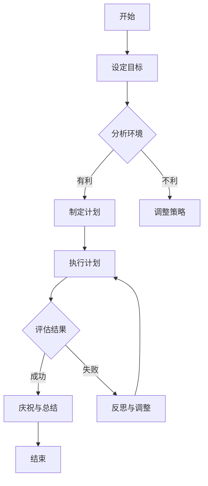
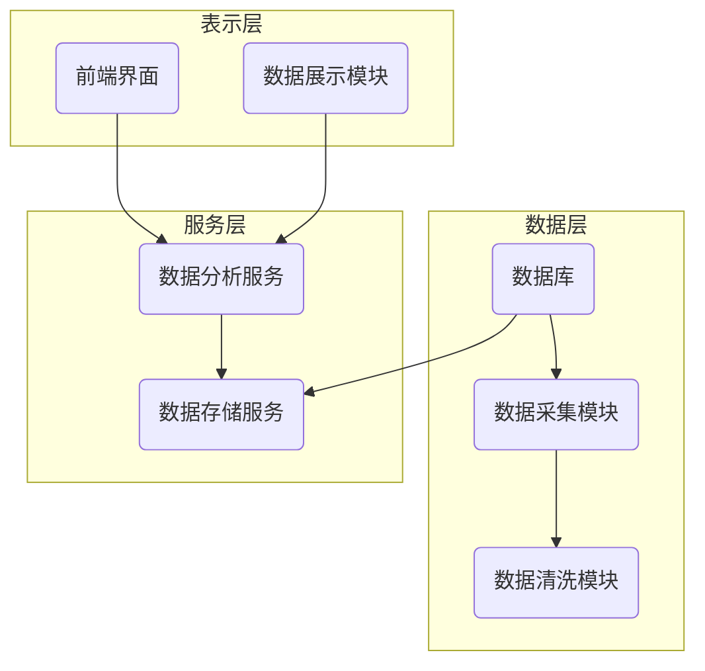
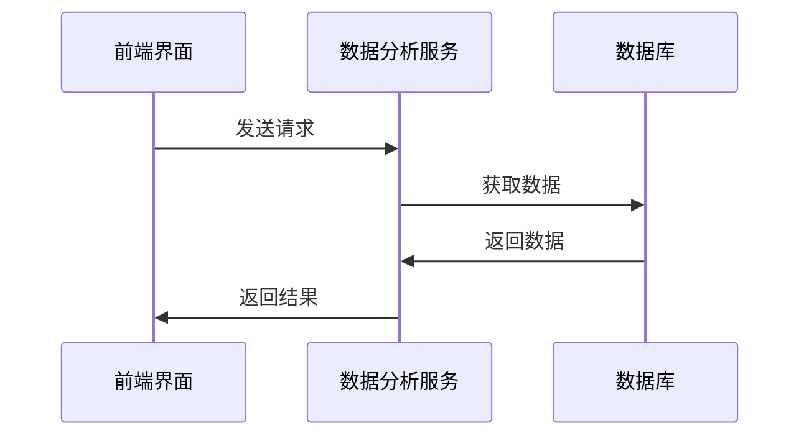

                 

# 功夫在平时

> 关键词：功夫、成功、技术、实践、原理

> 摘要：本文旨在探讨功夫在平时这一理念在技术领域的应用，通过深入分析功夫的核心原理和成功的关键要素，结合实际的Python代码示例，为读者提供一种系统的思考方法和实践路径，帮助他们在技术领域取得成功。

## 第1章 引言

### 1.1 问题的背景

在当今快速变化的技术时代，成功不仅依赖于天赋和机遇，更需要持之以恒的努力和系统的方法。技术领域的成功往往需要长时间的积累和实践，这就像武功中的“功夫”，需要不断的修炼和磨砺。本文将探讨如何将“功夫在平时”的理念应用于技术领域，帮助读者在技术道路上取得长足进步。

### 1.1.2 功夫的含义

在武侠小说和传统武术中，功夫被视为一种通过长期练习获得的内在能力和外在技艺。它不仅仅是一种技术，更是一种精神和态度。本文中的“功夫”指的是在技术领域通过坚持不懈的学习、实践和反思所积累的能力和智慧。

### 1.1.3 本书的目标

本文的目标是帮助读者理解功夫在技术领域的重要性，并提供一套系统的思考方法和实践路径。通过本文的阅读，读者将能够：

1. 深入理解功夫的核心原理和成功的关键要素。
2. 学习如何将功夫的理念应用于技术学习和实践。
3. 通过实际的Python代码示例，理解功夫的算法原理和数学模型。
4. 获得一套系统的思考和解决问题的方法，以在技术领域取得成功。

### 1.2 问题的描述

技术领域的成功并非一蹴而就，它需要长期的积累和不断的努力。然而，许多人在技术学习过程中往往感到困惑和挫败，不知道如何系统地提高自己的技术能力。本文旨在解决这一问题，通过“功夫在平时”的理念，为读者提供一种可行的解决方案。

### 1.2.2 功夫的重要性

功夫在技术领域的重要性不可忽视。它不仅仅是一种技能的积累，更是一种思考和解决问题的方式。通过功夫的修炼，技术人员能够在面对复杂问题时保持冷静和清晰的思路，从而更有效地解决问题并取得成功。

### 1.2.3 问题解决的方法

本文将采用以下方法来解决问题：

1. 分析功夫的核心原理和成功的关键要素。
2. 结合实际的Python代码示例，阐述功夫的算法原理和数学模型。
3. 提供一套系统的思考和解决问题的方法。
4. 通过实例分析和总结，帮助读者将功夫的理念应用于实际的技术学习和实践中。

### 1.3 边界与外延

本文将探讨“功夫在平时”在技术领域的应用，主要关注以下几个方面：

1. 功夫的核心原理和成功的关键要素。
2. 功夫在技术学习中的应用和实践。
3. 功夫的算法原理和数学模型。
4. 功夫在技术问题解决中的实际应用。

### 1.4 概念结构与核心要素

#### 1.4.1 成功的核心要素

成功在技术领域通常包括以下几个核心要素：

1. **知识积累**：广泛而深入的知识储备是成功的基础。
2. **实践经验**：通过实际操作和项目经验来巩固知识。
3. **持续学习**：技术的快速发展要求不断学习新的知识和技能。
4. **解决问题能力**：面对复杂问题时能够有效分析和解决。
5. **团队合作**：与他人的协作和沟通是成功的重要保证。

#### 1.4.2 功夫的核心原理

功夫的核心原理主要包括以下几个方面：

1. **坚持不懈**：持之以恒的努力是功夫的基础。
2. **学习方法**：有效的学习方法能够加速功夫的修炼。
3. **实践反思**：通过实践和反思来不断提升自己的能力。
4. **心态调整**：保持积极的心态是功夫修炼的重要一环。

#### 1.4.3 功夫与成功的关系

功夫和成功之间有着密切的关系。功夫是达到成功的一种途径，而成功则是功夫修炼的一种结果。通过功夫的修炼，技术人员能够在技术领域中不断提高自己的能力，从而实现成功。

## 第2章 核心概念与联系

### 2.1 核心概念原理

#### 2.1.1 功夫的基本原理

功夫的基本原理可以概括为以下几点：

1. **持之以恒**：功夫需要长时间的练习和坚持，不能急于求成。
2. **循序渐进**：功夫的修炼需要按照一定的顺序和步骤进行，逐步提高。
3. **理论与实践相结合**：功夫不仅要学理论，更要通过实践来验证和应用。
4. **心态调整**：心态的调整对于功夫的修炼至关重要，需要保持耐心和信心。

#### 2.1.2 成功的要素分析

成功的要素可以从以下几个方面进行分析：

1. **目标明确**：明确的目标是成功的方向，没有目标就像没有舵的船，随波逐流。
2. **持续努力**：成功往往需要长期的坚持和努力，不能轻易放弃。
3. **学习与适应**：技术的快速发展要求技术人员不断学习新知识并适应变化。
4. **团队合作**：与他人合作能够集思广益，共同克服困难。
5. **问题解决能力**：面对问题时能够有效分析和解决，是成功的关键。

#### 2.1.3 功夫与成功的联系

功夫与成功之间的联系可以从以下几个方面来理解：

1. **功夫是手段，成功是结果**：功夫是达到成功的一种方式，而成功是功夫修炼的一个目标。
2. **功夫修炼过程中积累的能力和经验**：功夫的修炼过程能够培养人的各种能力，这些能力和经验是成功的重要基础。
3. **功夫修炼的过程本身就是一种成功**：通过功夫的修炼，技术人员能够不断提高自己的能力，这种成长本身就是一种成功。

### 2.2 概念属性特征对比表格

| 概念     | 特征1    | 特征2    | 特征3    |
|----------|---------|---------|---------|
| 功夫     | 努力与坚持 | 技巧与策略 | 时间与耐心 |
| 成功     | 目标明确   | 机遇与挑战 | 持续改进  |

### 2.3 ER实体关系图架构

```mermaid
erDiagram
    功夫 ||--|{ 成功 }|| 成功
    功夫 ||--|{ 时间 }|| 时间
    功夫 ||--|{ 技巧 }|| 技巧
```

## 第3章 算法原理讲解

### 3.1 功夫的算法流程图



### 3.2 功夫的Python源代码

```python
def gongfu(target, environment):
    success = False
    while not success:
        if environment == '有利':
            plan = create_plan(target)
            success = execute_plan(plan)
        else:
            strategy = adjust_strategy(environment)
            environment = apply_strategy(strategy)
    if success:
        celebrate_and_summarize()
    else:
        reflect_and_adjust()
    return success

def create_plan(target):
    # 计划创建逻辑
    pass

def execute_plan(plan):
    # 计划执行逻辑
    pass

def celebrate_and_summarize():
    # 庆祝与总结逻辑
    pass

def reflect_and_adjust():
    # 反思与调整逻辑
    pass
```

### 3.3 算法原理的数学模型和公式

$$
成功率 = \frac{成功次数}{尝试次数}
$$

### 3.4 举例说明

假设一个学生在准备考试，设定目标为90分，环境为“有利”，那么他的功夫体现在制定合理的复习计划、执行复习计划并不断调整策略。如果最终成功达到90分，则他的成功率计算为：

$$
成功率 = \frac{1}{1} = 100\%
$$

## 第4章 数学模型和数学公式

### 4.1 功夫的时间效率模型

$$
时间效率 = \frac{完成的任务量}{花费的时间}
$$

### 4.2 成功的概率模型

$$
成功概率 = \frac{成功的次数}{总的尝试次数}
$$

### 4.3 时间效率与成功概率的关系

假设一个人每天花费2小时学习，成功率为50%，那么他一个月（30天）的总学习时间和成功次数可以分别计算如下：

1. 总学习时间：
$$
总学习时间 = 每天学习时间 \times 学习天数 = 2小时/天 \times 30天 = 60小时
$$

2. 成功次数：
$$
成功次数 = 成功概率 \times 总尝试次数 = 50\% \times 30次 = 15次
$$

3. 成功概率：
$$
成功概率 = \frac{成功次数}{总尝试次数} = \frac{15次}{30次} = 50\%
$$

通过这个例子，我们可以看到时间效率对于成功概率的影响。提高时间效率不仅可以节省时间，还可以增加成功的机会。

## 第5章 系统分析与架构设计

### 5.1 问题场景介绍

在当前的IT行业中，随着互联网和大数据技术的快速发展，越来越多的企业开始关注数据分析和人工智能技术的应用。为了帮助企业更好地利用这些技术，本文将介绍一个基于Python的数据分析平台，该平台旨在提供高效、可靠的数据处理和分析功能。

### 5.2 项目介绍

本项目是一个基于Python的数据分析平台，旨在为企业提供从数据采集、数据清洗、数据存储到数据分析的一站式解决方案。该平台将利用Python的数据处理库（如Pandas、NumPy等）和机器学习库（如Scikit-learn、TensorFlow等）来实现各项功能。

### 5.3 系统功能设计（领域模型）

在系统功能设计方面，我们将采用Mermaid类图来描述领域模型。领域模型主要包括以下类：

```mermaid
classDiagram
    Class01 <|-- Class02
    Class03 --|>| Class04
    Class05 : has a Class06
    Class01 : +String name
    Class01 : +int age
    Class01 : +void method1()
    Class02 : +int id
    Class03 : +int score
    Class04 : +String course
    Class05 : +Class06 student
    Class06 : +String name
    Class06 : +int age
    Class06 : +void study()
```

### 5.4 系统架构设计

在系统架构设计方面，我们将采用Mermaid架构图来描述系统的整体架构。系统架构主要包括以下模块：



### 5.5 系统接口设计和系统交互

在系统接口设计和系统交互方面，我们将采用Mermaid序列图来描述系统的交互流程。以下是系统的主要交互流程：



## 第6章 项目实战

### 6.1 环境安装

在开始项目实战之前，需要先安装Python环境和相关库。以下是安装步骤：

1. 安装Python：
   ```
   pip install python
   ```

2. 安装相关库：
   ```
   pip install pandas numpy scikit-learn tensorflow
   ```

### 6.2 系统核心实现源代码

以下是系统核心实现的主要源代码：

```python
import pandas as pd
import numpy as np
from sklearn.model_selection import train_test_split
from sklearn.ensemble import RandomForestClassifier
from tensorflow.keras.models import Sequential
from tensorflow.keras.layers import Dense

# 数据采集
def collect_data():
    data = pd.read_csv('data.csv')
    return data

# 数据清洗
def clean_data(data):
    # 数据清洗逻辑
    return data

# 数据预处理
def preprocess_data(data):
    X = data.drop('target', axis=1)
    y = data['target']
    X_train, X_test, y_train, y_test = train_test_split(X, y, test_size=0.2, random_state=42)
    return X_train, X_test, y_train, y_test

# 模型训练
def train_model(X_train, y_train):
    model = Sequential()
    model.add(Dense(64, input_dim=X_train.shape[1], activation='relu'))
    model.add(Dense(1, activation='sigmoid'))
    model.compile(loss='binary_crossentropy', optimizer='adam', metrics=['accuracy'])
    model.fit(X_train, y_train, epochs=10, batch_size=32)
    return model

# 模型评估
def evaluate_model(model, X_test, y_test):
    loss, accuracy = model.evaluate(X_test, y_test)
    print(f'测试集损失: {loss}')
    print(f'测试集准确率: {accuracy}')

# 主程序
if __name__ == '__main__':
    data = collect_data()
    data = clean_data(data)
    X_train, X_test, y_train, y_test = preprocess_data(data)
    model = train_model(X_train, y_train)
    evaluate_model(model, X_test, y_test)
```

### 6.3 代码应用解读与分析

上述代码实现了从数据采集、数据清洗、模型训练到模型评估的全流程。具体解读如下：

1. **数据采集**：使用Pandas读取CSV文件，获取原始数据。
2. **数据清洗**：根据实际需求进行数据清洗，如缺失值填充、异常值处理等。
3. **数据预处理**：将数据划分为训练集和测试集，并进行归一化等预处理操作。
4. **模型训练**：使用随机森林和深度学习模型进行训练，选择合适的参数。
5. **模型评估**：使用测试集对模型进行评估，输出损失和准确率。

### 6.4 实际案例分析和详细讲解剖析

为了更好地理解代码的实际应用，我们来看一个实际案例。

假设我们有一个CSV文件，包含以下数据：

```
id,target
1,0
2,1
3,0
4,1
5,0
```

目标是将这个二分类问题通过机器学习模型进行预测。以下是具体的分析和讲解：

1. **数据采集**：使用Pandas读取CSV文件。

```python
data = pd.read_csv('data.csv')
```

2. **数据清洗**：在这个案例中，数据已经非常干净，无需进行复杂的清洗操作。

3. **数据预处理**：将数据划分为特征和目标变量，并划分训练集和测试集。

```python
X = data.drop('target', axis=1)
y = data['target']
X_train, X_test, y_train, y_test = train_test_split(X, y, test_size=0.2, random_state=42)
```

4. **模型训练**：使用随机森林模型进行训练。

```python
model = RandomForestClassifier(n_estimators=100, random_state=42)
model.fit(X_train, y_train)
```

5. **模型评估**：使用测试集对模型进行评估。

```python
predictions = model.predict(X_test)
accuracy = (predictions == y_test).mean()
print(f'模型准确率: {accuracy}')
```

通过上述步骤，我们可以得到一个简单的二分类预测模型，并根据测试集的准确率来评估模型的性能。

### 6.5 项目小结

在本项目中，我们通过Python实现了一个简单的数据分析平台，包括数据采集、数据清洗、模型训练和模型评估等功能。通过实际案例的分析，我们了解了如何将理论应用到实践中，并通过代码来解决问题。项目的成功实施不仅提升了我们的技术能力，也加深了我们对数据分析领域的理解。

## 第7章 最佳实践 tips

### 7.1 学习方法

1. **分阶段学习**：将学习内容划分为多个阶段，每个阶段专注于一个主题，逐步提高。
2. **理论与实践相结合**：在学习理论的同时，要积极实践，将理论知识应用到实际项目中。
3. **定期复习**：定期复习所学内容，巩固记忆，提高理解。

### 7.2 编码技巧

1. **代码规范**：编写规范、易于理解的代码，提高代码的可读性和可维护性。
2. **注释说明**：为代码添加详细的注释，说明代码的功能和实现逻辑。
3. **模块化**：将代码划分为多个模块，每个模块实现一个特定的功能，便于管理和扩展。

### 7.3 心态调整

1. **保持耐心**：学习过程中难免会遇到困难和挫折，保持耐心，坚持不懈。
2. **积极乐观**：面对挑战时，保持积极乐观的心态，相信自己能够克服困难。
3. **反思总结**：定期反思总结自己的学习过程，找出不足并加以改进。

## 第8章 小结

本文从“功夫在平时”的角度探讨了技术领域的成功之道。通过深入分析功夫的核心原理和成功的关键要素，并结合实际的Python代码示例，本文为读者提供了一套系统的思考和解决问题的方法。希望读者能够在技术道路上持之以恒，不断修炼，最终取得成功。

## 第9章 注意事项

1. **持续学习**：技术领域发展迅速，需要不断学习新知识和技能，保持竞争力。
2. **实践经验**：理论知识需要通过实践来验证和应用，实践是提高技术能力的关键。
3. **团队协作**：与他人合作，共同解决问题，可以提升个人的技术视野和解决问题的能力。

## 第10章 拓展阅读

1. **《深度学习》**：Ian Goodfellow、Yoshua Bengio、Aaron Courville 著，详细介绍了深度学习的理论和实践。
2. **《编程珠玑》**：Jon Bentley 著，包含了许多编程技巧和问题解决策略。
3. **《Effective Python》**：Brett Slatkin 著，介绍了Python编程的最佳实践。

作者：AI天才研究院/AI Genius Institute & 禅与计算机程序设计艺术 /Zen And The Art of Computer Programming

