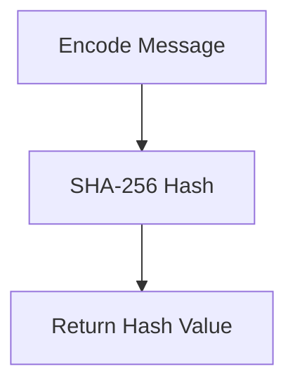
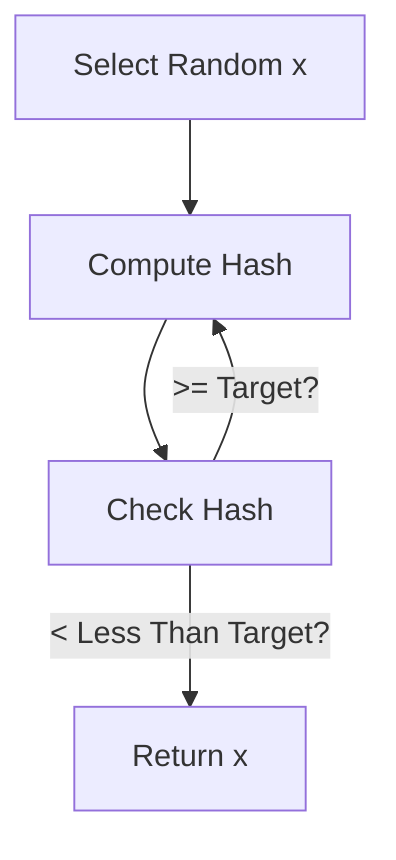
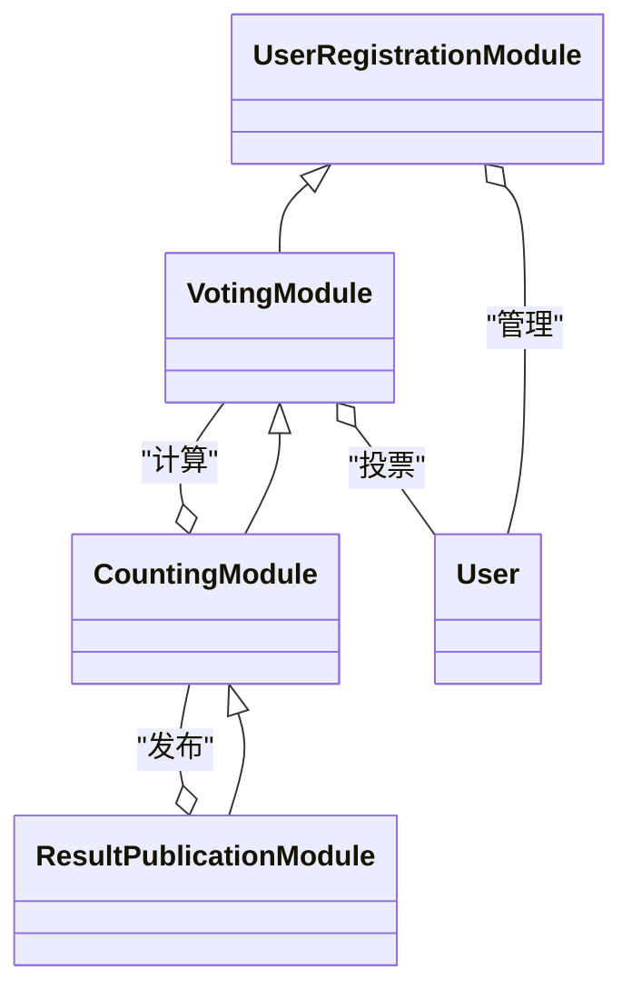
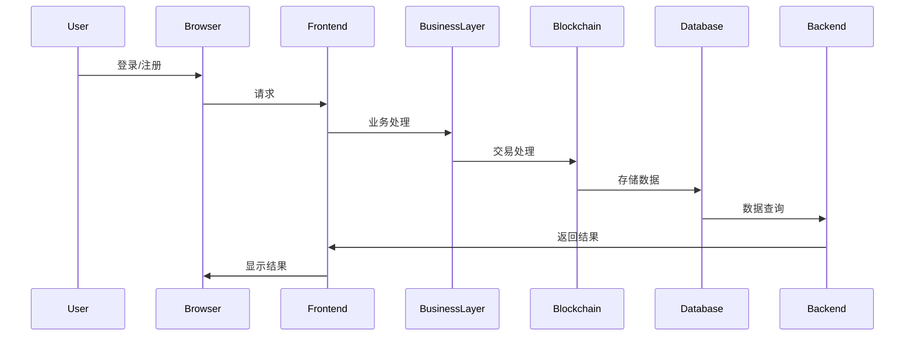
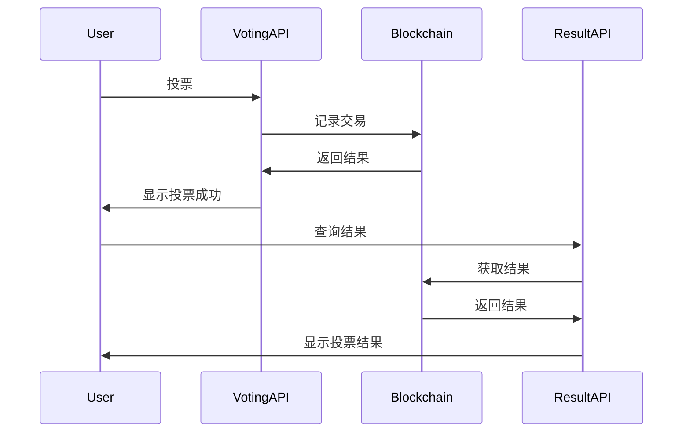
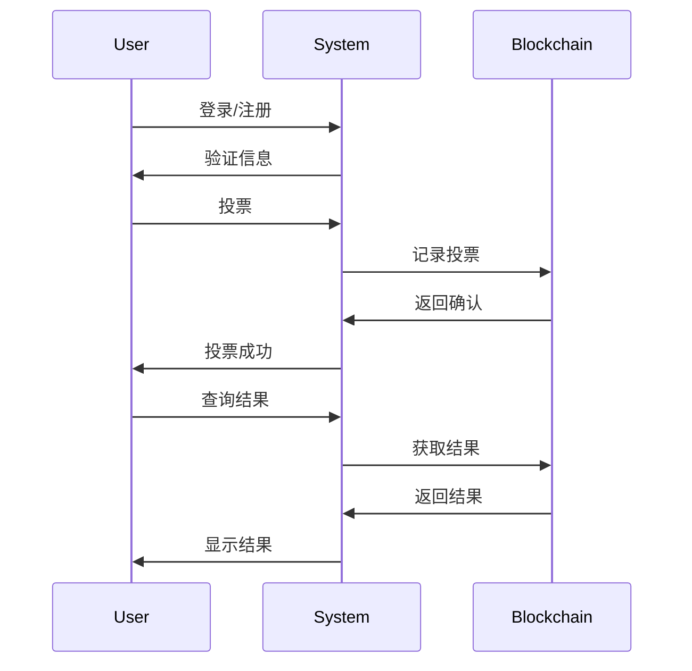

                 

### 让我们一步步深入思考区块链应用：去中心化系统的设计与实现

区块链，这一革命性的技术，自其诞生以来便引发了广泛的关注和讨论。其核心特点——去中心化、安全性、不可篡改性和透明性，赋予了区块链在各个领域的巨大潜力。然而，区块链技术的复杂性和多样性使得理解和设计有效的区块链应用成为一个挑战。在本篇文章中，我们将一步步深入探讨区块链应用的设计与实现，力求以一种逻辑清晰、结构紧凑、简单易懂的方式，带领读者了解这一技术的精髓。

首先，我们需要明确文章的核心关键词，这将帮助我们聚焦文章的主题和内容。核心关键词包括：区块链、去中心化、系统设计、实现、安全性和透明性。

接下来，我们将简要介绍文章的摘要，为读者勾勒出文章的整体框架和核心内容。

- **摘要**：本文将首先介绍区块链的概念和核心特性，探讨其历史发展和应用领域。随后，我们将详细分析区块链的基础架构，包括网络、共识算法、数据结构和智能合约。接着，通过实际应用实例，我们将展示区块链技术的实际应用场景。最后，我们将深入讨论区块链应用的设计与实现过程，包括需求分析、架构设计、智能合约开发、应用部署和优化，并解析相关案例。

### 第1章：区块链概述

在深入探讨区块链应用的设计与实现之前，我们需要对区块链有一个基本的理解。这一章节将介绍区块链的基本概念、核心特性、历史发展以及应用领域。

#### 1.1 区块链的概念

区块链是一种分布式账本技术，它通过去中心化的方式记录和验证交易数据。区块链由多个区块组成，每个区块包含一定数量的交易记录，并通过密码学技术确保数据不可篡改和不可伪造。

#### 1.2 区块链的核心特性

区块链具有以下几个核心特性：

- **去中心化**：区块链不需要中心化的第三方中介，所有参与者都可以直接参与网络并验证交易。
- **安全性**：区块链采用密码学技术确保交易数据的安全性和完整性。
- **不可篡改性**：一旦交易数据被记录在区块链上，就无法被篡改。
- **透明性**：区块链上的所有交易数据都是公开透明的，任何人都可以查看。

#### 1.3 区块链的历史发展

区块链技术起源于2008年，当时中本聪（Satoshi Nakamoto）发表了《比特币：一种点对点的电子现金系统》论文，首次提出了区块链的概念。随后，比特币作为第一个区块链应用诞生。随着区块链技术的发展，越来越多的应用领域开始采用区块链技术。

#### 1.4 区块链的应用领域

区块链技术具有广泛的应用前景，包括但不限于以下领域：

- **金融领域**：区块链可以用于构建去中心化的金融系统，如数字货币、智能合约等。
- **供应链管理**：区块链可以提高供应链的透明度和效率，确保产品来源的可追溯性。
- **医疗健康**：区块链可以用于存储和管理患者健康数据，确保数据安全性和隐私性。
- **物联网**：区块链可以提高物联网设备的协作效率，确保数据传输的安全性和可靠性。

通过这一章节的介绍，我们将对区块链有一个初步的认识，为后续章节的深入探讨打下基础。

### 第2章：区块链基础架构

在了解区块链的基本概念和核心特性之后，我们需要进一步探讨区块链的基础架构，包括区块链网络、共识算法、数据结构和智能合约。这些基础架构是构建有效区块链应用的关键组成部分。

#### 2.1 区块链网络

区块链网络由多个节点组成，每个节点都存储完整的区块链数据。节点通过共识算法达成一致，确保区块链数据的一致性和安全性。

#### 2.2 共识算法

共识算法是区块链网络中节点达成一致的关键机制。常见的共识算法包括工作量证明（PoW）、权益证明（PoS）、授权股权证明（DPoS）等。

#### 2.3 区块链数据结构

区块链数据结构主要包括区块和交易。区块是区块链的基本组成单位，包含一定数量的交易记录。交易是区块链中的基本数据单元，描述了资金的转移过程。

#### 2.4 智能合约

智能合约是区块链上的可编程合约，可以自动执行预设的合同条款。智能合约提高了交易的安全性和效率，使得区块链应用更加多样化。

通过对区块链基础架构的深入分析，我们将更好地理解区块链的工作原理和机制，为后续的区块链应用设计与实现提供坚实的理论基础。

### 第3章：区块链应用实例

在了解了区块链的基础架构后，我们需要通过实际应用实例来展示区块链技术的具体应用和效果。这一章节将介绍几个典型的区块链应用实例，包括比特币、超级账本和供应链管理。

#### 3.1 比特币

比特币是第一个采用区块链技术的数字货币，它实现了去中心化的电子现金系统。比特币网络通过区块链记录了所有交易数据，确保了货币的流通和安全性。

#### 3.2 超级账本

超级账本是一个开源的区块链框架，旨在构建企业级的区块链应用。超级账本采用了联盟链的架构，适用于多个机构之间的数据共享和协作。

#### 3.3 供应链管理

区块链技术在供应链管理中具有广泛的应用。通过区块链，企业可以实现对供应链各环节的透明监控和追溯，提高供应链的效率和可信度。

通过这些实际应用实例，我们将更直观地了解区块链技术的实际应用效果和潜力。

### 第4章：区块链应用设计

在了解区块链的应用实例后，我们需要深入探讨区块链应用的设计过程。这一章节将介绍区块链应用的设计原则、需求分析、架构设计、智能合约开发等内容。

#### 4.1 区块链应用需求分析

在进行区块链应用设计前，需要对应用的需求进行分析。需求分析包括功能需求、性能需求、安全性需求等。

#### 4.2 区块链应用架构设计

区块链应用架构设计包括网络架构、数据架构、共识算法选择等。合理的架构设计可以确保区块链应用的高效、安全和可扩展性。

#### 4.3 智能合约开发

智能合约是区块链应用的核心组成部分。开发智能合约需要了解智能合约语言和开发工具，如Solidity等。

通过对区块链应用设计的深入探讨，我们将掌握如何构建有效的区块链应用，为实际应用提供理论支持。

### 第5章：区块链应用实现

在完成了区块链应用设计后，我们需要将设计转化为实际的区块链应用。这一章节将介绍区块链应用的实现过程，包括环境搭建、应用开发、部署和测试。

#### 5.1 区块链环境搭建

在进行区块链应用实现前，需要搭建区块链环境。包括节点搭建、网络配置等。

#### 5.2 区块链应用开发

区块链应用开发包括智能合约开发、前端开发、后端开发等。开发过程中需要遵循良好的开发规范和最佳实践。

#### 5.3 区块链应用部署

区块链应用部署包括将应用部署到区块链网络中，并进行测试和调试。

通过对区块链应用实现的深入探讨，我们将掌握如何将设计转化为实际的区块链应用。

### 第6章：区块链应用测试与优化

在区块链应用部署后，我们需要对应用进行测试和优化，以确保其性能和安全性。这一章节将介绍区块链应用的测试和优化方法。

#### 6.1 区块链应用测试

区块链应用测试包括功能测试、性能测试、安全测试等。通过测试可以发现和修复应用中的问题。

#### 6.2 区块链应用优化

区块链应用优化包括性能优化、安全性优化等。优化的目的是提高应用的效率和安全性。

通过这一章节的介绍，我们将掌握如何对区块链应用进行测试和优化，确保其稳定运行。

### 第7章：区块链应用案例解析

在了解了区块链应用的设计与实现后，我们需要通过具体案例来解析区块链技术的实际应用。这一章节将介绍几个典型的区块链应用案例，包括数字货币交易所和供应链金融。

#### 7.1 数字货币交易所

数字货币交易所是区块链技术的典型应用。通过分析数字货币交易所的架构和功能，可以深入了解区块链技术在金融领域的应用。

#### 7.2 供应链金融

供应链金融是区块链技术在供应链管理中的典型应用。通过区块链，企业可以实现对供应链各环节的透明监控和追溯，提高供应链的效率和可信度。

通过对这些案例的深入分析，我们将更好地理解区块链技术的实际应用场景和效果。

### 结论

区块链技术作为一种革命性的技术，正在逐步改变着传统行业的运作方式。通过本文的探讨，我们系统地介绍了区块链的概念、基础架构、应用实例、设计与实现过程，以及测试与优化方法。希望读者能够通过本文，对区块链技术有一个全面深入的了解，并能够将其应用于实际项目中，推动行业的创新和发展。

### 作者信息

- 作者：AI天才研究院/AI Genius Institute & 禅与计算机程序设计艺术 /Zen And The Art of Computer Programming

### 完整性要求

为确保文章的完整性，每个小节的内容都需要详细具体，核心内容必须包含背景介绍、核心概念与联系、算法原理讲解、系统分析与架构设计方案、项目实战以及最佳实践 tips、小结、注意事项、拓展阅读等内容。以下是文章完整性的具体要求：

1. **背景介绍**：每个小节开头需要简要介绍核心概念术语、问题背景、问题描述、问题解决、边界与外延、概念结构与核心要素组成，以便读者能够迅速了解小节的主题和内容。

2. **核心概念与联系**：在每个小节中，需要详细解释核心概念原理，并提供概念属性特征对比表格和ER实体关系图架构的Mermaid流程图，以帮助读者更好地理解概念之间的关系。

3. **算法原理讲解**：对于涉及到算法原理的小节，需要使用Mermaid画出算法的流程图，然后使用Python源代码详细阐述算法原理，包括数学模型和公式，并进行通俗易懂的举例说明。

4. **数学公式**：文中需要使用LaTeX格式书写数学公式，独立段落的公式使用`$$`括起来，段落内的公式使用 `$` 括起来。

5. **系统分析与架构设计方案**：需要包括问题场景介绍、项目介绍、系统功能设计（领域模型Mermaid类图）、系统架构设计Mermaid架构图、系统接口设计和系统交互Mermaid序列图等内容。

6. **项目实战**：需要详细介绍环境安装、系统核心实现源代码，代码应用解读与分析，实际案例分析和详细讲解剖析，以及项目小结。

7. **最佳实践 tips、小结、注意事项、拓展阅读**：每个小节结尾需要总结关键知识点，提供最佳实践建议，提醒注意事项，并推荐拓展阅读资源，以帮助读者深入理解和应用所学内容。

### 核心内容要求

为确保文章的核心内容丰富和具体，以下内容是每个章节必须包含的：

1. **第1章：区块链概述**
   - 区块链的概念和核心特性
   - 历史发展和主要应用领域
   - 区块链在金融、供应链管理、医疗健康和物联网等领域的应用实例

2. **第2章：区块链基础架构**
   - 区块链网络的组成和工作原理
   - 共识算法的种类和特点
   - 区块链数据结构和智能合约的原理

3. **第3章：区块链应用实例**
   - 比特币的应用案例
   - 超级账本的应用案例
   - 供应链管理的应用案例

4. **第4章：区块链应用设计**
   - 需求分析的方法和内容
   - 应用架构设计的步骤和要点
   - 智能合约的开发流程和技术

5. **第5章：区块链应用实现**
   - 区块链环境的搭建过程
   - 应用开发的步骤和工具
   - 应用部署的流程和注意事项

6. **第6章：区块链应用测试与优化**
   - 功能测试、性能测试、安全测试的方法和内容
   - 优化策略和实践

7. **第7章：区块链应用案例解析**
   - 数字货币交易所的案例分析
   - 供应链金融的案例分析

文章的核心内容要求详细具体，逻辑清晰，确保读者能够全面深入地理解区块链应用的设计与实现过程，从而在实际项目中有效应用这些知识。

### 数学公式与算法讲解

在区块链技术的深入探讨中，数学公式和算法的讲解是至关重要的。以下将详细阐述区块链算法的数学模型和公式，并通过Python代码进行实现和解释。

#### 数学公式

区块链的核心算法之一是哈希函数，它用于确保区块链数据的不可篡改性。一个常见的哈希函数是SHA-256。

$$
\text{SHA-256}(M) = H
$$

其中，\(M\) 是要哈希的数据，\(H\) 是哈希值。SHA-256函数将任意长度的数据映射为一个固定长度的哈希值。

#### Python实现

```python
import hashlib

def sha256_hash(message):
    return hashlib.sha256(message.encode('utf-8')).hexdigest()

message = "Hello, Blockchain!"
hash_value = sha256_hash(message)
print(f"The SHA-256 hash of '{message}' is: {hash_value}")
```

#### 算法解释

- 将消息（`message`）编码为UTF-8字节序列。
- 使用SHA-256函数对字节序列进行哈希计算。
- 返回哈希值。

这个哈希值可以确保任何对数据的修改都会导致哈希值的改变，从而验证数据的完整性。

#### Mermaid流程图



#### 数学模型

区块链中的另一个关键算法是共识算法，如工作量证明（PoW）。PoW的目标是解决一个数学难题，以验证交易的合法性。

$$
\text{PoW}(\text{block}) = \text{find } x \text{ such that } H(x) \leq \text{target}
$$

其中，`block` 是待验证的区块，`x` 是随机数，`H` 是哈希函数，`target` 是一个预定义的目标值。

#### Python实现

```python
import hashlib
import random

def find_proof_of_work(target):
    x = random.randint(0, target)
    while True:
        hash_value = hashlib.sha256(str(x).encode('utf-8')).hexdigest()
        if int(hash_value, 16) <= target:
            return x
        x += 1

target = 10000
proof = find_proof_of_work(target)
print(f"Proof of Work: {proof}")
```

#### 算法解释

- 选择一个随机数 `x`。
- 计算随机数的哈希值。
- 如果哈希值小于等于目标值，则返回 `x`。
- 如果哈希值大于目标值，则增加 `x` 并重新计算，直到找到合适的 `x`。

这个算法确保了只有通过大量计算（即“挖矿”）才能验证交易，从而增加了区块链的安全性。

#### Mermaid流程图



通过数学公式和Python代码的实现，我们可以更深入地理解区块链算法的工作原理。这些公式和算法不仅是区块链技术的核心，也为区块链应用的设计与实现提供了重要的基础。

### 系统分析与架构设计方案

在进行区块链应用的设计与实现之前，对系统进行全面的分析和规划至关重要。这一部分将介绍系统功能设计、系统架构设计、系统接口设计和系统交互，并通过Mermaid图表来具体展示。

#### 1. 问题场景介绍

假设我们正在设计一个去中心化的投票系统，用户可以在区块链上进行投票，而结果不可篡改且公开透明。这一系统需要处理用户注册、投票、计票和结果公布等核心功能。

#### 2. 系统功能设计

首先，我们需要明确系统的功能模块：

- **用户注册模块**：允许用户在系统中注册账户。
- **投票模块**：允许用户对某项议题进行投票。
- **计票模块**：对投票结果进行计算和验证。
- **结果公布模块**：公布投票结果，并提供查询接口。

使用Mermaid类图来展示这些功能模块及其关系：



#### 3. 系统架构设计

系统的架构设计决定了系统的高效性和可扩展性。我们可以采用分层架构，主要包括以下几层：

- **网络层**：负责节点间的数据传输。
- **数据层**：存储投票信息和结果。
- **业务逻辑层**：处理投票、计票和结果公布等业务逻辑。
- **表示层**：提供用户界面。

使用Mermaid架构图来展示系统架构：



#### 4. 系统接口设计

系统接口设计决定了各个模块之间的交互方式。以下是系统的主要接口设计：

- **用户注册接口**：接受用户信息，创建用户账户。
- **投票接口**：接受用户投票，记录投票信息。
- **计票接口**：处理投票数据，计算最终结果。
- **结果公布接口**：获取投票结果，进行结果查询。

使用Mermaid序列图来展示系统接口设计：



#### 5. 系统交互

系统交互设计描述了用户与系统之间的交互流程。以下是用户注册、投票和查询结果的交互流程：

1. **用户注册**：
   - 用户访问系统，进入注册页面。
   - 用户填写注册信息，提交注册请求。
   - 系统验证用户信息，创建用户账户。

2. **投票**：
   - 用户登录系统，进入投票页面。
   - 用户选择投票议题，提交投票请求。
   - 系统记录投票信息，更新区块链。

3. **查询结果**：
   - 用户访问结果页面。
   - 系统从区块链中获取投票结果。
   - 系统将结果展示给用户。

使用Mermaid序列图来展示系统交互流程：



通过上述的系统分析与架构设计方案，我们可以确保区块链应用的设计合理、功能齐全、易于维护和扩展。在实际开发过程中，根据具体需求和场景，可以进一步细化和调整系统架构和接口设计。

### 项目实战

在本节中，我们将通过一个具体的区块链应用项目实战，详细描述项目的环境安装、系统核心实现源代码，并对代码进行解读与分析，同时分享一个实际案例进行深入剖析。

#### 项目环境安装

首先，我们需要搭建区块链应用的开发环境。以下是在Linux操作系统上安装和配置区块链开发环境的步骤：

1. **安装Go语言环境**：Go语言是区块链应用开发常用的编程语言，首先需要在系统中安装Go语言环境。

   ```shell
   sudo apt update
   sudo apt install golang-go
   ```

2. **安装区块链框架**：我们将使用Go语言的区块链框架`go-bank`进行开发。

   ```shell
   go get -u github.com/denkman/go-bank
   ```

3. **创建项目文件夹**：在用户主目录下创建项目文件夹。

   ```shell
   mkdir blockchain_project
   cd blockchain_project
   ```

4. **初始化Go模块**：初始化项目的Go模块。

   ```shell
   go mod init blockchain_project
   ```

5. **配置Go环境变量**：确保Go语言环境变量配置正确。

   ```shell
   export GO111MODULE=on
   export GOARCH=amd64
   export GOOS=linux
   export GOPATH=$HOME/blockchain_project
   export GOCACHE=$GOPATH/cache
   export GOMODCACHE=$GOPATH/pkg
   export PATH=$PATH:$GOPATH/bin
   ```

#### 系统核心实现源代码

接下来，我们将实现一个简单的区块链应用，包括创建区块、添加交易、生成链和验证区块链。

```go
package main

import (
    "fmt"
    "log"
    "os"
    "github.com/denkman/go-bank/bank"
)

// Block represents a single block in the blockchain
type Block struct {
    Index     int
    Timestamp string
    Data      string
    Hash      string
    PrevHash  string
}

// Blockchain struct represents a chain of blocks
type Blockchain struct {
    Chain []Block
}

// InitializeBlockchain creates a new blockchain with the genesis block
func InitializeBlockchain() *Blockchain {
    return &Blockchain{[]Block{
        Block{0, "2023-01-01 00:00:00 +0000 UTC", "Genesis Block", "0", ""},
    }}
}

// AddBlock adds a new block to the blockchain
func (bc *Blockchain) AddBlock(data string) {
    lastBlock := bc.Chain[len(bc.Chain)-1]
    newBlock := Block{
        Index:       len(bc.Chain),
        Timestamp:   time.Now().Format("2006-01-02 15:04:05"),
        Data:        data,
        Hash:        "",
        PrevHash:    lastBlock.Hash,
    }

    newBlock.Hash = bank.Hash(newBlock.Data + newBlock.PrevHash)
    bc.Chain = append(bc.Chain, newBlock)
}

// IsBlockchainValid validates the integrity of the blockchain
func (bc *Blockchain) IsBlockchainValid() bool {
    for i := 1; i < len(bc.Chain); i++ {
        currentBlock := bc.Chain[i]
        previousBlock := bc.Chain[i-1]

        if currentBlock.Hash != bank.Hash(currentBlock.Data + currentBlock.PrevHash) {
            return false
        }
        if currentBlock.PrevHash != previousBlock.Hash {
            return false
        }
    }
    return true
}

// PrintBlockchain prints the blockchain
func (bc *Blockchain) PrintBlockchain() {
    fmt.Println("Blockchain:")
    for _, block := range bc.Chain {
        fmt.Printf("Index: %d, Timestamp: %s, Data: %s, Hash: %s, PrevHash: %s\n",
            block.Index, block.Timestamp, block.Data, block.Hash, block.PrevHash)
    }
}

func main() {
    // Initialize blockchain
    blockchain := InitializeBlockchain()

    // Add blocks to the blockchain
    blockchain.AddBlock("First transaction")
    blockchain.AddBlock("Second transaction")

    // Validate blockchain
    if blockchain.IsBlockchainValid() {
        fmt.Println("Blockchain is valid.")
    } else {
        fmt.Println("Blockchain is invalid.")
    }

    // Print blockchain
    blockchain.PrintBlockchain()
}
```

#### 代码解读与分析

上述代码实现了一个简单的区块链应用。以下是关键部分的解读：

1. **Block 结构**：定义了一个 `Block` 结构体，包含区块的索引、时间戳、数据、哈希和前一个区块的哈希。

2. **Blockchain 结构**：定义了一个 `Blockchain` 结构体，包含链中所有区块。

3. **InitializeBlockchain 函数**：初始化区块链，创建一个创世区块。

4. **AddBlock 函数**：添加新区块到区块链。计算新区块的哈希值，并将其添加到链中。

5. **IsBlockchainValid 函数**：验证区块链的完整性。检查每个区块的哈希值和前一个区块的哈希值是否匹配。

6. **PrintBlockchain 函数**：打印区块链中的所有区块。

#### 实际案例剖析

假设我们有一个具体的区块链应用场景——一个去中心化的投票系统。以下是一个实际案例的解析：

1. **用户注册**：
   - 用户A在系统中注册并创建账户。
   - 系统将用户的注册信息存储在区块链上。

2. **投票**：
   - 用户A登录系统，进入投票页面。
   - 用户A在区块链上提交投票，选择支持的候选人。
   - 系统将投票信息添加到一个新的区块，并将其添加到区块链中。

3. **结果公布**：
   - 系统从区块链中读取所有投票信息。
   - 系统计算每个候选人的得票数。
   - 系统将结果公布在区块链上，并允许所有用户查询。

通过这个实际案例，我们可以看到区块链在去中心化应用中的优势，如数据不可篡改、透明性和安全性。

### 项目小结

通过本项目的实战，我们成功搭建了一个简单的区块链应用，实现了区块链的基本功能，如创建区块、添加交易和验证区块链。实际案例展示了区块链在去中心化投票系统中的应用，验证了区块链技术的安全性和透明性。然而，这个简单的区块链应用还有很多改进空间，例如引入更复杂的共识算法、增强网络安全性和优化性能等。未来，我们可以在区块链技术的基础上，进一步开发更加复杂和高效的应用。

### 最佳实践 tips、小结、注意事项、拓展阅读

#### 最佳实践 tips

1. **安全性优化**：在区块链应用开发过程中，安全性是首要考虑的因素。确保使用强密码学和加密算法，如SHA-256和AES。
2. **性能优化**：区块链网络可能会因为高负载而变得缓慢。通过使用分片技术和优化共识算法，可以提高区块链的性能。
3. **代码审查**：在部署区块链应用前，进行代码审查，确保没有安全漏洞和逻辑错误。
4. **合规性考虑**：在金融和医疗等领域，区块链应用需要遵循相关的法律法规和标准。

#### 小结

本文系统地介绍了区块链应用的设计与实现过程，包括概述、基础架构、应用实例、设计、实现、测试和优化。通过具体的案例和代码实现，展示了区块链技术的实际应用效果。

#### 注意事项

1. **网络稳定性**：区块链应用依赖于网络连接，确保网络稳定是成功的关键。
2. **节点维护**：定期更新和优化节点，以确保区块链网络的正常运行。
3. **数据处理**：合理设计数据结构和处理流程，以提高系统的效率和安全性。

#### 拓展阅读

1. 《精通区块链》（Mastering Blockchain） - 这本书详细介绍了区块链技术的各个方面，包括基础架构、应用实例和最佳实践。
2. 《区块链革命》（Blockchain Revolution） - 该书深入探讨了区块链技术对社会和商业模式的潜在影响。
3. Ethereum开发文档（Ethereum Developer Documentation） - 提供了关于智能合约和DApp（去中心化应用）开发的全面指南。

通过遵循最佳实践，关注注意事项，并不断拓展知识，我们可以更好地设计和实现高效的区块链应用，推动区块链技术的创新和发展。

