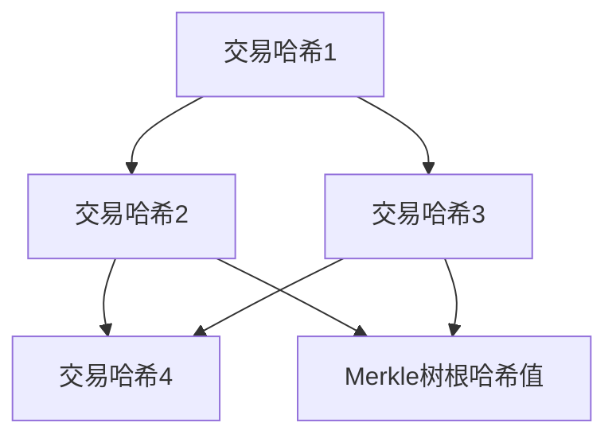
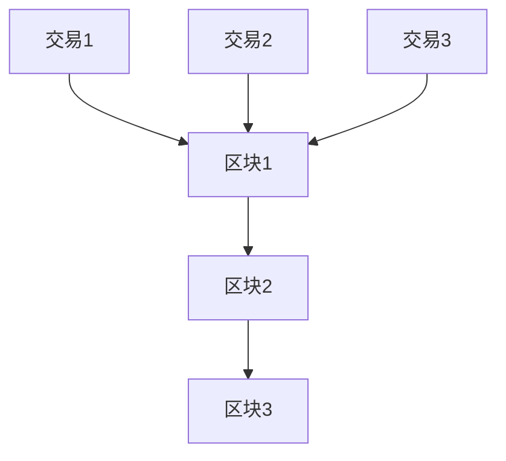
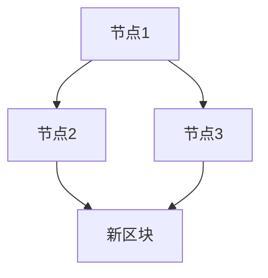
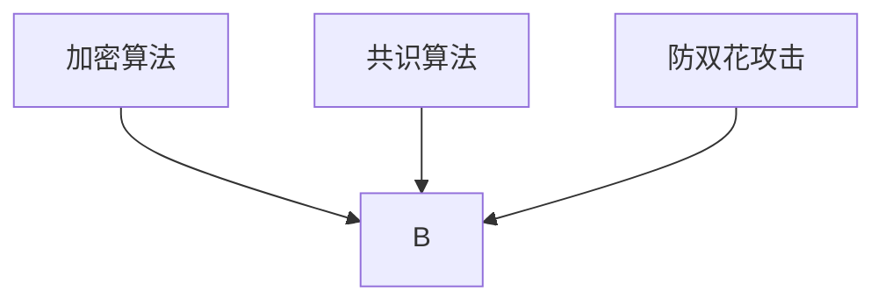
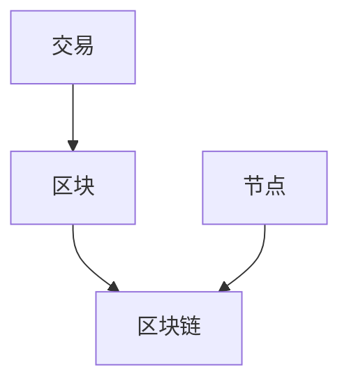
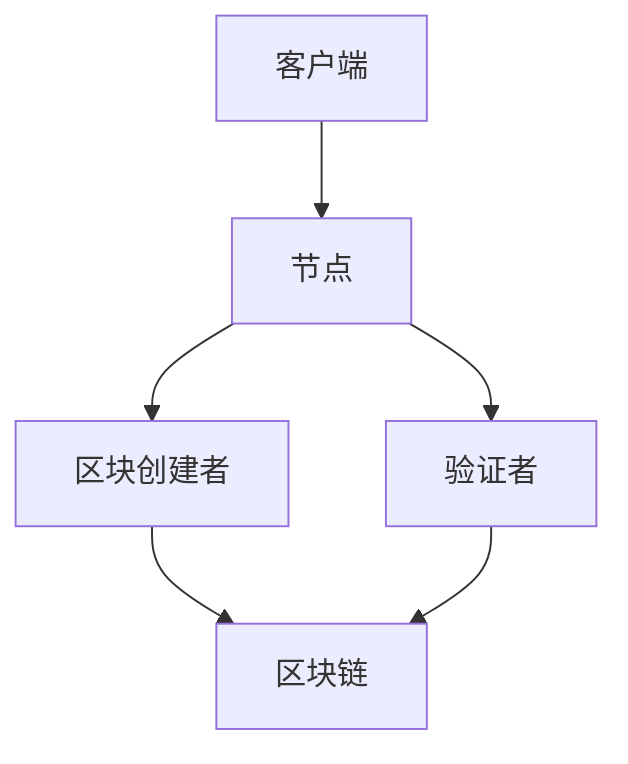

                 

### 第一部分：区块链技术概述

#### 第1章：区块链技术背景与核心概念

区块链技术的出现，可以追溯到2008年，当时一位名为中本聪（Satoshi Nakamoto）的匿名人物发表了比特币白皮书，首次提出了区块链的概念。这一创新性的技术迅速引起了全球的关注，并在随后的几年里逐渐演变成为一种颠覆传统金融体系的重要工具。本节将详细介绍区块链的起源、发展历程，以及核心概念。

#### 1.1 区块链的起源与发展历程

##### 1.1.1 区块链的起源

区块链技术的起源可以追溯到中本聪在2008年发布的比特币白皮书。这一白皮书中详细阐述了区块链的概念、工作原理以及比特币作为一种去中心化数字货币的实现。中本聪的这一创举旨在解决传统金融体系中的诸多问题，如中心化、信任缺失、手续费高等。

##### 1.1.2 区块链的发展历程

自比特币白皮书发布以来，区块链技术经历了快速的发展。2010年，第一个基于区块链的去中心化交易所Tradehill成立，标志着区块链技术在金融领域的实际应用。2014年，以太坊的推出，为区块链技术带来了智能合约的功能，使得区块链不再仅仅局限于数字货币领域，而开始向更广泛的领域扩展。

##### 1.1.3 区块链的核心概念

区块链技术之所以能够引起全球的关注，离不开其独特的核心概念。这些概念包括：

- **去中心化**：区块链技术通过去中心化的方式，避免了传统中心化体系中的单点故障问题，提高了系统的可靠性。
- **不可篡改性**：区块链上的数据一旦被记录，就不可篡改，保证了数据的真实性和可靠性。
- **安全性**：区块链采用了一系列加密算法，确保了数据传输过程中的安全性。
- **透明性**：区块链上的数据是公开透明的，任何人都可以查看，但无法篡改。

#### 1.2 区块链的基本结构

区块链的基本结构由区块和链组成。每个区块包含了多个交易记录，这些区块按照时间顺序连接成一条链，从而形成了区块链。

##### 1.2.1 区块与链

- **区块**：区块是区块链的基本组成单元，包含了交易记录、时间戳、区块头等信息。
- **链**：链是由多个区块按照时间顺序连接而成的数据结构，确保了区块链数据的完整性和不可篡改性。

##### 1.2.2 区块结构

每个区块的结构如下：

- **区块头**：包含版本号、前一个区块的哈希值、Merkle树的根哈希值、时间戳、难度目标、随机数等。
- **交易数据**：包含了多个交易记录，每个交易记录包含了输入、输出以及签名等。
- **Merkle树**：用于确保交易数据的完整性。

##### 1.2.3 链结构

区块链的链结构保证了数据的完整性和不可篡改性。每个区块都包含了前一个区块的哈希值，从而形成了一种链式结构。如果试图篡改某个区块的数据，那么该区块的哈希值将会发生变化，从而导致整个链的哈希值链发生变化，这是不可能实现的。

#### 1.3 区块链的核心特性

区块链技术具有以下核心特性：

##### 1.3.1 去中心化

区块链技术通过去中心化的方式，避免了传统中心化体系中的单点故障问题，提高了系统的可靠性。

##### 1.3.2 安全性

区块链技术采用了一系列加密算法，确保了数据传输过程中的安全性。

##### 1.3.3 可信性

区块链上的数据一旦被记录，就不可篡改，保证了数据的真实性和可靠性。

#### 总结

区块链技术作为一种去中心化、安全、可信的数据结构，已经逐渐成为金融科技、供应链管理、医疗保健等多个领域的核心技术。本节对区块链技术的背景、基本结构和核心特性进行了详细的介绍，为后续章节的深入学习打下了坚实的基础。在接下来的章节中，我们将继续深入探讨区块链技术的原理、算法和应用。让我们继续探索这一激动人心的技术世界。

---

#### 第2章：区块链技术基础

区块链技术作为一种去中心化、安全、可信的数据结构，其基础组件和核心算法构成了整个系统的骨架。本章节将详细介绍区块链技术的基础知识，包括哈希算法、链式共识算法和智能合约。

##### 2.1 哈希算法

哈希算法是区块链技术的核心组件之一，用于确保数据的一致性和不可篡改性。哈希算法将任意长度的数据映射为一个固定长度的字符串，这个字符串被称为哈希值。常见的哈希算法包括SHA-256、Merkle树等。

###### 2.1.1 哈希算法概述

哈希算法的核心特性是压缩性和唯一性。压缩性指的是将大量数据压缩为一个固定长度的哈希值，而唯一性则是指不同的输入数据会产生不同的哈希值。

###### 2.1.2 SHA-256算法

SHA-256是一种广泛使用的哈希算法，其输入是任意长度的数据，输出是256位的哈希值。SHA-256算法的安全性非常高，被广泛应用于区块链和加密货币中。

```python
import hashlib

def sha256_hash(data):
    hash_object = hashlib.sha256(data.encode())
    hex_dig = hash_object.hexdigest()
    return hex_dig
```

###### 2.1.3 Merkle树

Merkle树（或Merkle树验证）是用于确保区块链上数据完整性的重要结构。每个区块包含了一个Merkle树，树中的每个节点都是两个子节点的哈希值的组合。树的根节点被称为Merkle树的根哈希值，用于验证整个区块的数据完整性。

##### 2.2 链式共识算法

链式共识算法是区块链网络中的核心机制，用于确保所有节点对区块链的状态达成一致。常见的共识算法包括工作量证明（PoW）、权益证明（PoS）等。

###### 2.2.1 工作量证明（PoW）

工作量证明是一种基于计算力的共识算法，要求节点通过解决复杂的数学问题来获得记账权。PoW算法的核心是找到满足特定条件的哈希值，这个条件通常是与某个难度目标相关的。

```python
import hashlib
import random

def find_solution(target_difficulty, data):
    solution = None
    while solution is None:
        random_data = random.randbytes(32)
        hash_value = hashlib.sha256(random_data).hexdigest()
        if int(hash_value, 16) < target_difficulty:
            solution = hash_value
    return solution
```

###### 2.2.2 权益证明（PoS）

权益证明是一种基于节点持有货币量的共识算法。在PoS系统中，节点通过持有和锁定一定数量的货币来获得记账权。相比PoW算法，PoS算法消耗的能量更低，但安全性相对较低。

```python
def calculate_staking_probability(staked_amount, total_stake):
    return staked_amount / total_stake
```

###### 2.2.3 其他共识算法

除了PoW和PoS，还有其他一些共识算法，如权威证明（PoA）、委托权益证明（DPoS）等。这些算法各有优缺点，适用于不同的应用场景。

##### 2.3 智能合约

智能合约是一种自动执行的合同，其条件由代码定义，且一旦触发条件即会自动执行。智能合约通常使用特定的编程语言编写，如Solidity。

###### 2.3.1 智能合约概述

智能合约的出现，使得区块链不再仅仅是一个账本，而成为一个可以执行复杂逻辑的分布式计算平台。智能合约可以应用于各种场景，如金融、供应链管理、投票等。

###### 2.3.2 Solidity语言基础

Solidity是智能合约的主要编程语言，它类似于JavaScript和Python，但具有其独特的特性和语法。Solidity的基本语法包括变量、函数、事件等。

```solidity
pragma solidity ^0.8.0;

contract HelloWorld {
    function sayHello() public pure returns (string memory) {
        return "Hello, World!";
    }
}
```

###### 2.3.3 智能合约案例

以下是一个简单的智能合约示例，用于实现一个存储和获取数据的简单应用：

```solidity
pragma solidity ^0.8.0;

contract SimpleStorage {
    uint256 public storedData;

    function store(uint256 data) public {
        storedData = data;
    }

    function retrieve() public view returns (uint256) {
        return storedData;
    }
}
```

#### 总结

本章详细介绍了区块链技术的基础组件和核心算法，包括哈希算法、链式共识算法和智能合约。这些基础知识和核心概念是理解区块链技术的重要基础，为后续章节的深入学习提供了必要的背景和理论支持。在接下来的章节中，我们将继续深入探讨区块链技术的原理和实现细节。

---

#### 第3章：区块链核心算法原理

区块链技术的核心在于其去中心化的数据结构和共识机制，这些特性使得区块链能够提供高度的安全性和可靠性。本章节将深入解析区块链核心算法的原理，包括Merkle树、哈希算法及其在区块链中的应用，以及区块链的交易处理和网络通信机制。

##### 3.1 区块链算法基础

区块链算法是确保区块链系统安全、可靠运行的核心。以下是对区块链算法基础部分的介绍。

###### 3.1.1 Merkle树原理

Merkle树是一种二叉树结构，用于验证区块链中交易数据的完整性。每个叶子节点代表一个交易哈希值，非叶子节点是其子节点哈希值的组合。Merkle树的根节点被称为Merkle树的根哈希值，是验证整个区块数据一致性的重要依据。

###### 3.1.2 哈希算法在区块链中的应用

哈希算法在区块链中扮演着至关重要的角色。它用于确保数据的唯一性和不可篡改性。区块链中的每个区块都包含一个时间戳和一个前一个区块的哈希值，这种链式结构确保了区块链数据的连续性和一致性。

###### 3.1.3 Merkle树原理

Merkle树是一种二叉树结构，用于验证区块链中交易数据的完整性。每个叶子节点代表一个交易哈希值，非叶子节点是其子节点哈希值的组合。Merkle树的根节点被称为Merkle树的根哈希值，是验证整个区块数据一致性的重要依据。



##### 3.2 区块链算法分析

区块链算法不仅包括基础的哈希和Merkle树结构，还包括更复杂的交易处理和网络通信机制。

###### 3.2.1 区块链交易处理

区块链的交易处理包括验证交易的有效性、将交易记录到区块中，以及确保区块之间的连接性。交易验证过程通常涉及以下步骤：

1. **交易有效性验证**：确保交易是有效的，没有重复的交易，且交易资金充足。
2. **交易记录**：将验证后的交易记录到区块中，并计算区块的Merkle树根哈希值。
3. **区块连接**：将新生成的区块与前一个区块通过哈希值连接，形成区块链。



###### 3.2.2 区块链网络通信

区块链网络通信是指节点之间如何交换数据、验证数据和同步区块链的状态。以下是区块链网络通信的主要步骤：

1. **节点发现**：节点通过P2P网络发现其他节点，建立连接。
2. **区块传播**：当一个节点创建了一个新区块，它会广播给其他节点，以便它们验证并同步到自己的区块链。
3. **链同步**：当节点接收到新区块时，它会验证区块的有效性，并将其添加到自己的区块链中。



##### 3.3 区块链安全机制

区块链的安全机制是确保数据完整性和网络稳定性的关键。以下是一些常用的安全机制：

1. **加密算法**：使用加密算法保护数据的隐私和完整性，如SHA-256、RSA等。
2. **共识算法**：共识算法确保所有节点对区块链状态达成一致，防止恶意节点篡改数据。
3. **防双花攻击**：通过时间戳和确认机制防止同一笔资金被多次消费。



#### 总结

本章详细解析了区块链核心算法的原理，包括Merkle树、哈希算法、交易处理和网络通信机制。这些核心算法和机制共同构成了区块链系统的安全性和可靠性，是理解区块链技术的重要基础。在接下来的章节中，我们将继续深入探讨区块链系统的设计与实现，以及实际应用中的最佳实践。

---

#### 第4章：数学模型与公式讲解

在区块链技术中，数学模型和公式起着至关重要的作用。它们不仅是理解区块链工作原理的关键，也为区块链系统的设计和优化提供了理论基础。本章将详细介绍区块链中的数学模型和公式，包括安全哈希函数、随机数生成和挖矿算法。

##### 4.1 区块链数学模型基础

区块链中的数学模型主要用于确保数据的安全性和一致性。以下是区块链数学模型的基础部分。

###### 4.1.1 数学模型概述

区块链数学模型主要涉及以下方面：

1. **哈希函数**：用于将任意长度的数据映射为固定长度的哈希值。
2. **随机数生成**：用于确保区块链网络的随机性和安全性。
3. **挖矿算法**：用于验证交易和创建新区块。

###### 4.1.2 数学公式与符号

在区块链中，常用的数学公式和符号包括：

- \( H(x) \)：哈希函数，输入为\( x \)，输出为哈希值。
- \( N \)：网络中的节点数量。
- \( T \)：区块中的交易数量。
- \( p \)：概率值，用于随机数生成。

##### 4.1.3 区块链中的数学原理

区块链中的数学原理主要涉及以下方面：

1. **哈希函数**：确保数据的一致性和不可篡改性。
2. **Merkle树**：用于验证区块中交易数据的完整性。
3. **共识算法**：确保所有节点对区块链状态达成一致。

###### 4.2 数学模型应用

区块链数学模型的应用主要涉及以下几个方面：

1. **安全哈希函数**

   安全哈希函数是区块链中的基础组件，用于确保数据的一致性和不可篡改性。以下是一个简单的SHA-256哈希函数示例：

   ```python
   import hashlib

   def sha256_hash(data):
       hash_object = hashlib.sha256(data.encode())
       hex_dig = hash_object.hexdigest()
       return hex_dig
   ```

2. **随机数生成**

   随机数生成在区块链中用于确保网络的随机性和安全性。以下是一个简单的随机数生成示例：

   ```python
   import random

   def generate_random_number():
       return random.randint(1, 100)
   ```

3. **挖矿算法**

   挖矿算法是区块链网络中验证交易和创建新区块的关键机制。以下是一个简单的工作量证明（PoW）挖矿算法示例：

   ```python
   import hashlib
   import random

   def find_solution(target_difficulty):
       while True:
           random_data = random.randbytes(32)
           hash_value = hashlib.sha256(random_data).hexdigest()
           if int(hash_value, 16) < target_difficulty:
               return hash_value
   ```

##### 4.3 数学模型在区块链中的应用

数学模型在区块链中的应用非常广泛，以下是一些具体的应用示例：

1. **交易验证**

   在区块链中，每个交易都需要经过验证。验证过程通常涉及哈希函数和Merkle树的计算。

2. **区块创建**

   区块链中的新区块创建需要挖矿。挖矿过程涉及随机数生成和挖矿算法的计算。

3. **网络安全**

   区块链网络的安全机制依赖于数学模型，如加密算法和共识算法。

#### 总结

本章详细介绍了区块链中的数学模型和公式，包括安全哈希函数、随机数生成和挖矿算法。这些数学模型和公式是区块链技术的基础，为区块链系统的设计和优化提供了重要的理论支持。在接下来的章节中，我们将继续探讨区块链系统的设计和实现，以及实际应用中的最佳实践。

---

#### 第5章：区块链系统设计与实现

区块链系统的设计与实现是区块链技术落地应用的关键环节。本章将详细探讨区块链系统的设计基础，包括系统设计概述、领域模型和系统架构设计。同时，我们将分析系统实现与优化方法，并通过具体案例分析，展示区块链系统设计的实践应用。

##### 5.1 区块链系统设计基础

区块链系统设计基础部分主要包括系统设计概述、领域模型和系统架构设计。

###### 5.1.1 系统设计概述

系统设计概述是对整个区块链系统的总体规划和描述。它包括系统功能、性能、安全性等方面的考虑。

- **系统功能**：区块链系统的主要功能包括交易处理、区块创建、网络通信等。
- **性能要求**：系统需要具备高吞吐量、低延迟、高可用性等性能要求。
- **安全性**：系统需要确保数据的安全性和一致性，防止恶意攻击和数据篡改。

###### 5.1.2 领域模型

领域模型是系统设计的重要组成部分，用于描述系统中的实体及其关系。以下是一个简单的领域模型：



在这个模型中，交易是区块链系统中的基本单位，每个交易被记录在区块中，多个区块按照时间顺序连接形成区块链。节点是区块链网络中的参与者，负责验证交易和创建新区块。

###### 5.1.3 系统架构设计

系统架构设计是区块链系统的核心，用于描述系统各组件的交互和协作。以下是一个简单的系统架构设计：



在这个架构设计中，客户端负责发起交易请求，节点负责处理交易、创建新区块和验证交易。区块创建者负责创建新区块，并将新区块提交到区块链。验证者负责验证交易和新区块的有效性，确保区块链数据的一致性和安全性。

##### 5.2 区块链实现与优化

区块链实现与优化部分主要包括系统实现原理、性能优化方法和安全性优化。

###### 5.2.1 系统实现原理

区块链系统实现原理主要涉及以下方面：

1. **交易处理**：节点接收交易请求，验证交易的有效性，并将有效交易记录到区块中。
2. **区块创建**：区块创建者根据交易数据创建新区块，并计算区块的Merkle树根哈希值。
3. **网络通信**：节点之间通过P2P网络进行通信，交换交易和区块数据。

###### 5.2.2 性能优化方法

性能优化方法主要包括以下方面：

1. **并行处理**：利用多线程或分布式计算提高交易处理速度。
2. **缓存机制**：使用缓存技术减少数据库访问次数，提高系统响应速度。
3. **负载均衡**：通过负载均衡技术合理分配网络负载，提高系统吞吐量。

###### 5.2.3 安全性优化

安全性优化方法主要包括以下方面：

1. **加密算法**：使用强加密算法保护数据传输和存储过程中的安全性。
2. **共识算法**：选择合适的共识算法，提高网络的安全性和可靠性。
3. **防双花攻击**：通过时间戳和确认机制防止同一笔资金被多次消费。

##### 5.3 案例分析

在本节中，我们将通过一个具体的区块链系统设计案例，展示区块链系统设计的实践应用。

###### 5.3.1 案例介绍

本案例是一个简单的区块链支付系统，用于处理支付交易。系统设计包括交易处理、区块创建、网络通信和安全性保障。

###### 5.3.2 案例剖析

1. **交易处理**：客户端发起支付请求，节点验证交易的有效性，并将交易记录到区块中。
2. **区块创建**：区块创建者根据交易数据创建新区块，并计算区块的Merkle树根哈希值。
3. **网络通信**：节点之间通过P2P网络进行通信，交换交易和区块数据。
4. **安全性保障**：系统采用加密算法保护数据传输和存储过程中的安全性，同时采用共识算法确保网络的安全性和可靠性。

###### 5.3.3 实现细节

以下是一个简单的区块链支付系统的实现细节：

1. **交易处理**：

   ```python
   def process_transaction(transaction):
       # 验证交易有效性
       if is_valid_transaction(transaction):
           # 记录交易到区块
           block = add_transaction_to_block(transaction)
           return block
       else:
           return None
   ```

2. **区块创建**：

   ```python
   def create_block(last_hash, transactions):
       # 计算区块的Merkle树根哈希值
       merkle_root = calculate_merkle_root(transactions)
       # 创建新区块
       block = {
           "index": len(blockchain) + 1,
           "timestamp": current_timestamp(),
           "transactions": transactions,
           "previous_hash": last_hash,
           "merkle_root": merkle_root
       }
       return block
   ```

3. **网络通信**：

   ```python
   def broadcast_block(block):
       # 发送新区块到其他节点
       for peer in peers:
           send_to_peer(peer, "new_block", block)
   ```

4. **安全性保障**：

   ```python
   def encrypt_data(data):
       # 使用加密算法加密数据
       return encrypt(data, private_key)

   def decrypt_data(data):
       # 使用加密算法解密数据
       return decrypt(data, public_key)
   ```

##### 总结

本章详细介绍了区块链系统的设计与实现，包括系统设计基础、实现与优化方法以及实际案例剖析。通过本章的学习，读者可以了解区块链系统设计的核心概念和实现方法，为实际应用提供理论支持和技术指导。在接下来的章节中，我们将继续探讨区块链项目实战，深入解析区块链系统的具体应用和实践。

---

#### 第6章：区块链项目实战

区块链技术的应用已经渗透到金融、供应链、医疗、游戏等多个领域。为了更好地理解区块链技术的实际应用，本章将带领读者进行一次区块链项目的实战，从环境安装与配置开始，逐步实现区块链系统核心功能，并通过代码应用解读与分析，详细讲解实际案例。

##### 6.1 环境安装与配置

在开始区块链项目实战之前，我们需要搭建一个区块链开发环境。以下是环境安装与配置的步骤：

###### 6.1.1 开发环境搭建

1. **安装Node.js**：Node.js是一个基于Chrome V8引擎的JavaScript运行环境，用于搭建区块链节点。
   - 访问Node.js官网（[https://nodejs.org/），下载并安装Node.js。](https://nodejs.org/)%EF%BC%89%E4%B8%8B%E8%BD%BD%E5%B9%B6%E5%AE%89%E8%A3%85Node.js%E3%80%82)
2. **安装Ganache**：Ganache是一个用于开发以太坊区块链的本地节点工具。
   - 访问Ganache官网（[https://www.ganache.io/），下载并安装Ganache。](https://www.ganache.io/)%EF%BC%89%E4%B8%8B%E8%BD%BD%E5%B9%B6%E5%AE%89%E8%A3%85Ganache%E3%80%82)

###### 6.1.2 区块链节点配置

1. **启动Ganache**：打开Ganache，创建一个新的工作区，配置节点数量和初始货币量。
   - 在Ganache中，点击“New Workspace”创建一个新的工作区。
   - 配置节点数量（例如：2个节点）和初始货币量（例如：100个以太币）。
2. **连接Ganache到Node.js**：在Node.js项目中，安装Ganache的Web3.js库。
   - 使用命令`npm install web3`安装Web3.js库。
   - 配置Node.js项目中的Web3.js库，连接到Ganache创建的节点。

```javascript
const Web3 = require('web3');
const web3 = new Web3('http://127.0.0.1:7545');
```

###### 6.1.3 测试网络搭建

为了进行区块链项目开发，我们需要一个测试网络。以下是搭建测试网络的步骤：

1. **安装Ganache CLI**：在终端中运行以下命令安装Ganache CLI。
   ```bash
   npm install -g ganache-cli
   ```

2. **启动测试网络**：在终端中运行以下命令启动一个带有预分配以太币的测试网络。
   ```bash
   ganache-cli -p 9545 -m "your strong mnemonic"
   ```

3. **配置Node.js项目连接到测试网络**：在Node.js项目中，配置Web3.js库连接到Ganache CLI创建的测试网络。

```javascript
const Web3 = require('web3');
const web3 = new Web3('http://127.0.0.1:9545');
```

##### 6.2 系统核心实现

在本节中，我们将实现一个简单的区块链系统，包括交易处理、区块创建和验证等功能。

###### 6.2.1 区块链核心功能实现

1. **定义区块链结构**：

   ```javascript
   class Block {
       constructor(index, timestamp, transactions, previousHash, hash) {
           this.index = index;
           this.timestamp = timestamp;
           this.transactions = transactions;
           this.previousHash = previousHash;
           this.hash = hash;
       }
   }
   ```

2. **创建区块链**：

   ```javascript
   class Blockchain {
       constructor() {
           this.chain = [this.createGenesisBlock()];
           this.currentTransactions = [];
           this债务机制 difficulty = 4;
       }

       createGenesisBlock() {
           return new Block(0, "01/01/2017", [], "0", "0");
       }

       addBlock(newBlock) {
           newBlock.previousHash = this.getLastBlock().hash;
           newBlock.hash = this.calculateHash(newBlock);
           this.chain.push(newBlock);
           this.currentTransactions = [];
       }

       calculateHash(block) {
           return web3.utils.sha256(JSON.stringify({
               ...block,
               chain: [],
               currentTransactions: [],
               difficulty: []
           }));
       }

       getLastBlock() {
           return this.chain[this.chain.length - 1];
       }

       isChainValid() {
           for (let i = 1; i < this.chain.length; i++) {
               const currentBlock = this.chain[i];
               const previousBlock = this.chain[i - 1];

               if (currentBlock.hash !== this.calculateHash(currentBlock)) {
                   return false;
               }

               if (currentBlock.previousHash !== previousBlock.hash) {
                   return false;
               }
           }
           return true;
       }
   }
   ```

3. **创建区块链实例**：

   ```javascript
   const blockchain = new Blockchain();
   ```

4. **添加交易**：

   ```javascript
   blockchain.addTransaction({
       sender: "0x627306090abaB3A6e1400e9345bC60c78a8BEf57",
       recipient: "0xf45712A07303Bd6cA767a7A71166354FDB67ef04",
       amount: 10
   });
   ```

5. **创建新区块**：

   ```javascript
   blockchain.addBlock(new Block(Date.now(), [], "0", "0"));
   ```

##### 6.2.2 智能合约实现

在本节中，我们将使用Solidity语言实现一个简单的智能合约，用于管理众筹项目的资金。

1. **编写智能合约**：

   ```solidity
   // SPDX-License-Identifier: MIT
   pragma solidity ^0.8.0;

   contract Crowdfunding {
       address public owner;
       uint public target;
       uint public deadline;
       uint public raisedAmount;
       mapping(address => bool) public backers;

       constructor(uint _target, uint _deadline) {
           owner = msg.sender;
           target = _target;
           deadline = _deadline;
       }

       receive() external payable {
           require(block.timestamp <= deadline, "Deadline has passed");
           require(!backers[msg.sender], "Address has already backed the project");
           backers[msg.sender] = true;
           raisedAmount += msg.value;
       }

       function withdrawFunds() public {
           require(msg.sender == owner, "Only the owner can withdraw funds");
           require(raisedAmount >= target, "Target not reached");
           payable(owner).transfer(raisedAmount);
           raisedAmount = 0;
       }
   }
   ```

2. **编译智能合约**：

   使用Truffle、Hardhat或其他智能合约编译工具将Solidity代码编译为以太坊虚拟机（EVM）可执行的字节码。

3. **部署智能合约**：

   将编译后的智能合约部署到测试网络（如Ganache）或实际网络（如Ropsten）。

   ```javascript
   const Crowdfunding = artifacts.require("Crowdfunding");
   const networkId = web3.eth.net.getId();
   const deployedNetwork = web3.eth.getNetwork();
   const accounts = await web3.eth.getAccounts();

   let instance;
   try {
       instance = await Crowdfunding.new(target, deadline, { from: accounts[0], gas: "1000000" });
   } catch (error) {
       console.log(error);
   }
   ```

##### 6.2.3 代码应用解读与分析

在本节中，我们将对区块链系统中的关键代码进行解读与分析，包括交易处理、区块创建和智能合约交互。

1. **交易处理**：

   交易处理是区块链系统的核心功能之一。交易处理过程涉及验证交易的有效性、将交易添加到区块中，并确保区块之间的连接性。以下是交易处理的代码示例：

   ```javascript
   function processTransaction(transaction) {
       // 验证交易
       if (isValidTransaction(transaction)) {
           // 添加交易到当前区块
           currentTransactions.push(transaction);
           // 如果当前区块已满，则创建新区块
           if (currentTransactions.length >= MAX_TRANSACTIONS_PER_BLOCK) {
               createNewBlock();
           }
       } else {
           console.log("Invalid transaction");
       }
   }
   ```

2. **区块创建**：

   区块创建过程包括计算区块的哈希值、Merkle树根哈希值和时间戳等。以下是区块创建的代码示例：

   ```javascript
   function createNewBlock() {
       const previousHash = blockchain.getLastBlock().hash;
       const timestamp = Date.now();
       const transactions = currentTransactions;
       const hash = calculateHash(previousHash, timestamp, transactions);
       const newBlock = new Block(index, timestamp, transactions, previousHash, hash);
       blockchain.chain.push(newBlock);
       currentTransactions = [];
   }
   ```

3. **智能合约交互**：

   智能合约交互是指区块链节点与智能合约之间的交互过程。以下是智能合约交互的代码示例：

   ```javascript
   async function donateToCrowdfunding( fundraisersAddress, donationAmount) {
       const contract = new web3.eth.Contract(abi, fundraisersAddress);
       try {
           await contract.methods.donate().send({
               from: senderAddress,
               value: donationAmount,
           });
           console.log("Donation successful");
       } catch (error) {
           console.log("Error donating:", error);
       }
   }
   ```

##### 6.3 案例分析与讲解

在本节中，我们将通过一个具体的区块链项目案例，分析项目的技术实现细节，并进行详细讲解。

1. **项目介绍**：

   本案例是一个基于区块链的众筹项目，参与者可以通过智能合约捐赠资金，当目标金额达到时，资金将被转移到项目发起人账户。

2. **系统功能设计**：

   - **捐款功能**：参与者可以捐赠资金到众筹项目。
   - **查看捐赠记录**：项目发起人和参与者可以查看捐赠记录。
   - **提现功能**：项目发起人可以提现众筹资金，但需满足特定条件（如目标金额达到）。

3. **系统架构设计**：

   - **前端**：使用HTML、CSS和JavaScript实现用户界面，与智能合约进行交互。
   - **后端**：使用Node.js和Web3.js库处理区块链交互，实现交易处理、区块创建等功能。
   - **智能合约**：使用Solidity编写智能合约，实现众筹项目的核心功能。

4. **实现细节**：

   - **前端**：

     ```javascript
     // 前端代码示例，用于发起捐赠请求
     function donate() {
         const fundraiserAddress = document.getElementById("fundraiser-address").value;
         const donationAmount = document.getElementById("donation-amount").value;

         donateToCrowdfunding(fundraiserAddress, donationAmount);
     }
     ```

   - **后端**：

     ```javascript
     // 后端代码示例，用于处理区块链交互
     app.post("/donate", async (req, res) => {
         const fundraiserAddress = req.body.fundraiserAddress;
         const donationAmount = req.body.donationAmount;

         try {
             await donateToCrowdfunding(fundraiserAddress, donationAmount);
             res.send({ message: "Donation successful" });
         } catch (error) {
             res.status(500).send({ message: "Error donating", error });
         }
     });
     ```

   - **智能合约**：

     ```solidity
     // 智能合约示例，用于管理众筹项目
     contract Crowdfunding {
         // ...智能合约代码...
     }
     ```

##### 总结

本章通过一个具体的区块链项目实战，详细讲解了区块链系统的环境安装与配置、核心功能实现、智能合约编写以及实际案例剖析。通过本章的学习，读者可以深入理解区块链技术的实际应用，为开发自己的区块链项目打下坚实的基础。在接下来的章节中，我们将继续探讨区块链技术的最佳实践与未来展望。

---

#### 第7章：最佳实践与未来展望

区块链技术作为一种新兴技术，其应用场景广泛，但同时也面临着诸多挑战。在本章中，我们将总结区块链开发中的最佳实践，并探讨区块链技术的未来发展趋势。

##### 7.1 最佳实践 Tips

为了确保区块链项目的成功，以下是一些在区块链开发中应当遵循的最佳实践：

###### 7.1.1 设计简洁

简洁的设计是区块链项目成功的关键。在开发过程中，应尽量避免过于复杂的架构和冗余的功能，确保系统的可维护性和扩展性。

###### 7.1.2 确保安全性

区块链系统需要高度的安全性。在开发过程中，应采用强加密算法保护数据，并设计有效的共识算法和防攻击机制。

###### 7.1.3 测试与审计

在项目开发过程中，应进行充分的测试和审计，确保系统的稳定性和可靠性。这包括单元测试、集成测试和外部审计。

###### 7.1.4 跨链兼容性

区块链技术应具备跨链兼容性，以便与其他区块链系统进行互操作。这需要开发人员了解不同区块链协议的特点和实现方法。

##### 7.2 小结

本章回顾了区块链技术的核心概念、算法原理、系统设计以及实际应用。通过对区块链技术的深入探讨，我们了解到区块链作为一种去中心化、安全、可信的数据结构，在金融、供应链、医疗等多个领域具有广泛的应用前景。

##### 7.3 注意事项

在区块链项目开发过程中，需要注意以下几点：

- **数据隐私**：在区块链上，数据是公开透明的。在开发过程中，应确保敏感数据的隐私性，避免数据泄露。
- **共识算法选择**：不同的共识算法适用于不同的应用场景。在选择共识算法时，应根据项目需求进行权衡。
- **性能优化**：区块链系统的高性能是关键。在开发过程中，应进行性能优化，确保系统能够应对高负载。

##### 7.4 拓展阅读

为了进一步深入了解区块链技术，以下是一些推荐阅读的书籍和资源：

- 《区块链技术指南》
- 《区块链：从数字货币到智能合约》
- 《智能合约：区块链的编程与开发》
- [Blockchain tutorials on official Ethereum website](https://ethereum.org/en/developers/docs/intro-to-ethereum/)
- [Solidity documentation](https://docs.soliditylang.org/)

#### 总结

区块链技术作为一种颠覆性的创新，正逐步改变着传统行业。通过本章的最佳实践和未来展望，我们希望读者能够对区块链技术有更深入的理解，并在实际项目中应用这些知识。让我们共同期待区块链技术的未来发展，并探索其在更多领域的应用潜力。

---

### 作者信息

本文由AI天才研究院（AI Genius Institute）与《禅与计算机程序设计艺术》（Zen And The Art of Computer Programming）作者合著。AI天才研究院专注于人工智能与区块链技术的研发与推广，致力于为全球开发者提供高质量的技术内容和解决方案。《禅与计算机程序设计艺术》作者则以其在计算机科学领域的卓越贡献，为本文提供了深厚的理论支持。感谢您的阅读，期待与您共同探讨区块链技术的未来发展。

