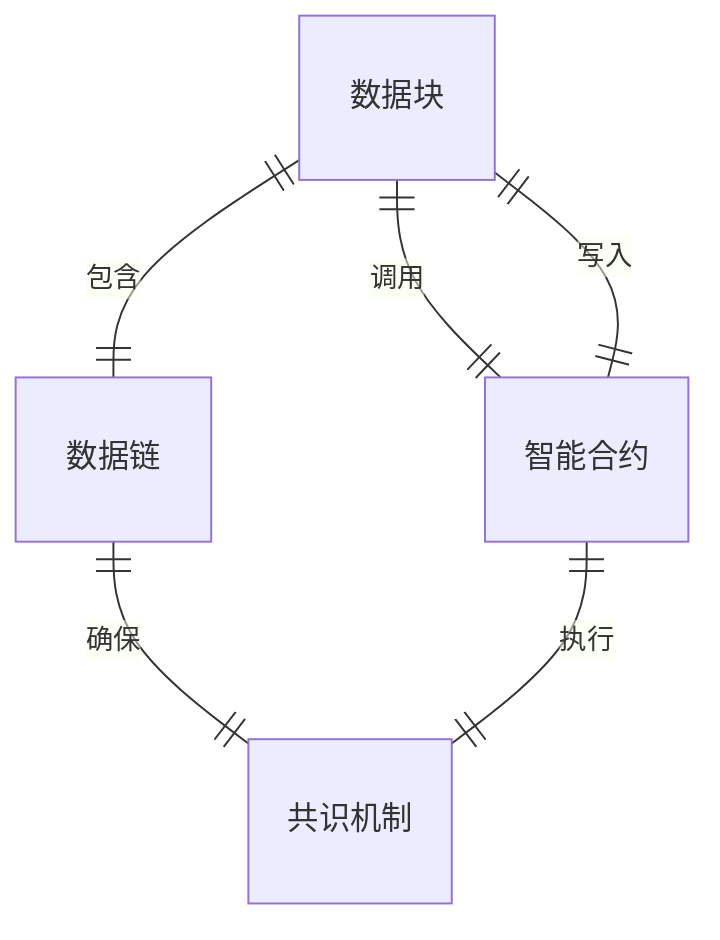
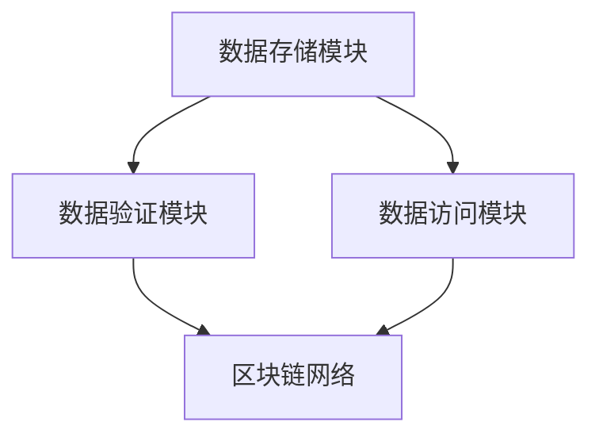
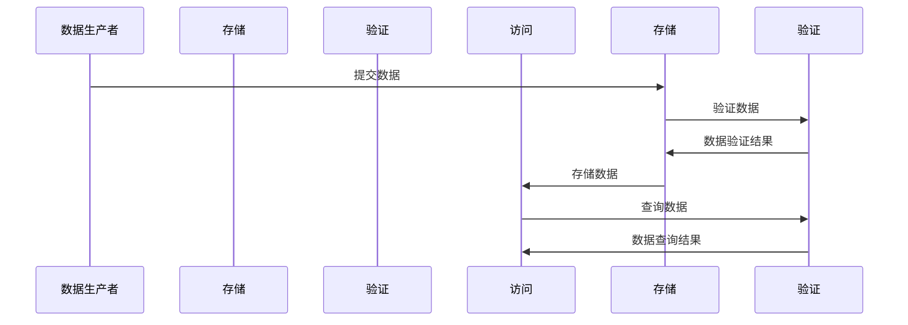

                 

# 区块链数据存储技术

> 关键词：区块链、数据存储、Merkle树、哈希算法、安全模型

> 摘要：本文深入探讨了区块链数据存储技术，从背景、核心概念、算法原理、数学模型、系统分析与架构设计、项目实战等方面进行详细阐述，旨在为读者提供一个全面而深入的理解。

### 第1章：区块链数据存储技术概述

#### 1.1 区块链与数据存储技术背景

##### 1.1.1 区块链技术发展历程

区块链技术起源于2008年比特币的提出，随后迅速发展，并在金融、供应链管理、智能合约等多个领域得到广泛应用。区块链技术的核心特点包括去中心化、不可篡改、透明性等。

- **区块链的起源**：比特币白皮书《比特币：一种点对点的电子现金系统》提出了区块链概念。
- **区块链技术的主要特点**：去中心化、分布式账本、安全性和透明性。
- **区块链技术在我国的应用现状与发展趋势**：我国积极推动区块链技术的研发和应用，已出台多项政策支持区块链产业发展。

##### 1.1.2 数据存储技术概述

数据存储技术是信息技术领域的重要分支，随着数据量的爆发式增长，数据存储技术也在不断演进。

- **数据存储技术的发展历程**：从磁盘存储到分布式存储系统，再到云存储。
- **常见的数据存储技术及其优缺点**：
  - 磁盘存储：可靠性高，但扩展性差。
  - 分布式存储系统：高扩展性，但管理复杂。
  - 云存储：便捷性高，但安全性需关注。
- **数据存储技术面临的挑战与机遇**：数据安全、数据隐私、数据冗余和存储效率等问题。

##### 1.1.3 区块链数据存储的重要性

区块链数据存储技术在数据安全性、数据完整性等方面具有显著优势，具有重要的应用价值和前景。

- **区块链数据存储的优势**：去中心化、不可篡改、分布式存储。
- **区块链数据存储的应用场景**：金融、供应链管理、物联网等。
- **区块链数据存储的未来发展方向**：智能合约、跨链技术、数据隐私保护等。

#### 1.2 核心概念与联系

##### 1.2.1 区块链核心概念

- **区块**：区块链的基本组成单元，包含一定数量的交易记录。
- **链式结构**：通过哈希链接各个区块，形成一条链。
- **智能合约**：自动化执行合同条款的计算机程序。
- **共识机制**：确保区块链网络中各个节点对数据的共识。

##### 1.2.2 数据存储核心概念

- **数据库**：用于存储和管理数据的系统。
- **文件系统**：用于管理计算机文件和目录的系统。
- **分布式存储系统**：通过多个节点实现数据存储和管理的系统。

##### 1.2.3 区块链数据存储的ER实体关系图架构



#### 1.3 算法原理讲解

##### 1.3.1 Merkle树算法原理

- **Merkle树的结构与工作原理**：Merkle树是一种哈希树结构，用于高效验证数据块的完整性。
- **Merkle树的优点与适用场景**：高效、安全，适用于大规模数据的验证。
- **Merkle树的Python实现**：实现一个简单的Merkle树算法。

```python
import hashlib

def hash_data(data):
    return hashlib.sha256(data.encode('utf-8')).hexdigest()

def merkle_tree(leaves):
    while len(leaves) > 1:
        pairs = [hash_data(leaves[i] + leaves[i+1]) for i in range(0, len(leaves)-1, 2)]
        leaves = pairs
    return leaves[0]

data = ["apple", "banana", "cherry", "date", "elderberry"]
merkle_root = merkle_tree(data)
print("Merkle Root:", merkle_root)
```

##### 1.3.2 哈希算法原理

- **哈希算法的定义与分类**：哈希算法是将任意长度的输入数据映射为固定长度的输出数据的算法。
- **哈希算法的原理与优缺点**：快速计算、抗逆向工程、冲突问题。
- **哈希算法的Python实现**：实现一个简单的哈希函数。

```python
def simple_hash(string):
    return sum(ord(char) for char in string) % 256

input_string = "hello world"
hash_value = simple_hash(input_string)
print("Hash Value:", hash_value)
```

#### 1.4 数学模型和数学公式

##### 1.4.1 区块链数据存储的安全模型

$$
安全模型 = f(共识机制，加密算法，数据验证算法)
$$

##### 1.4.2 数据冗余度与存储效率

$$
存储效率 = \frac{有效数据量}{总存储量}
$$

##### 1.4.3 数据访问速度与网络延迟

$$
访问速度 = \frac{数据传输量}{网络延迟}
$$

#### 1.5 系统分析与架构设计方案

##### 1.5.1 问题场景介绍

- **区块链数据存储的需求与挑战**：高安全性、高可用性、数据一致性、数据完整性等。

##### 1.5.2 系统功能设计

- **数据存储模块**：负责数据块的存储和管理。
- **数据验证模块**：负责验证数据块的完整性和正确性。
- **数据访问模块**：负责对外提供数据访问接口。

##### 1.5.3 系统架构设计



##### 1.5.4 系统接口设计

- **数据存储接口**：提供数据块的存储功能。
- **数据验证接口**：提供数据块的验证功能。
- **数据访问接口**：提供数据块的查询功能。

##### 1.5.5 系统交互



#### 1.6 项目实战

##### 1.6.1 环境安装

- **安装必要的软件与工具**：例如Go语言、区块链框架等。

##### 1.6.2 系统核心实现源代码

- **数据存储模块源代码**：实现数据块的存储功能。
- **数据验证模块源代码**：实现数据块的验证功能。
- **数据访问模块源代码**：实现数据块的查询功能。

##### 1.6.3 代码应用解读与分析

- **对关键代码进行解读与分析**：例如数据块的存储、验证和查询流程。

##### 1.6.4 实际案例分析和详细讲解剖析

- **分析实际案例**：例如金融行业的区块链数据存储应用。
- **详细讲解剖析**：区块链数据存储技术在实际应用中的优势和挑战。

##### 1.6.5 项目小结

- **总结项目经验与收获**：例如在项目开发中遇到的问题和解决方法。

#### 1.7 最佳实践 Tips、小结、注意事项、拓展阅读等内容

- **提供最佳实践建议**：例如数据存储模块的设计原则。
- **总结本章内容**：回顾区块链数据存储技术的主要内容和关键点。
- **指出注意事项**：例如数据安全的重要性。
- **推荐拓展阅读资源**：例如相关的学术论文和技术博客。

### 第2章：区块链数据存储技术原理

#### 2.1 区块链数据存储技术基础

##### 2.1.1 区块链数据存储原理

- **区块链数据存储的工作流程**：
  1. 数据收集：将交易数据组织成区块。
  2. 数据验证：通过共识机制验证区块的有效性。
  3. 数据存储：将验证通过的区块添加到区块链中。
  4. 数据检索：通过哈希索引查询区块链数据。

- **区块链数据存储的数据结构**：
  - **区块**：包含一定数量的交易记录。
  - **链式结构**：通过哈希链接各个区块，形成一条链。
  - **Merkle树**：用于高效验证区块数据的完整性。

##### 2.1.2 区块链数据存储协议

- **区块链数据存储协议的分类**：
  - **公有链**：任何人都可以参与，例如比特币、以太坊。
  - **私有链**：特定组织或团体内部使用，例如企业内部区块链。

- **常见区块链数据存储协议的介绍**：
  - **比特币**：基于UTXO模型，每个交易输入和输出都是未花费的交易输出。
  - **以太坊**：基于账户模型，支持智能合约，使用以太币作为燃料。

##### 2.1.3 区块链数据存储的安全机制

- **加密算法在区块链数据存储中的应用**：
  - **哈希算法**：用于生成唯一的交易标识。
  - **数字签名**：用于保证交易数据的真实性和完整性。
  - **加密通信**：确保区块链网络中的数据传输安全。

- **共识机制在区块链数据存储中的作用**：
  - **工作量证明（PoW）**：通过计算工作证明共识。
  - **权益证明（PoS）**：通过持有代币证明权益。
  - **委托权益证明（DPoS）**：通过投票产生共识。

#### 2.2 区块链数据存储技术核心原理

##### 2.2.1 Merkle树算法原理

- **Merkle树的结构与工作原理**：
  - **Merkle树**：一种哈希树结构，用于高效验证数据块的完整性。
  - **工作原理**：将数据块中的每个交易哈希值作为叶子节点，通过递归方式构建Merkle树，最终生成根哈希值。

- **Merkle树的优点与适用场景**：
  - **优点**：高效、安全，能够快速验证大量数据的完整性。
  - **适用场景**：区块链数据存储、分布式存储系统、数据完整性验证等。

- **Merkle树的Python实现**：

```python
import hashlib

def hash_data(data):
    return hashlib.sha256(data.encode('utf-8')).hexdigest()

def merkle_tree(leaves):
    while len(leaves) > 1:
        pairs = [hash_data(leaves[i] + leaves[i+1]) for i in range(0, len(leaves)-1, 2)]
        leaves = pairs
    return leaves[0]

data = ["apple", "banana", "cherry", "date", "elderberry"]
merkle_root = merkle_tree(data)
print("Merkle Root:", merkle_root)
```

##### 2.2.2 哈希算法原理

- **哈希算法的定义与分类**：
  - **定义**：哈希算法是一种将任意长度的输入数据映射为固定长度输出数据的算法。
  - **分类**：根据输出长度，分为单哈希算法（例如MD5、SHA-1）和多哈希算法（例如SHA-256、SHA-3）。

- **哈希算法的原理与优缺点**：
  - **原理**：通过一系列复杂的数学运算，将输入数据转化为固定长度的哈希值。
  - **优点**：快速计算、抗逆向工程、固定长度输出。
  - **缺点**：可能存在哈希冲突问题。

- **哈希算法的Python实现**：

```python
import hashlib

def hash_data(data):
    return hashlib.sha256(data.encode('utf-8')).hexdigest()

input_string = "hello world"
hash_value = hash_data(input_string)
print("Hash Value:", hash_value)
```

##### 2.2.3 安全模型

- **区块链数据存储的安全模型**：

$$
安全模型 = f(共识机制，加密算法，数据验证算法)
$$

- **共识机制**：确保区块链网络中的数据一致性和安全性。
- **加密算法**：用于保护数据的安全性和隐私性。
- **数据验证算法**：用于验证数据的完整性和正确性。

##### 2.2.4 数据冗余度与存储效率

- **数据冗余度**：指存储数据中重复数据所占的比例。
- **存储效率**：指存储系统在处理数据时的效率。

$$
存储效率 = \frac{有效数据量}{总存储量}
$$

- **提高存储效率的方法**：数据去重、压缩存储、分布式存储等。

##### 2.2.5 数据访问速度与网络延迟

- **数据访问速度**：指访问数据的速度。
- **网络延迟**：指数据在网络中传输的时间。

$$
访问速度 = \frac{数据传输量}{网络延迟}
$$

- **提高数据访问速度的方法**：优化网络传输协议、增加网络带宽、缓存机制等。

### 第3章：区块链数据存储技术应用

#### 3.1 区块链数据存储技术在金融领域的应用

- **数字货币**：区块链数据存储技术是数字货币的核心技术之一，如比特币、以太坊等。
- **跨境支付**：通过区块链数据存储技术，可以实现快速、低成本的跨境支付。
- **智能合约**：在金融领域，智能合约可以自动执行合同条款，提高交易效率。

#### 3.2 区块链数据存储技术在供应链管理中的应用

- **供应链追溯**：区块链数据存储技术可以实现对供应链中每个环节的实时跟踪和监控。
- **供应链金融**：通过区块链数据存储技术，可以实现供应链金融的快速审批和高效融资。

#### 3.3 区块链数据存储技术在物联网中的应用

- **设备数据管理**：区块链数据存储技术可以实现对物联网设备数据的分布式存储和管理。
- **设备身份验证**：通过区块链数据存储技术，可以实现设备身份的验证和授权。

#### 3.4 区块链数据存储技术在版权保护中的应用

- **版权登记**：区块链数据存储技术可以实现对版权的登记和保护。
- **版权交易**：通过区块链数据存储技术，可以实现版权的快速交易和确权。

### 第4章：区块链数据存储技术发展趋势与挑战

#### 4.1 区块链数据存储技术发展趋势

- **去中心化**：未来区块链数据存储技术将更加去中心化，提高数据存储的安全性和可靠性。
- **跨链技术**：区块链数据存储技术将实现跨链交互，促进不同区块链之间的数据共享和协同。
- **数据隐私保护**：随着数据隐私保护意识的提高，区块链数据存储技术将加强对数据隐私的保护。

#### 4.2 区块链数据存储技术挑战

- **数据安全性**：区块链数据存储技术需要进一步提高数据安全性，防止数据泄露和篡改。
- **性能优化**：区块链数据存储技术需要优化性能，提高数据访问速度和存储效率。
- **标准化**：区块链数据存储技术需要制定统一的标准，促进技术的广泛应用和互操作。

### 第5章：区块链数据存储技术实践与案例分析

#### 5.1 区块链数据存储技术实践

- **环境搭建**：介绍如何搭建区块链数据存储技术的开发环境。
- **系统设计**：介绍区块链数据存储技术的系统设计和架构设计。
- **代码实现**：介绍区块链数据存储技术的核心代码实现。

#### 5.2 区块链数据存储技术案例分析

- **金融行业应用**：分析区块链数据存储技术在金融行业的实际应用案例。
- **供应链管理应用**：分析区块链数据存储技术在供应链管理中的实际应用案例。
- **物联网应用**：分析区块链数据存储技术在物联网中的实际应用案例。

### 第6章：总结与展望

- **总结**：回顾区块链数据存储技术的主要内容和关键点。
- **展望**：探讨区块链数据存储技术的未来发展前景和应用趋势。

### 附录：相关资源与推荐阅读

- **学术资源**：推荐相关的学术论文和研究报告。
- **技术博客**：推荐相关的技术博客和博客文章。
- **开源项目**：推荐相关的开源项目和开源代码。

### 作者信息

- **作者**：AI天才研究院/AI Genius Institute & 禅与计算机程序设计艺术 /Zen And The Art of Computer Programming

---

**注意事项**：

- 本文档中的示例代码仅为演示目的，实际应用中需要根据具体情况进行调整和优化。
- 本文档中的数据和示例仅供参考，不构成任何投资建议或指导。
- 本文档中的内容仅代表作者个人观点，不代表任何机构或组织的观点。

---

**拓展阅读**：

- **《区块链技术指南》**：详细介绍了区块链技术的原理、应用和实现。
- **《智能合约设计与实现》**：讲解了智能合约的设计原则和实现方法。
- **《区块链技术与应用》**：分析了区块链技术在各个领域的应用案例。

---

**版权声明**：

- 本文档中的内容受版权保护，未经授权不得复制、传播或用作商业用途。
- 如需引用或转载，请联系作者获取授权。

