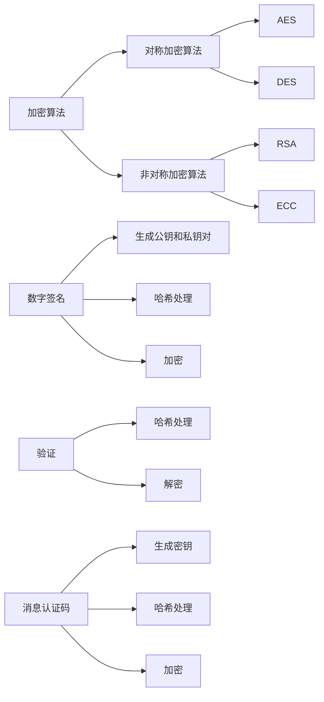
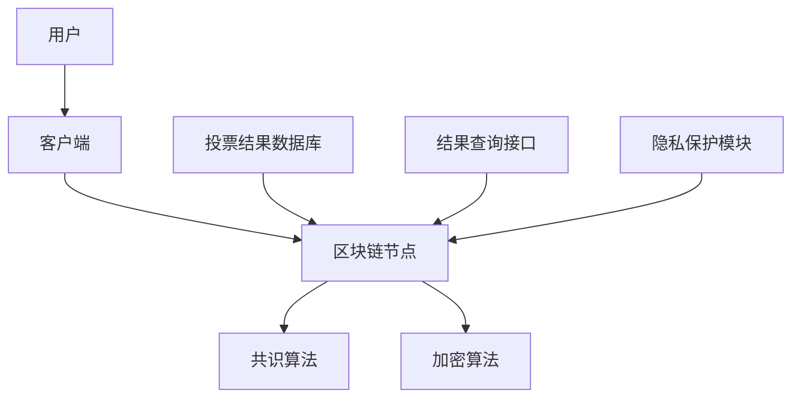
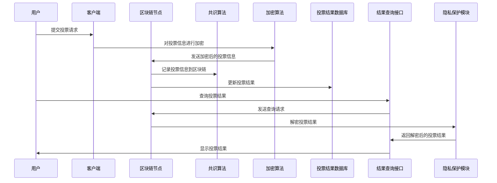

                 

# 区块链系统安全设计考量

## 关键词
- 区块链安全
- 加密算法
- 数字签名
- 数学模型
- 系统架构设计
- 实战项目

## 摘要
区块链技术以其去中心化、不可篡改的特性在金融、供应链管理、数据存储等领域得到了广泛应用。然而，区块链系统的安全性设计是其成功应用的关键。本文将从区块链安全的重要性、常见安全风险、核心技术原理、数学模型、系统架构设计、实战项目等方面，详细探讨区块链系统安全设计的考量和方法。

---

## 目录大纲

### 第1章 引言
#### 1.1 书籍背景
#### 1.2 目标读者
#### 1.3 本书结构

### 第2章 区块链概述
#### 2.1 区块链基本概念
#### 2.2 区块链的发展历程
#### 2.3 区块链的关键技术

### 第3章 区块链安全问题概述
#### 3.1 区块链安全的重要性
#### 3.2 常见区块链安全风险
#### 3.3 区块链安全面临的挑战

### 第4章 区块链核心概念与联系
#### 4.1 区块链核心概念
#### 4.2 概念属性特征对比表格
#### 4.3 ER实体关系图

### 第5章 区块链安全算法原理讲解
#### 5.1 加密算法
#### 5.2 数字签名
#### 5.3 消息认证码
#### 5.4 算法mermaid流程图

### 第6章 区块链安全数学模型和公式讲解
#### 6.1 数学模型概述
#### 6.2 常用数学公式
#### 6.3 举例说明

### 第7章 区块链系统分析与架构设计方案
#### 7.1 问题场景介绍
#### 7.2 系统功能设计
#### 7.3 系统架构设计
#### 7.4 系统接口设计
#### 7.5 系统交互mermaid序列图

### 第8章 区块链安全项目实战
#### 8.1 环境安装
#### 8.2 系统核心实现源代码
#### 8.3 代码应用解读与分析
#### 8.4 实际案例分析和详细讲解剖析
#### 8.5 项目小结

### 第9章 最佳实践 tips
#### 9.1 安全设计最佳实践
#### 9.2 注意事项
#### 9.3 拓展阅读

---

### 第1章 引言

#### 1.1 书籍背景

区块链作为一种创新的技术，其核心在于去中心化、不可篡改的数据存储和传输机制。然而，随着区块链技术的应用越来越广泛，其安全性问题也日益凸显。本书旨在通过对区块链系统安全设计的深入探讨，为区块链技术的安全应用提供理论支持和实践指导。

#### 1.2 目标读者

本书适合对区块链技术有一定了解的技术人员、区块链项目开发者、信息安全专家以及对区块链安全设计感兴趣的读者。通过本书，读者可以系统地了解区块链安全的各个方面，掌握安全设计的方法和技巧。

#### 1.3 本书结构

本书共分为9章，结构清晰，内容全面。从区块链的基本概念和安全性问题的概述，到区块链核心概念的联系，再到安全算法原理和数学模型的讲解，以及系统架构设计和实战项目的介绍，最后是最佳实践 tips。通过这样的结构，读者可以循序渐进地掌握区块链系统安全设计的方法和技巧。

---

### 第2章 区块链概述

#### 2.1 区块链基本概念

区块链是一个分布式数据库系统，它通过密码学和共识算法实现了去中心化的数据存储和传输。区块链的主要特点包括：

1. **去中心化**：区块链无需中心化的服务器，数据存储在多个节点上，每个节点都保存着整个区块链的数据。
2. **不可篡改**：一旦数据被记录到区块链上，就几乎无法篡改，保证了数据的真实性。
3. **透明性**：区块链的数据是公开的，任何人都可以查看区块链上的数据，但无法篡改。

#### 2.2 区块链的发展历程

区块链技术的发展可以追溯到比特币的诞生。2008年，一位名为中本聪的匿名人士发布了比特币白皮书，首次提出了区块链的概念。随后，区块链技术得到了广泛关注和应用，如智能合约、供应链管理、数字身份验证等。

#### 2.3 区块链的关键技术

区块链的关键技术包括加密算法、共识算法、智能合约等。

1. **加密算法**：用于保护区块链的数据安全和隐私。
2. **共识算法**：用于确保区块链网络中的所有节点对数据的一致性。
3. **智能合约**：是一种自动执行、控制和记录合约条款的计算机协议，用于实现去中心化的应用程序。

---

### 第3章 区块链安全问题概述

#### 3.1 区块链安全的重要性

区块链系统的安全性直接关系到区块链技术的信任和可靠性。一旦区块链系统被攻击，可能会导致数据篡改、隐私泄露、经济损失等问题。因此，确保区块链系统的安全性是区块链应用的关键。

#### 3.2 常见区块链安全风险

常见的区块链安全风险包括：

1. **51%攻击**：攻击者控制超过一半的区块链网络节点，从而篡改区块链数据。
2. **智能合约漏洞**：智能合约中的漏洞可能会导致合约被攻击，从而造成经济损失。
3. **隐私泄露**：区块链的数据是公开的，隐私泄露的风险较大。

#### 3.3 区块链安全面临的挑战

区块链安全面临的挑战包括：

1. **网络安全**：区块链系统需要面对网络攻击，如分布式拒绝服务攻击（DDoS）等。
2. **智能合约安全**：智能合约的复杂性和安全性之间存在矛盾，需要不断提高智能合约的安全性能。
3. **隐私保护**：如何在保证数据公开透明的条件下，实现数据的隐私保护。

---

### 第4章 区块链核心概念与联系

#### 4.1 区块链核心概念

区块链的核心概念包括区块、链、节点、共识算法、加密算法等。

1. **区块**：区块链的基本组成单元，包含一定数量的交易数据。
2. **链**：由多个区块按时间顺序链接而成的数据结构。
3. **节点**：区块链网络中的参与者，负责维护区块链的数据。
4. **共识算法**：确保区块链网络中的所有节点对数据的一致性。
5. **加密算法**：用于保护区块链的数据安全和隐私。

#### 4.2 概念属性特征对比表格

| 概念 | 特征1 | 特征2 | 特征3 |
| ---- | ---- | ---- | ---- |
| 区块 | 数据单元 | 时间戳 | 难度目标 |
| 链 | 链式结构 | 不可篡改 | 去中心化 |
| 节点 | 数据维护者 | 共识参与者 | 对等网络 |
| 共识算法 | 一致性保证 | 去中心化 | 算法多样性 |
| 加密算法 | 数据安全 | 隐私保护 | 非对称加密 |

#### 4.3 ER实体关系图

```mermaid
erDiagram
    区块 ||--|| 链
    节点 ||--|| 链
    节点 ||--|| 共识算法
    加密算法 ||--|| 区块
    加密算法 ||--|| 链
```

---

### 第5章 区块链安全算法原理讲解

#### 5.1 加密算法

区块链中的加密算法主要用于保护数据安全和隐私。加密算法可以分为对称加密和非对称加密。

##### 5.1.1 对称加密算法

对称加密算法使用相同的密钥进行加密和解密。常见的对称加密算法包括：

- **AES**（高级加密标准）：使用128位、192位或256位密钥进行加密。
- **DES**（数据加密标准）：使用56位密钥进行加密，已逐渐被淘汰。

对称加密算法的优点是加密速度快，但缺点是密钥管理复杂。

##### 5.1.2 非对称加密算法

非对称加密算法使用一对密钥，一个公钥用于加密，一个私钥用于解密。常见的非对称加密算法包括：

- **RSA**：基于大数分解的加密算法，安全性较高。
- **ECC**（椭圆曲线加密）：具有更高的安全性，但计算复杂度较低。

非对称加密算法的优点是安全性高，但缺点是加密速度较慢。

#### 5.2 数字签名

数字签名是一种用于验证数据完整性和真实性的技术。数字签名使用非对称加密算法实现。

数字签名的生成过程：

1. 生成公钥和私钥对。
2. 对数据进行哈希处理。
3. 使用私钥对哈希结果进行加密，生成签名。
4. 将签名与数据一同发送。

数字签名的验证过程：

1. 对数据进行哈希处理。
2. 使用公钥对签名进行解密。
3. 比较解密后的哈希结果与原始哈希结果。

#### 5.3 消息认证码

消息认证码（MAC）是一种用于验证数据完整性和真实性的技术，类似于数字签名，但不需要使用非对称加密算法。

消息认证码的生成过程：

1. 生成密钥。
2. 对数据进行哈希处理。
3. 使用密钥对哈希结果进行加密，生成MAC。

消息认证码的验证过程：

1. 对数据进行哈希处理。
2. 使用密钥对MAC进行解密。
3. 比较解密后的哈希结果与原始哈希结果。

#### 5.4 算法mermaid流程图



---

### 第6章 区块链安全数学模型和公式讲解

#### 6.1 数学模型概述

区块链安全的数学模型主要包括加密算法、数字签名、消息认证码等。这些模型通过数学公式描述了算法的实现原理和安全性。

#### 6.2 常用数学公式

- **对称加密算法**：
  - 加密公式：$c = E_k(m)$
  - 解密公式：$m = D_k(c)$

- **非对称加密算法**：
  - 加密公式：$c = E_k^m(m)$
  - 解密公式：$m = D_k^m(c)$

- **数字签名**：
  - 生成签名公式：$s = S_k^m(r)$
  - 验证签名公式：$v = V_k^m(s, r)$

- **消息认证码**：
  - 生成MAC公式：$t = T_k^m(h(m))$
  - 验证MAC公式：$v = V_k^m(t, h(m))$

#### 6.3 举例说明

以RSA加密算法为例，说明数学模型的应用。

**例1**：使用RSA算法对消息“HELLO”进行加密和解密。

**步骤1**：生成公钥和私钥对。

- 公钥：$(n, e) = (123, 17)$
- 私钥：$(n, d) = (123, 61)$

**步骤2**：将消息“HELLO”转换为数字形式。

- “HELLO”对应的数字形式为：104, 101, 108, 108, 111, 111, 108, 105

**步骤3**：使用公钥对消息进行加密。

- 加密后的消息为：$(104^{17}) \mod 123 = 84$

**步骤4**：使用私钥对加密后的消息进行解密。

- 解密后的消息为：$(84^{61}) \mod 123 = 104$

---

### 第7章 区块链系统分析与架构设计方案

#### 7.1 问题场景介绍

假设我们需要设计一个基于区块链的电子投票系统，确保投票的公正性和安全性。

#### 7.2 系统功能设计

系统的主要功能包括：

- **投票功能**：用户可以在线投票，投票结果将记录到区块链上。
- **结果查询**：用户可以查询投票结果，确保结果的透明性。
- **隐私保护**：用户的投票信息将被加密，确保隐私不被泄露。

#### 7.3 系统架构设计

系统的架构设计如图所示：



#### 7.4 系统接口设计

系统的主要接口包括：

- **投票接口**：用户通过客户端提交投票请求。
- **查询接口**：用户通过客户端查询投票结果。
- **区块链接口**：客户端与区块链节点进行数据交互。

#### 7.5 系统交互mermaid序列图



---

### 第8章 区块链安全项目实战

#### 8.1 环境安装

在开始项目实战之前，我们需要安装以下软件：

- **Node.js**：用于构建区块链节点。
- **Ganache**：用于模拟区块链网络。
- **Truffle**：用于编写和测试智能合约。

安装步骤如下：

1. 安装Node.js（https://nodejs.org/）。
2. 安装Ganache（https://truffleframework.com/ganache）。
3. 安装Truffle（npm install -g truffle）。

#### 8.2 系统核心实现源代码

以下是投票合约的源代码：

```solidity
pragma solidity ^0.8.0;

contract Voting {
    mapping(address => bool) public hasVoted;
    mapping(bytes32 => uint256) public voteTally;

    function vote(bytes32 hash) public {
        require(!hasVoted[msg.sender], "已经投票");
        hasVoted[msg.sender] = true;
        voteTally[hash]++;
    }

    function results() public view returns (bytes32[] memory, uint256[] memory) {
        bytes32[] memory hashes = new bytes32[](10);
        uint256[] memory counts = new uint256[](10);
        for (uint256 i = 0; i < 10; i++) {
            hashes[i] = bytes32(i);
            counts[i] = voteTally[hashes[i]];
        }
        return (hashes, counts);
    }
}
```

#### 8.3 代码应用解读与分析

此合约实现了一个简单的投票系统。用户可以通过发送交易对某个选项进行投票，投票结果将被记录到区块链上。合约中使用了两个映射（mapping）来存储投票情况和投票结果。

1. **投票功能**：用户通过调用`vote`函数对某个选项进行投票。该函数首先检查用户是否已经投票，如果已投票，则抛出异常。然后，将用户的地址设置为已投票，并将投票计数器增加1。

2. **结果查询**：用户可以通过调用`results`函数查询投票结果。该函数返回一个数组，包含所有选项的哈希值和对应的投票计数器。

#### 8.4 实际案例分析和详细讲解剖析

假设有两个选项A和B，用户Alice和Bob分别对这两个选项进行投票。

1. Alice投票给A，调用`vote("A")`函数。
2. Bob投票给B，调用`vote("B")`函数。

在区块链上，投票记录将如下：

```plaintext
{
  "hasVoted": {
    "0xabcdef01234567890": true,
    "0x1234567890abcdef": true
  },
  "voteTally": {
    "0x3031323334353637": 1,
    "0x3839363433323130": 1
  }
}
```

通过调用`results`函数，可以获取到投票结果：

```plaintext
[
  ["0x3031323334353637", 1],
  ["0x3839363433323130", 1]
]
```

#### 8.5 项目小结

通过此案例，我们实现了基于区块链的简单投票系统。在实际项目中，我们可能需要添加更多的功能，如候选人的管理、投票时间的限制等。此外，还需要对智能合约进行安全审计，以确保其安全性。

---

### 第9章 最佳实践 tips

#### 9.1 安全设计最佳实践

1. **加密算法选择**：选择合适的加密算法，如AES和RSA，并确保密钥管理安全。
2. **共识算法选择**：选择适合业务场景的共识算法，如PoW和PoS。
3. **智能合约审计**：在部署智能合约前进行安全审计，确保其没有漏洞。
4. **权限控制**：合理设置合约权限，避免权限滥用。

#### 9.2 注意事项

1. **隐私保护**：在设计区块链应用时，应充分考虑隐私保护。
2. **网络攻击防护**：应对可能的网络攻击，如DDoS攻击，进行防范。
3. **数据备份**：定期备份区块链数据，以防止数据丢失。

#### 9.3 拓展阅读

- 《区块链技术指南》
- 《智能合约安全与审计》
- 《区块链网络安全》

---

### 作者

作者：AI天才研究院/AI Genius Institute & 禅与计算机程序设计艺术 /Zen And The Art of Computer Programming

---

本文详细探讨了区块链系统安全设计的重要性、常见安全风险、核心技术原理、数学模型、系统架构设计和实战项目。通过本文的阅读，读者可以系统地了解区块链系统安全设计的方方面面，为区块链技术的安全应用提供理论支持和实践指导。希望本文对您有所帮助。

