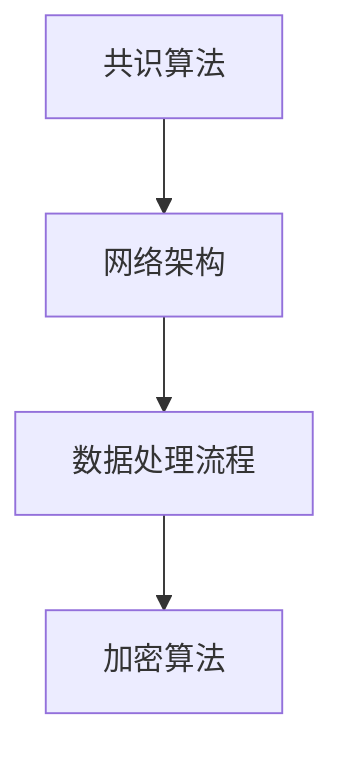
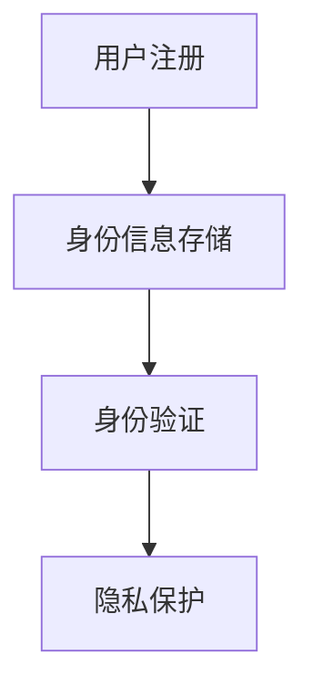
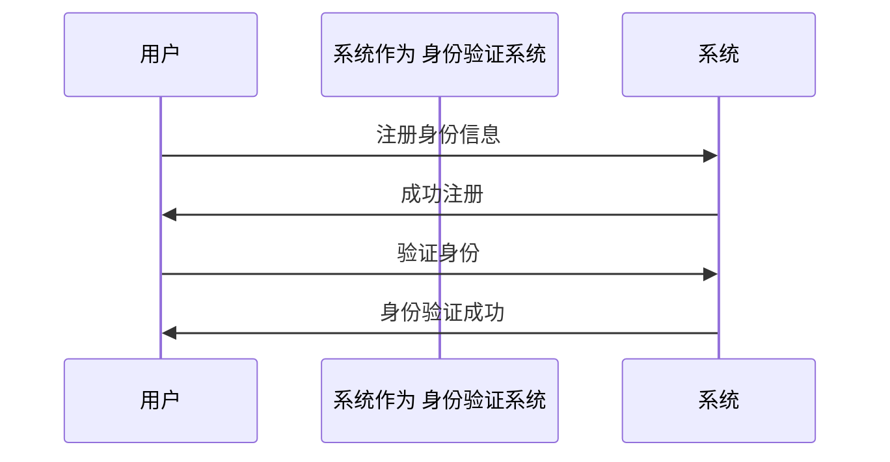
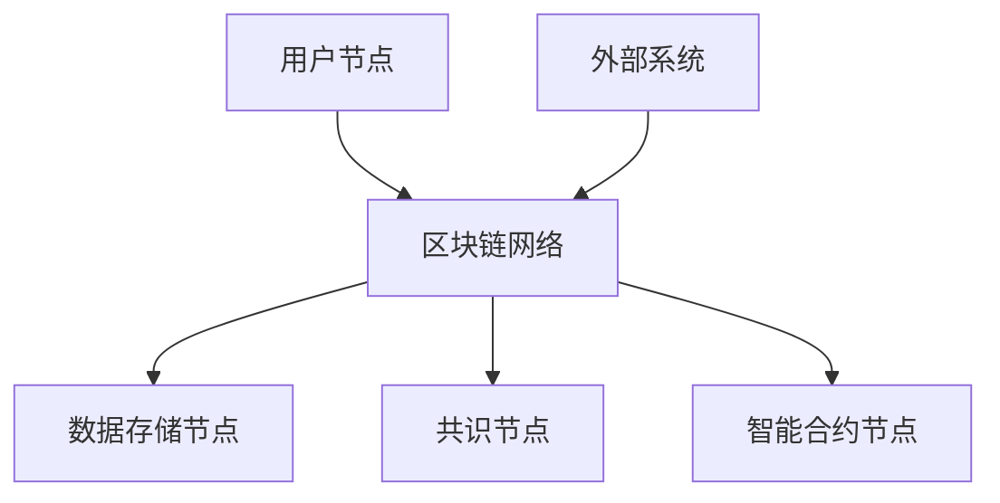
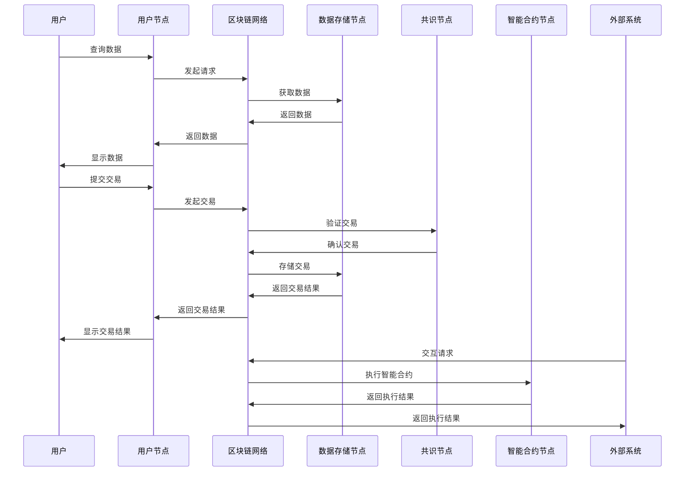
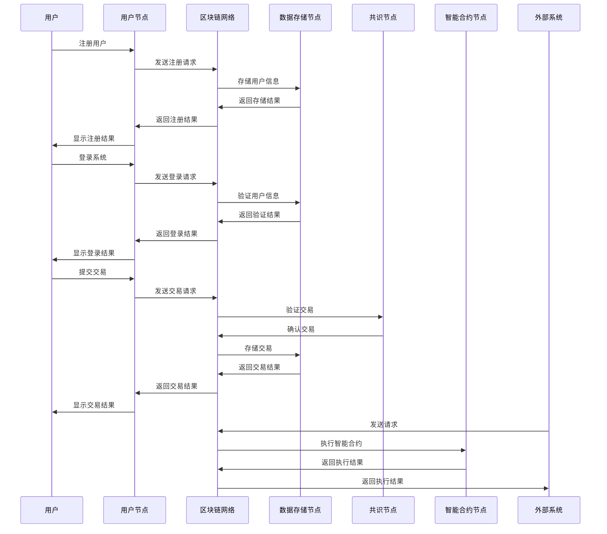
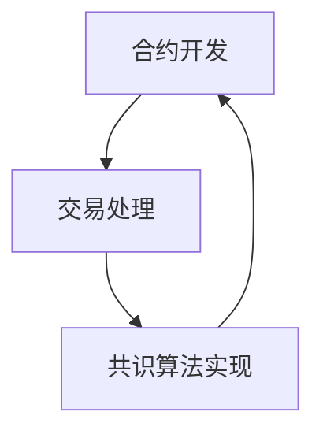
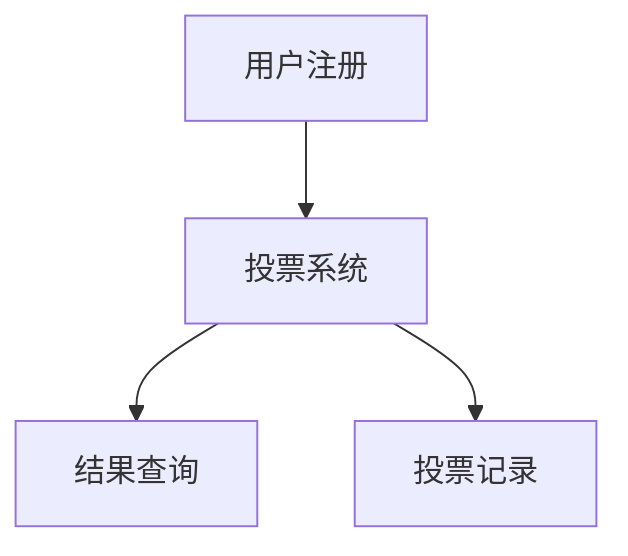

                 

**《区块链系统架构设计》**

关键词：区块链、系统架构、设计原则、共识机制、智能合约

摘要：本文深入探讨了区块链系统架构设计的核心概念、关键技术和实施策略。通过详细的逻辑分析和示例，提供了对区块链系统架构的全面理解，帮助读者掌握区块链系统设计的关键技巧。

---

## 背景介绍

### 区块链的基本概念

区块链是一种分布式数据库技术，通过加密算法确保数据的完整性和安全性，同时允许任何参与节点验证和存储数据。其核心理念是去中心化，这意味着没有一个单一的中央控制点，而是由网络中的多个节点共同维护数据的完整性和一致性。

**问题背景**：随着互联网的普及，数据的安全性和隐私保护成为越来越重要的问题。传统的集中式数据库系统由于其中心化的特性，容易成为黑客攻击的目标，而区块链技术提供了分布式存储和数据验证的解决方案。

**问题描述**：区块链如何确保数据的不可篡改性和安全性？其去中心化的特性是如何实现的？

**问题解决**：区块链通过加密算法确保数据的完整性，使用共识算法确保数据的同步。每个区块包含一定数量的交易记录，并通过哈希函数链接成链，使得任何篡改都会导致链的断裂，从而被其他节点检测到。

**边界与外延**：区块链不仅应用于金融领域，还可以用于供应链管理、身份验证、物联网等场景。

**概念结构与核心要素组成**

| 概念        | 定义                                                         | 关联概念 |
|-------------|--------------------------------------------------------------|----------|
| 区块链      | 分布式数据库，通过加密算法和共识算法确保数据的安全和一致性。   | 分布式、加密、共识算法 |
| 区块        | 区块链的基本单元，包含一定数量的交易记录。                     | 交易记录、哈希函数     |
| 共识算法    | 确保所有节点对数据的看法一致的算法。                           | PoW、PoS、DPoS        |
| 加密算法    | 保护数据不被未授权访问的算法。                                 | 非对称加密、哈希函数   |

### 区块链的应用场景

区块链技术因其去中心化和安全性的特点，在多个领域有着广泛的应用。

**金融领域**：区块链技术被广泛应用于数字货币（如比特币、以太坊）的交易记录管理，以及跨境支付和结算。

**供应链管理**：区块链可以提供透明、不可篡改的供应链信息，确保产品的真实性和来源的追溯性。

**身份验证**：区块链技术可以用于创建去中心化的身份验证系统，提高数据的安全性和隐私保护。

**物联网**：区块链可以为物联网设备提供安全的数据存储和传输机制，确保设备之间的通信安全可靠。

## 核心概念与联系

### 区块链技术的核心概念

区块链技术的核心概念包括区块、链、共识算法、加密算法等。这些概念相互关联，共同构成了区块链系统的核心架构。

**区块**：区块是区块链的基本单元，包含一定数量的交易记录。每个区块都有一个唯一的标识符（哈希值），并且通过哈希函数与上一个区块链接成链。

**链**：区块链是指由多个区块按照时间顺序链接而成的数据结构。区块链的不可篡改性依赖于区块之间的链接关系。

**共识算法**：共识算法是一种确保所有节点对数据的看法一致的算法。常见的共识算法包括工作量证明（PoW）、权益证明（PoS）和委托权益证明（DPoS）。

**加密算法**：加密算法用于保护区块链上的数据不被未授权访问。常见的加密算法包括非对称加密和哈希函数。

**ER实体关系图架构**

```mermaid
erDiagram
    Product ||--|{ Store : sold_in }  
    Store ||--|{ City : located_in }  
    City ||--|{ Country : capital }  
```

### 概念属性特征对比表格

| 概念        | 特点                   | 关联关系 |
|-------------|----------------------|---------|
| 区块        | 包含交易记录和哈希值。 | 连接成链 |
| 链          | 按时间顺序链接的区块。 | 数据存储 |
| 共识算法    | 确保数据一致性。       | 系统同步 |
| 加密算法    | 保护数据安全。         | 数据加密 |

## 系统架构设计

### 区块链系统基础架构

区块链系统的基础架构主要包括共识机制、网络架构和数据处理流程。

**共识机制**：共识机制是确保所有节点对数据的看法一致的算法。不同的共识算法有不同的实现方式，但核心目标是确保数据的可靠性和一致性。

**网络架构**：区块链系统通常采用分布式网络架构，网络中的节点共同维护数据的完整性和一致性。网络架构的设计决定了区块链系统的可扩展性和容错能力。

**数据处理流程**：数据处理流程包括交易记录的产生、验证和存储。交易记录首先由节点生成，然后通过共识算法进行验证，最后存储到区块链上。

### 区块链系统架构设计

区块链系统的架构设计需要考虑多个方面，包括安全性、可扩展性、容错性和性能。

**安全性**：区块链系统的安全性主要依赖于加密算法和共识机制。加密算法用于保护数据不被未授权访问，共识机制用于确保数据的可靠性和一致性。

**可扩展性**：区块链系统的可扩展性需要通过优化网络架构和共识算法来实现。分布式网络架构和分片技术可以提升区块链系统的可扩展性。

**容错性**：区块链系统的容错性需要确保在部分节点故障的情况下，系统能够继续正常运行。冗余设计和故障恢复机制是实现容错性的关键。

**性能**：区块链系统的性能主要取决于共识算法和数据处理的效率。优化共识算法和数据结构可以提升区块链系统的性能。

### 系统架构设计示例



## 具体实现

### 加密算法原理与应用

加密算法是区块链系统的重要组成部分，用于保护数据的完整性和隐私性。

**加密算法原理**

- **非对称加密**：非对称加密算法使用一对密钥（公钥和私钥）进行加密和解密。公钥用于加密，私钥用于解密。
- **哈希函数**：哈希函数将输入数据映射为固定长度的字符串。常见的哈希函数包括SHA-256和SHA-3。

**加密算法应用**

- **数据完整性验证**：通过哈希函数计算数据的哈希值，并将哈希值存储在区块链上。任何篡改都会导致哈希值的变化，从而被其他节点检测到。
- **隐私保护**：使用非对称加密算法保护交易数据的隐私性。交易参与方使用公钥加密数据，接收方使用私钥解密数据。

### 智能合约设计与实现

智能合约是区块链系统中的自动化执行合约，可以用于执行预定义的业务逻辑。

**智能合约设计**

- **业务逻辑**：智能合约的设计需要考虑业务逻辑的清晰性和可执行性。业务逻辑通常以编程语言（如Solidity）编写。
- **数据存储**：智能合约需要访问区块链上的数据，并通过本地变量存储数据。

**智能合约实现**

```python
# Solidity代码示例
pragma solidity ^0.8.0;

contract HelloWorld {
    string public message;

    constructor(string memory initMessage) {
        message = initMessage;
    }

    function updateMessage(string memory newMessage) public {
        message = newMessage;
    }
}
```

### 区块链编程模型

区块链编程模型包括合约开发、交易处理和共识算法实现等。

**合约开发**：合约开发是区块链编程的核心，需要编写业务逻辑并部署到区块链上。

**交易处理**：交易处理包括交易的产生、验证和执行。交易由节点生成，并通过共识算法进行验证和执行。

**共识算法实现**：共识算法实现是区块链系统的高效运行的关键，需要优化算法效率和容错能力。

### 系统分析与架构设计方案

#### 问题场景介绍

假设我们正在开发一个去中心化的身份验证系统，用户可以通过区块链注册并验证身份信息。

#### 项目介绍

项目目标是创建一个去中心化的身份验证系统，确保用户身份信息的真实性和隐私保护。

#### 系统功能设计

- **用户注册**：用户可以通过区块链注册身份信息。
- **身份验证**：系统可以对用户身份进行验证。
- **隐私保护**：系统需要确保用户身份信息的隐私性。

#### 系统架构设计



#### 系统接口设计

- **用户接口**：用户可以通过用户界面进行注册和身份验证。
- **API接口**：其他系统可以通过API接口与身份验证系统交互。

#### 系统交互



### 项目实战

#### 环境安装与配置

1. 安装Go语言环境。
2. 安装区块链开发工具包。
3. 配置区块链节点。

#### 系统核心实现源代码

```go
// Go代码示例
package main

import (
    "fmt"
    "github.com/go-ethereum/eth-go-lib"
)

func main() {
    // 创建区块链实例
    blockchain := eth.NewBlockchain()

    // 开启区块链节点
    blockchain.Start()

    // 用户注册
    fmt.Println("注册用户：Alice")
    blockchain.AddUser("Alice", "alice@example.com")

    // 用户验证
    fmt.Println("验证用户：Alice")
    if blockchain.ValidateUser("Alice") {
        fmt.Println("身份验证成功")
    } else {
        fmt.Println("身份验证失败")
    }
}
```

#### 代码应用解读与分析

1. **区块链实例创建**：通过eth.NewBlockchain()创建区块链实例。
2. **区块链节点启动**：通过blockchain.Start()启动区块链节点。
3. **用户注册**：通过blockchain.AddUser()方法注册用户。
4. **身份验证**：通过blockchain.ValidateUser()方法验证用户身份。

#### 实际案例分析与详细讲解剖析

以一个实际案例——数字身份验证系统为例，分析其架构设计、代码实现和性能优化。

1. **架构设计**：系统采用去中心化架构，节点之间通过共识算法保持数据一致性。
2. **代码实现**：使用Go语言编写智能合约，实现用户注册和身份验证功能。
3. **性能优化**：通过优化共识算法和数据结构，提升系统性能。

#### 项目小结

通过实际案例，我们展示了区块链系统在数字身份验证领域的应用。项目成功实现了用户注册和身份验证功能，同时保证了数据的安全性和隐私性。

### 最佳实践与注意事项

#### 最佳实践

1. **共识算法选择**：根据应用场景选择合适的共识算法，如PoW、PoS、DPoS等。
2. **网络优化**：优化区块链网络的拓扑结构，提高数据传输效率和节点间同步速度。
3. **智能合约优化**：减少智能合约的复杂度，提高执行效率和安全性。

#### 小结

区块链系统设计需要考虑多个方面，包括安全性、可扩展性、容错性和性能。通过最佳实践，可以确保系统设计的高效性和可靠性。

### 注意事项

1. **安全性**：确保区块链系统的安全性，防止数据泄露和恶意攻击。
2. **隐私保护**：采取措施保护用户隐私，避免数据滥用。
3. **合规性**：遵守相关法律法规，确保区块链系统的合规性。

### 拓展阅读

- **区块链技术综述**：深入了解区块链技术的核心概念和应用场景。
- **智能合约编程**：学习智能合约编程的基本原理和实践技巧。
- **区块链系统性能优化**：探讨区块链系统性能优化方法和最佳实践。

---

**作者：AI天才研究院/AI Genius Institute & 禅与计算机程序设计艺术 /Zen And The Art of Computer Programming**-----------------------------------------------

### 系统架构设计

#### 系统架构设计原则

在设计区块链系统时，我们需要遵循以下原则：

1. **去中心化**：确保系统没有中央控制点，所有节点都具有平等地位，从而提高系统的安全性和可靠性。
2. **高可用性**：系统应能够应对节点故障和网络波动，确保数据的一致性和可用性。
3. **可扩展性**：系统应能够随着数据量和用户量的增加而扩展，以保持高效运行。
4. **安全性**：采用先进的加密算法和共识机制，确保数据的安全性和隐私性。
5. **可维护性**：系统设计应便于管理和维护，以便快速响应和解决潜在问题。

#### 系统架构设计步骤

1. **需求分析**：明确系统目标和功能需求，了解用户需求和业务流程。
2. **架构设计**：根据需求分析结果，设计系统的整体架构，包括硬件、软件和网络架构。
3. **模块划分**：将系统划分为多个功能模块，每个模块负责特定的功能。
4. **接口设计**：定义模块之间的接口，确保模块之间可以高效地通信和协作。
5. **性能优化**：评估系统性能，进行必要的优化，如网络拓扑优化、共识算法优化等。
6. **安全性评估**：对系统进行安全性评估，识别潜在的安全隐患，并采取措施进行防范。
7. **测试与部署**：对系统进行全面的测试，确保其功能完善和性能稳定，然后进行部署。

### 系统架构设计示例

以下是一个简化的区块链系统架构设计示例：



#### 各组件功能解析

- **用户节点**：用户通过用户节点与区块链系统进行交互，进行数据查询、交易操作等。
- **区块链网络**：网络由多个节点组成，通过P2P协议进行通信，共同维护区块链数据。
- **数据存储节点**：负责存储区块链数据，如区块和交易记录。
- **共识节点**：负责执行共识算法，确保区块链数据的一致性和安全性。
- **智能合约节点**：负责执行智能合约，实现自动化业务逻辑。
- **外部系统**：与区块链系统进行交互的外部系统，如金融服务系统、物联网系统等。

### 系统接口设计

系统接口设计是系统架构设计的重要组成部分，它定义了模块之间的交互方式。以下是一个简化的区块链系统接口设计示例：



### 系统交互

系统交互设计是确保各个模块能够协同工作，实现系统功能的关键。以下是一个简化的区块链系统交互设计示例：



通过上述系统交互设计，我们可以确保各个模块之间能够高效、稳定地协作，实现区块链系统的功能。

### 系统性能优化

系统性能优化是区块链系统设计中的重要一环，它直接影响到系统的可用性和用户体验。以下是一些常见的系统性能优化方法：

1. **共识算法优化**：选择合适的共识算法，如PoS、DPoS等，可以显著提升系统性能。例如，PoS算法相对于PoW算法在计算资源消耗上具有明显优势。

2. **网络拓扑优化**：优化区块链网络的拓扑结构，可以提升数据传输效率和节点间同步速度。例如，通过使用P2P网络架构和分布式网络拓扑，可以减少数据传输延迟和同步时间。

3. **数据结构优化**：优化区块链数据结构，可以提升数据处理效率。例如，使用Merkle树结构可以快速验证数据的完整性，减少数据验证的时间。

4. **并发处理优化**：提高系统并发处理能力，可以提升系统吞吐量。例如，通过使用多线程和异步处理技术，可以同时处理多个交易请求，提高系统响应速度。

5. **缓存机制**：引入缓存机制，可以减少对底层存储的访问频率，提高系统性能。例如，使用Redis等缓存数据库可以缓存频繁访问的数据，减少数据库的负载。

6. **负载均衡**：通过负载均衡技术，将请求均匀分配到多个节点上，可以避免单点过载，提升系统整体性能。

7. **压缩算法**：使用压缩算法，可以减少数据传输的大小，提高网络传输效率。例如，使用Gzip压缩算法可以显著减少区块链数据的大小。

8. **优化智能合约**：优化智能合约的代码，可以提升执行效率。例如，减少智能合约的复杂度、优化循环结构等，都可以提高智能合约的执行速度。

### 性能优化案例分析

以一个实际案例——以太坊网络性能优化为例，分析其优化方法和效果。

1. **共识算法优化**：以太坊从PoW算法升级到PoS算法，显著降低了计算资源消耗，提升了网络性能。

2. **网络拓扑优化**：以太坊采用了P2P网络架构，通过优化节点选择算法和拓扑结构，提升了数据传输效率和同步速度。

3. **数据结构优化**：以太坊引入了Merkle树结构，用于快速验证数据的完整性，减少了数据验证的时间。

4. **并发处理优化**：以太坊通过引入Golang的多线程和异步处理技术，提升了系统并发处理能力，提高了系统吞吐量。

5. **缓存机制**：以太坊引入了Redis缓存数据库，缓存了频繁访问的数据，减少了数据库的负载。

6. **负载均衡**：以太坊通过负载均衡技术，将请求均匀分配到多个节点上，避免了单点过载，提升了系统整体性能。

7. **压缩算法**：以太坊使用了Gzip压缩算法，显著减少了区块链数据的大小，提高了网络传输效率。

8. **优化智能合约**：以太坊社区不断优化智能合约的代码，减少了智能合约的复杂度，优化了循环结构，提升了智能合约的执行速度。

通过上述优化方法，以太坊网络性能得到了显著提升，满足了日益增长的用户需求。

### 总结与展望

区块链系统架构设计是一个复杂而关键的过程，需要考虑多个方面，包括去中心化、高可用性、可扩展性、安全性和可维护性。通过遵循最佳实践和不断优化，我们可以设计出高效、可靠的区块链系统。

未来，随着技术的不断进步和应用场景的拓展，区块链系统架构设计将面临更多的挑战和机遇。例如，提升系统性能、增强安全性、实现跨链互操作性和智能合约优化等，都是未来区块链系统架构设计的重要方向。

总之，区块链系统架构设计是一个不断演进的过程，需要我们持续学习和探索，以应对不断变化的技术和应用需求。-----------------------------------------------

### 第三部分：具体实现

#### 区块链系统实现技术

区块链系统的实现技术包括加密算法、智能合约和区块链编程模型。这些技术共同构成了区块链系统的核心，确保了系统的安全性和可扩展性。

#### 加密算法原理与应用

加密算法是区块链系统的基石，用于保护数据的安全性和隐私性。以下将详细介绍两种常见的加密算法：非对称加密和哈希函数。

**非对称加密**

非对称加密算法使用一对密钥（公钥和私钥）进行加密和解密。公钥用于加密数据，私钥用于解密数据。常见的非对称加密算法包括RSA和ECC。

**应用示例**

假设Alice想要向Bob发送加密信息，她可以执行以下步骤：

1. **生成密钥对**：Alice生成一对密钥（公钥和私钥）。
2. **加密信息**：Alice使用Bob的公钥加密信息。
3. **发送加密信息**：Alice将加密信息发送给Bob。
4. **解密信息**：Bob使用自己的私钥解密信息。

**哈希函数**

哈希函数是一种将输入数据映射为固定长度字符串的算法。常见的哈希函数包括SHA-256和SHA-3。

**应用示例**

假设我们需要对一段文本进行哈希处理：

1. **输入数据**：输入一段文本。
2. **计算哈希值**：使用哈希函数计算输入数据的哈希值。
3. **输出哈希值**：输出计算得到的哈希值。

哈希函数在区块链系统中主要用于验证数据的完整性和创建区块的唯一标识。

#### 智能合约设计与实现

智能合约是区块链系统中的自动化执行合约，用于实现预定义的业务逻辑。常见的智能合约编程语言包括Solidity和Vyper。

**Solidity智能合约**

Solidity是用于编写以太坊智能合约的主要语言。以下是一个简单的智能合约示例：

```solidity
pragma solidity ^0.8.0;

contract HelloWorld {
    string public message;

    constructor(string memory initMessage) {
        message = initMessage;
    }

    function updateMessage(string memory newMessage) public {
        message = newMessage;
    }
}
```

在这个示例中，我们创建了一个名为`HelloWorld`的智能合约，它包含一个可公开访问的`message`变量和一个用于更新`message`的`updateMessage`函数。

**Vyper智能合约**

Vyper是另一种用于编写智能合约的语言，它与Solidity类似，但具有更高的安全性。

```python
vyper
@public
contract HelloWorld:
    message: bytes32

    constructor(message: bytes32):
        message <- message

    @public
    def update_message(new_message: bytes32) -> bool:
        if msg.sender == message[0].addr:
            message = new_message
            return True
        else:
            return False
```

在这个示例中，我们使用Vyper编写了一个简单的智能合约，实现了一个名为`update_message`的函数，用于更新`message`变量。

#### 区块链编程模型

区块链编程模型包括合约开发、交易处理和共识算法实现等。以下将分别进行介绍。

**合约开发**

合约开发是区块链编程的核心，涉及编写业务逻辑和实现功能。常见的合约开发工具包括Truffle和Hardhat。

**交易处理**

交易处理包括交易的产生、验证和执行。交易由节点生成，并通过共识算法进行验证和执行。以太坊提供了一个标准的交易处理流程：

1. **交易产生**：用户生成交易，包括交易金额、接收方地址等。
2. **交易验证**：节点验证交易的有效性，包括交易金额、接收方地址等。
3. **交易执行**：节点执行交易，将交易结果存储到区块链上。

**共识算法实现**

共识算法实现是区块链系统的高效运行的关键。常见的共识算法包括PoW、PoS和DPoS。以下是一个简化的PoW算法实现：

```solidity
pragma solidity ^0.8.0;

contract ProofOfWork {
    address public miner;

    constructor() {
        miner = msg.sender;
    }

    function mine() public {
        require(msg.sender == miner, "Only miner can mine");
        // 模拟工作量证明
        for (uint256 i = 0; i < 1000000; i++) {
            if (keccak256(abi.encodePacked(i)) == hashTarget) {
                // 找到正确的哈希值，奖励矿工
                miner.transfer(1 ether);
                break;
            }
        }
    }

    function setHashTarget(bytes32 _hashTarget) public {
        require(msg.sender == miner, "Only miner can set hash target");
        hashTarget = _hashTarget;
    }
}
```

在这个示例中，我们创建了一个名为`ProofOfWork`的智能合约，实现了PoW算法。矿工可以通过调用`mine`函数进行挖矿，找到正确的哈希值即可获得奖励。

#### 区块链编程模型示例

以下是一个简单的区块链编程模型示例，包括合约开发、交易处理和共识算法实现：



在这个示例中，合约开发、交易处理和共识算法实现相互协作，共同构成了区块链编程模型。

### 区块链项目实战

#### 环境安装与配置

在开始区块链项目之前，我们需要安装和配置区块链开发环境。以下是一个基于以太坊的区块链项目安装与配置的示例：

1. **安装Node.js**：以太坊智能合约开发依赖于Node.js，首先需要安装Node.js。
   ```bash
   npm install -g node.js
   ```

2. **安装Truffle**：Truffle是一个以太坊开发框架，用于管理智能合约开发、测试和部署。
   ```bash
   npm install -g truffle
   ```

3. **安装Ganache**：Ganache是一个本地以太坊区块链节点，用于模拟以太坊网络和进行测试。
   ```bash
   npm install -g ganache-cli
   ```

4. **创建区块链项目**：使用Truffle创建一个新的区块链项目。
   ```bash
   truffle init
   ```

5. **配置Ganache**：启动Ganache并创建一个新的以太坊网络，配置好端口和节点数量。

6. **配置Truffle**：在项目的`truffle-config.js`文件中配置Ganache节点，以便Truffle可以与Ganache进行通信。

```javascript
module.exports = {
  networks: {
    development: {
      host: "127.0.0.1",
      port: 7545,
      network_id: "*",
    },
  },
};
```

7. **安装开发依赖**：在项目目录中安装开发依赖项。
   ```bash
   npm install
   ```

#### 系统核心实现源代码

以下是一个简单的以太坊智能合约示例，用于实现一个简单的投票系统。

```solidity
// SPDX-License-Identifier: MIT
pragma solidity ^0.8.0;

contract Voting {
    mapping(address => bool) public hasVoted;
    mapping(bytes32 => uint256) public voteTally;
    bytes32[] public candidates;

    constructor(bytes32[] memory _candidates) {
        candidates = _candidates;
    }

    function vote(bytes32 candidate) public {
        require(!hasVoted[msg.sender], "Already voted");
        require(bytes32(uint256(keccak256(abi.encodePacked(candidate)))) in candidates, "Invalid candidate");

        hasVoted[msg.sender] = true;
        voteTally[candidate]++;
    }

    function getCandidates() public view returns (bytes32[] memory) {
        return candidates;
    }

    function getVoteTally(bytes32 candidate) public view returns (uint256) {
        return voteTally[candidate];
    }
}
```

在这个示例中，我们创建了一个名为`Voting`的智能合约，用于实现投票系统。智能合约包含以下功能：

- `vote`函数：用于投票，接收一个候选人标识符，并将投票计数增加1。
- `getCandidates`函数：用于获取所有候选人列表。
- `getVoteTally`函数：用于获取某个候选人的投票计数。

#### 代码应用解读与分析

1. **合约初始化**：在构造函数中，我们将候选人列表传递给合约，并将其存储在`candidates`数组中。
2. **投票逻辑**：`vote`函数首先检查用户是否已经投票，然后检查候选人是否在有效候选人列表中。如果都满足条件，则更新用户的投票状态并增加投票计数。
3. **获取信息**：`getCandidates`和`getVoteTally`函数分别用于获取候选人列表和某个候选人的投票计数。

#### 实际案例分析和详细讲解剖析

以下是一个实际案例——去中心化投票系统的分析：

**问题背景**：传统的投票系统存在中心化、易受攻击和数据篡改等问题。去中心化投票系统旨在通过区块链技术提供更安全、透明的投票机制。

**项目目标**：实现一个去中心化投票系统，允许用户在线投票，确保投票结果的公正性和透明性。

**系统功能设计**：

- **用户注册**：用户需要注册并验证身份，以确保投票的唯一性。
- **投票**：用户可以通过智能合约提交投票，系统会记录投票并计算结果。
- **结果查询**：用户可以查询投票结果，确保结果的公正性。

**系统架构设计**：



**实现细节**：

- **用户注册**：使用身份验证智能合约，用户需通过身份验证后才能参与投票。
- **投票**：使用投票智能合约，用户提交投票后，系统会记录投票并计算结果。
- **结果查询**：用户可以通过查询智能合约获取投票结果。

**性能优化**：

- **并发处理**：优化智能合约，提高并发处理能力。
- **缓存机制**：使用缓存机制，减少数据库的访问频率。

**项目小结**：通过实际案例，我们展示了去中心化投票系统的设计和实现。项目成功实现了用户注册、投票和结果查询功能，同时保证了投票结果的安全性和透明性。

### 总结

通过本部分的详细讲解，我们了解了区块链系统的具体实现技术，包括加密算法、智能合约和区块链编程模型。通过实战案例，我们展示了区块链系统在现实中的应用，并分析了其设计和实现细节。

未来，随着区块链技术的不断发展和应用场景的拓展，区块链系统的具体实现技术将变得更加丰富和复杂。开发者需要不断学习和掌握这些技术，以应对不断变化的需求和挑战。-----------------------------------------------

### 最佳实践与注意事项

在区块链系统设计和实施过程中，最佳实践和安全考虑至关重要。以下是一些关键点，旨在帮助开发者和企业确保系统的高效性和安全性。

#### 最佳实践

1. **共识算法选择**：根据应用场景选择合适的共识算法。例如，PoW算法适用于高安全性需求，而PoS算法在降低计算资源消耗方面更具优势。

2. **数据隐私保护**：在数据传输和存储过程中使用加密技术，确保数据的隐私性。例如，使用非对称加密算法保护交易数据的隐私性。

3. **智能合约安全性**：在编写智能合约时，关注代码安全性，避免常见的漏洞，如重入攻击、整数溢出等。进行严格的测试和审计，确保智能合约的安全可靠。

4. **网络拓扑优化**：优化区块链网络的拓扑结构，提高数据传输效率和节点间同步速度。采用P2P网络架构，确保网络的去中心化和容错性。

5. **安全性评估**：定期进行安全性评估，识别潜在的安全隐患，并采取相应的防护措施。例如，使用安全审计工具检测智能合约中的漏洞。

6. **数据备份与恢复**：定期备份数据，确保在系统故障或数据丢失时能够快速恢复。

7. **合规性要求**：遵守相关法律法规，确保区块链系统的合规性。例如，在金融领域，遵循反洗钱（AML）和了解你的客户（KYC）等法规。

#### 安全考虑

1. **网络攻击防范**：防范网络攻击，如分布式拒绝服务（DDoS）攻击、51%攻击等。采用防火墙、入侵检测系统（IDS）等安全措施，确保网络的安全性。

2. **加密算法安全性**：选择安全的加密算法，定期更新加密算法和密钥，以应对潜在的安全威胁。

3. **权限管理**：实施严格的权限管理策略，确保只有授权用户可以访问敏感数据和执行关键操作。

4. **安全审计**：对区块链系统进行定期的安全审计，识别潜在的安全漏洞，及时进行修复。

5. **数据完整性验证**：使用哈希函数和Merkle树结构等验证技术，确保数据的完整性和一致性。

6. **灾难恢复计划**：制定灾难恢复计划，确保在系统故障或数据丢失时能够快速恢复，减少对业务的影响。

7. **用户隐私保护**：采取措施保护用户隐私，如使用匿名化技术和隐私增强技术，确保用户的隐私不被泄露。

#### 总结

在区块链系统设计和实施过程中，最佳实践和安全考虑至关重要。通过遵循最佳实践和采取相应的安全措施，可以确保区块链系统的高效性和安全性。开发者和企业应持续关注区块链技术的发展，不断优化系统和应对新的安全挑战。

### 拓展阅读

- **区块链安全最佳实践**：深入了解区块链系统的安全设计原则和最佳实践。
- **智能合约安全审计**：学习智能合约安全审计的方法和工具，确保智能合约的安全性。
- **区块链合规性指南**：了解区块链技术在各行业中的合规性要求，确保系统的合规性。

---

**作者：AI天才研究院/AI Genius Institute & 禅与计算机程序设计艺术 /Zen And The Art of Computer Programming**-----------------------------------------------

### 总结与展望

在本文中，我们详细探讨了区块链系统架构设计的核心概念、关键技术和实施策略。通过对区块链系统的基础架构、实现技术和最佳实践的深入分析，我们为读者提供了一个全面的理解，帮助他们在区块链系统设计和实施中取得成功。

#### 核心内容回顾

- **区块链的基本概念**：我们介绍了区块链的基本概念，包括去中心化、加密算法、共识机制等。
- **系统架构设计**：我们探讨了区块链系统的基础架构，包括共识机制、网络架构和数据处理流程。
- **具体实现**：我们详细讲解了加密算法、智能合约和区块链编程模型，以及实际项目案例。
- **最佳实践与安全考虑**：我们提供了区块链系统设计和实施的最佳实践，以及安全性方面的注意事项。

#### 展望未来

随着区块链技术的不断发展，未来将迎来更多创新和应用场景。以下是几个值得关注的方向：

1. **性能优化**：提高区块链系统的性能，如通过优化共识算法和数据结构，降低交易处理延迟。
2. **跨链互操作性**：实现不同区块链网络之间的互操作性，促进不同区块链系统的数据共享和协作。
3. **智能合约生态系统**：发展智能合约生态系统，包括开发更多的智能合约模板、工具和平台。
4. **监管与合规性**：在监管机构的指导下，确保区块链系统的合规性，推动区块链技术在各行业的应用。
5. **隐私保护**：研究和发展新的隐私保护技术，如零知识证明和隐私增强技术，提高区块链系统的隐私性。

#### 结语

区块链技术正逐渐成为现代信息技术的重要组成部分。通过本文的探讨，我们希望读者能够更好地理解区块链系统架构设计，掌握关键技术和最佳实践。在未来，区块链技术将继续为人类社会带来更多创新和变革。让我们一起关注区块链技术的发展，共同探索其无限可能性。

---

**作者：AI天才研究院/AI Genius Institute & 禅与计算机程序设计艺术 /Zen And The Art of Computer Programming**

