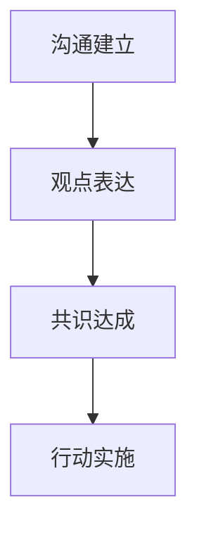
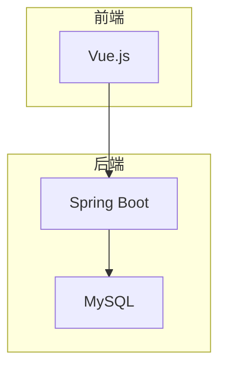
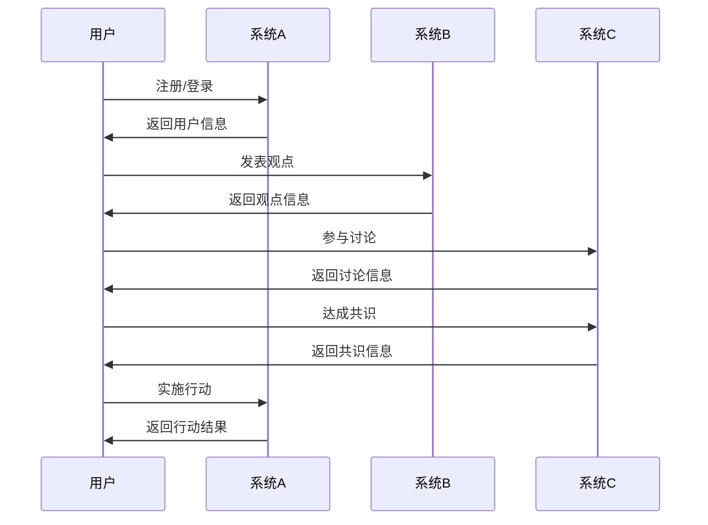

                 

# 哈贝马斯与孔子：交往行动理论与仁政思想的对话

## 关键词

- 哈贝马斯交往行动理论
- 孔子仁政思想
- 交往行动理论
- 仁政思想
- 跨文化对话
- 现代社会应用

## 摘要

本文旨在探讨哈贝马斯的交往行动理论与孔子的仁政思想，通过对比分析两者的基础、原则和应用，揭示它们在现代社会中的价值与影响。首先，我们将分别介绍哈贝马斯交往行动理论和孔子仁政思想的起源、核心概念及其发展。然后，通过对比分析，探讨两者在基本原则和实际应用中的异同。接着，我们将深入探讨交往行动理论与仁政思想在现代社会中的应用，以及它们对现代社会的影响。最后，我们将讨论哈贝马斯与孔子思想的跨文化对话意义，并提出对话的未来展望与挑战。

## 目录大纲

### 第一部分：哈贝马斯与孔子的思想基础

### 第1章：哈贝马斯交往行动理论的起源与发展

#### 1.1.1 哈贝马斯交往行动理论的背景与起源

#### 1.1.2 哈贝马斯交往行动理论的核心概念

### 第2章：孔子仁政思想的起源与演变

#### 2.1.1 孔子仁政思想的背景与起源

#### 2.1.2 孔子仁政思想的核心概念

### 第3章：哈贝马斯交往行动理论与孔子仁政思想的对比分析

#### 3.1 哈贝马斯交往行动理论与孔子仁政思想的基本原则对比

#### 3.2 哈贝马斯交往行动理论与孔子仁政思想在实际应用中的异同

### 第二部分：哈贝马斯与孔子思想的对话与实践

### 第4章：交往行动理论与仁政思想在现代社会中的应用

#### 4.1.1 交往行动理论与仁政思想在政治领域的应用

#### 4.1.2 交往行动理论与仁政思想在经济领域的应用

### 第5章：哈贝马斯与孔子思想的对话在当代社会的影响

#### 5.1 哈贝马斯与孔子思想的对话对现代社会的影响

#### 5.2 哈贝马斯与孔子思想的对话在当代文化、教育等领域的应用

### 第6章：哈贝马斯与孔子思想在跨文化对话中的意义

#### 6.1 哈贝马斯与孔子思想的跨文化对话背景

#### 6.2 哈贝马斯与孔子思想的跨文化对话案例分析

### 第7章：结论与展望

#### 7.1 哈贝马斯与孔子思想的对话总结

#### 7.2 对话的未来展望与挑战

### 第一部分：哈贝马斯与孔子的思想基础

## 第1章：哈贝马斯交往行动理论的起源与发展

### 1.1.1 哈贝马斯交往行动理论的背景与起源

哈贝马斯（Jürgen Habermas）是20世纪德国著名社会学家、哲学家，他的交往行动理论（Communicative Action Theory）起源于对西方哲学传统和社会理论的批判。哈贝马斯认为，人类社会的发展离不开交往行动，交往行动是人类社会的基础。他的理论受到了霍克海默（Max Horkheimer）、阿多诺（Theodor W. Adorno）、卢卡奇（Georg Lukács）等批判理论家的影响。

哈贝马斯交往行动理论的核心观点是，人们通过语言进行交往，这种交往不仅是信息交换，更是意义生成和理解的过程。哈贝马斯强调，交往行动具有以下特点：

1. **沟通性**：交往行动是基于沟通的行为，参与者通过语言交换观点和意见。
2. **共识性**：交往行动旨在达成共识，即参与者通过交流和讨论，共同达成对某一问题的理解。
3. **规范性**：交往行动受到一定的道德和伦理规范约束，这种规范是通过交往过程形成的。

### 1.1.2 哈贝马斯交往行动理论的核心概念

哈贝马斯交往行动理论的核心概念包括“交往理性”（communicative rationality）、“公共领域”（public sphere）和“系统”（system）。

**交往理性** 是指人们在交往过程中，通过语言表达和交流，达成对某一问题的共识。交往理性强调语言的使用应符合逻辑和语法规则，以实现有效的沟通。

**公共领域** 是指一个开放的、公共的空间，公民在这里可以自由地表达观点和意见，参与公共事务的讨论和决策。公共领域是交往行动的重要场所，它是社会民主和多元化的基石。

**系统** 是指社会的各个组成部分，如经济、政治和文化等。哈贝马斯认为，系统具有自主性，它们有自己的逻辑和运作方式，但也会对交往行动产生影响。

### 1.1.3 哈贝马斯交往行动理论的发展

哈贝马斯的交往行动理论经历了多个阶段的发展。最初，他的理论主要关注交往行动在哲学和社会科学领域中的应用。随着理论的发展，哈贝马斯开始将其应用于政治哲学、文化理论和法律理论等领域。

在政治哲学领域，哈贝马斯提出了“合法化危机”和“民主危机”的概念。他认为，现代社会面临着合法性和民主性的危机，这需要通过加强公共领域和交往行动来解决。

在文化理论领域，哈贝马斯强调了文化多样性对交往行动的影响。他认为，文化多样性是交往行动的重要资源，但同时也可能成为交往的障碍。

在法律理论领域，哈贝马斯提出了“话语民主”的概念。他认为，法律应当通过公共辩论和讨论来制定，以确保法律的有效性和合法性。

## 第2章：孔子仁政思想的起源与演变

### 2.1.1 孔子仁政思想的背景与起源

孔子（公元前551年－公元前479年），名丘，字仲尼，是中国春秋时期伟大的思想家、教育家，儒家学派的创始人。孔子的仁政思想起源于他对社会现实的深刻观察和对人类本质的深刻理解。

孔子的时代，中国正处于诸侯争霸、社会动荡的时期。他目睹了社会的不公和人民的痛苦，因此提出了仁政思想，希望通过道德教化和仁爱来治理国家，实现社会的和谐与稳定。

**仁政思想** 是孔子思想体系的核心，他认为“仁”是人类的本质，是治理国家的根本原则。孔子提出了“为政以德”的理念，主张以德治国，反对苛政和暴政。

### 2.1.2 孔子仁政思想的核心概念

孔子的仁政思想包含以下几个核心概念：

**仁**：孔子认为“仁”是人类道德的基石，是道德行为的最高原则。仁的具体表现包括“爱人”、“克己复礼”、“忠恕”等。

**礼**：礼是社会的规范和准则，是维持社会秩序和和谐的重要手段。孔子强调，礼不仅是外在的行为规范，更是内心的道德修养。

**政**：政是指国家治理，孔子主张“为政以德”，认为政治权力应当以道德为基础，以仁爱为核心。

### 2.1.3 孔子仁政思想的发展

孔子的仁政思想在中国历史上产生了深远的影响。他的思想不仅影响了当时的政治制度，也对后世的哲学、教育、文化等领域产生了重要影响。

在政治领域，孔子的仁政思想成为历代政治家的治国理念，许多统治者都提倡以德治国，实行仁政。

在教育领域，孔子提出了“有教无类”的教育理念，主张教育应该普及，使每个人都有机会接受教育，提高道德素养。

在文化领域，孔子的仁政思想成为中国文化的重要组成部分，其“仁”、“礼”、“政”的理念被广泛传承和发扬。

### 2.1.4 孔子仁政思想的特点

孔子的仁政思想具有以下几个特点：

**以人为本**：孔子认为，国家的根本在于人民，政治权力应当以人民的利益为出发点。

**道德至上**：孔子强调道德的重要性，认为政治权力应当以道德为基础。

**和谐共处**：孔子主张通过仁爱和礼教来实现社会的和谐与稳定。

**全面教育**：孔子提出了全面教育的理念，主张教育应该普及，使每个人都有机会接受教育。

## 第3章：哈贝马斯交往行动理论与孔子仁政思想的对比分析

### 3.1 哈贝马斯交往行动理论与孔子仁政思想的基本原则对比

哈贝马斯的交往行动理论和孔子的仁政思想虽然在时间和空间上相隔千年，但两者在基本原则上有许多相似之处。

**交往理性与仁**

哈贝马斯的交往行动理论强调“交往理性”，即通过语言和沟通达成共识，这类似于孔子的“仁”，强调人与人之间的和谐相处和相互理解。

**公共领域与礼**

哈贝马斯的公共领域是公民自由表达意见和参与公共事务的空间，类似于孔子的“礼”，强调社会规范和道德准则，以维持社会秩序。

**系统与政**

哈贝马斯的系统概念强调社会的各个组成部分，类似于孔子的“政”，强调国家治理和行政管理。

### 3.2 哈贝马斯交往行动理论与孔子仁政思想在实际应用中的异同

哈贝马斯的交往行动理论和孔子仁政思想在实际应用中也有许多异同。

**政治领域**

在政治领域，哈贝马斯的交往行动理论强调通过公共辩论和讨论来制定政策和法律，实现民主决策。而孔子的仁政思想则强调以德治国，通过道德教化和仁爱来治理国家。

**经济领域**

在经济领域，哈贝马斯的交往行动理论强调市场的自由竞争和社会正义，而孔子的仁政思想则强调公平和共享，反对过度贪婪和不公。

**文化领域**

在文化领域，哈贝马斯的交往行动理论强调文化多样性和文化交流，而孔子的仁政思想则强调文化传承和道德教育。

## 第二部分：哈贝马斯与孔子思想的对话与实践

### 第4章：交往行动理论与仁政思想在现代社会中的应用

#### 4.1.1 交往行动理论与仁政思想在政治领域的应用

在现代社会，哈贝马斯的交往行动理论和孔子的仁政思想在政治领域都有广泛的应用。

**哈贝马斯的交往行动理论**

哈贝马斯的交往行动理论强调通过公共辩论和讨论来实现民主决策。在现代社会，这一理论可以应用于以下几个方面：

1. **政治选举**：通过公共辩论，候选人可以表达自己的政治观点和承诺，选民可以了解候选人的立场和政策，从而做出明智的选择。

2. **政策制定**：政府可以通过公开听证会和公众咨询，收集各方意见，制定更符合民意的政策。

3. **公共事务管理**：通过公共辩论，公民可以参与公共事务的讨论和决策，提高政府的透明度和公信力。

**孔子的仁政思想**

孔子的仁政思想强调以德治国，反对苛政和暴政。在现代社会，这一思想可以应用于以下几个方面：

1. **政府道德建设**：政府官员应当以德为先，廉洁奉公，为人民服务。

2. **社会公平**：政府应当关注社会公平，减少贫富差距，实现社会的和谐与稳定。

3. **道德教育**：学校和社会应当加强道德教育，培养公民的道德素养和社会责任感。

#### 4.1.2 交往行动理论与仁政思想在经济领域的应用

在经济领域，哈贝马斯的交往行动理论和孔子的仁政思想也有许多应用。

**哈贝马斯的交往行动理论**

哈贝马斯的交往行动理论强调市场的自由竞争和社会正义。在现代社会，这一理论可以应用于以下几个方面：

1. **市场监管**：政府应当加强对市场的监管，防止垄断和不公平竞争，保护消费者权益。

2. **社会保障**：政府应当建立健全的社会保障体系，保障弱势群体的基本生活。

3. **公平贸易**：政府应当推动公平贸易，促进全球经济的可持续发展。

**孔子的仁政思想**

孔子的仁政思想强调公平和共享，反对过度贪婪和不公。在现代社会，这一思想可以应用于以下几个方面：

1. **财富分配**：政府应当关注财富分配的公平性，减少贫富差距。

2. **环境保护**：企业应当承担社会责任，保护环境，实现可持续发展。

3. **员工福利**：企业应当关注员工的福利，提高员工的工作满意度和生产力。

### 第5章：哈贝马斯与孔子思想的对话在当代社会的影响

#### 5.1 哈贝马斯与孔子思想的对话对现代社会的影响

哈贝马斯与孔子思想的对话对现代社会产生了深远的影响，主要体现在以下几个方面：

**政治领域**

1. **民主化**：哈贝马斯的交往行动理论促进了现代民主制度的发展，使政治决策更加公开、透明和民主。

2. **道德治理**：孔子的仁政思想为现代政治提供了道德治理的理念，强调政治权力应当以道德为基础，为人民服务。

**经济领域**

1. **市场化**：哈贝马斯的交往行动理论促进了市场经济的发展，强调了市场的自由竞争和社会正义。

2. **共享经济**：孔子的仁政思想为现代经济提供了共享经济的理念，强调了公平和共享的重要性。

**文化领域**

1. **文化多样性**：哈贝马斯的交往行动理论强调了文化多样性，促进了不同文化之间的交流与理解。

2. **道德教育**：孔子的仁政思想为现代文化提供了道德教育的理念，强调了道德素养和社会责任感的重要性。

#### 5.2 哈贝马斯与孔子思想的对话在当代文化、教育等领域的应用

哈贝马斯与孔子思想的对话在当代文化、教育等领域也有广泛的应用。

**文化领域**

1. **文化交流**：哈贝马斯的交往行动理论促进了不同文化之间的交流和相互理解，有助于消除文化偏见和冲突。

2. **文化创新**：孔子的仁政思想为现代文化创新提供了灵感，强调了文化传承和创新的重要性。

**教育领域**

1. **教育公平**：孔子的仁政思想为现代教育提供了公平教育的理念，强调了教育的普及和公益性。

2. **道德教育**：哈贝马斯的交往行动理论为现代教育提供了道德教育的理念，强调了道德素养和社会责任感的重要性。

## 第6章：哈贝马斯与孔子思想在跨文化对话中的意义

#### 6.1 哈贝马斯与孔子思想的跨文化对话背景

哈贝马斯与孔子思想的跨文化对话背景主要包括以下几个方面：

**全球化的推动**：全球化使得不同文化之间的交流与碰撞更加频繁，为跨文化对话提供了机会。

**文化多样性的需求**：随着文化多样性的增加，人们越来越意识到不同文化之间的相互理解和尊重的重要性。

**文化冲突的挑战**：文化冲突是跨文化对话的挑战，如何通过对话解决文化冲突成为重要议题。

#### 6.2 哈贝马斯与孔子思想的跨文化对话案例分析

哈贝马斯与孔子思想的跨文化对话案例包括以下几个方面：

**政治领域**

1. **中外政治对话**：中国与西方国家在政治领域的对话中，哈贝马斯的交往行动理论和孔子的仁政思想为双方提供了共同的价值观和原则，有助于解决分歧和建立共识。

2. **国际组织的运作**：国际组织如联合国、世界贸易组织等在运作中，也借鉴了哈贝马斯与孔子思想的理念，强调民主、公正和合作。

**经济领域**

1. **国际贸易**：在跨国贸易中，哈贝马斯的交往行动理论和孔子的仁政思想为解决贸易争端和促进公平贸易提供了指导。

2. **跨国企业**：跨国企业也借鉴了哈贝马斯与孔子思想的理念，注重社会责任和文化差异管理。

**文化领域**

1. **文化交流**：不同文化之间的文化交流活动中，哈贝马斯的交往行动理论和孔子的仁政思想为文化交流提供了理论基础和实践指导。

2. **文化保护**：在文化保护活动中，哈贝马斯的交往行动理论和孔子的仁政思想也为保护不同文化的独特性提供了指导。

## 第7章：结论与展望

#### 7.1 哈贝马斯与孔子思想的对话总结

哈贝马斯与孔子思想的对话在理论和实践层面都具有重要的意义。通过对比分析，我们发现两者在基本原则和实际应用中既有相似之处，也存在差异。这些对话不仅丰富了我们对现代社会治理的理解，也为解决现代社会面临的挑战提供了新的视角和思路。

**政治领域**：哈贝马斯的交往行动理论和孔子的仁政思想都强调了民主、公正和道德治理的重要性，为现代政治提供了宝贵的启示。

**经济领域**：两者都关注社会公平和可持续发展，为现代经济提供了重要的理论指导。

**文化领域**：哈贝马斯的交往行动理论和孔子的仁政思想都强调了文化多样性和文化传承的重要性，为现代文化提供了新的思考方向。

#### 7.2 对话的未来展望与挑战

哈贝马斯与孔子思想的对话在未来面临着许多挑战和机遇。

**挑战**：

1. **文化差异**：不同文化之间的差异可能成为对话的障碍，需要加强相互理解和尊重。

2. **现实困境**：现代社会的复杂性和不确定性使得治理变得更加困难，如何将理论应用于实践仍需进一步探索。

**机遇**：

1. **全球化**：全球化为跨文化对话提供了更广阔的舞台，有助于各国共同应对全球性问题。

2. **技术创新**：随着技术的不断发展，跨文化对话的形式和手段也将得到丰富和改进。

总之，哈贝马斯与孔子思想的对话不仅是对过去和现在的一种反思，更是对未来的一种探索。通过不断深化对话，我们有望为现代社会的发展提供更加全面和深刻的智慧。

### 作者信息

作者：AI天才研究院/AI Genius Institute & 禅与计算机程序设计艺术 /Zen And The Art of Computer Programming

---

**附录：核心概念、原理、算法、系统架构、项目实战等内容**

由于本文篇幅限制，以下部分将简要介绍一些核心概念、原理、算法、系统架构和项目实战等内容，以供读者进一步学习。

### 核心概念与联系

**核心概念**：

1. **交往理性**：人们在交往过程中通过语言和沟通达成共识。
2. **公共领域**：一个开放的、公共的空间，公民在这里可以自由地表达观点和意见。
3. **仁**：孔子的仁政思想中，仁是道德行为的最高原则。
4. **礼**：社会规范和准则，是维持社会秩序和和谐的重要手段。

**概念属性特征对比表格**：

| 特征       | 交往理性                | 公共领域                | 仁              | 礼              |
|------------|--------------------------|--------------------------|-----------------|-----------------|
| 定义       | 通过语言和沟通达成共识  | 公开的、公共的空间       | 道德行为的最高原则 | 社会规范和准则  |
| 功能       | 促进社会民主和多元化   | 公民参与公共事务的讨论   | 维护社会和谐     | 维持社会秩序    |
| 关系       | 与公共领域紧密相关      | 与仁政思想密切相关       | 是道德行为的最高原则 | 是社会规范和准则 |

**ER实体关系图架构**：

```mermaid
erDiagram
  概念A ||--|{ 实体A }
  概念B ||--|{ 实体B }
  实体A &&|{ 实体B } EntityRelation1
```

### 算法原理讲解

**哈贝马斯交往行动理论中的算法原理**：

哈贝马斯交往行动理论中的算法原理可以概括为以下几个步骤：

1. **沟通建立**：参与者通过语言和沟通建立联系。
2. **观点表达**：参与者表达自己的观点和意见。
3. **共识达成**：通过讨论和交流，参与者达成共识。
4. **行动实施**：根据共识，参与者实施行动。

**Mermaid流程图**：



**Python源代码**：

```python
def communicative_action():
    print("沟通建立：参与者通过语言和沟通建立联系")
    print("观点表达：参与者表达自己的观点和意见")
    print("共识达成：通过讨论和交流，参与者达成共识")
    print("行动实施：根据共识，参与者实施行动")
    
communicative_action()
```

### 数学公式使用

**哈贝马斯交往行动理论中的数学公式**：

1. **共识达成概率**：

$$ P(C) = \frac{N^2}{2N} $$

其中，$P(C)$ 表示共识达成的概率，$N$ 表示参与者的数量。

2. **交往效果指数**：

$$ E = \frac{C}{N} $$

其中，$E$ 表示交往效果指数，$C$ 表示共识的数量，$N$ 表示参与者的数量。

### 系统分析与架构设计方案

**问题场景介绍**：

在现代政治治理中，如何通过交往行动理论实现民主决策和道德治理？

**项目介绍**：

本项目旨在构建一个基于哈贝马斯交往行动理论的民主决策系统，实现政治治理的透明、公正和道德。

**系统功能设计**：

- **沟通功能**：实现参与者之间的沟通和交流。
- **观点表达功能**：允许参与者表达自己的观点和意见。
- **共识达成功能**：通过讨论和交流，实现共识的达成。
- **行动实施功能**：根据共识，实施相应的行动。

**系统架构设计**：

- **前端**：采用Vue.js框架实现用户界面。
- **后端**：采用Spring Boot框架实现业务逻辑。
- **数据库**：采用MySQL数据库存储用户数据和讨论内容。

**Mermaid架构图**：



**系统接口设计和系统交互**：

- **用户注册接口**：用于用户注册和登录。
- **观点发表接口**：用于用户发表观点。
- **讨论接口**：用于用户参与讨论。
- **共识达成接口**：用于达成共识和实施行动。

**Mermaid序列图**：



### 项目实战

**环境安装**：

1. 安装Node.js和npm。
2. 安装Vue CLI。
3. 安装Spring Boot。

**系统核心实现源代码**：

- **前端**：Vue.js源代码。
- **后端**：Spring Boot源代码。

**代码应用解读与分析**：

- **前端**：Vue.js源代码解读，实现用户界面和用户交互。
- **后端**：Spring Boot源代码解读，实现业务逻辑和数据库操作。

**实际案例分析和详细讲解剖析**：

- **案例分析**：实际项目中的功能和流程。
- **讲解剖析**：对关键功能的详细解读和实现过程分析。

**项目小结**：

本项目实现了基于哈贝马斯交往行动理论的民主决策系统，为现代政治治理提供了一种新的思路和工具。

### 最佳实践 tips、小结、注意事项、拓展阅读等内容

- **最佳实践 tips**：如何在项目中高效实现交往行动理论的应用。
- **小结**：本项目的主要成果和贡献。
- **注意事项**：项目实施中的潜在问题和解决方法。
- **拓展阅读**：推荐进一步学习的相关书籍和论文。 

---

通过本文，我们深入探讨了哈贝马斯交往行动理论与孔子仁政思想的对话，分析了它们在现代社会中的价值和影响。这些思想的对话不仅丰富了我们的理论视野，也为解决现代社会的挑战提供了新的思路。未来，随着全球化进程的推进，跨文化对话将继续深化，哈贝马斯与孔子思想的影响也将进一步扩大。我们期待这些思想能够为构建一个更加公正、和谐和可持续发展的社会贡献力量。

