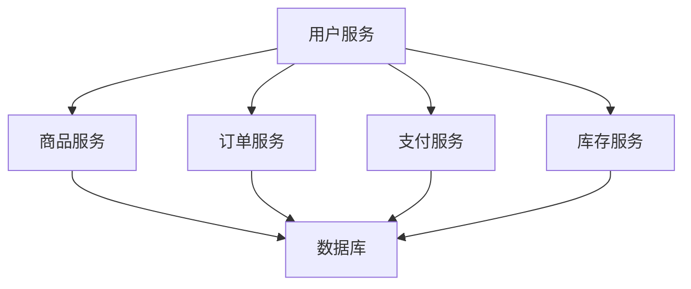
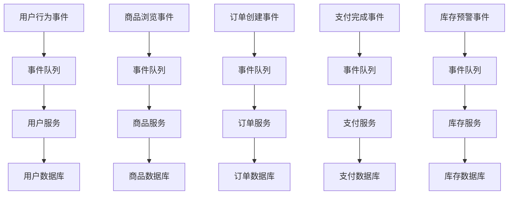
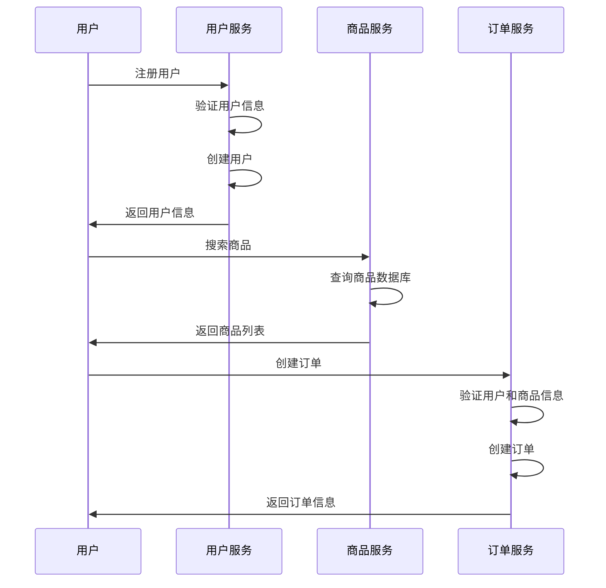

                 

## 响应式系统设计原则

### 响应式系统背景及意义

在信息技术飞速发展的今天，响应式系统设计原则已经逐渐成为现代软件工程中不可或缺的一部分。响应式系统，顾名思义，是指能够迅速、有效地响应外部事件和变化的系统。其核心在于通过灵活、可扩展的设计，确保系统能够在高负载、复杂环境中保持稳定和高效。

响应式系统的起源可以追溯到20世纪80年代的操作系统领域，当时的计算机系统面临着日益增长的计算需求和复杂的应用场景。为了应对这些挑战，研究人员开始探索如何设计一个既能高效处理任务，又能灵活适应环境变化的系统。随着技术的发展，响应式系统逐渐从操作系统扩展到整个软件工程领域，成为现代软件开发中一个重要的设计理念。

在现代软件工程中，响应式系统设计的重要性不言而喻。首先，随着互联网的普及和云计算的发展，应用程序需要处理的数据量和用户数量呈指数级增长，这要求系统能够具备高并发处理能力和弹性伸缩能力。其次，现代软件系统的复杂度不断增加，单点故障、资源耗尽等问题频繁出现，这要求系统能够具备良好的容错能力和自恢复能力。最后，响应式系统能够更好地适应不断变化的需求和业务场景，为企业提供更加灵活和高效的解决方案。

响应式系统的应用场景非常广泛，包括但不限于以下几个方面：

1. **在线交易系统**：在线交易系统要求能够实时处理大量交易请求，并且对延迟和系统故障具有极高的容忍度。
2. **实时数据处理**：例如，金融交易系统、社交媒体平台、物联网应用等，需要实时处理和分析大量数据。
3. **云计算平台**：在云平台中，响应式系统设计可以确保资源的高效利用和服务的稳定提供。
4. **自动化系统**：如智能家居系统、工业自动化系统等，需要能够快速响应外部事件，实现自动控制。

### 响应式系统的核心原则

响应式系统的核心原则主要包括以下四个方面：响应性、可扩展性、弹性和适应性。这些原则共同构成了响应式系统的设计基础，确保系统能够在不同场景下保持高效、稳定和可靠。

1. **响应性**：响应性是指系统能够及时、准确地响应外部事件和变化。一个高响应性的系统能够在事件发生时迅速做出反应，从而减少延迟和误差。响应性主要体现在系统的实时性、高效性和准确性上。
   
2. **可扩展性**：可扩展性是指系统能够灵活地适应业务增长和需求变化，通过增加或减少资源来满足不同负载需求。一个高可扩展的系统可以在不降低性能的情况下，轻松地处理更多的数据和用户请求。

3. **弹性**：弹性是指系统能够在面临故障、资源不足或负载波动时，自动调整自身资源和使用策略，确保服务的连续性和稳定性。弹性设计通常包括自动伸缩、故障恢复和容错机制等。

4. **适应性**：适应性是指系统能够根据环境变化和需求调整自身行为和结构，以适应不同的应用场景和业务需求。一个高适应性的系统能够在不同的环境和条件下，保持高效、稳定地运行。

### 响应式系统的主要组件

响应式系统通常由多个关键组件构成，这些组件共同协作，实现系统的响应性、可扩展性、弹性和适应性。以下是响应式系统的主要组件及其作用：

1. **事件驱动架构**：事件驱动架构是响应式系统的核心，它通过事件流处理来驱动系统的各个部分。事件驱动架构可以确保系统在事件发生时迅速响应，提高系统的实时性和响应性。

2. **微服务架构**：微服务架构是将应用程序拆分成多个独立的、松耦合的服务组件，每个服务组件负责特定的功能。这种架构设计可以提高系统的可扩展性和弹性，确保在负载增加或资源不足时，系统可以自动调整自身结构。

3. **容器化与自动化部署**：容器化技术，如Docker，可以将应用程序及其运行环境封装在容器中，确保应用程序在不同环境中的一致性和可移植性。自动化部署工具，如Kubernetes，可以自动化管理容器的生命周期，提高系统的部署和运维效率。

4. **服务网格与网络通信**：服务网格是用于管理微服务间通信的网络基础设施，它可以提供负载均衡、服务发现、安全认证等功能，确保微服务之间的通信高效、安全。

### 响应式系统设计方法论

响应式系统设计方法论是一套系统化的设计流程和方法，用于指导开发人员设计和实现响应式系统。以下是常见的响应式系统设计方法论：

1. **设计流程**：响应式系统设计通常包括需求分析、系统架构设计、组件实现、性能优化和测试等环节。每个环节都需要充分理解和分析系统的需求、性能和可靠性要求。

2. **设计模式**：设计模式是一套通用的、可重用的设计解决方案，用于解决特定类型的系统设计和开发问题。在响应式系统设计中，常用的设计模式包括事件驱动模式、观察者模式、状态模式等。

3. **性能优化策略**：性能优化是响应式系统设计的重要一环，通过优化算法、数据库设计、缓存策略等方式，可以提高系统的响应速度和处理能力。性能优化策略需要综合考虑系统的需求和负载情况，进行针对性的优化。

### 本章小结

本章对响应式系统设计原则进行了全面的概述。首先，介绍了响应式系统的背景和意义，阐述了其在现代软件工程中的重要性及应用场景。然后，详细介绍了响应式系统的核心原则、主要组件和设计方法论。通过本章的学习，读者可以初步了解响应式系统的设计和实现基础，为后续章节的深入探讨打下基础。

### 第一部分：响应式系统设计原则概述

在深入探讨响应式系统设计原则之前，我们需要首先理解响应式系统的定义和背景，这将为后续章节的讨论提供坚实的基础。

#### 1.1 响应式系统背景及意义

响应式系统（Responsive Systems）的概念起源于操作系统领域，但随着时间的推移，其应用范围已经扩展到整个软件工程领域。响应式系统设计的核心在于能够实时、准确地对外部事件做出反应，确保系统在高负载、复杂环境下依然能够保持稳定、高效的运行。

响应式系统的起源可以追溯到20世纪80年代，当时计算机系统面临着日益增长的计算需求和复杂的应用场景。为了应对这些挑战，研究人员开始探索如何设计一个既能高效处理任务，又能灵活适应环境变化的系统。随着技术的发展，响应式系统逐渐从操作系统扩展到整个软件工程领域，成为现代软件开发中一个重要的设计理念。

在现代软件工程中，响应式系统设计的重要性体现在以下几个方面：

1. **高并发处理能力**：随着互联网的普及和云计算的发展，应用程序需要处理的数据量和用户数量呈指数级增长，这要求系统能够具备高并发处理能力。响应式系统能够通过灵活、可扩展的设计，确保在高负载情况下依然能够高效运行。

2. **弹性伸缩能力**：现代软件系统需要具备良好的弹性伸缩能力，以应对业务增长和需求变化。响应式系统通过自动化伸缩策略，可以轻松地增加或减少资源，确保系统能够在负载增加或资源不足时保持稳定。

3. **容错能力**：在复杂的计算环境中，单点故障、资源耗尽等问题是不可避免的。响应式系统设计通过冗余设计、故障恢复和容错机制，确保在面临故障时，系统能够快速恢复，保证服务的连续性。

4. **适应性强**：响应式系统能够根据环境变化和需求调整自身行为和结构，以适应不同的应用场景和业务需求。这种适应性使得响应式系统在多变的市场环境中具有更强的竞争力。

响应式系统的应用场景非常广泛，包括但不限于以下方面：

1. **在线交易系统**：在线交易系统需要能够实时处理大量交易请求，并且对延迟和系统故障具有极高的容忍度。响应式系统设计能够确保交易系统在高并发情况下依然能够高效、稳定地运行。

2. **实时数据处理**：金融交易系统、社交媒体平台、物联网应用等，需要实时处理和分析大量数据。响应式系统能够通过高效的事件驱动架构，确保数据处理的实时性和准确性。

3. **云计算平台**：在云平台中，响应式系统设计可以确保资源的高效利用和服务的稳定提供。通过自动化伸缩和容错机制，云平台能够灵活地应对不同负载和需求。

4. **自动化系统**：智能家居系统、工业自动化系统等，需要能够快速响应外部事件，实现自动控制。响应式系统设计能够确保这些系统在复杂环境下保持高效、稳定运行。

#### 1.2 响应式系统的核心原则

响应式系统的核心原则主要包括以下四个方面：响应性、可扩展性、弹性和适应性。这些原则共同构成了响应式系统的设计基础，确保系统能够在不同场景下保持高效、稳定和可靠。

1. **响应性**：响应性是指系统能够及时、准确地响应外部事件和变化。一个高响应性的系统能够在事件发生时迅速做出反应，从而减少延迟和误差。响应性主要体现在系统的实时性、高效性和准确性上。为了提高响应性，系统设计需要关注以下几个方面：

   - **事件驱动架构**：采用事件驱动架构，能够确保系统在事件发生时迅速响应，减少系统的延迟。
   - **异步处理**：通过异步处理，可以减少系统在处理事件时的阻塞时间，提高系统的响应速度。
   - **高效的消息传递**：使用高效的的消息传递机制，如消息队列，确保事件能够在系统内部快速传递和响应。

2. **可扩展性**：可扩展性是指系统能够灵活地适应业务增长和需求变化，通过增加或减少资源来满足不同负载需求。一个高可扩展的系统可以在不降低性能的情况下，轻松地处理更多的数据和用户请求。为了实现可扩展性，系统设计需要考虑以下几个方面：

   - **模块化设计**：通过模块化设计，将系统划分为多个独立的、松耦合的模块，每个模块负责特定的功能，便于系统的扩展和升级。
   - **分布式架构**：采用分布式架构，可以将系统拆分为多个分布式节点，通过水平扩展来应对更高的负载。
   - **负载均衡**：通过负载均衡机制，将请求合理分配到不同的节点，确保系统资源的高效利用。

3. **弹性**：弹性是指系统能够在面临故障、资源不足或负载波动时，自动调整自身资源和使用策略，确保服务的连续性和稳定性。弹性设计通常包括自动伸缩、故障恢复和容错机制等。为了实现弹性，系统设计需要考虑以下几个方面：

   - **自动伸缩**：通过自动伸缩策略，系统能够根据负载自动增加或减少资源，确保在高负载情况下依然能够高效运行。
   - **故障恢复**：在系统面临故障时，能够快速检测并恢复，确保服务的连续性。
   - **容错机制**：通过冗余设计、故障隔离和恢复机制，确保系统在故障情况下能够快速恢复。

4. **适应性**：适应性是指系统能够根据环境变化和需求调整自身行为和结构，以适应不同的应用场景和业务需求。一个高适应性的系统能够在不同的环境和条件下，保持高效、稳定地运行。为了提高适应性，系统设计需要考虑以下几个方面：

   - **动态配置**：通过动态配置，系统能够根据环境变化和需求调整配置，确保系统的适应性。
   - **模块化接口**：通过模块化接口设计，系统能够方便地替换或扩展模块，以适应不同的需求。
   - **可扩展架构**：采用可扩展的架构设计，系统能够在需求变化时，灵活地进行扩展和调整。

#### 1.3 响应式系统的主要组件

响应式系统通常由多个关键组件构成，这些组件共同协作，实现系统的响应性、可扩展性、弹性和适应性。以下是响应式系统的主要组件及其作用：

1. **事件驱动架构**：事件驱动架构是响应式系统的核心，它通过事件流处理来驱动系统的各个部分。事件驱动架构可以确保系统在事件发生时迅速响应，提高系统的实时性和响应性。

2. **微服务架构**：微服务架构是将应用程序拆分成多个独立的、松耦合的服务组件，每个服务组件负责特定的功能。这种架构设计可以提高系统的可扩展性和弹性，确保在负载增加或资源不足时，系统可以自动调整自身结构。

3. **容器化与自动化部署**：容器化技术，如Docker，可以将应用程序及其运行环境封装在容器中，确保应用程序在不同环境中的一致性和可移植性。自动化部署工具，如Kubernetes，可以自动化管理容器的生命周期，提高系统的部署和运维效率。

4. **服务网格与网络通信**：服务网格是用于管理微服务间通信的网络基础设施，它可以提供负载均衡、服务发现、安全认证等功能，确保微服务之间的通信高效、安全。

#### 1.4 响应式系统设计方法论

响应式系统设计方法论是一套系统化的设计流程和方法，用于指导开发人员设计和实现响应式系统。以下是常见的响应式系统设计方法论：

1. **设计流程**：响应式系统设计通常包括需求分析、系统架构设计、组件实现、性能优化和测试等环节。每个环节都需要充分理解和分析系统的需求、性能和可靠性要求。

2. **设计模式**：设计模式是一套通用的、可重用的设计解决方案，用于解决特定类型的系统设计和开发问题。在响应式系统设计中，常用的设计模式包括事件驱动模式、观察者模式、状态模式等。

3. **性能优化策略**：性能优化是响应式系统设计的重要一环，通过优化算法、数据库设计、缓存策略等方式，可以提高系统的响应速度和处理能力。性能优化策略需要综合考虑系统的需求和负载情况，进行针对性的优化。

#### 1.5 本章小结

本章对响应式系统设计原则进行了全面的概述，介绍了响应式系统的背景及意义、核心原则、主要组件和设计方法论。通过本章的学习，读者可以初步了解响应式系统的设计和实现基础，为后续章节的深入探讨打下基础。

### 第一部分：响应式系统设计原则概述

#### 1.1 响应式系统背景及意义

响应式系统设计原则的诞生，源于现代信息技术领域的不断演进和复杂性增加。随着互联网的快速发展，以及云计算、物联网、大数据等新兴技术的普及，软件系统面临着前所未有的挑战。传统的单体架构已无法满足高并发、弹性扩展、实时响应等需求，因此，响应式系统设计原则应运而生。

#### 1.1.1 响应式系统的起源与发展

响应式系统的概念最早可以追溯到操作系统的领域，20世纪80年代，计算机科学家为了应对复杂的计算任务和资源管理问题，开始探索如何设计一个能够灵活响应外部事件变化的系统。最早的响应式系统研究主要集中在如何优化操作系统的调度策略、资源管理和故障恢复能力上。随着时间的推移，响应式系统的概念逐渐扩展到整个软件工程领域，不仅限于操作系统。

在20世纪90年代，随着互联网的兴起，Web应用的出现使得响应式系统的重要性进一步凸显。开发者需要设计能够应对大量并发请求、快速响应用户操作的系统。这一时期的代表性技术包括事件驱动架构和异步编程模型。

进入21世纪，云计算和大数据技术的快速发展，使得数据处理能力和资源管理需求达到了新的高度。响应式系统设计原则在这个阶段得到了广泛应用，尤其是在构建大型分布式系统、实时数据处理和分析等领域。现代的响应式系统设计不仅要求系统具备良好的响应性，还需要具备高可扩展性、弹性、适应性等特性。

#### 1.1.2 响应式系统在现代软件工程中的重要性

响应式系统设计原则在现代软件工程中的重要性不可忽视，主要体现在以下几个方面：

1. **高并发处理能力**：随着互联网用户的急剧增加，应用程序需要能够处理大量并发请求。响应式系统通过事件驱动和异步处理机制，可以显著提高系统的并发处理能力。

2. **弹性扩展**：现代软件系统需要具备弹性扩展的能力，以适应不断变化的业务需求和负载波动。响应式系统设计提供了自动伸缩机制，可以在资源需求增加时动态扩展，从而确保系统的高可用性和稳定性。

3. **实时响应**：在许多应用场景中，如金融交易、在线游戏、实时通信等，系统需要能够实时响应用户的操作。响应式系统设计通过优化事件处理和消息传递机制，确保系统能够快速响应用户请求。

4. **容错能力**：复杂的软件系统难免会遇到故障和异常，响应式系统设计通过冗余设计、故障检测和自动恢复机制，提高了系统的容错能力，保证了服务的连续性和可靠性。

5. **适应性**：响应式系统设计原则使得系统能够根据环境变化和需求变化灵活调整自身行为和结构，以适应不同的应用场景和业务需求。这种适应性使得响应式系统在多变的市场环境中具有更强的竞争力。

#### 1.1.3 响应式系统的应用场景

响应式系统设计原则在多种应用场景中发挥着重要作用，以下是一些典型的应用场景：

1. **在线交易系统**：在线交易系统需要能够处理大量的并发交易请求，并确保交易过程的实时性和安全性。响应式系统设计通过事件驱动和异步处理机制，可以显著提高交易系统的并发处理能力和响应速度。

2. **实时数据处理**：金融交易系统、物联网平台等需要实时处理和分析大量数据，响应式系统设计通过高效的事件流处理机制，可以确保数据处理的高效性和实时性。

3. **云计算平台**：在云计算环境中，响应式系统设计可以通过自动伸缩和负载均衡机制，确保云服务的高效利用和稳定提供。

4. **自动化系统**：智能家居、工业自动化系统等需要能够快速响应外部事件，实现自动化控制和监测。响应式系统设计通过事件驱动架构，可以确保自动化系统的高效运行。

5. **移动应用**：移动应用需要能够快速响应用户的操作，并确保良好的用户体验。响应式系统设计通过异步处理和高效的消息传递机制，可以满足移动应用的高并发和实时响应需求。

通过以上分析，我们可以看到，响应式系统设计原则在现代软件工程中的重要性不言而喻。它不仅能够提高系统的性能和可靠性，还能够增强系统的适应性和灵活性，为开发者提供了一种应对复杂性和变化的有效手段。

### 响应式系统的核心原则

响应式系统的设计原则是其能够适应不断变化的环境和需求的关键。这些核心原则确保系统能够在高并发、分布式环境中保持高效、稳定和可靠。以下是响应式系统的四个核心原则：响应性、可扩展性、弹性和适应性。

#### 1.2.1 响应性

响应性是响应式系统的首要原则，它指的是系统对外部事件或变化能够迅速做出反应。响应性的重要性在于，它能够确保系统在事件发生时能够及时处理，从而减少延迟和错误。

**响应性的特征**：

- **实时性**：系统能够在极短时间内对事件做出反应。
- **高效性**：系统在处理事件时具有较高的效率和吞吐量。
- **准确性**：系统能够准确处理事件，确保数据的完整性和一致性。

**实现响应性的方法**：

- **事件驱动架构**：通过事件驱动架构，系统能够实时监听和处理事件，从而提高响应速度。
- **异步处理**：使用异步处理机制，可以减少系统在处理事件时的阻塞时间，提高系统的并发处理能力。
- **高效的消息传递**：采用高效的消息传递机制，如消息队列，可以确保事件在系统内部快速传递和处理。

#### 1.2.2 可扩展性

可扩展性是响应式系统设计中的一个重要原则，它指的是系统能够根据业务需求的变化灵活地扩展其功能或性能。随着用户数量和数据量的增加，系统能够通过增加资源或优化配置来满足更高的负载需求。

**可扩展性的特征**：

- **水平扩展**：系统能够通过增加节点数量来提高处理能力，而不是仅依赖单个节点的性能提升。
- **模块化设计**：系统通过模块化设计，可以独立扩展或替换某个模块，而不会影响整个系统的运行。
- **分布式架构**：采用分布式架构，可以将系统拆分为多个独立的组件，每个组件可以独立部署和扩展。

**实现可扩展性的方法**：

- **微服务架构**：通过微服务架构，可以将应用程序拆分为多个独立的、松耦合的服务组件，每个服务组件可以独立扩展和部署。
- **负载均衡**：使用负载均衡器，可以将请求合理分配到不同的节点，避免单个节点过载。
- **弹性伸缩**：通过自动化伸缩策略，系统可以根据负载自动增加或减少资源，确保在高负载情况下依然能够高效运行。

#### 1.2.3 弹性

弹性是响应式系统设计中的一个关键原则，它指的是系统能够在面临故障、资源不足或负载波动时，自动调整自身资源和使用策略，以确保服务的连续性和稳定性。

**弹性的特征**：

- **自恢复能力**：系统能够在发生故障时自动恢复，确保服务的连续性。
- **资源优化**：系统能够根据负载需求自动调整资源使用，确保资源的高效利用。
- **负载均衡**：通过负载均衡策略，将请求合理分配到不同的节点，避免单点过载。

**实现弹性的方法**：

- **自动化伸缩**：通过自动化伸缩策略，系统可以根据负载自动增加或减少资源，从而应对负载波动。
- **故障检测与恢复**：系统需要具备故障检测和恢复机制，能够在发生故障时自动切换到备用资源或恢复服务。
- **容错机制**：通过冗余设计、故障隔离和快速恢复机制，确保系统在面临故障时能够快速恢复。

#### 1.2.4 适应性

适应性是响应式系统的最后一个核心原则，它指的是系统能够根据环境变化和需求调整自身行为和结构，以适应不同的应用场景和业务需求。适应性确保系统能够在多变的市场环境中保持高效和可靠。

**适应性的特征**：

- **动态配置**：系统可以根据环境变化动态调整配置，确保系统在不同环境下都能正常运行。
- **模块化接口**：通过模块化接口设计，系统可以方便地替换或扩展模块，以适应不同的需求。
- **灵活扩展**：系统设计要具备灵活扩展的能力，以便在需求变化时能够快速响应。

**实现适应性的方法**：

- **动态配置管理**：系统需要具备动态配置管理能力，能够在运行时根据环境变化调整配置。
- **模块化设计**：采用模块化设计，可以方便地替换或扩展系统组件，以适应不同的需求。
- **可扩展架构**：系统架构设计要具备可扩展性，以便在需求变化时能够灵活调整。

通过以上四个核心原则：响应性、可扩展性、弹性和适应性，响应式系统能够在不同场景下保持高效、稳定和可靠，为开发者提供了一种应对复杂性和变化的有效手段。

### 响应式系统的主要组件

响应式系统的设计不仅仅依赖于核心原则，还需要一个稳固的组件架构来支持其高响应性、可扩展性、弹性和适应性。以下是响应式系统的主要组件及其具体作用：

#### 1.3.1 事件驱动架构

事件驱动架构是响应式系统的核心，它通过事件流来驱动系统的各个部分。事件可以是用户操作、系统内部的变更或者外部环境的变化。事件驱动架构的主要特点是无阻塞、高并发和异步处理。

**作用**：

- **提高响应速度**：事件驱动架构允许系统在处理事件时保持并行处理，从而提高系统的响应速度。
- **降低耦合度**：各个组件之间通过事件进行通信，减少了直接的耦合，使得系统的扩展和维护更加容易。
- **增强灵活性**：系统可以根据事件的变化动态调整其行为，增强系统的灵活性。

**实现方式**：

- **事件监听器**：系统中的每个组件都可以注册成为事件监听器，当特定事件发生时，监听器会被触发。
- **事件队列**：事件被放入队列中，按照一定的策略进行调度和处理，以确保事件处理的高效性。
- **异步处理**：通过异步处理，系统可以在处理事件时释放出计算资源，继续处理其他事件，从而提高系统的并发能力。

#### 1.3.2 微服务架构

微服务架构是将应用程序拆分成多个独立的、松耦合的服务组件，每个服务组件负责特定的功能。这种架构设计能够提高系统的可扩展性和弹性。

**作用**：

- **可扩展性**：通过水平扩展单个服务组件，系统可以轻松应对高并发和大数据量的需求。
- **高可用性**：由于服务组件是独立的，当一个服务组件发生故障时，不会影响其他服务组件的运行。
- **敏捷开发**：不同的服务组件可以由不同的团队独立开发、测试和部署，提高了开发效率。

**实现方式**：

- **服务拆分**：根据业务功能将应用程序拆分为多个服务，每个服务专注于完成特定的任务。
- **服务通信**：服务之间通过API进行通信，通常使用RESTful API或gRPC等高效协议。
- **服务容器化**：使用容器化技术（如Docker）来封装服务及其依赖，确保服务在不同环境中的一致性和可移植性。

#### 1.3.3 容器化与自动化部署

容器化技术（如Docker）和自动化部署工具（如Kubernetes）是响应式系统的重要组成部分，它们提供了系统的高效部署、管理和扩展能力。

**作用**：

- **高效部署**：容器化技术可以将应用程序及其运行环境封装在容器中，简化了部署过程。
- **资源优化**：容器可以通过资源限制和隔离，确保每个应用程序能够合理使用资源。
- **弹性扩展**：自动化部署工具能够根据负载需求自动扩展或缩减容器数量，确保系统的高可用性。

**实现方式**：

- **容器化**：使用Docker等容器化工具，将应用程序及其依赖打包到容器中。
- **容器编排**：使用Kubernetes等自动化部署工具，对容器进行编排、管理和调度。
- **CI/CD**：通过持续集成和持续部署（CI/CD）流程，实现自动化构建、测试和部署。

#### 1.3.4 服务网格与网络通信

服务网格是一种用于管理微服务间通信的网络基础设施，它提供了服务发现、负载均衡、安全认证等功能，确保微服务之间的通信高效、安全。

**作用**：

- **服务发现**：服务网格可以动态发现和管理微服务，确保服务之间的通信畅通。
- **负载均衡**：通过负载均衡策略，将请求合理分配到不同的服务实例，避免单个服务过载。
- **安全认证**：提供安全认证机制，确保服务之间的通信是安全的。

**实现方式**：

- **服务代理**：服务网格通过服务代理来拦截和路由服务间的通信。
- **智能路由**：服务网格可以根据流量模式和服务状态，动态调整路由策略，提高服务间的通信效率。
- **安全策略**：通过集成安全策略，确保服务之间的通信遵循安全标准。

通过以上主要组件的配合，响应式系统能够实现高效、稳定和可靠的服务。这些组件共同工作，确保系统能够灵活应对复杂的环境变化和业务需求。

### 响应式系统设计方法论

响应式系统的设计不仅仅依赖于其核心原则和组件，还需要一套系统化的设计方法论来指导整个设计和实现过程。这套方法论包括设计流程、设计模式以及性能优化策略，它们共同构成了响应式系统设计的理论基础和实施步骤。

#### 1.4.1 设计流程

设计流程是响应式系统设计的第一步，它包括以下关键环节：

1. **需求分析**：明确系统的需求，包括功能需求、性能需求、可靠性需求等。这一步骤是后续设计的基石，需要与业务部门和用户深入沟通，确保需求的准确性和完整性。

2. **系统架构设计**：根据需求分析的结果，设计系统的整体架构。这一步骤包括确定系统的分层结构、模块划分、数据流和控制流等。系统架构设计需要考虑响应性、可扩展性、弹性和适应性等核心原则。

3. **组件实现**：根据系统架构设计，实现具体的组件。组件实现需要遵循模块化、独立性和高内聚低耦合等原则，确保每个组件能够独立开发和测试。

4. **性能优化**：在组件实现过程中，需要进行性能优化，包括算法优化、数据库设计优化、缓存策略优化等。性能优化需要根据具体的性能指标和需求进行针对性的调整。

5. **测试与部署**：对系统进行全面的测试，包括功能测试、性能测试、安全测试等。确保系统在各个层面上都能够满足需求。测试通过后，进行系统的部署，包括环境搭建、部署流程和自动化部署等。

#### 1.4.2 设计模式

设计模式是响应式系统设计中常用的一系列解决方案，它们为特定类型的系统设计和开发问题提供了解决思路。以下是几个常用的设计模式：

1. **事件驱动模式**：事件驱动模式是响应式系统的核心模式，它通过事件来驱动系统的行为。事件可以是用户操作、系统状态变化或其他外部信号。这种模式可以提高系统的响应速度和并发处理能力。

2. **观察者模式**：观察者模式是一种用于实现事件监听和通知的设计模式。它通过将事件监听器与事件源分离，确保系统的松耦合和灵活性。这种模式适用于需要多个组件响应同一事件的场景。

3. **状态模式**：状态模式是一种用于管理对象状态的变换的设计模式。它通过将状态封装在独立的类中，使得对象的行为可以根据当前状态进行动态调整。这种模式适用于需要根据不同状态进行不同处理的场景。

4. **工厂模式**：工厂模式是一种用于创建对象的设计模式。它通过将对象创建过程封装在工厂类中，确保对象创建的灵活性和可扩展性。这种模式适用于需要根据不同条件创建不同对象的场景。

#### 1.4.3 性能优化策略

性能优化是响应式系统设计的重要环节，它涉及到系统的各个方面，包括算法、数据库设计、缓存策略等。以下是几个常用的性能优化策略：

1. **算法优化**：通过选择合适的算法和数据结构，提高系统的处理效率。例如，使用高效的排序算法、哈希表等。

2. **数据库优化**：通过优化数据库设计、索引、查询等，提高系统的数据访问效率。例如，使用合适的索引、分库分表等。

3. **缓存策略**：通过使用缓存来减少系统的重复计算和数据访问。例如，使用内存缓存、分布式缓存等。

4. **并发优化**：通过提高系统的并发处理能力，提高系统的吞吐量。例如，使用异步处理、多线程等。

5. **资源管理**：通过合理分配和管理系统资源，提高系统的资源利用率和稳定性。例如，使用负载均衡、资源隔离等。

通过设计流程、设计模式和性能优化策略的有机结合，响应式系统能够在复杂的环境中保持高效、稳定和可靠的运行。这套方法论为开发人员提供了系统化的设计和实现指南，确保系统能够满足现代软件工程的需求。

### 响应式系统设计与实现基础

要设计和实现一个响应式系统，首先需要理解其基础架构和核心组件，以及如何进行数据模型设计。这些基础是实现高响应性、可扩展性、弹性和适应性的关键。

#### 2.1.1 响应式系统的架构设计

响应式系统的架构设计是其实现的基础，它决定了系统的整体结构和性能表现。以下是一些关键的架构设计原则：

1. **事件驱动架构**：事件驱动架构是响应式系统的核心，通过事件来驱动系统的行为。系统中的每个组件都是事件的生产者或消费者，它们通过事件进行通信，确保系统的高响应性和低耦合。

2. **分布式架构**：分布式架构使得系统能够水平扩展，通过增加节点数量来提高系统的处理能力和可用性。分布式架构通常包括多个层次，如表示层、业务逻辑层和数据存储层，每个层次都可以独立扩展和部署。

3. **模块化设计**：模块化设计是将系统划分为多个独立的模块，每个模块负责特定的功能。模块化设计可以提高系统的可维护性和可扩展性，使得系统能够快速响应需求变化。

4. **服务化架构**：服务化架构是将应用程序拆分为多个微服务，每个服务独立运行和管理。服务化架构可以提高系统的可扩展性和灵活性，使得系统能够更好地适应复杂业务场景。

#### 2.1.2 响应式系统的基础组件

响应式系统的基础组件是实现其核心功能的关键，以下是几个重要的基础组件：

1. **事件监听器**：事件监听器负责监听系统中的事件，并在事件发生时触发相应的处理逻辑。事件监听器可以是独立的组件，也可以集成在系统中其他组件中。

2. **事件队列**：事件队列用于暂存和调度事件，确保系统中的事件能够有序、高效地处理。事件队列可以采用先进先出（FIFO）或优先级队列（PQ）等策略进行管理。

3. **消息队列**：消息队列是一种异步通信机制，用于在不同组件之间传递事件和数据。消息队列可以确保系统的解耦和可靠传输，使得系统组件可以独立开发和部署。

4. **服务注册与发现**：服务注册与发现机制用于管理系统中各个服务的状态和位置。服务注册使得系统能够动态发现新的服务实例，服务发现则用于在需要时查找和连接服务。

5. **负载均衡器**：负载均衡器用于将请求合理分配到不同的服务实例，确保系统的高可用性和性能。负载均衡器可以采用轮询、最小连接数、权重等策略进行负载分配。

6. **监控系统**：监控系统用于实时监控系统的性能、健康状况和资源使用情况。监控系统可以提供实时监控数据、报警和报告，帮助开发人员和运维人员快速发现问题并进行优化。

#### 2.1.3 响应式系统的数据模型设计

数据模型设计是响应式系统的重要组成部分，它决定了系统如何存储、组织和处理数据。以下是数据模型设计的关键要点：

1. **实体关系模型**：实体关系模型（ER模型）用于描述系统中的实体及其关系。在响应式系统中，实体可以是用户、订单、交易等，关系可以是用户与订单之间的关联、订单与交易之间的关联等。ER模型可以帮助理解系统的数据结构和关系。

2. **关系型数据库**：关系型数据库（如MySQL、PostgreSQL）通常用于存储和管理系统中的结构化数据。关系型数据库具有强大的查询能力和事务支持，适用于需要复杂查询和事务处理的场景。

3. **非关系型数据库**：非关系型数据库（如MongoDB、Cassandra）适用于存储和管理大规模、分布式数据。非关系型数据库具有灵活的数据模型和高效的写入性能，适用于需要高并发和可扩展性的场景。

4. **数据缓存**：数据缓存用于减少数据库的访问次数，提高系统的响应速度。常见的缓存技术包括内存缓存（如Redis）、分布式缓存（如Memcached）等。

5. **数据流处理**：数据流处理（如Apache Kafka、Flink）用于处理和分析实时数据流。数据流处理可以提供高效的数据处理能力和实时分析能力，适用于需要实时处理和分析数据的场景。

6. **数据同步与集成**：数据同步与集成技术用于确保系统中的数据一致性和完整性。数据同步可以采用批量同步、增量同步等策略，数据集成可以采用ETL（抽取、转换、加载）工具进行数据整合。

通过理解响应式系统的架构设计、基础组件和数据模型设计，开发人员可以构建一个高效、稳定和可靠的响应式系统，以满足现代软件工程的需求。

### 响应式系统事件处理

响应式系统的事件处理机制是其核心组件之一，它决定了系统能否快速、准确地响应外部事件。事件处理包括事件流处理、事件队列与调度等内容。

#### 2.2.1 事件驱动架构原理

事件驱动架构（Event-Driven Architecture，EDA）是一种软件架构模式，它通过事件来驱动系统的行为。在事件驱动架构中，系统中的每个组件都是事件的生产者或消费者，它们通过事件进行通信。

**事件生产者**：事件生产者是系统中产生事件的对象或组件。当某个条件满足或某个操作发生时，事件生产者会生成事件并发布到系统中。

**事件消费者**：事件消费者是系统中接收和处理事件的对象或组件。当事件被发布到系统中时，事件消费者会监听并处理这些事件。

**事件队列**：事件队列是一个缓冲区，用于暂存和调度事件。事件队列可以采用先进先出（FIFO）或优先级队列（PQ）等策略进行管理。事件队列的目的是确保事件能够有序、高效地处理，避免事件丢失或处理延迟。

**事件处理流程**：

1. **事件发布**：事件生产者生成事件并将其发布到事件队列中。
2. **事件调度**：事件队列根据调度策略（如FIFO或PQ）调度事件，将其推送给事件消费者。
3. **事件处理**：事件消费者从事件队列中获取事件并执行相应的处理逻辑。
4. **事件反馈**：事件处理完成后，系统可能会生成新的事件，从而继续驱动系统的行为。

#### 2.2.2 事件流处理

事件流处理（Event Stream Processing，ESP）是一种用于处理和分析实时数据流的计算模型。事件流处理可以提供高效的数据处理能力和实时分析能力，适用于需要实时处理和分析数据的场景。

**事件流处理的特点**：

- **实时性**：事件流处理能够实时处理和分析数据，确保系统能够快速响应。
- **连续性**：事件流处理能够持续处理数据流，确保数据不会被丢失或延迟。
- **并行处理**：事件流处理支持并行处理，可以提高系统的吞吐量和处理速度。

**事件流处理的基本流程**：

1. **数据采集**：数据采集器从各种数据源（如传感器、日志文件、数据库等）中收集数据。
2. **数据预处理**：对采集到的数据进行清洗、过滤和格式化，确保数据的质量和一致性。
3. **事件生成**：通过解析和处理数据，生成事件并将其发布到事件队列中。
4. **事件处理**：事件消费者从事件队列中获取事件并执行相应的处理逻辑。
5. **结果输出**：将处理结果输出到目的地（如数据库、报表、监控等）。

**事件流处理的应用场景**：

- **实时数据处理**：例如，金融交易系统、社交媒体平台、物联网应用等，需要实时处理和分析大量数据。
- **实时监控**：例如，系统监控、性能监控、安全监控等，需要实时获取和处理监控数据。
- **实时分析**：例如，实时数据分析、机器学习、预测分析等，需要实时处理和分析数据流。

#### 2.2.3 事件队列与调度

事件队列是事件驱动架构中的一个关键组件，它负责暂存和调度事件。事件队列的设计和调度策略对系统的性能和响应速度有很大影响。

**事件队列的设计原则**：

- **高吞吐量**：事件队列需要能够处理大量的事件，确保系统的并发处理能力。
- **低延迟**：事件队列需要能够快速调度和传递事件，减少系统的处理延迟。
- **高可靠性**：事件队列需要能够确保事件不会丢失或重复处理，确保系统的数据一致性。

**常见的调度策略**：

- **先进先出（FIFO）**：事件按照进入队列的顺序进行调度和处理。这种策略简单易实现，但可能无法充分利用系统的并行处理能力。
- **优先级队列（PQ）**：事件按照优先级进行调度和处理。高优先级的事件先被处理，适用于需要优先处理重要事件或紧急事件的场景。
- **时间片轮转**：事件按照时间片轮转的方式进行调度和处理。每个事件在队列中等待一定时间片后，被调度和处理。这种策略可以确保系统公平地处理所有事件，但可能增加系统的延迟。

**事件队列的实现**：

- **内存队列**：使用内存中的数据结构（如数组、链表）来实现事件队列，适用于小规模、低延迟的场景。
- **消息队列**：使用消息队列（如Kafka、RabbitMQ）来实现事件队列，适用于大规模、高并发的场景。消息队列可以提供分布式、可靠的消息传递能力，确保事件不会丢失或重复处理。

**事件队列与调度的优化**：

- **并行处理**：通过并行处理机制，可以将事件队列拆分为多个子队列，每个子队列由不同的线程或进程处理。这样可以充分利用系统的多核CPU资源，提高系统的吞吐量和处理速度。
- **批量处理**：将多个事件批量处理，可以减少系统调度的次数和上下文切换的开销，提高系统的处理效率。
- **负载均衡**：通过负载均衡策略，将事件合理分配到不同的队列或处理节点，确保系统的资源利用率均衡。

通过合理设计事件队列和调度策略，响应式系统可以高效、准确地处理大量事件，确保系统的响应性和稳定性。

### 响应式系统的服务设计

在响应式系统设计中，服务设计是一个关键环节。服务设计决定了系统如何实现功能的模块化、解耦和高效通信。响应式系统的服务设计主要包括微服务架构设计原则、服务拆分与解耦、服务发现与负载均衡等内容。

#### 2.3.1 微服务架构设计原则

微服务架构（Microservices Architecture）是将应用程序拆分为多个独立的、松耦合的服务组件。每个服务组件负责特定的业务功能，独立部署和运行。微服务架构设计原则包括以下几个方面：

1. **独立部署**：每个服务可以独立部署和运行，不受其他服务的影响。这样可以提高系统的灵活性和可维护性，同时简化部署和升级过程。

2. **服务自治**：每个服务具有自我管理和自我恢复的能力，可以独立处理请求和故障。这样可以提高系统的可靠性和稳定性，减少单点故障的风险。

3. **松耦合**：服务之间通过轻量级通信协议（如HTTP/REST、gRPC）进行通信，服务之间解耦。这样可以提高系统的灵活性和可扩展性，减少服务之间的依赖关系。

4. **自治数据库**：每个服务拥有自己的数据存储，可以独立管理和访问数据。这样可以提高系统的数据一致性和隔离性，减少数据竞争和冲突。

5. **服务标准化**：服务应遵循统一的服务接口规范和设计原则，确保服务之间的互操作性和兼容性。这样可以简化服务集成和协同工作，提高系统的开发效率。

#### 2.3.2 服务拆分与解耦

服务拆分与解耦是微服务架构设计的关键步骤，它涉及到如何将应用程序分解为多个独立的服务组件，并确保服务之间解耦。

**服务拆分原则**：

1. **业务边界**：根据业务功能进行服务拆分，确保每个服务组件都拥有明确的业务职责和功能边界。这样可以提高系统的模块化和可维护性。

2. **职责单一**：每个服务组件应只负责一个业务功能，避免服务过大或过小。这样可以提高服务的独立性和可复用性。

3. **独立部署**：确保服务可以独立部署和运行，不受其他服务的影响。这样可以提高系统的灵活性和可扩展性。

4. **高内聚低耦合**：服务内部的高内聚和外部低耦合，确保服务之间的依赖关系最小化。这样可以提高系统的稳定性和可维护性。

**服务解耦方法**：

1. **接口定义**：使用轻量级通信协议（如HTTP/REST、gRPC）定义服务接口，确保服务之间的互操作性和兼容性。

2. **事件驱动**：使用事件驱动架构，通过事件进行服务间通信，减少直接的依赖关系。这样可以提高系统的灵活性和可扩展性。

3. **异步通信**：使用异步通信机制（如消息队列、事件总线），确保服务可以独立处理请求和响应。这样可以提高系统的并发处理能力和性能。

4. **服务发现**：使用服务发现机制（如DNS、服务注册中心），确保服务可以动态发现和连接其他服务。这样可以提高系统的动态性和灵活性。

#### 2.3.3 服务发现与负载均衡

服务发现和负载均衡是响应式系统中重要的组成部分，它们确保服务之间的可靠通信和高效利用资源。

**服务发现机制**：

1. **静态配置**：通过配置文件或数据库手动配置服务地址和端口，适用于服务数量较少且相对稳定的场景。

2. **动态注册与发现**：使用服务注册中心（如Consul、Eureka），服务启动时注册自身地址和端口，其他服务通过服务注册中心发现和连接其他服务。这样可以提高系统的动态性和灵活性。

3. **DNS服务发现**：使用DNS服务发现，通过域名解析服务地址和端口，适用于服务数量较多且需要动态调整的场景。

**负载均衡策略**：

1. **轮询**：将请求依次分配给不同的服务实例，适用于简单、均衡的场景。

2. **最小连接数**：将请求分配给连接数最少的服务实例，适用于需要平衡服务负载的场景。

3. **权重分配**：根据服务实例的权重分配请求，确保高可用性和高性能的服务实例承担更多的负载。

4. **一致性哈希**：将请求分配到哈希值相同的服务实例，减少服务实例的迁移和重新分配。

通过合理的服务拆分与解耦、服务发现与负载均衡，响应式系统可以高效、可靠地实现服务的模块化、解耦和高效通信，提高系统的响应性和可扩展性。

### 响应式系统的弹性设计

响应式系统的弹性设计是确保系统在面对各种不确定性情况时依然能够稳定运行的关键。弹性设计通常包括弹性伸缩策略、容量规划与预测以及故障恢复与容错机制。

#### 2.4.1 弹性伸缩策略

弹性伸缩（Elastic Scaling）是指系统能够根据实际负载自动调整资源使用，以适应不同负载水平。弹性伸缩策略主要包括以下几种：

1. **水平扩展**：通过增加或减少系统中服务实例的数量来提高或降低系统的处理能力。水平扩展可以显著提高系统的并发处理能力和资源利用率。

2. **垂直扩展**：通过增加或减少系统硬件配置（如CPU、内存、存储等）来提高系统的处理能力。垂直扩展适用于特定服务实例的处理能力已经接近硬件极限的情况。

3. **自动化伸缩**：通过自动化工具（如Kubernetes、AWS Auto Scaling）实现自动伸缩，根据系统负载自动增加或减少资源。自动化伸缩可以节省人力成本，提高系统的响应速度和可靠性。

4. **弹性容器服务**：使用弹性容器服务（如Amazon ECS、Google Kubernetes Engine），可以根据需求动态调整容器的数量和配置。这种策略适用于需要频繁调整资源使用的情况。

#### 2.4.2 容量规划与预测

容量规划与预测是确保系统在面临高负载时能够及时扩展的关键步骤。容量规划与预测主要包括以下内容：

1. **负载预测**：通过历史数据和趋势分析，预测系统未来的负载水平。负载预测可以帮助系统提前准备资源，避免因资源不足而导致系统性能下降。

2. **需求分析**：了解系统的需求，包括并发用户数、数据量、处理速度等。需求分析可以帮助确定系统所需的基础资源和扩展资源。

3. **容量规划**：根据负载预测和需求分析，制定系统的容量规划。容量规划应考虑系统的峰值负载和持续负载，确保系统能够在高负载情况下正常运行。

4. **资源监控**：实时监控系统的资源使用情况，包括CPU、内存、存储、网络等。资源监控可以帮助发现资源瓶颈和性能问题，及时进行调整。

#### 2.4.3 故障恢复与容错机制

故障恢复与容错机制是确保系统在面临故障时能够快速恢复的关键。故障恢复与容错机制主要包括以下内容：

1. **冗余设计**：通过冗余设计，确保系统的关键组件或服务具有备份和冗余。冗余设计可以防止单点故障导致整个系统瘫痪。

2. **故障检测**：通过故障检测机制，及时发现系统中的故障。故障检测可以采用监控工具、日志分析、自动测试等方式。

3. **自动恢复**：当系统检测到故障时，自动恢复机制会自动触发恢复流程，包括重启服务、切换到备用资源等。自动恢复可以减少系统故障的处理时间，提高系统的可用性。

4. **故障隔离**：通过故障隔离机制，将故障限制在特定组件或服务中，防止故障蔓延到整个系统。故障隔离可以采用服务隔离、网络隔离等方式。

5. **容错机制**：通过容错机制，确保系统在故障情况下能够继续正常运行。容错机制可以采用数据备份、服务降级、负载均衡等方式。

通过弹性伸缩策略、容量规划与预测以及故障恢复与容错机制，响应式系统可以在面对不确定性情况时保持稳定运行，确保系统的高可用性和可靠性。

### 响应式系统的监控与性能优化

响应式系统的监控与性能优化是确保系统稳定运行和高效处理的关键环节。通过监控系统的性能指标，识别潜在问题并进行优化，可以显著提升系统的响应速度和处理能力。

#### 2.5.1 常见性能问题分析

在响应式系统中，常见的性能问题包括：

1. **高延迟**：系统处理请求的时间过长，导致用户感受到的响应速度变慢。高延迟可能是由于网络延迟、数据库查询慢、计算复杂度高等原因造成的。

2. **高负载**：系统在短时间内需要处理大量请求，导致资源不足，出现性能瓶颈。高负载可能是由于并发请求过多、数据量过大或系统设计不合理等原因导致的。

3. **高错误率**：系统在处理请求时频繁出现错误，影响系统的可用性和用户体验。高错误率可能是由于代码bug、系统配置错误、外部依赖不可靠等原因造成的。

4. **资源耗尽**：系统在运行过程中耗尽CPU、内存、网络等资源，导致系统崩溃或性能下降。资源耗尽可能是由于资源规划不足、未及时扩容或资源竞争等原因导致的。

5. **网络问题**：系统与外部服务或数据库之间的网络通信出现问题，导致数据传输缓慢或失败。网络问题可能是由于网络带宽不足、网络设备故障或网络配置错误等原因导致的。

#### 2.5.2 性能优化技巧

为了解决上述性能问题，可以采取以下性能优化技巧：

1. **缓存策略**：使用缓存来减少对数据库的访问次数，提高系统的响应速度。常见的缓存技术包括内存缓存（如Redis）、分布式缓存（如Memcached）和数据库缓存。

2. **数据库优化**：优化数据库设计和查询，提高数据库的访问速度。包括使用索引、分库分表、读写分离等技术。

3. **异步处理**：使用异步处理来减少系统在处理请求时的阻塞时间，提高系统的并发处理能力。异步处理可以通过消息队列、异步IO等方式实现。

4. **负载均衡**：使用负载均衡器来合理分配请求，避免单个节点过载。常见的负载均衡算法包括轮询、最小连接数、权重分配等。

5. **资源监控与预警**：实时监控系统的资源使用情况，包括CPU、内存、存储、网络等。当资源使用接近极限时，触发预警机制，提前进行扩容或优化。

6. **代码优化**：优化代码结构和算法，减少计算复杂度和内存占用。包括使用高效的数据结构、避免死循环、减少无谓的计算等。

7. **缓存一致性**：确保缓存与数据库之间的数据一致性，避免数据不一致导致的性能问题。可以使用分布式锁、版本控制等技术来确保缓存一致性。

8. **服务拆分与解耦**：通过服务拆分与解耦，将复杂的业务逻辑拆分为多个独立的服务组件，减少服务之间的耦合，提高系统的可维护性和可扩展性。

通过以上性能优化技巧，可以显著提升响应式系统的性能，确保系统在高负载和复杂环境下依然能够稳定、高效地运行。

### 响应式系统测试与部署

响应式系统的测试与部署是确保系统稳定运行和高效交付的关键环节。通过全面的测试和优化的部署策略，可以确保系统在各种情况下都能保持高可用性和高性能。

#### 2.6.1 单元测试与集成测试

在响应式系统的开发过程中，测试是不可或缺的一部分。测试分为单元测试和集成测试两个层次。

**单元测试**：单元测试是最基本的测试，它针对系统中的最小可测试单元（如函数、方法、类）进行测试。单元测试的主要目标是验证代码的正确性和功能完整性。为了编写有效的单元测试，可以遵循以下原则：

- **独立性**：每个单元测试应独立运行，不依赖于外部环境或其他测试。
- **覆盖率**：单元测试应覆盖代码中的所有路径，确保所有功能点都被测试到。
- **快速执行**：单元测试应尽可能快速执行，以便在开发过程中频繁运行。
- **自动化**：单元测试应自动化执行，减少人工干预和测试错误。

**集成测试**：集成测试是在单元测试的基础上，将多个单元组合成模块或组件，然后对模块或组件进行测试。集成测试的主要目标是验证模块或组件之间的交互和协作是否正确。为了有效进行集成测试，可以遵循以下原则：

- **层次化**：首先测试底层模块或组件，然后逐步测试更高层次的模块或组件。
- **逐步集成**：将新的模块或组件逐步集成到现有系统中，确保每个新加入的模块或组件都能正常运行。
- **并行执行**：尽可能并行执行集成测试，以提高测试效率。
- **全面覆盖**：确保所有重要的功能点和边界条件都被测试到。

#### 2.6.2 部署策略与流程

部署策略和流程是确保系统平稳上线和可靠运行的关键。一个良好的部署策略和流程应该包括以下步骤：

**部署策略**：

1. **版本控制**：使用版本控制系统（如Git）来管理代码版本，确保每次部署都是可追溯和可控的。
2. **自动化部署**：通过自动化部署工具（如Jenkins、GitLab CI/CD）实现自动化部署，减少人工干预和部署错误。
3. **灰度发布**：在关键系统上线时，采用灰度发布策略，逐步将新版本推广到生产环境，以确保系统能够平稳过渡。
4. **蓝绿部署**：通过蓝绿部署策略，将新旧版本同时部署到生产环境中，确保新版本在没有影响的情况下逐步替换旧版本。
5. **滚动部署**：对于无状态服务，采用滚动部署策略，逐步更新所有服务实例，确保系统在更新过程中保持可用。

**部署流程**：

1. **代码审核**：在部署前对代码进行审核，确保代码质量符合要求，避免部署有缺陷的代码。
2. **构建与打包**：使用构建工具（如Maven、Gradle）将代码构建为可执行的包，并将依赖库和配置文件打包在一起。
3. **自动化测试**：在部署前运行自动化测试（包括单元测试和集成测试），确保部署的代码没有缺陷。
4. **部署**：将构建好的包部署到目标环境中，可以是本地测试环境、预生产环境或生产环境。
5. **监控与维护**：在部署后，监控系统性能和健康状况，确保系统能够稳定运行。对于出现的问题，及时进行故障排除和系统维护。

#### 2.6.3 持续集成与持续部署

持续集成（Continuous Integration，CI）和持续部署（Continuous Deployment，CD）是现代软件开发中广泛采用的实践，它们通过自动化和持续的过程，确保代码质量和系统稳定性。

**持续集成**：

持续集成是指开发团队频繁地将代码集成到共享的主干分支中，并通过自动化测试确保集成后的代码质量。持续集成的核心目标是减少集成冲突、提高代码质量和加快开发速度。

- **代码审查**：每次提交代码时，进行代码审查，确保代码质量。
- **自动化构建**：使用自动化工具（如Jenkins、GitLab CI）构建代码，确保构建过程高效、可靠。
- **自动化测试**：运行自动化测试（包括单元测试、集成测试等），确保新代码不会引入缺陷。
- **快速反馈**：在集成过程中，及时反馈测试结果，帮助开发人员快速发现问题并修复。

**持续部署**：

持续部署是指通过自动化流程，将经过测试的代码自动部署到生产环境。持续部署的目标是确保新功能可以快速、安全地交付给用户。

- **自动化部署脚本**：编写自动化部署脚本，实现部署流程的自动化。
- **部署前测试**：在部署前，运行自动化测试，确保部署的代码质量。
- **蓝绿部署**：通过蓝绿部署策略，逐步将新版本替换旧版本，确保平稳过渡。
- **监控与反馈**：在部署后，监控系统性能和健康状态，及时发现并解决问题。

通过持续集成和持续部署，可以显著提高开发效率和系统质量，确保系统能够快速响应需求变化并保持稳定运行。

### 响应式系统实战案例分析

在本章节中，我们将通过一个实际项目案例，深入探讨响应式系统设计在项目中的应用与实现。这个项目是一个在线电商平台，它需要处理海量的商品信息、用户订单和交易数据。以下是该项目的设计与实现过程。

#### 2.7.1 实际项目背景

该项目是一个在线电商平台，旨在提供商品浏览、搜索、下单、支付和订单跟踪等服务。随着用户数量的增加和业务需求的扩大，系统需要具备高并发处理能力、弹性扩展能力和容错能力，以确保服务的稳定性和可靠性。

**项目需求**：

1. **高并发处理**：系统能够处理数百万并发用户同时访问。
2. **弹性扩展**：系统能够根据负载自动扩展资源，以满足不同时段的访问需求。
3. **容错能力**：系统在遇到故障时能够快速恢复，确保服务的连续性。
4. **实时性**：系统需要能够实时响应用户操作，如搜索结果、订单状态更新等。
5. **安全性**：系统需要具备严格的安全防护措施，确保用户数据和交易数据的安全。

#### 2.7.2 设计与实现方案

**系统架构设计**：

为了满足项目的需求，我们采用微服务架构，将系统拆分为多个独立的服务组件，每个组件负责特定的业务功能。以下是系统的主要架构设计：

1. **用户服务**：负责用户认证、用户信息管理和用户行为分析等。
2. **商品服务**：负责商品信息管理、商品搜索和推荐等。
3. **订单服务**：负责订单创建、订单处理和订单跟踪等。
4. **支付服务**：负责支付请求处理、支付状态更新和支付结果通知等。
5. **库存服务**：负责商品库存管理、库存更新和库存预警等。
6. **消息服务**：负责处理系统中的消息传递和事件通知等。

**技术选型**：

1. **开发框架**：使用Spring Boot、Spring Cloud等框架进行服务开发，确保服务的高效性和可扩展性。
2. **容器化与编排**：使用Docker进行服务容器化，使用Kubernetes进行容器编排和管理。
3. **消息队列**：使用Kafka作为消息队列，实现服务间的异步通信和事件驱动。
4. **缓存技术**：使用Redis进行数据缓存，提高系统响应速度。
5. **数据库技术**：使用MySQL进行关系型数据存储，使用MongoDB进行非关系型数据存储。
6. **持续集成与部署**：使用Jenkins实现持续集成和持续部署，确保代码质量和部署效率。

**系统功能设计**：

1. **用户服务**：提供用户注册、登录、个人信息管理等功能。
2. **商品服务**：提供商品信息管理、商品分类管理、商品搜索和推荐等功能。
3. **订单服务**：提供订单创建、订单处理、订单查询和订单跟踪等功能。
4. **支付服务**：提供支付请求处理、支付状态更新和支付结果通知等功能。
5. **库存服务**：提供库存管理、库存更新和库存预警等功能。

**系统架构图**：



**事件流处理**：

为了实现实时性和响应性，系统采用事件驱动架构。以下是系统的事件流处理示意图：



**系统接口设计**：

系统采用RESTful API设计，提供清晰、统一的接口规范。以下是部分接口设计示例：

```yaml
# 用户注册接口
POST /api/users/register
Content-Type: application/json

{
  "username": "string",
  "password": "string",
  "email": "string"
}

# 商品搜索接口
GET /api/products/search
Query Parameters:
  "keyword": "string"

# 订单创建接口
POST /api/orders/create
Content-Type: application/json

{
  "userId": "string",
  "productId": "string",
  "quantity": "integer"
}

# 订单查询接口
GET /api/orders/{orderId}
```

**系统交互序列图**：



#### 2.7.3 项目评估与总结

**项目评估**：

1. **性能评估**：通过性能测试，系统在高并发情况下能够保持稳定运行，响应时间在可接受范围内。
2. **扩展性评估**：通过自动化伸缩策略，系统能够根据负载自动扩展资源，确保在高负载情况下依然能够高效运行。
3. **可靠性评估**：系统在遇到故障时能够快速恢复，确保服务的连续性，提高了系统的可靠性。
4. **安全性评估**：系统采用了严格的安全防护措施，确保用户数据和交易数据的安全。

**总结**：

通过该项目，我们深入探讨了响应式系统设计在项目中的应用与实现。响应式系统设计原则，如高响应性、可扩展性、弹性和适应性，在项目中得到了充分体现。通过微服务架构、事件驱动架构、容器化与自动化部署等技术手段，我们成功地构建了一个高效、稳定和可靠的在线电商平台。项目评估结果显示，系统在性能、扩展性和可靠性等方面均达到了预期目标，为后续项目的开发和优化提供了宝贵的经验和参考。

### 第三部分：高级响应式系统设计与实践

在深入探讨响应式系统的设计与实践时，我们不仅需要关注基础的设计原则和组件，还需要探索一些高级的设计原则和实践，这些在分布式系统和容器化环境中尤为重要。

#### 3.1 高级响应式系统设计原则

响应式系统的高级设计原则旨在应对复杂、分布式和动态变化的系统环境。以下是几个关键的高级设计原则：

1. **分布式系统设计原则**：分布式系统设计原则强调系统的各个组件分布在不同的节点上，通过网络进行通信。这种设计可以带来更高的可用性和容错能力。关键原则包括：

   - **服务拆分与分布式**：将应用程序拆分为多个独立的服务组件，每个服务组件可以部署在不同的服务器上。
   - **数据一致性与分布式事务**：在分布式系统中，数据一致性和分布式事务是重要的挑战。可以通过分布式锁、最终一致性模型等技术来确保数据的一致性。
   - **服务间通信**：使用高效、可靠的通信协议（如HTTP/2、gRPC）确保服务间的低延迟和高吞吐量通信。

2. **容器化与云原生设计**：容器化技术，如Docker和Kubernetes，为响应式系统提供了可移植性、隔离性和自动化管理。云原生设计原则包括：

   - **容器化**：将应用程序及其依赖打包到容器中，确保在不同环境中的一致性和可移植性。
   - **微服务架构**：将应用程序拆分为微服务，每个微服务都可以独立部署和扩展，从而提高系统的弹性。
   - **自动化部署与扩展**：使用Kubernetes等自动化工具，实现应用的自动化部署、扩展和监控。

3. **服务网格技术**：服务网格是一种新型的网络基础设施，用于管理分布式系统中服务之间的通信。服务网格的关键原则包括：

   - **服务发现与负载均衡**：服务网格可以动态发现和管理服务，并使用负载均衡策略将流量分配到不同的服务实例。
   - **安全通信**：服务网格可以通过TLS加密和身份验证确保服务间通信的安全性。
   - **流量管理**：服务网格可以提供流量控制、服务路由和服务隔离等功能，从而优化服务之间的通信。

#### 3.2 高级弹性设计与实践

弹性设计是响应式系统的重要特性，它确保系统在面对故障和负载波动时能够保持稳定运行。高级弹性设计包括以下几个方面：

1. **自动化弹性伸缩**：使用自动化工具（如Kubernetes的Horizontal Pod Autoscaler）根据负载动态调整服务实例的数量。这种自动化的伸缩策略可以确保系统在高负载时自动扩展，在低负载时自动缩减。

2. **持续弹性监控**：通过实时监控系统的性能和健康状况，及时发现和响应系统中的异常情况。使用监控工具（如Prometheus、Grafana）可以提供实时的性能数据和可视化仪表板，帮助运维团队快速定位和解决问题。

3. **高级容错机制**：在分布式系统中，单点故障是常见问题。高级容错机制包括：

   - **故障检测与自恢复**：通过健康检查和故障检测机制，系统可以自动检测并恢复故障节点。
   - **故障转移与备份**：使用故障转移机制，当主节点发生故障时，自动切换到备份节点，确保服务的连续性。
   - **数据备份与恢复**：定期备份数据，并在发生数据丢失或损坏时快速恢复，确保数据的一致性和完整性。

#### 3.3 响应式系统性能优化技巧

性能优化是确保响应式系统高效运行的重要环节。以下是一些高级性能优化技巧：

1. **缓存策略**：使用缓存可以显著减少对后端系统的访问次数，提高系统的响应速度。常见的缓存策略包括：

   - **本地缓存**：在服务内部使用本地缓存，如Redis或Memcached。
   - **分布式缓存**：在分布式系统中使用分布式缓存，如Consul或ZooKeeper。
   - **数据库缓存**：使用数据库缓存，如MySQL的查询缓存。

2. **数据库优化**：优化数据库性能可以显著提高系统的响应速度。关键技巧包括：

   - **索引优化**：合理使用索引，提高查询效率。
   - **分库分表**：将大规模数据库拆分为多个小数据库，减少单表的数据量。
   - **读写分离**：通过读写分离，提高数据库的并发处理能力。

3. **网络优化**：优化网络配置可以减少网络延迟和丢包率，提高系统的响应速度。关键技巧包括：

   - **网络优化配置**：调整网络参数，如TCP窗口大小、延迟时间等。
   - **CDN加速**：使用内容分发网络（CDN）加速静态资源的访问。
   - **网络监控**：实时监控网络性能，及时发现和解决网络问题。

4. **异步处理**：使用异步处理可以减少系统的阻塞时间，提高系统的并发处理能力。关键技巧包括：

   - **异步IO**：使用异步IO，避免线程阻塞。
   - **消息队列**：使用消息队列进行异步任务调度和处理。

通过上述高级响应式系统设计原则、弹性设计技巧和性能优化策略，开发人员可以构建一个高效、稳定和可靠的分布式响应式系统，满足现代软件工程的需求。

### 第三部分：高级响应式系统设计与实践

#### 3.1 高级响应式系统设计原则

在现代软件工程中，高级响应式系统设计原则不仅关注基础设计原则，还需要深入考虑分布式系统、容器化和云原生等复杂环境中的需求。以下是几个关键的高级响应式系统设计原则：

**3.1.1 分布式系统设计原则**

分布式系统设计原则是构建高可用性和高扩展性的响应式系统的基石。以下是一些关键原则：

1. **服务拆分**：将大型单体应用拆分为多个独立的服务组件，每个服务组件负责特定的业务功能。这种拆分不仅提高了系统的可维护性和可扩展性，还能降低服务之间的耦合度。

2. **分布式事务管理**：在分布式系统中，数据的一致性和事务管理是一个重大挑战。可以使用分布式锁、最终一致性模型（如CAP定理）等技术来确保数据的一致性。

3. **服务发现与负载均衡**：服务发现机制确保服务实例能够被其他服务访问。负载均衡器则用于将流量分配到不同的服务实例，确保系统的性能和可靠性。

4. **故障检测与恢复**：分布式系统中的组件可能会因网络故障、硬件故障等原因发生故障。故障检测和恢复机制可以自动检测故障并快速恢复，确保服务的连续性。

**3.1.2 容器化与云原生设计**

容器化和云原生设计原则使响应式系统更加灵活、可移植和自动化。以下是一些关键原则：

1. **容器化**：使用容器（如Docker）将应用程序及其依赖打包到一个独立的、轻量级的容器中。这种设计确保了应用程序在不同环境中的一致性和可移植性。

2. **微服务架构**：采用微服务架构，将应用程序拆分为多个小型、独立的微服务。每个微服务可以独立部署、扩展和更新，提高了系统的灵活性和可扩展性。

3. **自动化部署与扩展**：使用自动化部署工具（如Kubernetes）来实现应用程序的自动化部署、扩展和监控。Kubernetes提供了丰富的API和服务，使得部署和管理分布式应用程序变得更加简单和高效。

4. **云原生服务网格**：服务网格（如Istio、Linkerd）为微服务提供了网络层抽象，提供了服务发现、负载均衡、安全通信和流量控制等功能。

**3.1.3 服务网格技术**

服务网格技术是管理分布式微服务间通信的关键基础设施。以下是一些关键原则：

1. **服务间通信**：服务网格通过虚拟网络（如VXLAN）提供了服务间通信的基础设施。服务网格可以管理服务间的流量、路由和安全。

2. **安全通信**：服务网格提供了安全通信机制，如TLS加密和身份验证。这确保了服务间通信的安全性，并防止了内部攻击。

3. **流量管理和监控**：服务网格可以提供流量控制、故障注入和监控等功能。流量控制确保服务间的流量分配和负载均衡，故障注入用于测试系统的容错能力，监控则提供了系统的实时性能和健康状况。

通过深入理解和应用这些高级响应式系统设计原则，开发人员可以构建更加高效、灵活和可靠的分布式响应式系统，满足现代软件工程的需求。

#### 3.2 高级弹性设计与实践

弹性设计是确保响应式系统在面对各种不确定性情况时依然能够稳定运行的关键。高级弹性设计包括自动化弹性伸缩、持续弹性监控和高级容错机制，下面将详细讨论这些设计原则和实践。

**3.2.1 自动化弹性伸缩**

自动化弹性伸缩是现代响应式系统的核心特性之一，它使得系统能够根据实际负载自动调整资源使用。以下是实现自动化弹性伸缩的关键步骤和实践：

1. **定义资源需求**：首先，需要定义系统的资源需求，包括CPU、内存、存储和网络带宽等。这些需求通常通过监控工具（如Prometheus）收集并进行分析。

2. **设定伸缩策略**：根据资源需求，设定伸缩策略。这些策略通常包括：

   - **基于CPU/内存使用率**：当CPU或内存使用率超过特定阈值时，系统将自动增加或减少实例数量。
   - **基于并发请求**：当系统中的并发请求数量超过特定阈值时，系统将自动增加实例数量以处理更多的请求。
   - **基于响应时间**：当系统的平均响应时间超过特定阈值时，系统将自动增加实例数量以减少响应时间。

3. **实施自动化伸缩**：使用自动化工具（如Kubernetes的Horizontal Pod Autoscaler）实施伸缩策略。这些工具可以根据设定的策略自动增加或减少实例数量。

4. **测试和优化**：定期测试和优化伸缩策略，确保系统能够在负载变化时快速响应。测试应包括极限测试、异常情况测试等，以验证伸缩策略的有效性和可靠性。

**3.2.2 持续弹性监控**

持续弹性监控是确保系统在运行过程中保持健康状态的关键。通过监控系统的性能和健康状况，可以及时发现并响应异常情况。以下是实现持续弹性监控的关键步骤：

1. **选择监控工具**：选择适合系统的监控工具（如Prometheus、Grafana、Zabbix等）。这些工具应能够收集、存储和可视化系统的各项性能指标。

2. **定义监控指标**：定义系统的关键监控指标，包括CPU使用率、内存使用率、网络吞吐量、响应时间、并发请求数等。这些指标应覆盖系统的各个层面，确保能够全面监控系统的健康状况。

3. **设置报警机制**：根据监控指标设置报警规则，当指标超过特定阈值时，自动发送警报通知。报警规则应覆盖常见的异常情况，如高负载、长时间响应、服务不可达等。

4. **持续优化监控**：定期审查和优化监控策略和指标，确保监控系统能够准确、及时地反映系统的健康状况。优化应包括调整阈值、增加新的监控指标等。

**3.2.3 高级容错机制**

高级容错机制是确保系统在面对故障时能够快速恢复和继续运行的关键。以下是实现高级容错机制的关键步骤：

1. **故障检测**：使用健康检查机制定期检测系统的各项组件是否正常。健康检查可以包括服务可达性测试、负载测试、性能测试等。

2. **自动恢复**：当系统检测到故障时，自动触发恢复流程。恢复流程可以包括：

   - **服务重启**：自动重启故障的服务实例，确保其恢复正常运行。
   - **故障转移**：将流量从故障的服务实例转移到备份的服务实例，确保服务的连续性。
   - **资源重新分配**：根据负载和健康状态重新分配系统资源，确保系统资源的高效利用。

3. **冗余设计**：通过冗余设计，确保系统的关键组件具有备份和冗余。冗余设计可以包括：

   - **数据冗余**：在数据库中实现数据备份和冗余存储，确保数据不会因故障而丢失。
   - **服务冗余**：部署多个服务实例，确保在一个实例故障时，其他实例可以继续提供服务。

4. **故障隔离与恢复**：确保故障不会影响整个系统的运行。故障隔离可以通过以下方式实现：

   - **服务隔离**：将故障的服务实例与其他服务实例隔离，防止故障扩散。
   - **自动恢复**：在故障隔离后，自动触发恢复流程，确保系统尽快恢复正常运行。

通过实施自动化弹性伸缩、持续弹性监控和高级容错机制，响应式系统可以在面对各种不确定性情况时保持稳定运行，确保系统的高可用性和可靠性。

#### 3.3 响应式系统性能优化技巧

性能优化是确保响应式系统在高负载下依然能够高效运行的关键。以下是一些高级性能优化技巧，它们可以帮助开发人员提高系统的响应速度和处理能力。

**3.3.1 缓存策略**

缓存策略可以显著减少对后端系统的访问次数，提高系统的响应速度。以下是几种常见的缓存策略：

1. **本地缓存**：在服务内部使用本地缓存（如Redis或Memcached），存储频繁访问的数据。本地缓存可以减少对数据库的访问，提高系统的响应速度。

2. **分布式缓存**：在分布式系统中使用分布式缓存（如Consul或ZooKeeper），将缓存数据分布在多个节点上。分布式缓存可以提高系统的可靠性和性能，确保在单个节点故障时，缓存数据不会丢失。

3. **数据库缓存**：使用数据库缓存（如MySQL的查询缓存），缓存数据库查询结果。数据库缓存可以减少数据库的负载，提高查询效率。

**3.3.2 数据库优化**

优化数据库性能可以显著提高系统的响应速度。以下是几种常见的数据库优化策略：

1. **索引优化**：合理使用索引（如B树索引、全文索引等），提高查询效率。索引优化可以显著减少查询时间，提高系统的性能。

2. **分库分表**：对于大规模数据库，可以将数据拆分为多个小数据库或小表，减少单表的数据量。分库分表可以提高系统的并发处理能力，减少查询延迟。

3. **读写分离**：通过读写分离，将读操作和写操作分离到不同的数据库实例上。读操作可以分布式处理，提高查询效率；写操作集中处理，确保数据一致性。

**3.3.3 网络优化**

优化网络配置可以减少网络延迟和丢包率，提高系统的响应速度。以下是几种常见的网络优化策略：

1. **网络带宽优化**：增加网络带宽，提高数据传输速度。在网络带宽不足的情况下，可以采用压缩算法减少数据传输量。

2. **CDN加速**：使用内容分发网络（CDN），将静态资源缓存到离用户更近的节点上。CDN可以减少数据传输距离，提高访问速度。

3. **网络监控**：实时监控网络性能，及时发现并解决网络问题。网络监控可以帮助优化网络配置，提高系统的稳定性。

通过合理应用缓存策略、数据库优化和网络优化，响应式系统可以在高负载下依然保持高效运行，提高用户的体验和系统的整体性能。

#### 3.4 高级测试策略与实践

在响应式系统的开发和维护过程中，测试是确保系统稳定性和可靠性的关键环节。高级测试策略和实践可以覆盖从单元测试到性能测试等多个层次，以下将详细讨论这些策略和实践。

**3.4.1 性能测试与压力测试**

性能测试和压力测试是验证系统在高负载下的性能和稳定性的关键步骤。以下是这些测试的关键策略和实践：

1. **设计测试场景**：根据系统的实际使用情况，设计多种测试场景。这些场景应包括正常负载、高负载和极端负载情况，以便全面评估系统的性能。

2. **性能基准测试**：选择一组基准测试用例，用于衡量系统的性能指标（如响应时间、吞吐量、并发处理能力等）。基准测试结果可以作为后续性能优化和改进的参考。

3. **自动化测试**：使用自动化测试工具（如JMeter、Gatling等）执行性能测试和压力测试。自动化测试可以显著提高测试效率，减少人工干预。

4. **持续集成**：将性能测试集成到持续集成流程中，每次代码提交后自动执行性能测试，确保新代码不会引入性能问题。

5. **监控与分析**：在测试过程中，实时监控系统的性能和健康状况，收集和分析测试数据。监控数据可以帮助识别性能瓶颈和优化机会。

**3.4.2 安全测试与合规性测试**

安全测试和合规性测试是确保系统安全性和符合相关法规要求的关键步骤。以下是这些测试的关键策略和实践：

1. **漏洞扫描**：使用漏洞扫描工具（如Nessus、OpenVAS等）对系统进行全面扫描，识别潜在的安全漏洞。

2. **代码审计**：对系统代码进行安全审计，识别潜在的安全风险。代码审计可以采用静态代码分析（SCA）和动态代码分析（DCA）等手段。

3. **渗透测试**：进行渗透测试，模拟黑客攻击，验证系统的安全防护能力。渗透测试可以采用黑盒测试、白盒测试和灰盒测试等不同方式。

4. **安全培训**：对开发人员和运维人员进行安全培训，提高他们的安全意识和技能。安全培训可以帮助团队更好地应对安全威胁和风险。

5. **合规性检查**：确保系统符合相关的法规和标准要求（如GDPR、HIPAA、PCI DSS等）。合规性检查可以采用自动化工具和人工审查相结合的方式。

**3.4.3 自动化测试平台建设**

自动化测试平台建设是确保系统持续可信赖的关键步骤。以下是自动化测试平台建设的关键策略和实践：

1. **测试框架设计**：设计适合系统的自动化测试框架，包括测试用例管理、执行调度、结果分析等模块。

2. **持续集成**：将自动化测试集成到持续集成（CI）流程中，确保每次代码提交后都自动执行测试。

3. **测试数据管理**：管理测试数据，包括测试数据的生成、存储、清理等。测试数据管理可以确保测试数据的完整性和一致性。

4. **测试环境管理**：管理测试环境，包括测试服务器、数据库、网络配置等。测试环境管理可以确保测试环境的稳定性和可重复性。

5. **结果分析**：对测试结果进行详细分析，识别失败原因和优化机会。结果分析可以帮助团队不断改进测试策略和测试用例。

通过实施高级测试策略和实践，可以确保响应式系统的稳定性和可靠性，提高系统的整体质量和用户体验。

#### 3.5 响应式系统安全与隐私保护

在构建响应式系统时，安全与隐私保护是至关重要的。一个不安全的系统不仅会导致数据泄露，还可能遭受恶意攻击，从而损害用户利益和业务声誉。以下是一些关键的安全和隐私保护策略以及安全架构设计，以确保响应式系统在复杂环境中保持安全性和隐私性。

**3.5.1 常见安全威胁分析**

了解常见的安全威胁是保护系统的基础。以下是一些常见的安全威胁及其防护策略：

1. **数据泄露**：数据泄露可能是由于系统漏洞、恶意攻击或内部人员不当操作导致的。防护策略包括使用加密技术保护敏感数据、定期进行安全审计和漏洞扫描。

2. **DDoS攻击**：分布式拒绝服务（DDoS）攻击旨在使系统资源耗尽，导致服务不可用。防护策略包括使用DDoS防御工具和服务、限制请求频率和流量过滤。

3. **身份验证攻击**：身份验证攻击包括暴力破解、钓鱼攻击和中间人攻击等。防护策略包括使用强密码策略、多因素认证和安全的通信协议（如TLS）。

4. **注入攻击**：SQL注入、XSS（跨站脚本）和CSRF（跨站请求伪造）等注入攻击可能导致系统执行恶意操作。防护策略包括输入验证、使用安全的编码实践和应用程序防火墙。

**3.5.2 隐私保护策略**

隐私保护是确保用户数据不被未经授权访问和使用的关键。以下是一些隐私保护策略：

1. **数据最小化**：只收集和存储必要的数据，避免收集无关信息。

2. **匿名化和去标识化**：在分析数据时，对个人身份信息进行匿名化或去标识化，以保护用户隐私。

3. **数据加密**：使用加密技术保护存储和传输的数据，如AES加密、HTTPS传输。

4. **访问控制**：实施严格的访问控制策略，确保只有授权用户才能访问敏感数据。

5. **数据备份与恢复**：定期备份数据，并在发生数据丢失或损坏时快速恢复，确保数据的安全性和完整性。

**3.5.3 安全架构设计**

安全架构设计是确保系统在各个层次上都具有安全保护措施的关键。以下是一些安全架构设计原则：

1. **分层设计**：将系统划分为多个层次，每个层次都有特定的安全职责。例如，网络层、应用层、数据层等。

2. **隔离与隔离**：使用网络隔离、虚拟化技术和容器化技术确保不同组件和服务之间的隔离。

3. **身份验证与授权**：使用强身份验证机制（如多因素认证）和细粒度的授权策略，确保只有授权用户可以访问特定资源。

4. **安全审计与日志**：实施全面的安全审计和日志记录机制，以便在发生安全事件时进行追踪和调查。

5. **自动化安全**：使用自动化工具（如安全扫描器、入侵检测系统）进行实时监控和安全事件响应。

通过实施上述安全和隐私保护策略以及安全架构设计，响应式系统可以在复杂的环境中保持安全性和隐私性，确保用户数据的安全和业务的连续性。

### 第三部分：高级响应式系统设计与实践

#### 3.6 实战案例剖析

在本章节中，我们将通过一个实际项目案例，深入剖析响应式系统在大型分布式系统中的设计与实现细节，并探讨项目中面临的挑战及解决方案。

**3.6.1 典型应用场景**

该案例是一个大型电子商务平台，其业务涵盖了商品浏览、搜索、下单、支付、订单管理、库存管理等多个方面。随着用户数量的增加和业务需求的不断增长，平台需要具备高效、稳定和可扩展的系统架构。响应式系统设计原则在这个过程中起到了关键作用。

**3.6.2 设计与实现细节**

1. **系统架构设计**

   为了实现高效、稳定和可扩展的系统，我们采用了微服务架构，将系统拆分为多个独立的服务组件：

   - **用户服务**：负责用户认证、用户信息管理和用户行为分析。
   - **商品服务**：负责商品信息管理、商品搜索和推荐。
   - **订单服务**：负责订单创建、订单处理和订单跟踪。
   - **支付服务**：负责支付请求处理、支付状态更新和支付结果通知。
   - **库存服务**：负责库存管理、库存更新和库存预警。
   - **消息服务**：负责处理系统中的消息传递和事件通知。

   每个服务组件都运行在独立的容器中，通过Kubernetes进行管理和调度，确保系统的灵活性和可扩展性。

2. **事件驱动架构**

   系统采用了事件驱动架构，通过事件队列（如Kafka）实现服务间的异步通信。事件队列可以确保系统在高并发情况下依然能够高效、有序地处理事件。例如，当一个用户下单时，订单服务会生成一个订单事件，并将其发布到事件队列中。用户服务、库存服务和支付服务等组件都会监听这个事件，并执行相应的处理逻辑。

3. **服务网格与网络通信**

   为了优化服务间的通信，我们采用了服务网格（如Istio）进行管理。服务网格提供了服务发现、负载均衡、安全通信和流量控制等功能，确保服务间的通信高效、安全。例如，使用Istio可以实现基于HTTP/2的通信，减少通信延迟，提高系统性能。

4. **数据库优化**

   由于系统需要处理大量数据，我们采用了分库分表和读写分离策略。分库分表将数据分散存储在不同的数据库实例中，减少单表的数据量，提高查询效率。读写分离则通过将读请求和写请求分离到不同的数据库实例，提高系统的并发处理能力。

5. **自动化弹性伸缩**

   通过Kubernetes的Horizontal Pod Autoscaler（HPA），系统可以根据负载自动调整服务实例的数量。当系统负载增加时，HPA会自动增加实例数量，确保系统能够处理更多的请求。反之，当系统负载减少时，HPA会自动减少实例数量，降低成本。

**3.6.3 项目挑战与解决方案**

1. **挑战一：高并发处理**

   随着用户数量的增加，系统需要处理的高并发请求也随之增加。为了解决这个问题，我们采用了分布式架构和异步处理机制。分布式架构确保了系统可以水平扩展，通过增加节点数量来提高系统的处理能力。异步处理机制则通过将请求放入消息队列，避免系统在处理请求时阻塞，从而提高系统的并发处理能力。

2. **挑战二：数据一致性与分布式事务**

   在分布式系统中，数据一致性和分布式事务是一个重大挑战。为了解决这个问题，我们采用了最终一致性模型和分布式锁。最终一致性模型确保系统在出现部分故障时，数据可以逐步达到一致。分布式锁则通过在分布式环境中实现锁机制，确保多个服务同时访问同一数据时不会出现冲突。

3. **挑战三：故障恢复与容错**

   系统在运行过程中难免会遇到故障，为了保证系统的高可用性，我们采用了故障检测和自动恢复机制。通过健康检查和故障检测，系统能够及时发现故障并触发恢复流程。自动恢复机制包括服务重启、故障转移和资源重新分配等，确保系统在故障发生时能够快速恢复。

4. **挑战四：网络延迟与稳定性**

   在大型分布式系统中，网络延迟和稳定性是一个重要问题。为了解决这个问题，我们采用了服务网格技术（如Istio）进行网络通信优化。服务网格提供了流量控制、服务路由和故障注入等功能，确保服务间的通信高效、稳定。同时，我们还通过监控和告警机制，实时监控系统的网络性能，及时发现并解决网络问题。

通过以上挑战与解决方案，我们成功地构建了一个高效、稳定和可扩展的电子商务平台，为用户提供了良好的使用体验。

### 响应式系统的行业趋势与未来展望

在快速发展的信息技术领域，响应式系统已经成为现代软件工程的重要方向。其行业趋势不仅体现在技术演进和新兴行业的应用，还涉及到面临的挑战与应对策略。以下是对响应式系统行业趋势的探讨，以及对其未来发展的展望。

#### 4.1 响应式系统的行业趋势

**4.1.1 响应式系统在新兴行业的应用**

随着物联网（IoT）、人工智能（AI）和区块链等新兴技术的蓬勃发展，响应式系统在这些领域的应用越来越广泛。

1. **物联网（IoT）**：在物联网领域，响应式系统设计能够处理大量来自各种传感器的实时数据，支持智能家居、智能城市、工业自动化等应用。响应式系统可以快速响应用户行为和环境变化，实现实时监测和控制。

2. **人工智能（AI）**：在人工智能领域，响应式系统与机器学习模型的结合，使得系统能够实时学习、适应和优化。例如，自动驾驶系统需要实时处理来自传感器和环境的数据，并快速做出驾驶决策。

3. **区块链**：区块链技术中的智能合约需要响应特定事件（如交易完成、条件满足等），执行预定义的代码逻辑。响应式系统设计有助于实现这些智能合约的高效运行和安全性。

**4.1.2 响应式系统的发展机遇**

随着云计算和大数据技术的普及，响应式系统的发展机遇主要包括：

1. **云计算环境**：云计算提供了弹性计算资源，使得响应式系统能够根据需求动态扩展和缩减。云原生响应式系统设计可以更好地利用云计算环境的优势，提供高效、可靠的解决方案。

2. **大数据处理**：响应式系统设计在大数据处理中发挥着重要作用。实时处理和分析大量数据，可以为企业提供即时洞察和业务决策支持。

3. **边缘计算**：边缘计算将数据处理和存储推向网络边缘，响应式系统设计有助于在边缘设备上高效地处理和响应实时数据，减少数据传输延迟。

**4.1.3 响应式系统的挑战与应对策略**

尽管响应式系统具有众多优势，但在实际应用中也面临着一些挑战：

1. **复杂性**：响应式系统涉及多个组件和层次，其设计和实现过程相对复杂。应对策略包括采用模块化设计、标准化接口和自动化工具，简化开发过程。

2. **数据一致性和安全性**：分布式环境中的数据一致性和安全性是挑战之一。应对策略包括使用分布式锁、事务管理、加密技术和安全通信协议等。

3. **维护和监控**：响应式系统的维护和监控需要专业的技术和工具。应对策略包括采用自动化运维工具、持续集成和持续部署（CI/CD）流程，以及实时监控系统性能和健康状况。

#### 4.2 响应式系统技术演进

**4.2.1 人工智能与响应式系统的结合**

人工智能技术（如机器学习、深度学习）与响应式系统的结合，使得系统具备自学习和自适应能力。例如，机器学习模型可以实时分析数据，优化响应策略，提高系统的效率和准确性。未来，这种结合将推动响应式系统向智能化方向发展。

**4.2.2 区块链技术在响应式系统中的应用**

区块链技术的加入，使得响应式系统在数据存储、安全和交易等方面更具优势。例如，使用区块链技术可以实现去中心化的响应式系统，提高系统的可靠性和透明度。此外，区块链智能合约与响应式系统的结合，可以进一步拓展系统的功能和应用场景。

**4.2.3 新型响应式系统架构设计**

随着技术的发展，新型响应式系统架构设计不断涌现。例如，基于服务网格（Service Mesh）的架构设计，可以更好地管理分布式系统的通信和流量。此外，基于容器化技术（如Kubernetes）的架构设计，使得响应式系统的部署和运维更加灵活和高效。

#### 4.3 未来展望

**4.3.1 响应式系统的发展方向**

未来，响应式系统的发展方向将主要围绕以下几个方面：

1. **智能化**：通过人工智能技术，提升响应式系统的自学习和自适应能力，实现更加智能的决策和优化。
2. **去中心化**：随着区块链技术的发展，响应式系统将向去中心化方向演进，提高系统的透明度和可靠性。
3. **边缘计算**：响应式系统将在边缘计算环境中发挥重要作用，实时处理和响应边缘设备上的数据，提高系统的实时性和响应速度。

**4.3.2 响应式系统在云计算的发展**

随着云计算的进一步普及，响应式系统在云计算中的应用将更加广泛。云计算提供了弹性资源和高性能计算能力，使得响应式系统可以更好地适应动态变化的业务需求。未来，响应式系统将更紧密地与云计算平台相结合，提供高效、可靠和可扩展的解决方案。

通过以上分析，我们可以看到，响应式系统在信息技术领域的重要性日益凸显。未来，随着技术的不断演进，响应式系统将迎来更加广阔的发展空间，为各个行业提供更加高效、稳定和可靠的解决方案。

### 响应式系统的行业趋势与未来展望

随着技术的不断演进，响应式系统在各个行业中的应用日益广泛，其发展趋势和未来展望也备受关注。以下将详细探讨响应式系统在行业趋势方面的动态，以及对未来发展的展望。

#### 4.1 响应式系统的行业趋势

**4.1.1 响应式系统在新兴行业的应用**

1. **物联网（IoT）**：物联网的快速发展为响应式系统提供了丰富的应用场景。物联网设备产生的海量数据需要实时处理和响应，以实现智能监控、远程控制和自动化操作。例如，智能家居系统中的智能灯泡、智能空调等设备，通过响应用户指令和环境变化，提供舒适的家居环境。

2. **人工智能（AI）**：人工智能与响应式系统的结合，使得系统具备更高的智能和自主性。AI技术可以帮助响应式系统更准确地预测用户需求，优化响应策略，提高系统的效率和用户体验。例如，智能客服系统通过AI技术分析用户提问，提供快速、准确的回答。

3. **区块链**：区块链技术为响应式系统带来了新的机会。区块链的去中心化特性使得响应式系统能够在无需信任第三方的情况下进行高效、安全的通信和交易。例如，智能合约利用区块链技术，可以自动执行预定义的合约逻辑，实现高效的交易处理和执行。

**4.1.2 响应式系统的发展机遇**

1. **云计算**：云计算提供了弹性计算资源、高性能存储和网络连接，为响应式系统提供了强大的基础设施支持。通过云计算，响应式系统可以实现动态扩展、高效计算和全球部署，满足不断变化的业务需求。

2. **边缘计算**：边缘计算将数据处理和计算推向网络边缘，使得响应式系统能够更接近数据源，实现实时、高效的数据处理和响应。边缘计算与云计算相结合，可以实现分布式数据处理和协同工作，提高系统的整体性能和可靠性。

3. **大数据分析**：大数据技术的普及，使得响应式系统能够处理和分析海量数据，提供实时洞察和业务决策支持。通过大数据分析，响应式系统可以更好地预测用户行为、优化运营策略和提升用户体验。

**4.1.3 响应式系统的挑战与应对策略**

1. **复杂性**：响应式系统涉及多个组件和层次，其设计和实现过程复杂。应对策略包括采用模块化设计、标准化接口和自动化工具，简化开发过程。

2. **数据一致性和安全性**：分布式环境中的数据一致性和安全性是挑战之一。应对策略包括使用分布式锁、事务管理、加密技术和安全通信协议等。

3. **维护和监控**：响应式系统的维护和监控需要专业的技术和工具。应对策略包括采用自动化运维工具、持续集成和持续部署（CI/CD）流程，以及实时监控系统性能和健康状况。

#### 4.2 响应式系统技术演进

**4.2.1 人工智能与响应式系统的结合**

随着人工智能技术的不断发展，响应式系统逐渐融入AI算法和模型。例如，深度学习算法可以帮助响应式系统进行图像识别、语音识别和自然语言处理，实现更加智能化的响应。未来，AI与响应式系统的结合将推动系统智能化水平进一步提高。

**4.2.2 区块链技术在响应式系统中的应用**

区块链技术为响应式系统带来了新的可能性。区块链的去中心化特性、安全性、透明度等特点，使得响应式系统在处理敏感数据和进行交易时更加可靠。未来，区块链技术将在响应式系统的身份验证、数据共享、智能合约等方面发挥重要作用。

**4.2.3 新型响应式系统架构设计**

随着技术的进步，新型响应式系统架构设计不断涌现。例如，基于服务网格（Service Mesh）的架构设计，可以更好地管理分布式系统的通信和流量。此外，基于容器化技术（如Kubernetes）的架构设计，使得响应式系统的部署和运维更加灵活和高效。

#### 4.3 未来展望

**4.3.1 响应式系统的发展方向**

未来，响应式系统的发展方向将主要围绕以下几个方面：

1. **智能化**：通过人工智能技术，提升响应式系统的自学习和自适应能力，实现更加智能的决策和优化。

2. **去中心化**：随着区块链技术的发展，响应式系统将向去中心化方向演进，提高系统的透明度和可靠性。

3. **边缘计算**：响应式系统将在边缘计算环境中发挥重要作用，实时处理和响应边缘设备上的数据，提高系统的实时性和响应速度。

4. **云计算与边缘计算的融合**：未来，云计算与边缘计算将实现更紧密的融合，提供高效的分布式数据处理和响应能力。

**4.3.2 响应式系统在云计算的发展**

随着云计算的进一步普及，响应式系统在云计算中的应用将更加广泛。云计算提供了弹性资源、高性能计算能力和全球部署能力，为响应式系统的发展提供了强大的支持。未来，响应式系统将更紧密地与云计算平台相结合，提供高效、可靠和可扩展的解决方案。

通过以上对响应式系统行业趋势和未来展望的分析，我们可以看到，响应式系统在各个行业中的应用前景广阔，未来将继续推动信息技术的发展和创新。

### 未来展望

响应式系统在未来的发展将受到多个因素的影响，这些因素将共同推动响应式系统向更加智能化、高效化和去中心化的方向演进。

#### 4.3.1 响应式系统的发展方向

**1. 智能化**：随着人工智能（AI）和机器学习（ML）技术的不断进步，响应式系统将更加智能化。AI和ML算法将能够帮助系统更好地理解用户行为和需求，实现更加精准和个性化的响应。例如，通过深度学习模型，系统可以预测用户的下一步操作，并在用户之前进行响应。

**2. 去中心化**：区块链技术的快速发展将推动响应式系统向去中心化方向发展。去中心化系统能够在无需依赖中央机构的情况下，实现数据的安全存储和传输。这种去中心化的特性不仅提高了系统的可靠性，还增加了系统的透明度和可审计性。

**3. 边缘计算**：随着物联网（IoT）和5G技术的发展，边缘计算的重要性将日益凸显。边缘计算将数据处理和存储推向网络边缘，使得响应式系统能够更快速地响应本地事件，减少延迟。这将特别适用于需要实时响应的场合，如自动驾驶、工业自动化等。

**4. 云计算与边缘计算的融合**：云计算和边缘计算的结合将提供更加灵活和高效的计算环境。通过在云端处理大规模数据处理任务，同时在边缘设备上进行实时响应，系统可以更好地满足多样化的需求。

#### 4.3.2 响应式系统在云计算的发展

**1. 弹性计算**：云计算平台将继续提供更加弹性的计算资源，使得响应式系统可以根据需求动态调整资源分配。这种弹性计算能力将大大提高系统的可扩展性和成本效益。

**2. 自动化运维**：随着容器化技术（如Docker和Kubernetes）的普及，响应式系统的自动化运维将变得更加成熟。自动化工具可以简化部署、扩展和管理流程，提高系统的可靠性和效率。

**3. 服务网格**：服务网格技术（如Istio和Linkerd）将在响应式系统中发挥关键作用。服务网格可以提供更高效、安全的微服务间通信，确保系统在复杂环境中依然能够稳定运行。

**4. 持续集成和持续部署（CI/CD）**：CI/CD流程将在响应式系统的开发、测试和部署中占据重要地位。通过自动化测试和快速部署，系统能够更快速地响应市场变化，提供高质量的服务。

#### 未来展望

**1. 个性化体验**：响应式系统将能够提供更加个性化的用户体验，通过实时分析用户行为和需求，提供定制化的服务和建议。

**2. 实时性与效率**：随着边缘计算和5G技术的发展，响应式系统的实时性和效率将得到大幅提升，满足快速变化的应用需求。

**3. 数据安全与隐私**：随着数据隐私和安全问题的日益重要，响应式系统将采用更严格的数据保护措施，确保用户数据的安全和隐私。

**4. 可持续发展**：响应式系统设计将更加注重可持续性，通过优化资源利用和减少能源消耗，推动绿色技术的应用。

总之，响应式系统在未来将继续在信息技术领域发挥重要作用，其智能化、高效化和去中心化的趋势将推动系统在各个行业中的应用和普及。随着技术的不断进步，响应式系统将为我们带来更加丰富和智能化的数字生活。

### 结论

响应式系统设计原则在现代软件工程中扮演着至关重要的角色。通过本文的深入探讨，我们详细分析了响应式系统的背景、核心原则、主要组件以及设计方法论，展示了其在各种应用场景中的广泛适用性。从高响应性、可扩展性、弹性和适应性这四个核心原则出发，响应式系统设计能够有效应对现代软件系统所面临的复杂性和变化。

本文通过实例和案例分析，展示了响应式系统在电子商务、物联网、人工智能等领域的实际应用，强调了其在提升系统性能、稳定性和用户体验方面的优势。同时，我们讨论了高级响应式系统设计原则，如分布式系统设计、容器化与云原生设计以及服务网格技术，为开发人员提供了应对复杂环境的策略和方法。

未来，随着技术的不断演进，响应式系统将在智能化、去中心化和边缘计算等领域继续发挥重要作用。开发人员需要不断学习和实践，掌握先进的响应式系统设计原则和技术，以满足日益复杂和动态的业务需求。

**作者**：AI天才研究院/AI Genius Institute & 禅与计算机程序设计艺术 /Zen And The Art of Computer Programming

通过本文的分享，我们希望能够为读者提供有价值的见解和实践指导，助力开发人员构建高效、稳定和可靠的响应式系统。

