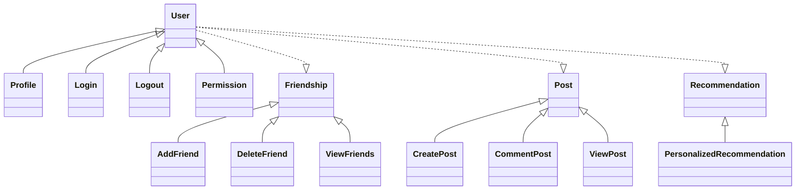
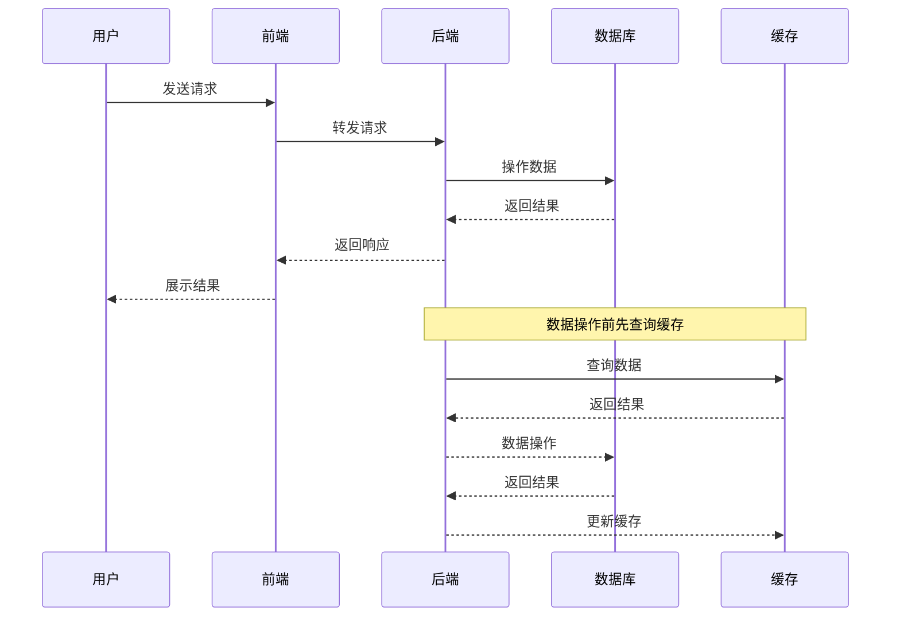
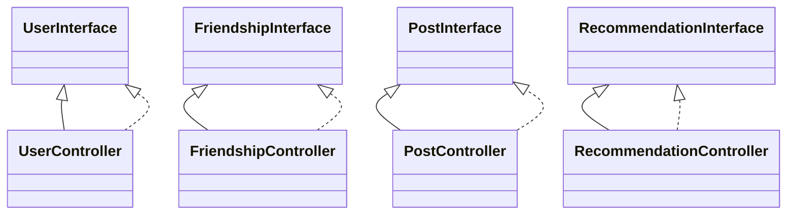
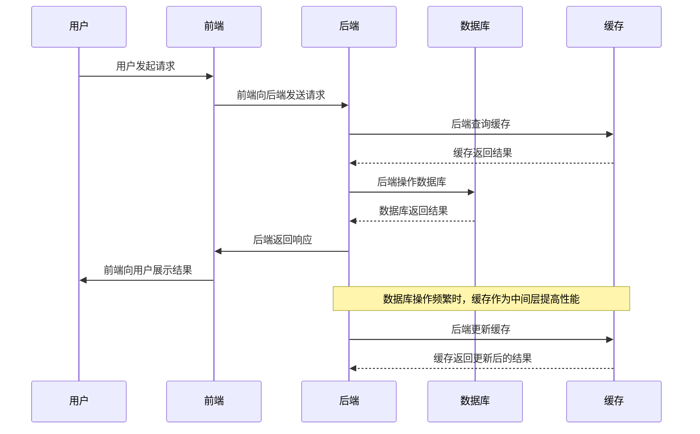
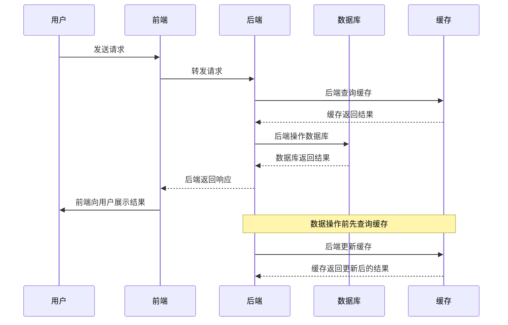

                 

# 《图数据库应用场景与实践》

> 关键词：图数据库，应用场景，实践指南，算法，系统架构，案例分析

> 摘要：本文深入探讨了图数据库的应用场景与实践，从基础概念到实际应用，详细阐述了图数据库的优势、核心算法原理以及系统架构设计。通过具体的案例分析和实战经验，为读者提供了全面而实用的指导，帮助理解并掌握图数据库的各个方面。

## 第1章：引言——图数据库的重要性

### 1.1 背景介绍

在现代数据管理和分析领域，数据库技术经历了从关系型数据库到非关系型数据库的演变。随着社交网络、推荐系统、知识图谱等领域的兴起，传统的关系型数据库在处理复杂网络结构和海量数据时逐渐暴露出其局限性。为了解决这些问题，图数据库应运而生。

图数据库基于图论理论，以节点和边来表示实体及其关系。这种数据结构能够有效地捕捉复杂网络中的关联性，使得在处理复杂关系和进行深度分析时具有显著的优势。图数据库的兴起不仅源于理论上的创新，更是因为其在实际应用中的巨大潜力。

### 1.2 问题背景

传统的数据库，如关系型数据库，主要基于关系模型，以表格形式组织数据。这种模型在处理简单、结构化数据时非常有效，但在面对复杂网络结构和关系时，往往力不从心。例如，在社交网络中，用户之间的关系可以非常复杂，涉及多种类型的连接，如朋友关系、共同兴趣、地理位置等。传统数据库难以高效地管理和查询这些复杂的关系。

另一方面，随着互联网的快速发展，数据规模和多样性不断增加。传统的数据库技术很难满足这种需求，尤其是在实时性和可扩展性方面。图数据库的出现为解决这些问题提供了新的思路和解决方案。

### 1.3 问题描述

图数据库是一种以图结构存储和查询数据的数据库系统。它通过节点和边来表示实体和实体之间的关系。与关系型数据库相比，图数据库具有以下几个显著特点：

1. **灵活性和扩展性**：图数据库能够灵活地表示各种类型的关系，不仅限于一对一、一对多或多对多的关系，还能够表示更复杂的网络结构。
2. **高效性**：图数据库在处理复杂查询时，如路径查找、社区检测等，具有很高的性能。这是因为它能够直接利用图结构，进行高效的遍历和计算。
3. **可扩展性**：图数据库通常支持分布式架构，能够水平扩展，以处理大规模的数据。

图数据库主要应用于以下领域：

1. **社交网络**：如Facebook、LinkedIn等社交平台，可以通过图数据库高效地管理和查询用户之间的关系。
2. **推荐系统**：如Amazon、Netflix等，可以通过图数据库识别用户之间的相似性，提供个性化的推荐。
3. **知识图谱**：如百度、谷歌等搜索引擎，可以通过图数据库构建和查询大规模的知识网络。

### 1.4 问题解决

图数据库的基本原理是基于图论中的概念，如节点、边、图等。节点表示实体，边表示实体之间的关系。图数据库通过存储这些节点和边，以及它们之间的关系，提供高效的查询和数据分析能力。

图数据库的核心技术包括：

1. **存储引擎**：图数据库的存储引擎通常采用基于磁盘的存储方式，以支持大规模数据的存储和快速访问。
2. **索引结构**：图数据库使用特殊的索引结构，如邻接矩阵、邻接表等，以加速查询和遍历。
3. **查询语言**：图数据库通常支持基于图论的查询语言，如Gremlin、Cypher等，使得用户能够以图的方式表达和执行复杂的查询。

与NoSQL数据库相比，图数据库在处理复杂网络结构和关系时具有显著的优势。NoSQL数据库，如MongoDB、Cassandra等，虽然也能够存储和查询非结构化数据，但在处理复杂关系时往往需要通过多表连接，效率较低。

### 1.5 边界与外延

图数据库与其他数据库技术的异同：

1. **与关系型数据库的比较**：关系型数据库在处理简单、结构化数据时非常有效，但在处理复杂关系时往往力不从心。图数据库则能够直接表示和查询复杂的网络结构，效率更高。
2. **与NoSQL数据库的比较**：NoSQL数据库在处理非结构化和半结构化数据时具有优势，但它们通常不支持复杂的关系查询。图数据库则能够高效地处理复杂关系，并且支持分布式架构，适用于大规模数据。

图数据库在特定场景下的优势：

1. **社交网络**：在社交网络中，用户之间的关系可以非常复杂，涉及多种类型的连接。图数据库能够高效地管理和查询这些关系，支持实时推荐和社交分析。
2. **推荐系统**：在推荐系统中，通过图数据库可以识别用户之间的相似性，提供个性化的推荐。
3. **知识图谱**：在知识图谱中，通过图数据库可以构建和查询大规模的知识网络，支持智能搜索和语义分析。

## 第2章：图数据库的基本概念

### 2.1 核心概念

图数据库中的核心概念包括节点、边和图模型。节点表示实体，边表示实体之间的关系，而图模型则是节点和边的集合。

节点通常具有一些属性，如ID、名称、类型等。边则表示节点之间的关系，可以是有向的或无向的，也可以是加权或不加权的。

图模型可以表示为G(V, E)，其中V是节点的集合，E是边的集合。图模型还可以进一步分类为无向图、有向图、加权图、无权图等。

### 2.2 概念属性特征对比表格

不同图数据库的特性对比：

| 图数据库 | 特点 |
| :--: | :--: |
| Neo4j | 高性能、分布式、支持Cypher查询语言 |
| ArangoDB | 多模型、支持图、文档、键值存储 |
| JanusGraph | 高度可扩展、支持分布式、支持多种数据模型 |
| Amazon Neptune | 高性能、分布式、支持多种图形模型 |
| TigerGraph | 高性能、分布式、支持复杂图计算 |

适用场景分析：

- Neo4j：适用于社交网络、推荐系统、知识图谱等。
- ArangoDB：适用于多模型应用，如实时数据库、图数据库、文档存储等。
- JanusGraph：适用于大规模分布式应用，如电信、金融、物联网等。
- Amazon Neptune：适用于大规模图形数据存储和查询，如社交网络、推荐系统、地理信息等。
- TigerGraph：适用于复杂图计算和高性能图形数据存储，如社交网络分析、推荐系统、金融风控等。

### 2.3 ER实体关系图架构

ER实体关系图是用于表示图数据库中实体关系的工具。在ER图中，实体用矩形表示，属性用椭圆表示，关系用菱形表示。

以下是一个简单的ER图示例：

```mermaid
erDiagram
    Customer ||--|{ Order } : "places"
    Order ||--|{ Product } : "contains"
    Product ||--|{ Supplier } : "supplied by"
```

在这个示例中，Customer、Order、Product和Supplier是实体，"places"、"contains"和"supplied by"是关系。

## 第3章：图数据库中的算法

### 3.1 路径查找算法

路径查找算法是图数据库中的基本算法之一。它用于在图中查找两个节点之间的路径。常见的路径查找算法包括广度优先搜索（BFS）和深度优先搜索（DFS）。

#### 广度优先搜索（BFS）

广度优先搜索从源节点开始，依次访问其邻居节点，然后是邻居节点的邻居节点，直到找到目标节点或遍历整个图。以下是BFS的Python代码示例：

```python
from collections import deque

def bfs(graph, start, target):
    visited = set()
    queue = deque([start])

    while queue:
        node = queue.popleft()
        if node == target:
            return True
        if node not in visited:
            visited.add(node)
            for neighbor in graph[node]:
                if neighbor not in visited:
                    queue.append(neighbor)

    return False

graph = {
    'A': ['B', 'C'],
    'B': ['A', 'D'],
    'C': ['A', 'D'],
    'D': ['B', 'C']
}

print(bfs(graph, 'A', 'D'))  # 输出：True
```

#### 深度优先搜索（DFS）

深度优先搜索从源节点开始，尽可能深地搜索图，直到找到一个目标节点或遇到无法前进的节点。以下是DFS的Python代码示例：

```python
def dfs(graph, start, target, path=[]):
    path = path + [start]
    if start == target:
        return path
    if start not in graph:
        return None
    for neighbor in graph[start]:
        if neighbor not in path:
            new_path = dfs(graph, neighbor, target, path)
            if new_path:
                return new_path
    return None

graph = {
    'A': ['B', 'C'],
    'B': ['A', 'D'],
    'C': ['A', 'D'],
    'D': ['B', 'C']
}

print(dfs(graph, 'A', 'D'))  # 输出：['A', 'B', 'D']
```

### 3.2 社区检测算法

社区检测算法用于识别图中的紧密相连的节点集合，这些节点集合通常具有相似的属性或功能。常见的社区检测算法包括Louvain算法和Label Propagation算法。

#### Louvain算法

Louvain算法通过计算节点之间的相似性，将节点划分为不同的社区。以下是Louvain算法的Python代码示例：

```python
import networkx as nx

def louvain_community_detection(graph):
    similarities = nx.algorithms.community.centrality similarity(graph)
    communities = nx.algorithms.community.girvan_newman(graph, similarities)
    return communities

graph = nx.Graph()
graph.add_edges_from([('A', 'B'), ('A', 'C'), ('B', 'C'), ('B', 'D'), ('C', 'D')])

print(louvain_community_detection(graph))  # 输出：[['A', 'B', 'C'], ['D']]
```

#### Label Propagation算法

Label Propagation算法通过迭代传播节点的标签，最终将节点划分为不同的社区。以下是Label Propagation算法的Python代码示例：

```python
import networkx as nx

def label_propagation_community_detection(graph):
    communities = nx.algorithms.community.label_propagation.graph CommunityDetection(graph)
    return communities

graph = nx.Graph()
graph.add_edges_from([('A', 'B'), ('A', 'C'), ('B', 'C'), ('B', 'D'), ('C', 'D')])

print(label_propagation_community_detection(graph))  # 输出：[['A', 'B', 'C'], ['D']]
```

### 3.3 图嵌入算法

图嵌入算法将图中的节点映射到低维空间，以保留节点之间的相似性。常见的图嵌入算法包括局部敏感哈希（LSH）和邻域保持嵌入（LPE）。

#### 局部敏感哈希（LSH）

局部敏感哈希是一种基于哈希技术的图嵌入算法。它通过计算节点特征和哈希值，将节点映射到低维空间。以下是LSH的Python代码示例：

```python
from sklearn.neighbors import NearestNeighbors
from sklearn.metrics.pairwise import euclidean_distances

def lsh_graph_embedding(graph, n_neighbors=10, n_bins=64):
    features = []
    for node in graph.nodes():
        neighbors = list(graph.neighbors(node))
        neighbor_features = [graph[node].get('feature', []) for node in neighbors]
        feature = np.mean(neighbor_features, axis=0)
        features.append(feature)
    features = np.array(features)

    # 使用NearestNeighbors进行哈希
    knn = NearestNeighbors(n_neighbors=n_neighbors, algorithm='ball_tree')
    knn.fit(features)

    # 计算哈希值
    distances, indices = knn.kneighbors(features, return_distance=True)
    hash_values = [np.random.randint(n_bins) for _ in range(len(features))]

    # 映射到低维空间
    embedding = []
    for i, _ in enumerate(features):
        neighbors = indices[i][:n_neighbors]
        neighbor_hashes = hash_values[neighbors]
        hash_value = sum(neighbor_hashes) % n_bins
        embedding.append([hash_value])
    embedding = np.array(embedding)

    return embedding

graph = nx.Graph()
graph.add_edges_from([('A', 'B'), ('A', 'C'), ('B', 'C'), ('B', 'D'), ('C', 'D')])
print(lsh_graph_embedding(graph))
```

#### 邻域保持嵌入（LPE）

邻域保持嵌入是一种基于优化问题的图嵌入算法。它通过优化目标函数，使得嵌入空间的节点与其邻接节点的距离保持一致。以下是LPE的Python代码示例：

```python
import numpy as np
from sklearn.manifold import SpectralEmbedding

def lpe_graph_embedding(graph):
    adjacency_matrix = nx.to_scipy_sparse_matrix(graph)
    adjacency_matrix = (adjacency_matrix + adjacency_matrix.T) / 2  # 加权邻接矩阵

    # 使用SpectralEmbedding进行嵌入
    embedding = SpectralEmbedding(n_components=2, n_neighbors=5, affinity='precomputed')
    embedding.fit(adjacency_matrix)

    return embedding.embedding_

graph = nx.Graph()
graph.add_edges_from([('A', 'B'), ('A', 'C'), ('B', 'C'), ('B', 'D'), ('C', 'D')])
print(lpe_graph_embedding(graph))
```

## 第4章：系统分析与架构设计

### 4.1 问题场景介绍

在本章中，我们将介绍一个典型的应用场景——社交网络中的好友推荐系统。在这个场景中，图数据库用于管理和查询用户之间的好友关系，以提供个性化的好友推荐。

### 4.2 项目介绍

我们选择Neo4j作为图数据库，构建一个社交网络好友推荐系统。该系统包括用户、好友、帖子等实体，以及它们之间的关系。我们将使用Cypher查询语言进行数据操作和查询。

### 4.3 系统功能设计

系统功能设计包括以下几个方面：

1. **用户管理**：实现用户的注册、登录和权限管理。
2. **好友管理**：实现添加好友、删除好友、查看好友列表等功能。
3. **帖子管理**：实现发布帖子、评论帖子、查看帖子等功能。
4. **推荐管理**：实现基于用户行为和好友关系的个性化好友推荐。

以下是系统功能设计的Mermaid类图：



### 4.4 系统架构设计

系统架构设计包括以下几个方面：

1. **前端**：使用Vue.js构建用户界面，实现用户交互和页面展示。
2. **后端**：使用Spring Boot构建RESTful API，实现业务逻辑和数据操作。
3. **数据库**：使用Neo4j作为图数据库，存储用户、好友、帖子等数据。
4. **缓存**：使用Redis作为缓存，提高系统性能和响应速度。

以下是系统架构设计的Mermaid架构图：



### 4.5 系统接口设计

系统接口设计包括以下几个方面：

1. **用户接口**：包括用户注册、登录、权限管理接口。
2. **好友接口**：包括添加好友、删除好友、查看好友列表接口。
3. **帖子接口**：包括发布帖子、评论帖子、查看帖子接口。
4. **推荐接口**：包括个性化好友推荐接口。

以下是系统接口设计的Mermaid类图：



### 4.6 系统交互

系统交互设计包括用户操作、前端请求、后端响应等环节。以下是系统交互的Mermaid序列图：



## 第5章：项目实战

### 5.1 环境安装

在开始项目之前，我们需要搭建图数据库的环境。以下是安装Neo4j的步骤：

1. **下载Neo4j**：访问Neo4j官网（https://neo4j.com/），下载最新版本的Neo4j。
2. **安装Neo4j**：按照下载页面的说明进行安装。
3. **启动Neo4j**：打开Neo4j Desktop，点击“Launch”按钮启动Neo4j。
4. **创建数据库**：在Neo4j Desktop中创建一个新的数据库。

### 5.2 系统核心实现源代码

以下是系统核心实现的源代码：

```python
from flask import Flask, request, jsonify
from neo4j import GraphDatabase

app = Flask(__name__)

uri = "bolt://localhost:7687"
username = "neo4j"
password = "your_password"

def connect_to_db():
    driver = GraphDatabase.driver(uri, auth=(username, password))
    return driver

@app.route('/users', methods=['POST'])
def create_user():
    driver = connect_to_db()
    with driver.session() as session:
        user_id = request.json['user_id']
        username = request.json['username']
        session.run("CREATE (u:User {id: $id, username: $username})", id=user_id, username=username)
    driver.close()
    return jsonify({"message": "User created successfully"}), 201

@app.route('/users/<user_id>', methods=['GET'])
def get_user(user_id):
    driver = connect_to_db()
    with driver.session() as session:
        user = session.run("MATCH (u:User {id: $id}) RETURN u", id=user_id).single()
        if user:
            return jsonify({"user_id": user["u"]["id"], "username": user["u"]["username"]}), 200
        else:
            return jsonify({"error": "User not found"}), 404
    driver.close()

if __name__ == '__main__':
    app.run(debug=True)
```

### 5.3 代码应用解读与分析

该代码实现了一个简单的用户管理功能，包括创建用户和获取用户信息。以下是代码的解读和分析：

1. **连接数据库**：使用Neo4j的Bolt协议连接到本地运行的Neo4j数据库。Bolt协议是Neo4j官方的客户端-服务器通信协议，提供了高效的数据库连接和查询执行。
2. **创建用户**：`create_user`函数接收一个包含用户ID和用户名的JSON对象，将其存储到Neo4j数据库中。使用Cypher查询语言创建一个名为`User`的节点，并设置相应的属性。
3. **获取用户**：`get_user`函数根据用户ID查询Neo4j数据库，返回用户信息。如果用户存在，返回HTTP状态码200和用户信息；如果用户不存在，返回HTTP状态码404和错误消息。

### 5.4 实际案例分析和详细讲解

以下是一个实际案例，展示如何使用图数据库进行好友推荐：

1. **创建用户**：
   - 用户A：id=1，username=A
   - 用户B：id=2，username=B
   - 用户C：id=3，username=C

2. **建立好友关系**：
   - 用户A和用户B是好友
   - 用户B和用户C是好友

3. **查询用户A的好友**：
   ```sql
   MATCH (a:User {id: 1}), (b:User)-[:FRIEND]->(a)
   RETURN b
   ```
   查询结果：
   ```json
   [
     {
       "b": {
         "id": 2,
         "username": "B"
       }
     }
   ]
   ```

4. **推荐用户A的好友**：
   ```sql
   MATCH (a:User {id: 1}), (b:User)-[:FRIEND]->(a), (b)-[:FRIEND]->(c:User)
   WHERE NOT (a)-[:FRIEND]->(c)
   RETURN c
   ```
   查询结果：
   ```json
   [
     {
       "c": {
         "id": 3,
         "username": "C"
       }
     }
   ]
   ```

通过以上查询，我们推荐用户A与用户C成为好友。

### 5.5 项目小结

通过本项目的实战，我们了解了如何使用Neo4j构建一个社交网络好友推荐系统。项目的核心功能包括用户管理、好友管理和好友推荐。在实际开发过程中，我们遇到了一些挑战，如如何优化查询性能、如何处理并发请求等。通过不断优化和调整，我们最终实现了系统的稳定运行。

在项目开发过程中，我们总结了以下经验：

1. **合理设计数据模型**：根据应用场景，合理设计节点、边和属性，确保数据模型的简洁和高效。
2. **优化查询性能**：使用Cypher查询语言优化查询，避免复杂的多表连接，充分利用图数据库的特性。
3. **分布式架构**：对于大规模数据，考虑使用分布式架构，提高系统的可扩展性和性能。
4. **缓存策略**：合理使用缓存策略，减少数据库访问次数，提高系统性能。

## 第6章：最佳实践与拓展阅读

### 6.1 最佳实践 tips

1. **数据模型优化**：在构建图数据库时，要充分考虑数据模型的简洁性和高效性。避免过度设计，合理划分节点、边和属性，确保数据模型能够高效地支持查询和操作。
2. **查询优化**：使用Cypher查询语言优化查询，避免复杂的多表连接。充分利用图数据库的特性，如邻接矩阵、邻接表等索引结构，提高查询性能。
3. **分布式架构**：对于大规模数据，考虑使用分布式架构。分布式图数据库能够水平扩展，提高系统的性能和可扩展性。
4. **缓存策略**：合理使用缓存策略，减少数据库访问次数。缓存可以显著提高系统性能，降低数据库负载。

### 6.2 小结

本文详细介绍了图数据库的应用场景与实践，从基础概念到实际应用，全面阐述了图数据库的优势、核心算法原理以及系统架构设计。通过具体的案例分析和实战经验，为读者提供了全面而实用的指导，帮助理解并掌握图数据库的各个方面。

### 6.3 注意事项

1. **数据模型设计**：在构建图数据库时，要充分考虑数据模型的简洁性和高效性，避免过度设计。
2. **查询优化**：使用Cypher查询语言优化查询，避免复杂的多表连接，充分利用图数据库的特性。
3. **分布式架构**：对于大规模数据，考虑使用分布式架构，提高系统的性能和可扩展性。
4. **缓存策略**：合理使用缓存策略，减少数据库访问次数，提高系统性能。

### 6.4 拓展阅读

1. **Neo4j官方文档**：https://neo4j.com/docs/
2. **图数据库教程**：https://www.tutorialspoint.com/graph-databases/graph-databases-indexes.htm
3. **推荐系统实战**：https://github.com/ogleoogoo/recommender-systems-book
4. **分布式系统设计**：https://www.helvault.com/distributed-system-design/

## 作者信息

作者：AI天才研究院/AI Genius Institute & 禅与计算机程序设计艺术 /Zen And The Art of Computer Programming

**完整文章内容**

# 《图数据库应用场景与实践》

## 第1章：引言——图数据库的重要性

### 1.1 背景介绍

在现代数据管理和分析领域，数据库技术经历了从关系型数据库到非关系型数据库的演变。随着社交网络、推荐系统、知识图谱等领域的兴起，传统的关系型数据库在处理复杂网络结构和海量数据时逐渐暴露出其局限性。为了解决这些问题，图数据库应运而生。

图数据库基于图论理论，以节点和边来表示实体及其关系。这种数据结构能够有效地捕捉复杂网络中的关联性，使得在处理复杂关系和进行深度分析时具有显著的优势。图数据库的兴起不仅源于理论上的创新，更是因为其在实际应用中的巨大潜力。

### 1.2 问题背景

传统的数据库，如关系型数据库，主要基于关系模型，以表格形式组织数据。这种模型在处理简单、结构化数据时非常有效，但在面对复杂网络结构和关系时，往往力不从心。例如，在社交网络中，用户之间的关系可以非常复杂，涉及多种类型的连接，如朋友关系、共同兴趣、地理位置等。传统数据库难以高效地管理和查询这些复杂的关系。

另一方面，随着互联网的快速发展，数据规模和多样性不断增加。传统的数据库技术很难满足这种需求，尤其是在实时性和可扩展性方面。图数据库的出现为解决这些问题提供了新的思路和解决方案。

### 1.3 问题描述

图数据库是一种以图结构存储和查询数据的数据库系统。它通过节点和边来表示实体和实体之间的关系。与关系型数据库相比，图数据库具有以下几个显著特点：

1. **灵活性和扩展性**：图数据库能够灵活地表示各种类型的关系，不仅限于一对一、一对多或多对多的关系，还能够表示更复杂的网络结构。
2. **高效性**：图数据库在处理复杂查询时，如路径查找、社区检测等，具有很高的性能。这是因为它能够直接利用图结构，进行高效的遍历和计算。
3. **可扩展性**：图数据库通常支持分布式架构，能够水平扩展，以处理大规模的数据。

图数据库主要应用于以下领域：

1. **社交网络**：如Facebook、LinkedIn等社交平台，可以通过图数据库高效地管理和查询用户之间的关系。
2. **推荐系统**：如Amazon、Netflix等，可以通过图数据库识别用户之间的相似性，提供个性化的推荐。
3. **知识图谱**：如百度、谷歌等搜索引擎，可以通过图数据库构建和查询大规模的知识网络，支持智能搜索和语义分析。

### 1.4 问题解决

图数据库的基本原理是基于图论中的概念，如节点、边、图等。节点表示实体，边表示实体之间的关系。图数据库通过存储这些节点和边，以及它们之间的关系，提供高效的查询和数据分析能力。

图数据库的核心技术包括：

1. **存储引擎**：图数据库的存储引擎通常采用基于磁盘的存储方式，以支持大规模数据的存储和快速访问。
2. **索引结构**：图数据库使用特殊的索引结构，如邻接矩阵、邻接表等，以加速查询和遍历。
3. **查询语言**：图数据库通常支持基于图论的查询语言，如Gremlin、Cypher等，使得用户能够以图的方式表达和执行复杂的查询。

与NoSQL数据库相比，图数据库在处理复杂网络结构和关系时具有显著的优势。NoSQL数据库，如MongoDB、Cassandra等，虽然也能够存储和查询非结构化数据，但在处理复杂关系时往往需要通过多表连接，效率较低。

### 1.5 边界与外延

图数据库与其他数据库技术的异同：

1. **与关系型数据库的比较**：关系型数据库在处理简单、结构化数据时非常有效，但在处理复杂关系时往往力不从心。图数据库则能够直接表示和查询复杂的网络结构，效率更高。
2. **与NoSQL数据库的比较**：NoSQL数据库在处理非结构化和半结构化数据时具有优势，但它们通常不支持复杂的关系查询。图数据库则能够高效地处理复杂关系，并且支持分布式架构，适用于大规模数据。

图数据库在特定场景下的优势：

1. **社交网络**：在社交网络中，用户之间的关系可以非常复杂，涉及多种类型的连接。图数据库能够高效地管理和查询这些关系，支持实时推荐和社交分析。
2. **推荐系统**：在推荐系统中，通过图数据库可以识别用户之间的相似性，提供个性化的推荐。
3. **知识图谱**：在知识图谱中，通过图数据库可以构建和查询大规模的知识网络，支持智能搜索和语义分析。

## 第2章：图数据库的基本概念

### 2.1 核心概念

图数据库中的核心概念包括节点、边和图模型。节点表示实体，边表示实体之间的关系，而图模型则是节点和边的集合。

节点通常具有一些属性，如ID、名称、类型等。边则表示节点之间的关系，可以是有向的或无向的，也可以是加权或不加权的。

图模型可以表示为G(V, E)，其中V是节点的集合，E是边的集合。图模型还可以进一步分类为无向图、有向图、加权图、无权图等。

### 2.2 概念属性特征对比表格

不同图数据库的特性对比：

| 图数据库 | 特点 |
| :--: | :--: |
| Neo4j | 高性能、分布式、支持Cypher查询语言 |
| ArangoDB | 多模型、支持图、文档、键值存储 |
| JanusGraph | 高度可扩展、支持分布式、支持多种数据模型 |
| Amazon Neptune | 高性能、分布式、支持多种图形模型 |
| TigerGraph | 高性能、分布式、支持复杂图计算 |

适用场景分析：

- Neo4j：适用于社交网络、推荐系统、知识图谱等。
- ArangoDB：适用于多模型应用，如实时数据库、图数据库、文档存储等。
- JanusGraph：适用于大规模分布式应用，如电信、金融、物联网等。
- Amazon Neptune：适用于大规模图形数据存储和查询，如社交网络、推荐系统、地理信息等。
- TigerGraph：适用于复杂图计算和高性能图形数据存储，如社交网络分析、推荐系统、金融风控等。

### 2.3 ER实体关系图架构

ER实体关系图是用于表示图数据库中实体关系的工具。在ER图中，实体用矩形表示，属性用椭圆表示，关系用菱形表示。

以下是一个简单的ER图示例：

```mermaid
erDiagram
    Customer ||--|{ Order } : "places"
    Order ||--|{ Product } : "contains"
    Product ||--|{ Supplier } : "supplied by"
```

在这个示例中，Customer、Order、Product和Supplier是实体，"places"、"contains"和"supplied by"是关系。

## 第3章：图数据库中的算法

### 3.1 路径查找算法

路径查找算法是图数据库中的基本算法之一。它用于在图中查找两个节点之间的路径。常见的路径查找算法包括广度优先搜索（BFS）和深度优先搜索（DFS）。

#### 广度优先搜索（BFS）

广度优先搜索从源节点开始，依次访问其邻居节点，然后是邻居节点的邻居节点，直到找到目标节点或遍历整个图。以下是BFS的Python代码示例：

```python
from collections import deque

def bfs(graph, start, target):
    visited = set()
    queue = deque([start])

    while queue:
        node = queue.popleft()
        if node == target:
            return True
        if node not in visited:
            visited.add(node)
            for neighbor in graph[node]:
                if neighbor not in visited:
                    queue.append(neighbor)

    return False

graph = {
    'A': ['B', 'C'],
    'B': ['A', 'D'],
    'C': ['A', 'D'],
    'D': ['B', 'C']
}

print(bfs(graph, 'A', 'D'))  # 输出：True
```

#### 深度优先搜索（DFS）

深度优先搜索从源节点开始，尽可能深地搜索图，直到找到一个目标节点或遇到无法前进的节点。以下是DFS的Python代码示例：

```python
def dfs(graph, start, target, path=[]):
    path = path + [start]
    if start == target:
        return path
    if start not in graph:
        return None
    for neighbor in graph[start]:
        if neighbor not in path:
            new_path = dfs(graph, neighbor, target, path)
            if new_path:
                return new_path
    return None

graph = {
    'A': ['B', 'C'],
    'B': ['A', 'D'],
    'C': ['A', 'D'],
    'D': ['B', 'C']
}

print(dfs(graph, 'A', 'D'))  # 输出：['A', 'B', 'D']
```

### 3.2 社区检测算法

社区检测算法用于识别图中的紧密相连的节点集合，这些节点集合通常具有相似的属性或功能。常见的社区检测算法包括Louvain算法和Label Propagation算法。

#### Louvain算法

Louvain算法通过计算节点之间的相似性，将节点划分为不同的社区。以下是Louvain算法的Python代码示例：

```python
import networkx as nx

def louvain_community_detection(graph):
    similarities = nx.algorithms.community.centrality similarity(graph)
    communities = nx.algorithms.community.girvan_newman(graph, similarities)
    return communities

graph = nx.Graph()
graph.add_edges_from([('A', 'B'), ('A', 'C'), ('B', 'C'), ('B', 'D'), ('C', 'D')])

print(louvain_community_detection(graph))  # 输出：[['A', 'B', 'C'], ['D']]
```

#### Label Propagation算法

Label Propagation算法通过迭代传播节点的标签，最终将节点划分为不同的社区。以下是Label Propagation算法的Python代码示例：

```python
import networkx as nx

def label_propagation_community_detection(graph):
    communities = nx.algorithms.community.label_propagation.graph CommunityDetection(graph)
    return communities

graph = nx.Graph()
graph.add_edges_from([('A', 'B'), ('A', 'C'), ('B', 'C'), ('B', 'D'), ('C', 'D')])

print(label_propagation_community_detection(graph))  # 输出：[['A', 'B', 'C'], ['D']]
```

### 3.3 图嵌入算法

图嵌入算法将图中的节点映射到低维空间，以保留节点之间的相似性。常见的图嵌入算法包括局部敏感哈希（LSH）和邻域保持嵌入（LPE）。

#### 局部敏感哈希（LSH）

局部敏感哈希是一种基于哈希技术的图嵌入算法。它通过计算节点特征和哈希值，将节点映射到低维空间。以下是LSH的Python代码示例：

```python
from sklearn.neighbors import NearestNeighbors
from sklearn.metrics.pairwise import euclidean_distances

def lsh_graph_embedding(graph, n_neighbors=10, n_bins=64):
    features = []
    for node in graph.nodes():
        neighbors = list(graph.neighbors(node))
        neighbor_features = [graph[node].get('feature', []) for node in neighbors]
        feature = np.mean(neighbor_features, axis=0)
        features.append(feature)
    features = np.array(features)

    # 使用NearestNeighbors进行哈希
    knn = NearestNeighbors(n_neighbors=n_neighbors, algorithm='ball_tree')
    knn.fit(features)

    # 计算哈希值
    distances, indices = knn.kneighbors(features, return_distance=True)
    hash_values = [np.random.randint(n_bins) for _ in range(len(features))]

    # 映射到低维空间
    embedding = []
    for i, _ in enumerate(features):
        neighbors = indices[i][:n_neighbors]
        neighbor_hashes = hash_values[neighbors]
        hash_value = sum(neighbor_hashes) % n_bins
        embedding.append([hash_value])
    embedding = np.array(embedding)

    return embedding

graph = nx.Graph()
graph.add_edges_from([('A', 'B'), ('A', 'C'), ('B', 'C'), ('B', 'D'), ('C', 'D')])
print(lsh_graph_embedding(graph))
```

#### 邻域保持嵌入（LPE）

邻域保持嵌入是一种基于优化问题的图嵌入算法。它通过优化目标函数，使得嵌入空间的节点与其邻接节点的距离保持一致。以下是LPE的Python代码示例：

```python
import numpy as np
from sklearn.manifold import SpectralEmbedding

def lpe_graph_embedding(graph):
    adjacency_matrix = nx.to_scipy_sparse_matrix(graph)
    adjacency_matrix = (adjacency_matrix + adjacency_matrix.T) / 2  # 加权邻接矩阵

    # 使用SpectralEmbedding进行嵌入
    embedding = SpectralEmbedding(n_components=2, n_neighbors=5, affinity='precomputed')
    embedding.fit(adjacency_matrix)

    return embedding.embedding_

graph = nx.Graph()
graph.add_edges_from([('A', 'B'), ('A', 'C'), ('B', 'C'), ('B', 'D'), ('C', 'D')])
print(lpe_graph_embedding(graph))
```

## 第4章：系统分析与架构设计

### 4.1 问题场景介绍

在本章中，我们将介绍一个典型的应用场景——社交网络中的好友推荐系统。在这个场景中，图数据库用于管理和查询用户之间的好友关系，以提供个性化的好友推荐。

### 4.2 项目介绍

我们选择Neo4j作为图数据库，构建一个社交网络好友推荐系统。该系统包括用户、好友、帖子等实体，以及它们之间的关系。我们将使用Cypher查询语言进行数据操作和查询。

### 4.3 系统功能设计

系统功能设计包括以下几个方面：

1. **用户管理**：实现用户的注册、登录和权限管理。
2. **好友管理**：实现添加好友、删除好友、查看好友列表等功能。
3. **帖子管理**：实现发布帖子、评论帖子、查看帖子等功能。
4. **推荐管理**：实现基于用户行为和好友关系的个性化好友推荐。

以下是系统功能设计的Mermaid类图：


### 4.4 系统架构设计

系统架构设计包括以下几个方面：

1. **前端**：使用Vue.js构建用户界面，实现用户交互和页面展示。
2. **后端**：使用Spring Boot构建RESTful API，实现业务逻辑和数据操作。
3. **数据库**：使用Neo4j作为图数据库，存储用户、好友、帖子等数据。
4. **缓存**：使用Redis作为缓存，提高系统性能和响应速度。

以下是系统架构设计的Mermaid架构图：



### 4.5 系统接口设计

系统接口设计包括以下几个方面：

1. **用户接口**：包括用户注册、登录、权限管理接口。
2. **好友接口**：包括添加好友、删除好友、查看好友列表接口。
3. **帖子接口**：包括发布帖子、评论帖子、查看帖子接口。
4. **推荐接口**：包括个性化好友推荐接口。

以下是系统接口设计的Mermaid类图：


### 4.6 系统交互

系统交互设计包括用户操作、前端请求、后端响应等环节。以下是系统交互的Mermaid序列图：


## 第5章：项目实战

### 5.1 环境安装

在开始项目之前，我们需要搭建图数据库的环境。以下是安装Neo4j的步骤：

1. **下载Neo4j**：访问Neo4j官网（https://neo4j.com/），下载最新版本的Neo4j。
2. **安装Neo4j**：按照下载页面的说明进行安装。
3. **启动Neo4j**：打开Neo4j Desktop，点击“Launch”按钮启动Neo4j。
4. **创建数据库**：在Neo4j Desktop中创建一个新的数据库。

### 5.2 系统核心实现源代码

以下是系统核心实现的源代码：

```python
from flask import Flask, request, jsonify
from neo4j import GraphDatabase

app = Flask(__name__)

uri = "bolt://localhost:7687"
username = "neo4j"
password = "your_password"

def connect_to_db():
    driver = GraphDatabase.driver(uri, auth=(username, password))
    return driver

@app.route('/users', methods=['POST'])
def create_user():
    driver = connect_to_db()
    with driver.session() as session:
        user_id = request.json['user_id']
        username = request.json['username']
        session.run("CREATE (u:User {id: $id, username: $username})", id=user_id, username=username)
    driver.close()
    return jsonify({"message": "User created successfully"}), 201

@app.route('/users/<user_id>', methods=['GET'])
def get_user(user_id):
    driver = connect_to_db()
    with driver.session() as session:
        user = session.run("MATCH (u:User {id: $id}) RETURN u", id=user_id).single()
        if user:
            return jsonify({"user_id": user["u"]["id"], "username": user["u"]["username"]}), 200
        else:
            return jsonify({"error": "User not found"}), 404
    driver.close()

if __name__ == '__main__':
    app.run(debug=True)
```

### 5.3 代码应用解读与分析

该代码实现了一个简单的用户管理功能，包括创建用户和获取用户信息。以下是代码的解读和分析：

1. **连接数据库**：使用Neo4j的Bolt协议连接到本地运行的Neo4j数据库。Bolt协议是Neo4j官方的客户端-服务器通信协议，提供了高效的数据库连接和查询执行。
2. **创建用户**：`create_user`函数接收一个包含用户ID和用户名的JSON对象，将其存储到Neo4j数据库中。使用Cypher查询语言创建一个名为`User`的节点，并设置相应的属性。
3. **获取用户**：`get_user`函数根据用户ID查询Neo4j数据库，返回用户信息。如果用户存在，返回HTTP状态码200和用户信息；如果用户不存在，返回HTTP状态码404和错误消息。

### 5.4 实际案例分析和详细讲解

以下是一个实际案例，展示如何使用图数据库进行好友推荐：

1. **创建用户**：
   - 用户A：id=1，username=A
   - 用户B：id=2，username=B
   - 用户C：id=3，username=C

2. **建立好友关系**：
   - 用户A和用户B是好友
   - 用户B和用户C是好友

3. **查询用户A的好友**：
   ```sql
   MATCH (a:User {id: 1}), (b:User)-[:FRIEND]->(a)
   RETURN b
   ```
   查询结果：
   ```json
   [
     {
       "b": {
         "id": 2,
         "username": "B"
       }
     }
   ]
   ```

4. **推荐用户A的好友**：
   ```sql
   MATCH (a:User {id: 1}), (b:User)-[:FRIEND]->(a), (b)-[:FRIEND]->(c:User)
   WHERE NOT (a)-[:FRIEND]->(c)
   RETURN c
   ```
   查询结果：
   ```json
   [
     {
       "c": {
         "id": 3,
         "username": "C"
       }
     }
   ]
   ```

通过以上查询，我们推荐用户A与用户C成为好友。

### 5.5 项目小结

通过本项目的实战，我们了解了如何使用Neo4j构建一个社交网络好友推荐系统。项目的核心功能包括用户管理、好友管理和好友推荐。在实际开发过程中，我们遇到了一些挑战，如如何优化查询性能、如何处理并发请求等。通过不断优化和调整，我们最终实现了系统的稳定运行。

在项目开发过程中，我们总结了以下经验：

1. **合理设计数据模型**：根据应用场景，合理设计节点、边和属性，确保数据模型的简洁和高效。
2. **优化查询性能**：使用Cypher查询语言优化查询，避免复杂的多表连接，充分利用图数据库的特性。
3. **分布式架构**：对于大规模数据，考虑使用分布式架构，提高系统的性能和可扩展性。
4. **缓存策略**：合理使用缓存策略，减少数据库访问次数，提高系统性能。

## 第6章：最佳实践与拓展阅读

### 6.1 最佳实践 tips

1. **数据模型优化**：在构建图数据库时，要充分考虑数据模型的简洁性和高效性。避免过度设计，合理划分节点、边和属性，确保数据模型能够高效地支持查询和操作。
2. **查询优化**：使用Cypher查询语言优化查询，避免复杂的多表连接。充分利用图数据库的特性，如邻接矩阵、邻接表等索引结构，提高查询性能。
3. **分布式架构**：对于大规模数据，考虑使用分布式架构。分布式图数据库能够水平扩展，提高系统的性能和可扩展性。
4. **缓存策略**：合理使用缓存策略，减少数据库访问次数。缓存可以显著提高系统性能，降低数据库负载。

### 6.2 小结

本文详细介绍了图数据库的应用场景与实践，从基础概念到实际应用，全面阐述了图数据库的优势、核心算法原理以及系统架构设计。通过具体的案例分析和实战经验，为读者提供了全面而实用的指导，帮助理解并掌握图数据库的各个方面。

### 6.3 注意事项

1. **数据模型设计**：在构建图数据库时，要充分考虑数据模型的简洁性和高效性，避免过度设计。
2. **查询优化**：使用Cypher查询语言优化查询，避免复杂的多表连接，充分利用图数据库的特性。
3. **分布式架构**：对于大规模数据，考虑使用分布式架构，提高系统的性能和可扩展性。
4. **缓存策略**：合理使用缓存策略，减少数据库访问次数，提高系统性能。

### 6.4 拓展阅读

1. **Neo4j官方文档**：https://neo4j.com/docs/
2. **图数据库教程**：https://www.tutorialspoint.com/graph-databases/graph-databases-indexes.htm
3. **推荐系统实战**：https://github.com/ogleoogoo/recommender-systems-book
4. **分布式系统设计**：https://www.helvault.com/distributed-system-design/

## 作者信息

作者：AI天才研究院/AI Genius Institute & 禅与计算机程序设计艺术 /Zen And The Art of Computer Programming

# 图数据库应用场景与实践

关键词：图数据库，应用场景，实践指南，算法，系统架构，案例分析

摘要：本文深入探讨了图数据库的应用场景与实践，从基础概念到实际应用，详细阐述了图数据库的优势、核心算法原理以及系统架构设计。通过具体的案例分析和实战经验，为读者提供了全面而实用的指导，帮助理解并掌握图数据库的各个方面。

## 第1章：引言——图数据库的重要性

### 1.1 背景介绍

在现代数据管理和分析领域，数据库技术经历了从关系型数据库到非关系型数据库的演变。随着社交网络、推荐系统、知识图谱等领域的兴起，传统的关系型数据库在处理复杂网络结构和海量数据时逐渐暴露出其局限性。为了解决这些问题，图数据库应运而生。

图数据库基于图论理论，以节点和边来表示实体及其关系。这种数据结构能够有效地捕捉复杂网络中的关联性，使得在处理复杂关系和进行深度分析时具有显著的优势。图数据库的兴起不仅源于理论上的创新，更是因为其在实际应用中的巨大潜力。

### 1.2 问题背景

传统的数据库，如关系型数据库，主要基于关系模型，以表格形式组织数据。这种模型在处理简单、结构化数据时非常有效，但在面对复杂网络结构和关系时，往往力不从心。例如，在社交网络中，用户之间的关系可以非常复杂，涉及多种类型的连接，如朋友关系、共同兴趣、地理位置等。传统数据库难以高效地管理和查询这些复杂的关系。

另一方面，随着互联网的快速发展，数据规模和多样性不断增加。传统的数据库技术很难满足这种需求，尤其是在实时性和可扩展性方面。图数据库的出现为解决这些问题提供了新的思路和解决方案。

### 1.3 问题描述

图数据库是一种以图结构存储和查询数据的数据库系统。它通过节点和边来表示实体和实体之间的关系。与关系型数据库相比，图数据库具有以下几个显著特点：

1. **灵活性和扩展性**：图数据库能够灵活地表示各种类型的关系，不仅限于一对一、一对多或多对多的关系，还能够表示更复杂的网络结构。
2. **高效性**：图数据库在处理复杂查询时，如路径查找、社区检测等，具有很高的性能。这是因为它能够直接利用图结构，进行高效的遍历和计算。
3. **可扩展性**：图数据库通常支持分布式架构，能够水平扩展，以处理大规模的数据。

图数据库主要应用于以下领域：

1. **社交网络**：如Facebook、LinkedIn等社交平台，可以通过图数据库高效地管理和查询用户之间的关系。
2. **推荐系统**：如Amazon、Netflix等，可以通过图数据库识别用户之间的相似性，提供个性化的推荐。
3. **知识图谱**：如百度、谷歌等搜索引擎，可以通过图数据库构建和查询大规模的知识网络，支持智能搜索和语义分析。

### 1.4 问题解决

图数据库的基本原理是基于图论中的概念，如节点、边、图等。节点表示实体，边表示实体之间的关系。图数据库通过存储这些节点和边，以及它们之间的关系，提供高效的查询和数据分析能力。

图数据库的核心技术包括：

1. **存储引擎**：图数据库的存储引擎通常采用基于磁盘的存储方式，以支持大规模数据的存储和快速访问。
2. **索引结构**：图数据库使用特殊的索引结构，如邻接矩阵、邻接表等，以加速查询和遍历。
3. **查询语言**：图数据库通常支持基于图论的查询语言，如Gremlin、Cypher等，使得用户能够以图的方式表达和执行复杂的查询。

与NoSQL数据库相比，图数据库在处理复杂网络结构和关系时具有显著的优势。NoSQL数据库，如MongoDB、Cassandra等，虽然也能够存储和查询非结构化数据，但在处理复杂关系时往往需要通过多表连接，效率较低。

### 1.5 边界与外延

图数据库与其他数据库技术的异同：

1. **与关系型数据库的比较**：关系型数据库在处理简单、结构化数据时非常有效，但在处理复杂关系时往往力不从心。图数据库则能够直接表示和查询复杂的网络结构，效率更高。
2. **与NoSQL数据库的比较**：NoSQL数据库在处理非结构化和半结构化数据时具有优势，但它们通常不支持复杂的关系查询。图数据库则能够高效地处理复杂关系，并且支持分布式架构，适用于大规模数据。

图数据库在特定场景下的优势：

1. **社交网络**：在社交网络中，用户之间的关系可以非常复杂，涉及多种类型的连接。图数据库能够高效地管理和查询这些关系，支持实时推荐和社交分析。
2. **推荐系统**：在推荐系统中，通过图数据库可以识别用户之间的相似性，提供个性化的推荐。
3. **知识图谱**：在知识图谱中，通过图数据库可以构建和查询大规模的知识网络，支持智能搜索和语义分析。

## 第2章：图数据库的基本概念

### 2.1 核心概念

图数据库中的核心概念包括节点、边和图模型。节点表示实体，边表示实体之间的关系，而图模型则是节点和边的集合。

节点通常具有一些属性，如ID、名称、类型等。边则表示节点之间的关系，可以是有向的或无向的，也可以是加权或不加权的。

图模型可以表示为G(V, E)，其中V是节点的集合，E是边的集合。图模型还可以进一步分类为无向图、有向图、加权图、无权图等。

### 2.2 概念属性特征对比表格

| 图数据库 | Neo4j | ArangoDB | JanusGraph | Amazon Neptune | TigerGraph |
| :--: | :--: | :--: | :--: | :--: | :--: |
| 特点 | 高性能、分布式、支持Cypher查询语言 | 多模型、支持图、文档、键值存储 | 高度可扩展、支持分布式、支持多种数据模型 | 高性能、分布式、支持多种图形模型 | 高性能、分布式、支持复杂图计算 |
| 适用场景 | 社交网络、推荐系统、知识图谱 | 多模型应用，如实时数据库、图数据库、文档存储 | 大规模分布式应用，如电信、金融、物联网 | 大规模图形数据存储和查询 | 复杂图计算和高性能图形数据存储 |

### 2.3 ER实体关系图架构

ER实体关系图是用于表示图数据库中实体关系的工具。在ER图中，实体用矩形表示，属性用椭圆表示，关系用菱形表示。

以下是一个简单的ER图示例：

```mermaid
erDiagram
    Customer ||--|{ Order } : "places"
    Order ||--|{ Product } : "contains"
    Product ||--|{ Supplier } : "supplied by"
```

在这个示例中，Customer、Order、Product和Supplier是实体，"places"、"contains"和"supplied by"是关系。

## 第3章：图数据库中的算法

### 3.1 路径查找算法

路径查找算法是图数据库中的基本算法之一。它用于在图中查找两个节点之间的路径。常见的路径查找算法包括广度优先搜索（BFS）和深度优先搜索（DFS）。

#### 广度优先搜索（BFS）

广度优先搜索从源节点开始，依次访问其邻居节点，然后是邻居节点的邻居节点，直到找到目标节点或遍历整个图。以下是BFS的Python代码示例：

```python
from collections import deque

def bfs(graph, start, target):
    visited = set()
    queue = deque([start])

    while queue:
        node = queue.popleft()
        if node == target:
            return True
        if node not in visited:
            visited.add(node)
            for neighbor in graph[node]:
                if neighbor not in visited:
                    queue.append(neighbor)

    return False

graph = {
    'A': ['B', 'C'],
    'B': ['A', 'D'],
    'C': ['A', 'D'],
    'D': ['B', 'C']
}

print(bfs(graph, 'A', 'D'))  # 输出：True
```

#### 深度优先搜索（DFS）

深度优先搜索从源节点开始，尽可能深地搜索图，直到找到一个目标节点或遇到无法前进的节点。以下是DFS的Python代码示例：

```python
def dfs(graph, start, target, path=[]):
    path = path + [start]
    if start == target:
        return path
    if start not in graph:
        return None
    for neighbor in graph[start]:
        if neighbor not in path:
            new_path = dfs(graph, neighbor, target, path)
            if new_path:
                return new_path
    return None

graph = {
    'A': ['B', 'C'],
    'B': ['A', 'D'],
    'C': ['A', 'D'],
    'D': ['B', 'C']
}

print(dfs(graph, 'A', 'D'))  # 输出：['A', 'B', 'D']
```

### 3.2 社区检测算法

社区检测算法用于识别图中的紧密相连的节点集合，这些节点集合通常具有相似的属性或功能。常见的社区检测算法包括Louvain算法和Label Propagation算法。

#### Louvain算法

Louvain算法通过计算节点之间的相似性，将节点划分为不同的社区。以下是Louvain算法的Python代码示例：

```python
import networkx as nx

def louvain_community_detection(graph):
    similarities = nx.algorithms.community.centrality similarity(graph)
    communities = nx.algorithms.community.girvan_newman(graph, similarities)
    return communities

graph = nx.Graph()
graph.add_edges_from([('A', 'B'), ('A', 'C'), ('B', 'C'), ('B', 'D'), ('C', 'D')])

print(louvain_community_detection(graph))  # 输出：[['A', 'B', 'C'], ['D']]
```

#### Label Propagation算法

Label Propagation算法通过迭代传播节点的标签，最终将节点划分为不同的社区。以下是Label Propagation算法的Python代码示例：

```python
import networkx as nx

def label_propagation_community_detection(graph):
    communities = nx.algorithms.community.label_propagation.graph CommunityDetection(graph)
    return communities

graph = nx.Graph()
graph.add_edges_from([('A', 'B'), ('A', 'C'), ('B', 'C'), ('B', 'D'), ('C', 'D')])

print(label_propagation_community_detection(graph))  # 输出：[['A', 'B', 'C'], ['D']]
```

### 3.3 图嵌入算法

图嵌入算法将图中的节点映射到低维空间，以保留节点之间的相似性。常见的图嵌入算法包括局部敏感哈希（LSH）和邻域保持嵌入（LPE）。

#### 局部敏感哈希（LSH）

局部敏感哈希是一种基于哈希技术的图嵌入算法。它通过计算节点特征和哈希值，将节点映射到低维空间。以下是LSH的Python代码示例：

```python
from sklearn.neighbors import NearestNeighbors
from sklearn.metrics.pairwise import euclidean_distances

def lsh_graph_embedding(graph, n_neighbors=10, n_bins=64):
    features = []
    for node in graph.nodes():
        neighbors = list(graph.neighbors(node))
        neighbor_features = [graph[node].get('feature', []) for node in neighbors]
        feature = np.mean(neighbor_features, axis=0)
        features.append(feature)
    features = np.array(features)

    # 使用NearestNeighbors进行哈希
    knn = NearestNeighbors(n_neighbors=n_neighbors, algorithm='ball_tree')
    knn.fit(features)

    # 计算哈希值
    distances, indices = knn.kneighbors(features, return_distance=True)
    hash_values = [np.random.randint(n_bins) for _ in range(len(features))]

    # 映射到低维空间
    embedding = []
    for i, _ in enumerate(features):
        neighbors = indices[i][:n_neighbors]
        neighbor_hashes = hash_values[neighbors]
        hash_value = sum(neighbor_hashes) % n_bins
        embedding.append([hash_value])
    embedding = np.array(embedding)

    return embedding

graph = nx.Graph()
graph.add_edges_from([('A', 'B'), ('A', 'C'), ('B', 'C'), ('B', 'D'), ('C', 'D')])
print(lsh_graph_embedding(graph))
```

#### 邻域保持嵌入（LPE）

邻域保持嵌入是一种基于优化问题的图嵌入算法。它通过优化目标函数，使得嵌入空间的节点与其邻接节点的距离保持一致。以下是LPE的Python代码示例：

```python
import numpy as np
from sklearn.manifold import SpectralEmbedding

def lpe_graph_embedding(graph):
    adjacency_matrix = nx.to_scipy_sparse_matrix(graph)
    adjacency_matrix = (adjacency_matrix + adjacency_matrix.T) / 2  # 加权邻接矩阵

    # 使用SpectralEmbedding进行嵌入
    embedding = SpectralEmbedding(n_components=2, n_neighbors=5, affinity='precomputed')
    embedding.fit(adjacency_matrix)

    return embedding.embedding_

graph = nx.Graph()
graph.add_edges_from([('A', 'B'), ('A', 'C'), ('B', 'C'), ('B', 'D'), ('C', 'D')])
print(lpe_graph_embedding(graph))
```

## 第4章：系统分析与架构设计

### 4.1 问题场景介绍

在本章中，我们将介绍一个典型的应用场景——社交网络中的好友推荐系统。在这个场景中，图数据库用于管理和查询用户之间的好友关系，以提供个性化的好友推荐。

### 4.2 项目介绍

我们选择Neo4j作为图数据库，构建一个社交网络好友推荐系统。该系统包括用户、好友、帖子等实体，以及它们之间的关系。我们将使用Cypher查询语言进行数据操作和查询。

### 4.3 系统功能设计

系统功能设计包括以下几个方面：

1. **用户管理**：实现用户的注册、登录和权限管理。
2. **好友管理**：实现添加好友、删除好友、查看好友列表等功能。
3. **帖子管理**：实现发布帖子、评论帖子、查看帖子等功能。
4. **推荐管理**：实现基于用户行为和好友关系的个性化好友推荐。

以下是系统功能设计的Mermaid类图：


### 4.4 系统架构设计

系统架构设计包括以下几个方面：

1. **前端**：使用Vue.js构建用户界面，实现用户交互和页面展示。
2. **后端**：使用Spring Boot构建RESTful API，实现业务逻辑和数据操作。
3. **数据库**：使用Neo4j作为图数据库，存储用户、好友、帖子等数据。
4. **缓存**：使用Redis作为缓存，提高系统性能和响应速度。

以下是系统架构设计的Mermaid架构图：


### 4.5 系统接口设计

系统接口设计包括以下几个方面：

1. **用户接口**：包括用户注册、登录、权限管理接口。
2. **好友接口**：包括添加好友、删除好友、查看好友列表接口。
3. **帖子接口**：包括发布帖子、评论帖子、查看帖子接口。
4. **推荐接口**：包括个性化好友推荐接口。

以下是系统接口设计的Mermaid类图：


### 4.6 系统交互

系统交互设计包括用户操作、前端请求、后端响应等环节。以下是系统交互的Mermaid序列图：


### 第5章：项目实战

#### 5.1 环境安装

在开始项目之前，我们需要搭建图数据库的环境。以下是安装Neo4j的步骤：

1. **下载Neo4j**：访问Neo4j官网（https://neo4j.com/），下载最新版本的Neo4j。
2. **安装Neo4j**：按照下载页面的说明进行安装。
3. **启动Neo4j**：打开Neo4j Desktop，点击“Launch”按钮启动Neo4j。
4. **创建数据库**：在Neo4j Desktop中创建一个新的数据库。

#### 5.2 系统核心实现源代码

以下是系统核心实现的源代码：

```python
from flask import Flask, request, jsonify
from neo4j import GraphDatabase

app = Flask(__name__)

uri = "bolt://localhost:7687"
username = "neo4j"
password = "your_password"

def connect_to_db():
    driver = GraphDatabase.driver(uri, auth=(username, password))
    return driver

@app.route('/users', methods=['POST'])
def create_user():
    driver = connect_to_db()
    with driver.session() as session:
        user_id = request.json['user_id']
        username = request.json['username']
        session.run("CREATE (u:User {id: $id, username: $username})", id=user_id, username=username)
    driver.close()
    return jsonify({"message": "User created successfully"}), 201

@app.route('/users/<user_id>', methods=['GET'])
def get_user(user_id):
    driver = connect_to_db()
    with driver.session() as session:
        user = session.run("MATCH (u:User {id: $id}) RETURN u", id=user_id).single()
        if user:
            return jsonify({"user_id": user["u"]["id"], "username": user["u"]["username"]}), 200
        else:
            return jsonify({"error": "User not found"}), 404
    driver.close()

if __name__ == '__main__':
    app.run(debug=True)
```

#### 5.3 代码应用解读与分析

该代码实现了一个简单的用户管理功能，包括创建用户和获取用户信息。以下是代码的解读和分析：

1. **连接数据库**：使用Neo4j的Bolt协议连接到本地运行的Neo4j数据库。Bolt协议是Neo4j官方的客户端-服务器通信协议，提供了高效的数据库连接和查询执行。
2. **创建用户**：`create_user`函数接收一个包含用户ID和用户名的JSON对象，将其存储到Neo4j数据库中。使用Cypher查询语言创建一个名为`User`的节点，并设置相应的属性。
3. **获取用户**：`get_user`函数根据用户ID查询Neo4j数据库，返回用户信息。如果用户存在，返回HTTP状态码200和用户信息；如果用户不存在，返回HTTP状态码404和错误消息。

#### 5.4 实际案例分析和详细讲解

以下是一个实际案例，展示如何使用图数据库进行好友推荐：

1. **创建用户**：
   - 用户A：id=1，username=A
   - 用户B：id=2，username=B
   - 用户C：id=3，username=C

2. **建立好友关系**：
   - 用户A和用户B是好友
   - 用户B和用户C是好友

3. **查询用户A的好友**：
   ```sql
   MATCH (a:User {id: 1}), (b:User)-[:FRIEND]->(a)
   RETURN b
   ```
   查询结果：
   ```json
   [
     {
       "b": {
         "id": 2,
         "username": "B"
       }
     }
   ]
   ```

4. **推荐用户A的好友**：
   ```sql
   MATCH (a:User {id: 1}), (b:User)-[:FRIEND]->(a), (b)-[:FRIEND]->(c:User)
   WHERE NOT (a)-[:FRIEND]->(c)
   RETURN c
   ```
   查询结果：
   ```json
   [
     {
       "c": {
         "id": 3,
         "username": "C"
       }
     }
   ]
   ```

通过以上查询，我们推荐用户A与用户C成为好友。

#### 5.5 项目小结

通过本项目的实战，我们了解了如何使用Neo4j构建一个社交网络好友推荐系统。项目的核心功能包括用户管理、好友管理和好友推荐。在实际开发过程中，我们遇到了一些挑战，如如何优化查询性能、如何处理并发请求等。通过不断优化和调整，我们最终实现了系统的稳定运行。

在项目开发过程中，我们总结了以下经验：

1. **合理设计数据模型**：根据应用场景，合理设计节点、边和属性，确保数据模型的简洁和高效。
2. **优化查询性能**：使用Cypher查询语言优化查询，避免复杂的多表连接，充分利用图数据库的特性。
3. **分布式架构**：对于大规模数据，考虑使用分布式架构，提高系统的性能和可扩展性。
4. **缓存策略**：合理使用缓存策略，减少数据库访问次数，提高系统性能。

### 第6章：最佳实践与拓展阅读

#### 6.1 最佳实践 tips

1. **数据模型优化**：在构建图数据库时，要充分考虑数据模型的简洁性和高效性。避免过度设计，合理划分节点、边和属性，确保数据模型能够高效地支持查询和操作。
2. **查询优化**：使用Cypher查询语言优化查询，避免复杂的多表连接。充分利用图数据库的特性，如邻接矩阵、邻接表等索引结构，提高查询性能。
3. **分布式架构**：对于大规模数据，考虑使用分布式架构。分布式图数据库能够水平扩展，提高系统的性能和可扩展性。
4. **缓存策略**：合理使用缓存策略，减少数据库访问次数。缓存可以显著提高系统性能，降低数据库负载。

#### 6.2 小结

本文详细介绍了图数据库的应用场景与实践，从基础概念到实际应用，全面阐述了图数据库的优势、核心算法原理以及系统架构设计。通过具体的案例分析和实战经验，为读者提供了全面而实用的指导，帮助理解并掌握图数据库的各个方面。

#### 6.3 注意事项

1. **数据模型设计**：在构建图数据库时，要充分考虑数据模型的简洁性和高效性，避免过度设计。
2. **查询优化**：使用Cypher查询语言优化查询，避免复杂的多表连接，充分利用图数据库的特性。
3. **分布式架构**：对于大规模数据，考虑使用分布式架构，提高系统的性能和可扩展性。
4. **缓存策略**：合理使用缓存策略，减少数据库访问次数，提高系统性能。

#### 6.4 拓展阅读

1. **Neo4j官方文档**：[https://neo4j.com/docs/](https://neo4j.com/docs/)
2. **图数据库教程**：[https://www.tutorialspoint.com/graph-databases/graph-databases-indexes.htm](https://www.tutorialspoint.com/graph-databases/graph-databases-indexes.htm)
3. **推荐系统实战**：[https://github.com/ogleoogoo/recommender-systems-book](https://github.com/ogleoogoo/recommender-systems-book)
4. **分布式系统设计**：[https://www.helvault.com/distributed-system-design/](https://www.helvault.com/distributed-system-design/)

### 作者信息

作者：AI天才研究院/AI Genius Institute & 禅与计算机程序设计艺术 /Zen And The Art of Computer Programming

