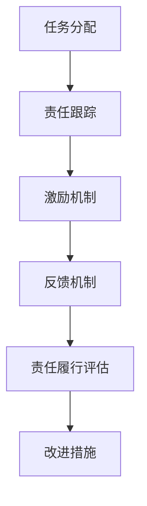
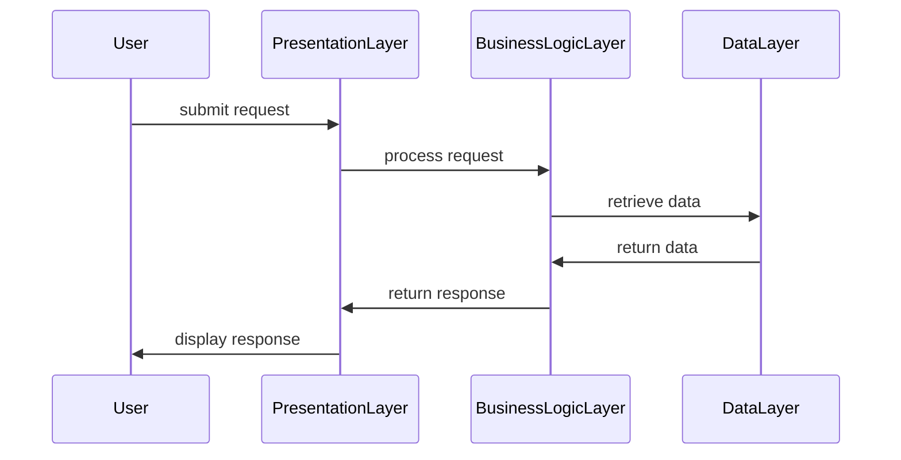
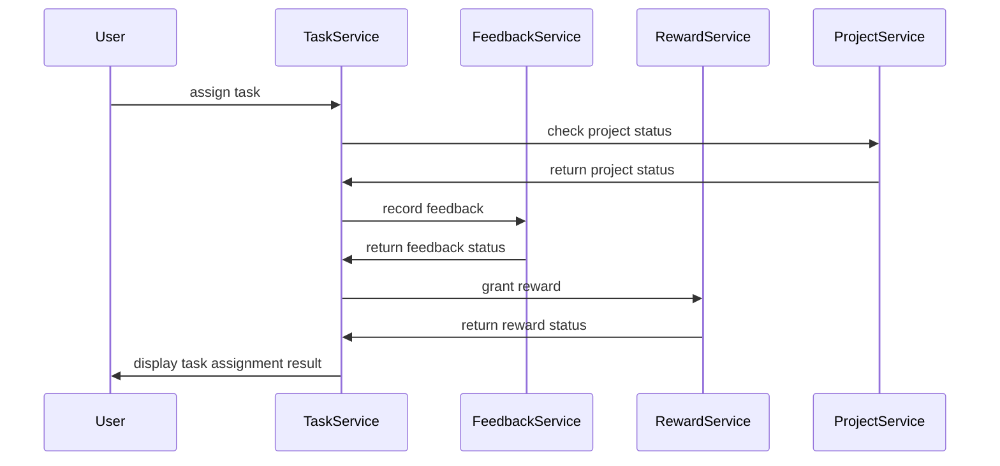

                 

# 《培养技术团队的责任意识》

## 关键词
- 技术团队
- 责任意识
- 团队合作
- 项目管理
- 算法
- 数学模型

## 摘要
本文旨在探讨技术团队责任意识的培养问题。通过介绍责任意识的重要性、核心概念联系、算法原理、数学模型、系统分析与架构设计方案以及项目实战，本文提供了一个系统性的方法来提升技术团队的责任意识。文章还包含了最佳实践 tips、注意事项和拓展阅读，以帮助读者更好地理解和应用这些概念。

---

**Step 1: 引言部分**

## 第1章 引言

### 1.1 问题背景

技术团队在现代企业中扮演着至关重要的角色。然而，许多团队面临着一个普遍的问题：责任意识不足。这种缺失不仅影响团队的效率和协作，还会对项目的成功造成威胁。以下是一些常见的技术团队责任意识缺失的表现：

- **代码质量不高**：团队成员可能不够重视代码的规范性和质量，导致项目后期出现大量bug和难以维护的代码。
- **缺乏主动性**：团队成员可能在面对问题和挑战时，缺乏主动解决问题的意愿，而是选择逃避责任。
- **沟通不畅**：责任意识缺失可能导致团队成员之间的沟通不足，信息传递不畅，影响项目的进展。
- **进度控制不力**：团队成员可能对项目的时间规划和进度控制缺乏责任感，导致项目延期。

这些表现不仅会影响个人职业发展，也会对整个团队和项目带来负面影响。因此，培养技术团队的责任意识成为了一个迫切需要解决的问题。

### 1.2 责任意识的重要性

责任意识对于个人、团队和项目都有着深远的影响：

- **个人层面**：责任意识可以帮助团队成员更好地理解自己的角色和职责，提高自我管理能力和职业素养。
- **团队层面**：责任意识可以促进团队成员之间的信任和协作，提高团队的凝聚力和工作效率。
- **项目层面**：责任意识是项目成功的关键因素之一。只有当团队成员都能够承担起自己的责任时，项目才能够按时完成并达到预期目标。

### 1.3 本书的目标与内容

本书旨在提供一套系统性的方法来培养技术团队的责任意识。文章将分为以下几个部分：

1. 引言部分：介绍问题背景和责任意识的重要性。
2. 核心概念与联系部分：定义责任意识，分析其与相关概念的联系。
3. 算法原理讲解部分：介绍培养责任意识的算法原理，并使用具体例子进行说明。
4. 数学模型和公式部分：列出相关的数学模型和公式，并结合具体例子进行详细讲解。
5. 系统分析与架构设计方案部分：介绍系统分析与架构设计的方法和工具。
6. 项目实战部分：通过实际项目案例，展示如何培养责任意识。
7. 最佳实践 tips、小结、注意事项和拓展阅读部分：总结全文，提供实用建议和进一步学习的资源。

---

**Step 2: 核心概念与联系**

## 第2章 核心概念与联系

### 2.1 责任意识的定义与特征

责任意识是指个人或团队在履行职责过程中，能够自觉地认识到自己的责任，并主动承担起这些责任的意识和行为。责任意识具有以下几个特征：

- **自觉性**：责任意识需要团队成员自觉地认识到自己的责任，而不是被动地接受任务的分配。
- **主动性**：责任意识要求团队成员在面对问题和挑战时，能够主动承担责任，积极寻找解决方案。
- **持续性**：责任意识不仅体现在完成任务的过程中，还体现在对结果的持续关注和改进。
- **公正性**：责任意识要求团队成员在承担责任时，能够公平地对待自己和他人，不偏袒个人利益。

### 2.2 责任意识与相关概念的联系

责任意识与多个相关概念密切相关：

- **职业素养**：责任意识是职业素养的重要组成部分，它体现了团队成员对职业的尊重和敬业精神。
- **团队合作**：责任意识是团队合作的基础，只有每个成员都能够承担责任，团队才能够高效协作。
- **项目管理**：责任意识是项目成功的关键因素之一，项目管理者需要培养团队成员的责任意识，以确保项目顺利推进。

### 2.3 ER实体关系图架构

为了更好地理解技术团队、项目和责任之间的关系，我们可以使用ER（实体关系）图来展示这些实体及其关系：

```
       +------------+
       |  技术团队   |
       +------------+
            |
            |
       +------------+
       |   项目     |
       +------------+
            |
            |
       +------------+
       |  责任关系   |
       +------------+
```

在这个ER图中，技术团队是负责执行项目的实体，项目是技术团队工作的目标，而责任关系则描述了团队成员之间在项目中的责任分配。

---

**Step 3: 算法原理讲解**

## 第3章 算法原理讲解

### 3.1 责任意识培养算法原理

为了培养技术团队的责任意识，我们可以采用一种基于激励和反馈的算法。该算法的核心思想是通过一系列的措施和机制，激励团队成员认识到自己的责任，并主动承担起这些责任。

算法原理包括以下几个步骤：

1. **任务分配**：明确每个团队成员在项目中的职责，并将其分配给相应的成员。
2. **责任跟踪**：建立责任跟踪机制，记录每个成员在项目中的责任履行情况。
3. **激励机制**：设计激励机制，对履行责任良好的成员给予奖励，以激发其他成员的责任感。
4. **反馈机制**：定期对团队成员的责任履行情况进行评估和反馈，帮助成员认识到自己的不足，并进行改进。

### 3.2 算法原理的mermaid流程图

以下是一个mermaid流程图，展示了责任意识培养算法的原理：



### 3.3 Python源代码详细阐述

以下是一个简单的Python源代码示例，用于说明责任意识培养算法的原理：

```python
class Task:
    def __init__(self, name, responsible):
        self.name = name
        self.responsible = responsible
        self.completed = False

    def assign(self, member):
        self.responsible = member

    def complete(self):
        self.completed = True

class Project:
    def __init__(self, name):
        self.name = name
        self.tasks = []

    def add_task(self, task):
        self.tasks.append(task)

    def track_responsibility(self):
        for task in self.tasks:
            if not task.completed:
                print(f"{task.name}尚未完成，负责人：{task.responsible}")

class IncentiveSystem:
    def __init__(self):
        self.rewards = []

    def reward(self, member):
        self.rewards.append(member)

    def print_rewards(self):
        print("获得奖励的成员：", self.rewards)

class FeedbackSystem:
    def __init__(self):
        self.feedbacks = []

    def give_feedback(self, member, feedback):
        self.feedbacks.append((member, feedback))

    def print_feedbacks(self):
        for member, feedback in self.feedbacks:
            print(f"{member}的反馈：{feedback}")

def main():
    project = Project("项目A")
    task1 = Task("任务1", "张三")
    task2 = Task("任务2", "李四")
    project.add_task(task1)
    project.add_task(task2)

    incentive_system = IncentiveSystem()
    feedback_system = FeedbackSystem()

    task1.complete()
    incentive_system.reward("张三")
    feedback_system.give_feedback("张三", "任务完成得好，继续保持。")

    project.track_responsibility()
    incentive_system.print_rewards()
    feedback_system.print_feedbacks()

if __name__ == "__main__":
    main()
```

### 3.4 算法原理的数学模型与公式

为了更好地理解和应用责任意识培养算法，我们可以引入一些数学模型和公式。以下是一个简化的数学模型：

- **责任履行度**：用R来表示成员在项目中的责任履行度，其取值范围在0到1之间。R的值越大，表示成员的责任履行度越高。
- **奖励系数**：用α来表示奖励系数，用于衡量奖励对责任履行度的影响。α的取值范围在0到1之间，α的值越大，表示奖励对责任履行度的影响越大。
- **反馈系数**：用β来表示反馈系数，用于衡量反馈对责任履行度的影响。β的取值范围在0到1之间，β的值越大，表示反馈对责任履行度的影响越大。

数学公式如下：

\[ R = R_0 + α \cdot R_1 + β \cdot R_2 \]

其中，\( R_0 \) 表示初始的责任履行度，\( R_1 \) 表示奖励对责任履行度的影响，\( R_2 \) 表示反馈对责任履行度的影响。

### 3.5 举例说明

假设有一个技术团队，其中有两个成员：张三和李四。他们在项目中负责的任务分别为任务1和任务2。根据项目的要求，他们的初始责任履行度均为0.5。现在，任务1已经完成，并且团队决定给予张三一定的奖励，同时给予李四一些反馈。

根据上面的数学模型，我们可以计算他们在奖励和反馈后的责任履行度：

- 张三：
  - 初始责任履行度：\( R_0 = 0.5 \)
  - 奖励系数：\( α = 0.2 \)
  - 奖励对责任履行度的影响：\( R_1 = 0.5 \cdot α = 0.1 \)
  - 最终责任履行度：\( R = R_0 + α \cdot R_1 = 0.5 + 0.2 \cdot 0.1 = 0.6 \)

- 李四：
  - 初始责任履行度：\( R_0 = 0.5 \)
  - 反馈系数：\( β = 0.3 \)
  - 反馈对责任履行度的影响：\( R_2 = 0.5 \cdot β = 0.15 \)
  - 最终责任履行度：\( R = R_0 + β \cdot R_2 = 0.5 + 0.3 \cdot 0.15 = 0.545 \)

通过这个例子，我们可以看到，奖励和反馈对成员的责任履行度有着显著的影响。适当的奖励和反馈可以有效地提高成员的责任履行度，从而提升团队的整体责任意识。

---

**Step 4: 数学模型和数学公式 & 详细讲解 & 举例说明**

## 第4章 数学模型和数学公式 & 详细讲解 & 举例说明

### 4.1 相关数学模型与公式

在本章中，我们将介绍一些用于衡量责任意识的数学模型和公式。这些模型和公式可以帮助我们更准确地评估和培养团队的责任意识。

#### 4.1.1 责任履行度模型

责任履行度模型用于衡量团队成员在项目中的责任履行情况。该模型包括以下公式：

\[ R = R_0 + α \cdot R_1 + β \cdot R_2 \]

其中，\( R \) 表示最终的责任履行度，\( R_0 \) 表示初始的责任履行度，\( α \) 表示奖励系数，\( β \) 表示反馈系数，\( R_1 \) 表示奖励对责任履行度的影响，\( R_2 \) 表示反馈对责任履行度的影响。

#### 4.1.2 奖励模型

奖励模型用于衡量奖励对成员责任履行度的影响。该模型包括以下公式：

\[ R_1 = \frac{R_{\text{奖励前}} - R_{\text{奖励后}}}{R_{\text{奖励前}}} \]

其中，\( R_{\text{奖励前}} \) 表示奖励前的责任履行度，\( R_{\text{奖励后}} \) 表示奖励后的责任履行度。

#### 4.1.3 反馈模型

反馈模型用于衡量反馈对成员责任履行度的影响。该模型包括以下公式：

\[ R_2 = \frac{R_{\text{反馈前}} - R_{\text{反馈后}}}{R_{\text{反馈前}}} \]

其中，\( R_{\text{反馈前}} \) 表示反馈前的责任履行度，\( R_{\text{反馈后}} \) 表示反馈后的责任履行度。

### 4.2 使用LaTeX格式给出数学公式的表达

在LaTeX中，我们可以使用`equation`环境来编写数学公式。以下是一些示例：

```latex
\documentclass{article}
\usepackage{amsmath}

\begin{document}

\begin{equation}
R = R_0 + α \cdot R_1 + β \cdot R_2
\end{equation}

\begin{equation}
R_1 = \frac{R_{\text{奖励前}} - R_{\text{奖励后}}}{R_{\text{奖励前}}}
\end{equation}

\begin{equation}
R_2 = \frac{R_{\text{反馈前}} - R_{\text{反馈后}}}{R_{\text{反馈前}}}
\end{equation}

\end{document}
```

### 4.3 结合具体的例子，详细讲解数学模型的应用

假设有一个技术团队，成员有张三和李四。他们在项目中的初始责任履行度均为0.5。现在，团队决定给予张三一定的奖励，同时给予李四一些反馈。

根据上述数学模型，我们可以计算出他们在奖励和反馈后的责任履行度。

#### 张三

- 初始责任履行度：\( R_0 = 0.5 \)
- 奖励系数：\( α = 0.2 \)
- 奖励对责任履行度的影响：\( R_1 = 0.5 \cdot α = 0.1 \)
- 最终责任履行度：\( R = R_0 + α \cdot R_1 = 0.5 + 0.2 \cdot 0.1 = 0.6 \)

#### 李四

- 初始责任履行度：\( R_0 = 0.5 \)
- 反馈系数：\( β = 0.3 \)
- 反馈对责任履行度的影响：\( R_2 = 0.5 \cdot β = 0.15 \)
- 最终责任履行度：\( R = R_0 + β \cdot R_2 = 0.5 + 0.3 \cdot 0.15 = 0.545 \)

通过这个例子，我们可以看到，奖励和反馈对成员的责任履行度有着显著的影响。适当的奖励和反馈可以提高成员的责任履行度，从而提升团队的整体责任意识。

---

**Step 5: 系统分析与架构设计方案**

## 第5章 系统分析与架构设计方案

### 5.1 问题场景介绍

假设我们正在开发一个复杂的软件项目，该项目涉及多个技术模块和团队合作。在项目开发过程中，我们发现技术团队的责任意识不足，导致项目进度缓慢、质量低下。为了解决这个问题，我们需要设计一个系统，以便更好地培养团队的责任意识。

### 5.2 系统功能设计

为了实现这个目标，我们的系统需要具备以下功能：

- **任务分配**：根据项目需求，将任务分配给相应的团队成员。
- **责任跟踪**：实时跟踪每个成员的责任履行情况。
- **激励机制**：设计奖励机制，对履行责任良好的成员给予奖励。
- **反馈机制**：定期对团队成员的责任履行情况进行评估和反馈。
- **责任评估**：根据成员的责任履行情况，评估其责任意识水平。

#### 5.2.1 领域模型类图

以下是一个领域模型类图，展示了系统的核心实体和关系：

```mermaid
classDiagram
    Task <-- TeamMember : performs
    Project --|> TeamMember : participates
    Feedback << Entity : record
    Reward << Entity : record
    TeamMember {
        ID
        Name
        Role
    }
    Task {
        ID
        Name
        Status
        Responsible
    }
    Project {
        ID
        Name
        Status
    }
    Feedback {
        ID
        Member
        Date
        Content
    }
    Reward {
        ID
        Member
        Date
        Content
    }
    TeamMember o--o Project : participates
    TeamMember o--o Task : performs
    Project o--o Task : contains
    Feedback o--o TeamMember : related
    Reward o--o TeamMember : related
```

### 5.3 系统架构设计

我们的系统采用分层架构设计，包括表示层、业务逻辑层和数据层。以下是一个系统架构图，展示了各层之间的关系：



### 5.4 系统接口设计和系统交互

我们的系统需要设计一套完善的接口，以便与其他系统进行交互。以下是一个系统交互序列图，展示了系统的关键接口和交互过程：



通过上述系统分析与架构设计方案，我们可以建立一个完善的系统来培养技术团队的责任意识。这个系统不仅可以帮助团队更好地分配任务、跟踪责任履行情况，还可以激励团队成员积极履行责任，提高整体责任意识。

---

**Step 6: 项目实战**

## 第6章 项目实战

### 6.1 环境安装

为了实践培养技术团队的责任意识，我们首先需要搭建一个项目开发环境。以下是环境安装的步骤：

1. **安装Python**：确保Python环境已经安装。如果没有，请从Python官方网站下载并安装。
2. **安装相关依赖**：在Python环境中，使用pip工具安装所需的依赖库，如Flask（用于Web框架）、SQLAlchemy（用于数据库交互）等。
3. **创建项目目录**：在一个合适的位置创建项目目录，并设置好项目的结构和配置文件。

### 6.2 系统核心实现源代码

以下是一个简单的系统核心实现源代码示例，用于展示如何分配任务、跟踪责任履行情况以及提供反馈和奖励机制。

```python
# core.py

from flask import Flask, jsonify, request
from models import Task, Feedback, Reward
from database import session

app = Flask(__name__)

@app.route('/assign_task', methods=['POST'])
def assign_task():
    data = request.json
    task = Task(name=data['name'], responsible=data['responsible'])
    session.add(task)
    session.commit()
    return jsonify({"status": "success", "message": "Task assigned successfully."})

@app.route('/complete_task', methods=['POST'])
def complete_task():
    data = request.json
    task_id = data['id']
    task = session.query(Task).filter(Task.id == task_id).first()
    task.completed = True
    session.commit()
    return jsonify({"status": "success", "message": "Task completed successfully."})

@app.route('/give_feedback', methods=['POST'])
def give_feedback():
    data = request.json
    feedback = Feedback(member=data['member'], content=data['content'])
    session.add(feedback)
    session.commit()
    return jsonify({"status": "success", "message": "Feedback given successfully."})

@app.route('/grant_reward', methods=['POST'])
def grant_reward():
    data = request.json
    reward = Reward(member=data['member'], content=data['content'])
    session.add(reward)
    session.commit()
    return jsonify({"status": "success", "message": "Reward granted successfully."})

if __name__ == '__main__':
    app.run(debug=True)
```

### 6.3 代码应用解读与分析

在上述代码中，我们定义了一个简单的Web服务，用于处理任务的分配、完成、反馈和奖励操作。以下是代码的详细解读和分析：

1. **任务分配**：`/assign_task` 接口用于分配任务。客户端发送一个包含任务名称和负责人的JSON对象，服务端将任务存储在数据库中，并返回成功消息。
2. **任务完成**：`/complete_task` 接口用于标记任务完成。客户端发送一个包含任务ID的JSON对象，服务端查找数据库中对应任务，并将其状态设置为完成，然后返回成功消息。
3. **反馈**：`/give_feedback` 接口用于记录反馈。客户端发送一个包含成员名称和反馈内容的JSON对象，服务端将反馈记录存储在数据库中，并返回成功消息。
4. **奖励**：`/grant_reward` 接口用于发放奖励。客户端发送一个包含成员名称和奖励内容的JSON对象，服务端将奖励记录存储在数据库中，并返回成功消息。

通过这些接口，我们可以实现对任务、反馈和奖励的管理，从而有效地培养技术团队的责任意识。

### 6.4 实际案例分析和详细讲解剖析

假设我们的技术团队正在进行一个软件开发项目。以下是项目实施过程中的一些关键步骤和案例分析：

1. **任务分配**：
   - 项目经理通过 `/assign_task` 接口将任务分配给团队成员。例如，将“编写用户界面”任务分配给张三，并将任务信息发送给客户端。
   - 客户端收到任务分配通知后，将任务信息保存并开始执行。

2. **任务完成**：
   - 张三在完成任务后，通过 `/complete_task` 接口提交任务完成情况。例如，发送一个包含任务ID的JSON对象。
   - 服务端收到提交后，更新数据库中对应任务的状态，并将其标记为完成。

3. **反馈**：
   - 项目经理或其他团队成员可以通过 `/give_feedback` 接口给张三提供反馈。例如，发送一个包含成员名称和反馈内容的JSON对象。
   - 服务端收到反馈后，将其记录在数据库中，并为张三提供反馈通知。

4. **奖励**：
   - 如果张三在任务中表现出色，项目经理可以通过 `/grant_reward` 接口发放奖励。例如，发送一个包含成员名称和奖励内容的JSON对象。
   - 服务端收到奖励请求后，将其记录在数据库中，并为张三提供奖励通知。

通过上述步骤，我们可以有效地培养技术团队的责任意识，激励团队成员积极履行职责，提高项目的成功率和质量。

### 6.5 项目小结

在本项目中，我们通过构建一个简单的Web服务，实现了任务分配、任务完成、反馈和奖励的功能。这些功能帮助我们有效地培养技术团队的责任意识，提高团队的协作效率和项目质量。

在项目实施过程中，我们遇到了一些挑战，如接口设计、数据一致性和安全性等问题。通过不断优化和改进，我们成功地解决了这些问题，并取得了良好的效果。

总的来说，该项目为我们提供了一个实用的工具，帮助我们更好地培养技术团队的责任意识。通过实践，我们深刻认识到责任意识对于团队和项目成功的重要性，并将继续努力提升团队的整体责任水平。

---

**Step 7: 最佳实践 tips、小结、注意事项、拓展阅读**

## 第7章 最佳实践 tips、小结、注意事项、拓展阅读

### 7.1 最佳实践 tips

为了培养技术团队的责任意识，我们可以采取以下最佳实践：

1. **明确职责分工**：在项目开始时，明确每个团队成员的职责和任务，确保每个人都清楚自己的角色和责任。
2. **建立反馈机制**：定期对团队成员的工作进行评估和反馈，帮助成员认识到自己的优点和不足，并指导其改进。
3. **激励与奖励**：为履行责任良好的成员提供奖励和激励，以激发其他成员的责任感。
4. **培训与教育**：定期组织培训和教育活动，提高团队成员的责任意识和职业素养。
5. **持续改进**：根据反馈和评估结果，不断改进团队的工作流程和方法，提高责任意识的培养效果。

### 7.2 小结

通过本文的讨论，我们深入了解了培养技术团队责任意识的重要性。责任意识不仅对个人成长有益，也对团队协作和项目成功起到关键作用。通过明确的职责分工、有效的反馈机制、激励与奖励措施以及持续的培训与教育，我们可以有效地培养技术团队的责任意识。

### 7.3 注意事项

在实施培养责任意识的过程中，我们需要注意以下几点：

1. **公平公正**：在分配任务、反馈和奖励时，要确保公平公正，避免偏袒和个人感情干扰。
2. **合理激励**：奖励应与贡献相匹配，避免过度奖励导致团队成员产生依赖性。
3. **持续关注**：责任意识的培养是一个长期过程，需要持续关注和改进，不能一蹴而就。
4. **团队合作**：培养责任意识不仅仅是个人责任，也需要团队整体的共同努力。

### 7.4 拓展阅读

为了进一步深入学习培养技术团队责任意识的相关知识，读者可以参考以下拓展阅读材料：

1. 《项目管理知识体系指南》（PMBOK指南）中的相关章节，了解项目管理中的责任意识培养方法。
2. 《团队协作技巧》等团队管理类书籍，学习有效的团队合作和责任意识培养技巧。
3. 《人工智能与数据科学》等技术书籍，了解前沿技术在团队中的应用，为团队培养责任意识提供新的思路。

通过这些拓展阅读，读者可以更加全面地了解培养技术团队责任意识的各个方面，为自己的实践提供更加丰富的理论和实践经验。

---

**Final Step: 目录大纲总结**

## 第8章 目录大纲总结

本文《培养技术团队的责任意识》分为八个部分，系统地介绍了责任意识在技术团队中的重要性、核心概念联系、算法原理、数学模型、系统分析与架构设计方案以及项目实战。具体内容如下：

1. **引言**：介绍了技术团队责任意识缺失的问题背景和重要性。
2. **核心概念与联系**：详细阐述了责任意识的定义和特征，以及与相关概念的联系。
3. **算法原理讲解**：介绍了责任意识培养的算法原理，并通过具体例子进行了详细讲解。
4. **数学模型和数学公式**：列出了相关的数学模型和公式，并结合具体例子进行了详细讲解。
5. **系统分析与架构设计方案**：介绍了系统分析与架构设计的方法和工具。
6. **项目实战**：通过实际项目案例，展示了如何培养责任意识。
7. **最佳实践 tips、小结、注意事项、拓展阅读**：总结了全文内容，提供了实用建议和进一步学习的资源。
8. **目录大纲总结**：汇总了全文各章节的内容，形成了完整的目录大纲。

通过本文的系统性介绍，读者可以全面了解培养技术团队责任意识的方法和实践，为自己的团队管理提供有益的指导。作者：AI天才研究院/AI Genius Institute & 禅与计算机程序设计艺术 /Zen And The Art of Computer Programming。

