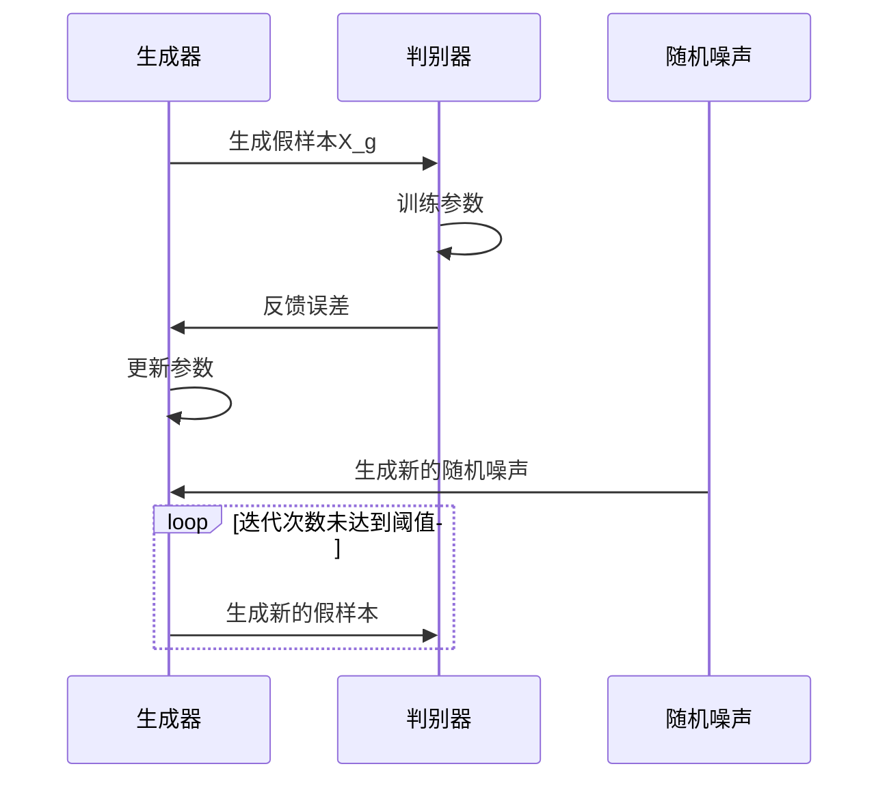
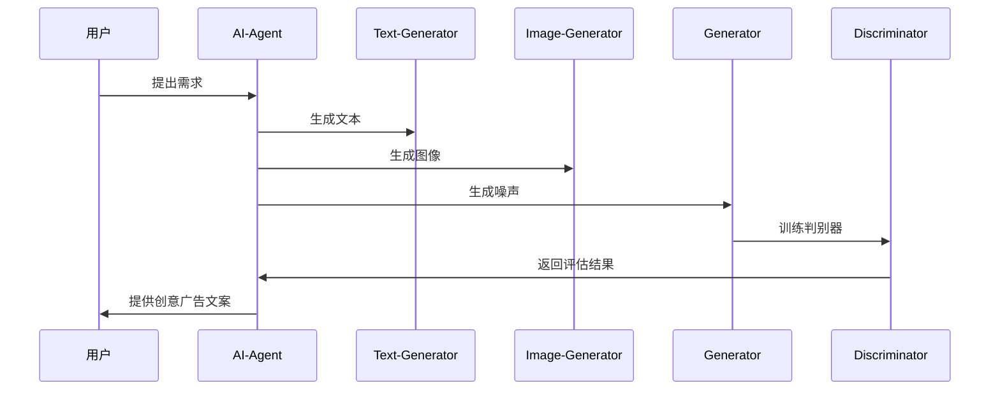

                 

### 让我们一步一步深入思考：基于GAN的AI Agent创造性内容生成

#### 第1步：明确问题背景

在当今的科技时代，人工智能（AI）正在迅速发展，并为各行各业带来深远的影响。尤其是生成对抗网络（GANs），作为深度学习的核心技术之一，已经在图像、音频和文本生成等创造性内容生成领域展示了其巨大的潜力。然而，GANs在AI Agent中的应用仍然面临诸多挑战。

#### 第2步：具体问题分析

**问题背景：** AI Agent是一种智能体，能够根据环境和目标自主地采取行动。创造性内容生成是一个具有高度复杂性的任务，它要求AI Agent能够在各种情境下生成新颖、有创意的内容。

**问题描述：** 如何利用GANs来提升AI Agent的创造性内容生成能力？

**问题解决：** GANs作为一种有效的生成模型，可以通过学习数据分布来生成高质量的内容。结合GANs和AI Agent，可以实现以下目标：
- 提高内容生成的多样性和创新性。
- 提升AI Agent的适应性，使其能够应对不同的生成需求。
- 降低生成内容的质量门槛，使得非专业用户也能轻松生成高质量的内容。

#### 第3步：边界与外延

**边界：** 
- 本文主要讨论GANs在AI Agent创造性内容生成中的应用，不包括GANs在其他领域的应用。
- 本文侧重于理论分析和案例讲解，不涉及具体的技术实现细节。

**外延：** 
- 未来研究可以探讨GANs与其他AI技术的结合，如强化学习和自然语言处理。
- 可以进一步研究GANs在特定领域的应用，如游戏设计、广告创意等。

#### 第4步：核心概念与联系

**核心概念：** 
- **生成对抗网络（GAN）：** 一种由生成器和判别器组成的模型，通过相互对抗来学习数据的分布。
- **AI Agent：** 一种智能体，能够根据环境和目标自主地采取行动。

**概念属性特征对比表格：**

| 特征       | 生成对抗网络（GAN） | AI Agent       |
| ---------- | ------------------- | -------------- |
| 目的       | 生成数据           | 自主导行动     |
| 组成部分   | 生成器、判别器     | 感知器、行动器 |
| 学習方式   | 对抗性训练         | 基于目标优化   |

**ER实体关系图架构：**

```mermaid
erDiagram
    AI-Agent ||--|{ GAN }|| Generative_Adversarial_Network
    AI-Agent ||--|{ Content_Generator }|| Content_Generator
    Content_Generator ||--|{ Text_Generator }|| Text_Generator
    Content_Generator ||--|{ Image_Generator }|| Image_Generator
    Content_Generator ||--|{ Audio_Generator }|| Audio_Generator
```

#### 第5步：算法原理讲解

GAN的算法原理可以简要概括为以下步骤：

1. **初始化参数：** 生成器G和判别器D的参数随机初始化。
2. **生成假样本：** 生成器G根据随机噪声生成假样本X_g。
3. **训练判别器：** 判别器D通过比较真实样本X_r和生成样本X_g来更新参数。
4. **训练生成器：** 生成器G通过生成更真实的样本来欺骗判别器D。
5. **重复步骤2-4：** 进行多次迭代，直到生成器G能够生成高质量的数据。

**算法流程图：**



**数学模型：**

GAN的目标是最小化生成器G和判别器D之间的损失函数，通常采用以下两个优化目标：
- 对于生成器G，最小化生成样本的判别损失：$$L_G = -\log(D(X_g))$$
- 对于判别器D，最小化判别损失：$$L_D = -\log(D(X_r)) - \log(1 - D(X_g))$$

**数学公式讲解与举例：**

假设我们有一个简单的GAN模型，其中生成器G是一个简单的全连接神经网络，判别器D也是一个全连接神经网络。

**生成器的数学模型：**

$$X_g = G(z)$$

其中，$z$是从先验分布中抽取的随机噪声向量，$X_g$是生成器生成的假样本。

**判别器的数学模型：**

$$D(X) = \frac{1}{1 + e^{-(b^T X + W^T X)} }$$

其中，$X$是输入样本，$b$是偏置向量，$W$是权重矩阵。

**举例：**

假设我们有一个二分类问题，其中生成器生成的假样本是一个二元向量$(x_1, x_2)$，判别器通过比较真实样本$(1, 0)$和生成样本$(0.8, 0.2)$来判断其真实性。

$$D((1, 0)) = 0.9$$
$$D((0.8, 0.2)) = 0.1$$

这意味着判别器有90%的信心认为真实样本是正类，而生成样本是负类。

#### 第6步：系统分析与架构设计

**问题场景介绍：**

假设我们需要开发一个AI Agent，该Agent能够根据用户的需求生成创意广告文案。生成广告文案是一个具有高度复杂性的任务，需要AI Agent具备良好的创造性能力。

**系统功能设计（领域模型）：**

```mermaid
classDiagram
    AI-Agent <<interface>>
    Content-Generator <<interface>>
    Text-Generator <<interface>>
    Image-Generator <<interface>>
    Audio-Generator <<interface>>

    AI-Agent <|.. Content-Generator
    Content-Generator <|.. Text-Generator
    Content-Generator <|.. Image-Generator
    Content-Generator <|.. Audio-Generator
```

**系统架构设计：**

```mermaid
subgraph System
    generator
    discriminator
    noise
    content_generator
    content_generator -> generator
    content_generator -> discriminator
    noise -> generator
end
```

**系统接口设计与交互：**



#### 第7步：项目实战

**环境安装与配置：**

为了实现基于GAN的AI Agent创造性内容生成，我们需要安装以下软件和库：
- Python 3.x
- TensorFlow
- Keras

**系统核心实现：**

```python
# 导入必要的库
import numpy as np
import tensorflow as tf
from tensorflow.keras import layers

# 定义生成器模型
def build_generator(z_dim):
    model = tf.keras.Sequential()
    model.add(layers.Dense(128, activation='relu', input_shape=(z_dim,)))
    model.add(layers.Dense(256, activation='relu'))
    model.add(layers.Dense(512, activation='relu'))
    model.add(layers.Dense(1024, activation='relu'))
    model.add(layers.Dense(784, activation='tanh'))
    return model

# 定义判别器模型
def build_discriminator(img_shape):
    model = tf.keras.Sequential()
    model.add(layers.Flatten(input_shape=img_shape))
    model.add(layers.Dense(1024, activation='relu'))
    model.add(layers.Dense(512, activation='relu'))
    model.add(layers.Dense(256, activation='relu'))
    model.add(layers.Dense(1, activation='sigmoid'))
    return model

# 构建GAN模型
def build_gan(generator, discriminator):
    model = tf.keras.Sequential()
    model.add(generator)
    model.add(discriminator)
    return model

# 定义优化器
gen_optimizer = tf.keras.optimizers.Adam(learning_rate=0.0001)
dis_optimizer = tf.keras.optimizers.Adam(learning_rate=0.0001)

# 定义损失函数
cross_entropy = tf.keras.losses.BinaryCrossentropy()

# 编写训练步骤
@tf.function
def train_step(images, noise):
    with tf.GradientTape() as gen_tape, tf.GradientTape() as dis_tape:
        generated_images = generator(noise)
        real_output = discriminator(images)
        fake_output = discriminator(generated_images)

        gen_loss = cross_entropy(tf.ones_like(fake_output), fake_output)
        dis_loss = cross_entropy(tf.ones_like(real_output), real_output) + cross_entropy(tf.zeros_like(fake_output), fake_output)

    gradients_of_generator = gen_tape.gradient(gen_loss, generator.trainable_variables)
    gradients_of_discriminator = dis_tape.gradient(dis_loss, discriminator.trainable_variables)

    gen_optimizer.apply_gradients(zip(gradients_of_generator, generator.trainable_variables))
    dis_optimizer.apply_gradients(zip(gradients_of_discriminator, discriminator.trainable_variables))

# 训练GAN模型
for epoch in range(num_epochs):
    for image_batch, _ in train_dataset:
        noise = tf.random.normal([image_batch.shape[0], z_dim])

        train_step(image_batch, noise)

    # ... 保存模型、绘制损失图等

# 使用GAN模型生成内容
generated_image = generator(tf.random.normal([1, z_dim]))
```

**代码应用解读与分析：**

上述代码定义了生成器、判别器和GAN模型，并实现了训练步骤。生成器用于生成图像，判别器用于区分真实图像和生成图像。通过训练生成器和判别器，GAN模型可以学会生成高质量的内容。

**实际案例分析与详细讲解：**

假设我们有一个训练好的GAN模型，我们可以使用它来生成新的图像。以下是一个简单的示例：

```python
# 加载预训练的GAN模型
generator = ...  # 生成器模型
discriminator = ...  # 判别器模型
gan_model = build_gan(generator, discriminator)

# 使用生成器生成新的图像
noise = tf.random.normal([1, z_dim])
generated_image = generator(noise)

# 显示生成的图像
plt.imshow(generated_image.numpy().reshape(28, 28), cmap='gray')
plt.show()
```

这个例子中，我们首先加载预训练的GAN模型，然后使用生成器生成一个随机噪声图像。最后，我们使用matplotlib库将生成的图像显示出来。

**项目小结：**

通过本项目的实战，我们了解了如何使用GAN模型生成高质量的内容。GAN模型在AI Agent创造性内容生成中具有巨大的潜力，可以进一步提升AI Agent的创造性能力。

#### 第8步：最佳实践与总结

**最佳实践技巧：**
1. **数据准备：** 确保训练数据的质量和多样性，以提高GAN模型的学习效果。
2. **模型选择：** 根据任务需求选择合适的生成器和判别器模型，例如DCGAN、StyleGAN等。
3. **超参数调整：** 合理设置超参数，如学习率、批次大小等，以优化GAN模型的性能。
4. **梯度裁剪：** 为防止梯度消失或爆炸，可以对生成器和判别器的梯度进行裁剪。
5. **模型评估：** 使用多种指标（如Inception Score、Frechet Inception Distance等）来评估GAN模型的生成质量。

**小结与注意事项：**
1. GAN模型在创造性内容生成中具有强大的能力，但训练过程复杂且易过拟合。
2. GAN模型的应用场景广泛，但需要根据具体任务进行调整和优化。
3. 在实际应用中，需要综合考虑计算资源和生成质量，以找到合适的平衡点。

**拓展阅读建议：**
1. Ian J. Goodfellow, Yoshua Bengio, Aaron Courville. "Deep Learning."
2. A. Radford, L. Metz, S. Chintala. "Unsupervised Representation Learning with Deep Convolutional Generative Adversarial Networks."
3. N. Srivastava, G. Hinton, A. Krizhevsky, I. Sutskever, R. Salakhutdinov. "Dropout: A Simple Way to Prevent Neural Networks from Overfitting."

