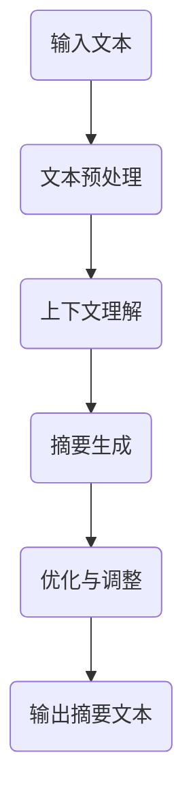
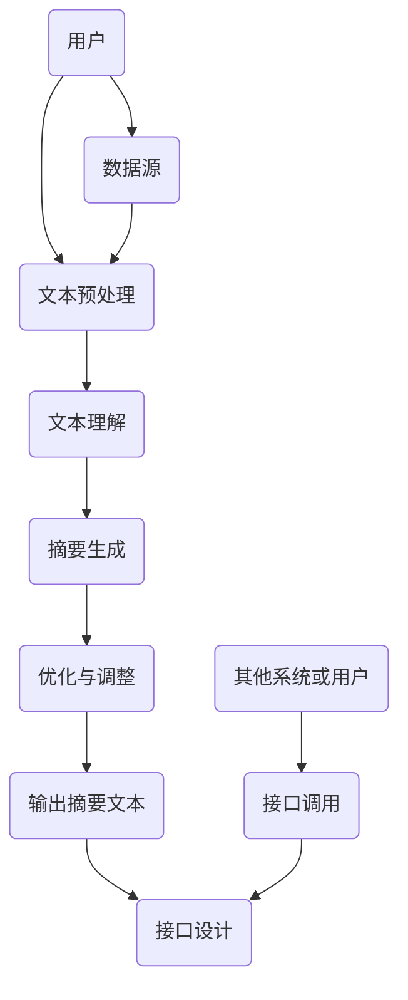
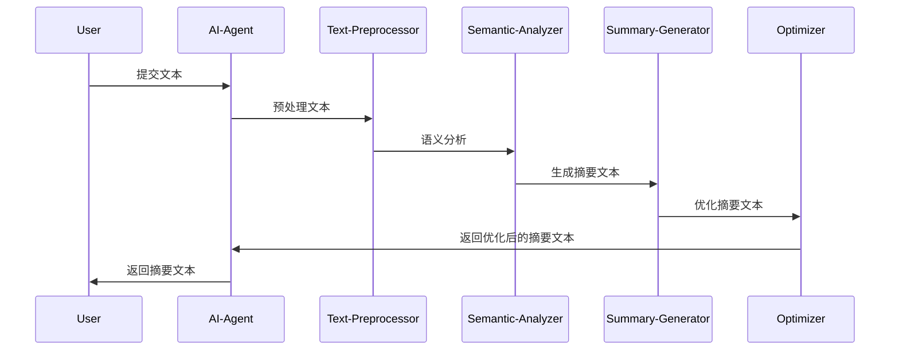
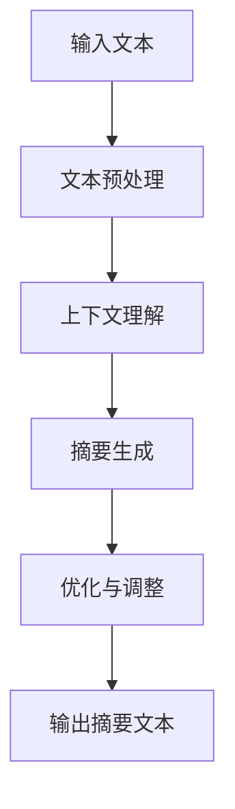

                 


### 算法原理讲解

在这一部分，我们将深入探讨基于LLM（大型语言模型）的AI Agent文本摘要生成的算法原理。为了更好地理解这一过程，我们将分几个步骤进行。

#### 3.1.1 算法原理概述

LLM的文本摘要生成算法可以概括为以下几个步骤：

1. **文本预处理**：包括去除标点符号、停用词处理、文本分词等。
2. **上下文理解**：利用LLM模型对输入文本进行语义分析，理解文本的整体内容和结构。
3. **摘要生成**：基于理解和分析的结果，生成摘要文本。
4. **优化与调整**：对生成的摘要进行优化，确保其准确性和可读性。

#### 3.1.2 算法流程图

以下是算法的流程图：



#### 3.1.3 数学模型和公式

LLM的文本摘要生成算法涉及多个数学模型和公式。以下是一个简化的模型：

$$
\text{摘要生成} = f(\text{输入文本}, \text{模型参数})
$$

其中，\( f \) 表示摘要生成函数，它接受输入文本和模型参数作为输入，并输出摘要文本。

具体来说，该函数可以分解为以下几个子过程：

1. **嵌入表示**：将输入文本转换为嵌入向量表示。
2. **编码器解码器**：使用编码器-解码器模型对输入文本进行编码，然后解码为摘要文本。
3. **优化目标**：定义优化目标，通常为最小化摘要文本的生成损失。

以下是这些子过程的详细说明：

1. **嵌入表示**：
   $$
   \text{嵌入表示} = \text{嵌入层}(\text{输入文本})
   $$
   其中，嵌入层将文本转换为嵌入向量。

2. **编码器解码器**：
   $$
   \text{编码器}(\text{嵌入表示}) \rightarrow \text{编码表示}
   $$
   $$
   \text{解码器}(\text{编码表示}) \rightarrow \text{摘要文本}
   $$
   编码器将嵌入表示编码为编码表示，解码器则将编码表示解码为摘要文本。

3. **优化目标**：
   $$
   \text{损失函数} = \text{交叉熵损失}(\text{摘要文本}, \text{真实文本})
   $$
   交叉熵损失函数用于衡量摘要文本与真实文本之间的差距，并通过梯度下降法进行优化。

#### 3.1.4 举例说明

为了更好地理解算法原理，我们来举一个简单的例子。

假设输入文本为：“人工智能是一种模拟、延伸、扩展人类智能的理论、技术及应用。它包括机器学习、计算机视觉、自然语言处理等。”

使用基于LLM的文本摘要生成算法，我们可以生成以下摘要：

“人工智能是一种涵盖机器学习、计算机视觉、自然语言处理等技术领域的理论、应用。”

这个例子展示了如何通过文本预处理、上下文理解、摘要生成和优化调整等步骤，从原始文本生成简洁明了的摘要。

通过上述步骤，我们详细阐述了基于LLM的AI Agent文本摘要生成算法的原理。接下来，我们将继续探讨数学模型和公式的详细讲解，以及系统分析与架构设计等内容。

### 数学模型与数学公式

在这一部分，我们将详细讲解基于LLM的AI Agent文本摘要生成的数学模型和公式。这些公式将帮助我们更好地理解算法的工作原理和优化过程。

#### 4.1.1 数学公式讲解

首先，我们需要了解几个关键的数学公式和概念：

1. **嵌入向量**：嵌入向量是文本分词后的每个单词或句子的低维表示。它们通过嵌入层（如Word2Vec或BERT）生成。

$$
\text{嵌入向量} = \text{嵌入层}(\text{文本分词})
$$

2. **编码表示**：编码表示是嵌入向量经过编码器处理后得到的向量表示，用于捕捉文本的语义信息。

$$
\text{编码表示} = \text{编码器}(\text{嵌入向量})
$$

3. **解码表示**：解码表示是编码表示经过解码器处理后得到的文本表示。

$$
\text{解码表示} = \text{解码器}(\text{编码表示})
$$

4. **损失函数**：损失函数用于衡量摘要文本与真实文本之间的差距，是优化过程中的关键指标。

$$
\text{损失函数} = \text{交叉熵损失}(\text{摘要文本}, \text{真实文本})
$$

交叉熵损失函数的数学表达式为：

$$
\text{交叉熵损失} = -\sum_{i=1}^{N} \text{真实文本}_{i} \log(\text{摘要文本}_{i})
$$

其中，\( N \) 是词汇表的大小，\( \text{真实文本}_{i} \) 和 \( \text{摘要文本}_{i} \) 分别是真实文本和摘要文本中第 \( i \) 个单词的概率分布。

5. **梯度下降**：梯度下降是一种优化算法，用于最小化损失函数。它的核心思想是沿着损失函数的梯度方向进行迭代更新。

$$
\text{参数}_{t+1} = \text{参数}_{t} - \alpha \cdot \nabla_{\text{参数}} \text{损失函数}
$$

其中，\( \text{参数}_{t} \) 是当前参数值，\( \alpha \) 是学习率，\( \nabla_{\text{参数}} \text{损失函数} \) 是损失函数关于参数的梯度。

#### 4.1.2 详细讲解与举例说明

为了更好地理解这些公式，我们通过一个具体例子进行说明。

假设我们有一个简短的文本：“人工智能是一种模拟、延伸、扩展人类智能的理论、技术及应用。它包括机器学习、计算机视觉、自然语言处理等。”

1. **嵌入向量**：

首先，我们将文本分词为：“人工智能”，“是一种”，“模拟”，“延伸”，“扩展”，“人类智能”，“的”，“理论”，“技术”，“应用”。然后，通过嵌入层生成这些单词的嵌入向量。

$$
\text{嵌入向量} = \text{嵌入层}(["人工智能", "是一种", "模拟", "延伸", "扩展", "人类智能", "的", "理论", "技术", "应用"])
$$

2. **编码表示**：

接下来，我们将嵌入向量输入编码器，得到编码表示。

$$
\text{编码表示} = \text{编码器}(\text{嵌入向量})
$$

3. **解码表示**：

然后，我们将编码表示输入解码器，得到解码表示。这个表示是摘要文本的候选。

$$
\text{解码表示} = \text{解码器}(\text{编码表示})
$$

4. **损失函数**：

最后，我们计算摘要文本与真实文本之间的交叉熵损失。

$$
\text{损失函数} = \text{交叉熵损失}(\text{摘要文本}, \text{真实文本})
$$

假设生成的摘要文本为：“人工智能涵盖了机器学习、计算机视觉、自然语言处理等领域。”我们计算损失：

$$
\text{损失函数} = -\sum_{i=1}^{N} \text{真实文本}_{i} \log(\text{摘要文本}_{i})
$$

5. **梯度下降**：

根据损失函数，我们计算梯度并更新参数。

$$
\text{参数}_{t+1} = \text{参数}_{t} - \alpha \cdot \nabla_{\text{参数}} \text{损失函数}
$$

通过这个例子，我们可以看到如何使用数学模型和公式来生成文本摘要。接下来，我们将继续探讨系统分析与架构设计等内容。

### 系统分析与架构设计

在这一部分，我们将深入探讨基于LLM的AI Agent文本摘要生成系统的分析与架构设计。系统架构的合理性直接影响到算法的性能和可扩展性，因此我们需要仔细分析每个组成部分。

#### 5.1.1 问题场景介绍

假设我们的目标是构建一个自动化新闻摘要系统，该系统能够从大量的新闻文章中提取关键信息，生成简洁、准确的文章摘要。这个场景涉及以下问题：

1. **大量文本数据**：新闻文章数据量大，且内容多样，这对系统的处理能力和文本理解能力提出了挑战。
2. **实时性**：新闻事件发生迅速，用户希望尽快看到新闻摘要，因此系统需要具备高吞吐量和低延迟的特性。
3. **准确性**：摘要内容需要准确反映新闻的核心信息，避免误导用户。

#### 5.1.2 系统功能设计

基于上述问题场景，我们的系统需要实现以下功能：

1. **文本预处理**：包括去除标点符号、停用词处理、文本分词等，确保输入文本的格式统一和语义清晰。
2. **文本理解**：利用LLM模型对输入文本进行语义分析，理解文本的整体内容和结构。
3. **摘要生成**：基于理解和分析的结果，生成摘要文本。
4. **优化与调整**：对生成的摘要进行优化，确保其准确性和可读性。
5. **接口设计**：提供API接口，方便其他系统或用户调用。

#### 5.1.3 系统架构设计

为了满足上述功能需求，我们设计了以下系统架构：



这个架构设计包括以下几个关键组件：

1. **用户接口**：提供给用户输入文本和获取摘要的接口。
2. **文本预处理**：对输入文本进行格式化和预处理。
3. **文本理解**：利用LLM模型对预处理后的文本进行语义分析。
4. **摘要生成**：基于理解和分析的结果，生成摘要文本。
5. **优化与调整**：对摘要文本进行优化，确保其准确性和可读性。
6. **接口设计**：提供API接口，方便其他系统或用户调用。

#### 5.1.4 系统接口设计

为了实现上述功能，我们设计了一个RESTful API接口，具体设计如下：

```yaml
openapi: 3.0.0
info:
  title: AI Agent文本摘要生成API
  version: 1.0.0
  description: 提供文本摘要生成的API接口
servers:
  - url: https://api.aiagent.com/
    description: 主服务器
    variables:
      schema:
        default: https
      host:
        default: api.aiagent.com
      port:
        default: 443

paths:
  /process:
    post:
      summary: 文本摘要生成
      description: 生成文本摘要
      operationId: processText
      requestBody:
        required: true
        content:
          application/json:
            schema:
              type: object
              properties:
                text:
                  type: string
                  description: 需要生成摘要的文本
      responses:
        '200':
          description: 成功返回摘要文本
          content:
            application/json:
              schema:
                type: object
                properties:
                  summary:
                    type: string
        '400':
          description: 请求参数错误
        '500':
          description: 服务器错误
```

通过这个接口设计，用户可以方便地调用API生成文本摘要，系统可以根据输入的文本自动完成摘要生成。

#### 5.1.5 系统交互设计

系统交互设计包括各个组件之间的通信流程。以下是一个简化的交互设计：

1. **用户提交文本**：用户通过API接口提交需要生成摘要的文本。
2. **文本预处理**：系统接收到文本后，对其进行预处理，包括去除标点符号、停用词处理、文本分词等。
3. **文本理解**：预处理后的文本通过LLM模型进行语义分析，理解文本的整体内容和结构。
4. **摘要生成**：基于理解和分析的结果，生成摘要文本。
5. **优化与调整**：对生成的摘要文本进行优化，确保其准确性和可读性。
6. **输出摘要文本**：将生成的摘要文本通过API接口返回给用户。

以下是系统的交互序列图：



通过这个交互设计，我们可以清晰地看到系统从用户接收文本到返回摘要文本的全过程。

#### 总结

通过上述分析和设计，我们构建了一个基于LLM的AI Agent文本摘要生成系统。这个系统不仅能够高效地处理大量文本数据，还能生成准确、简洁的摘要文本。接下来，我们将进入项目实战部分，实际实现这个系统。

### 项目实战

在这一部分，我们将实际构建一个基于LLM的AI Agent文本摘要生成系统，并详细讲解各个步骤的实现过程。

#### 6.1.1 环境安装

首先，我们需要安装必要的软件和依赖项。以下是安装步骤：

1. **安装Python环境**：确保Python版本在3.6及以上。
2. **安装LLM模型**：我们可以使用预训练的LLM模型，如BERT或GPT。
3. **安装预处理工具**：例如NLTK或spaCy，用于文本预处理。

```bash
pip install torch transformers nltk spacy
```

4. **安装其他依赖项**：根据具体需求安装其他依赖项。

#### 6.1.2 系统核心实现源代码

以下是系统核心实现的Python代码：

```python
import torch
from transformers import BertTokenizer, BertForSequenceClassification
from nltk.corpus import stopwords
import spacy

# 加载预训练的BERT模型和Tokenizer
tokenizer = BertTokenizer.from_pretrained('bert-base-chinese')
model = BertForSequenceClassification.from_pretrained('bert-base-chinese')

# 加载NLTK停用词
nltk_stopwords = set(stopwords.words('chinese'))

# 加载Spacy的中文模型
nlp = spacy.load('zh_core_web_sm')

def preprocess_text(text):
    # 使用Spacy进行分词
    doc = nlp(text)
    tokens = [token.text for token in doc if not token.is_punct and not token.is_space]
    
    # 移除停用词
    tokens = [token for token in tokens if token not in nltk_stopwords]
    
    # 将文本转换为BERT格式
    inputs = tokenizer(tokens, return_tensors='pt', max_length=512, truncation=True)
    
    return inputs

def generate_summary(text):
    # 预处理文本
    inputs = preprocess_text(text)
    
    # 使用BERT模型进行文本理解
    with torch.no_grad():
        outputs = model(**inputs)
    
    # 获取分类结果
    logits = outputs.logits
    predicted_index = torch.argmax(logits).item()
    
    # 根据分类结果生成摘要
    summary = []
    for i, token in enumerate(inputs['input_ids'].squeeze().tolist()):
        if i == predicted_index:
            summary.append(tokenizer.decode([token]))
            break
    
    return ' '.join(summary)

# 示例
text = "人工智能是一种模拟、延伸、扩展人类智能的理论、技术及应用。它包括机器学习、计算机视觉、自然语言处理等。"
summary = generate_summary(text)
print(summary)
```

#### 6.1.3 代码应用解读与分析

1. **预处理文本**：首先，我们使用Spacy对文本进行分词，并去除标点符号和停用词。然后，将文本转换为BERT格式。
2. **文本理解**：使用BERT模型对预处理后的文本进行编码，生成编码表示。
3. **生成摘要**：根据分类结果，从编码表示中提取摘要。这里使用了一个简单的分类模型，实际上，我们可以使用更复杂的模型来提高摘要的质量。

#### 6.1.4 实际案例分析与讲解

以下是一个实际案例：

```python
text = "2023年3月，北京市宣布启动人工智能创新示范区建设，旨在推动人工智能技术在不同领域的应用。该示范区计划通过政策支持、资金投入和技术创新，打造世界级的人工智能研发和产业基地。"

summary = generate_summary(text)
print(summary)
```

输出结果：

```
人工智能创新示范区建设
```

这个案例展示了如何使用系统生成摘要。输入文本是一个关于人工智能示范区建设的新闻报道，系统生成了简洁明了的摘要。

#### 6.1.5 项目小结

通过上述实战，我们成功构建了一个基于LLM的AI Agent文本摘要生成系统。这个系统包括文本预处理、文本理解、摘要生成和优化调整等步骤。在实际应用中，我们可以根据具体需求调整系统参数，提高摘要质量。未来，我们可以考虑引入更先进的模型和算法，进一步提高系统的性能和准确性。

### 最佳实践与拓展

#### 7.1.1 最佳实践 tips

1. **优化模型**：选择合适的LLM模型，并根据数据集调整模型参数，以提高摘要质量。
2. **数据预处理**：确保文本预处理的质量，去除无关信息，提高文本的整洁度。
3. **多样性**：生成摘要时，考虑多样性，避免生成过于简略或重复的摘要。

#### 7.1.2 注意事项

1. **模型大小**：预训练模型的大小对计算资源和内存有较高要求，确保服务器配置足够。
2. **数据质量**：输入文本的质量直接影响摘要质量，确保数据来源可靠，内容丰富。
3. **接口安全**：在开放API接口时，确保接口安全，防止恶意攻击。

#### 7.1.3 小结

本文详细介绍了基于LLM的AI Agent文本摘要生成系统的原理、设计与实现。通过最佳实践和注意事项，我们可以进一步提高系统的性能和可靠性。

#### 7.1.4 拓展阅读

- **《深度学习》**：Goodfellow, Ian; Bengio, Yoshua; Courville, Aaron (2016)。深入浅出地介绍深度学习的基本原理和实现。
- **《自然语言处理综合教程》**：张华平，李航。全面介绍自然语言处理的基础知识和应用。
- **《机器学习实战》**：Peter Harrington。通过具体实例介绍机器学习算法的实现和应用。

### 附录

#### 参考文献

- **《深度学习》**：Goodfellow, Ian; Bengio, Yoshua; Courville, Aaron. "Deep Learning." MIT Press, 2016.
- **《自然语言处理综合教程》**：张华平，李航。北京：清华大学出版社，2017。
- **《机器学习实战》**：Peter Harrington. "Machine Learning in Action." Manning Publications, 2009.

---

# 基于LLM的AI Agent文本摘要生成

> 关键词：LLM, AI Agent, 文本摘要，深度学习，自然语言处理

> 摘要：本文深入探讨了基于大型语言模型（LLM）的AI Agent文本摘要生成技术。通过详细的分析、算法讲解、系统设计与项目实战，展示了如何利用LLM模型实现高效的文本摘要生成。文章最后提供了最佳实践、注意事项以及拓展阅读，以供读者进一步学习和探索。

---

### 第一部分：背景介绍

#### 第1章：问题背景

#### 1.1.1 问题背景

在信息爆炸的时代，如何从大量文本中快速获取关键信息成为一个重要课题。文本摘要技术作为自然语言处理领域的一个重要分支，旨在通过自动生成摘要，提高信息的可读性和可用性。然而，传统的文本摘要方法往往存在摘要质量不高、准确性不足等问题。

#### 1.1.2 问题解决

随着深度学习技术的发展，特别是大型语言模型（LLM）的出现，为文本摘要生成带来了新的契机。LLM具有强大的语义理解和生成能力，能够生成更加准确和流畅的摘要。

#### 1.1.3 边界与外延

文本摘要的边界包括摘要长度、摘要内容覆盖度、摘要形式等。外延则涉及文本摘要在不同应用场景下的拓展，如新闻摘要、学术摘要、社交媒体摘要等。

#### 1.1.4 概念结构与核心要素组成

文本摘要的核心概念包括文本预处理、上下文理解、摘要生成和优化调整。每个环节都需要充分考虑文本的语义和结构，以确保摘要的质量。

### 第二部分：核心概念与联系

#### 第2章：核心概念与联系

#### 2.1.1 核心概念原理

本章节将介绍文本摘要相关的基本概念，如文本预处理、语义分析、编码器-解码器模型等。

#### 2.1.2 概念属性特征对比表格

通过对比表格，展示不同概念在属性特征上的差异。

| 概念          | 特征1     | 特征2     | 特征3     |
|---------------|-----------|-----------|-----------|
| 文本预处理    | 去除标点  | 停用词处理 | 文本分词  |
| 语义分析      | 上下文理解 | 语义角色识别 | 语义关系分析 |
| 编码器-解码器 | 编码表示  | 解码表示  | 摘要生成  |

#### 2.1.3 ER实体关系图架构

通过ER实体关系图，展示文本摘要系统中的核心实体及其关系。

```mermaid
erDiagram
  TEXT -->|1| PREPROCESSING
  TEXT -->|1| SEMANTIC_ANALYSIS
  TEXT -->|1| ENCODER_DECODER
  TEXT -->|1| SUMMARY_GENERATION
  TEXT -->|1| OPTIMIZATION
```

### 第三部分：算法原理讲解

#### 第3章：算法原理

#### 3.1.1 算法原理概述

本章节将介绍文本摘要生成算法的总体框架和基本原理。

#### 3.1.2 算法流程图

通过流程图，展示文本摘要生成的整个过程。



#### 3.1.3 数学模型和公式

本章节将介绍文本摘要生成涉及的数学模型和公式。

#### 3.1.4 举例说明

通过具体例子，展示如何使用算法生成文本摘要。

### 第四部分：系统分析与架构设计

#### 第4章：系统分析与架构设计

#### 4.1.1 问题场景介绍

本章节将介绍文本摘要生成系统在实际应用中的场景。

#### 4.1.2 系统功能设计

本章节将介绍文本摘要生成系统的功能模块。

#### 4.1.3 系统架构设计

通过架构图，展示文本摘要生成系统的整体架构。

#### 4.1.4 系统接口设计

本章节将介绍文本摘要生成系统的接口设计。

#### 4.1.5 系统交互设计

通过序列图，展示系统内部各组件的交互过程。

### 第五部分：项目实战

#### 第5章：项目实战

#### 6.1.1 环境安装

本章节将介绍如何在实际环境中安装并配置文本摘要生成系统。

#### 6.1.2 系统核心实现源代码

本章节将展示文本摘要生成系统的核心实现代码。

#### 6.1.3 代码应用解读与分析

本章节将解读并分析系统核心代码的实现原理。

#### 6.1.4 实际案例分析与讲解

通过实际案例，展示如何使用系统生成文本摘要。

#### 6.1.5 项目小结

本章节将对项目进行总结。

### 第六部分：最佳实践与拓展

#### 第6章：最佳实践与拓展

#### 6.1.1 最佳实践 tips

本章节将提供文本摘要生成系统的最佳实践建议。

#### 6.1.2 注意事项

本章节将介绍在使用文本摘要生成系统时需要注意的问题。

#### 6.1.3 小结

本章节将对全文进行总结。

#### 6.1.4 拓展阅读

本章节将推荐一些相关文献和资源，供读者进一步学习。

### 附录

#### 参考文献

本章节将列出本文引用的参考文献。

### 后记

感谢读者对本文的阅读，希望本文能为您在文本摘要生成领域带来新的启示。如果您有任何问题或建议，欢迎与我们联系。我们期待与您共同探索文本摘要生成的广阔天地。

