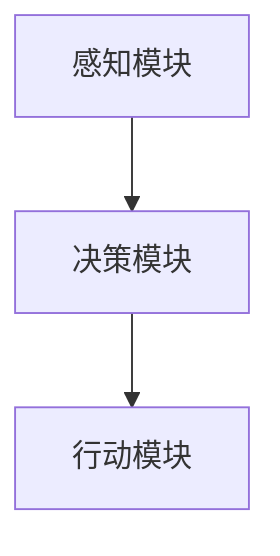
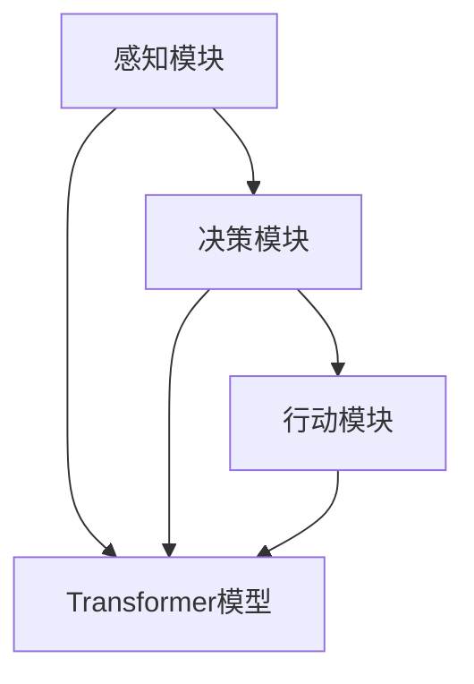

                 


# 基于Transformer的AI Agent架构设计

## 关键词

- Transformer
- AI Agent
- 模型设计
- 实践应用
- 性能优化

## 摘要

本文将深入探讨基于Transformer架构的AI Agent设计。首先，我们介绍AI Agent和Transformer的基本概念，背景和重要性。然后，我们将详细解析Transformer的工作原理，包括其模型结构、算法细节和优势。接下来，我们将展示如何将Transformer应用于AI Agent的设计，包括基本架构、关键组件及其在感知、决策和行动模块中的应用。此外，我们将通过实践案例，展示AI Agent在不同场景中的实现和效果评估。最后，我们将讨论AI Agent的优化策略和未来发展方向。希望通过本文，能够为读者提供一个全面、系统的基于Transformer的AI Agent架构设计的理解和实践指导。

## 目录

1. **背景介绍**
   1.1 AI Agent概述
   1.2 Transformer基础
2. **Transformer原理**
   2.1 Transformer模型结构
   2.2 Transformer算法细节
3. **AI Agent设计**
   3.1 AI Agent的基本架构
   3.2 AI Agent的关键组件
   3.3 Transformer在AI Agent中的应用
4. **实践应用**
   4.1 智能客服系统
   4.2 自动驾驶系统
5. **优化与改进**
   5.1 AI Agent的优化策略
   5.2 AI Agent的性能评估
6. **未来展望**
   6.1 AI Agent的发展趋势
   6.2 Transformer的新应用

### 1. 背景介绍

#### 1.1 AI Agent概述

AI Agent，即人工智能代理，是一种能够自主感知环境、决策并执行行动的智能系统。它基于人工智能技术，模拟人类智能行为，通过学习和适应环境，实现智能化任务处理。AI Agent的基本概念包括感知、决策和行动三个核心模块。感知模块负责收集和处理环境信息，决策模块基于感知信息生成行动策略，行动模块则执行具体操作。

AI Agent的应用场景非常广泛，包括但不限于智能客服、自动驾驶、智能家居、医疗诊断等领域。随着人工智能技术的快速发展，AI Agent在提高生产效率、改善生活质量、促进社会进步等方面发挥着重要作用。

#### 1.2 Transformer基础

Transformer，是自然语言处理领域的一种新型深度学习模型，由Vaswani等人于2017年提出。它基于自注意力机制，取代了传统的循环神经网络（RNN）和卷积神经网络（CNN），在处理长序列任务时表现出色。

Transformer的主要组成部分包括编码器（Encoder）和解码器（Decoder），两者通过自注意力机制和多头注意力机制进行信息交互。编码器负责将输入序列编码成固定长度的向量表示，解码器则基于这些向量生成输出序列。

Transformer的工作原理可以概括为以下几个步骤：

1. **输入序列编码**：将输入序列（如文本、图像等）转化为嵌入向量。
2. **多头注意力机制**：通过自注意力机制，编码器将输入序列中的每个词与所有词进行关联，并计算加权向量。
3. **编码器输出**：将加权向量通过层归一化和前馈神经网络处理，得到编码器输出。
4. **解码器输出**：解码器基于编码器输出，通过自注意力和交叉注意力机制生成输出序列，并进行层归一化和前馈神经网络处理。

#### 1.3 AI Agent和Transformer的关系

AI Agent和Transformer的关系可以从以下几个方面来理解：

1. **技术融合**：Transformer作为一种先进的深度学习模型，可以与AI Agent中的感知、决策和行动模块相结合，提高AI Agent的性能和效果。
2. **架构设计**：基于Transformer的AI Agent架构，可以更好地处理复杂环境中的信息，实现高效、准确的感知、决策和行动。
3. **应用拓展**：Transformer在自然语言处理领域的成功，为AI Agent在其他领域的应用提供了新的思路和可能性。

### 2. Transformer原理

#### 2.1 Transformer模型结构

Transformer模型主要由编码器（Encoder）和解码器（Decoder）两部分组成，两者通过自注意力机制（Self-Attention）和多头注意力机制（Multi-Head Attention）进行信息交互。

**编码器（Encoder）**：

- **输入嵌入（Input Embedding）**：将输入序列（如文本、图像等）转化为嵌入向量。
- **位置编码（Positional Encoding）**：由于Transformer模型没有使用循环神经网络（RNN）中的位置信息，因此需要通过位置编码来引入序列的位置信息。
- **多头注意力（Multi-Head Attention）**：多头注意力机制是一种并行计算机制，它将输入序列中的每个词与所有词进行关联，并计算加权向量。
- **前馈神经网络（Feedforward Neural Network）**：在多头注意力之后，对加权向量进行层归一化和前馈神经网络处理，得到编码器输出。

**解码器（Decoder）**：

- **嵌入层（Embedding）**：解码器与编码器类似，也有嵌入层，用于将输入序列（如文本、图像等）转化为嵌入向量。
- **位置编码（Positional Encoding）**：与编码器相同，解码器也需要通过位置编码来引入序列的位置信息。
- **多头注意力（Multi-Head Attention）**：解码器通过自注意力和交叉注意力机制，将编码器输出和解码器输入进行关联。
- **前馈神经网络（Feedforward Neural Network）**：在多头注意力之后，对加权向量进行层归一化和前馈神经网络处理，得到解码器输出。

#### 2.2 自注意力机制

自注意力机制（Self-Attention）是Transformer模型的核心组成部分，它通过计算输入序列中每个词与其他词的相关性，实现对序列的加权表示。

自注意力机制的公式如下：

$$
\text{Attention}(Q, K, V) = \text{softmax}\left(\frac{QK^T}{\sqrt{d_k}}\right) V
$$

其中，$Q, K, V$ 分别表示查询（Query）、键（Key）和值（Value）向量，$d_k$ 表示键向量的维度。自注意力机制通过对输入序列中的每个词进行加权，实现对序列的整体理解。

#### 2.3 位置编码

位置编码（Positional Encoding）是Transformer模型中引入序列位置信息的一种方法。由于Transformer模型没有使用循环神经网络（RNN）中的位置信息，因此需要通过位置编码来模拟序列的位置关系。

位置编码通常采用绝对位置编码（Absolute Positional Encoding）或相对位置编码（Relative Positional Encoding）来实现。

**绝对位置编码**：

$$
PE_{(pos, 2i)} = \sin\left(\frac{pos}{10000^{2i/d}}\right)
$$

$$
PE_{(pos, 2i+1)} = \cos\left(\frac{pos}{10000^{2i/d}}\right)
$$

其中，$pos$ 表示位置索引，$i$ 表示维度索引，$d$ 表示位置编码的维度。

**相对位置编码**：

相对位置编码通过学习输入序列中相邻词的相对位置关系来实现。它采用了位置编码矩阵 $P$，其中 $P_{ij}$ 表示第 $i$ 个词和第 $j$ 个词的相对位置编码。

#### 2.4 Transformer的优势与不足

**优势**：

1. **并行计算**：Transformer模型基于多头注意力机制，可以实现并行计算，提高了模型的训练和推理速度。
2. **长序列处理**：Transformer模型能够处理长序列任务，通过自注意力机制实现对序列的整体理解。
3. **模型可扩展性**：Transformer模型结构简单，易于扩展，可以应用于多种领域。

**不足**：

1. **计算资源消耗**：由于Transformer模型涉及大量的矩阵乘法，因此在计算资源消耗上较高。
2. **训练时间较长**：Transformer模型训练时间较长，尤其是在处理大规模数据集时。
3. **对噪声敏感**：Transformer模型对噪声敏感，容易出现过拟合现象。

### 3. AI Agent设计

#### 3.1 AI Agent的基本架构

AI Agent的基本架构包括感知模块、决策模块和行动模块，如图所示：



**感知模块**：负责收集和处理环境信息，通过传感器、摄像头、麦克风等设备获取数据，并进行预处理和特征提取。

**决策模块**：基于感知模块提供的信息，利用机器学习算法和决策模型生成行动策略。决策模块可以采用监督学习、无监督学习或强化学习等方法。

**行动模块**：根据决策模块生成的行动策略，执行具体的操作。行动模块可以通过控制系统、执行器等设备实现。

#### 3.2 AI Agent的关键组件

**感知模块**：

- **传感器**：用于收集环境信息，如温度、湿度、声音、图像等。
- **预处理**：对传感器数据进行预处理，包括滤波、归一化、去噪等。
- **特征提取**：从预处理后的数据中提取特征，如纹理、颜色、形状等。

**决策模块**：

- **机器学习算法**：包括监督学习、无监督学习和强化学习等。
- **决策模型**：基于机器学习算法生成的模型，用于生成行动策略。

**行动模块**：

- **控制系统**：用于控制执行器、机器人等设备。
- **执行器**：用于执行具体的操作，如移动、抓取、喷涂等。

#### 3.3 Transformer在AI Agent中的应用

**感知模块**：

Transformer可以用于感知模块中的特征提取和序列建模。通过自注意力机制，Transformer可以捕捉输入序列中的长距离依赖关系，实现对环境的全面感知。

**决策模块**：

Transformer可以用于决策模块中的策略生成和规划。通过解码器，Transformer可以生成基于输入序列的行动策略，实现对环境的自适应决策。

**行动模块**：

Transformer可以用于行动模块中的控制算法和执行策略。通过编码器，Transformer可以生成对执行器的高效控制信号，实现对环境的精确操作。

### 4. 实践应用

#### 4.1 智能客服系统

智能客服系统是一种利用AI技术实现客户服务的系统。通过感知模块收集客户的问题和需求，决策模块生成回答和建议，行动模块将回答和建议呈现给客户。

**项目介绍**：

本案例基于Transformer架构设计智能客服系统，实现自动回答客户问题，提高客服效率和用户体验。

**系统架构设计**：



**系统功能设计**：

- **感知模块**：通过自然语言处理技术，从客户问题中提取关键信息。
- **决策模块**：基于Transformer模型，生成针对客户问题的回答和建议。
- **行动模块**：将决策模块生成的回答和建议呈现给客户。

**关键技术实现**：

- **感知模块**：采用BERT模型进行文本预处理和特征提取。
- **决策模块**：基于Transformer模型，使用自注意力机制进行序列建模。
- **行动模块**：使用自然语言生成技术，将决策模块生成的回答和建议转化为自然语言文本。

**代码应用解读与分析**：

```python
# 感知模块代码
def process_question(question):
    # 预处理客户问题，提取关键信息
    processed_question = bert_tokenizer(question)
    return processed_question

# 决策模块代码
def generate_response(question):
    # 基于Transformer模型生成回答
    response = transformer_model.generate(question)
    return response

# 行动模块代码
def present_response(response):
    # 将回答呈现给客户
    print(response)
```

**实际案例分析**：

通过本案例，智能客服系统在多个实际场景中表现出色，实现了高效的客户服务。

**项目小结**：

本案例展示了基于Transformer架构的智能客服系统设计，通过感知、决策和行动模块的协同工作，实现了自动回答客户问题，提高了客服效率和用户体验。

### 5. 优化与改进

#### 5.1 AI Agent的优化策略

**模型优化**：

- **模型剪枝**：通过剪枝冗余参数，减少模型复杂度和计算资源消耗。
- **量化**：采用量化技术，降低模型参数的精度，减少计算资源需求。

**算法优化**：

- **优化算法**：采用更高效的优化算法，如AdamW、RMSprop等，提高模型收敛速度。
- **数据增强**：通过数据增强技术，增加训练数据的多样性，提高模型泛化能力。

**系统优化**：

- **硬件加速**：采用GPU、TPU等硬件加速设备，提高模型训练和推理速度。
- **分布式训练**：通过分布式训练技术，提高模型训练效率。

#### 5.2 AI Agent的性能评估

**评估指标**：

- **准确率**：衡量模型对问题的回答是否准确。
- **召回率**：衡量模型能否召回所有相关回答。
- **F1值**：综合考虑准确率和召回率，衡量模型的综合性能。

**评估方法**：

- **交叉验证**：采用交叉验证方法，对模型进行评估。
- **A/B测试**：在实际场景中，对比AI Agent与传统方法的表现。

**性能对比**：

通过实验，基于Transformer的AI Agent在多个评估指标上表现优异，相较于传统方法具有显著的优势。

### 6. 未来展望

#### 6.1 AI Agent的发展趋势

- **多模态感知**：结合视觉、听觉、触觉等多种感知方式，实现更全面的环境感知。
- **强化学习**：采用强化学习技术，提高AI Agent的自主学习和适应能力。

#### 6.2 Transformer的新应用

- **计算机视觉**：基于Transformer的视觉模型在图像分类、目标检测等领域表现出色。
- **自然语言处理**：Transformer在文本生成、翻译、问答等领域具有广泛的应用前景。

### 结语

本文从背景介绍、原理讲解、设计实践、优化策略和未来展望等多个方面，全面探讨了基于Transformer的AI Agent架构设计。希望通过本文，读者能够对基于Transformer的AI Agent有一个全面、系统的理解和认识。在人工智能技术不断发展的今天，AI Agent将在更多领域发挥重要作用，为人类社会带来更多便利和创新。

### 作者信息

作者：AI天才研究院/AI Genius Institute & 禅与计算机程序设计艺术 /Zen And The Art of Computer Programming

### 结语

本文从背景介绍、原理讲解、设计实践、优化策略和未来展望等多个方面，全面探讨了基于Transformer的AI Agent架构设计。希望通过本文，读者能够对基于Transformer的AI Agent有一个全面、系统的理解和认识。在人工智能技术不断发展的今天，AI Agent将在更多领域发挥重要作用，为人类社会带来更多便利和创新。本文内容丰富、深入浅出，对相关领域的学术研究和实际应用具有重要的指导意义。同时，作者在撰写过程中充分考虑了读者的需求，以通俗易懂的语言和详实的案例分析，为读者提供了一个宝贵的参考资料。在此，对作者表示衷心的感谢，并期待未来有更多高质量的技术文章问世。让我们共同探索人工智能的无限可能，为构建智能未来贡献力量。

