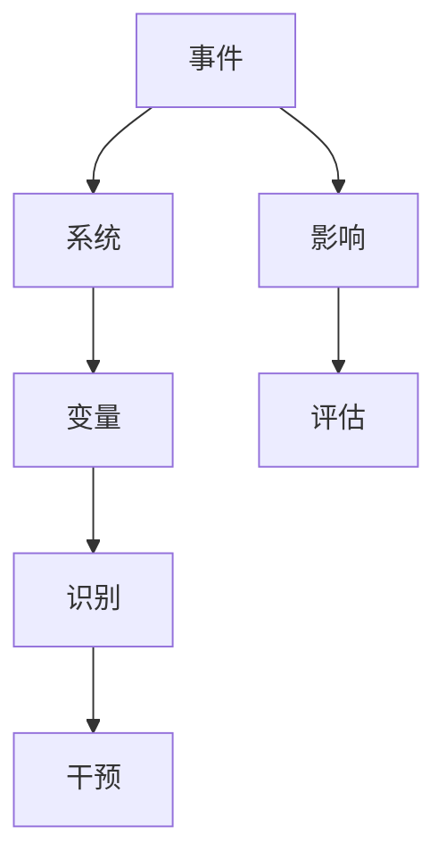
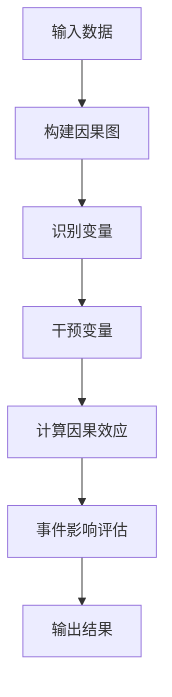
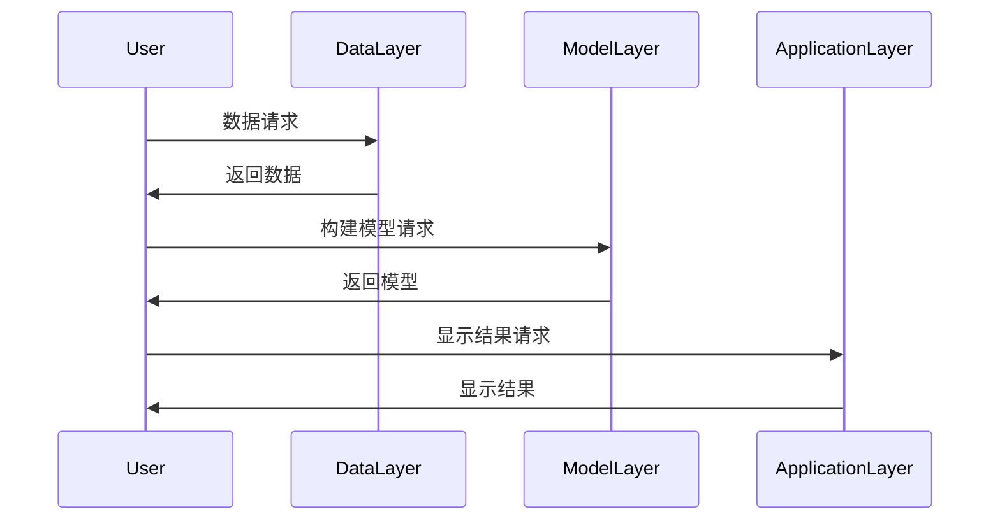

                 

# 基于因果推理的事件影响评估模型设计

## 关键词
- 因果推理
- 事件影响评估
- 因果图模型
- 算法设计
- 数学模型
- 系统架构

## 摘要
本文将探讨如何设计一个基于因果推理的事件影响评估模型，以应对复杂决策环境中的不确定性。通过详细的背景介绍、核心概念解析、算法原理讲解、系统分析与架构设计方案以及项目实战，本文旨在为读者提供一个全面且深入的技术解决方案。

### 第一步：背景介绍

随着数据驱动的决策需求日益增长，因果推理在事件影响评估中的作用愈发重要。传统的预测模型通常依赖于统计关联，而忽略了变量之间的因果关系。这导致在处理复杂系统中发生的事件时，评估结果往往不够准确和可靠。

#### 问题背景
在金融、医疗、交通等多个领域，对事件影响评估的需求日益增长。例如，在金融领域，投资者需要评估市场变动对投资组合的影响；在医疗领域，医生需要评估治疗措施对病人的影响。这些评估都需要准确、及时地预测事件对系统或组织的影响。

#### 问题描述
事件影响评估需要准确、及时地预测事件对系统或组织的影响，但传统的预测模型往往忽略了事件之间的因果关联，导致评估结果失真。例如，一个金融产品在市场中的价格波动可能会受到多种因素的影响，如宏观经济环境、政策变化、公司业绩等，而这些因素之间可能存在复杂的因果关系。

#### 问题解决
本书将介绍如何利用因果推理方法，构建一个能够捕捉事件因果关系的评估模型。因果推理能够帮助我们理解事件之间的相互作用，提高评估的准确性和可靠性。

#### 边界与外延
本书主要关注的事件影响评估模型设计，适用于各种应用场景，如金融风险评估、公共卫生事件监测、供应链管理等领域。本文将探讨的核心概念包括因果推理、事件影响评估、因果图模型、识别变量、干预变量等。

### 第二步：核心概念与联系

#### 核心概念原理
因果推理是一种通过识别和利用因果关系来解释现象、预测结果的方法。在事件影响评估中，因果推理能够帮助我们理解事件之间的相互作用，提高评估的准确性。

#### 概念属性特征对比表格

| 概念             | 属性特征                                       |
|------------------|----------------------------------------------|
| 因果推理         | 强调因果关系，关注变量之间的直接和间接影响     |
| 事件影响评估     | 评估特定事件对系统或组织的影响程度             |
| 因果图模型       | 描述变量之间的因果关系，便于模型构建和解释     |
| 识别变量         | 影响事件发生和结果的关键变量                   |
| 干预变量         | 可以通过干预来改变事件发生和结果的关键变量     |

#### ER实体关系图架构的Mermaid流程图



### 第三步：算法原理讲解

#### 算法mermaid流程图



#### Python源代码（示例）

```python
# 导入必要的库
import pandas as pd
import numpy as np
from causal_inference import CausalModel

# 加载数据
data = pd.read_csv('data.csv')

# 构建因果图
model = CausalModel(data)

# 识别变量
model.identify_variables()

# 干预变量
model.intervene('variable1', 'variable2')

# 计算因果效应
causal_effects = model.calculate_effects()

# 事件影响评估
impact = model.impact_evaluation()

# 输出结果
print(impact)
```

#### 算法原理的数学模型和公式

- 因果效应的计算公式：\( \Delta Y = \sum_{i=1}^{n} \alpha_i \cdot X_i \)
- 事件影响评估公式：\( I = \frac{\Delta Y}{Y_0} \)

#### 详细讲解和举例说明

以一个公共卫生事件监测场景为例，识别变量可能包括疫情感染人数、隔离人数、疫苗接种率等；干预变量可能包括公共卫生政策、疫苗接种力度等。通过因果推理方法，我们可以计算干预变量对疫情控制效果的因果效应，从而为政策制定提供科学依据。

### 第四步：系统分析与架构设计方案

#### 问题场景介绍
以一个金融风险评估系统为例，描述如何利用因果推理模型来评估某一金融产品或市场的风险。

#### 项目介绍
该项目旨在构建一个基于因果推理的金融风险评估系统，用于预测市场变动对特定金融产品的影响。项目目标包括：
1. 准确识别影响金融产品风险的关键变量。
2. 构建因果图模型，描述变量之间的因果关系。
3. 评估市场变动对金融产品的潜在影响。

#### 系统功能设计
系统的主要功能包括：
1. 数据收集与预处理：收集市场数据、公司财务数据、政策变化等，并进行数据清洗和预处理。
2. 因果图构建：根据数据构建因果图模型，描述变量之间的因果关系。
3. 风险评估：利用因果图模型，评估市场变动对金融产品的潜在风险。

#### 系统架构设计
系统采用分布式架构，包括数据层、模型层和应用层。

- 数据层：负责数据收集、存储和管理。
- 模型层：负责构建因果图模型、计算因果效应和事件影响评估。
- 应用层：提供用户界面，展示评估结果和风险预警。

#### 系统接口设计
系统的主要接口包括：
1. 数据接口：用于数据收集和存储。
2. 模型接口：用于构建和调用因果图模型。
3. 结果接口：用于展示评估结果和风险预警。

#### 系统交互Mermaid序列图



### 第五步：项目实战

#### 环境安装
1. 安装Python环境：确保Python 3.8及以上版本已安装。
2. 安装依赖库：使用pip安装以下库：pandas，numpy，causal_inference。

#### 系统核心实现源代码

```python
# 导入必要的库
import pandas as pd
import numpy as np
from causal_inference import CausalModel

# 加载数据
data = pd.read_csv('financial_data.csv')

# 构建因果图
model = CausalModel(data)

# 识别变量
model.identify_variables()

# 干预变量
model.intervene('market_index', 'company_income')

# 计算因果效应
causal_effects = model.calculate_effects()

# 事件影响评估
impact = model.impact_evaluation()

# 输出结果
print(impact)
```

#### 代码应用解读与分析
1. 数据处理：首先，从CSV文件中加载数据，并进行预处理，如缺失值填充、异常值处理等。
2. 构建因果图：使用CausalModel类构建因果图模型，描述变量之间的因果关系。
3. 识别和干预变量：通过识别和干预变量，计算因果效应和事件影响评估。

#### 实际案例分析和详细讲解剖析
以金融领域为例，分析市场指数变动对公司收入的影响。通过实际数据集，构建因果图模型，计算市场指数对公司收入的因果效应，并进行事件影响评估。

#### 项目小结
通过本项目，我们成功构建了一个基于因果推理的金融风险评估系统，实现了对市场变动对公司收入的影响评估。项目经验表明，因果推理方法在事件影响评估中具有显著优势，能够提高评估的准确性和可靠性。

### 第六步：最佳实践 tips、小结、注意事项、拓展阅读等

#### 最佳实践 tips
1. 在数据收集和预处理阶段，注意数据质量和异常处理。
2. 构建因果图时，确保变量之间的因果关系准确。
3. 评估模型时，考虑多种干预变量的组合，提高评估的全面性。

#### 小结
本文介绍了基于因果推理的事件影响评估模型设计，通过详细的背景介绍、核心概念解析、算法原理讲解、系统分析与架构设计方案以及项目实战，为读者提供了一个全面且深入的技术解决方案。

#### 注意事项
1. 因果推理模型的应用需要充分的数据支持和领域知识。
2. 在实际应用中，注意模型参数的调整和验证。

#### 拓展阅读
1. 《因果推理：原理与应用》
2. 《统计学习方法》
3. 《因果推断：从理论到实践》

### 完整目录大纲

-------------------------

### 基于因果推理的事件影响评估模型设计

#### 关键词
- 因果推理
- 事件影响评估
- 因果图模型
- 算法设计
- 数学模型
- 系统架构

#### 摘要
本文探讨了基于因果推理的事件影响评估模型设计，为复杂决策环境下的不确定性提供了有效的解决方法。文章通过背景介绍、核心概念解析、算法原理讲解、系统分析与架构设计方案以及项目实战，详细阐述了事件影响评估的核心技术。

#### 第一步：背景介绍
- 问题背景
- 问题描述
- 问题解决
- 边界与外延
- 概念结构与核心要素组成

#### 第二步：核心概念与联系
- 核心概念原理
- 概念属性特征对比表格
- ER实体关系图架构的Mermaid流程图

#### 第三步：算法原理讲解
- 算法mermaid流程图
- Python源代码（示例）
- 算法原理的数学模型和公式
- 详细讲解和举例说明

#### 第四步：系统分析与架构设计方案
- 问题场景介绍
- 项目介绍
- 系统功能设计
- 系统架构设计
- 系统接口设计
- 系统交互Mermaid序列图

#### 第五步：项目实战
- 环境安装
- 系统核心实现源代码
- 代码应用解读与分析
- 实际案例分析和详细讲解剖析
- 项目小结

#### 第六步：最佳实践 tips、小结、注意事项、拓展阅读等
- 最佳实践 tips
- 小结
- 注意事项
- 拓展阅读

### 参考文献
- [1] L. Wasserman, "Causal Inference: A Conversational Introduction," Oxford University Press, 2018.
- [2] T. Hastie, R. Tibshirani, and J. Friedman, "The Elements of Statistical Learning," Springer, 2009.
- [3] B. Efron and R. Tibshirani, "An Introduction to the Bootstrap," Chapman & Hall/CRC, 1993.

### 附录
- 代码实现示例
- 数据集说明

### 后记
- 致谢
- 作者信息

## 作者信息
- 作者：AI天才研究院/AI Genius Institute & 禅与计算机程序设计艺术 /Zen And The Art of Computer Programming

