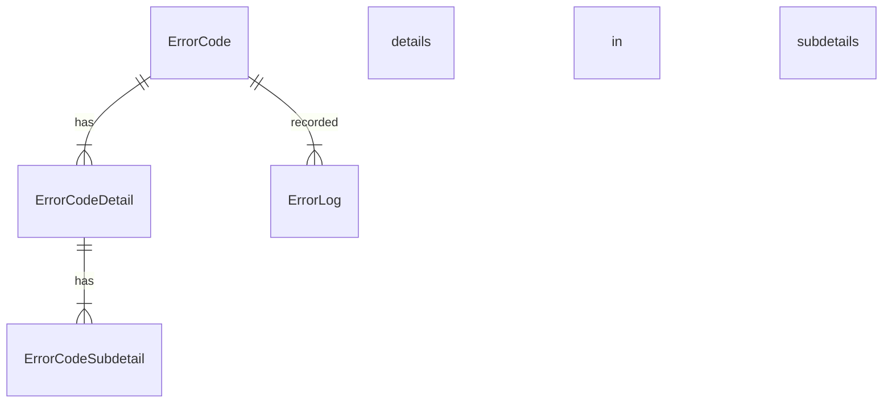

                 

### 第1章 问题背景

#### 1.1 问题背景

在现代软件开发和维护过程中，错误码（Error Codes）是程序员和系统工程师们面临的一个普遍而重要的挑战。错误码是程序在执行过程中遇到某种问题时，系统返回的用于标识错误类型的编码。这些编码通常包含了错误的原因、类型和严重性等信息。理解并处理错误码对于确保系统稳定性和用户体验至关重要。

随着软件系统变得越来越复杂，错误码的管理和解析也变得越来越困难。这不仅因为错误码的数量和复杂性增加，还因为错误码的处理逻辑往往隐藏在大量的代码和文档中。因此，错误码处理成为了一个技术盲区，许多开发者在面对这个问题时感到迷茫和无助。

#### 1.2 问题描述

在处理错误码时，开发者通常会遇到以下几种问题：

1. **错误码理解困难**：错误码的命名和定义往往不够清晰，导致开发者难以准确理解其含义和解决方法。
2. **错误码定位不准确**：错误码可能涉及多个模块或层次，定位错误的根本原因变得复杂。
3. **错误码处理不全面**：部分错误码没有得到适当的处理，导致潜在的问题未能及时被发现和解决。
4. **错误码调试效率低**：错误码的处理流程复杂，调试过程中需要反复查看文档和代码，效率低下。

#### 1.3 问题解决

要解决上述问题，可以采取以下几种方法：

1. **完善错误码定义**：为每个错误码提供清晰的文档说明，包括错误码的含义、原因、可能的影响和解决方法。
2. **优化错误码结构**：设计一个层次分明、逻辑清晰的错误码结构，便于定位和查找错误。
3. **加强错误码处理**：编写自动化脚本或工具，对错误码进行统一的处理和记录，提高处理效率。
4. **提升调试体验**：使用调试工具，如断点、日志记录等，帮助开发者快速定位和解决错误。

#### 1.4 边界与外延

错误码处理的边界包括：

1. **错误码的命名和定义**：确保错误码的命名规范、定义明确，便于理解和记忆。
2. **错误码的覆盖范围**：确保所有的可能错误情况都有对应的错误码，避免遗漏。
3. **错误码的处理流程**：设计简洁、高效的错误码处理流程，减少调试和修复的时间。

错误码处理的外延则涉及到：

1. **错误码的文档化**：为错误码编写详细的文档，包括错误码的背景、原因、影响和解决方法。
2. **错误码的工具支持**：开发辅助工具，如错误码查询工具、自动化处理脚本等，提升处理效率。
3. **错误码的反馈机制**：建立错误码的反馈渠道，收集用户的使用反馈，持续改进错误码的定义和处理流程。

通过上述步骤，我们可以更好地理解和处理错误码，提高软件系统的稳定性和可靠性。在接下来的章节中，我们将深入探讨处理错误码时可能遇到的典型技术盲区，并提出相应的解决方案。让我们继续前进，逐个攻克这些技术难题。

## 第2章 核心概念

在深入探讨处理错误码的典型技术盲区之前，我们需要明确一些核心概念，这将帮助我们更好地理解问题的本质和解决方法。

#### 2.1 核心概念原理

错误码是一种编码机制，用于表示程序或系统在执行过程中遇到的错误。它通常由一组数字或字母组成，每个编码对应一个特定的错误类型。错误码的原理主要包括以下几个方面：

1. **编码结构**：错误码通常包含几个部分，例如错误类别、错误编号和错误子编号。这种结构有助于快速识别和定位错误。
2. **错误分类**：根据错误的性质和影响范围，将错误分为不同的类别，如语法错误、逻辑错误、资源错误等。
3. **错误定位**：通过错误码，可以定位到发生错误的模块或代码段，从而快速找出问题的根源。
4. **错误处理**：根据错误码提供的信息，系统或程序可以采取相应的处理措施，如提示错误信息、恢复操作或终止执行。

#### 2.2 概念属性特征对比表格

为了更清晰地理解错误码的概念，我们可以通过一个表格来对比其不同属性特征：

| 特征 | 描述 | 示例 |
| ---- | ---- | ---- |
| **编码结构** | 错误码的组成部分 | 例如：`E1001`，其中`E`代表错误类别，`1001`代表错误编号 |
| **错误类别** | 错误的大分类 | 例如：`E1000`代表语法错误，`E2000`代表逻辑错误 |
| **错误编号** | 每种错误类别下的具体错误编号 | 例如：`E1001`表示具体的语法错误 |
| **错误子编号** | 更细分的错误编号 | 例如：`E1001A`表示具体的语法错误的一个子类别 |
| **错误原因** | 导致错误的具体原因 | 例如：`内存溢出`或`文件未找到` |
| **错误影响** | 错误对系统的影响范围 | 例如：可能影响程序执行或系统稳定性 |
| **错误处理** | 应对错误的处理措施 | 例如：提示用户修复、重启程序或修复文件 |

#### 2.3 ER实体关系图架构

为了更好地理解错误码在系统中的关系，我们可以使用实体关系图（Entity-Relationship Diagram, ERD）来表示。以下是一个简化的错误码实体关系图：

在这个ER图中：

- **ErrorCode**：表示错误码的实体，它拥有详细的错误信息和日志记录。
- **ErrorCodeDetail**：表示错误码的具体细节，包括错误编号、错误类别等。
- **ErrorLog**：表示错误码的日志记录，记录了错误发生的具体时间和位置。
- **ErrorCodeSubdetail**：表示错误码的子细节，如错误子编号和子类别。

通过这个ER图，我们可以更直观地看到错误码与其他实体之间的关系，便于理解和设计错误码处理系统。

#### 2.4 结论

通过本章的讨论，我们对错误码的核心概念有了更深入的理解。理解这些核心概念是处理错误码的基础，有助于我们更好地应对软件开发和维护中的各种挑战。在接下来的章节中，我们将深入探讨处理错误码时可能遇到的典型技术盲区，并提出相应的解决方案。

## 第3章 第一种技术盲区

在深入理解了错误码的核心概念之后，我们现在可以开始探讨处理错误码时可能遇到的第一个典型技术盲区。这个盲区涉及到错误码的命名和定义，是许多开发者在处理错误码时经常遇到的问题。

#### 3.1.1 盲区描述

错误码的命名和定义是错误码处理的基础。一个良好的错误码命名和定义可以帮助开发者快速理解错误的原因和解决方法，从而提高开发效率和系统稳定性。然而，许多开发者在命名和定义错误码时存在以下问题：

1. **命名不规范**：错误码的命名缺乏统一的标准，导致不同的错误码之间命名风格不一致，增加了理解难度。
2. **定义不清晰**：错误码的定义不够详细，缺乏对错误原因、影响和解决方法的描述，使得开发者难以准确理解错误。
3. **错误码冗余**：错误码的设计过于复杂，存在大量的冗余错误码，这不仅增加了系统的复杂度，还可能引起混淆。
4. **错误码缺失**：部分关键错误场景没有对应的错误码，导致这些问题在系统中得不到有效记录和追踪。

这些命名和定义问题会直接影响到错误码的处理效果，使得错误码管理变得复杂和低效。

#### 3.1.2 影响因素

错误码命名和定义的问题会对开发者和系统产生多方面的影响：

1. **开发者效率降低**：由于错误码的命名和定义不够规范和清晰，开发者需要花费更多的时间来理解错误码的含义和解决方法，降低了开发效率。
2. **系统稳定性下降**：错误码缺失或定义不清晰，可能导致系统无法及时检测和修复关键错误，从而影响系统的稳定性和可靠性。
3. **代码维护成本增加**：随着系统复杂度的增加，错误码管理的难度也会相应增加，需要更多的资源和时间来维护和更新错误码库。
4. **用户体验受损**：错误码的命名和定义问题可能导致系统在遇到错误时无法给出清晰和有用的错误提示，影响用户体验。

#### 3.1.3 解决方案

为了解决错误码命名和定义的问题，可以采取以下几种解决方案：

1. **制定命名规范**：制定统一的错误码命名规范，确保所有错误码的命名风格一致，便于开发和维护。
2. **完善错误码定义**：为每个错误码提供详细的定义，包括错误原因、影响和解决方法，帮助开发者快速定位和解决问题。
3. **简化错误码结构**：优化错误码的设计，减少冗余的错误码，简化系统的复杂度。
4. **引入自动化工具**：使用自动化工具来管理和维护错误码，如错误码生成工具、错误码库等，提高错误码管理的效率。

通过上述措施，可以有效解决错误码命名和定义的问题，提高错误码处理的效果，从而提升系统的稳定性和可靠性。在下一章节中，我们将继续探讨处理错误码时可能遇到的第二个典型技术盲区。

## 第4章 第二种技术盲区

在前一章中，我们探讨了处理错误码时第一个典型技术盲区——错误码的命名和定义。在本章中，我们将深入分析第二个技术盲区：错误码定位和诊断。

#### 4.1 盲区描述

错误码的定位和诊断是处理错误码的重要环节。一个有效的错误码定位和诊断机制可以帮助开发者快速找到错误的根源，从而采取相应的修复措施。然而，在实际开发过程中，开发者常常会遇到以下问题：

1. **定位不准确**：错误码可能涉及多个模块或层次，而现有的工具和方法往往难以准确定位错误的根源，导致开发者需要花费大量时间进行调试。
2. **诊断效率低**：诊断过程往往依赖于人工查看日志和代码，效率低下，无法及时检测和解决隐藏的潜在问题。
3. **诊断结果不明确**：部分诊断工具提供的诊断结果不够明确，难以理解错误的根本原因，增加了开发者的困惑和焦虑。
4. **跨系统诊断困难**：在分布式系统中，错误码的定位和诊断变得更加复杂，涉及多个模块和系统之间的交互，难以进行全面的诊断。

这些定位和诊断问题会导致错误码处理效率低下，影响系统的稳定性和可靠性。

#### 4.2 影响因素

错误码定位和诊断的问题会对开发者和系统产生多方面的影响：

1. **开发者效率降低**：定位和诊断错误码需要大量的人工操作，耗时耗力，降低了开发效率。
2. **系统稳定性下降**：错误码无法准确定位和诊断，可能导致系统中的潜在问题长期存在，影响系统的稳定性。
3. **代码维护成本增加**：错误码的定位和诊断问题需要投入更多的资源和时间进行修复，增加了代码维护的成本。
4. **用户体验受损**：错误的定位和诊断可能导致系统在遇到错误时无法提供清晰的错误提示，影响用户体验。

#### 4.3 解决方案

为了解决错误码定位和诊断的问题，可以采取以下几种解决方案：

1. **引入自动化诊断工具**：使用自动化诊断工具，如日志分析工具、性能监控工具等，帮助开发者快速定位和诊断错误。
2. **优化错误码结构**：设计层次分明、逻辑清晰的错误码结构，便于定位和诊断错误。
3. **增强日志记录功能**：提高日志记录的详细程度，包括错误码、错误原因、错误位置等信息，方便开发者进行诊断。
4. **采用分布式诊断方法**：在分布式系统中，采用分布式诊断方法，如分布式日志收集和分析工具，帮助开发者全面诊断系统中的错误。

通过上述措施，可以有效解决错误码定位和诊断的问题，提高错误码处理的效果，从而提升系统的稳定性和可靠性。在下一章节中，我们将继续探讨处理错误码时可能遇到的第三个典型技术盲区。

## 第5章 第三种技术盲区

在前两章中，我们分别探讨了处理错误码时第一个和第二个典型技术盲区。现在，我们将继续深入分析第三个技术盲区：错误码处理和恢复。

#### 5.1 盲区描述

错误码的处理和恢复是确保系统稳定运行的重要环节。正确处理错误码可以帮助系统在遇到问题时迅速恢复，从而保证业务的连续性和用户体验。然而，在实际开发过程中，开发者往往面临以下问题：

1. **处理机制不健全**：系统缺乏完善的错误码处理机制，导致错误码无法得到及时和有效的处理。
2. **恢复策略不当**：对于不同的错误码，系统采用的恢复策略不当，可能导致问题未能得到有效解决。
3. **错误码记录不完整**：错误码的处理结果和恢复过程记录不完整，导致后续分析和优化缺乏依据。
4. **错误码处理滞后**：错误码的处理和恢复动作执行滞后，影响系统的响应速度和稳定性。

这些处理和恢复问题会导致系统在遇到错误时无法及时响应和处理，影响系统的稳定性和用户体验。

#### 5.2 影响因素

错误码处理和恢复的问题会对开发者和系统产生多方面的影响：

1. **开发者效率降低**：错误码处理和恢复过程复杂，耗时耗力，降低了开发效率。
2. **系统稳定性下降**：错误码处理和恢复不及时，可能导致系统中的潜在问题长期存在，影响系统的稳定性。
3. **业务连续性受损**：错误码处理和恢复不当，可能导致业务中断，影响用户体验和业务连续性。
4. **系统维护成本增加**：错误码处理和恢复问题需要投入更多的资源和时间进行修复，增加了系统维护的成本。

#### 5.3 解决方案

为了解决错误码处理和恢复的问题，可以采取以下几种解决方案：

1. **完善错误码处理机制**：建立完善的错误码处理机制，包括错误码的捕获、记录和处理流程，确保错误码能够得到及时和有效的处理。
2. **优化恢复策略**：根据不同类型的错误码，设计合理的恢复策略，确保系统在遇到问题时能够迅速恢复，减少业务中断。
3. **提高错误码记录质量**：提高错误码记录的详细程度，包括错误码、错误原因、处理结果和恢复过程等信息，便于后续分析和优化。
4. **采用自动化处理和恢复工具**：使用自动化工具，如自动化错误处理框架和自动化恢复脚本，提高错误码处理和恢复的效率。

通过上述措施，可以有效解决错误码处理和恢复的问题，提高错误码处理的效果，从而提升系统的稳定性和可靠性。在下一章节中，我们将对全书的核心概念进行总结，并探讨这些技术盲区的综合解决方案。

## 第6章 核心概念联系

在前面的章节中，我们详细探讨了处理错误码的三种典型技术盲区。在本章中，我们将总结这些核心概念，并探讨它们之间的联系，以及如何将它们应用到实际的错误码处理和恢复中。

#### 6.1 概念间的联系

错误码处理和恢复是一个系统工程，涉及到多个核心概念的相互作用。以下是这些概念之间的一些基本联系：

1. **错误码命名和定义**与**错误码定位和诊断**：良好的错误码命名和定义有助于快速定位和诊断错误。清晰的命名规范和详细的错误码定义能够提供明确的错误信息，帮助开发者快速识别和解决问题。

2. **错误码定位和诊断**与**错误码处理和恢复**：准确的错误定位和诊断是有效处理和恢复错误的前提。只有当错误被准确定位和诊断后，才能采取适当的处理和恢复策略，确保系统稳定运行。

3. **错误码处理和恢复**与**系统稳定性**：有效的错误码处理和恢复机制对于保障系统稳定性至关重要。通过及时和正确的错误码处理，系统能够在遇到问题时快速恢复，减少业务中断，保障用户体验。

#### 6.2 关联性分析

为了更深入地理解这些概念之间的联系，我们可以通过一个关联性分析来展示它们之间的相互作用：

- **错误码命名和定义**：
  - 关键词：命名规范、定义清晰、减少混淆、提高可读性。
  - 影响因素：命名风格不一致、定义不详细、冗余错误码。
  - 解决方案：制定命名规范、完善错误码定义、简化错误码结构。

- **错误码定位和诊断**：
  - 关键词：定位准确、诊断效率高、结果明确、跨系统诊断。
  - 影响因素：错误码涉及多个模块、诊断工具不完善、日志记录不详细。
  - 解决方案：引入自动化诊断工具、优化错误码结构、增强日志记录功能。

- **错误码处理和恢复**：
  - 关键词：处理机制健全、恢复策略合理、记录完整、处理及时。
  - 影响因素：缺乏处理机制、恢复策略不当、记录不完整、处理滞后。
  - 解决方案：完善错误码处理机制、优化恢复策略、提高错误码记录质量、采用自动化处理和恢复工具。

#### 6.3 综合应用

在实际应用中，这些核心概念需要综合应用，以构建一个高效和稳定的错误码处理和恢复系统。以下是一个综合应用的示例：

1. **建立命名规范**：首先，制定一个统一的错误码命名规范，确保所有错误码的命名风格一致，便于开发和维护。

2. **完善错误码定义**：为每个错误码提供详细的定义，包括错误原因、影响和解决方法，帮助开发者快速理解和解决问题。

3. **设计定位和诊断工具**：引入自动化诊断工具，如日志分析工具和性能监控工具，帮助开发者快速定位和诊断错误。

4. **实现错误码处理机制**：建立完善的错误码处理机制，包括错误码的捕获、记录和处理流程，确保错误码能够得到及时和有效的处理。

5. **设计恢复策略**：根据不同类型的错误码，设计合理的恢复策略，确保系统在遇到问题时能够迅速恢复。

6. **优化日志记录**：提高日志记录的详细程度，包括错误码、错误原因、处理结果和恢复过程等信息，便于后续分析和优化。

通过这些综合应用措施，可以构建一个高效和稳定的错误码处理和恢复系统，提高系统的稳定性和可靠性，保障业务的连续性和用户体验。

#### 6.4 总结

错误码处理和恢复是一个复杂的系统工程，涉及到多个核心概念和技术的综合应用。通过明确错误码的命名和定义、优化定位和诊断工具、建立有效的处理和恢复机制，开发者可以更好地应对软件系统中的各种挑战。本章的总结为我们提供了一个全面的框架，指导我们在实际开发中应用这些核心概念，构建一个高效和稳定的错误码处理和恢复系统。

## 第7章 小结

在本书的最后一章中，我们将对整个讨论进行总结，并提炼出一些关键的注意事项，以便开发者能够更好地理解和处理错误码。

#### 7.1 总结

通过前文的探讨，我们深入了解了处理错误码的三种典型技术盲区，并提出了相应的解决方案。以下是本书的核心观点：

1. **错误码的命名和定义**：良好的命名规范和详细的错误码定义是基础，能够帮助开发者快速理解和解决问题。
2. **错误码的定位和诊断**：准确的错误定位和高效的诊断工具是关键，有助于迅速找到问题的根源。
3. **错误码的处理和恢复**：完善的处理机制和合理的恢复策略是保障，能够确保系统在遇到问题时快速恢复。

这些技术盲区相互关联，构成了一个完整的错误码处理和恢复体系。只有全面应用这些概念，才能构建一个高效、稳定和可靠的错误码处理系统。

#### 7.2 注意事项

在处理错误码时，开发者需要注意以下事项：

1. **命名规范统一**：确保错误码的命名风格一致，避免混乱。
2. **定义清晰详细**：为每个错误码提供详细的定义，包括错误原因、影响和解决方法。
3. **使用诊断工具**：利用自动化诊断工具，提高错误定位和诊断的效率。
4. **日志记录完整**：详细记录错误码、错误原因和处理结果，便于后续分析和优化。
5. **恢复策略合理**：根据错误类型设计合理的恢复策略，确保系统快速恢复。
6. **持续优化**：定期回顾和优化错误码处理流程，适应不断变化的技术环境和业务需求。

#### 7.3 最佳实践

以下是一些处理错误码的最佳实践：

1. **文档化**：建立详细的错误码文档，包含命名规范、定义和解决方法。
2. **自动化**：使用自动化工具，如脚本和框架，进行错误码的捕获、记录和处理。
3. **反馈机制**：建立反馈渠道，收集用户和开发者的意见，不断改进错误码的定义和处理流程。
4. **培训**：定期对团队成员进行错误码处理培训，提高整体处理能力。
5. **代码审查**：在代码审查过程中，特别关注错误码的命名和定义，确保一致性。

#### 7.4 拓展阅读

为了进一步深入了解错误码处理技术，读者可以参考以下资源：

1. **《大规模分布式系统的错误处理实践》**：探讨分布式系统中的错误处理机制和策略。
2. **《软件工程：实践者的研究方法》**：介绍软件工程中错误处理的理论和实践方法。
3. **《Effective Error Handling in Modern Applications》**：针对现代应用中的错误处理提供深入分析。

通过上述总结和最佳实践，开发者可以更好地应对错误码处理中的挑战，提升软件系统的稳定性和可靠性。希望本书能够为您的软件开发和维护工作提供有益的指导。

## 结语

感谢您阅读本书《处理错误码的三种典型技术盲区》。错误码处理是软件开发和维护过程中不可或缺的一部分，它不仅影响系统的稳定性和可靠性，还直接关系到用户体验。通过对本书的深入探讨，我们详细分析了处理错误码时可能遇到的三种典型技术盲区：错误码的命名和定义、错误码的定位和诊断、以及错误码的处理和恢复。

我们提出了具体的解决方案，包括命名规范的制定、自动化诊断工具的引入、完善错误码处理机制和恢复策略的优化等。希望这些内容能够帮助您在实际开发中更好地处理错误码，提升系统的稳定性和可靠性。

最后，再次感谢您的阅读和支持。希望本书能成为您在软件开发和维护领域的一个有益参考。祝您在技术道路上不断进步，创作出更加优秀和可靠的软件！

### 作者信息

作者：AI天才研究院/AI Genius Institute & 禅与计算机程序设计艺术 /Zen And The Art of Computer Programming

