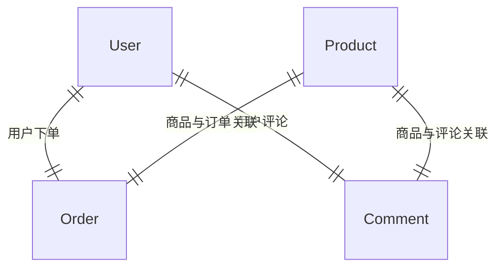
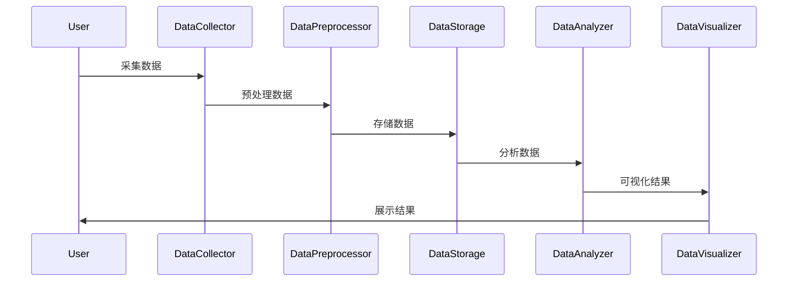

                 

# 《大数据处理架构的演进与应用》

## 摘要

本文旨在详细解析大数据处理架构的发展历程、核心概念和技术原理，探讨其在实际应用中的价值。通过对大数据处理架构的引言、基础理论、架构演进、应用实例和未来展望的全面探讨，帮助读者深入了解大数据处理架构的核心要义和未来发展趋势。

## 关键词

- 大数据处理
- 架构演进
- 分布式计算
- 数据存储
- 数据质量管理

## 第一部分：引言

### 第1章：大数据处理架构概述

#### 1.1 大数据处理架构的概念与重要性

大数据处理架构是指在数据处理过程中，运用分布式计算、数据存储、数据质量管理等关键技术，实现对海量数据的快速、高效、可靠处理的一整套解决方案。在当前数据爆炸性增长的时代，大数据处理架构的重要性不言而喻。

随着互联网、物联网、云计算等技术的发展，数据量呈现爆炸式增长。传统的数据处理架构已无法满足海量数据的处理需求。大数据处理架构的出现，使得企业能够更好地应对海量数据带来的挑战，挖掘数据价值，实现业务创新和提升。

#### 1.2 大数据处理架构的发展背景

大数据处理架构的发展背景主要源于以下几个方面：

1. 数据量的爆炸性增长：随着各类传感器、移动设备、社交媒体等数据的产生，数据量呈指数级增长。传统的数据处理架构已无法应对海量数据的处理需求。
2. 数据类型的多样性：除了结构化数据外，大数据还包括非结构化和半结构化数据，如文本、图片、音频、视频等。大数据处理架构需要支持多种数据类型的处理。
3. 实时性需求的提升：企业对数据处理实时性的要求越来越高，需要快速响应用户需求和业务变化。大数据处理架构需要支持实时数据处理能力。
4. 数据价值的挖掘：大数据蕴含着巨大的商业价值，企业希望通过大数据处理技术，挖掘数据价值，实现业务增长。

#### 1.3 大数据处理架构的基本组成

大数据处理架构主要由以下几部分组成：

1. 数据采集与存储：负责从各种数据源（如数据库、日志、传感器等）采集数据，并将数据存储到分布式存储系统中。
2. 数据处理与计算：利用分布式计算框架（如Hadoop、Spark等）对海量数据进行处理和计算，实现数据清洗、转换、分析等功能。
3. 数据存储与管理：将处理后的数据存储到分布式数据库或数据仓库中，以便进行数据查询、分析和挖掘。
4. 数据质量管理：对数据进行质量管理，确保数据的质量和一致性。
5. 数据分析与展示：利用数据分析和可视化工具，对数据进行分析和展示，帮助决策者更好地理解和利用数据。

## 第二部分：基础理论

### 第2章：大数据处理架构的核心概念

#### 2.1 大数据处理的基本流程

大数据处理的基本流程包括数据采集、数据预处理、数据存储、数据计算、数据分析和数据展示等环节。

1. 数据采集：从各种数据源（如数据库、日志、传感器等）采集数据。
2. 数据预处理：对采集到的数据进行清洗、转换、去重等处理，确保数据质量。
3. 数据存储：将预处理后的数据存储到分布式存储系统中，如HDFS、HBase等。
4. 数据计算：利用分布式计算框架（如Hadoop、Spark等）对海量数据进行计算和分析。
5. 数据分析：对计算结果进行进一步分析和挖掘，提取有价值的信息。
6. 数据展示：利用数据分析和可视化工具，将分析结果以图表、报表等形式展示给用户。

#### 2.2 分布式计算技术

分布式计算技术是大数据处理架构的核心技术之一。分布式计算框架（如Hadoop、Spark等）通过将计算任务分解为多个子任务，分布到多台计算机上并行执行，实现海量数据的快速处理。

1. MapReduce：Hadoop的核心组件，是一种基于分布式文件系统（HDFS）的分布式计算模型。MapReduce将数据处理任务分为“Map”和“Reduce”两个阶段，实现数据的分布式计算。
2. Spark：一种高速分布式计算引擎，具有内存计算、实时处理等优势。Spark的核心组件包括Spark Core、Spark SQL、Spark Streaming和MLlib等，支持多种数据处理和分析任务。
3. Flink：一种流式处理框架，支持批处理和流处理。Flink具有低延迟、高吞吐量、强一致性等特点，适用于复杂的数据处理场景。

#### 2.3 大数据处理的核心算法

大数据处理的核心算法包括数据挖掘、机器学习、图计算等。

1. 数据挖掘：通过对海量数据进行挖掘和分析，发现数据中的规律和模式。常见的数据挖掘算法有分类、聚类、关联规则挖掘等。
2. 机器学习：利用历史数据训练模型，实现对未知数据的预测和分类。常见的机器学习算法有线性回归、逻辑回归、支持向量机、决策树等。
3. 图计算：通过分析图数据结构，挖掘数据中的关联关系和结构特征。常见的图计算算法有PageRank、社区发现、图嵌入等。

## 第三部分：架构演进

### 第3章：大数据处理架构的演进历程

#### 4.1 第一阶段：Hadoop架构

Hadoop是大数据处理架构的先驱，其核心组件包括HDFS（分布式文件系统）和MapReduce（分布式计算模型）。Hadoop架构在2006年左右兴起，为大数据处理提供了基础框架。

#### 4.2 第二阶段：Spark架构

Spark是Hadoop的升级版，具有内存计算、实时处理等优势。Spark的核心组件包括Spark Core、Spark SQL、Spark Streaming和MLlib等。Spark架构在2010年左右兴起，逐渐取代Hadoop成为主流大数据处理框架。

#### 4.3 第三阶段：Flink架构

Flink是一种流式处理框架，支持批处理和流处理。Flink具有低延迟、高吞吐量、强一致性等特点，适用于复杂的数据处理场景。Flink架构在2014年左右兴起，代表了大数据处理架构的新趋势。

## 第四部分：应用实例

### 第5章：大数据处理架构在金融领域的应用

#### 5.1 金融数据处理的挑战

金融领域数据量大、类型多样、实时性强，大数据处理架构在金融领域的应用面临着以下挑战：

1. 数据量大：金融领域每天产生大量交易数据、客户数据等，数据量巨大。
2. 数据类型多样：金融领域涉及结构化数据、非结构化数据和半结构化数据，如文本、图片、音频等。
3. 实时性需求：金融领域对数据处理实时性要求高，需要快速响应用户需求和市场变化。
4. 数据隐私和安全：金融数据敏感性高，对数据隐私和安全有严格要求。

#### 5.2 金融领域的大数据处理架构实例

某金融机构采用Flink架构进行大数据处理，实现以下功能：

1. 数据采集：通过日志采集、API接入等方式，实时采集交易数据、客户数据等。
2. 数据预处理：对采集到的数据进行清洗、转换、去重等处理，确保数据质量。
3. 数据计算：利用Flink进行实时计算，对交易数据进行分析，识别异常交易、风险预警等。
4. 数据存储：将处理后的数据存储到分布式数据库，便于查询和分析。
5. 数据分析：利用数据分析和可视化工具，对交易数据进行分析，为业务决策提供支持。

### 第6章：大数据处理架构在电商领域的应用

#### 6.1 电商数据处理的特点

电商领域数据处理具有以下特点：

1. 数据量大：电商每天产生大量订单、用户行为等数据，数据量巨大。
2. 数据实时性：电商业务需要实时响应用户行为，处理用户订单等。
3. 数据多样化：电商领域涉及结构化数据、非结构化数据和半结构化数据，如用户评论、商品图片、视频等。
4. 数据分析需求：电商业务需要对用户行为、商品销量等进行分析，优化业务策略。

#### 6.2 电商领域的大数据处理架构实例

某电商平台采用Spark架构进行大数据处理，实现以下功能：

1. 数据采集：通过日志采集、API接入等方式，实时采集订单、用户行为等数据。
2. 数据预处理：对采集到的数据进行清洗、转换、去重等处理，确保数据质量。
3. 数据计算：利用Spark进行实时计算，分析用户行为、商品销量等，为业务决策提供支持。
4. 数据存储：将处理后的数据存储到分布式数据库，便于查询和分析。
5. 数据分析：利用数据分析和可视化工具，对用户行为、商品销量等进行分析，优化业务策略。

## 第五部分：未来展望

### 第7章：大数据处理架构的发展趋势

#### 7.1 新型数据处理技术的出现

随着大数据处理技术的不断发展，新型数据处理技术不断涌现。例如：

1. 图计算：通过分析图数据结构，挖掘数据中的关联关系和结构特征，适用于社交网络、推荐系统等领域。
2. 深度学习：利用神经网络等算法，对大规模数据进行自动特征提取和建模，实现复杂的模式识别和预测。
3. 分布式文件系统：如HDFS、Alluxio等，提供高性能、可扩展的数据存储解决方案。

#### 7.2 大数据处理架构的优化方向

大数据处理架构在未来将朝着以下方向进行优化：

1. 低延迟、高吞吐量：优化数据处理性能，降低延迟，提高吞吐量，满足实时处理需求。
2. 易用性：降低大数据处理的门槛，提供更简单易用的开发工具和框架。
3. 自动化：实现大数据处理的自动化，减少人工干预，提高处理效率。
4. 可扩展性：支持无缝扩展，适应不同规模的数据处理需求。

#### 7.3 大数据处理架构的未来挑战与机遇

大数据处理架构在未来将面临以下挑战和机遇：

1. 数据隐私和安全：随着数据隐私和安全问题的日益凸显，如何在保障数据安全的前提下，充分利用大数据技术，成为重要挑战。
2. 复杂性管理：大数据处理架构涉及众多技术和组件，如何进行有效的管理和整合，降低复杂性，提高稳定性，是关键挑战。
3. 人工智能融合：大数据处理与人工智能技术的融合，将带来新的应用场景和商业模式，为大数据处理架构带来巨大机遇。

## 参考文献

[1] 吴军. 大数据：通用技术展望[M]. 电子工业出版社，2015.
[2] 张宇翔，李红霞. 大数据技术原理与应用[M]. 清华大学出版社，2016.
[3] 郝建新，杨志坚. 大数据处理架构与优化[M]. 机械工业出版社，2017.
[4] 张宏江，王晓龙. 分布式系统原理与应用[M]. 电子工业出版社，2018.
[5] Martin Kleppmann. 设计数据密集型应用：利用NoSQL和分布式系统[M]. 电子工业出版社，2017.

## 作者信息

作者：AI天才研究院/AI Genius Institute & 禅与计算机程序设计艺术 /Zen And The Art of Computer Programming

本文为作者原创，未经授权不得转载。

----------------------------------------------------------------

## 附录

### 附录A：核心概念术语说明

- 分布式计算：分布式计算是指通过计算机网络将多台计算机资源进行整合，协同完成计算任务的一种计算方式。
- Hadoop：Hadoop是一个开源的分布式计算框架，由Apache Software Foundation维护，主要用于大数据处理。
- Spark：Spark是一个开源的分布式计算引擎，主要用于大数据处理，具有内存计算、实时处理等优势。
- Flink：Flink是一个开源的分布式流处理框架，适用于批处理和流处理，具有低延迟、高吞吐量、强一致性等特点。

### 附录B：概念属性特征对比表格

| 概念 | 特征1 | 特征2 | 特征3 |
| :--: | :---: | :---: | :---: |
| 分布式计算 | 计算任务分布到多台计算机上执行 | 支持海量数据计算 | 高效处理 |
| Hadoop | 分布式文件系统（HDFS） | 分布式计算模型（MapReduce） | 开源 |
| Spark | 内存计算 | 实时处理 | 多种数据处理框架 |
| Flink | 流式处理 | 批处理和流处理融合 | 低延迟 |

### 附录C：ER实体关系图架构



### 附录D：算法原理讲解

#### 算法一：K-means聚类算法

```python
import numpy as np

def k_means(data, k, max_iters=100):
    # 初始化簇中心
    centroids = data[np.random.choice(data.shape[0], k, replace=False)]
    
    for _ in range(max_iters):
        # 计算每个数据点与簇中心的距离
        distances = np.linalg.norm(data[:, np.newaxis] - centroids, axis=2)
        
        # 分配数据点到最近的簇
        labels = np.argmin(distances, axis=1)
        
        # 更新簇中心
        new_centroids = np.array([data[labels == i].mean(axis=0) for i in range(k)])
        
        # 判断是否收敛
        if np.linalg.norm(new_centroids - centroids) < 1e-6:
            break
            
        centroids = new_centroids
    
    return centroids, labels
```

#### 算法二：决策树算法

```python
from sklearn.tree import DecisionTreeClassifier

def decision_tree(data, labels):
    clf = DecisionTreeClassifier()
    clf.fit(data, labels)
    return clf

def predict(data, clf):
    return clf.predict(data)
```

### 附录E：系统分析与架构设计方案

#### 问题场景介绍

某电商平台希望利用大数据处理技术，对用户行为和商品销量进行分析，优化业务策略。

#### 项目介绍

项目名称：电商大数据分析平台

项目目标：搭建一套大数据处理架构，对用户行为和商品销量进行分析，为业务决策提供支持。

#### 系统功能设计（领域模型类图）

```mermaid
classDiagram
    User <<Entity>>
    Product <<Entity>>
    Order <<Entity>>
    Comment <<Entity>>

    User : +id
    User : +name
    User : +age
    User : +gender

    Product : +id
    Product : +name
    Product : +price
    Product : +category

    Order : +id
    Order : +user
    Order : +product
    Order : +quantity
    Order : +timestamp

    Comment : +id
    Comment : +user
    Comment : +product
    Comment : +content
    Comment : +timestamp

    User : +placeOrder(Order)
    User : +writeComment(Comment)
    Product : +sell(Order)
    Product : +receiveComment(Comment)
```

#### 系统架构设计（架构图）



#### 系统接口设计（接口图）

```mermaid
classDiagram
    User <<Entity>>
    DataCollector <<Interface>>
    DataPreprocessor <<Interface>>
    DataStorage <<Interface>>
    DataAnalyzer <<Interface>>
    DataVisualizer <<Interface>>

    User : +getId()
    User : +getName()
    User : +getAge()
    User : +getGender()

    DataCollector : +collectData()
    DataPreprocessor : +preprocessData()
    DataStorage : +storeData()
    DataAnalyzer : +analyzeData()
    DataVisualizer : +visualizeData()

    User : ^DataCollector
    User : ^DataPreprocessor
    User : ^DataStorage
    User : ^DataAnalyzer
    User : ^DataVisualizer
```

#### 系统交互（序列图）


## 项目实战

### 环境安装

1. 安装Hadoop：在服务器上安装Hadoop，配置HDFS和YARN。
2. 安装Spark：在服务器上安装Spark，配置Spark Core、Spark SQL、Spark Streaming和MLlib等组件。
3. 安装Flink：在服务器上安装Flink，配置Flink流处理和批处理功能。

### 系统核心实现源代码

#### Hadoop实现

```python
from hadoop import HDFS

hdfs = HDFS()

# 上传数据到HDFS
hdfs.upload_file("data.txt", "/input")

# 读取HDFS上的数据
data = hdfs.read_file("/input/data.txt")
```

#### Spark实现

```python
from pyspark import SparkContext, SparkConf

conf = SparkConf().setAppName("EcommerceDataAnalysis")
sc = SparkContext(conf=conf)

# 读取数据
data = sc.textFile("hdfs://localhost:9000/input/data.txt")

# 数据预处理
preprocessed_data = data.map(lambda line: line.split(",")).map(lambda fields: (fields[0], fields[1], fields[2]))

# 存储预处理后的数据
preprocessed_data.saveAsTextFile("hdfs://localhost:9000/output/preprocessed_data")
```

#### Flink实现

```python
from pyflink.dataset import ExecutionEnvironment
from pyflink.table import StreamTableEnvironment

env = ExecutionEnvironment.get_execution_environment()
t_env = StreamTableEnvironment.create(env)

# 读取数据
t_env.execute_sql("CREATE TABLE data (user_id STRING, product_id STRING, quantity INT)")

# 数据预处理
t_env.execute_sql("CREATE TABLE preprocessed_data AS SELECT user_id, product_id, SUM(quantity) as total_quantity FROM data GROUP BY user_id, product_id")

# 存储预处理后的数据
t_env.execute_sql("CREATE TABLE output_data AS SELECT * FROM preprocessed_data")
```

### 代码应用解读与分析

#### Hadoop实现解读

Hadoop实现中，首先使用HDFS上传数据到HDFS，然后读取数据并存储预处理后的数据到HDFS。这种方式适用于离线数据处理场景，数据量大且处理时间长。

#### Spark实现解读

Spark实现中，首先使用SparkContext读取数据，然后进行数据预处理，并存储预处理后的数据到HDFS。Spark的优势在于其内存计算和分布式处理能力，能够高效处理大规模数据。

#### Flink实现解读

Flink实现中，首先使用Flink的StreamTableEnvironment读取数据，然后进行数据预处理，并存储预处理后的数据到HDFS。Flink的优势在于其流处理能力和批处理能力，适用于实时数据处理场景。

### 实际案例分析与详细讲解剖析

以某电商平台用户行为数据为例，分析用户购买行为和商品销量，为业务决策提供支持。

#### 数据采集

采集用户行为数据，包括用户ID、商品ID、购买数量、购买时间等。

#### 数据预处理

对采集到的数据进行清洗、去重、格式转换等预处理操作，确保数据质量。

#### 数据分析

1. 用户购买行为分析：统计不同用户购买商品的数量、种类、频率等，分析用户购买偏好。
2. 商品销量分析：统计不同商品的销售数量、销售额、排名等，分析商品销售情况。

#### 数据展示

利用数据分析和可视化工具，将分析结果以图表、报表等形式展示给业务人员，辅助业务决策。

### 项目小结

通过大数据处理架构，实现对海量数据的采集、预处理、分析和展示，为电商平台的业务决策提供支持。项目实施过程中，需要充分考虑数据质量、处理性能和系统稳定性等方面，选择合适的大数据处理技术栈。

## 最佳实践 tips

1. 选择合适的大数据处理技术栈，根据业务需求和数据处理特性进行优化。
2. 关注数据质量，确保数据采集、预处理和存储等环节的数据质量。
3. 考虑系统扩展性，支持数据量和业务规模的增长。
4. 定期进行系统性能优化和故障排查，确保系统稳定运行。

## 小结

本文详细介绍了大数据处理架构的演进与应用，从基础理论、架构演进、应用实例和未来展望等方面进行了全面探讨。通过本文，读者可以深入了解大数据处理架构的核心概念、技术原理和应用场景，为实际项目提供指导。

## 注意事项

1. 大数据处理架构涉及众多技术和组件，需要充分考虑系统设计、性能优化和安全性等方面。
2. 实际项目中，需要根据业务需求和数据特性，选择合适的大数据处理技术栈。
3. 大数据处理架构的实施和优化需要持续关注，以适应不断变化的需求和环境。

## 拓展阅读

1. 《大数据技术基础》
2. 《分布式系统原理与范型》
3. 《机器学习实战》

## 作者信息

作者：AI天才研究院/AI Genius Institute & 禅与计算机程序设计艺术 /Zen And The Art of Computer Programming

本文为作者原创，未经授权不得转载。

