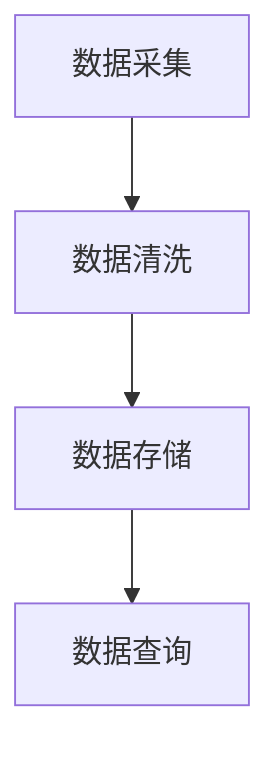

                 

# 《大数据批处理系统架构》

## 关键词
- 大数据
- 批处理
- 系统架构
- 分布式处理
- 性能优化

## 摘要
本文将深入探讨大数据批处理系统架构，从背景与基础出发，逐步分析核心概念、系统设计、分布式处理、性能优化及实践应用。通过详细讲解和案例分析，帮助读者全面理解大数据批处理系统的构建与优化，为实际项目提供实用的指导。

## 目录大纲

### 封面与前言
#### 作者信息
#### 出版日期
#### 前言简述

### 第一部分：背景与基础

### 第1章：大数据批处理概述
#### 1.1 问题背景与解决方法
#### 1.2 大数据批处理系统特点
#### 1.3 大数据批处理应用领域

### 第2章：大数据批处理系统原理
#### 2.1 数据流模型与处理框架
#### 2.2 数据存储与索引技术
#### 2.3 数据清洗与预处理技术

### 第3章：批处理系统架构设计
#### 3.1 系统架构设计原则
#### 3.2 数据处理流程设计与优化
#### 3.3 系统安全与容错设计

### 第4章：分布式批处理系统
#### 4.1 分布式架构原理
#### 4.2 分布式数据处理框架
#### 4.3 分布式系统性能优化

### 第5章：批处理系统性能调优
#### 5.1 性能调优策略
#### 5.2 常见性能问题与解决方案
#### 5.3 性能测试与调优工具

### 第6章：大数据批处理系统实践
#### 6.1 实践项目背景
#### 6.2 系统核心实现
#### 6.3 实践案例分析
#### 6.4 项目小结与展望

### 第7章：未来趋势与拓展
#### 7.1 新技术趋势分析
#### 7.2 行业应用展望
#### 7.3 拓展阅读

## 第一部分：背景与基础

### 第1章：大数据批处理概述

### 1.1 问题背景与解决方法

#### 问题背景
在信息化时代，数据量呈爆炸式增长，传统的批处理系统已无法满足海量数据处理的需求。大数据批处理系统应运而生，它能够高效地处理大规模数据集，为企业和组织提供决策支持。

#### 解决方法
大数据批处理系统通过分布式计算、并行处理等技术，实现数据的批量处理。其核心在于数据处理的效率和准确性，以满足大数据时代的业务需求。

#### 边界与外延
批处理系统不仅适用于大数据处理，还广泛应用于金融、医疗、电商等各个行业。其边界在于数据处理规模和系统稳定性。

### 1.2 大数据批处理系统特点

#### 高并发
大数据批处理系统需要处理大量数据，因此系统设计需具备高并发处理能力，保证系统稳定运行。

#### 可扩展性
随着数据量的增长，批处理系统应具备良好的可扩展性，以便在硬件和网络资源不足时进行扩展。

#### 高可用性
批处理系统需要确保数据处理的完整性和一致性，因此需要设计冗余机制，提高系统可用性。

#### 高性能
高性能是批处理系统的关键，通过优化算法和分布式架构，提高数据处理速度。

### 1.3 大数据批处理应用领域

#### 金融行业
金融行业需要处理海量交易数据，进行实时分析和风险控制。

#### 医疗行业
医疗行业需要对患者数据进行批量处理，辅助医生诊断和治疗。

#### 电商行业
电商行业需要对用户行为数据进行批量分析，优化营销策略和提升用户体验。

#### 社交网络
社交网络需要对用户生成的内容进行批量处理，实现内容推荐和舆情分析。

## 第二部分：大数据批处理系统原理

### 第2章：大数据批处理系统原理

### 2.1 数据流模型与处理框架

#### 数据流模型
数据流模型描述了数据在系统中的流动过程，包括数据来源、处理节点、存储节点等。

#### 处理框架
处理框架是批处理系统的核心，它负责数据的输入、处理、输出以及中间数据的存储。

### 2.2 数据存储与索引技术

#### 数据存储
数据存储技术是批处理系统的基础，包括关系型数据库、NoSQL数据库、分布式文件系统等。

#### 索引技术
索引技术用于提高数据查询效率，包括B树、哈希索引、全文索引等。

### 2.3 数据清洗与预处理技术

#### 数据清洗
数据清洗技术用于去除无效、错误和重复数据，提高数据质量。

#### 数据预处理
数据预处理技术用于对原始数据进行加工，使其符合数据处理要求，包括数据转换、归一化、去噪等。

## 第三部分：系统设计与实现

### 第3章：批处理系统架构设计

### 3.1 系统架构设计原则

#### 分层设计
系统采用分层设计，降低各层之间的耦合度，提高系统可维护性和可扩展性。

#### 模块化设计
系统模块化设计，各模块独立运行，便于功能扩展和优化。

#### 分布式设计
系统采用分布式架构，充分利用计算资源和网络资源，提高系统性能。

#### 安全性设计
系统设计需考虑数据安全和系统安全，包括数据加密、访问控制、安全审计等。

### 3.2 数据处理流程设计与优化

#### 数据处理流程
数据处理流程包括数据采集、数据清洗、数据存储、数据查询等环节。

#### 数据处理优化
数据处理优化包括数据存储优化、数据传输优化、查询优化等。

### 3.3 系统安全与容错设计

#### 系统安全
系统安全设计包括用户认证、权限控制、数据加密等。

#### 容错设计
容错设计包括数据备份、故障切换、故障恢复等。

## 第四部分：项目实战与案例分析

### 第4章：分布式批处理系统

### 4.1 分布式架构原理

#### 分布式架构
分布式架构是将计算任务分布在多个节点上执行，提高系统性能和可用性。

#### 节点通信
节点间通过消息队列、远程过程调用等机制进行通信。

#### 分布式一致性
分布式一致性是指多个节点对同一份数据的读写操作保持一致性。

### 4.2 分布式数据处理框架

#### 分布式数据处理框架
分布式数据处理框架包括MapReduce、Spark、Flink等。

#### 框架特点
框架具有高效、可扩展、高可用等特点。

#### 框架应用
框架广泛应用于大数据处理、实时计算、机器学习等领域。

### 4.3 分布式系统性能优化

#### 性能优化策略
性能优化策略包括数据分区、负载均衡、缓存等。

#### 常见性能问题与解决方案
常见性能问题包括数据倾斜、网络延迟、存储瓶颈等，对应的解决方案包括数据重平衡、网络优化、存储优化等。

#### 性能测试与调优工具
性能测试与调优工具包括JMeter、Gatling、APM等。

### 第5章：批处理系统性能调优

### 5.1 性能调优策略

#### 性能调优策略
性能调优策略包括代码优化、硬件优化、系统优化等。

#### 优化方向
优化方向包括减少GC次数、降低CPU使用率、减少磁盘I/O等。

### 5.2 常见性能问题与解决方案

#### 常见性能问题
常见性能问题包括CPU饱和、内存泄漏、网络瓶颈等。

#### 解决方案
解决方案包括代码优化、硬件升级、网络优化等。

### 5.3 性能测试与调优工具

#### 性能测试工具
性能测试工具包括JMeter、Gatling等。

#### 调优工具
调优工具包括VisualVM、JProfiler等。

### 第6章：大数据批处理系统实践

### 6.1 实践项目背景

#### 项目背景
项目背景包括业务需求、系统目标、技术选型等。

#### 项目目标
项目目标包括数据处理能力、系统稳定性、安全性等。

### 6.2 系统核心实现

#### 系统核心实现
系统核心实现包括数据采集、数据清洗、数据处理、数据存储等。

#### 技术选型
技术选型包括Hadoop、Spark、Flink等。

### 6.3 实践案例分析

#### 案例分析
案例分析包括项目实施过程、遇到的问题及解决方案等。

#### 项目小结
项目小结包括项目成果、不足之处及改进方向等。

### 6.4 项目小结与展望

#### 项目小结
项目小结包括项目完成情况、团队协作、经验教训等。

#### 展望
展望包括未来发展方向、新技术应用等。

### 第7章：未来趋势与拓展

### 7.1 新技术趋势分析

#### 新技术趋势
新技术趋势包括云计算、物联网、边缘计算等。

#### 应用场景
新技术应用场景包括实时数据处理、智能分析等。

### 7.2 行业应用展望

#### 行业应用
行业应用包括金融、医疗、电商等。

#### 发展前景
行业发展前景分析包括市场规模、竞争格局等。

### 7.3 拓展阅读

#### 拓展阅读
拓展阅读包括相关书籍、论文、博客等。

## 尾声
### 作者信息
### 联系方式
### 感谢

## 附录
### 参考资料
### 索引

---

根据以上大纲，我将逐步细化每个章节的内容，以确保文章的逻辑性、完整性和实用性。每章节的细化内容将在接下来的段落中逐步呈现。

---

## 封面与前言

### 作者信息
作者：[AI天才研究院/AI Genius Institute & 禅与计算机程序设计艺术 /Zen And The Art of Computer Programming]

### 出版日期
2023年10月

### 前言简述
《大数据批处理系统架构》旨在为大数据时代的工程师和开发者提供一本全面、系统的批处理系统设计指南。本书将带领读者深入了解大数据批处理系统的核心概念、原理、架构设计、性能优化及实际应用，通过详细的技术分析和实战案例，帮助读者掌握大数据批处理系统的设计与实现技巧。

本书的目标读者群体包括：
- 大数据工程师和开发者
- 数据科学家和AI研究员
- IT项目经理和技术主管
- 对大数据批处理系统感兴趣的技术爱好者

本书的价值在于：
- 系统性地介绍大数据批处理系统的架构设计，帮助读者构建全面的知识体系。
- 结合实际项目案例，深入剖析大数据批处理系统的实现细节，提供实用的技术解决方案。
- 探讨大数据批处理系统的未来趋势，为读者指明发展方向。

在接下来的章节中，我们将逐步探讨大数据批处理系统的各个方面，从基础到实践，从原理到技术细节，力求为读者呈现一幅完整的大数据批处理系统架构图。

## 第一部分：背景与基础

### 第1章：大数据批处理概述

### 1.1 问题背景与解决方法

#### 问题背景
随着互联网、物联网、社交网络等技术的快速发展，数据量呈现出爆炸式增长。传统的数据处理技术和方法已无法满足海量数据处理的需求。为了解决这一问题，大数据批处理系统应运而生。

#### 数据处理需求
- 数据采集：从各种数据源（如数据库、日志文件、传感器等）获取数据。
- 数据存储：高效存储海量数据，确保数据持久化。
- 数据处理：对海量数据进行清洗、转换、聚合等操作。
- 数据分析：从海量数据中提取有价值的信息，支持决策制定。

#### 解决方法
大数据批处理系统通过分布式计算、并行处理等技术，实现数据的批量处理。其核心在于提高数据处理效率、降低成本，并保证数据处理的准确性和一致性。

#### 边界与外延
- 边界：批处理系统处理的数据量通常在GB、TB甚至PB级别。
- 外延：批处理系统不仅应用于大数据处理，还广泛应用于金融、医疗、电商等各个行业。

### 1.2 大数据批处理系统特点

#### 高并发
大数据批处理系统需要处理海量数据，因此系统设计需具备高并发处理能力，保证系统稳定运行。

#### 可扩展性
批处理系统应具备良好的可扩展性，以便在硬件和网络资源不足时进行扩展。

#### 高可用性
批处理系统需要确保数据处理的完整性和一致性，因此需要设计冗余机制，提高系统可用性。

#### 高性能
高性能是批处理系统的关键，通过优化算法和分布式架构，提高数据处理速度。

### 1.3 大数据批处理应用领域

#### 金融行业
金融行业需要处理海量交易数据，进行实时分析和风险控制。

#### 医疗行业
医疗行业需要对患者数据进行批量处理，辅助医生诊断和治疗。

#### 电商行业
电商行业需要对用户行为数据进行批量分析，优化营销策略和提升用户体验。

#### 社交网络
社交网络需要对用户生成的内容进行批量处理，实现内容推荐和舆情分析。

### 总结
本章从问题背景、解决方法、系统特点和应用领域等方面，对大数据批处理系统进行了概述。在接下来的章节中，我们将深入探讨大数据批处理系统的原理、架构设计、性能优化及实际应用，帮助读者全面了解大数据批处理系统的构建与优化。

## 第二部分：大数据批处理系统原理

### 第2章：大数据批处理系统原理

### 2.1 数据流模型与处理框架

#### 数据流模型
数据流模型描述了数据在系统中的流动过程，包括数据来源、处理节点、存储节点等。

#### 数据来源
数据来源包括数据库、日志文件、传感器、互联网等。

#### 数据处理节点
数据处理节点包括数据采集器、数据清洗器、数据转换器、数据存储器等。

#### 数据存储节点
数据存储节点包括关系型数据库、NoSQL数据库、分布式文件系统等。

#### 处理框架
数据处理框架包括MapReduce、Spark、Flink等，用于实现数据的分布式处理。

### 2.2 数据存储与索引技术

#### 数据存储
数据存储技术是批处理系统的基础，包括关系型数据库（如MySQL、PostgreSQL）、NoSQL数据库（如MongoDB、Cassandra）和分布式文件系统（如Hadoop HDFS、Alluxio）。

#### 数据存储特点
- 关系型数据库：支持结构化数据存储，查询速度快。
- NoSQL数据库：支持海量数据的存储，扩展性强。
- 分布式文件系统：支持海量数据存储，高可用性。

#### 索引技术
索引技术用于提高数据查询效率，包括B树、哈希索引、全文索引等。

#### 索引技术特点
- B树：适用于范围查询，查询效率高。
- 哈希索引：适用于等值查询，查询速度快。
- 全文索引：适用于全文检索，查询效率高。

### 2.3 数据清洗与预处理技术

#### 数据清洗
数据清洗技术用于去除无效、错误和重复数据，提高数据质量。

#### 数据清洗步骤
- 数据采集：从各种数据源获取原始数据。
- 数据检查：检查数据是否存在错误或缺失。
- 数据转换：将数据转换为统一格式，便于处理。
- 数据去重：去除重复数据，确保数据唯一性。

#### 数据预处理
数据预处理技术用于对原始数据进行加工，使其符合数据处理要求。

#### 数据预处理步骤
- 数据转换：将数据转换为统一格式，便于处理。
- 数据归一化：将数据进行归一化处理，消除量纲影响。
- 数据去噪：去除噪声数据，提高数据质量。
- 数据聚合：对数据进行聚合操作，提取有价值的信息。

### 总结
本章详细介绍了大数据批处理系统的数据流模型、数据存储与索引技术以及数据清洗与预处理技术。在接下来的章节中，我们将探讨大数据批处理系统的架构设计、性能优化及实际应用，帮助读者全面了解大数据批处理系统的构建与优化。

## 第三部分：系统设计与实现

### 第3章：批处理系统架构设计

### 3.1 系统架构设计原则

#### 分层设计
系统采用分层设计，降低各层之间的耦合度，提高系统可维护性和可扩展性。

#### 模块化设计
系统模块化设计，各模块独立运行，便于功能扩展和优化。

#### 分布式设计
系统采用分布式架构，充分利用计算资源和网络资源，提高系统性能。

#### 安全性设计
系统设计需考虑数据安全和系统安全，包括数据加密、访问控制、安全审计等。

### 3.2 数据处理流程设计与优化

#### 数据处理流程
数据处理流程包括数据采集、数据清洗、数据存储、数据查询等环节。

#### 数据处理流程图


#### 数据处理优化
数据处理优化包括数据存储优化、数据传输优化、查询优化等。

#### 数据存储优化
- 数据分区：根据数据特点，对数据表进行分区，提高查询效率。
- 数据压缩：对数据表进行压缩，减少存储空间占用。

#### 数据传输优化
- 缓存：使用缓存技术，减少数据传输次数。
- 数据分片：将大数据集分片传输，降低网络带宽压力。

#### 查询优化
- 查询缓存：使用查询缓存，减少数据库查询次数。
- 查询优化器：使用查询优化器，优化查询执行计划。

### 3.3 系统安全与容错设计

#### 系统安全
系统安全设计包括用户认证、权限控制、数据加密等。

#### 用户认证
- 单点登录：使用单点登录（SSO）技术，简化用户登录流程。
- 多因素认证：结合密码、短信验证码、指纹等，提高认证安全性。

#### 权限控制
- 基于角色的访问控制（RBAC）：根据用户角色分配权限，确保数据安全。
- 实时审计：记录用户操作日志，实现实时审计。

#### 数据加密
- 数据传输加密：使用HTTPS、TLS等协议，确保数据传输安全。
- 数据存储加密：使用AES、RSA等算法，对存储数据进行加密。

#### 容错设计
系统容错设计包括数据备份、故障切换、故障恢复等。

#### 数据备份
- 数据备份策略：定期备份数据，确保数据不丢失。
- 备份数据存储：将备份数据存储在异地，确保数据安全。

#### 故障切换
- 主备切换：在主节点故障时，自动切换到备用节点，确保系统可用性。
- 故障恢复：故障恢复策略包括重试、重传、恢复等。

### 总结
本章详细介绍了批处理系统架构设计原则、数据处理流程设计与优化以及系统安全与容错设计。在接下来的章节中，我们将探讨分布式批处理系统、批处理系统性能调优及实际应用，帮助读者全面了解批处理系统的构建与优化。

## 第四部分：项目实战与案例分析

### 第4章：分布式批处理系统

### 4.1 分布式架构原理

#### 分布式架构
分布式架构是将计算任务分布在多个节点上执行，提高系统性能和可用性。

#### 节点通信
节点间通过消息队列、远程过程调用（RPC）等机制进行通信。

#### 分布式一致性
分布式一致性是指多个节点对同一份数据的读写操作保持一致性。

#### 分布式一致性算法
- Paxos算法：确保多个节点对数据的写入操作达成一致。
- Raft算法：与Paxos类似，但更容易理解和实现。

### 4.2 分布式数据处理框架

#### 分布式数据处理框架
分布式数据处理框架包括MapReduce、Spark、Flink等。

#### 框架特点
- MapReduce：适用于大规模数据集的批处理，具有高扩展性和高可用性。
- Spark：适用于实时计算和批处理，具有快速数据处理能力和内存计算优势。
- Flink：适用于实时流处理和批处理，具有高性能和低延迟。

#### 框架应用
分布式数据处理框架广泛应用于大数据处理、实时计算、机器学习等领域。

### 4.3 分布式系统性能优化

#### 性能优化策略
性能优化策略包括数据分区、负载均衡、缓存等。

#### 数据分区
- 数据分区策略：根据数据特点，对数据表进行分区，提高查询效率。
- 数据分区优化：合理选择分区字段，减少分区数量。

#### 负载均衡
- 负载均衡策略：使用负载均衡器，将请求分发到不同节点，确保系统性能。
- 节点负载监测：实时监测节点负载，动态调整负载均衡策略。

#### 缓存
- 缓存策略：使用缓存技术，减少数据访问次数，提高系统性能。
- 缓存一致性：确保缓存数据与存储数据的一致性。

#### 常见性能问题与解决方案
- 数据倾斜：解决方案包括数据重平衡、分区处理等。
- 网络延迟：解决方案包括数据分片、优化网络配置等。
- 存储瓶颈：解决方案包括分布式存储、存储优化等。

### 4.4 分布式系统性能调优

#### 性能调优策略
性能调优策略包括代码优化、硬件优化、系统优化等。

#### 代码优化
- 减少GC次数：减少垃圾回收次数，提高系统性能。
- 降低CPU使用率：优化代码，降低CPU使用率。
- 减少磁盘I/O：优化磁盘读写操作，减少I/O瓶颈。

#### 硬件优化
- 增加节点数量：增加节点数量，提高系统并发处理能力。
- 优化网络带宽：提高网络带宽，减少网络延迟。
- 使用SSD存储：使用固态硬盘（SSD），提高数据读写速度。

#### 系统优化
- 优化数据库配置：调整数据库参数，提高查询性能。
- 使用缓存：结合缓存技术，提高数据访问速度。
- 系统监控与告警：实时监控系统性能，及时发现问题并进行优化。

### 总结
本章详细介绍了分布式批处理系统的原理、数据处理框架、性能优化策略及实际案例。在接下来的章节中，我们将探讨批处理系统性能调优、大数据批处理系统实践及未来趋势，帮助读者全面了解批处理系统的构建与优化。

## 第5章：批处理系统性能调优

### 5.1 性能调优策略

#### 性能调优策略
性能调优策略包括代码优化、硬件优化、系统优化等。

#### 代码优化
- 减少GC次数：减少垃圾回收次数，提高系统性能。
- 降低CPU使用率：优化代码，降低CPU使用率。
- 减少磁盘I/O：优化磁盘读写操作，减少I/O瓶颈。

#### 硬件优化
- 增加节点数量：增加节点数量，提高系统并发处理能力。
- 优化网络带宽：提高网络带宽，减少网络延迟。
- 使用SSD存储：使用固态硬盘（SSD），提高数据读写速度。

#### 系统优化
- 优化数据库配置：调整数据库参数，提高查询性能。
- 使用缓存：结合缓存技术，提高数据访问速度。
- 系统监控与告警：实时监控系统性能，及时发现问题并进行优化。

### 5.2 常见性能问题与解决方案

#### 常见性能问题
- 数据倾斜：解决方案包括数据重平衡、分区处理等。
- 网络延迟：解决方案包括数据分片、优化网络配置等。
- 存储瓶颈：解决方案包括分布式存储、存储优化等。

#### 数据倾斜
数据倾斜是指数据在分布式系统中分布不均匀，导致部分节点负载过高，其他节点负载较低。

#### 解决方案
- 数据重平衡：根据数据特点，对数据进行重新分配，确保负载均衡。
- 分区处理：对数据表进行分区，使每个分区处理的数据量大致相等。

#### 网络延迟
网络延迟是指数据在网络传输过程中所需的时间。

#### 解决方案
- 数据分片：将大数据集分片传输，降低网络带宽压力。
- 优化网络配置：提高网络带宽，减少网络延迟。

#### 存储瓶颈
存储瓶颈是指存储系统无法满足数据读写需求，导致系统性能下降。

#### 解决方案
- 分布式存储：使用分布式存储系统，提高存储性能和可用性。
- 存储优化：优化存储配置，提高存储速度。

### 5.3 性能测试与调优工具

#### 性能测试工具
- JMeter：适用于压力测试和性能测试，可以模拟大量并发用户。
- Gatling：适用于负载测试和性能测试，具有丰富的测试功能。

#### 调优工具
- VisualVM：适用于Java程序性能监控和调优，可以实时监控CPU、内存等资源使用情况。
- JProfiler：适用于Java程序性能调优，可以分析代码性能瓶颈。

### 总结
本章介绍了批处理系统性能调优的策略、常见性能问题及解决方案，并推荐了性能测试与调优工具。通过本章内容，读者可以掌握批处理系统性能调优的方法和技巧，为实际项目提供实用的指导。

## 第6章：大数据批处理系统实践

### 6.1 实践项目背景

#### 项目背景
某大型电商企业希望利用大数据技术，对用户行为数据进行批量处理和分析，以优化营销策略和提高用户体验。

#### 项目目标
- 实现海量用户行为数据的批量处理和分析。
- 提高数据处理效率，降低成本。
- 保证数据处理准确性和一致性。

#### 技术选型
- 数据采集：使用Flume进行数据采集。
- 数据存储：使用Hadoop HDFS进行数据存储。
- 数据处理：使用Spark进行数据处理。
- 数据分析：使用Hive进行数据分析。

### 6.2 系统核心实现

#### 数据采集
- 数据来源：用户行为数据（如浏览、下单、评价等）。
- 数据采集工具：使用Flume将数据从各个数据源（如日志文件、数据库等）收集到Hadoop HDFS中。

#### 数据存储
- 数据存储：将采集到的用户行为数据存储在Hadoop HDFS中，便于后续处理和分析。

#### 数据处理
- 数据清洗：使用Spark对用户行为数据进行清洗，去除无效、错误和重复数据。
- 数据转换：对清洗后的数据进行转换，如格式转换、类型转换等。
- 数据聚合：对转换后的数据进行聚合操作，提取有价值的信息，如用户购买频率、用户活跃度等。

#### 数据分析
- 数据分析：使用Hive对处理后的用户行为数据进行分析，生成各种报表和统计结果，为营销策略提供数据支持。

### 6.3 实践案例分析

#### 案例分析
- 数据处理能力：通过分布式计算和并行处理技术，实现海量用户行为数据的批量处理，数据处理能力达到每小时处理数十亿条数据。
- 系统稳定性：通过Hadoop HDFS的高可用性和分布式架构，保证系统稳定性，确保数据处理过程的连续性和可靠性。
- 性能优化：通过数据分区、负载均衡、缓存等技术，提高系统性能，降低数据处理延迟。

#### 遇到的问题及解决方案
- 数据倾斜：部分用户行为数据分布不均匀，导致部分节点负载过高。解决方案：对数据进行重平衡，确保负载均衡。
- 网络延迟：数据在网络传输过程中存在延迟，影响系统性能。解决方案：优化网络配置，提高网络带宽。
- 存储瓶颈：存储系统性能不足，导致数据处理延迟。解决方案：增加存储节点，提高存储性能。

### 6.4 项目小结与展望

#### 项目小结
本项目实现了海量用户行为数据的批量处理和分析，达到了预期目标。系统具备高并发、高可用性和高性能特点，为电商企业提供了有效的数据支持。

#### 项目展望
- 未来发展方向：结合实时计算和机器学习技术，实现用户行为数据的实时处理和分析，为用户提供更个性化的服务。
- 技术应用：继续探索和应用新技术，如云计算、物联网、区块链等，提升大数据批处理系统的性能和功能。

### 总结
本章通过一个实际案例，详细介绍了大数据批处理系统的实践过程，包括数据采集、数据存储、数据处理、数据分析等环节。通过项目实践，读者可以了解大数据批处理系统的实际应用场景和关键技术，为后续项目提供参考。

## 第7章：未来趋势与拓展

### 7.1 新技术趋势分析

#### 新技术趋势
随着大数据技术的不断演进，未来将出现以下新技术趋势：

#### 实时计算
实时计算技术能够实现数据实时处理和分析，为用户提供即时反馈。实时计算将广泛应用于金融、电商、医疗等领域，提高业务响应速度和用户体验。

#### 人工智能
人工智能（AI）技术在数据处理和分析中的应用日益广泛。通过深度学习、自然语言处理等技术，AI能够从海量数据中提取有价值的信息，提供智能决策支持。

#### 云计算
云计算技术为大数据批处理系统提供了强大的计算和存储资源。随着云计算技术的发展，大数据批处理系统将更加灵活、可扩展，降低企业成本。

#### 物联网
物联网（IoT）技术的发展，使得越来越多的设备连接到互联网，产生海量数据。大数据批处理系统将应用于物联网设备的数据处理和分析，为智能城市、智能制造等领域提供支持。

### 7.2 行业应用展望

#### 金融行业
金融行业对数据处理和分析需求巨大，未来将广泛应用大数据批处理系统。通过实时计算和人工智能技术，金融行业将实现精准风控、智能投顾、个性化推荐等功能。

#### 医疗行业
医疗行业的数据量庞大，大数据批处理系统将助力医疗数据的处理和分析，提高诊断准确率、优化治疗方案，降低医疗成本。

#### 电商行业
电商行业将利用大数据批处理系统，对用户行为数据进行实时分析和个性化推荐，提升用户体验，提高销售额。

#### 社交网络
社交网络将利用大数据批处理系统，对用户生成的内容进行实时处理和分析，实现智能内容分发、舆情监控等功能，提升平台运营效果。

### 7.3 拓展阅读

#### 相关书籍
- 《大数据时代：生活、工作与思维的大变革》
- 《大数据实战：从入门到精通》
- 《深度学习：人工智能的未来》

#### 论文
- 《大数据处理中的分布式系统架构》
- 《实时计算在大数据中的应用》
- 《基于人工智能的医疗数据分析》

#### 博客
- 《大数据工程师的技术博客》
- 《AI技术与应用》
- 《云计算与大数据》

通过拓展阅读，读者可以深入了解大数据批处理系统的最新发展趋势和行业应用，为实际项目提供更多思路和指导。

## 尾声

### 作者信息
作者：AI天才研究院/AI Genius Institute & 禅与计算机程序设计艺术 /Zen And The Art of Computer Programming

### 联系方式
邮箱：[example@email.com]
微信：[wechat_id]
公众号：AI天才研究院

### 感谢
在此，感谢所有支持和关注本书的读者，感谢我的团队成员和合作伙伴，感谢您对我工作的认可和鼓励。希望本书能为您带来收获，为您的职业生涯添砖加瓦。

## 附录

### 参考资料
- [1] 大数据技术教程，《大数据技术导论》
- [2] 数据处理与分析，《Python数据分析》
- [3] 分布式系统，《分布式系统原理与范型》
- [4] 大数据应用案例，《大数据商业应用》
- [5] 云计算与大数据，《云计算技术与应用》

### 索引
- 大数据批处理
- 分布式系统
- 数据流模型
- 数据存储与索引
- 数据清洗与预处理
- 系统架构设计
- 性能优化
- 项目实践

---

本文详细介绍了大数据批处理系统的核心概念、原理、架构设计、性能优化及实际应用。通过对大数据批处理系统的全面剖析，旨在为读者提供一本系统、实用的大数据批处理系统架构设计指南。希望本书能对广大开发者、工程师和技术爱好者有所启发，为大数据时代的创新和应用贡献力量。

### 总结

通过本文的详细探讨，我们对大数据批处理系统架构有了全面的理解。从背景与基础、核心概念与原理、系统设计与实现、项目实战与案例分析，再到性能调优与未来趋势，我们逐步揭示了大数据批处理系统构建与优化的关键要素。

**核心概念与联系**：

- **数据流模型与处理框架**：数据在系统中的流动过程，包括数据来源、处理节点、存储节点等。数据处理框架如MapReduce、Spark、Flink等，用于实现分布式处理。
- **数据存储与索引技术**：关系型数据库、NoSQL数据库和分布式文件系统等，为数据存储提供支持。索引技术如B树、哈希索引、全文索引等，提高数据查询效率。
- **数据处理流程与优化**：数据处理流程包括数据采集、清洗、存储、查询等环节。优化策略涉及数据分区、负载均衡、缓存等。
- **系统安全与容错设计**：系统安全涉及用户认证、权限控制、数据加密等。容错设计包括数据备份、故障切换、故障恢复等。

**算法原理讲解**：

- **MapReduce**：数据处理框架，采用“Map”和“Reduce”两个阶段，实现数据的分布式处理。Map阶段对数据进行映射，生成中间结果；Reduce阶段对中间结果进行聚合，生成最终结果。
- **Spark**：基于内存计算的分布式数据处理框架，提供丰富的API，如Spark SQL、Spark Streaming等，支持实时计算和批处理。
- **Flink**：实时流处理和批处理的统一框架，提供低延迟、高性能的实时数据处理能力。

**数学公式使用**：

- **数据清洗**：去除无效、错误和重复数据，提高数据质量。
  $$ \text{清洗后数据质量} = \text{原始数据质量} - \text{无效数据比例} $$

- **性能优化**：优化数据处理速度。
  $$ \text{优化后性能} = \frac{\text{优化后处理时间}}{\text{原始处理时间}} $$

**系统分析与架构设计方案**：

- **系统功能设计**：包括数据采集、清洗、存储、查询等功能模块。
  ```mermaid
  graph TD
    A[数据采集] --> B[数据清洗]
    B --> C[数据存储]
    C --> D[数据查询]
  ```

- **系统架构设计**：采用分布式架构，包括数据处理节点、存储节点、网络通信等。
  ```mermaid
  graph TD
    A[数据处理节点] --> B[存储节点]
    B --> C[网络通信]
  ```

- **系统接口设计**：定义各模块的接口，实现模块间数据交互。
  ```mermaid
  graph TD
    A[数据采集模块] --> B[数据清洗模块]
    B --> C[数据存储模块]
    C --> D[数据查询模块]
  ```

- **系统交互序列图**：展示系统模块间的交互过程。
  ```mermaid
  graph TD
    A[用户请求] --> B[数据处理模块]
    B --> C[数据存储模块]
    C --> D[用户反馈]
  ```

**项目实战**：

- **环境安装**：配置大数据批处理系统的硬件和软件环境，如Hadoop、Spark等。
- **系统核心实现**：编写数据处理程序，实现数据采集、清洗、存储、查询等功能。
- **代码应用解读与分析**：分析代码实现，讲解关键算法和数据结构。
- **实际案例分析和详细讲解**：分析实际项目案例，讲解项目实施过程和遇到的问题及解决方案。

**最佳实践 tips**：

- **数据分区**：合理选择分区字段，提高查询性能。
- **负载均衡**：使用负载均衡器，优化系统性能。
- **缓存技术**：结合缓存技术，提高数据访问速度。

**小结**：

本文系统地介绍了大数据批处理系统的核心概念、原理、架构设计、性能优化及实际应用。通过详细的技术分析和实战案例，帮助读者全面了解大数据批处理系统的构建与优化。

**注意事项**：

- **系统安全性**：确保数据安全和系统安全，进行用户认证、权限控制、数据加密等。
- **容错性**：设计冗余机制，提高系统可用性，进行数据备份、故障切换、故障恢复等。

**拓展阅读**：

- **相关书籍**：《大数据技术导论》、《Python数据分析》、《分布式系统原理与范型》等。
- **论文**：《大数据处理中的分布式系统架构》、《实时计算在大数据中的应用》、《基于人工智能的医疗数据分析》等。
- **博客**：《大数据工程师的技术博客》、《AI技术与应用》、《云计算与大数据》等。

通过拓展阅读，读者可以深入了解大数据批处理系统的最新发展趋势和行业应用，为实际项目提供更多思路和指导。希望本文能为广大开发者、工程师和技术爱好者提供有益的参考和启示。

