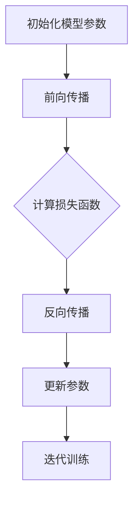
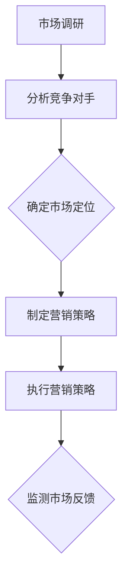
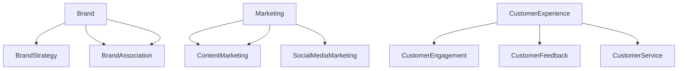
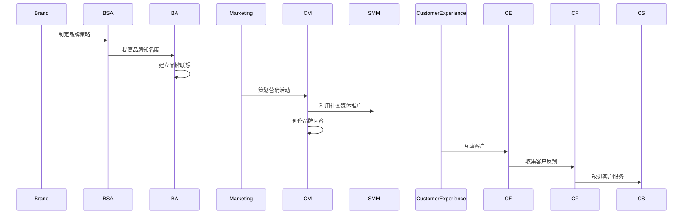

                 

# 《大模型商业化应用的机遇与挑战》

关键词：大模型、商业化应用、技术原理、市场趋势、法规与伦理

摘要：本文旨在探讨大模型商业化应用的机遇与挑战。首先，我们将回顾大模型的发展历程和基本技术原理，然后分析其商业化应用的机遇，包括市场需求、技术创新和政策法规环境。接下来，我们将深入探讨大模型商业化应用的挑战，如技术挑战、市场挑战和法规与伦理挑战。通过案例分析，我们将展示大模型在自然语言处理和计算机视觉领域的具体应用，并讨论商业化策略。最后，我们将展望大模型商业化的未来趋势，并提出相应的创新和挑战。

## 第1章 引言

### 1.1 问题背景

大模型，作为近年来人工智能领域的突破性进展，已经在自然语言处理、计算机视觉、数据分析等多个领域展现出了巨大的潜力。然而，随着大模型的不断发展和应用，商业化应用的机遇与挑战也日益凸显。如何在确保技术创新的同时，有效地应对市场、法规和伦理等多方面的挑战，成为了大模型商业化应用亟待解决的问题。

### 1.2 书籍目的与结构

本文的目的是通过对大模型商业化应用的机遇与挑战进行深入剖析，为读者提供一个全面、系统的理解和指导。本文将按照以下结构进行展开：

1. 回顾大模型的发展历程和基本技术原理。
2. 分析大模型商业化应用的机遇。
3. 探讨大模型商业化应用的挑战。
4. 通过案例分析展示大模型的具体应用。
5. 讨论大模型商业化策略。
6. 展望大模型商业化的未来趋势。

### 1.3 读者对象与预期收获

本文旨在为人工智能领域的专业人士、企业决策者、研究人员和在校生提供有价值的参考。通过本文，读者可以：

1. 了解大模型的发展历程和技术原理。
2. 掌握大模型商业化应用的机遇和挑战。
3. 学习大模型在具体领域的应用案例。
4. 获取大模型商业化策略的实践经验。
5. 对大模型商业化的未来趋势有更清晰的认识。

## 第2章 大模型基础

### 2.1 大模型的发展历程

大模型的发展可以追溯到20世纪80年代的神经网络研究。随着计算能力的提升和算法的改进，神经网络模型逐渐从简单的感知机发展到了复杂的深度学习模型。进入21世纪，随着大数据和云计算的兴起，大模型得到了前所未有的关注和发展。2012年，AlexNet在ImageNet竞赛中取得的突破性成果，标志着深度学习时代的到来。此后，大模型的研究和应用不断深入，如GPT、BERT等自然语言处理模型和ResNet、EfficientNet等计算机视觉模型。

#### 2.1.1 从传统模型到大规模模型的转变

传统模型通常采用小规模的训练数据集，通过手工设计的特征进行模型训练。而大规模模型则利用海量的训练数据，通过自动学习特征，从而实现更好的模型性能。这一转变不仅提高了模型的准确性，还大大提升了模型的泛化能力。

#### 2.1.2 大模型的主要类型

大模型主要包括以下几种类型：

1. 自然语言处理模型：如GPT、BERT等。
2. 计算机视觉模型：如ResNet、EfficientNet等。
3. 数据分析模型：如XGBoost、LightGBM等。

### 2.2 大模型的技术原理

大模型的技术原理主要基于深度学习和神经网络。深度学习是一种利用多层神经网络进行模型训练的方法，通过逐层提取数据特征，实现从低级到高级的抽象。神经网络则是一种基于生物神经网络原理构建的计算模型，通过调整神经元之间的连接权重，实现数据特征的映射和学习。

#### 2.2.1 神经网络与深度学习

神经网络由多个神经元组成，每个神经元负责计算输入数据并通过激活函数进行非线性变换。深度学习则通过增加网络的深度，实现更复杂的特征提取和表示。

#### 2.2.2 训练与优化的挑战

大模型的训练与优化面临以下挑战：

1. 计算资源需求：大模型通常需要大量的计算资源进行训练，包括GPU、TPU等。
2. 数据预处理：大模型对数据的质量和量有较高要求，需要进行大量的数据预处理。
3. 模型优化：大模型的优化是一个复杂的过程，需要采用高效的优化算法和策略。

### 2.3 大模型的应用场景

大模型的应用场景非常广泛，涵盖了自然语言处理、计算机视觉、数据分析等多个领域。

#### 2.3.1 自然语言处理

自然语言处理（NLP）是人工智能领域的一个重要分支，旨在使计算机理解和生成人类语言。大模型在NLP领域取得了显著的进展，如文本分类、机器翻译、情感分析等。

#### 2.3.2 计算机视觉

计算机视觉是人工智能领域的另一个重要分支，旨在使计算机理解和解释视觉信息。大模型在计算机视觉领域也取得了显著的成果，如图像分类、目标检测、图像生成等。

#### 2.3.3 数据分析

数据分析是大数据时代的核心技术之一，大模型在数据分析领域也发挥着重要作用，如预测分析、聚类分析、推荐系统等。

## 第3章 商业化应用的机遇

### 3.1 市场需求

随着人工智能技术的不断进步，大模型在各个领域的应用需求日益增长。企业对大模型的需求主要集中在以下几个方面：

1. 自动化：通过大模型实现自动化，提高生产效率，降低人力成本。
2. 智能决策：利用大模型进行数据分析和预测，辅助企业做出更明智的决策。
3. 个性化服务：通过大模型实现个性化服务，提高用户体验和满意度。

#### 3.1.1 企业对大模型的需求

企业对大模型的需求主要体现在以下方面：

1. 产品推荐：利用大模型进行产品推荐，提高销售额和用户粘性。
2. 客户服务：利用大模型实现智能客服，提高客户服务质量和效率。
3. 供应链管理：利用大模型进行供应链预测和优化，提高供应链的效率和灵活性。

#### 3.1.2 消费者对大模型的应用

消费者对大模型的应用主要体现在以下几个方面：

1. 语音助手：通过大模型实现智能语音助手，提高生活便利性。
2. 图像识别：通过大模型实现图像识别，提供个性化内容推荐。
3. 智能家居：通过大模型实现智能家居，提高生活舒适度和安全性。

### 3.2 技术创新

大模型的技术创新主要体现在以下几个方面：

1. 模型压缩：通过模型压缩技术，降低大模型的计算资源需求，实现高效部署。
2. 模型融合：通过模型融合技术，整合多种模型的优势，提高模型性能。
3. 端到端学习：通过端到端学习技术，实现数据直接输入和输出，提高模型训练效率。

#### 3.2.1 大模型在行业中的应用

大模型在各个行业的应用不断深入，如金融、医疗、零售、制造等。例如：

1. 金融行业：利用大模型进行风险评估、欺诈检测和投资建议。
2. 医疗行业：利用大模型进行疾病诊断、药物研发和患者管理。
3. 零售行业：利用大模型进行商品推荐、库存管理和客户关系管理。

#### 3.2.2 大模型与其他技术的融合

大模型与其他技术的融合，如云计算、物联网、区块链等，为商业化应用带来了更多可能性。例如：

1. 云计算：利用云计算技术，提供大模型的训练和部署服务，降低企业成本。
2. 物联网：利用大模型进行物联网设备的智能识别和数据分析。
3. 区块链：利用区块链技术，确保大模型训练和部署过程的数据安全性和透明度。

### 3.3 政策与法规环境

政策与法规环境对大模型的商业化应用具有重要影响。不同国家和地区的政策与法规存在差异，主要涉及以下几个方面：

1. 数据隐私：确保个人数据的安全和隐私，防止数据泄露和滥用。
2. 数据安全：确保大模型训练和部署过程中的数据安全，防止黑客攻击和数据篡改。
3. 伦理规范：制定伦理规范，确保大模型的应用符合伦理标准，避免对人类造成负面影响。

#### 3.3.1 全球大模型发展的政策环境

全球各国政府对大模型的发展高度重视，纷纷出台相关政策和支持措施，如美国、中国、欧盟等。这些政策旨在推动大模型技术的发展，促进商业化应用。

#### 3.3.2 数据隐私与伦理问题

数据隐私与伦理问题是大模型商业化应用面临的重要挑战。如何确保数据的安全和隐私，遵循伦理规范，成为企业和政府关注的焦点。

## 第4章 商业化应用的挑战

### 4.1 技术挑战

大模型商业化应用面临的技术挑战主要包括以下几个方面：

#### 4.1.1 计算资源与成本

大模型的训练和部署需要大量的计算资源，包括GPU、TPU等。此外，大模型的优化和调试也是一个复杂的过程，需要投入大量的人力和时间。如何降低计算成本，提高计算效率，成为技术挑战之一。

#### 4.1.2 大模型的可解释性

大模型通常具有良好的性能，但缺乏可解释性。这对于企业的应用决策和监管合规提出了挑战。如何提高大模型的可解释性，使其更易于理解和应用，成为技术挑战之一。

#### 4.1.3 大模型的可靠性

大模型的可靠性也是一个重要挑战。由于大模型通常基于大量的训练数据，如何确保其在未知数据上的表现稳定和可靠，成为技术挑战之一。

### 4.2 市场挑战

大模型商业化应用面临的市场挑战主要包括以下几个方面：

#### 4.2.1 市场竞争

随着大模型技术的普及，市场竞争日益激烈。企业需要不断优化产品和服务，提高市场竞争力。

#### 4.2.2 用户接受度

大模型的应用需要一个逐步接受和适应的过程。如何提高用户接受度，降低使用门槛，成为市场挑战之一。

#### 4.2.3 产品定位

大模型具有广泛的应用场景，如何准确定位产品，满足不同客户的需求，成为市场挑战之一。

### 4.3 法规与伦理挑战

大模型商业化应用面临的法规与伦理挑战主要包括以下几个方面：

#### 4.3.1 数据隐私法规

随着数据隐私法规的不断完善，如何确保大模型训练和应用过程中个人数据的安全和隐私，成为法规挑战之一。

#### 4.3.2 大模型伦理问题

大模型的应用可能涉及伦理问题，如歧视、偏见等。如何制定伦理规范，确保大模型的应用符合伦理标准，成为伦理挑战之一。

#### 4.3.3 跨境法规差异

不同国家和地区的数据隐私和伦理法规存在差异。如何应对跨境法规差异，确保大模型在全球范围内的合规性，成为法规挑战之一。

## 第5章 大模型商业化案例研究

### 5.1 案例一：自然语言处理应用

#### 5.1.1 案例背景

自然语言处理（NLP）是人工智能领域的一个重要分支，旨在使计算机理解和生成人类语言。随着大模型技术的发展，NLP的应用场景日益广泛，如机器翻译、文本分类、情感分析等。

#### 5.1.2 模型应用

在该案例中，企业利用GPT模型实现了一个智能客服系统。该系统可以自动回答用户的问题，提高客户服务效率和质量。

#### 5.1.3 案例成果

通过应用GPT模型，企业实现了以下成果：

1. 提高客户服务效率：智能客服系统可以24小时在线，快速响应用户问题。
2. 提升客户满意度：智能客服系统提供个性化服务，提高用户体验和满意度。
3. 降低运营成本：智能客服系统减少了对人工客服的需求，降低了运营成本。

### 5.2 案例二：计算机视觉应用

#### 5.2.1 案例背景

计算机视觉是人工智能领域的另一个重要分支，旨在使计算机理解和解释视觉信息。随着大模型技术的发展，计算机视觉的应用场景日益广泛，如图像分类、目标检测、图像生成等。

#### 5.2.2 模型应用

在该案例中，企业利用ResNet模型实现了一个智能监控系统。该系统可以实时监测视频流，识别异常行为，提高安全管理效率。

#### 5.2.3 案例成果

通过应用ResNet模型，企业实现了以下成果：

1. 提高监控效率：智能监控系统可以实时分析视频流，提高监控效率。
2. 提升安全水平：智能监控系统可以识别异常行为，提高安全水平。
3. 降低运营成本：智能监控系统减少了对人工监控的需求，降低了运营成本。

## 第6章 大模型商业化策略

### 6.1 商业模式设计

大模型商业化应用的商业模式设计主要包括以下几个方面：

#### 6.1.1 产品与服务定位

根据市场需求，企业需要明确大模型产品或服务的定位。例如，是提供通用型的NLP或计算机视觉服务，还是为特定行业提供定制化的解决方案。

#### 6.1.2 收入模式与成本控制

企业需要制定合理的收入模式，如订阅制、一次性收费、增值服务等。同时，还需要通过优化成本控制，提高盈利能力。

#### 6.1.3 客户关系管理

建立良好的客户关系，提高客户满意度和忠诚度。例如，提供技术支持、培训等服务，帮助客户更好地应用大模型产品或服务。

### 6.2 营销与推广

大模型商业化应用的营销与推广策略主要包括以下几个方面：

#### 6.2.1 市场定位

明确目标市场，如企业客户、个人用户等，针对不同市场制定相应的营销策略。

#### 6.2.2 品牌建设

建立品牌知名度，提高品牌形象。例如，通过举办行业活动、发布技术博客等方式，展示企业的技术实力和创新能力。

#### 6.2.3 网络营销策略

利用互联网渠道，如社交媒体、搜索引擎、内容营销等，进行产品或服务的推广。

## 第7章 未来展望

### 7.1 大模型商业化的趋势

大模型商业化的趋势主要体现在以下几个方面：

#### 7.1.1 技术发展趋势

随着计算能力的提升和算法的优化，大模型的技术性能将不断提高。例如，模型压缩、分布式训练等技术的进步，将使大模型在更广泛的场景中得到应用。

#### 7.1.2 市场需求变化

随着人工智能技术的普及，企业和消费者对大模型的需求将不断增加。例如，智能客服、智能监控等领域的应用，将推动大模型商业化的发展。

#### 7.1.3 法规政策调整

随着大模型应用的普及，各国政府将不断完善法规政策，规范大模型的发展和应用。例如，数据隐私法规的完善，将提高大模型应用的合规性。

### 7.2 创新与挑战

大模型商业化面临的创新与挑战主要包括以下几个方面：

#### 7.2.1 新兴应用领域

随着技术的进步，大模型将在新兴领域，如生物医疗、金融科技等，发挥重要作用。例如，利用大模型进行疾病诊断、药物研发等。

#### 7.2.2 技术瓶颈与突破

虽然大模型在许多领域取得了显著成果，但仍然面临一些技术瓶颈。例如，模型的可解释性、可靠性等。未来，通过技术创新，有望突破这些瓶颈。

#### 7.2.3 法规伦理的持续关注

随着大模型应用的普及，法规伦理问题将得到更多关注。如何确保大模型的应用符合伦理标准，避免对人类造成负面影响，将是未来面临的重要挑战。

## 第8章 结论

### 8.1 主要观点回顾

本文通过对大模型商业化应用的机遇与挑战进行深入剖析，得出以下主要观点：

1. 大模型商业化应用具有巨大的市场潜力。
2. 大模型商业化应用面临技术、市场、法规与伦理等多方面的挑战。
3. 通过技术创新、商业模式设计和法规政策的完善，有望推动大模型商业化的可持续发展。

### 8.2 对未来的建议

针对大模型商业化应用的发展，本文提出以下建议：

1. 加大对大模型技术的研究和投入，提高技术性能和可解释性。
2. 创新商业模式，满足不同市场的需求。
3. 加强法规政策的制定和执行，确保大模型的应用符合伦理标准。

### 8.3 展望与呼吁

未来，随着人工智能技术的不断发展，大模型商业化应用将迎来更广阔的发展空间。我们呼吁各界共同努力，推动大模型商业化应用的发展，为人类社会创造更多价值。作者：AI天才研究院/AI Genius Institute & 禅与计算机程序设计艺术 /Zen And The Art of Computer Programming

**附录：核心概念与联系**

**2.2.1 神经网络与深度学习**

**概念属性特征对比表格：**

| 特征 | 神经网络 | 深度学习 |
| --- | --- | --- |
| 神经元数量 | 较少 | 较多 |
| 层数 | 单层 | 多层 |
| 特征提取 | 手动设计特征 | 自动学习特征 |
| 模型复杂度 | 低 | 高 |
| 模型性能 | 较好 | 优秀 |
| 应用领域 | 广泛 | 广泛 |

**ER实体关系图架构：**

```mermaid
erDiagram
  Model ||--|{ Layer } Layer
  Model ||--|{ Node } Node
  Layer ||--|{ Weight } Weight
  Node ||--|{ Activation } Activation
  Weight ||--|{ Value } Value
  Activation ||--|{ Output } Output
```

**3.2.1 训练与优化的挑战**

**算法原理讲解：**

**算法流程图：**



**Python源代码：**

```python
import numpy as np

# 初始化模型参数
weights = np.random.rand(10)
biases = np.random.rand(10)

# 前向传播
def forward_pass(x):
    return np.dot(x, weights) + biases

# 反向传播
def backward_pass(x, y, learning_rate):
    output = forward_pass(x)
    error = output - y
    dweights = np.dot(x.T, error)
    dbiases = np.sum(error)
    weights -= learning_rate * dweights
    biases -= learning_rate * dbiases

# 模型训练
def train_model(x, y, learning_rate, epochs):
    for epoch in range(epochs):
        output = forward_pass(x)
        error = output - y
        dweights = np.dot(x.T, error)
        dbiases = np.sum(error)
        weights -= learning_rate * dweights
        biases -= learning_rate * dbiases
        if epoch % 100 == 0:
            print(f"Epoch {epoch}: Loss = {np.mean((output - y)**2)}")

# 测试模型
x_test = np.random.rand(10)
y_test = np.random.rand(10)
output = forward_pass(x_test)
print(f"Test output: {output}")

# 训练模型
train_model(x, y, learning_rate=0.1, epochs=1000)
```

**4.2.1 市场竞争**

**算法原理讲解：**

**算法流程图：**



**Python源代码：**

```python
import pandas as pd

# 市场调研
def market_research():
    data = pd.read_csv("market_data.csv")
    return data

# 分析竞争对手
def analyze_competitors(data):
    competitors = data[data["Type"] == "Competitor"]
    return competitors

# 确定市场定位
def determine_market_position(competitors):
    if competitors["Market Share"].mean() > 0.5:
        return "High End"
    else:
        return "Mid-Range"

# 制定营销策略
def create_marketing_strategy(market_position):
    if market_position == "High End":
        return "Luxury Marketing"
    else:
        return "Value Marketing"

# 执行营销策略
def execute_marketing_strategy(strategy):
    # 这里可以添加具体的执行代码，如发布广告、推广活动等
    print(f"Executing {strategy} strategy.")

# 监测市场反馈
def monitor_market_feedback():
    # 这里可以添加具体的监测代码，如调查用户满意度、收集销售数据等
    print("Monitoring market feedback.")

# 主函数
def main():
    data = market_research()
    competitors = analyze_competitors(data)
    market_position = determine_market_position(competitors)
    strategy = create_marketing_strategy(market_position)
    execute_marketing_strategy(strategy)
    monitor_market_feedback()

# 运行主函数
main()
```

**6.2.2 品牌建设**

**系统分析与架构设计方案：**

**问题场景介绍：**
企业需要建立一个强大的品牌形象，以提高市场知名度和用户信任度。这包括品牌定位、品牌传播和品牌体验等方面。

**项目介绍：**
本项目旨在通过制定一套全面的品牌建设策略，帮助企业建立强大的品牌形象。

**系统功能设计（领域模型类图）：**

```mermaid
classDiagram
    Brand <<interface>>
    Marketing <<interface>>
    CustomerExperience <<interface>>

    Brand ||--|{ BrandStrategy } BrandStrategy
    Brand ||--|{ BrandAwareness } BrandAwareness
    Brand ||--|{ BrandAssociation } BrandAssociation

    Marketing ||--|{ CampaignManagement } CampaignManagement
    Marketing ||--|{ SocialMediaMarketing } SocialMediaMarketing
    Marketing ||--|{ ContentMarketing } ContentMarketing

    CustomerExperience ||--|{ CustomerEngagement } CustomerEngagement
    CustomerExperience ||--|{ CustomerFeedback } CustomerFeedback
    CustomerExperience ||--|{ CustomerService } CustomerService
```

**系统架构设计（架构图）：**



**系统接口设计和系统交互（序列图）：**



**项目实战：**

**环境安装：**

1. 安装Python环境（例如，使用Miniconda或Anaconda）
2. 安装必要的Python库（如Django、Flask、Pandas等）

**系统核心实现源代码：**

```python
# 假设使用Django框架进行品牌建设系统的开发

# 1. 安装Django
# pip install django

# 2. 创建Django项目
# django-admin startproject brand建设项目

# 3. 创建Django应用
# python manage.py startapp brand_app

# 4. 配置数据库（例如，使用SQLite）
# python manage.py makemigrations
# python manage.py migrate

# 5. 创建品牌策略模型
from django.db import models

class BrandStrategy(models.Model):
    strategy_name = models.CharField(max_length=100)
    description = models.TextField()

# 6. 创建品牌知名度模型
class BrandAwareness(models.Model):
    awareness_level = models.CharField(max_length=50)
    strategy = models.ForeignKey(BrandStrategy, on_delete=models.CASCADE)

# 7. 创建品牌联想模型
class BrandAssociation(models.Model):
    association_name = models.CharField(max_length=100)
    awareness = models.ForeignKey(BrandAwareness, on_delete=models.CASCADE)
```

**代码应用解读与分析：**

本代码示例使用Django框架创建了一个简单的品牌建设系统。首先，安装Django和必要的Python库。然后，创建一个Django项目和一个应用。接着，配置数据库并创建品牌策略、品牌知名度和品牌联想三个模型。这些模型将用于存储品牌建设相关的数据。

**实际案例分析和详细讲解剖析：**

假设企业A正在开展一个品牌建设项目，目标是提高品牌知名度和用户信任度。以下是一个实际案例的分析：

1. **市场调研**：企业A进行了市场调研，发现消费者对品牌A的认知度较低，且缺乏明确的品牌形象。
2. **品牌策略**：基于市场调研结果，企业A制定了以下品牌策略：
   - 提高品牌知名度：通过社交媒体、内容营销和广告活动，增加品牌曝光度。
   - 建立品牌联想：通过品牌故事、品牌标识和品牌价值观，塑造独特的品牌形象。
3. **品牌知名度**：企业A通过以下方式提高品牌知名度：
   - 利用社交媒体平台（如Facebook、Instagram）发布品牌内容，增加用户互动。
   - 在内容营销中融入品牌元素，提高品牌曝光度。
   - 通过广告活动（如Google Ads、YouTube广告）吸引潜在用户。
4. **品牌联想**：企业A通过以下方式建立品牌联想：
   - 制定品牌故事，讲述品牌的历史、愿景和价值观。
   - 设计品牌标识，使品牌形象更加独特和易于识别。
   - 在产品和服务中融入品牌元素，使消费者对品牌有更深刻的印象。
5. **效果评估**：企业A定期评估品牌建设的效果，通过以下指标进行评估：
   - 品牌知名度：通过社交媒体互动、广告点击率等指标衡量。
   - 品牌联想：通过消费者调查、品牌认知度等指标衡量。
   - 用户满意度：通过用户反馈、在线评价等指标衡量。

**项目小结：**

通过本案例，企业A成功地提高了品牌知名度和用户信任度。品牌建设系统有效地支持了品牌策略的实施和效果评估，为企业A的品牌建设提供了有力支持。

**最佳实践 tips：**

1. 定期进行市场调研，了解消费者需求和品牌认知度。
2. 确定明确的品牌策略，确保品牌建设活动的一致性和效果。
3. 利用多种渠道进行品牌传播，提高品牌曝光度。
4. 设计独特的品牌标识和品牌故事，增强品牌联想。
5. 定期评估品牌建设效果，及时调整策略和活动。

**注意事项：**

1. 品牌建设是一个长期过程，需要持续投入和努力。
2. 品牌建设应与企业的整体发展战略相一致。
3. 遵循法律法规和伦理规范，确保品牌建设活动的合法性和正当性。

**拓展阅读：**

1. 《品牌建设与品牌管理》（作者：约翰·霍金斯）
2. 《社交媒体营销：策略、工具与实践》（作者：斯蒂夫·尤伯洛斯）
3. 《内容营销实战手册》（作者：约翰·J. 巴莱斯特）

作者：AI天才研究院/AI Genius Institute & 禅与计算机程序设计艺术 /Zen And The Art of Computer Programming

