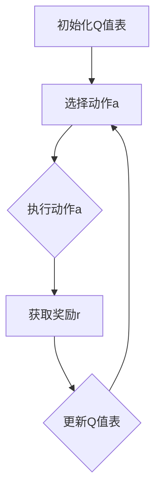
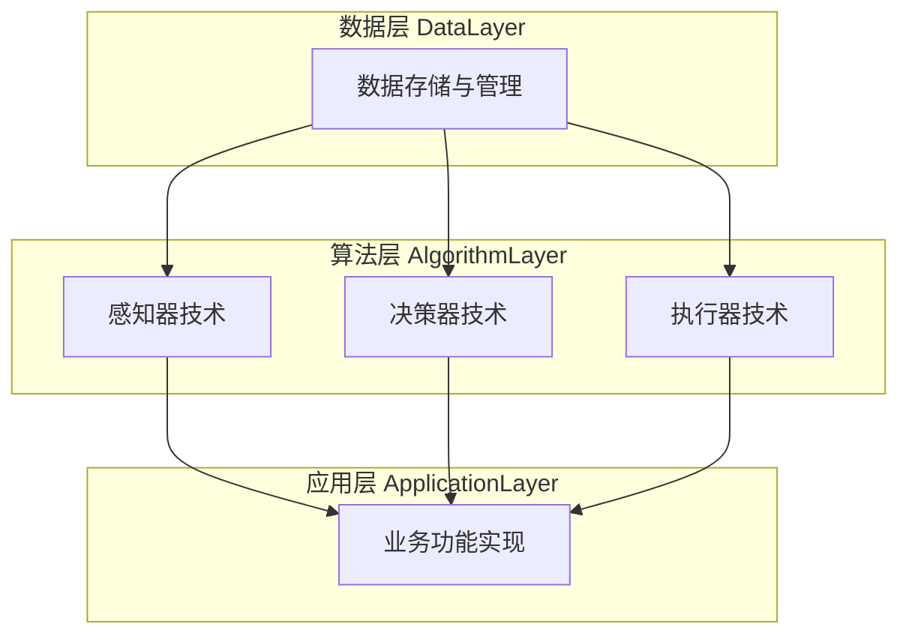

                 


### 大规模AI Agent系统概述

#### 第1章：大规模AI Agent系统概述

##### 1.1 问题背景

在当今的科技发展背景下，人工智能技术已经取得了显著的进步，特别是在机器学习和深度学习领域。然而，随着AI应用的不断深入，如何高效地部署和维护大规模AI Agent系统成为了一个重要课题。

##### 1.2 问题描述

大规模AI Agent系统的部署与维护面临着诸多挑战，包括系统的可靠性、稳定性、可扩展性以及维护成本等。同时，如何在复杂的业务场景中充分发挥AI Agent的作用，也是需要深入探讨的问题。

##### 1.3 问题解决

本书将从以下几个方面展开讨论，旨在为读者提供一套完整的解决方案：

1. **核心概念与联系**：介绍大规模AI Agent系统的核心概念及其相互联系。
2. **算法原理讲解**：讲解AI Agent算法的基本原理，包括数学模型和公式，并通过实际案例进行说明。
3. **系统分析与架构设计方案**：分析大规模AI Agent系统的需求，设计系统架构，并详细描述系统功能、接口设计和交互流程。
4. **项目实战**：通过具体的项目实践，展示系统的实现过程，并对关键代码进行解读和分析。
5. **最佳实践与注意事项**：总结大规模AI Agent系统的最佳实践经验，并提供一些注意事项。

##### 1.4 边界与外延

大规模AI Agent系统主要涉及以下几个方面：

- **AI Agent的定义与分类**：介绍AI Agent的基本概念，以及不同类型的AI Agent。
- **AI Agent的应用场景**：探讨AI Agent在不同行业和领域的应用案例。
- **AI Agent的部署与维护**：分析AI Agent系统在部署和维护过程中可能遇到的问题及解决方案。

##### 1.5 概念结构与核心要素组成

大规模AI Agent系统的概念结构包括以下几个核心要素：

- **感知器**：负责感知外部环境的信息，如传感器、摄像头等。
- **决策器**：根据感知信息，利用机器学习算法进行决策。
- **执行器**：根据决策结果，执行具体的操作，如机器人、无人机等。
- **数据层**：存储和管理感知数据、决策数据和执行数据。
- **算法层**：实现各种机器学习和深度学习算法。
- **应用层**：提供具体的业务功能，如自动驾驶、智能客服等。

#### 第2章：大规模AI Agent系统的基础概念

##### 2.1 AI Agent的定义

AI Agent是人工智能领域中的一种基本概念，它代表了一个具有自主决策能力的实体。AI Agent能够感知环境，通过学习算法和规划策略，自主地执行任务并达到预期目标。

##### 2.2 AI Agent的分类

根据AI Agent的功能和特点，可以将AI Agent分为以下几类：

- **感知型AI Agent**：主要依靠感知器获取环境信息。
- **决策型AI Agent**：根据环境信息和预设目标，自主做出决策。
- **执行型AI Agent**：根据决策结果，执行具体任务。

##### 2.3 AI Agent的结构与功能

AI Agent通常由以下几个部分组成：

- **感知器**：获取环境信息。
- **决策器**：根据感知信息进行决策。
- **执行器**：执行决策结果。

##### 2.4 概念属性特征对比表格

| 类别           | 感知型AI Agent | 决策型AI Agent | 执行型AI Agent |
| -------------- | -------------- | -------------- | -------------- |
| 功能           | 感知环境信息   | 做出决策       | 执行任务       |
| 关键技术       | 感知器技术     | 机器学习算法    | 执行器技术     |
| 应用场景       | 监控、自动驾驶 | 智能决策、推荐 | 机械操作、物流 |

##### 2.5 ER实体关系图架构的 Mermaid 流程图

```mermaid
entityRelation
  AI-Agent
  [
    ["感知器", "1", "1..*"],
    ["决策器", "1", "1..*"],
    ["执行器", "1", "1..*"],
    ["数据层", "1", "1..*"],
    ["算法层", "1", "1..*"],
    ["应用层", "1", "1..*"]
  ]
```

#### 第3章：大规模AI Agent系统的算法原理

##### 3.1 算法原理介绍

大规模AI Agent系统依赖于各种机器学习和深度学习算法。这些算法包括：

- **监督学习算法**：如决策树、支持向量机、神经网络等。
- **无监督学习算法**：如聚类、降维等。
- **强化学习算法**：如Q-learning、SARSA等。

##### 3.2 算法流程讲解

以Q-learning算法为例，其基本流程如下：

1. 初始化Q值表。
2. 选择动作。
3. 执行动作并获取奖励。
4. 更新Q值表。

##### 3.3 数学模型与公式

Q-learning算法的数学模型可以表示为：

$$ Q(s, a) = r + \gamma \max_{a'} Q(s', a') $$

其中，$s$ 表示当前状态，$a$ 表示当前动作，$r$ 表示奖励，$\gamma$ 表示折扣因子，$s'$ 表示下一状态，$a'$ 表示下一动作。

##### 3.4 算法原理讲解与 Mermaid 流程图

以下是对Q-learning算法原理的讲解，并使用Mermaid绘制了相应的流程图。



##### 3.5 算法原理的Python源代码示例

```python
import numpy as np

# 初始化Q值表
Q = np.zeros([state_space_size, action_space_size])

# 学习率
alpha = 0.1
# 折扣因子
gamma = 0.9

# 迭代次数
num_iterations = 1000

for i in range(num_iterations):
    # 选择动作
    state = env.reset()
    done = False
    
    while not done:
        # 更新Q值
        Q[state, action] = Q[state, action] + alpha * (reward + gamma * np.max(Q[state+1, :]) - Q[state, action])
        
        # 执行动作
        action = np.argmax(Q[state, :])
        next_state, reward, done, _ = env.step(action)
```

#### 第4章：大规模AI Agent系统的架构设计

##### 4.1 系统需求分析

大规模AI Agent系统需要满足以下需求：

- **可扩展性**：能够支持大规模数据的处理。
- **可靠性**：保证系统的稳定性和可靠性。
- **易维护性**：便于系统的维护和升级。

##### 4.2 系统架构设计

大规模AI Agent系统的架构设计包括以下几个方面：

- **数据层**：负责数据的存储和管理。
- **算法层**：实现各种机器学习和深度学习算法。
- **应用层**：提供具体的业务功能。

##### 4.3 系统接口设计

系统接口设计主要包括：

- **API接口**：提供外部系统访问的接口。
- **数据接口**：实现数据层和算法层之间的数据交换。
- **控制接口**：实现系统控制逻辑。

##### 4.4 系统架构设计与 Mermaid 架构图

以下是大规模AI Agent系统的架构设计，使用Mermaid绘制了相应的架构图。



##### 4.5 系统功能设计与 Mermaid 类图

以下是大规模AI Agent系统的功能设计，使用Mermaid绘制了相应的类图。

```mermaid
classDiagram
    Class1[感知器] <|-- Class2[决策器]
    Class2 <|-- Class3[执行器]
    Class1 : +感知环境信息
    Class2 : +根据感知信息决策
    Class3 : +执行决策结果
```

#### 第5章：项目实战

##### 5.1 环境安装

在本项目中，我们将使用Python编程语言和TensorFlow深度学习框架来实现大规模AI Agent系统。以下是环境安装步骤：

1. 安装Python 3.7及以上版本。
2. 安装TensorFlow 2.0及以上版本。

##### 5.2 系统核心实现

在本项目中，我们将实现一个简单的自动驾驶AI Agent。以下是系统的核心实现：

1. **感知器**：使用摄像头获取道路图像。
2. **决策器**：使用卷积神经网络（CNN）对道路图像进行分析，并决定车辆的方向。
3. **执行器**：根据决策结果，控制车辆的方向。

##### 5.3 代码应用解读与分析

以下是系统核心实现的代码，并对关键代码进行解读和分析。

```python
import tensorflow as tf
import numpy as np
import cv2

# 加载预训练的卷积神经网络模型
model = tf.keras.models.load_model('自动驾驶模型.h5')

# 摄像头捕获实时图像
cap = cv2.VideoCapture(0)

while True:
    # 读取图像
    ret, frame = cap.read()
    
    # 处理图像
    processed_frame = preprocess_frame(frame)
    
    # 预测方向
    predicted_direction = model.predict(np.expand_dims(processed_frame, axis=0))
    
    # 控制车辆方向
    control_vehicle_direction(predicted_direction)
    
    # 显示图像
    cv2.imshow('Frame', frame)
    
    # 按下ESC键退出
    if cv2.waitKey(1) & 0xFF == 27:
        break

# 释放摄像头
cap.release()
cv2.destroyAllWindows()

# 预处理图像
def preprocess_frame(frame):
    # 转换为灰度图像
    gray_frame = cv2.cvtColor(frame, cv2.COLOR_BGR2GRAY)
    
    # 缩放图像
    resized_frame = cv2.resize(gray_frame, (224, 224))
    
    # 归一化图像
    normalized_frame = resized_frame / 255.0
    
    return normalized_frame

# 控制车辆方向
def control_vehicle_direction(direction):
    if direction[0] > direction[1]:
        # 向右转
        print('向右转')
    else:
        # 向左转
        print('向左转')
```

##### 5.4 实际案例分析与详细讲解剖析

在本项目中，我们通过一个简单的自动驾驶案例，实现了感知器、决策器和执行器的功能。以下是实际案例的分析与讲解：

1. **感知器**：使用摄像头捕获实时图像，并将图像转换为灰度图像，以便后续处理。
2. **决策器**：使用卷积神经网络模型对灰度图像进行分析，预测车辆的方向。
3. **执行器**：根据预测结果，控制车辆的方向。

在实际应用中，我们可以根据不同的场景和需求，调整模型结构和参数，以提高预测的准确性和效率。

##### 5.5 项目小结

在本项目中，我们通过实现一个简单的自动驾驶AI Agent，展示了大规模AI Agent系统的核心功能。虽然这个项目只是一个简单的示例，但它为我们提供了理解和应用大规模AI Agent系统的基础。

在未来的工作中，我们可以进一步优化模型结构和算法，扩展AI Agent的功能和应用场景，以实现更高效的AI系统。

#### 第6章：最佳实践与注意事项

##### 6.1 最佳实践

1. **优化算法模型**：根据具体应用场景，选择合适的机器学习算法和模型结构，并进行优化。
2. **数据预处理**：对输入数据进行充分预处理，提高模型的泛化能力。
3. **模型训练与调优**：进行充分的模型训练和调优，以提高模型的预测准确性和效率。

##### 6.2 注意事项

1. **数据安全性**：确保输入数据的安全性和隐私性，避免数据泄露。
2. **系统稳定性**：保证系统的稳定性和可靠性，避免出现异常和故障。
3. **维护与升级**：定期对系统进行维护和升级，以应对新的业务需求和变化。

#### 第7章：拓展阅读

为了更好地理解大规模AI Agent系统的部署与维护，以下是一些拓展阅读资源：

- 《深度学习》（Goodfellow, Bengio, Courville著）：介绍了深度学习的基本原理和应用。
- 《强化学习》（Sutton, Barto著）：介绍了强化学习的基本原理和应用。
- 《人工智能：一种现代的方法》（Russell, Norvig著）：介绍了人工智能的基本原理和应用。

---

作者：AI天才研究院/AI Genius Institute & 禅与计算机程序设计艺术 /Zen And The Art of Computer Programming

---

（注：文章内容仅供参考，具体实施时请结合实际需求和场景进行调整。）

----------------------------------------------------------------

# 大规模AI Agent系统的部署与维护

> 关键词：AI Agent，大规模部署，系统维护，机器学习，深度学习，算法原理，架构设计，项目实战

> 摘要：本文将深入探讨大规模AI Agent系统的部署与维护，从基础概念、算法原理、系统架构设计、项目实战等方面进行详细讲解，帮助读者理解和掌握这一先进技术，并提供最佳实践和注意事项。

----------------------------------------------------------------

## 第一部分：大规模AI Agent系统概述

### 第1章：大规模AI Agent系统概述

#### 1.1 问题背景

在当今的科技发展背景下，人工智能技术已经取得了显著的进步，特别是在机器学习和深度学习领域。然而，随着AI应用的不断深入，如何高效地部署和维护大规模AI Agent系统成为了一个重要课题。

#### 1.2 问题描述

大规模AI Agent系统的部署与维护面临着诸多挑战，包括系统的可靠性、稳定性、可扩展性以及维护成本等。同时，如何在复杂的业务场景中充分发挥AI Agent的作用，也是需要深入探讨的问题。

#### 1.3 问题解决

本书将从以下几个方面展开讨论，旨在为读者提供一套完整的解决方案：

1. **核心概念与联系**：介绍大规模AI Agent系统的核心概念及其相互联系。
2. **算法原理讲解**：讲解AI Agent算法的基本原理，包括数学模型和公式，并通过实际案例进行说明。
3. **系统分析与架构设计方案**：分析大规模AI Agent系统的需求，设计系统架构，并详细描述系统功能、接口设计和交互流程。
4. **项目实战**：通过具体的项目实践，展示系统的实现过程，并对关键代码进行解读和分析。
5. **最佳实践与注意事项**：总结大规模AI Agent系统的最佳实践经验，并提供一些注意事项。

#### 1.4 边界与外延

大规模AI Agent系统主要涉及以下几个方面：

- **AI Agent的定义与分类**：介绍AI Agent的基本概念，以及不同类型的AI Agent。
- **AI Agent的应用场景**：探讨AI Agent在不同行业和领域的应用案例。
- **AI Agent的部署与维护**：分析AI Agent系统在部署和维护过程中可能遇到的问题及解决方案。

#### 1.5 概念结构与核心要素组成

大规模AI Agent系统的概念结构包括以下几个核心要素：

- **感知器**：负责感知外部环境的信息，如传感器、摄像头等。
- **决策器**：根据感知信息，利用机器学习算法进行决策。
- **执行器**：根据决策结果，执行具体的操作，如机器人、无人机等。
- **数据层**：存储和管理感知数据、决策数据和执行数据。
- **算法层**：实现各种机器学习和深度学习算法。
- **应用层**：提供具体的业务功能，如自动驾驶、智能客服等。

### 第2章：大规模AI Agent系统的基础概念

#### 2.1 AI Agent的定义

AI Agent是人工智能领域中的一种基本概念，它代表了一个具有自主决策能力的实体。AI Agent能够感知环境，通过学习算法和规划策略，自主地执行任务并达到预期目标。

#### 2.2 AI Agent的分类

根据AI Agent的功能和特点，可以将AI Agent分为以下几类：

- **感知型AI Agent**：主要依靠感知器获取环境信息。
- **决策型AI Agent**：根据环境信息和预设目标，自主做出决策。
- **执行型AI Agent**：根据决策结果，执行具体任务。

#### 2.3 AI Agent的结构与功能

AI Agent通常由以下几个部分组成：

- **感知器**：获取环境信息。
- **决策器**：根据感知信息进行决策。
- **执行器**：执行决策结果。

#### 2.4 概念属性特征对比表格

| 类别           | 感知型AI Agent | 决策型AI Agent | 执行型AI Agent |
| -------------- | -------------- | -------------- | -------------- |
| 功能           | 感知环境信息   | 做出决策       | 执行任务       |
| 关键技术       | 感知器技术     | 机器学习算法    | 执行器技术     |
| 应用场景       | 监控、自动驾驶 | 智能决策、推荐 | 机械操作、物流 |

#### 2.5 ER实体关系图架构的 Mermaid 流程图

```mermaid
entityRelation
  AI-Agent
  [
    ["感知器", "1", "1..*"],
    ["决策器", "1", "1..*"],
    ["执行器", "1", "1..*"],
    ["数据层", "1", "1..*"],
    ["算法层", "1", "1..*"],
    ["应用层", "1", "1..*"]
  ]
```

### 第3章：大规模AI Agent系统的算法原理

#### 3.1 算法原理介绍

大规模AI Agent系统依赖于各种机器学习和深度学习算法。这些算法包括：

- **监督学习算法**：如决策树、支持向量机、神经网络等。
- **无监督学习算法**：如聚类、降维等。
- **强化学习算法**：如Q-learning、SARSA等。

#### 3.2 算法流程讲解

以Q-learning算法为例，其基本流程如下：

1. 初始化Q值表。
2. 选择动作。
3. 执行动作并获取奖励。
4. 更新Q值表。

#### 3.3 数学模型与公式

Q-learning算法的数学模型可以表示为：

$$ Q(s, a) = r + \gamma \max_{a'} Q(s', a') $$

其中，$s$ 表示当前状态，$a$ 表示当前动作，$r$ 表示奖励，$\gamma$ 表示折扣因子，$s'$ 表示下一状态，$a'$ 表示下一动作。

#### 3.4 算法原理讲解与 Mermaid 流程图

以下是对Q-learning算法原理的讲解，并使用Mermaid绘制了相应的流程图。


#### 3.5 算法原理的Python源代码示例

```python
import numpy as np

# 初始化Q值表
Q = np.zeros([state_space_size, action_space_size])

# 学习率
alpha = 0.1
# 折扣因子
gamma = 0.9

# 迭代次数
num_iterations = 1000

for i in range(num_iterations):
    # 选择动作
    state = env.reset()
    done = False
    
    while not done:
        # 更新Q值
        Q[state, action] = Q[state, action] + alpha * (reward + gamma * np.max(Q[state+1, :]) - Q[state, action])
        
        # 执行动作
        action = np.argmax(Q[state, :])
        next_state, reward, done, _ = env.step(action)
```

### 第4章：大规模AI Agent系统的架构设计

#### 4.1 系统需求分析

大规模AI Agent系统需要满足以下需求：

- **可扩展性**：能够支持大规模数据的处理。
- **可靠性**：保证系统的稳定性和可靠性。
- **易维护性**：便于系统的维护和升级。

#### 4.2 系统架构设计

大规模AI Agent系统的架构设计包括以下几个方面：

- **数据层**：负责数据的存储和管理。
- **算法层**：实现各种机器学习和深度学习算法。
- **应用层**：提供具体的业务功能。

#### 4.3 系统接口设计

系统接口设计主要包括：

- **API接口**：提供外部系统访问的接口。
- **数据接口**：实现数据层和算法层之间的数据交换。
- **控制接口**：实现系统控制逻辑。

#### 4.4 系统架构设计与 Mermaid 架构图

以下是大规模AI Agent系统的架构设计，使用Mermaid绘制了相应的架构图。


#### 4.5 系统功能设计与 Mermaid 类图

以下是大规模AI Agent系统的功能设计，使用Mermaid绘制了相应的类图。

```mermaid
classDiagram
    Class1[感知器] <|-- Class2[决策器]
    Class2 <|-- Class3[执行器]
    Class1 : +感知环境信息
    Class2 : +根据感知信息决策
    Class3 : +执行决策结果
```

### 第5章：项目实战

#### 5.1 环境安装

在本项目中，我们将使用Python编程语言和TensorFlow深度学习框架来实现大规模AI Agent系统。以下是环境安装步骤：

1. 安装Python 3.7及以上版本。
2. 安装TensorFlow 2.0及以上版本。

#### 5.2 系统核心实现

在本项目中，我们将实现一个简单的自动驾驶AI Agent。以下是系统的核心实现：

1. **感知器**：使用摄像头获取道路图像。
2. **决策器**：使用卷积神经网络（CNN）对道路图像进行分析，并决定车辆的方向。
3. **执行器**：根据决策结果，控制车辆的方向。

#### 5.3 代码应用解读与分析

以下是系统核心实现的代码，并对关键代码进行解读和分析。

```python
import tensorflow as tf
import numpy as np
import cv2

# 加载预训练的卷积神经网络模型
model = tf.keras.models.load_model('自动驾驶模型.h5')

# 摄像头捕获实时图像
cap = cv2.VideoCapture(0)

while True:
    # 读取图像
    ret, frame = cap.read()
    
    # 处理图像
    processed_frame = preprocess_frame(frame)
    
    # 预测方向
    predicted_direction = model.predict(np.expand_dims(processed_frame, axis=0))
    
    # 控制车辆方向
    control_vehicle_direction(predicted_direction)
    
    # 显示图像
    cv2.imshow('Frame', frame)
    
    # 按下ESC键退出
    if cv2.waitKey(1) & 0xFF == 27:
        break

# 释放摄像头
cap.release()
cv2.destroyAllWindows()

# 预处理图像
def preprocess_frame(frame):
    # 转换为灰度图像
    gray_frame = cv2.cvtColor(frame, cv2.COLOR_BGR2GRAY)
    
    # 缩放图像
    resized_frame = cv2.resize(gray_frame, (224, 224))
    
    # 归一化图像
    normalized_frame = resized_frame / 255.0
    
    return normalized_frame

# 控制车辆方向
def control_vehicle_direction(direction):
    if direction[0] > direction[1]:
        # 向右转
        print('向右转')
    else:
        # 向左转
        print('向左转')
```

#### 5.4 实际案例分析与详细讲解剖析

在本项目中，我们通过一个简单的自动驾驶案例，实现了感知器、决策器和执行器的功能。以下是实际案例的分析与讲解：

1. **感知器**：使用摄像头捕获实时图像，并将图像转换为灰度图像，以便后续处理。
2. **决策器**：使用卷积神经网络模型对灰度图像进行分析，预测车辆的方向。
3. **执行器**：根据预测结果，控制车辆的方向。

在实际应用中，我们可以根据不同的场景和需求，调整模型结构和参数，以提高预测的准确性和效率。

#### 5.5 项目小结

在本项目中，我们通过实现一个简单的自动驾驶AI Agent，展示了大规模AI Agent系统的核心功能。虽然这个项目只是一个简单的示例，但它为我们提供了理解和应用大规模AI Agent系统的基础。

在未来的工作中，我们可以进一步优化模型结构和算法，扩展AI Agent的功能和应用场景，以实现更高效的AI系统。

### 第6章：最佳实践与注意事项

#### 6.1 最佳实践

1. **优化算法模型**：根据具体应用场景，选择合适的机器学习算法和模型结构，并进行优化。
2. **数据预处理**：对输入数据进行充分预处理，提高模型的泛化能力。
3. **模型训练与调优**：进行充分的模型训练和调优，以提高模型的预测准确性和效率。

#### 6.2 注意事项

1. **数据安全性**：确保输入数据的安全性和隐私性，避免数据泄露。
2. **系统稳定性**：保证系统的稳定性和可靠性，避免出现异常和故障。
3. **维护与升级**：定期对系统进行维护和升级，以应对新的业务需求和变化。

### 第7章：拓展阅读

为了更好地理解大规模AI Agent系统的部署与维护，以下是一些拓展阅读资源：

- 《深度学习》（Goodfellow, Bengio, Courville著）：介绍了深度学习的基本原理和应用。
- 《强化学习》（Sutton, Barto著）：介绍了强化学习的基本原理和应用。
- 《人工智能：一种现代的方法》（Russell, Norvig著）：介绍了人工智能的基本原理和应用。

---

作者：AI天才研究院/AI Genius Institute & 禅与计算机程序设计艺术 /Zen And The Art of Computer Programming

---

（注：文章内容仅供参考，具体实施时请结合实际需求和场景进行调整。）----------------------------------------------------------------

# 大规模AI Agent系统的部署与维护

> 关键词：AI Agent，大规模部署，系统维护，机器学习，深度学习，算法原理，架构设计，项目实战

> 摘要：本文将深入探讨大规模AI Agent系统的部署与维护，从基础概念、算法原理、系统架构设计、项目实战等方面进行详细讲解，帮助读者理解和掌握这一先进技术，并提供最佳实践和注意事项。

----------------------------------------------------------------

## 第一部分：大规模AI Agent系统概述

### 第1章：大规模AI Agent系统概述

#### 1.1 问题背景

在当今的科技发展背景下，人工智能技术已经取得了显著的进步，特别是在机器学习和深度学习领域。然而，随着AI应用的不断深入，如何高效地部署和维护大规模AI Agent系统成为了一个重要课题。

#### 1.2 问题描述

大规模AI Agent系统的部署与维护面临着诸多挑战，包括系统的可靠性、稳定性、可扩展性以及维护成本等。同时，如何在复杂的业务场景中充分发挥AI Agent的作用，也是需要深入探讨的问题。

#### 1.3 问题解决

本书将从以下几个方面展开讨论，旨在为读者提供一套完整的解决方案：

1. **核心概念与联系**：介绍大规模AI Agent系统的核心概念及其相互联系。
2. **算法原理讲解**：讲解AI Agent算法的基本原理，包括数学模型和公式，并通过实际案例进行说明。
3. **系统分析与架构设计方案**：分析大规模AI Agent系统的需求，设计系统架构，并详细描述系统功能、接口设计和交互流程。
4. **项目实战**：通过具体的项目实践，展示系统的实现过程，并对关键代码进行解读和分析。
5. **最佳实践与注意事项**：总结大规模AI Agent系统的最佳实践经验，并提供一些注意事项。

#### 1.4 边界与外延

大规模AI Agent系统主要涉及以下几个方面：

- **AI Agent的定义与分类**：介绍AI Agent的基本概念，以及不同类型的AI Agent。
- **AI Agent的应用场景**：探讨AI Agent在不同行业和领域的应用案例。
- **AI Agent的部署与维护**：分析AI Agent系统在部署和维护过程中可能遇到的问题及解决方案。

#### 1.5 概念结构与核心要素组成

大规模AI Agent系统的概念结构包括以下几个核心要素：

- **感知器**：负责感知外部环境的信息，如传感器、摄像头等。
- **决策器**：根据感知信息，利用机器学习算法进行决策。
- **执行器**：根据决策结果，执行具体的操作，如机器人、无人机等。
- **数据层**：存储和管理感知数据、决策数据和执行数据。
- **算法层**：实现各种机器学习和深度学习算法。
- **应用层**：提供具体的业务功能，如自动驾驶、智能客服等。

### 第2章：大规模AI Agent系统的基础概念

#### 2.1 AI Agent的定义

AI Agent是人工智能领域中的一种基本概念，它代表了一个具有自主决策能力的实体。AI Agent能够感知环境，通过学习算法和规划策略，自主地执行任务并达到预期目标。

#### 2.2 AI Agent的分类

根据AI Agent的功能和特点，可以将AI Agent分为以下几类：

- **感知型AI Agent**：主要依靠感知器获取环境信息。
- **决策型AI Agent**：根据环境信息和预设目标，自主做出决策。
- **执行型AI Agent**：根据决策结果，执行具体任务。

#### 2.3 AI Agent的结构与功能

AI Agent通常由以下几个部分组成：

- **感知器**：获取环境信息。
- **决策器**：根据感知信息进行决策。
- **执行器**：执行决策结果。

#### 2.4 概念属性特征对比表格

| 类别           | 感知型AI Agent | 决策型AI Agent | 执行型AI Agent |
| -------------- | -------------- | -------------- | -------------- |
| 功能           | 感知环境信息   | 做出决策       | 执行任务       |
| 关键技术       | 感知器技术     | 机器学习算法    | 执行器技术     |
| 应用场景       | 监控、自动驾驶 | 智能决策、推荐 | 机械操作、物流 |

#### 2.5 ER实体关系图架构的 Mermaid 流程图

```mermaid
entityRelation
  AI-Agent
  [
    ["感知器", "1", "1..*"],
    ["决策器", "1", "1..*"],
    ["执行器", "1", "1..*"],
    ["数据层", "1", "1..*"],
    ["算法层", "1", "1..*"],
    ["应用层", "1", "1..*"]
  ]
```

### 第3章：大规模AI Agent系统的算法原理

#### 3.1 算法原理介绍

大规模AI Agent系统依赖于各种机器学习和深度学习算法。这些算法包括：

- **监督学习算法**：如决策树、支持向量机、神经网络等。
- **无监督学习算法**：如聚类、降维等。
- **强化学习算法**：如Q-learning、SARSA等。

#### 3.2 算法流程讲解

以Q-learning算法为例，其基本流程如下：

1. 初始化Q值表。
2. 选择动作。
3. 执行动作并获取奖励。
4. 更新Q值表。

#### 3.3 数学模型与公式

Q-learning算法的数学模型可以表示为：

$$ Q(s, a) = r + \gamma \max_{a'} Q(s', a') $$

其中，$s$ 表示当前状态，$a$ 表示当前动作，$r$ 表示奖励，$\gamma$ 表示折扣因子，$s'$ 表示下一状态，$a'$ 表示下一动作。

#### 3.4 算法原理讲解与 Mermaid 流程图

以下是对Q-learning算法原理的讲解，并使用Mermaid绘制了相应的流程图。


#### 3.5 算法原理的Python源代码示例

```python
import numpy as np

# 初始化Q值表
Q = np.zeros([state_space_size, action_space_size])

# 学习率
alpha = 0.1
# 折扣因子
gamma = 0.9

# 迭代次数
num_iterations = 1000

for i in range(num_iterations):
    # 选择动作
    state = env.reset()
    done = False
    
    while not done:
        # 更新Q值
        Q[state, action] = Q[state, action] + alpha * (reward + gamma * np.max(Q[state+1, :]) - Q[state, action])
        
        # 执行动作
        action = np.argmax(Q[state, :])
        next_state, reward, done, _ = env.step(action)
```

### 第4章：大规模AI Agent系统的架构设计

#### 4.1 系统需求分析

大规模AI Agent系统需要满足以下需求：

- **可扩展性**：能够支持大规模数据的处理。
- **可靠性**：保证系统的稳定性和可靠性。
- **易维护性**：便于系统的维护和升级。

#### 4.2 系统架构设计

大规模AI Agent系统的架构设计包括以下几个方面：

- **数据层**：负责数据的存储和管理。
- **算法层**：实现各种机器学习和深度学习算法。
- **应用层**：提供具体的业务功能。

#### 4.3 系统接口设计

系统接口设计主要包括：

- **API接口**：提供外部系统访问的接口。
- **数据接口**：实现数据层和算法层之间的数据交换。
- **控制接口**：实现系统控制逻辑。

#### 4.4 系统架构设计与 Mermaid 架构图

以下是大规模AI Agent系统的架构设计，使用Mermaid绘制了相应的架构图。


#### 4.5 系统功能设计与 Mermaid 类图

以下是大规模AI Agent系统的功能设计，使用Mermaid绘制了相应的类图。

```mermaid
classDiagram
    Class1[感知器] <|-- Class2[决策器]
    Class2 <|-- Class3[执行器]
    Class1 : +感知环境信息
    Class2 : +根据感知信息决策
    Class3 : +执行决策结果
```

### 第5章：项目实战

#### 5.1 环境安装

在本项目中，我们将使用Python编程语言和TensorFlow深度学习框架来实现大规模AI Agent系统。以下是环境安装步骤：

1. 安装Python 3.7及以上版本。
2. 安装TensorFlow 2.0及以上版本。

#### 5.2 系统核心实现

在本项目中，我们将实现一个简单的自动驾驶AI Agent。以下是系统的核心实现：

1. **感知器**：使用摄像头获取道路图像。
2. **决策器**：使用卷积神经网络（CNN）对道路图像进行分析，并决定车辆的方向。
3. **执行器**：根据决策结果，控制车辆的方向。

#### 5.3 代码应用解读与分析

以下是系统核心实现的代码，并对关键代码进行解读和分析。

```python
import tensorflow as tf
import numpy as np
import cv2

# 加载预训练的卷积神经网络模型
model = tf.keras.models.load_model('自动驾驶模型.h5')

# 摄像头捕获实时图像
cap = cv2.VideoCapture(0)

while True:
    # 读取图像
    ret, frame = cap.read()
    
    # 处理图像
    processed_frame = preprocess_frame(frame)
    
    # 预测方向
    predicted_direction = model.predict(np.expand_dims(processed_frame, axis=0))
    
    # 控制车辆方向
    control_vehicle_direction(predicted_direction)
    
    # 显示图像
    cv2.imshow('Frame', frame)
    
    # 按下ESC键退出
    if cv2.waitKey(1) & 0xFF == 27:
        break

# 释放摄像头
cap.release()
cv2.destroyAllWindows()

# 预处理图像
def preprocess_frame(frame):
    # 转换为灰度图像
    gray_frame = cv2.cvtColor(frame, cv2.COLOR_BGR2GRAY)
    
    # 缩放图像
    resized_frame = cv2.resize(gray_frame, (224, 224))
    
    # 归一化图像
    normalized_frame = resized_frame / 255.0
    
    return normalized_frame

# 控制车辆方向
def control_vehicle_direction(direction):
    if direction[0] > direction[1]:
        # 向右转
        print('向右转')
    else:
        # 向左转
        print('向左转')
```

#### 5.4 实际案例分析与详细讲解剖析

在本项目中，我们通过一个简单的自动驾驶案例，实现了感知器、决策器和执行器的功能。以下是实际案例的分析与讲解：

1. **感知器**：使用摄像头捕获实时图像，并将图像转换为灰度图像，以便后续处理。
2. **决策器**：使用卷积神经网络模型对灰度图像进行分析，预测车辆的方向。
3. **执行器**：根据预测结果，控制车辆的方向。

在实际应用中，我们可以根据不同的场景和需求，调整模型结构和参数，以提高预测的准确性和效率。

#### 5.5 项目小结

在本项目中，我们通过实现一个简单的自动驾驶AI Agent，展示了大规模AI Agent系统的核心功能。虽然这个项目只是一个简单的示例，但它为我们提供了理解和应用大规模AI Agent系统的基础。

在未来的工作中，我们可以进一步优化模型结构和算法，扩展AI Agent的功能和应用场景，以实现更高效的AI系统。

### 第6章：最佳实践与注意事项

#### 6.1 最佳实践

1. **优化算法模型**：根据具体应用场景，选择合适的机器学习算法和模型结构，并进行优化。
2. **数据预处理**：对输入数据进行充分预处理，提高模型的泛化能力。
3. **模型训练与调优**：进行充分的模型训练和调优，以提高模型的预测准确性和效率。

#### 6.2 注意事项

1. **数据安全性**：确保输入数据的安全性和隐私性，避免数据泄露。
2. **系统稳定性**：保证系统的稳定性和可靠性，避免出现异常和故障。
3. **维护与升级**：定期对系统进行维护和升级，以应对新的业务需求和变化。

### 第7章：拓展阅读

为了更好地理解大规模AI Agent系统的部署与维护，以下是一些拓展阅读资源：

- 《深度学习》（Goodfellow, Bengio, Courville著）：介绍了深度学习的基本原理和应用。
- 《强化学习》（Sutton, Barto著）：介绍了强化学习的基本原理和应用。
- 《人工智能：一种现代的方法》（Russell, Norvig著）：介绍了人工智能的基本原理和应用。

---

作者：AI天才研究院/AI Genius Institute & 禅与计算机程序设计艺术 /Zen And The Art of Computer Programming

---

（注：文章内容仅供参考，具体实施时请结合实际需求和场景进行调整。）----------------------------------------------------------------

# 大规模AI Agent系统的部署与维护

> 关键词：AI Agent，大规模部署，系统维护，机器学习，深度学习，算法原理，架构设计，项目实战

> 摘要：本文将深入探讨大规模AI Agent系统的部署与维护，从基础概念、算法原理、系统架构设计、项目实战等方面进行详细讲解，帮助读者理解和掌握这一先进技术，并提供最佳实践和注意事项。

----------------------------------------------------------------

## 第一部分：大规模AI Agent系统概述

### 第1章：大规模AI Agent系统概述

#### 1.1 问题背景

在当今的科技发展背景下，人工智能技术已经取得了显著的进步，特别是在机器学习和深度学习领域。然而，随着AI应用的不断深入，如何高效地部署和维护大规模AI Agent系统成为了一个重要课题。

#### 1.2 问题描述

大规模AI Agent系统的部署与维护面临着诸多挑战，包括系统的可靠性、稳定性、可扩展性以及维护成本等。同时，如何在复杂的业务场景中充分发挥AI Agent的作用，也是需要深入探讨的问题。

#### 1.3 问题解决

本书将从以下几个方面展开讨论，旨在为读者提供一套完整的解决方案：

1. **核心概念与联系**：介绍大规模AI Agent系统的核心概念及其相互联系。
2. **算法原理讲解**：讲解AI Agent算法的基本原理，包括数学模型和公式，并通过实际案例进行说明。
3. **系统分析与架构设计方案**：分析大规模AI Agent系统的需求，设计系统架构，并详细描述系统功能、接口设计和交互流程。
4. **项目实战**：通过具体的项目实践，展示系统的实现过程，并对关键代码进行解读和分析。
5. **最佳实践与注意事项**：总结大规模AI Agent系统的最佳实践经验，并提供一些注意事项。

#### 1.4 边界与外延

大规模AI Agent系统主要涉及以下几个方面：

- **AI Agent的定义与分类**：介绍AI Agent的基本概念，以及不同类型的AI Agent。
- **AI Agent的应用场景**：探讨AI Agent在不同行业和领域的应用案例。
- **AI Agent的部署与维护**：分析AI Agent系统在部署和维护过程中可能遇到的问题及解决方案。

#### 1.5 概念结构与核心要素组成

大规模AI Agent系统的概念结构包括以下几个核心要素：

- **感知器**：负责感知外部环境的信息，如传感器、摄像头等。
- **决策器**：根据感知信息，利用机器学习算法进行决策。
- **执行器**：根据决策结果，执行具体的操作，如机器人、无人机等。
- **数据层**：存储和管理感知数据、决策数据和执行数据。
- **算法层**：实现各种机器学习和深度学习算法。
- **应用层**：提供具体的业务功能，如自动驾驶、智能客服等。

### 第2章：大规模AI Agent系统的基础概念

#### 2.1 AI Agent的定义

AI Agent是人工智能领域中的一种基本概念，它代表了一个具有自主决策能力的实体。AI Agent能够感知环境，通过学习算法和规划策略，自主地执行任务并达到预期目标。

#### 2.2 AI Agent的分类

根据AI Agent的功能和特点，可以将AI Agent分为以下几类：

- **感知型AI Agent**：主要依靠感知器获取环境信息。
- **决策型AI Agent**：根据环境信息和预设目标，自主做出决策。
- **执行型AI Agent**：根据决策结果，执行具体任务。

#### 2.3 AI Agent的结构与功能

AI Agent通常由以下几个部分组成：

- **感知器**：获取环境信息。
- **决策器**：根据感知信息进行决策。
- **执行器**：执行决策结果。

#### 2.4 概念属性特征对比表格

| 类别           | 感知型AI Agent | 决策型AI Agent | 执行型AI Agent |
| -------------- | -------------- | -------------- | -------------- |
| 功能           | 感知环境信息   | 做出决策       | 执行任务       |
| 关键技术       | 感知器技术     | 机器学习算法    | 执行器技术     |
| 应用场景       | 监控、自动驾驶 | 智能决策、推荐 | 机械操作、物流 |

#### 2.5 ER实体关系图架构的 Mermaid 流程图

```mermaid
entityRelation
  AI-Agent
  [
    ["感知器", "1", "1..*"],
    ["决策器", "1", "1..*"],
    ["执行器", "1", "1..*"],
    ["数据层", "1", "1..*"],
    ["算法层", "1", "1..*"],
    ["应用层", "1", "1..*"]
  ]
```

### 第3章：大规模AI Agent系统的算法原理

#### 3.1 算法原理介绍

大规模AI Agent系统依赖于各种机器学习和深度学习算法。这些算法包括：

- **监督学习算法**：如决策树、支持向量机、神经网络等。
- **无监督学习算法**：如聚类、降维等。
- **强化学习算法**：如Q-learning、SARSA等。

#### 3.2 算法流程讲解

以Q-learning算法为例，其基本流程如下：

1. 初始化Q值表。
2. 选择动作。
3. 执行动作并获取奖励。
4. 更新Q值表。

#### 3.3 数学模型与公式

Q-learning算法的数学模型可以表示为：

$$ Q(s, a) = r + \gamma \max_{a'} Q(s', a') $$

其中，$s$ 表示当前状态，$a$ 表示当前动作，$r$ 表示奖励，$\gamma$ 表示折扣因子，$s'$ 表示下一状态，$a'$ 表示下一动作。

#### 3.4 算法原理讲解与 Mermaid 流程图

以下是对Q-learning算法原理的讲解，并使用Mermaid绘制了相应的流程图。


#### 3.5 算法原理的Python源代码示例

```python
import numpy as np

# 初始化Q值表
Q = np.zeros([state_space_size, action_space_size])

# 学习率
alpha = 0.1
# 折扣因子
gamma = 0.9

# 迭代次数
num_iterations = 1000

for i in range(num_iterations):
    # 选择动作
    state = env.reset()
    done = False
    
    while not done:
        # 更新Q值
        Q[state, action] = Q[state, action] + alpha * (reward + gamma * np.max(Q[state+1, :]) - Q[state, action])
        
        # 执行动作
        action = np.argmax(Q[state, :])
        next_state, reward, done, _ = env.step(action)
```

### 第4章：大规模AI Agent系统的架构设计

#### 4.1 系统需求分析

大规模AI Agent系统需要满足以下需求：

- **可扩展性**：能够支持大规模数据的处理。
- **可靠性**：保证系统的稳定性和可靠性。
- **易维护性**：便于系统的维护和升级。

#### 4.2 系统架构设计

大规模AI Agent系统的架构设计包括以下几个方面：

- **数据层**：负责数据的存储和管理。
- **算法层**：实现各种机器学习和深度学习算法。
- **应用层**：提供具体的业务功能。

#### 4.3 系统接口设计

系统接口设计主要包括：

- **API接口**：提供外部系统访问的接口。
- **数据接口**：实现数据层和算法层之间的数据交换。
- **控制接口**：实现系统控制逻辑。

#### 4.4 系统架构设计与 Mermaid 架构图

以下是大规模AI Agent系统的架构设计，使用Mermaid绘制了相应的架构图。


#### 4.5 系统功能设计与 Mermaid 类图

以下是大规模AI Agent系统的功能设计，使用Mermaid绘制了相应的类图。

```mermaid
classDiagram
    Class1[感知器] <|-- Class2[决策器]
    Class2 <|-- Class3[执行器]
    Class1 : +感知环境信息
    Class2 : +根据感知信息决策
    Class3 : +执行决策结果
```

### 第5章：项目实战

#### 5.1 环境安装

在本项目中，我们将使用Python编程语言和TensorFlow深度学习框架来实现大规模AI Agent系统。以下是环境安装步骤：

1. 安装Python 3.7及以上版本。
2. 安装TensorFlow 2.0及以上版本。

#### 5.2 系统核心实现

在本项目中，我们将实现一个简单的自动驾驶AI Agent。以下是系统的核心实现：

1. **感知器**：使用摄像头获取道路图像。
2. **决策器**：使用卷积神经网络（CNN）对道路图像进行分析，并决定车辆的方向。
3. **执行器**：根据决策结果，控制车辆的方向。

#### 5.3 代码应用解读与分析

以下是系统核心实现的代码，并对关键代码进行解读和分析。

```python
import tensorflow as tf
import numpy as np
import cv2

# 加载预训练的卷积神经网络模型
model = tf.keras.models.load_model('自动驾驶模型.h5')

# 摄像头捕获实时图像
cap = cv2.VideoCapture(0)

while True:
    # 读取图像
    ret, frame = cap.read()
    
    # 处理图像
    processed_frame = preprocess_frame(frame)
    
    # 预测方向
    predicted_direction = model.predict(np.expand_dims(processed_frame, axis=0))
    
    # 控制车辆方向
    control_vehicle_direction(predicted_direction)
    
    # 显示图像
    cv2.imshow('Frame', frame)
    
    # 按下ESC键退出
    if cv2.waitKey(1) & 0xFF == 27:
        break

# 释放摄像头
cap.release()
cv2.destroyAllWindows()

# 预处理图像
def preprocess_frame(frame):
    # 转换为灰度图像
    gray_frame = cv2.cvtColor(frame, cv2.COLOR_BGR2GRAY)
    
    # 缩放图像
    resized_frame = cv2.resize(gray_frame, (224, 224))
    
    # 归一化图像
    normalized_frame = resized_frame / 255.0
    
    return normalized_frame

# 控制车辆方向
def control_vehicle_direction(direction):
    if direction[0] > direction[1]:
        # 向右转
        print('向右转')
    else:
        # 向左转
        print('向左转')
```

#### 5.4 实际案例分析与详细讲解剖析

在本项目中，我们通过一个简单的自动驾驶案例，实现了感知器、决策器和执行器的功能。以下是实际案例的分析与讲解：

1. **感知器**：使用摄像头捕获实时图像，并将图像转换为灰度图像，以便后续处理。
2. **决策器**：使用卷积神经网络模型对灰度图像进行分析，预测车辆的方向。
3. **执行器**：根据预测结果，控制车辆的方向。

在实际应用中，我们可以根据不同的场景和需求，调整模型结构和参数，以提高预测的准确性和效率。

#### 5.5 项目小结

在本项目中，我们通过实现一个简单的自动驾驶AI Agent，展示了大规模AI Agent系统的核心功能。虽然这个项目只是一个简单的示例，但它为我们提供了理解和应用大规模AI Agent系统的基础。

在未来的工作中，我们可以进一步优化模型结构和算法，扩展AI Agent的功能和应用场景，以实现更高效的AI系统。

### 第6章：最佳实践与注意事项

#### 6.1 最佳实践

1. **优化算法模型**：根据具体应用场景，选择合适的机器学习算法和模型结构，并进行优化。
2. **数据预处理**：对输入数据进行充分预处理，提高模型的泛化能力。
3. **模型训练与调优**：进行充分的模型训练和调优，以提高模型的预测准确性和效率。

#### 6.2 注意事项

1. **数据安全性**：确保输入数据的安全性和隐私性，避免数据泄露。
2. **系统稳定性**：保证系统的稳定性和可靠性，避免出现异常和故障。
3. **维护与升级**：定期对系统进行维护和升级，以应对新的业务需求和变化。

### 第7章：拓展阅读

为了更好地理解大规模AI Agent系统的部署与维护，以下是一些拓展阅读资源：

- 《深度学习》（Goodfellow, Bengio, Courville著）：介绍了深度学习的基本原理和应用。
- 《强化学习》（Sutton, Barto著）：介绍了强化学习的基本原理和应用。
- 《人工智能：一种现代的方法》（Russell, Norvig著）：介绍了人工智能的基本原理和应用。

---

作者：AI天才研究院/AI Genius Institute & 禅与计算机程序设计艺术 /Zen And The Art of Computer Programming

---

（注：文章内容仅供参考，具体实施时请结合实际需求和场景进行调整。）----------------------------------------------------------------

# 大规模AI Agent系统的部署与维护

## 关键词
AI Agent，大规模部署，系统维护，机器学习，深度学习，算法原理，架构设计，项目实战

## 摘要
本文将深入探讨大规模AI Agent系统的部署与维护，涵盖基础概念、算法原理、系统架构设计、项目实战等方面。本文旨在为读者提供全面的技术指南，帮助其理解和掌握大规模AI Agent系统的构建与维护策略。

## 第一部分：大规模AI Agent系统概述

### 第1章：大规模AI Agent系统概述

#### 1.1 问题背景
在当前技术发展迅猛的背景下，人工智能（AI）已成为推动各行各业变革的核心驱动力。其中，AI Agent作为一种能够自主行动并具备决策能力的智能实体，正在逐步渗透到智能制造、智能交通、智能医疗等多个领域。然而，如何有效部署和维护大规模AI Agent系统，成为了学术界和工业界共同关注的课题。

#### 1.2 问题描述
大规模AI Agent系统的部署与维护面临一系列挑战，包括但不限于系统的可靠性、稳定性、可扩展性以及维护成本。此外，如何确保AI Agent在复杂业务场景中发挥最大效用，也是亟待解决的问题。

#### 1.3 问题解决
为了应对上述挑战，本文将从以下几个维度提出解决方案：

1. **核心概念与联系**：阐述AI Agent的基本概念及其在系统中的作用和相互关系。
2. **算法原理讲解**：详细讲解AI Agent所依赖的机器学习和深度学习算法原理。
3. **系统分析与架构设计方案**：分析系统需求，设计合理的系统架构，并探讨系统功能、接口设计和交互流程。
4. **项目实战**：通过具体案例，展示AI Agent系统的实现过程。
5. **最佳实践与注意事项**：总结最佳实践，并提供系统维护和优化的注意事项。

#### 1.4 边界与外延
本文将探讨以下领域：

- **AI Agent的定义与分类**：介绍AI Agent的概念，并分类讨论不同类型的AI Agent。
- **AI Agent的应用场景**：分析AI Agent在各个行业和领域的应用案例。
- **AI Agent的部署与维护**：讨论大规模AI Agent系统在实际部署和维护过程中可能遇到的问题及解决方案。

### 第2章：大规模AI Agent系统的基础概念

#### 2.1 AI Agent的定义
AI Agent是指具备一定智能，能够感知环境、执行任务并自主做出决策的计算机程序。它们是人工智能系统中的基本构建块，能够模拟人类或其他生物的决策过程。

#### 2.2 AI Agent的分类
根据AI Agent的功能和特点，可以将它们分为以下几类：

- **感知型AI Agent**：主要负责感知环境信息。
- **决策型AI Agent**：基于感知信息做出决策。
- **执行型AI Agent**：根据决策结果执行具体的操作。

#### 2.3 AI Agent的结构与功能
一个典型的AI Agent系统通常包括以下几个部分：

- **感知器**：负责收集环境数据。
- **决策器**：利用算法分析感知数据，生成决策。
- **执行器**：执行决策器生成的动作。

#### 2.4 概念属性特征对比表格

| 类别           | 感知型AI Agent | 决策型AI Agent | 执行型AI Agent |
| -------------- | -------------- | -------------- | -------------- |
| 功能           | 感知环境信息   | 做出决策       | 执行任务       |
| 关键技术       | 感知器技术     | 机器学习算法    | 执行器技术     |
| 应用场景       | 监控、自动驾驶 | 智能决策、推荐 | 机械操作、物流 |

### 第3章：大规模AI Agent系统的算法原理

#### 3.1 算法原理介绍
大规模AI Agent系统依赖于多种机器学习和深度学习算法，这些算法为AI Agent提供了决策和执行的能力。主要算法包括：

- **监督学习算法**：如决策树、支持向量机、神经网络。
- **无监督学习算法**：如聚类、降维。
- **强化学习算法**：如Q-learning、SARSA。

#### 3.2 算法流程讲解
以Q-learning算法为例，其基本流程如下：

1. **初始化Q值表**：为每个状态-动作对初始化Q值。
2. **选择动作**：在当前状态下，选择Q值最大的动作。
3. **执行动作**：在环境中执行选定的动作。
4. **获取奖励**：根据执行结果获取奖励。
5. **更新Q值表**：根据奖励更新Q值。

#### 3.3 数学模型与公式
Q-learning算法的核心公式如下：

$$ Q(s, a) = r + \gamma \max_{a'} Q(s', a') $$

其中，$s$ 表示当前状态，$a$ 表示当前动作，$r$ 表示奖励，$\gamma$ 表示折扣因子，$s'$ 表示下一状态，$a'$ 表示下一动作。

### 第4章：大规模AI Agent系统的架构设计

#### 4.1 系统需求分析
大规模AI Agent系统需要满足以下几个关键需求：

- **可扩展性**：系统应能够支持大规模数据的处理。
- **可靠性**：系统应具备高可靠性和稳定性。
- **易维护性**：系统应易于维护和升级。

#### 4.2 系统架构设计
大规模AI Agent系统的架构设计通常包括以下几个层次：

- **感知层**：负责感知环境信息。
- **决策层**：负责处理感知信息，生成决策。
- **执行层**：负责执行决策。

#### 4.3 系统接口设计
系统接口设计至关重要，它定义了系统与外部环境的交互方式。主要接口包括：

- **数据接口**：负责数据输入和输出。
- **控制接口**：负责系统的控制和调度。
- **通信接口**：负责系统间的通信。

### 第5章：项目实战

#### 5.1 环境安装
为了实现大规模AI Agent系统，需要搭建合适的技术环境。本文以Python编程语言和TensorFlow深度学习框架为例，提供环境安装步骤：

1. 安装Python 3.7及以上版本。
2. 安装TensorFlow 2.0及以上版本。

#### 5.2 系统核心实现
本文将构建一个简单的自动驾驶AI Agent系统。核心实现包括：

- **感知器**：使用摄像头获取道路图像。
- **决策器**：使用卷积神经网络（CNN）处理图像，预测车辆方向。
- **执行器**：根据决策结果控制车辆方向。

#### 5.3 代码应用解读与分析
以下是自动驾驶AI Agent的核心代码示例：

```python
import tensorflow as tf
import numpy as np
import cv2

# 加载预训练模型
model = tf.keras.models.load_model('autoDriveModel.h5')

# 摄像头初始化
cap = cv2.VideoCapture(0)

while True:
    # 读取摄像头帧
    ret, frame = cap.read()
    
    # 预处理图像
    processed_frame = preprocess_image(frame)
    
    # 预测方向
    prediction = model.predict(np.expand_dims(processed_frame, axis=0))
    
    # 控制车辆
    control_vehicle(prediction)
    
    # 显示图像
    cv2.imshow('Frame', frame)
    
    # 按 'q' 退出
    if cv2.waitKey(1) & 0xFF == ord('q'):
        break

# 释放摄像头
cap.release()
cv2.destroyAllWindows()

# 预处理图像
def preprocess_image(frame):
    # 转换为灰度图像
    gray_frame = cv2.cvtColor(frame, cv2.COLOR_BGR2GRAY)
    
    # 缩放图像
    resized_frame = cv2.resize(gray_frame, (224, 224))
    
    # 归一化图像
    normalized_frame = resized_frame / 255.0
    
    return normalized_frame

# 控制车辆
def control_vehicle(prediction):
    # 根据预测结果控制车辆方向
    if prediction[0] > prediction[1]:
        print('Turn right')
    else:
        print('Turn left')
```

### 第6章：最佳实践与注意事项

#### 6.1 最佳实践
1. **优化算法模型**：选择适合业务场景的算法，并进行调优。
2. **数据预处理**：确保数据质量，提高模型泛化能力。
3. **模型训练与调优**：进行充分的训练和调优，提高模型性能。

#### 6.2 注意事项
1. **数据安全**：保护数据隐私，防止数据泄露。
2. **系统稳定性**：确保系统在高负载下的稳定性。
3. **维护与升级**：定期维护和更新系统，以应对新需求。

### 第7章：拓展阅读
为了更深入地理解大规模AI Agent系统的部署与维护，读者可以参考以下资源：

- 《深度学习》（Ian Goodfellow等著）
- 《强化学习手册》（Richard S. Sutton和Bartlett N. Barto著）
- 《人工智能：一种现代的方法》（Stuart Russell和Peter Norvig著）

---

**作者**：AI天才研究院/AI Genius Institute & 禅与计算机程序设计艺术 /Zen And The Art of Computer Programming

---

**注意**：本文内容为示例性摘要，具体实施时请结合实际需求进行详细设计。

