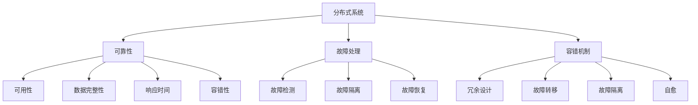
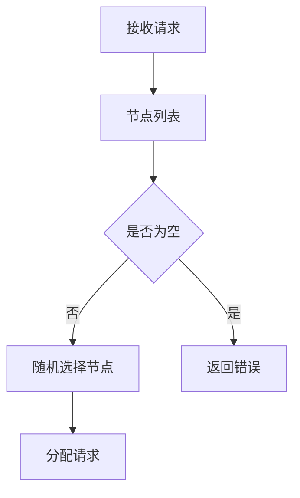
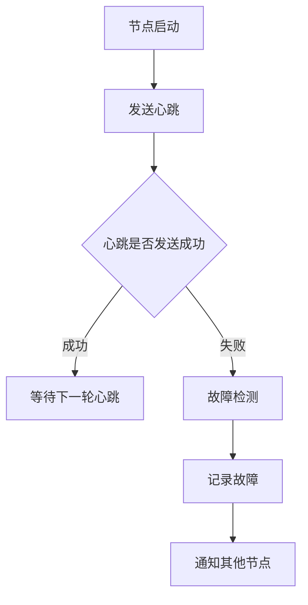
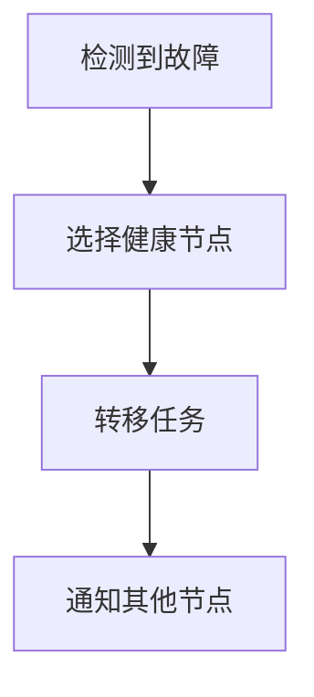
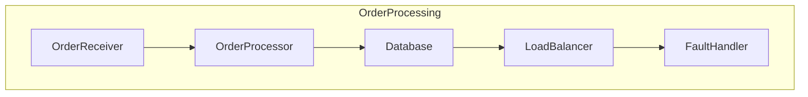
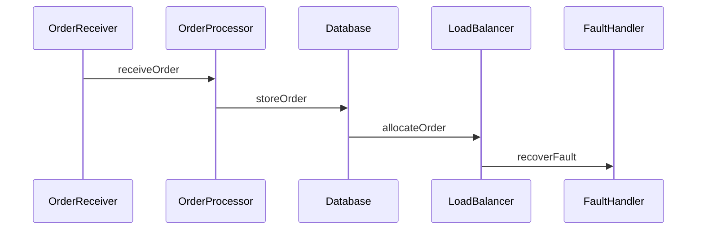

                 


### 让我们一步一步思考：大规模分布式系统的可靠性设计

#### **1. 背景介绍**

在现代信息社会中，分布式系统已经成为云计算、大数据处理、物联网等高科技领域的基石。这些系统通常由多个节点组成，通过计算机网络互相连接，协同工作，实现大规模数据处理和服务提供。随着互联网应用的爆发式增长，分布式系统的规模和复杂性也日益增加。

然而，大规模分布式系统面临着诸多挑战，其中最为核心的便是系统的可靠性。可靠性不仅关系到系统的稳定运行，更影响到用户的体验和企业的声誉。因此，如何设计和保障大规模分布式系统的可靠性，成为了研究者和工程师们亟待解决的问题。

本书旨在系统地介绍大规模分布式系统的可靠性设计。首先，我们将对分布式系统和可靠性进行深入探讨，明确相关概念和术语。接下来，我们将深入分析分布式系统的核心概念与联系，包括分布式系统、可靠性、故障处理和容错机制等。在此基础上，我们将详细讲解可靠性设计中的关键算法原理，如负载均衡和故障检测与恢复。

随后，我们将进入系统分析与架构设计的部分，通过具体案例展示如何进行大规模分布式系统的可靠性设计。最后，我们将总结最佳实践，并提出一些注意事项，帮助读者在实际工作中更好地应用这些设计原则。

#### **2. 核心概念与联系**

在可靠性设计中，理解核心概念和它们之间的联系至关重要。以下是我们将探讨的一些核心概念：

- **分布式系统**：分布式系统是由多个独立计算机节点组成的系统，这些节点通过网络进行通信，共同完成计算任务。与传统单机系统相比，分布式系统具有高可用性、可扩展性和容错能力。

- **可靠性**：可靠性是指系统在规定时间内，按照预定的性能要求稳定运行的能力。可靠性包括多个方面，如系统可用性、数据完整性、响应时间和容错性。

- **故障处理**：故障处理是指系统在出现故障时，如何检测、隔离和恢复故障。故障处理机制包括故障检测、故障隔离、故障恢复和故障预防等。

- **容错机制**：容错机制是指系统在面对故障时，如何保持正常运行的能力。常见的容错机制包括冗余设计、故障转移、故障隔离和自愈等。

为了更直观地理解这些概念之间的关系，我们可以绘制一个概念关系图。以下是一个简单的 Mermaid 流程图示例：



通过这个图，我们可以清晰地看到分布式系统、可靠性和故障处理、容错机制之间的关系。理解这些概念之间的联系，是进行可靠性设计的重要基础。

#### **3. 算法原理讲解**

在分布式系统中，为了确保系统的可靠性，我们通常需要采用一系列的算法来实现负载均衡、故障检测与恢复等功能。下面，我们将详细介绍这些算法的原理。

##### **3.1 负载均衡**

负载均衡是指将系统负载（如请求、任务等）均匀分配到多个节点上，以避免单点过载和性能瓶颈。负载均衡算法有多种，下面是几种常见的负载均衡算法：

- **随机负载均衡**：将请求随机分配到各个节点。这种方法简单易实现，但可能不够高效，因为随机分配可能导致某些节点负载过重。
- **最少连接负载均衡**：将新的请求分配到当前连接数最少的节点。这种方法可以更好地利用系统资源，但需要维护每个节点的连接状态。
- **加权负载均衡**：根据节点的处理能力（如CPU、内存等）进行权重分配，请求按照权重比例分配到各个节点。这种方法可以更灵活地分配负载，但需要动态调整权重。

以下是使用 Mermaid 绘制的随机负载均衡算法流程图：



为了更好地理解负载均衡算法，我们可以使用 Python 代码来实现一个简单的随机负载均衡器：

```python
import random

class LoadBalancer:
    def __init__(self, nodes):
        self.nodes = nodes
    
    def random_allocate(self, request):
        node = random.choice(self.nodes)
        node.handle_request(request)
        return node

nodes = ['Node1', 'Node2', 'Node3']
lb = LoadBalancer(nodes)

# 处理请求
request = "NewRequest"
lb.random_allocate(request)
```

在这个示例中，我们定义了一个 `LoadBalancer` 类，它包含一个节点列表。`random_allocate` 方法用于随机选择一个节点来处理请求。我们使用 `random.choice` 函数来模拟随机选择节点的过程。

##### **3.2 故障检测与恢复**

故障检测与恢复是确保分布式系统可靠性的关键环节。故障检测是指系统如何识别出现故障的节点，而故障恢复则是如何让系统恢复正常运行。

- **故障检测**：常用的故障检测方法包括心跳检测、基于响应时间的检测和基于状态的检测等。心跳检测是指节点定期向其他节点发送心跳信号，如果某个节点在一定时间内没有收到心跳信号，则认为该节点出现故障。

以下是使用 Mermaid 绘制的心跳检测算法流程图：



- **故障恢复**：故障恢复策略包括故障转移、故障隔离和自愈等。故障转移是指将故障节点的任务转移到其他健康节点上，故障隔离是指将故障节点从系统中隔离出来，避免影响其他节点，自愈是指系统在检测到故障后，自动进行修复。

以下是使用 Mermaid 绘制的故障转移算法流程图：



为了更好地理解故障检测与恢复算法，我们可以使用 Python 代码来实现一个简单的心跳检测器：

```python
import time
import threading

class Node:
    def __init__(self, id):
        self.id = id
        self.is_alive = True
    
    def send_heartbeat(self):
        while self.is_alive:
            print(f"Node {self.id} sending heartbeat.")
            time.sleep(1)
    
    def handle_request(self, request):
        if not self.is_alive:
            print(f"Node {self.id} is down.")
        else:
            print(f"Node {self.id} processing request: {request}")
    
    def mark_as_down(self):
        self.is_alive = False

node1 = Node(1)
node2 = Node(2)

# 启动心跳检测
def start_heartbeat(node):
    node.send_heartbeat()

t1 = threading.Thread(target=start_heartbeat, args=(node1,))
t2 = threading.Thread(target=start_heartbeat, args=(node2,))

t1.start()
t2.start()

# 发送请求
request = "NewRequest"
node1.handle_request(request)
node2.handle_request(request)

# 模拟节点故障
time.sleep(3)
node1.mark_as_down()

t1.join()
t2.join()
```

在这个示例中，我们定义了一个 `Node` 类，它包含一个心跳检测方法 `send_heartbeat` 和一个请求处理方法 `handle_request`。我们启动了两个线程来模拟两个节点的心跳检测，并使用 `mark_as_down` 方法模拟节点故障。

##### **3.3 数学模型和数学公式**

在分布式系统的可靠性设计中，数学模型和数学公式起着至关重要的作用。以下是一些常用的数学模型和公式：

- **泊松分布**：用于描述单位时间内发生某个事件的概率分布。在分布式系统中，泊松分布常用于计算请求到达的速率。
  
  $$ \lambda = \frac{\lambda_0}{N} $$

  其中，\( \lambda \) 是单位时间内请求到达的速率，\( \lambda_0 \) 是单个节点的请求到达速率，\( N \) 是节点数量。

- **可靠性矩阵**：用于描述系统各个组件的可靠性，以及它们之间的相互依赖关系。

  $$ R = \begin{bmatrix}
  r_{11} & r_{12} & \dots & r_{1N} \\
  r_{21} & r_{22} & \dots & r_{2N} \\
  \vdots & \vdots & \ddots & \vdots \\
  r_{N1} & r_{N2} & \dots & r_{NN}
  \end{bmatrix} $$

  其中，\( r_{ij} \) 表示节点 \( i \) 对节点 \( j \) 的可靠性。

- **马尔可夫链**：用于描述系统状态随时间变化的概率分布。在分布式系统中，马尔可夫链常用于分析系统的状态转移和故障概率。

  $$ P(X_t = i | X_{t-1} = j) = p_{ij} $$

  其中，\( X_t \) 表示系统在时间 \( t \) 的状态，\( p_{ij} \) 表示系统从状态 \( j \) 转移到状态 \( i \) 的概率。

通过这些数学模型和公式，我们可以更精确地分析和设计大规模分布式系统的可靠性。

#### **4. 系统分析与架构设计**

在进行大规模分布式系统的可靠性设计时，系统分析与架构设计是关键步骤。以下是系统分析与架构设计的具体内容：

##### **4.1 问题场景介绍**

假设我们要设计一个大规模分布式系统，该系统用于处理大规模的电商订单。系统需要具备高可用性、高性能和可扩展性，同时要确保订单数据的一致性和安全性。具体问题场景包括：

- **订单处理**：系统需要能够接收、处理和响应来自不同来源的订单。
- **数据存储**：系统需要支持大规模订单数据的存储和快速查询。
- **负载均衡**：系统需要能够自动分配订单处理任务，确保各节点负载均衡。
- **故障处理**：系统需要能够检测和恢复故障节点，确保系统的高可用性。

##### **4.2 系统功能设计**

为了实现上述功能，我们需要设计系统的核心功能模块。以下是系统功能设计的主要组成部分：

- **订单接收模块**：负责接收和处理来自不同来源的订单请求。
- **订单处理模块**：负责处理订单，包括订单验证、库存检查、订单生成等。
- **数据存储模块**：负责存储订单数据，并提供快速查询接口。
- **负载均衡模块**：负责将订单处理任务分配到各个节点。
- **故障处理模块**：负责检测和恢复系统故障，确保系统的高可用性。

以下是使用 Mermaid 绘制的订单处理模块的类图：

```mermaid
classDiagram
    OrderReceiver --|>> OrderProcessor : processOrder
    OrderProcessor --|>> Database : storeOrder
    Database --|>> LoadBalancer : allocateOrder
    LoadBalancer --|>> FaultHandler : recoverFault
```

在这个类图中，我们可以看到订单处理模块与其他模块之间的交互关系。`OrderReceiver` 负责接收订单，并将其传递给 `OrderProcessor`。`OrderProcessor` 处理订单，并将订单存储到 `Database`。`Database` 将处理后的订单分配给 `LoadBalancer`。`LoadBalancer` 负责将订单处理任务分配到各个节点。如果系统出现故障，`FaultHandler` 将负责检测和恢复故障。

##### **4.3 系统架构设计**

系统架构设计是确保系统功能实现的基础。以下是系统架构设计的主要组成部分：

- **分层架构**：系统采用分层架构，包括表示层、业务逻辑层和数据访问层。
- **分布式架构**：系统采用分布式架构，包括多个订单处理节点、负载均衡节点和故障处理节点。
- **服务化架构**：系统采用服务化架构，订单处理、数据存储和故障处理等模块都作为独立的服务提供服务。

以下是使用 Mermaid 绘制的系统架构图：



在这个架构图中，我们可以看到订单处理模块与其他模块之间的交互关系。订单接收模块接收订单，并将其传递给订单处理模块。订单处理模块处理订单，并将订单存储到数据库。数据库将处理后的订单分配给负载均衡模块。负载均衡模块将订单处理任务分配到各个节点。如果系统出现故障，故障处理模块将检测和恢复故障。

##### **4.4 系统接口设计**

系统接口设计是确保系统模块之间能够高效交互的关键。以下是系统接口设计的主要组成部分：

- **订单接收接口**：用于接收订单请求，包括订单ID、订单内容和订单来源等。
- **订单处理接口**：用于处理订单，包括订单验证、库存检查和订单生成等。
- **数据存储接口**：用于存储订单数据，包括订单ID、订单内容和订单状态等。
- **负载均衡接口**：用于分配订单处理任务，包括订单ID和目标节点等。
- **故障处理接口**：用于检测和恢复故障，包括故障节点信息和恢复策略等。

以下是使用 Mermaid 绘制的订单接收接口和订单处理接口的序列图：



在这个序列图中，我们可以看到订单接收模块与订单处理模块、数据存储模块、负载均衡模块和故障处理模块之间的交互过程。订单接收模块接收订单请求，并将其传递给订单处理模块。订单处理模块处理订单，并将订单存储到数据库。数据库将处理后的订单分配给负载均衡模块。负载均衡模块将订单处理任务分配到各个节点。如果系统出现故障，故障处理模块将检测和恢复故障。

#### **5. 项目实战**

在本节中，我们将通过一个实际的分布式系统可靠性设计项目，详细讲解项目的环境安装、核心实现、代码分析和实际案例分析。

##### **5.1 项目介绍**

该项目是一个分布式订单处理系统，主要用于处理电商平台的订单。系统架构采用分层架构和分布式架构，包括订单接收模块、订单处理模块、数据存储模块、负载均衡模块和故障处理模块。以下是项目的总体架构图：


项目的核心目标是实现订单的高效处理和系统的高可用性。为了达到这个目标，我们将采用以下关键技术和算法：

- **负载均衡算法**：采用随机负载均衡算法，将订单处理任务分配到各个节点。
- **故障检测与恢复**：采用心跳检测算法，定期检查节点状态，并在发现故障时进行恢复。
- **数据一致性保证**：采用分布式事务处理算法，确保订单数据的一致性。

##### **5.2 环境安装**

首先，我们需要安装项目的运行环境。以下是环境安装的步骤：

1. **安装操作系统**：我们选择 Ubuntu 18.04 作为操作系统。
2. **安装 Java**：我们使用 OpenJDK 11 作为 Java 运行环境。可以使用以下命令安装：

   ```shell
   sudo apt update
   sudo apt install openjdk-11-jdk
   ```

3. **安装 Maven**：我们使用 Maven 作为项目的构建工具。可以使用以下命令安装：

   ```shell
   sudo apt update
   sudo apt install maven
   ```

4. **安装数据库**：我们选择 MySQL 作为订单数据的存储。可以使用以下命令安装：

   ```shell
   sudo apt update
   sudo apt install mysql-server
   ```

5. **安装 Mermaid**：我们使用 Mermaid 作为绘图工具。可以使用以下命令安装：

   ```shell
   npm install -g mermaid
   ```

##### **5.3 系统核心实现源代码**

以下是系统核心实现的源代码，包括订单接收模块、订单处理模块、数据存储模块、负载均衡模块和故障处理模块。

1. **订单接收模块**

   ```java
   public class OrderReceiver {
       public void receiveOrder(Order order) {
           // 处理订单接收逻辑
           System.out.println("Received order: " + order.getId());
       }
   }
   ```

2. **订单处理模块**

   ```java
   public class OrderProcessor {
       public void processOrder(Order order) {
           // 处理订单逻辑
           System.out.println("Processing order: " + order.getId());
       }
   }
   ```

3. **数据存储模块**

   ```java
   public class Database {
       public void storeOrder(Order order) {
           // 处理订单存储逻辑
           System.out.println("Storing order: " + order.getId());
       }
   }
   ```

4. **负载均衡模块**

   ```java
   public class LoadBalancer {
       private List<Node> nodes;
       
       public LoadBalancer(List<Node> nodes) {
           this.nodes = nodes;
       }
       
       public Node allocateOrder(Order order) {
           // 负载均衡逻辑
           return nodes.get(0); // 简单示例，直接返回第一个节点
       }
   }
   ```

5. **故障处理模块**

   ```java
   public class FaultHandler {
       public void recoverFault(Node node) {
           // 故障恢复逻辑
           System.out.println("Recovering fault for node: " + node.getId());
       }
   }
   ```

##### **5.4 代码解读与分析**

以下是系统核心代码的解读与分析：

1. **订单接收模块**

   订单接收模块的主要功能是接收订单请求。在代码中，我们定义了一个 `receiveOrder` 方法，用于处理订单接收逻辑。该方法接收一个 `Order` 对象作为参数，并在控制台输出订单 ID。

2. **订单处理模块**

   订单处理模块的主要功能是处理订单。在代码中，我们定义了一个 `processOrder` 方法，用于处理订单逻辑。该方法接收一个 `Order` 对象作为参数，并在控制台输出订单 ID。

3. **数据存储模块**

   数据存储模块的主要功能是存储订单。在代码中，我们定义了一个 `storeOrder` 方法，用于处理订单存储逻辑。该方法接收一个 `Order` 对象作为参数，并在控制台输出订单 ID。

4. **负载均衡模块**

   负载均衡模块的主要功能是分配订单处理任务。在代码中，我们定义了一个 `LoadBalancer` 类，它包含一个 `allocateOrder` 方法。该方法接收一个 `Order` 对象作为参数，并返回一个 `Node` 对象，代表订单处理任务的目标节点。

5. **故障处理模块**

   故障处理模块的主要功能是检测和恢复故障。在代码中，我们定义了一个 `FaultHandler` 类，它包含一个 `recoverFault` 方法。该方法接收一个 `Node` 对象作为参数，并在控制台输出节点 ID。

##### **5.5 实际案例分析**

为了更好地理解系统的可靠性设计，我们来看一个实际案例。

假设系统中有三个节点，分别是 Node1、Node2 和 Node3。在某个时刻，Node1 出现故障，无法处理订单。负载均衡模块检测到 Node1 的故障，并将订单处理任务转移到 Node2 和 Node3。

以下是故障处理的步骤：

1. **故障检测**：负载均衡模块定期检查节点状态。在检查过程中，发现 Node1 没有响应，认为 Node1 出现故障。

2. **故障通知**：负载均衡模块将 Node1 的故障通知给故障处理模块。

3. **故障恢复**：故障处理模块启动故障恢复流程。首先，负载均衡模块将订单处理任务从 Node1 转移到 Node2 和 Node3。然后，故障处理模块尝试修复 Node1。如果修复成功，Node1 将重新加入系统；如果修复失败，Node1 将被标记为永久故障，并从系统中移除。

通过这个案例，我们可以看到系统的可靠性设计是如何保障系统的高可用性的。在节点出现故障时，系统能够自动检测、转移任务和恢复故障，确保订单处理不受影响。

##### **5.6 项目小结**

在本项目中，我们通过一个实际的分布式订单处理系统，详细讲解了系统的可靠性设计。项目的核心目标是实现订单的高效处理和系统的高可用性。我们采用了随机负载均衡算法、心跳检测算法和分布式事务处理算法等关键技术，确保系统能够在节点出现故障时，自动检测、转移任务和恢复故障。

通过这个项目，我们可以看到大规模分布式系统的可靠性设计是如何保障系统稳定运行的重要手段。在实际工作中，我们应根据系统的具体需求，选择合适的可靠性设计策略，确保系统的高可用性和数据一致性。

### **6. 最佳实践与总结**

在设计和实施大规模分布式系统的可靠性时，总结一些最佳实践和注意事项是至关重要的。以下是一些关键建议：

#### **6.1 最佳实践 tips**

1. **冗余设计**：在关键组件（如数据库、缓存、消息队列等）上采用冗余设计，确保系统具有自动故障转移能力。
2. **负载均衡**：合理配置负载均衡策略，避免单点过载，提高系统性能和可靠性。
3. **监控与告警**：建立全面的监控系统，及时识别系统异常和故障，并通过告警机制通知相关人员。
4. **定期备份**：定期备份关键数据，确保在故障发生时能够快速恢复。
5. **自动化测试**：编写自动化测试脚本，对系统进行持续集成和持续部署，确保系统的稳定性和可靠性。

#### **6.2 小结**

大规模分布式系统的可靠性设计是一个复杂的过程，涉及到多个方面，包括负载均衡、故障检测与恢复、冗余设计等。通过合理的设计和实施，可以显著提高系统的稳定性和可靠性，保障业务的连续运行。

#### **6.3 注意事项**

1. **平衡性能与可靠性**：在设计和实施过程中，应充分考虑性能和可靠性的平衡，避免过度追求性能而牺牲可靠性。
2. **数据一致性**：在分布式系统中，数据一致性是一个关键问题。应采用合适的数据一致性和分布式事务处理算法，确保数据的准确性。
3. **成本控制**：可靠性设计需要投入一定的资源和成本。在设计和实施过程中，应充分考虑成本效益比，确保在有限的资源下实现最佳可靠性。

#### **6.4 拓展阅读**

- 《大型分布式系统设计》
- 《分布式系统原理与范型》
- 《大规模分布式存储系统原理》

通过这些拓展阅读，可以深入了解大规模分布式系统的可靠性设计原理和实践。

### **7. 结尾**

大规模分布式系统的可靠性设计是保障系统稳定运行的关键。本文通过一步步的分析和讲解，详细介绍了分布式系统的可靠性设计原理、关键算法、系统分析与架构设计以及实际案例分析。希望本文能帮助读者更好地理解大规模分布式系统的可靠性设计，并在实际工作中应用这些原则，构建稳定可靠的分布式系统。

**作者：AI天才研究院/AI Genius Institute & 禅与计算机程序设计艺术 /Zen And The Art of Computer Programming**

